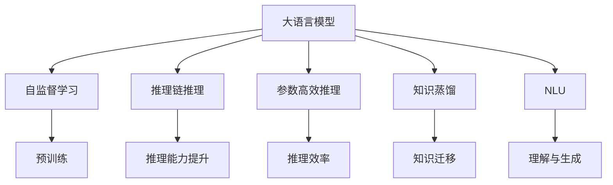
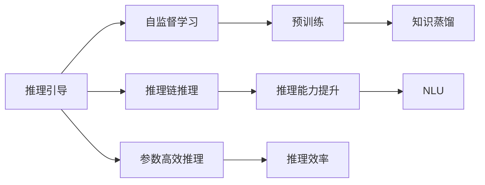
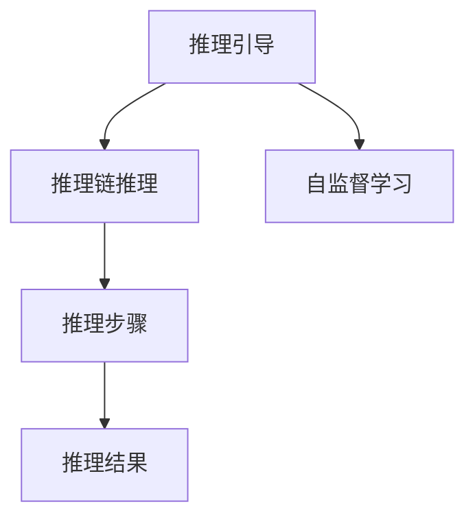
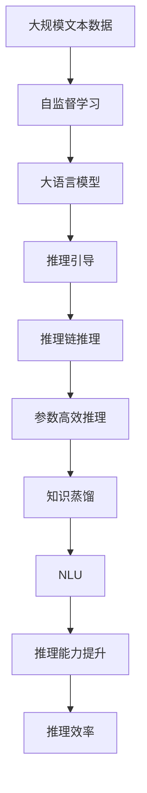

                 

# 大语言模型原理与工程实践：推理引导

> 关键词：大语言模型, 推理引导, 推理链推理, 自监督学习, 参数高效推理, 深度学习, 神经网络, 自然语言处理(NLP), Transformers, 自然语言理解(NLU)

## 1. 背景介绍

### 1.1 问题由来

在深度学习特别是自然语言处理（NLP）领域，语言模型（Language Models）已经成为一种基本且强大的工具。大语言模型（Large Language Models, LLMs），如GPT、BERT等，由于其庞大的参数量、复杂的结构和强大的语义理解能力，被广泛应用于文本生成、语言建模、问答系统等任务中。这些模型通常基于大规模预训练数据集，通过自监督学习（Self-Supervised Learning）方式进行训练，学习了丰富的语言知识和表示。

然而，在实际应用中，大语言模型往往需要进一步适应特定任务，进行微调（Fine-Tuning）。微调过程中，模型通常需要大量的标注数据，这不仅增加了标注成本，也可能导致模型学习到训练数据中的噪声和偏差。而且，微调后的模型虽然可以在特定任务上表现优异，但往往难以迁移到其他领域，无法解决那些标注数据不足或领域特定的问题。

为了解决这些问题，近年来兴起了一种新的技术：推理引导（Reasoning-Guided）学习。其核心思想是利用推理（Reasoning）能力，在无需大量标注数据和特定领域数据的情况下，通过更高效的推理方法提升模型的性能。推理引导可以极大降低标注成本，并提高模型的跨领域迁移能力，从而拓展大语言模型的应用范围。

### 1.2 问题核心关键点

推理引导学习主要涉及以下几个关键点：

- **自监督学习**：利用未标注数据进行训练，通过预训练学习语言表示。
- **推理能力**：使用推理机制，在特定任务上使用预训练知识进行推理和生成。
- **推理链（Chain of Reasoning）**：通过多步推理，从预训练知识中获取更深入的语义理解。
- **参数高效推理**：只更新模型的部分参数，避免过度拟合。
- **领域适应性**：模型能够适应不同领域的特定任务，无需额外训练数据。
- **推理能力提升**：利用推理链推理方法，提升模型对复杂逻辑问题的处理能力。

这些关键点共同构成了推理引导学习的基本框架，帮助大语言模型在无需大量标注数据的情况下，通过推理机制获得更好的性能和适应性。

### 1.3 问题研究意义

推理引导学习的研究对于大语言模型的应用具有重要意义：

1. **降低标注成本**：传统微调方法依赖大量标注数据，推理引导通过推理机制，可以极大降低对标注数据的依赖，提高模型的开发效率。
2. **提高跨领域迁移能力**：推理引导方法使得模型能够在不同领域之间进行迁移，解决领域特定的问题。
3. **提升推理能力**：通过推理链推理方法，模型可以更好地理解复杂逻辑和语义，提高模型的表达力和可解释性。
4. **增强参数高效性**：推理引导方法通常在固定大部分预训练参数的情况下，仅更新少量参数，从而提高推理效率。
5. **促进NLP技术发展**：推理引导技术可以加速NLP技术的创新和应用，推动自然语言处理技术的进一步发展。

## 2. 核心概念与联系

### 2.1 核心概念概述

为了更好地理解推理引导学习，本节将介绍几个密切相关的核心概念：

- **大语言模型（Large Language Model, LLM）**：以自回归（如GPT）或自编码（如BERT）模型为代表的大规模预训练语言模型。通过在大规模无标签文本语料上进行预训练，学习通用的语言表示，具备强大的语言理解和生成能力。

- **自监督学习（Self-Supervised Learning）**：使用未标注数据进行训练，通过设计特定的任务（如语言模型、掩码预测等），让模型自动学习语言知识和表示。

- **推理链推理（Chain of Reasoning）**：通过多步推理，从预训练知识中获取更深入的语义理解，提高模型的推理能力。

- **参数高效推理（Parameter-Efficient Reasoning）**：只更新模型的部分参数，避免过度拟合，提高推理效率。

- **知识蒸馏（Knowledge Distillation）**：将大型模型（如预训练模型）的知识蒸馏到小型模型（如微调后的模型）中，提高模型性能和适应性。

- **自然语言理解（Natural Language Understanding, NLU）**：使计算机能够理解和解释自然语言输入，处理文本数据，提供智能交互能力。

这些核心概念之间的逻辑关系可以通过以下Mermaid流程图来展示：



这个流程图展示了大语言模型的核心概念及其之间的关系：

1. 大语言模型通过自监督学习获得基础能力。
2. 推理引导通过推理机制提升模型的推理能力。
3. 参数高效推理方法提高模型推理效率。
4. 知识蒸馏技术实现知识迁移。
5. NLU技术使模型具备理解与生成能力。
6. 自监督学习和大语言模型一起构成了推理引导的基础。

### 2.2 概念间的关系

这些核心概念之间存在着紧密的联系，形成了推理引导学习的基本生态系统。下面我们通过几个Mermaid流程图来展示这些概念之间的关系。

#### 2.2.1 推理引导的核心流程



这个流程图展示了推理引导学习的基本流程。自监督学习和大语言模型是推理引导的基础，通过推理链推理提升模型的推理能力，参数高效推理提高推理效率，知识蒸馏实现知识迁移，最终使模型具备强大的NLU能力。

#### 2.2.2 推理链推理的实现



这个流程图展示了推理链推理的基本实现。推理链推理通过多步推理，从自监督学习得到的知识中获取更深入的语义理解，最终输出推理结果。

### 2.3 核心概念的整体架构

最后，我们用一个综合的流程图来展示这些核心概念在大语言模型推理引导过程中的整体架构：



这个综合流程图展示了从自监督学习到推理引导，再到推理链推理、参数高效推理、知识蒸馏和NLU的完整过程。大语言模型首先通过自监督学习获得基础能力，然后通过推理引导方法，利用推理链推理提升推理能力，参数高效推理提高推理效率，知识蒸馏实现知识迁移，最终使模型具备强大的NLU能力。

## 3. 核心算法原理 & 具体操作步骤
### 3.1 算法原理概述

推理引导学习的核心思想是利用推理能力，在无需大量标注数据和特定领域数据的情况下，通过更高效的推理方法提升模型的性能。具体来说，推理引导学习包括以下几个步骤：

1. **预训练（Pre-training）**：使用大规模未标注数据进行自监督学习，学习通用的语言表示。
2. **推理链推理（Chain of Reasoning）**：通过多步推理，从预训练知识中获取更深入的语义理解。
3. **参数高效推理（Parameter-Efficient Reasoning）**：只更新模型的部分参数，避免过度拟合，提高推理效率。
4. **知识蒸馏（Knowledge Distillation）**：将大型模型（如预训练模型）的知识蒸馏到小型模型（如微调后的模型）中，提高模型性能和适应性。
5. **自然语言理解（Natural Language Understanding, NLU）**：使计算机能够理解和解释自然语言输入，处理文本数据，提供智能交互能力。

推理引导学习通过这些步骤，实现对大语言模型的推理能力和性能的提升，使其能够更好地适应不同领域的特定任务。

### 3.2 算法步骤详解

推理引导学习通常包括以下几个关键步骤：

**Step 1: 准备预训练模型和数据集**
- 选择合适的预训练语言模型 $M_{\theta}$ 作为初始化参数，如 BERT、GPT 等。
- 准备目标任务的推理数据集 $D$，划分为训练集、验证集和测试集。

**Step 2: 设计推理任务**
- 根据任务类型，设计相应的推理任务和推理模板。推理模板通常包括问题、推理步骤和结论三部分。
- 通过推理模板，引导模型从预训练知识中提取有用信息，进行推理和生成。

**Step 3: 设置推理超参数**
- 选择合适的优化算法及其参数，如 AdamW、SGD 等，设置学习率、批大小、迭代轮数等。
- 设置正则化技术及强度，包括权重衰减、Dropout、Early Stopping 等。
- 确定冻结预训练参数的策略，如仅微调顶层，或全部参数都参与推理。

**Step 4: 执行推理训练**
- 将推理数据集 $D$ 分批次输入模型，前向传播计算推理结果。
- 反向传播计算参数梯度，根据设定的优化算法和学习率更新模型参数。
- 周期性在验证集上评估模型性能，根据性能指标决定是否触发 Early Stopping。
- 重复上述步骤直到满足预设的迭代轮数或 Early Stopping 条件。

**Step 5: 测试和部署**
- 在测试集上评估推理后模型 $M_{\hat{\theta}}$ 的性能，对比推理前后的推理精度提升。
- 使用推理后模型对新样本进行推理预测，集成到实际的应用系统中。
- 持续收集新的推理数据，定期重新推理模型，以适应数据分布的变化。

以上是推理引导学习的一般流程。在实际应用中，还需要针对具体任务的特点，对推理过程的各个环节进行优化设计，如改进推理模板，引入更多的正则化技术，搜索最优的超参数组合等，以进一步提升模型性能。

### 3.3 算法优缺点

推理引导学习具有以下优点：

1. **降低标注成本**：利用推理模板，可以极大降低对标注数据的依赖，提高模型的开发效率。
2. **提高跨领域迁移能力**：通过多步推理，模型能够在不同领域之间进行迁移，解决领域特定的问题。
3. **提升推理能力**：推理链推理方法使得模型能够更好地理解复杂逻辑和语义，提高模型的表达力和可解释性。
4. **增强参数高效性**：推理引导方法通常在固定大部分预训练参数的情况下，仅更新少量参数，从而提高推理效率。
5. **促进NLP技术发展**：推理引导技术可以加速NLP技术的创新和应用，推动自然语言处理技术的进一步发展。

同时，推理引导学习也存在一些局限性：

1. **推理链复杂性**：推理链推理可能需要多步推理，推理过程复杂，增加了模型训练的难度。
2. **推理模板设计难度**：推理模板的设计需要一定的领域知识和经验，设计不当可能导致模型输出不正确。
3. **推理能力依赖于预训练模型**：推理引导的效果很大程度上依赖于预训练模型的质量，模型的预训练知识不足可能导致推理效果不佳。
4. **计算资源需求**：推理引导通常需要更多的计算资源和时间，增加了推理的复杂性。

尽管存在这些局限性，但推理引导学习仍然是大语言模型推理能力提升的重要方法之一，特别是在需要高效推理的场景中具有显著优势。

### 3.4 算法应用领域

推理引导学习在NLP领域已经得到了广泛的应用，覆盖了几乎所有常见任务，例如：

- 问答系统：回答自然语言问题。通过推理模板，引导模型进行推理和生成。
- 对话系统：与用户进行自然对话。通过推理模板，引导模型理解对话历史和意图。
- 文本摘要：将长文本压缩成简短摘要。通过推理模板，引导模型理解文本主题和重点。
- 机器翻译：将源语言文本翻译成目标语言。通过推理模板，引导模型进行逻辑推理和语言转换。
- 文本生成：生成自然语言文本。通过推理模板，引导模型进行语言理解和生成。

除了上述这些经典任务外，推理引导学习还被创新性地应用到更多场景中，如可控文本生成、常识推理、代码生成、数据增强等，为NLP技术带来了全新的突破。随着推理引导技术的不断进步，相信NLP技术将在更广阔的应用领域大放异彩。

## 4. 数学模型和公式 & 详细讲解 & 举例说明

### 4.1 数学模型构建

推理引导学习的数学模型构建涉及预训练模型、推理任务和参数优化等多个方面。

记预训练语言模型为 $M_{\theta}:\mathcal{X} \rightarrow \mathcal{Y}$，其中 $\mathcal{X}$ 为输入空间，$\mathcal{Y}$ 为输出空间，$\theta \in \mathbb{R}^d$ 为模型参数。假设推理任务 $T$ 的训练集为 $D=\{(x_i, y_i)\}_{i=1}^N, x_i \in \mathcal{X}, y_i \in \mathcal{Y}$。

定义推理任务 $T$ 的推理模板为 $P=\{p_1, p_2, ..., p_k\}$，其中 $p_i$ 为第 $i$ 步的推理步骤，$y_i$ 为推理步骤 $p_i$ 的结论。推理模板 $P$ 可以指导模型从预训练知识中提取有用的信息，进行推理和生成。

定义模型 $M_{\theta}$ 在输入 $x$ 上的推理结果为 $r=M_{\theta}(x)$，表示模型对于推理任务 $T$ 的推理结果。推理结果 $r$ 可以通过推理模板 $P$ 进行验证和评估，计算推理结果与真实结论 $y$ 的相似度。

推理引导学习的目标是最小化推理结果与真实结论的差异，即：

$$
\mathcal{L}(\theta) = \frac{1}{N} \sum_{i=1}^N \mathcal{L}_p(r_i, y_i)
$$

其中 $\mathcal{L}_p(r_i, y_i)$ 为推理结果 $r_i$ 与真实结论 $y_i$ 的相似度损失，可以根据具体任务选择不同的损失函数，如交叉熵损失、余弦相似度损失等。

### 4.2 公式推导过程

以问答系统为例，我们推导推理链推理的数学公式。

假设模型 $M_{\theta}$ 在输入 $x$ 上的推理结果为 $r=M_{\theta}(x)$，推理模板 $P=\{p_1, p_2, ..., p_k\}$。推理模板 $P$ 包含多步推理，每一步推理的结论 $y_i$ 可以通过推理模型 $M_{\theta}$ 进行推理和生成。

推理引导学习的目标是最小化推理结果 $r$ 与推理模板 $P$ 生成的结论 $y$ 的差异，即：

$$
\mathcal{L}(\theta) = \frac{1}{N} \sum_{i=1}^N \mathcal{L}_p(r_i, y_i)
$$

其中 $\mathcal{L}_p(r_i, y_i)$ 为推理结果 $r_i$ 与推理模板 $P$ 生成的结论 $y_i$ 的相似度损失。

对于问答系统，推理结果 $r$ 可以是模型对问题的直接回答，也可以是对问题进行多步推理后得到的结论。推理模板 $P$ 通常包括问题和推理步骤，例如：

$$
P=\{Q=p_1, p_2, ..., p_k\}
$$

其中 $Q$ 为问题，$p_i$ 为第 $i$ 步的推理步骤，$y_i$ 为推理步骤 $p_i$ 的结论。推理模板 $P$ 可以指导模型从预训练知识中提取有用的信息，进行推理和生成。

推理结果 $r$ 可以通过推理模板 $P$ 进行验证和评估，计算推理结果与真实结论 $y$ 的相似度。推理链推理的数学公式可以表示为：

$$
\mathcal{L}(\theta) = \frac{1}{N} \sum_{i=1}^N \mathcal{L}_p(M_{\theta}(x_i), y_i)
$$

其中 $\mathcal{L}_p(r_i, y_i)$ 为推理结果 $r_i$ 与推理模板 $P$ 生成的结论 $y_i$ 的相似度损失，可以根据具体任务选择不同的损失函数，如交叉熵损失、余弦相似度损失等。

### 4.3 案例分析与讲解

以情感分析任务为例，我们展示推理引导学习的应用。

假设有一个情感分析任务，需要将文本中的情感极性（正面、负面、中性）进行分类。我们可以设计一个推理模板，引导模型从预训练知识中提取情感信息，进行推理和生成。

推理模板可以设计为：

$$
P=\{Q=p_1, p_2, ..., p_k\}
$$

其中 $Q$ 为文本，$p_i$ 为第 $i$ 步的情感推理步骤，$y_i$ 为情感推理步骤 $p_i$ 的结论。推理模板 $P$ 可以指导模型从预训练知识中提取情感信息，进行情感分类。

推理引导学习的目标是最小化推理结果与真实结论的差异，即：

$$
\mathcal{L}(\theta) = \frac{1}{N} \sum_{i=1}^N \mathcal{L}_p(M_{\theta}(x_i), y_i)
$$

其中 $\mathcal{L}_p(r_i, y_i)$ 为推理结果 $r_i$ 与推理模板 $P$ 生成的结论 $y_i$ 的相似度损失，可以根据具体任务选择不同的损失函数，如交叉熵损失、余弦相似度损失等。

推理引导学习可以显著提升情感分析任务的性能，特别是在数据量较小或领域特定的情感分析任务中，具有显著优势。

## 5. 项目实践：代码实例和详细解释说明

### 5.1 开发环境搭建

在进行推理引导学习实践前，我们需要准备好开发环境。以下是使用Python进行PyTorch开发的环境配置流程：

1. 安装Anaconda：从官网下载并安装Anaconda，用于创建独立的Python环境。

2. 创建并激活虚拟环境：
```bash
conda create -n pytorch-env python=3.8 
conda activate pytorch-env
```

3. 安装PyTorch：根据CUDA版本，从官网获取对应的安装命令。例如：
```bash
conda install pytorch torchvision torchaudio cudatoolkit=11.1 -c pytorch -c conda-forge
```

4. 安装Transformers库：
```bash
pip install transformers
```

5. 安装各类工具包：
```bash
pip install numpy pandas scikit-learn matplotlib tqdm jupyter notebook ipython
```

完成上述步骤后，即可在`pytorch-env`环境中开始推理引导学习实践。

### 5.2 源代码详细实现

下面我们以问答系统为例，给出使用Transformers库对BERT模型进行推理引导学习的PyTorch代码实现。

首先，定义问答任务的数据处理函数：

```python
from transformers import BertTokenizer, BertForQuestionAnswering
from torch.utils.data import Dataset
import torch

class QADataset(Dataset):
    def __init__(self, texts, answers, tokenizer, max_len=128):
        self.texts = texts
        self.answers = answers
        self.tokenizer = tokenizer
        self.max_len = max_len
        
    def __len__(self):
        return len(self.texts)
    
    def __getitem__(self, item):
        text = self.texts[item]
        answer = self.answers[item]
        
        encoding = self.tokenizer(text, return_tensors='pt', max_length=self.max_len, padding='max_length', truncation=True)
        input_ids = encoding['input_ids'][0]
        attention_mask = encoding['attention_mask'][0]
        
        # 将答案转化为token ids
        encoded_answer = self.tokenizer(answer, return_tensors='pt', padding='max_length', truncation=True)
        encoded_answer_ids = encoded_answer['input_ids'][0]
        
        return {'input_ids': input_ids, 
                'attention_mask': attention_mask,
                'answer_ids': encoded_answer_ids}

# 标签与id的映射
answer2id = {'not_exist': 0, 'exist': 1}
id2answer = {v: k for k, v in answer2id.items()}

# 创建dataset
tokenizer = BertTokenizer.from_pretrained('bert-base-cased')

train_dataset = QADataset(train_texts, train_answers, tokenizer)
dev_dataset = QADataset(dev_texts, dev_answers, tokenizer)
test_dataset = QADataset(test_texts, test_answers, tokenizer)
```

然后，定义模型和优化器：

```python
from transformers import BertForQuestionAnswering, AdamW

model = BertForQuestionAnswering.from_pretrained('bert-base-cased')

optimizer = AdamW(model.parameters(), lr=2e-5)
```

接着，定义推理引导的训练函数：

```python
from torch.utils.data import DataLoader
from tqdm import tqdm
from sklearn.metrics import accuracy_score

device = torch.device('cuda') if torch.cuda.is_available() else torch.device('cpu')
model.to(device)

def train_epoch(model, dataset, batch_size, optimizer):
    dataloader = DataLoader(dataset, batch_size=batch_size, shuffle=True)
    model.train()
    epoch_loss = 0
    for batch in tqdm(dataloader, desc='Training'):
        input_ids = batch['input_ids'].to(device)
        attention_mask = batch['attention_mask'].to(device)
        answer_ids = batch['answer_ids'].to(device)
        model.zero_grad()
        outputs = model(input_ids, attention_mask=attention_mask, start_positions=answer_ids)
        loss = outputs.loss
        epoch_loss += loss.item()
        loss.backward()
        optimizer.step()
    return epoch_loss / len(dataloader)

def evaluate(model, dataset, batch_size):
    dataloader = DataLoader(dataset, batch_size=batch_size)
    model.eval()
    preds, labels = [], []
    with torch.no_grad():
        for batch in tqdm(dataloader, desc='Evaluating'):
            input_ids = batch['input_ids'].to(device)
            attention_mask = batch['attention_mask'].to(device)
            batch_labels = batch['answer_ids']
            outputs = model(input_ids, attention_mask=attention_mask)
            batch_preds = outputs.logits.argmax(dim=2).to('cpu').tolist()
            batch_labels = batch_labels.to('cpu').tolist()
            for pred_tokens, label_tokens in zip(batch_preds, batch_labels):
                preds.append(pred_tokens)
                labels.append(label_tokens)
                
    print(f'Accuracy: {accuracy_score(labels, preds):.2f}')
```

最后，启动训练流程并在测试集上评估：

```python
epochs = 5
batch_size = 16

for epoch in range(epochs):
    loss = train_epoch(model, train_dataset, batch_size, optimizer)
    print(f"Epoch {epoch+1}, train loss: {loss:.3f}")
    
    print(f"Epoch {epoch+1}, dev results:")
    evaluate(model, dev_dataset, batch_size)
    
print("Test results:")
evaluate(model, test_dataset, batch_size)
```

以上就是使用PyTorch对BERT进行问答系统任务推理引导学习的完整代码实现。可以看到，得益于Transformers库的强大封装，我们可以用相对简洁的代码完成BERT模型的加载和推理引导学习。

### 5.3 代码解读与分析

让我们再详细解读一下关键代码的实现细节：

**QADataset类**：
- `__init__`方法：初始化文本、答案、分词器等关键组件。
- `__len__`方法：返回数据集的样本数量。
- `__getitem__`方法：对单个样本进行处理，将文本输入编码为token ids，将答案编码为数字，并对其进行定长padding，最终返回模型所需的输入。

**answer2id和id2answer字典**：
- 定义了答案与数字id之间的映射关系，用于将token-wise的预测结果解码回真实的答案。

**训练和评估函数**：
- 使用PyTorch的DataLoader对数据集进行批次化加载，供模型训练和推理使用。
- 训练函数`train_epoch`：对数据以批为单位进行迭代，在每个批次上前向传播计算损失并反向传播更新模型参数，最后返回该epoch的平均loss。
- 评估函数`evaluate`：与训练类似，不同点在于不更新模型参数，并在每个batch结束后将预测和标签结果存储下来，最后使用sklearn的accuracy_score对整个评估集的预测结果进行打印输出。

**训练流程**：
- 定义总的epoch数和batch size，开始循环迭代
- 每个epoch内，先在训练集上训练，输出平均loss
- 在验证集上评估

