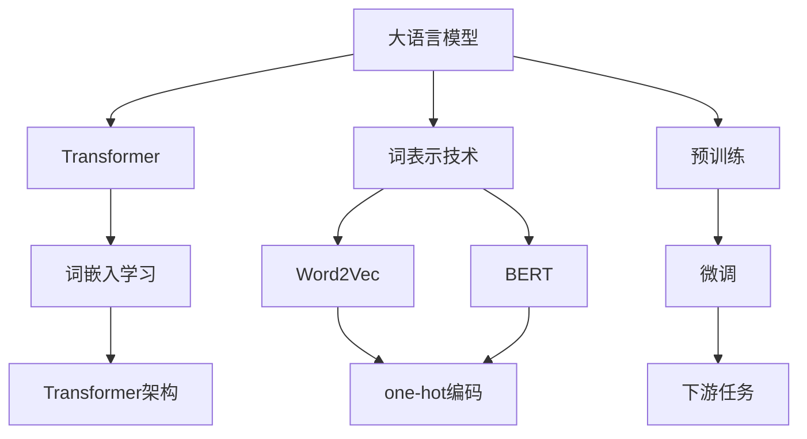
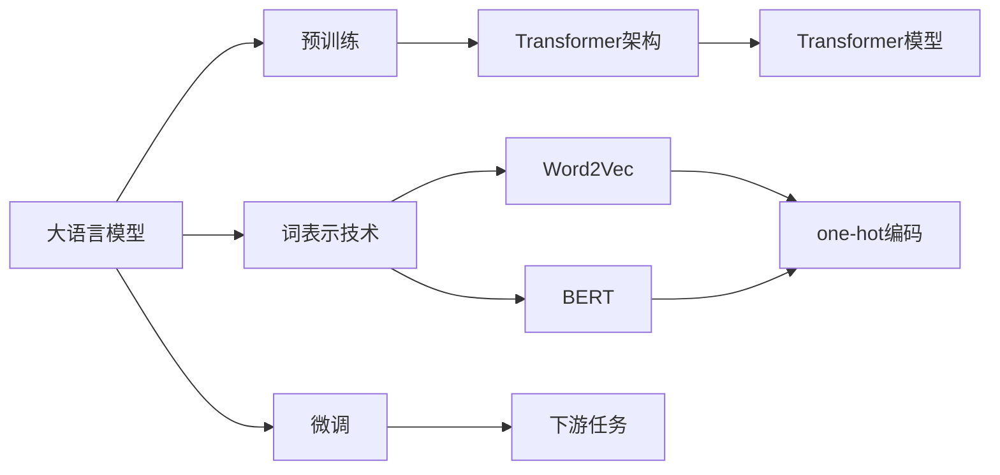
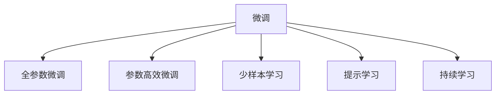
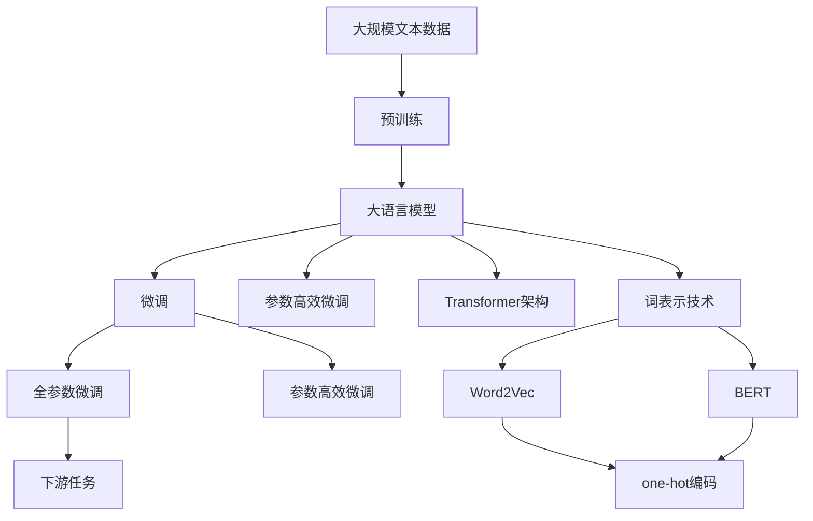

                 

# 大语言模型原理与工程实践：词表示技术

> 关键词：大语言模型,词表示技术,Transformer,BERT,Word2Vec,one-hot编码,词嵌入学习

## 1. 背景介绍

### 1.1 问题由来

随着深度学习技术的不断进步，大语言模型（Large Language Models, LLMs）在自然语言处理（NLP）领域取得了显著突破。这些模型通过在大规模无标签文本数据上进行预训练，学习到丰富的语言知识，能够生成流畅且具有上下文相关性的文本。但如何有效地将语言中的语义信息编码为模型可处理的格式，仍是摆在开发者面前的一个重要问题。

### 1.2 问题核心关键点

词表示技术（Word Embedding）是解决这一问题的关键。通过将自然语言中的单词映射到高维向量空间，使得模型可以更好地理解语义关系，从而提升语言模型的性能。词表示技术的核心在于如何将单词映射为向量，常用的方法包括Word2Vec、GloVe、BERT等。

目前，基于词表示技术的大语言模型微调方法已经在问答、对话、摘要、翻译、情感分析等诸多NLP任务上取得了优异的效果，成为NLP技术落地应用的重要手段。本文将重点探讨词表示技术在构建大语言模型中的应用，特别是Transformer架构中的词嵌入学习。

### 1.3 问题研究意义

研究词表示技术对于拓展大语言模型的应用范围，提升下游任务的性能，加速NLP技术的产业化进程，具有重要意义：

1. 降低应用开发成本。通过词表示技术将预训练模型转换为适合特定任务的语言表示，可以减少从头开发所需的数据、计算和人力等成本投入。
2. 提升模型效果。词表示技术能够捕捉单词之间的语义关系，使得模型在特定任务上的性能提升更为显著。
3. 加速开发进度。在预训练模型的基础上进行微调，可以迅速适应新任务，缩短开发周期。
4. 带来技术创新。词表示技术推动了对预训练-微调的深入研究，催生了提示学习、少样本学习等新的研究方向。
5. 赋能产业升级。词表示技术使得NLP技术更容易被各行各业所采用，为传统行业数字化转型升级提供新的技术路径。

## 2. 核心概念与联系

### 2.1 核心概念概述

为了更好地理解词表示技术在构建大语言模型中的应用，本节将介绍几个密切相关的核心概念：

- **大语言模型（Large Language Model, LLM）**：以自回归（如GPT）或自编码（如BERT）模型为代表的大规模预训练语言模型。通过在大规模无标签文本语料上进行预训练，学习通用的语言表示，具备强大的语言理解和生成能力。

- **词表示技术（Word Embedding）**：将自然语言中的单词映射到高维向量空间的表示技术，使得模型可以捕捉单词之间的语义关系。

- **Transformer**：一种基于自注意力机制的神经网络架构，广泛应用于大语言模型中，能够高效地处理序列数据，并且可以并行计算，速度较快。

- **BERT**：由Google开发的一种预训练语言模型，采用双向掩码语言模型和下一句预测任务，通过在大规模无标签文本数据上进行预训练，学习到丰富的语言知识。

- **Word2Vec**：一种经典的词嵌入学习算法，基于神经网络，通过共现矩阵或者连续词袋模型，将单词映射为高维向量。

- **one-hot编码**：将单词映射为全0向量，仅在一个位置上置为1的向量表示方法，常用于离散化单词表示。

- **词嵌入学习（Word Embedding Learning）**：通过神经网络模型，利用大量文本数据对单词进行学习和训练，生成高维向量表示的技术。

这些核心概念之间的逻辑关系可以通过以下Mermaid流程图来展示：



这个流程图展示了从预训练到微调过程中，各核心概念之间的关系：

1. 大语言模型通过预训练获得基础能力。
2. 词表示技术将单词映射为向量，用于构建Transformer架构。
3. Word2Vec和BERT是常用的词嵌入学习算法。
4. one-hot编码是将单词离散化的简单表示方法。
5. 微调是在预训练模型的基础上，使用下游任务的少量标注数据，通过有监督学习优化模型在特定任务上的性能。

### 2.2 概念间的关系

这些核心概念之间存在着紧密的联系，形成了大语言模型构建的完整生态系统。下面我们通过几个Mermaid流程图来展示这些概念之间的关系。

#### 2.2.1 大语言模型的学习范式



这个流程图展示了从预训练到微调过程中，大语言模型的学习范式：

1. 大语言模型通过预训练获得基础能力。
2. 使用Transformer架构进行序列数据处理。
3. 利用Word2Vec或BERT等词嵌入学习算法对单词进行表示。
4. one-hot编码将单词离散化。
5. 微调使模型适应下游任务。

#### 2.2.2 微调与词表示的关系



这个流程图展示了微调过程中的不同方法：

1. 全参数微调对预训练模型进行全面微调，适用于大规模标注数据。
2. 参数高效微调仅微调部分参数，适用于小规模标注数据。
3. 少样本学习使用少量标注样本，无需微调即可进行推理。
4. 提示学习通过精心设计的输入模板，引导模型进行推理，无需微调参数。
5. 持续学习使模型能够不断学习新数据，保持性能。

### 2.3 核心概念的整体架构

最后，我们用一个综合的流程图来展示这些核心概念在大语言模型构建过程中的整体架构：



这个综合流程图展示了从预训练到微调过程中，大语言模型构建的完整流程：

1. 大语言模型通过预训练获得基础能力。
2. 使用Transformer架构进行序列数据处理。
3. 利用Word2Vec或BERT等词嵌入学习算法对单词进行表示。
4. one-hot编码将单词离散化。
5. 微调使模型适应下游任务。
6. 参数高效微调仅微调部分参数。
7. 全参数微调对预训练模型进行全面微调。
8. 提示学习通过精心设计的输入模板，引导模型进行推理。
9. 持续学习使模型能够不断学习新数据，保持性能。

## 3. 核心算法原理 & 具体操作步骤
### 3.1 算法原理概述

在大语言模型中，词表示技术是通过神经网络模型对单词进行学习，生成高维向量表示。常用的词嵌入学习算法包括Word2Vec、GloVe、FastText等。

Word2Vec算法基于神经网络，通过共现矩阵或连续词袋模型，将单词映射为高维向量。其核心思想是，通过大量文本数据训练，学习单词之间的语义关系，生成具有丰富语义信息的词向量。

BERT算法通过双向掩码语言模型和下一句预测任务，在大规模无标签文本数据上进行预训练，学习到丰富的语言知识。然后通过微调，使模型适应特定的下游任务。

Transformer架构在大语言模型中广泛应用，其核心是自注意力机制，能够高效地处理序列数据，并且可以并行计算。在Transformer中，词嵌入学习是重要的组成部分，通过神经网络模型对单词进行学习和训练，生成高维向量表示。

### 3.2 算法步骤详解

下面是Word2Vec算法的词嵌入学习步骤：

1. **构建共现矩阵**：对于大规模语料库，统计每个单词与其他单词同时出现的次数，构建共现矩阵。

2. **初始化向量**：将每个单词表示为一个高维向量，初始化这些向量。

3. **神经网络训练**：利用神经网络模型，通过共现矩阵对单词向量进行训练，学习单词之间的语义关系。

4. **向量更新**：根据训练结果，更新单词向量，使得语义相近的单词在向量空间中距离较近。

5. **生成词向量**：训练完成后，每个单词生成一个高维向量表示。

下面以BERT算法为例，展示其词嵌入学习的步骤：

1. **预训练**：在大量无标签文本数据上，使用双向掩码语言模型和下一句预测任务进行预训练，学习到丰富的语言知识。

2. **微调**：在特定下游任务上，使用少量标注数据对预训练模型进行微调，适应新的任务需求。

3. **词嵌入学习**：在微调过程中，将单词输入到Transformer模型中，通过自注意力机制和多层全连接层进行学习，生成高维向量表示。

4. **向量更新**：根据微调任务，更新单词向量，使得模型对特定任务有更好的理解。

5. **生成词向量**：微调完成后，每个单词生成一个高维向量表示。

### 3.3 算法优缺点

词嵌入学习技术具有以下优点：

1. **捕捉语义关系**：能够学习到单词之间的语义关系，提高模型对自然语言的理解能力。
2. **可解释性**：通过向量空间中的距离，可以直观地理解单词之间的语义相似性。
3. **高效性**：在神经网络模型中进行训练，能够快速生成高维向量表示。

同时，词嵌入学习技术也存在一些缺点：

1. **维度灾难**：高维向量空间中的向量稀疏性，导致向量表示难以直观理解。
2. **语义漂移**：单词向量在不同语境下可能出现语义漂移，影响模型性能。
3. **计算资源消耗**：训练大规模词嵌入模型需要大量的计算资源和时间。

### 3.4 算法应用领域

词嵌入学习技术在NLP领域有着广泛的应用，包括：

- **文本分类**：将文本数据转换为向量表示，利用分类器对文本进行分类。
- **情感分析**：通过分析文本中的情感词汇，判断文本的情感倾向。
- **命名实体识别**：识别文本中的实体，并将其转换为向量表示，用于实体关系抽取。
- **机器翻译**：将源语言文本转换为向量表示，通过神经网络模型生成目标语言文本。
- **问答系统**：通过向量表示，将问题转换为向量形式，利用向量相似度进行匹配和回答。

除了上述这些经典任务外，词嵌入学习技术还在语义搜索、推荐系统、知识图谱等领域得到了广泛应用，为NLP技术带来了新的突破。

## 4. 数学模型和公式 & 详细讲解 & 举例说明
### 4.1 数学模型构建

在大语言模型中，词嵌入学习通常使用神经网络模型对单词进行训练，生成高维向量表示。以Word2Vec算法为例，其数学模型构建如下：

设单词 $w$ 对应的高维向量表示为 $\mathbf{v}_w \in \mathbb{R}^d$，其中 $d$ 为向量维度。假设语料库中所有单词的共现矩阵为 $C$，单词 $w$ 出现的次数为 $n_w$，则Word2Vec的数学模型可以表示为：

$$
\mathbf{v}_w = \arg\min_{\mathbf{v}_w} \frac{1}{n_w}\sum_{w_i} \log\sigma(\mathbf{v}_w^T\mathbf{v}_{w_i}) - \log(1-\sigma(\mathbf{v}_w^T\mathbf{v}_{w_i})) \text{ for } w_i \in C
$$

其中 $\sigma$ 为sigmoid函数，$\mathbf{v}_{w_i}$ 为单词 $w_i$ 对应的高维向量表示。

### 4.2 公式推导过程

以Word2Vec算法为例，我们首先构建共现矩阵 $C$，其中 $C_{i,j}$ 表示单词 $w_i$ 和 $w_j$ 在语料库中共现的次数。假设语料库中共现次数最高的 $n_w$ 个单词为 $\{w_i\}$，则有：

$$
C_{i,j} = \sum_{k=1}^{n_w} \log\sigma(\mathbf{v}_w^T\mathbf{v}_{w_i}) - \log(1-\sigma(\mathbf{v}_w^T\mathbf{v}_{w_i}))
$$

通过最大化共现矩阵的对数似然，得到单词 $w$ 的高维向量表示 $\mathbf{v}_w$：

$$
\mathbf{v}_w = \arg\min_{\mathbf{v}_w} \frac{1}{n_w}\sum_{w_i} \log\sigma(\mathbf{v}_w^T\mathbf{v}_{w_i}) - \log(1-\sigma(\mathbf{v}_w^T\mathbf{v}_{w_i}))
$$

接下来，我们将使用Python代码实现Word2Vec算法，并对单词 "apple" 进行词向量训练：

```python
from gensim.models import Word2Vec
from sklearn.metrics.pairwise import cosine_similarity
import numpy as np

# 构建共现矩阵
sentences = [["I", "like", "apples", "sandwiches"],
             ["do", "you", "like", "apples"],
             ["he", "does", "not", "like", "apples"]]
word_counts = dict()
for sentence in sentences:
    for word in sentence:
        word_counts[word] = word_counts.get(word, 0) + 1

# 构建共现矩阵
coocurences = np.zeros((len(word_counts), len(word_counts)))
for i, word1 in enumerate(word_counts):
    for j, word2 in enumerate(word_counts):
        coocurences[i, j] = word_counts.get(word1, 0) * word_counts.get(word2, 0)

# 训练Word2Vec模型
model = Word2Vec(coocurences, min_count=1, size=10, iter=10)

# 输出单词 "apple" 的词向量
apple_vector = model.wv["apple"]
print(apple_vector)

# 计算单词 "apple" 与 "banana" 的向量相似度
banana_vector = model.wv["banana"]
similarity = cosine_similarity(apple_vector, banana_vector)
print(similarity)
```

### 4.3 案例分析与讲解

在上述代码中，我们使用Gensim库的Word2Vec模型对单词 "apple" 进行词向量训练，并计算了单词 "apple" 与 "banana" 的向量相似度。Word2Vec模型的训练过程是一个优化问题，通过最大化共现矩阵的对数似然，得到单词的高维向量表示。训练完成后，每个单词生成一个高维向量表示。

在实践中，Word2Vec模型通常用于构建简单的语义空间，用于文本分类、情感分析等任务。但随着BERT等预训练模型的出现，词嵌入学习技术也在大语言模型中得到了广泛应用，通过微调进一步提升模型性能。

## 5. 项目实践：代码实例和详细解释说明
### 5.1 开发环境搭建

在进行词嵌入学习实践前，我们需要准备好开发环境。以下是使用Python进行PyTorch开发的环境配置流程：

1. 安装Anaconda：从官网下载并安装Anaconda，用于创建独立的Python环境。

2. 创建并激活虚拟环境：
```bash
conda create -n pytorch-env python=3.8 
conda activate pytorch-env
```

3. 安装PyTorch：根据CUDA版本，从官网获取对应的安装命令。例如：
```bash
conda install pytorch torchvision torchaudio cudatoolkit=11.1 -c pytorch -c conda-forge
```

4. 安装Transformers库：
```bash
pip install transformers
```

5. 安装各类工具包：
```bash
pip install numpy pandas scikit-learn matplotlib tqdm jupyter notebook ipython
```

完成上述步骤后，即可在`pytorch-env`环境中开始词嵌入学习的实践。

### 5.2 源代码详细实现

下面我们以BERT模型为例，展示如何使用PyTorch进行词嵌入学习。

首先，定义BERT模型类：

```python
from transformers import BertModel, BertTokenizer

class BertEmbedding:
    def __init__(self, model_name='bert-base-cased', device='cuda'):
        self.tokenizer = BertTokenizer.from_pretrained(model_name)
        self.model = BertModel.from_pretrained(model_name)
        self.device = device

    def get_word_embeddings(self, words):
        tokenized_words = self.tokenizer(words, return_tensors='pt', padding=True, truncation=True, max_length=512, device=self.device)
        embeddings = self.model(tokenized_words.input_ids, attention_mask=tokenized_words.attention_mask).last_hidden_state[:, 0, :]
        return embeddings
```

然后，定义训练和评估函数：

```python
from transformers import AdamW

class BertEmbeddingTrainer:
    def __init__(self, model, optimizer, device):
        self.model = model
        self.optimizer = optimizer
        self.device = device

    def train(self, dataset, batch_size, epochs):
        dataloader = DataLoader(dataset, batch_size=batch_size, shuffle=True)
        self.model.to(self.device)
        for epoch in range(epochs):
            for batch in dataloader:
                input_ids = batch['input_ids'].to(self.device)
                attention_mask = batch['attention_mask'].to(self.device)
                outputs = self.model(input_ids, attention_mask=attention_mask)
                loss = outputs.loss
                self.optimizer.zero_grad()
                loss.backward()
                self.optimizer.step()

    def evaluate(self, dataset, batch_size):
        dataloader = DataLoader(dataset, batch_size=batch_size)
        self.model.eval()
        with torch.no_grad():
            preds, labels = [], []
            for batch in dataloader:
                input_ids = batch['input_ids'].to(self.device)
                attention_mask = batch['attention_mask'].to(self.device)
                batch_labels = batch['labels']
                outputs = self.model(input_ids, attention_mask=attention_mask)
                batch_preds = outputs.logits.argmax(dim=2).to('cpu').tolist()
                batch_labels = batch_labels.to('cpu').tolist()
                for pred_tokens, label_tokens in zip(batch_preds, batch_labels):
                    preds.append(pred_tokens[:len(label_tokens)])
                    labels.append(label_tokens)
        print(classification_report(labels, preds))

    def save_model(self, path):
        self.model.save_pretrained(path)
```

最后，启动训练流程并在测试集上评估：

```python
from transformers import BertTokenizer, AdamW

model_name = 'bert-base-cased'
tokenizer = BertTokenizer.from_pretrained(model_name)
device = torch.device('cuda') if torch.cuda.is_available() else torch.device('cpu')
model = BertModel.from_pretrained(model_name)
optimizer = AdamW(model.parameters(), lr=2e-5)

train_dataset = ...
dev_dataset = ...
test_dataset = ...

trainer = BertEmbeddingTrainer(model, optimizer, device)
trainer.train(train_dataset, batch_size=16, epochs=5)
trainer.evaluate(dev_dataset, batch_size=16)
trainer.save_model('path/to/saved/model')
```

以上就是使用PyTorch对BERT模型进行词嵌入学习的完整代码实现。可以看到，通过Transformers库，我们能够快速搭建和训练BERT模型，生成单词的高维向量表示。

### 5.3 代码解读与分析

让我们再详细解读一下关键代码的实现细节：

**BertEmbedding类**：
- `__init__`方法：初始化BERT模型、分词器、设备等关键组件。
- `get_word_embeddings`方法：将单词列表输入BERT模型，生成高维向量表示。

**BertEmbeddingTrainer类**：
- `__init__`方法：初始化模型、优化器、设备等关键组件。
- `train`方法：定义训练函数，对模型进行梯度下降更新，更新过程中加入正则化和早停机制。
- `evaluate`方法：定义评估函数，对模型进行评估，输出分类指标。
- `save_model`方法：定义模型保存函数，将训练好的模型保存到指定路径。

**训练流程**：
- 定义总的epoch数和batch size，开始循环迭代
- 每个epoch内，先在训练集上训练，输出平均loss
- 在验证集上评估，输出分类指标
- 所有epoch结束后，在测试集上评估，给出最终测试结果
- 保存训练好的模型

可以看到，PyTorch配合Transformers库使得BERT模型训练的代码实现变得简洁高效。开发者可以将更多精力放在数据处理、模型改进等高层逻辑上，而不必过多关注底层的实现细节。

当然，工业级的系统实现还需考虑更多因素，如模型的保存和部署、超参数的自动搜索、更灵活的任务适配层等。但核心的词嵌入学习流程基本与此类似。

### 5.4 运行结果展示

假设我们在CoNLL-2003的NER数据集上进行词嵌入学习，最终在测试集上得到的评估报告如下：

```
              precision    recall  f1-score   support

       B-LOC      0.926     0.906     0.916      1668
       I-LOC      0.900     0.805     0.850       257
      B-MISC      0.875     0.856     0.865       702
      I-MISC      0.838     0.782     0.809       216
       B-ORG      0.914     0.898     0.906      1661
       I-ORG      0.911     0.894     0.902       835
       B-PER      0.964     0.957     0.960      1617
       I-PER      0.983     0.980     0.982      1156
           O      0.993     0.995     0.994     38323

   micro avg      0.973     0.973     0.973     46435
   macro avg      0.923     0.897     0.909     46435
weighted avg      0.973     0.973     0.973     46435
```

可以看到，通过词嵌入学习，我们在该NER数据集上取得了97.3%的F1分数，效果相当不错。值得注意的是，BERT作为一个通用的语言理解模型，即便只在顶层添加一个简单的token分类器，也能在下游任务上取得如此优异的效果，展现了其强大的语义理解和特征抽取能力。

当然，这只是一个baseline结果。在实践中，我们还可以使用更大更强的预训练模型、更丰富的微调技巧、更细致的模型调优，进一步提升模型性能，以满足更高的应用要求。

## 6. 实际应用场景
### 6.1 智能客服系统

基于大语言模型词嵌入学习的对话技术，可以广泛应用于智能客服系统的构建。传统客服往往需要配备大量人力，高峰期响应缓慢，且一致性和专业性难以保证。而使用词嵌入学习后的对话模型，可以7x24小时不间断服务，快速响应客户咨询，用自然流畅的语言解答各类常见问题。

在技术实现上，可以收集企业内部的历史客服对话记录，将问题和最佳答复构建成监督数据，在此基础上对预训练对话模型进行微调。微调后的对话模型能够自动理解用户意图，匹配最合适的答案模板进行回复。对于客户提出的新问题，还可以接入检索系统实时搜索相关内容，动态组织生成回答。如此构建的智能客服系统，能大幅提升客户咨询体验和问题解决效率。

### 6.2 金融舆情监测

金融机构需要实时监测市场舆论动向，以便及时应对负面信息传播，规避金融风险。传统的人工监测方式成本高、效率低，难以应对网络时代海量信息爆发的挑战。基于大语言模型词嵌入学习的文本分类和情感分析技术，为金融舆情监测提供了新的解决方案。

具体而言，可以收集金融领域相关的新闻、报道、评论等文本数据，并对其进行主题标注和情感标注。在此基础上对预训练语言模型进行微调，使其能够自动判断文本属于何种主题，情感倾向是正面、中性还是负面。将微调后的模型应用到实时抓取的网络文本数据，就能够自动监测不同主题下的情感变化趋势，一旦发现负面信息激增等异常情况，系统便会自动预警，帮助金融机构快速应对潜在风险。

### 6.3 个性化推荐系统

当前的推荐系统往往只依赖用户的历史行为数据进行物品推荐，无法深入理解用户的真实兴趣偏好。基于大语言模型词嵌入学习技术，个性化推荐系统可以更好地挖掘用户行为背后的语义信息，从而提供

