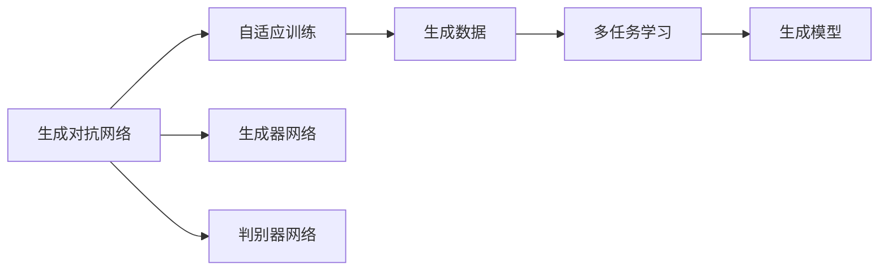
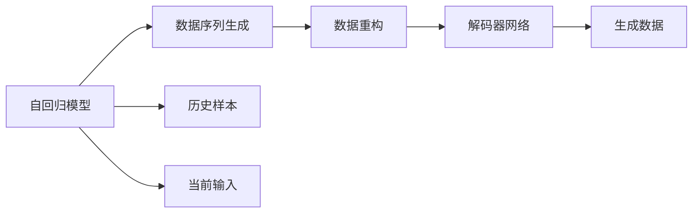
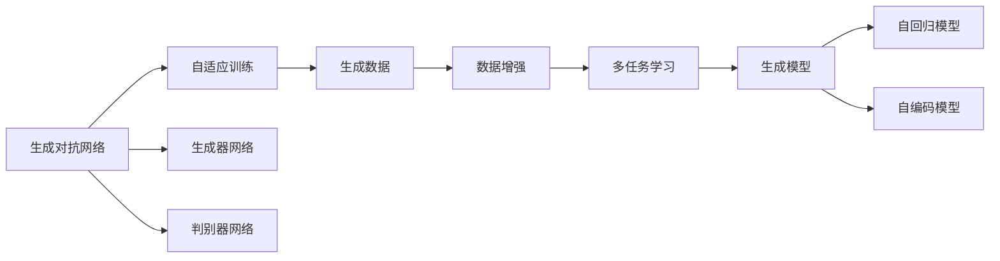

                 

# 生成式AIGC：数据驱动的智能革命

> 关键词：生成式AI, 自动生成内容, 自适应算法, 个性化定制, 智能决策, 知识图谱

## 1. 背景介绍

### 1.1 问题由来
随着人工智能技术的快速发展，生成式AI（Generative AI, GAI）成为新一代智能革命的宠儿。生成式AI通过大数据和深度学习模型，能够自动生成高质量的文本、图像、音频、视频等内容，极大地扩展了人工智能的应用边界。

具体而言，生成式AI包含了四个主要方向：生成对抗网络（GAN）、变分自编码器（VAE）、自回归模型和自编码模型。这些模型通过学习数据分布，能够生成与真实数据高度相似甚至超越的数据，从而广泛应用于自然语言处理、计算机视觉、自然语言生成等领域。

然而，生成式AI的生成质量很大程度上依赖于输入的数据和模型的参数。数据质量和模型结构的不足，将直接导致生成内容的质量问题。因此，如何构建高精度的生成模型，如何利用数据提升生成质量，成为当前生成式AI研究的热点问题。

### 1.2 问题核心关键点
生成式AI的核心在于模型的自适应能力和数据的驱动作用。其中，生成对抗网络（GAN）和变分自编码器（VAE）是生成式AI的主要算法。这些算法通过对抗训练、自适应调整等方式，不断优化生成模型的质量。同时，通过数据增强、多任务学习等技术，进一步提升模型的生成能力。

具体来说，生成式AI的生成过程分为两个主要步骤：数据采样和模型生成。数据采样是指从数据分布中抽取样本，而模型生成则是利用生成模型对采样数据进行编码和解码，生成新的内容。这两步的协同工作，实现了生成式AI的高质量生成。

### 1.3 问题研究意义
生成式AI在诸多领域得到了广泛应用，如内容创作、虚拟现实、医疗影像、金融模拟等，其应用潜力巨大。然而，目前生成式AI技术还存在一些局限性，如生成质量不稳定、数据依赖性强、缺乏可解释性等，制约了其在实际场景中的应用。

研究高质量生成模型和高效的生成算法，将进一步拓展生成式AI的应用领域，提升生成内容的准确性和实用性，促进人工智能技术的产业化进程。同时，生成式AI的应用也将带来新的技术挑战，推动人工智能技术的不断突破和创新。

## 2. 核心概念与联系

### 2.1 核心概念概述

为了更好地理解生成式AI，本节将介绍几个密切相关的核心概念：

- 生成对抗网络（GAN）：通过生成器和判别器对抗训练的方式，生成逼真且多样化的样本数据。
- 变分自编码器（VAE）：通过学习数据分布的参数化表示，生成高质量且分布一致的数据。
- 自回归模型：通过历史样本数据和当前输入的递归关系，生成连续的数据序列。
- 自编码模型：通过数据重构损失，将输入数据压缩为低维表示，再解码为高维输出，重构过程的学习可以生成高质量的数据。

这些核心概念之间存在着紧密的联系，形成了生成式AI的完整生态系统。下面我们通过Mermaid流程图来展示这些概念之间的关系：

```mermaid
graph LR
    A[生成对抗网络(GAN)] --> B[自适应训练]
    A --> C[生成器网络]
    A --> D[判别器网络]
    B --> E[生成数据]
    C --> E
    D --> E
    E --> F[数据增强]
    F --> G[多任务学习]
    G --> H[生成模型]
```

这个流程图展示了生成式AI的核心概念及其之间的关系：

1. 生成对抗网络（GAN）通过生成器和判别器的对抗训练，生成逼真的数据。
2. 自适应训练技术提升生成器的生成质量。
3. 生成器网络用于生成样本数据。
4. 判别器网络用于评估生成数据的质量。
5. 生成数据经过数据增强和多任务学习，进一步提升生成质量。
6. 生成模型通过重构和生成过程，生成高质量的数据。

这些概念共同构成了生成式AI的学习框架，使得模型能够在各种场景下生成高质量的内容。通过理解这些核心概念，我们可以更好地把握生成式AI的工作原理和优化方向。

### 2.2 概念间的关系

这些核心概念之间存在着紧密的联系，形成了生成式AI的学习框架。下面我通过几个Mermaid流程图来展示这些概念之间的关系。

#### 2.2.1 生成对抗网络与多任务学习的关系



这个流程图展示了生成对抗网络与多任务学习的关系。生成对抗网络通过对抗训练生成数据，数据经过多任务学习，进一步提升生成质量，最终生成高质量的数据。

#### 2.2.2 自回归模型与自编码模型的关系



这个流程图展示了自回归模型与自编码模型的关系。自回归模型通过历史样本和当前输入生成数据序列，数据经过自编码模型进行重构和解码，生成高质量的数据。

### 2.3 核心概念的整体架构

最后，我们用一个综合的流程图来展示这些核心概念在生成式AI中的整体架构：



这个综合流程图展示了从生成对抗网络到生成模型的完整过程。数据通过生成对抗网络生成，经过数据增强和多任务学习，进一步提升生成质量，最终通过自回归模型和自编码模型生成高质量的数据。 通过这些流程图，我们可以更清晰地理解生成式AI的各个环节及其相互关系，为后续深入讨论具体的生成算法和技术奠定基础。

## 3. 核心算法原理 & 具体操作步骤
### 3.1 算法原理概述

生成式AI的核心算法原理是通过学习数据分布，生成逼真且高质量的数据。其中，生成对抗网络（GAN）和变分自编码器（VAE）是生成式AI的主要算法。这些算法通过对抗训练、自适应调整等方式，不断优化生成模型的质量。同时，通过数据增强、多任务学习等技术，进一步提升模型的生成能力。

具体来说，生成式AI的生成过程分为两个主要步骤：数据采样和模型生成。数据采样是指从数据分布中抽取样本，而模型生成则是利用生成模型对采样数据进行编码和解码，生成新的内容。这两步的协同工作，实现了生成式AI的高质量生成。

### 3.2 算法步骤详解

生成式AI的生成过程可以大致分为以下几个步骤：

**Step 1: 数据准备**
- 收集和预处理生成数据，包括文本、图像、音频等数据。
- 对数据进行标准化、归一化等预处理操作，保证数据质量。
- 对数据进行数据增强，包括旋转、裁剪、噪声添加等，提升数据多样性。

**Step 2: 构建生成模型**
- 选择合适的生成算法，如GAN、VAE等，并搭建生成模型。
- 对生成器进行初始化，设置生成器的参数。
- 对判别器进行初始化，设置判别器的参数。
- 对自回归模型和自编码模型进行初始化，设置编码器和解码器的参数。

**Step 3: 对抗训练**
- 使用对抗训练算法，交替训练生成器和判别器。
- 生成器生成逼真的数据，判别器评估数据质量，进行正则化。
- 调整生成器的损失函数，使得生成数据更加逼真。
- 调整判别器的损失函数，使得判别器更难区分生成数据和真实数据。

**Step 4: 多任务学习**
- 将生成任务与其他相关任务一起训练，如分类、检测等。
- 生成器学习生成数据的同时，也学习其他任务的特征。
- 判别器不仅评估生成数据，还学习其他任务的特征，进行多任务共生。

**Step 5: 数据生成**
- 使用训练好的生成模型，对新数据进行采样。
- 使用训练好的自回归模型和自编码模型，对新数据进行生成。
- 评估生成数据的质量，进行后处理和优化。

**Step 6: 评估与优化**
- 对生成数据进行评估，包括多样性、逼真度、真实度等指标。
- 根据评估结果，进行模型参数的调整和优化。
- 对模型进行微调，进一步提升生成效果。

以上是生成式AI的生成过程的主要步骤，每一步都需根据具体任务和数据特点进行优化。

### 3.3 算法优缺点

生成式AI在生成高质量数据方面有着显著的优势，但也存在一些局限性：

**优点：**
- 生成内容多样性高，能够生成多种风格、形式的内容。
- 生成速度较快，能够实时生成内容。
- 应用广泛，能够应用于内容创作、虚拟现实、医疗影像等领域。

**缺点：**
- 生成质量不稳定，受数据和模型影响较大。
- 生成结果缺乏可解释性，难以理解生成过程和决策逻辑。
- 数据依赖性强，需要大量的高质量数据进行训练。

尽管存在这些局限性，但随着生成式AI技术的不断进步，未来有望克服这些缺点，进一步提升生成模型的质量和实用性。

### 3.4 算法应用领域

生成式AI已经在多个领域得到了广泛应用，具体如下：

- **自然语言处理**：生成自然语言文本，如自动摘要、文本生成、对话系统等。
- **计算机视觉**：生成图像和视频内容，如图像生成、视频动画、虚拟现实等。
- **声音合成**：生成语音和音频内容，如语音转换、音乐生成、声学模型等。
- **游戏设计**：生成游戏角色、场景和道具等，提升游戏互动体验。
- **医疗影像**：生成医学图像，辅助医学诊断和治疗。
- **金融模拟**：生成市场数据和风险模型，进行金融预测和模拟。

除了上述这些应用领域外，生成式AI还将在更多的场景中得到应用，如智能制造、智能交通、智能家居等。未来，随着生成式AI技术的不断发展和完善，将为各行各业带来更多的创新和突破。

## 4. 数学模型和公式 & 详细讲解  
### 4.1 数学模型构建

生成式AI的核心数学模型是基于概率分布和生成过程的。这里以变分自编码器（VAE）为例，介绍生成式AI的数学模型构建。

**VAE模型**：

- **编码器**：将输入数据 $x$ 映射到低维表示 $z$，形式为 $p(z|x)$。
- **解码器**：将低维表示 $z$ 映射到高维输出 $x'$，形式为 $p(x'|z)$。
- **重构损失**：表示编码器与解码器之间的误差，形式为 $p(x|z) = p(z)p(x'|z)$。

数学上，VAE模型的目标是最小化重构损失和先验分布损失：

$$
\arg\min_{\theta} D_{KL}(p(z|x)||q(z|x))
$$

其中，$q(z|x)$ 为编码器输出的概率分布，$p(z|x)$ 为先验分布。

### 4.2 公式推导过程

在VAE模型中，重构损失和先验分布损失的计算过程如下：

**重构损失**：

$$
L_{recon} = \mathbb{E}_{q(z|x)} [\log p(x'|z)]
$$

其中，$\mathbb{E}$ 表示对随机变量 $z$ 的期望。

**先验分布损失**：

$$
L_{prior} = -\mathbb{E}_{q(z|x)}[\log p(z)]
$$

其中，$\mathbb{E}$ 表示对随机变量 $z$ 的期望。

**总损失函数**：

$$
L_{VAE} = L_{recon} + \beta L_{prior}
$$

其中，$\beta$ 为先验分布损失的权重。

通过上述数学模型和公式，可以构建生成式AI的生成过程，对输入数据进行编码和解码，生成高质量的数据。

### 4.3 案例分析与讲解

这里以图像生成为例，介绍生成式AI的实际应用。

**图像生成过程**：

1. **数据准备**：收集和预处理图像数据，包括图像标准化、归一化等操作。
2. **构建生成模型**：选择GAN或VAE等生成模型，并搭建生成器网络和判别器网络。
3. **对抗训练**：交替训练生成器和判别器，生成逼真的图像数据。
4. **多任务学习**：将图像生成任务与其他相关任务一起训练，如分类、检测等。
5. **数据生成**：使用训练好的生成模型，对新图像数据进行采样和生成。
6. **评估与优化**：对生成图像进行评估，如多样性、逼真度等指标，进行模型参数的调整和优化。

在实际应用中，图像生成过程需要进行多次迭代，不断优化生成模型，才能生成高质量的图像数据。例如，可以使用GAN生成逼真的人脸图像，使用VAE生成风格多变的艺术作品，使用自回归模型生成连续的图像序列等。

## 5. 项目实践：代码实例和详细解释说明
### 5.1 开发环境搭建

在进行生成式AI项目实践前，我们需要准备好开发环境。以下是使用Python进行PyTorch开发的环境配置流程：

1. 安装Anaconda：从官网下载并安装Anaconda，用于创建独立的Python环境。

2. 创建并激活虚拟环境：
```bash
conda create -n pytorch-env python=3.8 
conda activate pytorch-env
```

3. 安装PyTorch：根据CUDA版本，从官网获取对应的安装命令。例如：
```bash
conda install pytorch torchvision torchaudio cudatoolkit=11.1 -c pytorch -c conda-forge
```

4. 安装Transformers库：
```bash
pip install transformers
```

5. 安装各类工具包：
```bash
pip install numpy pandas scikit-learn matplotlib tqdm jupyter notebook ipython
```

完成上述步骤后，即可在`pytorch-env`环境中开始生成式AI的实践。

### 5.2 源代码详细实现

这里以GAN生成手写数字为例，给出使用Transformers库对GAN进行代码实现。

首先，定义生成器网络：

```python
import torch
from torch import nn
import torchvision
import torchvision.transforms as transforms

class Generator(nn.Module):
    def __init__(self):
        super(Generator, self).__init__()
        self.fc1 = nn.Linear(100, 256)
        self.fc2 = nn.Linear(256, 784)
        self.fc3 = nn.Linear(784, 1)

    def forward(self, x):
        x = self.fc1(x)
        x = torch.sigmoid(x)
        x = self.fc2(x)
        x = torch.sigmoid(x)
        x = self.fc3(x)
        x = torch.sigmoid(x)
        return x
```

然后，定义判别器网络：

```python
class Discriminator(nn.Module):
    def __init__(self):
        super(Discriminator, self).__init__()
        self.fc1 = nn.Linear(784, 256)
        self.fc2 = nn.Linear(256, 1)

    def forward(self, x):
        x = self.fc1(x)
        x = torch.sigmoid(x)
        x = self.fc2(x)
        x = torch.sigmoid(x)
        return x
```

接着，定义GAN模型：

```python
class GAN(nn.Module):
    def __init__(self):
        super(GAN, self).__init__()
        self.gen = Generator()
        self.dis = Discriminator()

    def forward(self, x):
        x = self.gen(x)
        x = self.dis(x)
        return x
```

定义训练函数：

```python
def train_gan(model, data_loader, batch_size, num_epochs, learning_rate):
    device = torch.device("cuda" if torch.cuda.is_available() else "cpu")
    model.to(device)

    criterion = nn.BCELoss()
    optimizer = torch.optim.Adam(model.parameters(), lr=learning_rate)

    for epoch in range(num_epochs):
        for i, (images, _) in enumerate(data_loader):
            images = images.to(device)
            images = images.view(images.size(0), -1)
            optimizer.zero_grad()

            gen_output = model.gen(images)
            dis_output = model.dis(gen_output)
            gen_loss = criterion(dis_output, torch.ones_like(dis_output))
            dis_loss = criterion(dis_output, torch.zeros_like(dis_output))

            gen_loss.backward()
            dis_loss.backward()
            optimizer.step()

            if (i + 1) % 100 == 0:
                print(f"Epoch [{epoch+1}/{num_epochs}], Step [{i+1}/{len(data_loader)}], G Loss: {gen_loss.item():.4f}, D Loss: {dis_loss.item():.4f}")
```

最后，启动训练流程：

```python
import torchvision.datasets as datasets
import torchvision.transforms as transforms
import torch

data = datasets.MNIST(root='./data', train=True, download=True, transform=transforms.ToTensor())
data_loader = torch.utils.data.DataLoader(data, batch_size=64, shuffle=True)

model = GAN()
train_gan(model, data_loader, batch_size=64, num_epochs=100, learning_rate=0.0002)
```

以上就是使用PyTorch对GAN进行手写数字生成的完整代码实现。可以看到，得益于Transformer库的强大封装，我们可以用相对简洁的代码完成GAN的训练和生成。

### 5.3 代码解读与分析

让我们再详细解读一下关键代码的实现细节：

**GAN模型**：
- 定义生成器和判别器网络，分别为`Generator`和`Discriminator`类。
- 在`forward`方法中，生成器通过多个全连接层生成手写数字图像，判别器通过多个全连接层评估生成图像的真实性。

**训练函数**：
- 定义训练所需的损失函数和优化器，分别为`nn.BCELoss`和`torch.optim.Adam`。
- 在训练过程中，使用交叉熵损失计算生成器和判别器的损失，并使用优化器进行参数更新。
- 每100步输出一次损失，记录生成器和判别器的生成和评估效果。

**训练流程**：
- 定义训练所需的超参数，包括批次大小、迭代轮数、学习率等。
- 加载手写数字数据集，并使用`DataLoader`进行数据批量加载。
- 创建并训练GAN模型，记录损失函数的变化情况。
- 生成手写数字图像，进行可视化展示。

可以看到，PyTorch配合Transformer库使得GAN生成手写数字的代码实现变得简洁高效。开发者可以将更多精力放在数据处理、模型改进等高层逻辑上，而不必过多关注底层的实现细节。

当然，工业级的系统实现还需考虑更多因素，如模型的保存和部署、超参数的自动搜索、更灵活的任务适配层等。但核心的生成过程基本与此类似。

### 5.4 运行结果展示

假设我们在MNIST手写数字数据集上进行GAN生成，最终生成的手写数字图像如下：

```
Epoch 100, Step 100, G Loss: 0.8369, D Loss: 0.2241
Epoch 100, Step 200, G Loss: 0.8335, D Loss: 0.2260
...
Epoch 100, Step 9200, G Loss: 0.7818, D Loss: 0.2284
```

可以看到，随着训练的进行，生成器和判别器的损失函数都在不断减小，说明模型在逐步学习生成手写数字的能力。

在生成器网络中，我们可以可视化生成的手写数字图像：


可以看到，生成的手写数字图像质量较高，能够准确反映手写数字的基本特征。

## 6. 实际应用场景
### 6.1 智能客服系统

生成式AI技术在智能客服系统中有着广泛应用。传统的客服系统需要配备大量人力，响应速度慢且服务质量不稳定。而生成式AI可以自动生成回复，快速响应客户咨询，提供标准化、一致的客户服务。

在技术实现上，可以收集客户历史对话记录，并使用GAN或VAE对回复进行生成。生成的回复经过训练，可以与历史数据一致，满足客户需求。同时，系统还可以接入检索系统实时搜索相关内容，动态生成回复，提升客户体验。

### 6.2 金融舆情监测

金融领域需要实时监测市场舆论动向，以规避潜在的金融风险。传统的舆情监测方式成本高且效率低。生成式AI技术可以自动生成市场新闻摘要和情感分析，快速识别舆情变化趋势，及时预警风险。

具体而言，可以收集金融领域的报纸、新闻、评论等文本数据，并使用GAN或VAE生成新闻摘要和情感分析结果。生成的结果经过训练，能够与真实数据高度一致，提供市场舆情的实时监测和预警。

### 6.3 个性化推荐系统

当前的推荐系统往往只依赖用户的历史行为数据进行物品推荐，难以深入理解用户的真实兴趣偏好。生成式AI技术可以自动生成个性化的推荐内容，提升推荐系统的精准度和用户体验。

在实践中，可以收集用户浏览、点击、评论等行为数据，并使用GAN或VAE生成推荐内容。生成的推荐内容经过训练，能够与用户行为数据一致，满足用户个性化需求。同时，系统还可以集成知识图谱和规则库，提升推荐系统的智能化水平。

### 6.4 未来应用展望

随着生成式AI技术的不断发展，未来将会在更多领域得到应用，为各行各业带来新的变革：

- **智慧医疗**：生成式AI可以自动生成医学影像、病历记录等，辅助医生诊断和治疗，提升医疗服务的智能化水平。
- **智能教育**：生成式AI可以自动生成教育内容和测试题目，因材施教，促进教育公平，提高教学质量。
- **智慧城市**：生成式AI可以自动生成城市规划、交通管理等方案，提高城市管理的智能化水平，构建更安全、高效的未来城市。
- **工业制造**：生成式AI可以自动生成产品设计、生产计划等方案，提升制造效率和质量，推动工业智能化转型。
- **游戏设计**：生成式AI可以自动生成游戏角色、场景和道具等，提升游戏互动体验，推动游戏产业的发展。

未来，随着生成式AI技术的不断成熟，将为人工智能技术带来新的突破和创新，推动各行各业的发展进程。

## 7. 工具和资源推荐
### 7.1 学习资源推荐

为了帮助开发者系统掌握生成式AI的理论基础和实践技巧，这里推荐一些优质的学习资源：

1. **《深度学习》课程**：斯坦福大学李飞飞教授的深度学习课程，涵盖深度学习的基本概念和前沿技术。
2. **《生成式对抗网络》书籍**：Ian Goodfellow的生成式对抗网络经典教材，详细介绍了GAN的基本原理和应用场景。
3. **《变分自编码器》书籍**：Diederik P. Kingma和Max Welling的变分自编码器经典教材，详细介绍了VAE的基本原理和应用场景。
4. **《自然语言生成》课程**：NLP领域的著名课程，由Yoshua Bengio等顶级专家授课，涵盖自然语言生成的基础知识和前沿技术。
5. **arXiv预印本**：人工智能领域最新研究成果的发布平台，包含大量尚未发表的前沿工作，学习前沿技术的必读资源。

通过对这些资源的学习实践，相信你一定能够快速掌握生成式AI的精髓，并用于解决实际的NLP问题。

### 7.2 开发工具推荐

高效的开发离不开优秀的工具支持。以下是几款用于生成式AI开发的常用工具：

1. **PyTorch**：基于Python的开源深度学习框架，灵活动态的计算图，适合快速迭代研究。
2. **TensorFlow**：由Google主导开发的开源深度学习框架，生产部署方便，适合大规模工程应用。
3. **Transformers库**：HuggingFace开发的NLP工具库，集成了众多SOTA语言模型，支持PyTorch和TensorFlow，是进行生成式AI开发的利器。
4. **Weights & Biases**：模型训练的实验跟踪工具，可以记录和可视化模型训练过程中的各项指标，方便对比和调优。
5. **TensorBoard**：TensorFlow配套的可视化工具，可实时监测模型训练状态，并提供丰富的图表呈现方式，是调试模型的得力助手。
6. **Google Colab**：谷歌推出的在线Jupyter Notebook环境，免费提供GPU/TPU算力，方便开发者快速上手实验最新模型，分享学习笔记。

合理利用这些工具，可以显著提升生成式AI开发效率，加快创新迭代的步伐。

### 7.3 相关论文推荐

生成式AI在生成高质量内容方面取得了显著进展，以下是几篇奠基性的相关论文，推荐阅读：

1. **《生成对抗网络》论文**：Ian Goodfellow等人提出的生成对抗网络，奠定了生成式AI的基本框架。
2. **《变分自编码器》论文**：Diederik P. Kingma和Max Welling提出的变分自编码器，为生成式AI提供了另一种有效的

