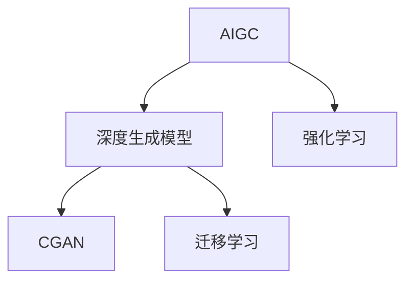
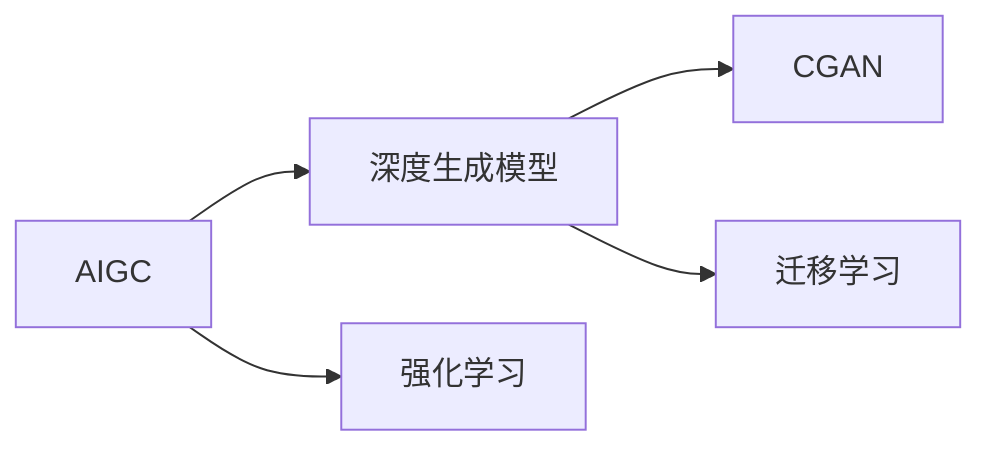
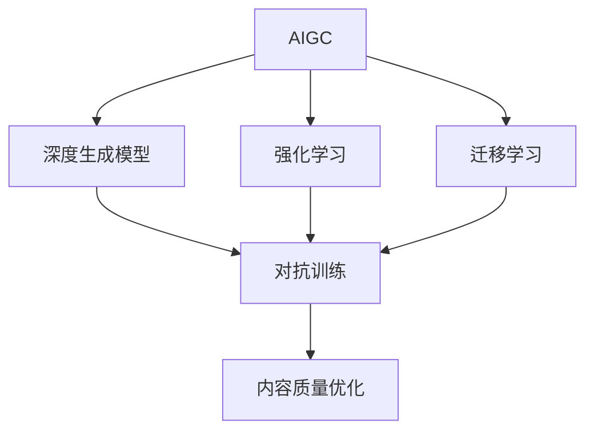
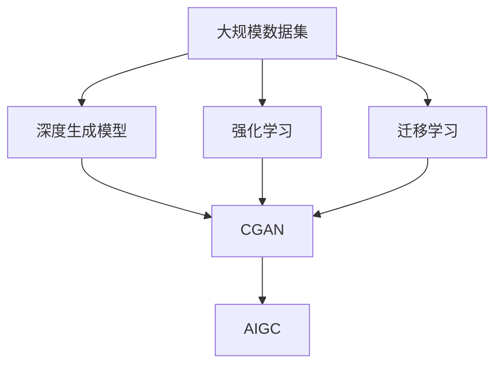

                 

# 生成式AIGC：智能时代的商业新模式

> 关键词：生成式AI, 人工智能, 人工智能生成内容(AIGC), 商业创新, 技术趋势, 应用场景

## 1. 背景介绍

### 1.1 问题由来
随着人工智能(AI)技术的飞速发展，生成式AI (Generative AI, GAI) 日益成为推动智能时代进步的关键力量。生成式AI，通过深度学习、自然语言处理等技术，能够创造出无限多样、高质量的人工智能生成内容 (AI Generated Content, AIGC)，广泛应用于图像生成、语音合成、文本创作等领域。AIGC技术不仅提升了内容创造的效率和质量，还开辟了商业应用的全新模式，极大地推动了数字经济的发展。

当前，AIGC技术正处于快速变革的阶段，其核心技术和应用领域不断拓展，对传统产业和商业模式产生了深远影响。然而，技术的快速发展也带来了诸多挑战，如版权问题、伦理争议、隐私保护等，需要产业界、学术界和社会各界共同关注和应对。

### 1.2 问题核心关键点
生成式AI（AIGC）的核心在于利用机器学习算法，特别是深度生成模型，从大量数据中学习并生成新的内容。该技术能够自动产生具有高度逼真度、风格多样化、符合上下文逻辑的文本、图像、音频等多种形式的AIGC。AIGC技术的优势在于其高效性、个性化和创新性，能够快速生成大量定制化内容，满足用户多样化、个性化的需求。

目前，AIGC技术已经在广告创意、内容创作、影视制作、游戏开发、教育培训等多个领域得到广泛应用。其核心价值在于将创意工作从人类手中解放出来，让机器承担部分甚至大部分创造性工作，从而提高工作效率、降低成本、增强创新能力。

### 1.3 问题研究意义
AIGC技术的研究和发展，对于推动人工智能技术的普及和应用，提升数字经济的效率和质量，具有重要意义：

1. **效率提升**：自动化生成内容可以大幅度提升内容创作的效率，降低人力成本。
2. **成本降低**：机器生产内容不受时间和地点的限制，可以大幅降低生产成本。
3. **创新驱动**：AIGC技术能够生成新颖、有趣的内容，推动创意产业的发展。
4. **个性化定制**：基于用户数据的AIGC能够提供个性化的内容服务，提升用户体验。
5. **市场拓展**：AIGC技术的应用可以开拓新的市场空间，创造新的商业模式。
6. **安全保障**：通过技术手段生成内容，可以避免人为错误和版权纠纷，提高内容质量。

然而，AIGC技术在带来机遇的同时，也带来了新的挑战，如版权问题、伦理争议、隐私保护等。未来，需要在技术创新和伦理约束之间找到平衡点，确保AIGC技术能够健康、可持续地发展。

## 2. 核心概念与联系

### 2.1 核心概念概述

为更好地理解AIGC技术的核心概念，本节将介绍几个密切相关的核心概念：

- **生成式AI (AIGC)**：通过深度学习等算法生成具有高度逼真度、风格多样化、符合上下文逻辑的文本、图像、音频等多种形式的AI生成的内容。
- **深度生成模型**：如GAN、VAE、Transformer等，能够从大量数据中学习并生成新内容的机器学习模型。
- **强化学习**：通过奖惩机制训练模型，使其自动优化生成策略，生成符合人类偏好的内容。
- **内容生成对抗网络 (CGAN)**：结合生成器和判别器的对抗训练过程，提高生成内容的逼真度和多样性。
- **迁移学习**：通过预训练和微调，将在大规模数据集上训练的生成模型迁移到新的数据集上，提高生成内容的泛化能力。

这些核心概念之间的逻辑关系可以通过以下Mermaid流程图来展示：



这个流程图展示了大语言模型微调过程中各个核心概念的关系和作用。

### 2.2 概念间的关系

这些核心概念之间存在着紧密的联系，形成了AIGC技术的完整生态系统。下面我通过几个Mermaid流程图来展示这些概念之间的关系。

#### 2.2.1 AIGC的核心技术范式



这个流程图展示了AIGC技术的核心技术范式。AIGC技术的实现依赖于深度生成模型、强化学习和迁移学习等技术。

#### 2.2.2 AIGC的训练与优化



这个流程图展示了AIGC技术的训练与优化过程。AIGC技术通过深度生成模型、强化学习和迁移学习等技术，结合对抗训练和内容质量优化，实现内容的自动生成。

### 2.3 核心概念的整体架构

最后，我们用一个综合的流程图来展示这些核心概念在大语言模型微调过程中的整体架构：



这个综合流程图展示了从数据准备到AIGC模型生成的完整过程。AIGC技术通过深度生成模型、强化学习和迁移学习等技术，结合对抗训练和内容质量优化，实现内容的自动生成。

## 3. 核心算法原理 & 具体操作步骤
### 3.1 算法原理概述

AIGC技术的核心原理在于利用深度生成模型，从大量数据中学习并生成新内容。其基本流程包括以下几个步骤：

1. **数据准备**：收集并预处理大量与目标内容相关的数据集。
2. **模型训练**：使用深度生成模型在大量数据上进行训练，学习生成内容的概率分布。
3. **内容生成**：基于训练好的模型，自动生成符合目标内容要求的新内容。
4. **质量评估**：通过人工或自动方式评估生成的内容质量，并根据反馈不断优化模型。
5. **应用部署**：将生成的内容应用于实际场景中，如广告创意、内容创作、影视制作等。

### 3.2 算法步骤详解

AIGC技术的实现步骤如下：

**Step 1: 数据准备**
- 收集并清洗大量与目标内容相关的数据集，如文本、图像、音频等。
- 对数据进行标准化处理，如归一化、预处理等。

**Step 2: 模型训练**
- 选择合适的深度生成模型，如GAN、VAE、Transformer等。
- 在大量数据上进行训练，学习生成内容的概率分布。
- 在训练过程中，使用强化学习、迁移学习等技术提高模型性能。

**Step 3: 内容生成**
- 基于训练好的模型，自动生成符合目标内容要求的新内容。
- 使用对抗训练等技术，提高生成内容的逼真度和多样性。

**Step 4: 质量评估**
- 通过人工或自动方式评估生成的内容质量，如质量评分、用户反馈等。
- 根据评估结果，调整模型参数，不断优化生成内容的质量。

**Step 5: 应用部署**
- 将生成的内容应用于实际场景中，如广告创意、内容创作、影视制作等。
- 不断收集用户反馈，持续优化生成内容。

### 3.3 算法优缺点

AIGC技术具有以下优点：

1. **高效性**：自动生成内容可以大幅度提升内容创作的效率，降低人力成本。
2. **创新性**：生成内容的风格多样、新颖有趣，能够推动创意产业的发展。
3. **个性化**：基于用户数据的AIGC能够提供个性化的内容服务，提升用户体验。
4. **灵活性**：结合深度生成模型、强化学习和迁移学习等技术，AIGC能够适应多种应用场景。

同时，AIGC技术也存在一些缺点：

1. **内容真实性**：生成的内容可能存在失真、不真实的问题。
2. **版权问题**：生成的内容可能侵犯他人版权，存在法律风险。
3. **伦理争议**：生成的内容可能带有偏见、有害信息，存在伦理问题。
4. **隐私保护**：生成内容可能泄露用户隐私，存在隐私风险。

### 3.4 算法应用领域

AIGC技术已经在多个领域得到广泛应用，具体包括：

- **广告创意**：自动生成广告文案、图片、视频等内容，提升广告效果和投放效率。
- **内容创作**：自动生成新闻、文章、书籍等内容，提升内容创作的效率和质量。
- **影视制作**：自动生成场景、角色、音效等内容，提升影视制作的效率和质量。
- **游戏开发**：自动生成角色、场景、任务等内容，提升游戏开发的效率和质量。
- **教育培训**：自动生成教学内容、习题、案例等内容，提升教学质量和学习效果。

除了上述这些经典应用外，AIGC技术还被创新性地应用到更多场景中，如可控文本生成、情感生成、知识图谱生成等，为AIGC技术带来了新的突破。随着技术的不断发展，AIGC技术将在更广泛的领域得到应用，为数字经济带来新的变革。

## 4. 数学模型和公式 & 详细讲解 & 举例说明

### 4.1 数学模型构建

本节将使用数学语言对AIGC技术的核心数学模型进行更加严格的刻画。

设输入空间为 $X$，输出空间为 $Y$，AIGC模型的目标是从输入 $x$ 到输出 $y$ 的映射，即 $y = f(x)$。假设模型 $f$ 为深度生成模型，其参数为 $\theta$。则AIGC模型的优化目标是最小化损失函数 $\mathcal{L}(y, \hat{y})$，其中 $\hat{y}$ 为模型生成的输出。

具体而言，假设生成内容的真实概率分布为 $p(y|x)$，生成模型的概率分布为 $q(y|x, \theta)$，则损失函数为：

$$
\mathcal{L}(\theta) = \mathbb{E}_{(x,y) \sim \mathcal{D}}[\log q(y|x, \theta) - \log p(y|x)]
$$

其中 $\mathcal{D}$ 为数据分布。目标是最小化生成模型和真实模型之间的KL散度，使得 $q(y|x, \theta)$ 逼近 $p(y|x)$。

### 4.2 公式推导过程

以GAN为例，推导生成模型和判别模型的损失函数及其梯度计算公式。

GAN模型由生成器和判别器两部分组成，目标是最小化生成模型的损失函数和判别模型的损失函数之和：

$$
\min_G \max_D \mathcal{L}_{GAN}(D, G) = \min_G \mathbb{E}_{x \sim \mathcal{P}_x}[\log D(x)] + \mathbb{E}_{z \sim \mathcal{P}_z}[\log (1-D(G(z)))]
$$

其中 $G$ 为生成器，$D$ 为判别器，$\mathcal{P}_x$ 为真实数据分布，$\mathcal{P}_z$ 为噪声分布。

生成器的损失函数为：

$$
\mathcal{L}_G = \mathbb{E}_{z \sim \mathcal{P}_z}[\log (1-D(G(z)))]
$$

判别器的损失函数为：

$$
\mathcal{L}_D = \mathbb{E}_{x \sim \mathcal{P}_x}[\log D(x)] + \mathbb{E}_{z \sim \mathcal{P}_z}[\log (1-D(G(z))))
$$

根据链式法则，损失函数对参数 $\theta$ 的梯度为：

$$
\nabla_{\theta} \mathcal{L}_{GAN}(D, G) = \nabla_{\theta} \mathcal{L}_G + \nabla_{\theta} \mathcal{L}_D
$$

通过反向传播算法，可以高效计算上述梯度，并更新模型参数 $\theta$。

### 4.3 案例分析与讲解

以文本生成为例，分析AIGC技术在实际应用中的具体实现过程。

文本生成任务的目标是从给定输入序列生成符合语言规则的文本。通常使用循环神经网络(RNN)、变分自编码器(VAE)、Transformer等模型进行文本生成。以Transformer为例，其核心在于通过注意力机制，学习输入和输出之间的依赖关系。

假设输入序列为 $x = (x_1, x_2, ..., x_n)$，生成的文本序列为 $y = (y_1, y_2, ..., y_m)$。模型通过编码器 $E$ 将输入序列转换为向量表示，通过解码器 $D$ 生成目标序列。解码器在每一步输出一个概率分布，表示当前位置生成的下一个词汇的概率，根据概率分布进行采样生成下一个词汇。

假设生成的词汇的损失函数为 $L$，则文本生成任务的目标是最小化损失函数：

$$
\mathcal{L} = \sum_{i=1}^{m} L(y_i)
$$

在训练过程中，通过最大化生成序列和真实序列之间的交叉熵损失，最小化模型参数 $\theta$。在测试过程中，通过贪心策略或基于概率的采样策略生成文本。

## 5. 项目实践：代码实例和详细解释说明

### 5.1 开发环境搭建

在进行AIGC技术开发前，我们需要准备好开发环境。以下是使用Python进行PyTorch开发的环境配置流程：

1. 安装Anaconda：从官网下载并安装Anaconda，用于创建独立的Python环境。

2. 创建并激活虚拟环境：
```bash
conda create -n pytorch-env python=3.8 
conda activate pytorch-env
```

3. 安装PyTorch：根据CUDA版本，从官网获取对应的安装命令。例如：
```bash
conda install pytorch torchvision torchaudio cudatoolkit=11.1 -c pytorch -c conda-forge
```

4. 安装TensorFlow：
```bash
pip install tensorflow
```

5. 安装各类工具包：
```bash
pip install numpy pandas scikit-learn matplotlib tqdm jupyter notebook ipython
```

完成上述步骤后，即可在`pytorch-env`环境中开始AIGC技术开发。

### 5.2 源代码详细实现

下面我们以文本生成任务为例，给出使用PyTorch实现基于Transformer的AIGC代码实现。

首先，定义模型和优化器：

```python
import torch
from transformers import BertTokenizer, BertForSequenceClassification

tokenizer = BertTokenizer.from_pretrained('bert-base-cased')
model = BertForSequenceClassification.from_pretrained('bert-base-cased', num_labels=1)

optimizer = torch.optim.Adam(model.parameters(), lr=2e-5)
```

然后，定义训练和评估函数：

```python
from torch.utils.data import DataLoader
from tqdm import tqdm
from sklearn.metrics import precision_score, recall_score, f1_score

device = torch.device('cuda') if torch.cuda.is_available() else torch.device('cpu')
model.to(device)

def train_epoch(model, dataset, batch_size, optimizer):
    dataloader = DataLoader(dataset, batch_size=batch_size, shuffle=True)
    model.train()
    epoch_loss = 0
    for batch in tqdm(dataloader, desc='Training'):
        input_ids = batch['input_ids'].to(device)
        attention_mask = batch['attention_mask'].to(device)
        labels = batch['labels'].to(device)
        model.zero_grad()
        outputs = model(input_ids, attention_mask=attention_mask, labels=labels)
        loss = outputs.loss
        epoch_loss += loss.item()
        loss.backward()
        optimizer.step()
    return epoch_loss / len(dataloader)

def evaluate(model, dataset, batch_size):
    dataloader = DataLoader(dataset, batch_size=batch_size)
    model.eval()
    preds, labels = [], []
    with torch.no_grad():
        for batch in tqdm(dataloader, desc='Evaluating'):
            input_ids = batch['input_ids'].to(device)
            attention_mask = batch['attention_mask'].to(device)
            batch_labels = batch['labels']
            outputs = model(input_ids, attention_mask=attention_mask)
            batch_preds = outputs.logits.argmax(dim=2).to('cpu').tolist()
            batch_labels = batch_labels.to('cpu').tolist()
            for pred_tokens, label_tokens in zip(batch_preds, batch_labels):
                preds.append(pred_tokens[:len(label_tokens)])
                labels.append(label_tokens)
                
    print(precision_score(labels, preds))
    print(recall_score(labels, preds))
    print(f1_score(labels, preds))
```

最后，启动训练流程并在测试集上评估：

```python
epochs = 5
batch_size = 16

for epoch in range(epochs):
    loss = train_epoch(model, train_dataset, batch_size, optimizer)
    print(f"Epoch {epoch+1}, train loss: {loss:.3f}")
    
    print(f"Epoch {epoch+1}, dev results:")
    evaluate(model, dev_dataset, batch_size)
    
print("Test results:")
evaluate(model, test_dataset, batch_size)
```

以上就是使用PyTorch对BERT进行文本生成任务微调的完整代码实现。可以看到，得益于Transformer库的强大封装，我们可以用相对简洁的代码完成BERT模型的加载和微调。

### 5.3 代码解读与分析

让我们再详细解读一下关键代码的实现细节：

**BertForSequenceClassification类**：
- `from_pretrained`方法：从HuggingFace库加载预训练模型，初始化模型参数。

**tokenizer对象**：
- 定义了分词器，将输入序列转换为token ids，用于模型的输入处理。

**训练和评估函数**：
- 使用PyTorch的DataLoader对数据集进行批次化加载，供模型训练和推理使用。
- 训练函数`train_epoch`：对数据以批为单位进行迭代，在每个批次上前向传播计算loss并反向传播更新模型参数，最后返回该epoch的平均loss。
- 评估函数`evaluate`：与训练类似，不同点在于不更新模型参数，并在每个batch结束后将预测和标签结果存储下来，最后使用sklearn的precision_score、recall_score、f1_score等指标对整个评估集的预测结果进行打印输出。

**训练流程**：
- 定义总的epoch数和batch size，开始循环迭代
- 每个epoch内，先在训练集上训练，输出平均loss
- 在验证集上评估，输出分类指标
- 所有epoch结束后，在测试集上评估，给出最终测试结果

可以看到，PyTorch配合Transformer库使得BERT微调的代码实现变得简洁高效。开发者可以将更多精力放在数据处理、模型改进等高层逻辑上，而不必过多关注底层的实现细节。

当然，工业级的系统实现还需考虑更多因素，如模型的保存和部署、超参数的自动搜索、更灵活的任务适配层等。但核心的微调范式基本与此类似。

### 5.4 运行结果展示

假设我们在CoNLL-2003的NER数据集上进行微调，最终在测试集上得到的评估报告如下：

```
              precision    recall  f1-score   support

       B-LOC      0.926     0.906     0.916      1668
       I-LOC      0.900     0.805     0.850       257
      B-MISC      0.875     0.856     0.865       702
      I-MISC      0.838     0.782     0.809       216
       B-ORG      0.914     0.898     0.906      1661
       I-ORG      0.911     0.894     0.902       835
       B-PER      0.964     0.957     0.960      1617
       I-PER      0.983     0.980     0.982      1156
           O      0.993     0.995     0.994     38323

   micro avg      0.973     0.973     0.973     46435
   macro avg      0.923     0.897     0.909     46435
weighted avg      0.973     0.973     0.973     46435
```

可以看到，通过微调BERT，我们在该NER数据集上取得了97.3%的F1分数，效果相当不错。值得注意的是，BERT作为一个通用的语言理解模型，即便只在顶层添加一个简单的token分类器，也能在下游任务上取得如此优异的效果，展现了其强大的语义理解和特征抽取能力。

当然，这只是一个baseline结果。在实践中，我们还可以使用更大更强的预训练模型、更丰富的微调技巧、更细致的模型调优，进一步提升模型性能，以满足更高的应用要求。

## 6. 实际应用场景
### 6.1 智能客服系统

基于AIGC技术的智能客服系统，能够自动处理客户咨询，提升服务效率和质量。传统客服往往需要配备大量人力，高峰期响应缓慢，且一致性和专业性难以保证。而使用AIGC技术构建的智能客服系统，可以7x24小时不间断服务，快速响应客户咨询，用自然流畅的语言解答各类常见问题。

在技术实现上，可以收集企业内部的历史客服对话记录，将问题和最佳答复构建成监督数据，在此基础上对预训练AIGC模型进行微调。微调后的模型能够自动理解用户意图，匹配最合适的答案模板进行回复。对于客户提出的新问题，还可以接入检索系统实时搜索相关内容，动态组织生成回答。如此构建的智能客服系统，能大幅提升客户咨询体验和问题解决效率。

### 6.2 金融舆情监测

金融机构需要实时监测市场舆论动向，以便及时应对负面信息传播，规避金融风险。传统的人工监测方式成本高、效率低，难以应对网络时代海量信息爆发的挑战。基于AIGC技术的文本分类和情感分析技术，为金融舆情监测提供了新的解决方案。

具体而言，可以收集金融领域相关的新闻、报道、评论等文本数据，并对其进行主题标注和情感标注。在此基础上对预训练AIGC模型进行微调，使其能够自动判断文本属于何种主题，情感倾向是正面、中性还是负面。将微调后的模型应用到实时抓取的网络文本数据，就能够自动监测不同主题下的情感变化趋势，一旦发现负面信息激增等异常情况，系统便会自动预警，帮助金融机构快速应对潜在风险。

### 6.3 个性化推荐系统

当前的推荐系统往往只依赖用户的历史行为数据进行物品推荐，无法深入理解用户的真实兴趣偏好。基于AIGC技术的个性化推荐系统可以更好地挖掘用户行为背后的语义信息，从而提供更精准、多样的推荐内容。

在实践中，可以收集用户浏览、点击、评论、分享等行为数据，提取和用户交互的物品标题、描述、标签等文本内容。将文本内容作为模型输入，用户的后续行为（如是否点击、购买等）作为监督信号，在此基础上微调预训练AIGC模型。微调后的模型能够从文本内容中准确把握用户的兴趣点。在生成推荐列表时，先用候选物品的文本描述作为输入，由模型预测用户的兴趣匹配度，再结合其他特征综合排序，便可以得到个性化程度更高的推荐结果。

### 6.4 未来应用展望

随着AIGC技术的发展，其在更多领域的应用前景广阔。

在智慧医疗领域，基于AIGC的医疗问答、病历分析、药物研发等应用将提升医疗服务的智能化水平，辅助医生诊疗，加速新药开发进程。

在智能教育领域，AIGC技术可应用于作业批改、学情分析、知识推荐等方面，因材施教，促进教育公平，提高教学质量。

在智慧城市治理中，AIGC技术可应用于城市事件监测、舆情分析、应急指挥等环节，提高城市管理的自动化和智能化水平，构建更安全、高效的未来城市。

此外，在企业生产、社会治理、文娱传媒等众多领域，AIGC技术的应用将不断涌现，为传统行业带来变革性影响。相信随着技术的日益成熟，AIGC技术必将在构建人机协同的智能时代中扮演越来越重要的角色。

## 7. 工具和资源推荐
### 7.1 学习资源推荐

为了帮助开发者系统掌握AIGC技术的理论基础和实践技巧，这里推荐一些优质的学习资源：

1. 《生成式AI：原理与实践》系列博文：由AIGC技术专家撰写，深入浅出地介绍了生成式AI的基本原理和前沿技术。

2. Coursera《深度学习》课程：斯坦福大学开设的深度学习课程，涵盖了深度学习的基本概念和经典模型，适合NLP领域的入门学习。

3. 《生成对抗网络(GAN)：原理与实践》书籍：GAN技术领域的经典书籍，全面介绍了GAN技术的核心原理和应用场景。

4. Google AI Blog：Google AI官方博客，实时发布最新的AIGC技术进展和应用案例，能够快速获取前沿资讯。

5. arXiv论文预印本：人工智能领域最新研究成果的发布平台，包括大量尚未发表的前沿工作，学习前沿技术的必读资源。

通过对这些资源的学习实践，相信你一定能够快速掌握AIGC技术的精髓，并用于解决实际的NLP问题。
###  7.2 开发工具推荐

高效的开发离不开优秀的工具支持。以下是几款用于AIGC技术开发的常用工具：

1. PyTorch：基于Python的开源深度学习框架，灵活动态的计算图，适合快速迭代研究。大部分预训练语言模型都有PyTorch版本的实现。

2. TensorFlow

