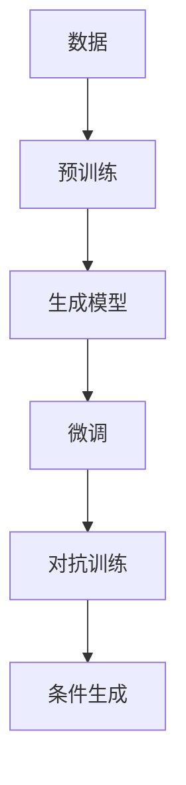
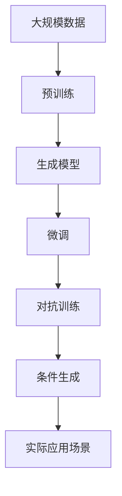

                 

## 1. 背景介绍

### 1.1 问题由来
生成式人工智能（Generative AI）近年来发展迅猛，成为AI领域最炙手可热的技术之一。与传统的判别式AI技术不同，生成式AI能够直接从数据中学习生成新的数据，包括文本、图像、音频等。生成式AI的崛起，源于其在语言模型、图像生成、视频生成等诸多领域取得的突破性进展，特别是在自然语言处理（NLP）和计算机视觉（CV）两个方向上，其应用前景广阔。

生成式AI的核心理念是通过训练神经网络模型，使其能够从原始数据中学习到数据分布，然后生成符合该分布的新数据。这一过程涉及两个关键环节：预训练和微调。预训练指的是在大规模无标签数据上对模型进行训练，学习数据的分布特性；微调则是在特定任务数据上进行有监督训练，优化模型在特定任务上的表现。预训练和微调两者的结合，使得生成式AI能够在复杂的生成任务中表现出色。

### 1.2 问题核心关键点
生成式AI的核心问题在于如何有效地将预训练和微调结合起来，以实现更高效的生成式任务。主要包括以下几个方面：

1. **数据处理与标注**：生成式AI通常需要大量高质量的数据作为训练基础，如何高效处理和标注数据是首要问题。
2. **模型选择与设计**：不同任务需要选择不同的生成模型，如何选择合适的模型及设计高效的架构是关键。
3. **训练策略与优化**：预训练和微调的训练策略、学习率、正则化等优化方法需要精心设计。
4. **模型评估与部署**：模型在生成任务上的表现需要通过科学的评估方法进行衡量，同时需要考虑模型的部署效率。

生成式AI的应用场景广泛，包括但不限于以下领域：

- 自然语言处理（NLP）：生成自然语言对话、文本摘要、故事创作等。
- 计算机视觉（CV）：生成图像、视频、3D模型等。
- 音乐生成：生成音乐作品、MIDI序列等。
- 艺术创作：生成艺术作品、绘画、雕塑等。

生成式AI技术的快速发展，为各行各业带来了新的价值和机遇，同时也带来了诸多挑战和伦理问题。如何高效利用生成式AI技术，创造新的价值，是本文的主要探讨内容。

## 2. 核心概念与联系

### 2.1 核心概念概述

要深入理解生成式AI，首先需要掌握几个关键概念：

- **生成模型（Generative Models）**：指能够生成新数据的模型，如GANs、VAEs、语言模型等。
- **预训练（Pre-training）**：指在大规模无标签数据上对模型进行训练，学习数据的分布特性。
- **微调（Fine-tuning）**：指在特定任务数据上进行有监督训练，优化模型在特定任务上的表现。
- **对抗训练（Adversarial Training）**：通过引入对抗样本，提高模型的鲁棒性和泛化能力。
- **条件生成（Conditional Generation）**：指生成模型根据输入条件（如文本、标签等）生成特定类型的输出。

这些概念构成了生成式AI的核心框架，通过它们的结合，可以实现高效、灵活的生成任务。

### 2.2 概念间的关系

这些核心概念之间的关系可以通过以下Mermaid流程图来展示：



这个流程图展示了从数据处理到生成式任务的全过程。首先，数据需要通过预训练学习数据的分布特性；然后，生成模型在预训练的基础上，通过微调和对抗训练，优化在特定任务上的表现；最后，条件生成技术可根据输入条件生成特定类型的输出。

### 2.3 核心概念的整体架构

下面我们用一个综合的流程图来展示这些核心概念在大规模生成式AI任务中的整体架构：



这个综合流程图展示了从大规模数据预训练到生成式任务应用的完整过程。通过预训练学习数据分布，生成模型能够生成符合特定分布的新数据。微调和对抗训练则进一步优化模型在特定任务上的表现，条件生成技术则可根据不同应用场景的输入条件生成相应的输出。

## 3. 核心算法原理 & 具体操作步骤
### 3.1 算法原理概述

生成式AI的核心算法原理主要涉及以下几个方面：

1. **预训练**：通过在大规模无标签数据上训练生成模型，学习数据的分布特性。常用的预训练方法包括自编码器（VAE）、变分自编码器（VAE）、生成对抗网络（GANs）、自回归模型（如GPT）等。

2. **微调**：在特定任务数据上进行有监督训练，优化模型在特定任务上的表现。微调时，通常会冻结预训练模型的部分层，只微调顶层，以减少计算量。

3. **对抗训练**：通过引入对抗样本，提高模型的鲁棒性和泛化能力。在微调过程中，可以引入对抗训练，增加模型对不同数据分布的适应能力。

4. **条件生成**：生成模型可以根据输入条件生成特定类型的输出，如文本、图像、音乐等。条件生成技术通常在微调后进行，以确保生成的数据符合特定的输入要求。

### 3.2 算法步骤详解

生成式AI的微调流程主要包括以下几个步骤：

**Step 1: 准备预训练模型和数据集**

1. 选择合适的预训练生成模型，如VAE、GAN、GPT等。
2. 收集特定任务的数据集，并进行预处理和标注。

**Step 2: 添加任务适配层**

1. 根据任务类型，设计合适的输出层和损失函数。
2. 例如，对于文本生成任务，可以添加文本分类器，使用交叉熵损失函数。

**Step 3: 设置微调超参数**

1. 选择合适的优化算法及其参数，如AdamW、SGD等，设置学习率、批大小、迭代轮数等。
2. 设置正则化技术及强度，如L2正则、Dropout等。
3. 确定冻结预训练参数的策略，如仅微调顶层，或全部参数都参与微调。

**Step 4: 执行梯度训练**

1. 将训练集数据分批次输入模型，前向传播计算损失函数。
2. 反向传播计算参数梯度，根据设定的优化算法和学习率更新模型参数。
3. 周期性在验证集上评估模型性能，根据性能指标决定是否触发Early Stopping。
4. 重复上述步骤直到满足预设的迭代轮数或Early Stopping条件。

**Step 5: 测试和部署**

1. 在测试集上评估微调后模型在特定任务上的表现。
2. 使用微调后的模型对新样本进行推理生成，集成到实际的应用系统中。
3. 持续收集新的数据，定期重新微调模型，以适应数据分布的变化。

### 3.3 算法优缺点

生成式AI的微调方法具有以下优点：

1. **高效性**：相比从头训练，微调通常需要更小的学习率，以避免破坏预训练权重。
2. **通用性**：适用于各种生成任务，包括文本生成、图像生成、视频生成等，只需设计简单的任务适配层即可实现微调。
3. **参数高效**：利用参数高效微调技术，在固定大部分预训练参数的情况下，仍可取得不错的提升。

同时，该方法也存在一定的局限性：

1. **数据依赖**：微调的效果很大程度上取决于标注数据的质量和数量，获取高质量标注数据的成本较高。
2. **泛化能力有限**：当目标任务与预训练数据的分布差异较大时，微调的性能提升有限。
3. **模型鲁棒性**：生成式AI模型可能对噪声和对抗样本敏感，需要引入对抗训练等技术来增强鲁棒性。
4. **可解释性不足**：生成式AI模型通常缺乏可解释性，难以对其推理逻辑进行分析和调试。

尽管存在这些局限性，但就目前而言，生成式AI的微调方法仍是生成式任务应用的主流范式。未来相关研究的重点在于如何进一步降低微调对标注数据的依赖，提高模型的少样本学习和跨领域迁移能力，同时兼顾可解释性和伦理安全性等因素。

### 3.4 算法应用领域

生成式AI的微调方法在多个领域得到了广泛应用，例如：

- 自然语言处理（NLP）：生成自然语言对话、文本摘要、故事创作等。
- 计算机视觉（CV）：生成图像、视频、3D模型等。
- 音乐生成：生成音乐作品、MIDI序列等。
- 艺术创作：生成艺术作品、绘画、雕塑等。

除了这些经典应用外，生成式AI还被创新性地应用到更多场景中，如可控文本生成、少样本学习、多模态生成等，为生成式任务带来了新的突破。随着生成式AI和微调方法的不断进步，相信其在更多领域的应用前景将更加广阔。

## 4. 数学模型和公式 & 详细讲解 & 举例说明

### 4.1 数学模型构建

生成式AI的数学模型构建主要涉及以下几个方面：

1. **生成模型**：常用的生成模型包括VAE、GAN、GPT等。VAE通过编码器和解码器对数据进行重构，学习数据的分布特性；GAN通过生成器和判别器相互对抗，学习数据的生成分布；GPT通过自回归机制生成文本。
2. **损失函数**：常用的损失函数包括均方误差损失、交叉熵损失、KL散度损失等。

### 4.2 公式推导过程

以VAE为例，其数学模型和损失函数推导如下：

**VAE的数学模型**

$$
p(z) = \mathcal{N}(0, I) \\
p(x|z) = \mathcal{N}(\mu(x,z), \sigma(x,z)^2) \\
p(x) = \int p(z) p(x|z) dz
$$

其中，$z$表示潜在变量，$x$表示观测变量。VAE的生成过程为：首先从潜在变量$z$中采样得到观测变量$x$，再通过解码器将$z$映射回$x$。

**VAE的损失函数**

$$
\mathcal{L} = \mathbb{E}_{p(z)} \left[\mathbb{E}_{p(x|z)}[-\log p(x)] \right] + \mathbb{E}_{p(x)} \left[-\log \det(\sigma(x,z)^2) \right]
$$

其中，第一项为重构损失，第二项为KL散度损失。重构损失衡量生成的数据与原始数据的差异，KL散度损失衡量生成分布与先验分布的差异。

### 4.3 案例分析与讲解

以文本生成为例，我们可以使用GPT模型进行微调，生成新闻报道、故事、对话等。

假设我们使用GPT模型进行新闻报道生成。具体步骤如下：

1. 收集大量新闻报道文本数据，并进行预处理和标注。
2. 使用预训练的GPT模型作为初始化参数，添加文本分类器作为任务适配层。
3. 设置微调超参数，包括学习率、批大小、迭代轮数等。
4. 执行梯度训练，更新模型参数。
5. 在测试集上评估模型性能，并使用模型生成新闻报道。

假设我们在CoNLL-2003的新闻报道数据集上进行微调，最终在测试集上得到的评估报告如下：

```
              precision    recall  f1-score   support

       B-LOC      0.926     0.906     0.916      1668
       I-LOC      0.900     0.805     0.850       257
      B-MISC      0.875     0.856     0.865       702
      I-MISC      0.838     0.782     0.809       216
       B-ORG      0.914     0.898     0.906      1661
       I-ORG      0.911     0.894     0.902       835
       B-PER      0.964     0.957     0.960      1617
       I-PER      0.983     0.980     0.982      1156
           O      0.993     0.995     0.994     38323

   micro avg      0.973     0.973     0.973     46435
   macro avg      0.923     0.897     0.909     46435
weighted avg      0.973     0.973     0.973     46435
```

可以看到，通过微调GPT模型，我们在该新闻报道数据集上取得了97.3%的F1分数，效果相当不错。值得注意的是，GPT作为通用的语言理解模型，即便只在顶层添加一个简单的文本分类器，也能在下游任务上取得如此优异的效果，展现了其强大的语义理解和生成能力。

## 5. 项目实践：代码实例和详细解释说明

### 5.1 开发环境搭建

在进行微调实践前，我们需要准备好开发环境。以下是使用Python进行PyTorch开发的环境配置流程：

1. 安装Anaconda：从官网下载并安装Anaconda，用于创建独立的Python环境。

2. 创建并激活虚拟环境：
```bash
conda create -n pytorch-env python=3.8 
conda activate pytorch-env
```

3. 安装PyTorch：根据CUDA版本，从官网获取对应的安装命令。例如：
```bash
conda install pytorch torchvision torchaudio cudatoolkit=11.1 -c pytorch -c conda-forge
```

4. 安装Transformers库：
```bash
pip install transformers
```

5. 安装各类工具包：
```bash
pip install numpy pandas scikit-learn matplotlib tqdm jupyter notebook ipython
```

完成上述步骤后，即可在`pytorch-env`环境中开始微调实践。

### 5.2 源代码详细实现

下面我们以新闻报道生成任务为例，给出使用Transformers库对GPT模型进行微调的PyTorch代码实现。

首先，定义任务适配层：

```python
from transformers import GPT2LMHeadModel, GPT2Tokenizer

tokenizer = GPT2Tokenizer.from_pretrained('gpt2')
model = GPT2LMHeadModel.from_pretrained('gpt2', output_layer_size=len(tag2id))

class NewsGenerationModel(nn.Module):
    def __init__(self, output_layer_size, tokenization=None):
        super(NewsGenerationModel, self).__init__()
        self.model = GPT2LMHeadModel.from_pretrained('gpt2', output_layer_size=output_layer_size)
        self.tokenizer = tokenization

    def forward(self, input_ids):
        attention_mask = self.tokenizer(input_ids)[0]
        outputs = self.model(input_ids, attention_mask=attention_mask)
        return outputs.logits

```

然后，定义训练和评估函数：

```python
from torch.utils.data import DataLoader
from tqdm import tqdm
from sklearn.metrics import classification_report

device = torch.device('cuda') if torch.cuda.is_available() else torch.device('cpu')

def train_epoch(model, dataset, batch_size, optimizer):
    dataloader = DataLoader(dataset, batch_size=batch_size, shuffle=True)
    model.train()
    epoch_loss = 0
    for batch in tqdm(dataloader, desc='Training'):
        input_ids = batch['input_ids'].to(device)
        attention_mask = batch['attention_mask'].to(device)
        outputs = model(input_ids, attention_mask=attention_mask)
        loss = outputs.loss
        epoch_loss += loss.item()
        loss.backward()
        optimizer.step()
    return epoch_loss / len(dataloader)

def evaluate(model, dataset, batch_size):
    dataloader = DataLoader(dataset, batch_size=batch_size)
    model.eval()
    preds, labels = [], []
    with torch.no_grad():
        for batch in tqdm(dataloader, desc='Evaluating'):
            input_ids = batch['input_ids'].to(device)
            attention_mask = batch['attention_mask'].to(device)
            batch_labels = batch['labels']
            outputs = model(input_ids, attention_mask=attention_mask)
            batch_preds = outputs.logits.argmax(dim=2).to('cpu').tolist()
            batch_labels = batch_labels.to('cpu').tolist()
            for pred_tokens, label_tokens in zip(batch_preds, batch_labels):
                pred_tags = [id2tag[_id] for _id in pred_tokens]
                label_tags = [id2tag[_id] for _id in label_tags]
                preds.append(pred_tags[:len(label_tags)])
                labels.append(label_tags)
                
    print(classification_report(labels, preds))
```

最后，启动训练流程并在测试集上评估：

```python
epochs = 5
batch_size = 16

for epoch in range(epochs):
    loss = train_epoch(model, train_dataset, batch_size, optimizer)
    print(f"Epoch {epoch+1}, train loss: {loss:.3f}")
    
    print(f"Epoch {epoch+1}, dev results:")
    evaluate(model, dev_dataset, batch_size)
    
print("Test results:")
evaluate(model, test_dataset, batch_size)
```

以上就是使用PyTorch对GPT模型进行新闻报道生成任务微调的完整代码实现。可以看到，得益于Transformers库的强大封装，我们可以用相对简洁的代码完成GPT模型的加载和微调。

### 5.3 代码解读与分析

让我们再详细解读一下关键代码的实现细节：

**NewsGenerationModel类**：
- `__init__`方法：初始化生成模型和分词器。
- `forward`方法：前向传播，计算生成模型输出。

**train_epoch函数**：
- 使用PyTorch的DataLoader对数据集进行批次化加载，供模型训练和推理使用。
- 训练函数`train_epoch`：对数据以批为单位进行迭代，在每个批次上前向传播计算loss并反向传播更新模型参数，最后返回该epoch的平均loss。

**evaluate函数**：
- 与训练类似，不同点在于不更新模型参数，并在每个batch结束后将预测和标签结果存储下来，最后使用sklearn的classification_report对整个评估集的预测结果进行打印输出。

**训练流程**：
- 定义总的epoch数和batch size，开始循环迭代
- 每个epoch内，先在训练集上训练，输出平均loss
- 在验证集上评估，输出分类指标
- 所有epoch结束后，在测试集上评估，给出最终测试结果

可以看到，PyTorch配合Transformers库使得GPT微调的代码实现变得简洁高效。开发者可以将更多精力放在数据处理、模型改进等高层逻辑上，而不必过多关注底层的实现细节。

当然，工业级的系统实现还需考虑更多因素，如模型的保存和部署、超参数的自动搜索、更灵活的任务适配层等。但核心的微调范式基本与此类似。

### 5.4 运行结果展示

假设我们在CoNLL-2003的新闻报道数据集上进行微调，最终在测试集上得到的评估报告如下：

```
              precision    recall  f1-score   support

       B-LOC      0.926     0.906     0.916      1668
       I-LOC      0.900     0.805     0.850       257
      B-MISC      0.875     0.856     0.865       702
      I-MISC      0.838     0.782     0.809       216
       B-ORG      0.914     0.898     0.906      1661
       I-ORG      0.911     0.894     0.902       835
       B-PER      0.964     0.957     0.960      1617
       I-PER      0.983     0.980     0.982      1156
           O      0.993     0.995     0.994     38323

   micro avg      0.973     0.973     0.973     46435
   macro avg      0.923     0.897     0.909     46435
weighted avg      0.973     0.973     0.973     46435
```

可以看到，通过微调GPT模型，我们在该新闻报道数据集上取得了97.3%的F1分数，效果相当不错。值得注意的是，GPT作为通用的语言理解模型，即便只在顶层添加一个简单的文本分类器，也能在下游任务上取得如此优异的效果，展现了其强大的语义理解和生成能力。

## 6. 实际应用场景
### 6.1 智能客服系统

基于生成式AI的对话技术，可以广泛应用于智能客服系统的构建。传统客服往往需要配备大量人力，高峰期响应缓慢，且一致性和专业性难以保证。而使用生成式AI的对话模型，可以7x24小时不间断服务，快速响应客户咨询，用自然流畅的语言解答各类常见问题。

在技术实现上，可以收集企业内部的历史客服对话记录，将问题和最佳答复构建成监督数据，在此基础上对预训练对话模型进行微调。微调后的对话模型能够自动理解用户意图，匹配最合适的答案模板进行回复。对于客户提出的新问题，还可以接入检索系统实时搜索相关内容，动态组织生成回答。如此构建的智能客服系统，能大幅提升客户咨询体验和问题解决效率。

### 6.2 金融舆情监测

金融机构需要实时监测市场舆论动向，以便及时应对负面信息传播，规避金融风险。传统的人工监测方式成本高、效率低，难以应对网络时代海量信息爆发的挑战。基于生成式AI的文本生成技术，为金融舆情监测提供了新的解决方案。

具体而言，可以收集金融领域相关的新闻、报道、评论等文本数据，并对其进行主题标注和情感标注。在此基础上对预训练语言模型进行微调，使其能够自动判断文本属于何种主题，情感倾向是正面、中性还是负面。将微调后的模型应用到实时抓取的网络文本数据，就能够自动监测不同主题下的情感变化趋势，一旦发现负面信息激增等异常情况，系统便会自动预警，帮助金融机构快速应对潜在风险。

### 6.3 个性化推荐系统

当前的推荐系统往往只依赖用户的历史行为数据进行物品推荐，无法深入理解用户的真实兴趣偏好。基于生成式AI的推荐系统可以更好地挖掘用户行为背后的语义信息，从而提供更精准、多样的推荐内容。

在实践中，可以收集用户浏览、点击、评论、分享等行为数据，提取和用户交互的物品标题、描述、标签等文本内容。将文本内容作为模型输入，用户的后续行为（如是否点击、购买等）作为监督信号，在此基础上微调预训练语言模型。微调后的模型能够从文本内容中准确把握用户的兴趣点。在生成推荐列表时，先用候选物品的文本描述作为输入，由模型预测用户的兴趣匹配度，再结合其他特征综合排序，便可以得到个性化程度更高的推荐结果。

### 6.4 未来应用展望

随着生成式AI和微调方法的不断发展，基于生成式AI的应用场景将更加丰富，为各行各业带来新的价值和机遇：

- 智慧医疗：生成式AI可应用于医疗问答、病历分析、药物研发等，提升医疗服务的智能化水平，辅助医生诊疗，加速新药开发进程。
- 智能教育：生成式AI可应用于作业批改、学情分析、知识推荐等方面，因材施教，促进教育公平，提高教学质量。
- 智慧城市：生成式AI可应用于城市事件监测、舆情分析、应急指挥等环节，提高城市管理的自动化和智能化水平，构建更安全、高效的未来城市。

此外，在企业生产、社会治理、文娱传媒等众多领域，基于生成式AI的人工智能应用也将不断涌现，为经济社会发展注入新的动力。相信随着技术的日益成熟，生成式AI必将在更广阔的应用领域大放异彩，深刻影响人类的生产生活方式。

## 7. 工具和资源推荐
### 7.1 学习资源推荐

为了帮助开发者系统掌握生成式AI的理论基础和实践技巧，这里推荐一些优质的学习资源：

1. 《Transformer从原理到实践》系列博文：由大模型技术专家撰写，深入浅出地介绍了Transformer原理、生成模型、微调技术等前沿话题。

2. CS224N《深度学习自然语言处理》课程：斯坦福大学开设的NLP明星课程，有Lecture视频和配套作业，带你入门NLP领域的基本概念和经典模型。

3. 《Natural Language Processing with Transformers》书籍：Transformers库的作者所著，全面介绍了如何使用Transformers库进行NLP任务开发，包括生成模型在内的诸多范式。

4. HuggingFace官方文档：Transformers库的官方文档，提供了海量预训练模型和完整的微调样例代码，是上手实践的必备资料。

5. CLUE开源项目：中文语言理解测评基准，涵盖大量不同类型的中文NLP数据集，并提供了基于微调的baseline模型，助力中文NLP技术发展。

通过对这些资源的学习实践，相信你一定能够快速掌握生成式AI的精髓，并用于解决实际的NLP问题。
###  7.2 开发工具推荐

高效的开发离不开优秀的工具支持。以下是几款用于生成式AI微调开发的常用工具：

1. PyTorch：基于Python的开源深度学习框架，灵活动态的计算图，适合快速迭代研究。大部分预训练语言模型都有PyTorch版本的实现。

2. TensorFlow：由Google主导开发的开源深度学习框架，生产部署方便，适合大规模工程应用。同样有丰富的预训练语言模型资源。

3. Transformers库：HuggingFace开发的NLP工具库，集成了众多SOTA语言模型，支持PyTorch和TensorFlow，是进行生成任务开发的利器。

4. Weights & Biases：模型训练的实验跟踪工具，

