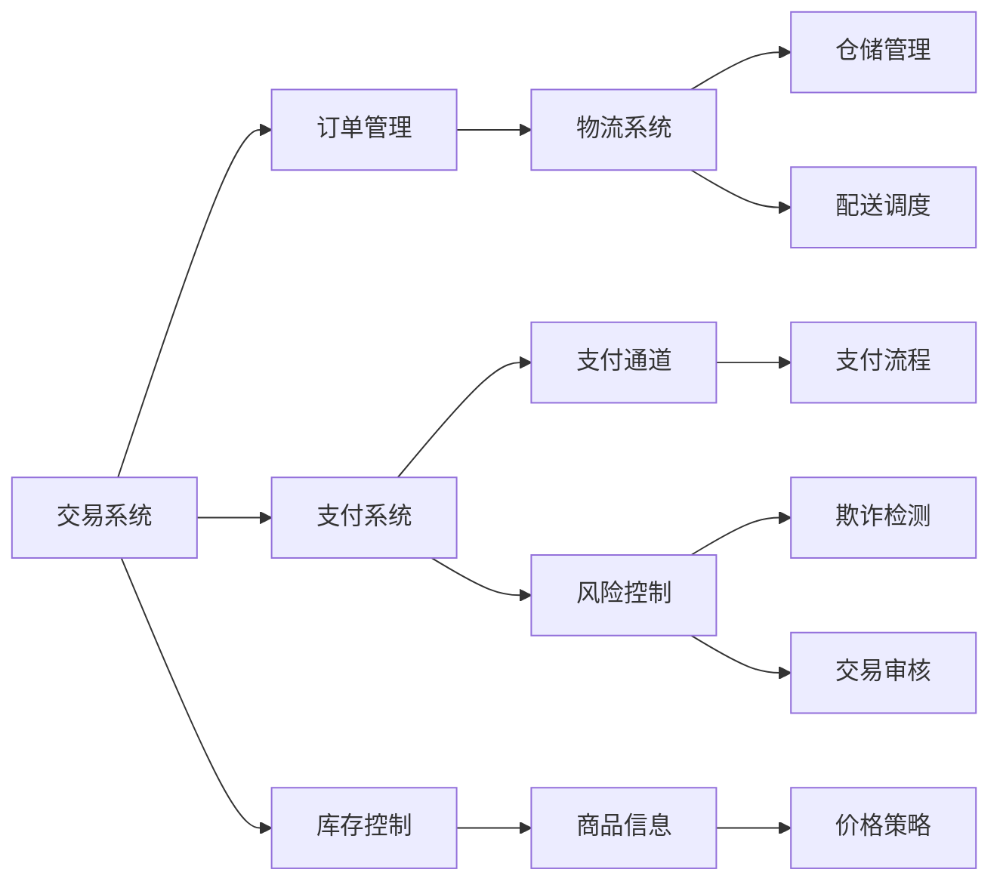
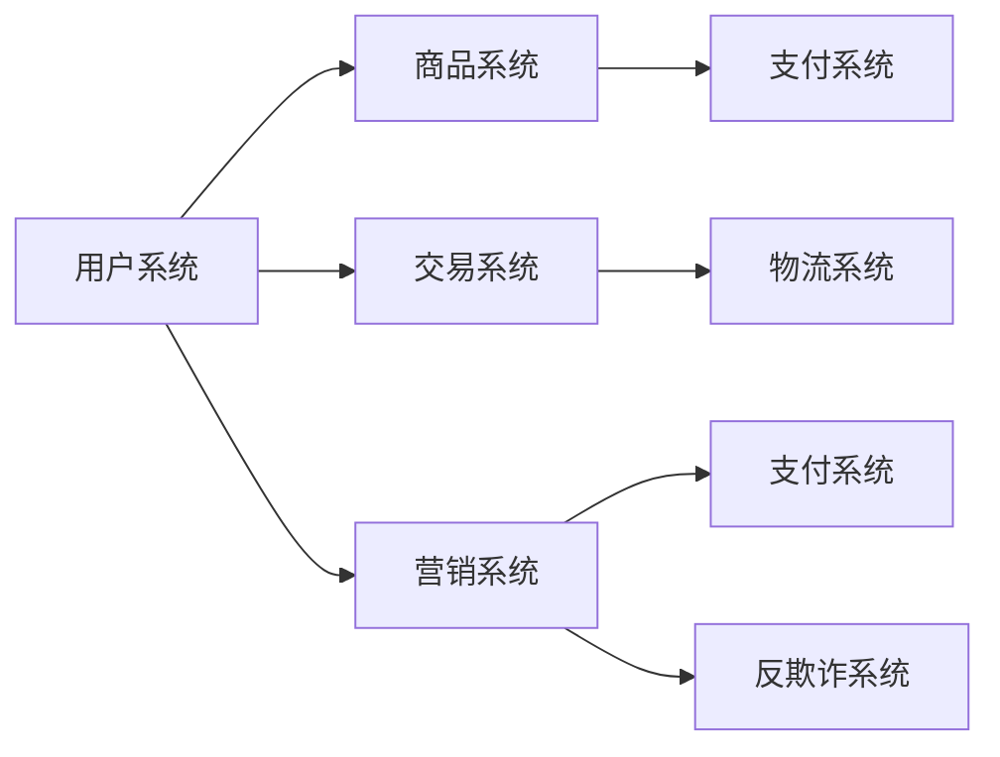
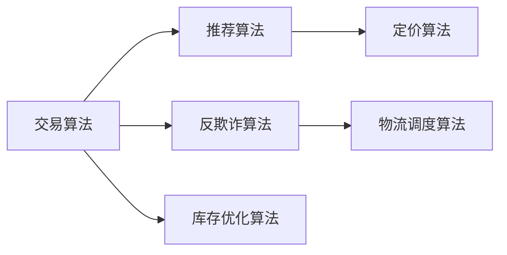

                 

# 电商业务和多元化业务模式

> 关键词：电商, 业务模式, 多元, 交易, 物流, 数据驱动, 用户行为, 营销策略, 反欺诈

## 1. 背景介绍

在数字化转型的大潮中，电商业务已逐渐成为各行各业的标配。从B2B到B2C，从C2C到C2B，从O2O到即买即得，电商的边界被不断拓展。与此同时，电商的业务模式也呈现多元化的趋势，包括但不限于交易型、内容型、社交型、服务型、本地化等。因此，如何在多变的电商环境中，构建灵活且可扩展的业务模式，成为电商平台必须面对的重要课题。

### 1.1 电商业务的定义和特征

电商业务指的是通过互联网进行商品和服务的交易活动，包括线上交易、支付、物流、客服等环节。与传统的线下模式相比，电商具有以下特征：

- **数字化**：线上操作无纸化，数据可追溯，便于管理。
- **便捷性**：打破了时间空间限制，用户可随时随地进行交易。
- **多样性**：商品种类繁多，服务形式丰富，满足用户多样化的需求。
- **数据驱动**：依托大数据和AI技术，精准分析和预测用户行为，提升用户体验。
- **实时交互**：在线客服、评价反馈等即时沟通方式，增强用户粘性。
- **开放性**：平台开放，支持第三方商家入驻，形成生态。

电商业务的成功，不仅取决于商品质量和价格，还在于其能否提供优质服务和便捷体验，满足用户需求。因此，电商平台的业务模式设计显得尤为重要。

### 1.2 电商业务的分类和挑战

电商业务的分类主要依据其核心业务类型的不同，如交易型、内容型、社交型、服务型等。每一类业务都有其特定的挑战和难点。

- **交易型电商**：以买卖交易为核心，主要挑战在于保障交易安全、提升用户体验、控制成本和库存。
- **内容型电商**：以内容创造和分享为核心，主要挑战在于内容质量、用户粘性、广告收益和流量变现。
- **社交型电商**：以社交关系为核心，主要挑战在于用户关系构建、社区维护、用户互动和商业化。
- **服务型电商**：以提供服务为核心，主要挑战在于服务质量、用户体验、技术支撑和盈利模式。
- **本地化电商**：以本地化服务为核心，主要挑战在于区域市场准入、本地服务覆盖、用户口碑和流量获取。

不同业务模式面临的挑战不同，但共同点在于均需依托于高效、稳定、可扩展的业务架构和系统。

## 2. 核心概念与联系

### 2.1 核心概念概述

电商业务的核心概念主要包括以下几个方面：

- **交易系统**：电商业务的交易核心，负责订单生成、支付、发货、退货等环节。
- **用户系统**：负责用户账户管理、用户画像构建、用户行为分析等。
- **商品系统**：包括商品信息管理、库存控制、价格策略等。
- **物流系统**：负责订单物流管理、仓储管理、配送调度等。
- **支付系统**：负责支付流程管理、支付通道对接、风险控制等。
- **营销系统**：负责广告投放、促销活动、用户运营等。
- **反欺诈系统**：负责风险检测、欺诈防范、交易审核等。

这些核心概念通过协同工作，共同支撑电商业务的顺利进行。以下用Mermaid流程图展示这些概念之间的关系：



### 2.2 概念间的关系

核心概念之间的关系密切，相互依存。以下用Mermaid流程图展示核心概念之间的关系：



## 3. 核心算法原理 & 具体操作步骤

### 3.1 算法原理概述

电商业务的算法设计旨在通过优化交易流程、提升用户体验、控制成本和风险，从而实现业务目标。其核心算法原理包括：

- **交易算法**：优化交易流程，提高交易效率和用户体验。
- **推荐算法**：通过用户画像和行为分析，推荐个性化商品和活动。
- **反欺诈算法**：利用机器学习等技术，检测和防范欺诈行为。
- **库存优化算法**：实时监控库存，优化商品供应和仓储管理。
- **定价算法**：根据市场需求和竞争情况，动态调整商品价格。
- **物流调度算法**：优化物流路线和资源分配，提升配送效率。

这些算法共同构成了电商业务的运行基础。以下用Mermaid流程图展示核心算法之间的关系：



### 3.2 算法步骤详解

电商业务的算法步骤一般包括以下几个环节：

1. **数据收集**：通过用户行为数据、交易数据、物流数据等，收集业务相关数据。
2. **数据处理**：对收集到的数据进行清洗、去重、标注等处理，为后续算法分析做准备。
3. **算法模型构建**：根据业务需求，选择合适的算法模型，如分类算法、回归算法、聚类算法等。
4. **模型训练**：使用收集到的数据对模型进行训练，调整模型参数，优化模型性能。
5. **模型评估**：通过测试集对模型进行评估，检查模型泛化能力。
6. **模型部署**：将训练好的模型部署到生产环境，实时应用到业务系统中。
7. **模型迭代**：根据业务反馈和最新数据，不断更新和迭代算法模型。

以下是具体算法的详细步骤：

#### 3.2.1 交易算法

交易算法的核心在于优化交易流程，提升交易效率和用户体验。具体步骤如下：

1. **订单生成**：用户下单时，交易系统根据订单信息，调用商品系统和库存控制系统，生成订单。
2. **支付处理**：交易系统调用支付系统，根据订单信息生成支付请求，支付系统调用第三方支付通道进行支付。
3. **订单跟踪**：交易系统实时监控订单状态，并更新用户系统中的订单信息。
4. **订单物流**：交易系统调用物流系统，进行订单物流跟踪，并更新用户系统中的物流信息。
5. **订单评价**：交易系统接收用户对订单的评价反馈，并更新用户画像，为后续推荐和运营提供参考。

#### 3.2.2 推荐算法

推荐算法的核心在于根据用户行为和偏好，推荐个性化商品和活动。具体步骤如下：

1. **用户画像构建**：根据用户历史行为、浏览记录、购买记录等，构建用户画像。
2. **行为分析**：分析用户行为数据，识别出用户兴趣点。
3. **商品推荐**：利用推荐算法，根据用户画像和行为分析，推荐个性化商品和活动。
4. **效果评估**：通过A/B测试等手段，评估推荐效果，不断优化推荐算法。

#### 3.2.3 反欺诈算法

反欺诈算法的核心在于检测和防范欺诈行为。具体步骤如下：

1. **风险检测**：根据用户行为、交易信息、设备信息等，使用机器学习算法检测异常行为。
2. **欺诈防范**：根据风险检测结果，采取不同的防范措施，如拒绝交易、限制登录等。
3. **交易审核**：对疑似欺诈交易进行审核，确保交易安全。

#### 3.2.4 库存优化算法

库存优化算法的核心在于实时监控库存，优化商品供应和仓储管理。具体步骤如下：

1. **库存监控**：实时监控库存数据，获取库存情况。
2. **需求预测**：根据历史销售数据和市场趋势，预测商品需求量。
3. **库存调配**：根据需求预测结果，优化库存调配，避免库存积压或缺货。

#### 3.2.5 定价算法

定价算法的核心在于根据市场需求和竞争情况，动态调整商品价格。具体步骤如下：

1. **市场分析**：分析市场趋势和竞争情况，获取定价参考。
2. **动态定价**：根据市场分析结果，动态调整商品价格。
3. **价格优化**：通过实验和分析，优化商品价格策略。

#### 3.2.6 物流调度算法

物流调度算法的核心在于优化物流路线和资源分配，提升配送效率。具体步骤如下：

1. **路线规划**：根据订单信息，规划最优物流路线。
2. **资源分配**：根据物流路线和订单量，合理分配物流资源。
3. **调度优化**：实时优化物流调度，提升配送效率。

### 3.3 算法优缺点

电商业务的算法设计存在以下优点和缺点：

**优点**：

1. **数据驱动**：算法设计依赖于大量的业务数据，能够提供精准的决策依据。
2. **自动化**：算法能够自动处理业务流程，提升运营效率。
3. **个性化**：通过推荐算法，能够提供个性化商品和活动，提升用户体验。
4. **风险控制**：通过反欺诈算法，能够保障交易安全。

**缺点**：

1. **数据质量要求高**：算法设计对数据质量要求较高，需要保证数据的完整性和准确性。
2. **复杂度高**：算法设计涉及多个环节，需要综合考虑多方面因素，复杂度较高。
3. **模型更新频繁**：业务环境变化快，需要频繁更新和迭代算法模型，增加了维护成本。

### 3.4 算法应用领域

电商业务的算法设计涉及多个领域，以下具体列出其应用领域：

1. **交易系统**：应用于订单生成、支付处理、物流跟踪等环节，提升交易效率和用户体验。
2. **用户系统**：应用于用户画像构建、行为分析等环节，提升用户粘性和满意度。
3. **商品系统**：应用于商品信息管理、库存控制等环节，优化商品供应和仓储管理。
4. **物流系统**：应用于物流路线规划、资源分配等环节，提升配送效率。
5. **支付系统**：应用于支付流程管理、风险控制等环节，保障支付安全。
6. **营销系统**：应用于广告投放、促销活动等环节，提升广告收益和流量变现。
7. **反欺诈系统**：应用于风险检测、欺诈防范等环节，保障交易安全。

## 4. 数学模型和公式 & 详细讲解 & 举例说明

### 4.1 数学模型构建

电商业务的数学模型构建主要基于统计学、优化学、机器学习等理论。以下介绍几个典型的数学模型及其构建方法。

#### 4.1.1 线性回归模型

线性回归模型用于预测商品价格，其数学模型为：

$$
y = \beta_0 + \beta_1 x_1 + \beta_2 x_2 + \cdots + \beta_n x_n + \epsilon
$$

其中，$y$为预测值，$\beta_0$为截距，$\beta_1, \beta_2, \cdots, \beta_n$为回归系数，$x_1, x_2, \cdots, x_n$为自变量，$\epsilon$为随机误差。

#### 4.1.2 决策树模型

决策树模型用于分类商品类型，其数学模型为：

$$
T = \lbrace T_1, T_2, \cdots, T_n \rbrace
$$

其中，$T_i$为决策树，每个叶子节点表示一个商品类型。

#### 4.1.3 随机森林模型

随机森林模型用于提升分类准确率，其数学模型为：

$$
\text{Accuracy} = \frac{\text{TP} + \text{TN}}{\text{TP} + \text{FP} + \text{TN} + \text{FN}}
$$

其中，$\text{TP}$为真阳性，$\text{FP}$为假阳性，$\text{TN}$为真阴性，$\text{FN}$为假阴性。

#### 4.1.4 支持向量机模型

支持向量机模型用于分类和回归，其数学模型为：

$$
w = \mathop{\arg\min}_{w} \frac{1}{2} w^T w + C \sum_{i=1}^{n} \max(0, 1 - y_i w^T x_i)
$$

其中，$w$为权重向量，$C$为正则化参数。

### 4.2 公式推导过程

以下以线性回归模型为例，展示其公式推导过程。

设样本集为$(x_1, y_1), (x_2, y_2), \cdots, (x_n, y_n)$，其中$x_i$为自变量，$y_i$为因变量。目标是最小化误差平方和，即：

$$
\min_{\beta_0, \beta_1, \cdots, \beta_n} \sum_{i=1}^{n} (y_i - \beta_0 - \beta_1 x_1 - \beta_2 x_2 - \cdots - \beta_n x_n)^2
$$

通过对误差平方和求导，可得到最小化条件为：

$$
\beta_j = \frac{\sum_{i=1}^{n} (x_j - \bar{x}_j)(y_i - \bar{y})}{\sum_{i=1}^{n} (x_j - \bar{x}_j)^2}
$$

其中，$\bar{x}_j$和$\bar{y}$分别为自变量和因变量的均值。

### 4.3 案例分析与讲解

以下以商品推荐算法为例，展示其具体实现步骤：

1. **数据收集**：从用户系统中收集用户行为数据，如浏览记录、购买记录等。
2. **数据处理**：对收集到的数据进行清洗、去重、标注等处理，构建用户画像。
3. **特征提取**：对用户画像中的数据进行特征提取，如用户兴趣、商品类别等。
4. **模型训练**：使用随机森林等算法，训练商品推荐模型。
5. **模型评估**：通过A/B测试等手段，评估推荐效果，不断优化模型。
6. **模型部署**：将训练好的模型部署到推荐系统，实时推荐个性化商品和活动。

## 5. 项目实践：代码实例和详细解释说明

### 5.1 开发环境搭建

电商业务的开发环境搭建主要包括以下几个步骤：

1. **环境准备**：准备Python、Java、Python虚拟环境等开发工具。
2. **框架选择**：选择Flask、Django、Spring Boot等Web框架。
3. **数据库配置**：选择MySQL、PostgreSQL等数据库，并进行配置。
4. **开发工具安装**：安装Visual Studio Code、PyCharm、Eclipse等开发工具。
5. **版本控制**：使用Git等版本控制工具，进行代码管理。

以下是具体搭建步骤：

```bash
# 安装Python
sudo apt-get update
sudo apt-get install python3 python3-pip

# 创建虚拟环境
python3 -m venv venv
source venv/bin/activate

# 安装Flask
pip install flask

# 配置MySQL数据库
CREATE DATABASE `e-commerce` CHARACTER SET utf8mb4;
USE `e-commerce`;
CREATE TABLE `users` (
  `id` int NOT NULL AUTO_INCREMENT,
  `username` varchar(255) NOT NULL,
  `password` varchar(255) NOT NULL,
  `email` varchar(255) NOT NULL,
  PRIMARY KEY (`id`)
) ENGINE=InnoDB DEFAULT CHARSET=utf8mb4;

# 安装可视化工具
pip install matplotlib

# 配置Django
pip install Django

# 安装版本控制工具
pip install git
```

### 5.2 源代码详细实现

以下是一个简单的电商交易系统示例代码：

```python
from flask import Flask, request, jsonify

app = Flask(__name__)

# 商品信息
products = {
    1: {
        'name': 'Product 1',
        'price': 10.00
    },
    2: {
        'name': 'Product 2',
        'price': 20.00
    }
}

# 订单信息
orders = {}

@app.route('/api/orders', methods=['POST'])
def create_order():
    data = request.get_json()
    product_id = data['product_id']
    quantity = data['quantity']
    if product_id in products:
        total_price = products[product_id]['price'] * quantity
        order_id = len(orders) + 1
        orders[order_id] = {
            'product_id': product_id,
            'quantity': quantity,
            'total_price': total_price
        }
        return jsonify({'order_id': order_id, 'total_price': total_price}), 200
    else:
        return jsonify({'error': 'Product not found'}), 400

@app.route('/api/orders/<order_id>', methods=['GET'])
def get_order(order_id):
    if order_id in orders:
        return jsonify(orders[order_id]), 200
    else:
        return jsonify({'error': 'Order not found'}), 404

if __name__ == '__main__':
    app.run(debug=True)
```

### 5.3 代码解读与分析

以上代码实现了一个简单的电商交易系统，包括商品信息管理、订单创建和订单查询。

1. **Flask框架**：使用Flask框架构建Web应用，提供RESTful接口。
2. **商品信息管理**：使用Python字典存储商品信息，提供商品ID、名称和价格。
3. **订单信息管理**：使用Python字典存储订单信息，提供订单ID、商品ID、数量和总价。
4. **订单创建接口**：提供POST接口，接收商品ID和数量，生成订单ID，返回订单ID和总价。
5. **订单查询接口**：提供GET接口，根据订单ID查询订单信息，返回订单详情。

### 5.4 运行结果展示

假设用户下单购买Product 1，数量为2，则调用create_order接口后，返回的JSON数据如下：

```json
{
  "order_id": 1,
  "total_price": 20.00
}
```

然后用户调用get_order接口查询订单详情，返回的JSON数据如下：

```json
{
  "product_id": 1,
  "quantity": 2,
  "total_price": 20.00
}
```

## 6. 实际应用场景

### 6.1 智能推荐系统

智能推荐系统是电商业务的核心应用之一，通过分析用户行为和偏好，推荐个性化商品和活动，提升用户体验和销售转化率。

在实际应用中，智能推荐系统通常包括以下几个模块：

1. **用户画像模块**：构建用户画像，分析用户历史行为和偏好。
2. **商品推荐模块**：根据用户画像和商品信息，推荐个性化商品。
3. **活动推荐模块**：根据用户画像和活动信息，推荐个性化活动。
4. **效果评估模块**：评估推荐效果，不断优化推荐算法。

智能推荐系统的核心在于通过算法设计和模型训练，最大化推荐准确率和用户满意度。

### 6.2 订单管理系统

订单管理系统是电商业务的基础，负责订单生成、支付处理、物流跟踪等环节，提升交易效率和用户体验。

在实际应用中，订单管理系统通常包括以下几个模块：

1. **订单生成模块**：根据用户订单信息，调用商品系统和库存控制系统，生成订单。
2. **支付处理模块**：调用支付系统，处理支付请求，保障支付安全。
3. **订单跟踪模块**：实时监控订单状态，更新用户系统中的订单信息。
4. **物流跟踪模块**：调用物流系统，进行订单物流跟踪，更新用户系统中的物流信息。

订单管理系统的核心在于通过算法设计和系统架构，保障交易安全和用户体验。

### 6.3 个性化营销系统

个性化营销系统是电商业务的辅助应用，通过分析用户行为和偏好，设计个性化营销策略，提升广告收益和流量变现。

在实际应用中，个性化营销系统通常包括以下几个模块：

1. **用户行为分析模块**：分析用户行为数据，识别出用户兴趣点。
2. **广告投放模块**：根据用户兴趣点，设计个性化广告方案。
3. **广告效果评估模块**：评估广告效果，不断优化广告投放策略。

个性化营销系统的核心在于通过算法设计和数据驱动，提升广告投放效果和广告收益。

## 7. 工具和资源推荐

### 7.1 学习资源推荐

为帮助开发者系统掌握电商业务的算法设计和系统实现，以下推荐一些优质的学习资源：

1. **《电商算法设计与实现》**：本书系统介绍了电商业务的算法设计和系统实现，涵盖交易算法、推荐算法、反欺诈算法等。
2. **《Python网络爬虫与数据分析》**：本书介绍了Python在电商业务中的应用，包括数据采集、数据清洗、数据分析等。
3. **《机器学习实战》**：本书提供了机器学习算法的实现示例，适合动手实践。
4. **《Flask Web开发实战》**：本书介绍了Flask框架的详细应用，适合电商业务的Web开发实践。
5. **《Django Web开发实战》**：本书介绍了Django框架的详细应用，适合电商业务的Web开发实践。

### 7.2 开发工具推荐

电商业务的开发工具推荐包括：

1. **Python**：Python语言在电商业务中广泛应用，具有高效、易读、易维护的特点。
2. **Java**：Java语言在电商业务的后台系统开发中应用广泛，具有高可靠、高性能的特点。
3. **Flask**：轻量级Web框架，适合电商业务的Web开发。
4. **Django**：全栈Web框架，适合电商业务的Web开发。
5. **MySQL**：关系型数据库，适合电商业务的数据存储和管理。
6. **PostgreSQL**：关系型数据库，支持复杂查询和事务处理，适合电商业务的高级应用。

### 7.3 相关论文推荐

电商业务的算法设计涉及多个领域，以下推荐一些相关论文：

1. **《基于机器学习的电商推荐算法研究》**：论文探讨了基于机器学习的电商推荐算法，涵盖了线性回归、决策树、随机森林等算法。
2. **《电商交易系统的设计与实现》**：论文介绍了电商交易系统的设计与实现，涵盖订单生成、支付处理、物流跟踪等环节。
3. **《电商反欺诈系统的设计与实现》**：论文探讨了电商反欺诈系统的设计与实现，涵盖风险检测、欺诈防范、交易审核等环节。
4. **《电商个性化营销系统的设计与实现》**：论文介绍了电商个性化营销系统的设计与实现，涵盖用户行为分析、广告投放、广告效果评估等环节。

## 8. 总结：未来发展趋势与挑战

### 8.1 总结

本文对电商业务的算法设计和系统实现进行了全面系统的介绍。首先阐述了电商业务的定义和特征，明确了电商业务的多种分类和面临的挑战。其次，从算法设计、模型构建、代码实现等方面，详细讲解了电商业务的算法设计和系统实现。最后，探讨了电商业务的实际应用场景和未来发展趋势。

通过本文的系统梳理，可以看到，电商业务的算法设计和系统实现需要依托于数据驱动、算法优化、系统架构设计等多方面技术，才能满足实际业务需求。未来，随着电商业务场景的多样化和复杂化，算法设计和系统架构的优化将成为关键。

### 8.2 未来发展趋势

电商业务的未来发展趋势主要包括以下几个方面：

1. **算法智能化**：算法设计将更加智能化，通过深度学习、强化学习等技术，提升算法效果和用户满意度。
2. **系统自动化**：系统架构将更加自动化，通过自动化运维、自动化测试等技术，提升系统稳定性和运维效率。
3. **平台开放化**：电商平台将更加开放，通过API接口和生态合作，提升平台生态价值。
4. **数据驱动化**：业务决策将更加数据驱动，通过大数据和AI技术，提升业务决策的精准性和科学性。
5. **用户体验化**：业务设计将更加注重用户体验，通过个性化推荐、智能客服等技术，提升用户体验和满意度。
6. **安全可靠化**：业务系统将更加安全可靠，通过区块链、加密技术等手段，保障交易安全和个人隐私。

### 8.3 面临的挑战

电商业务的未来发展仍面临诸多挑战：

1. **数据安全**：电商业务涉及大量用户隐私数据，数据安全问题亟需解决。
2. **算法鲁棒性**：算法设计需要具备较强的鲁棒性，避免算法模型在复杂环境中失效。
3. **系统扩展性**：电商平台需要具备良好的扩展性，以应对业务流量峰值和数据增长。
4. **用户体验**：电商业务需要持续提升用户体验，通过算法优化和系统设计，满足用户多样化需求。
5. **运营成本**：电商业务的运营成本较高，需要通过算法设计和系统优化，降低运营成本。

### 8.4 研究展望

电商业务的未来研究展望主要包括以下几个方面：

1. **多模态学习**：引入多模态数据，提升电商业务的综合能力。
2. **跨领域应用**：将电商业务应用于更多领域，提升电商业务的影响力。
3. **用户行为预测**：通过预测用户行为，优化电商业务策略。
4. **算法模型优化**：通过

