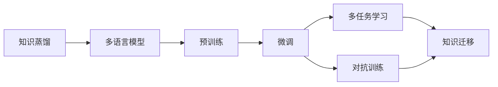
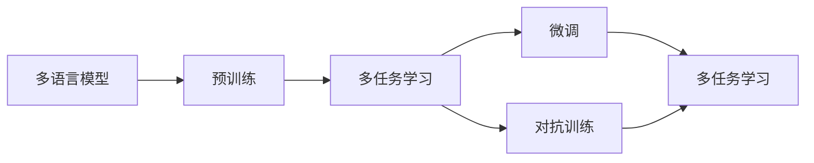
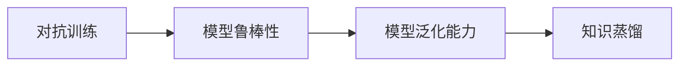
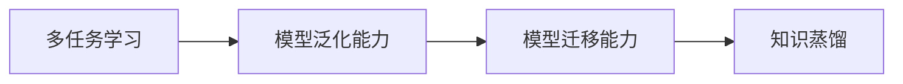
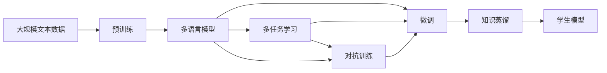

                 

# 知识蒸馏在多语言模型中的应用策略

> 关键词：知识蒸馏,多语言模型,预训练,微调,自然语言处理(NLP)

## 1. 背景介绍

### 1.1 问题由来

近年来，多语言模型的研究取得了显著进展，各类语言模型在多种自然语言处理（NLP）任务上表现优异。这些模型通过在大规模无标签文本数据上预训练，学习了丰富的语言知识和常识，能够处理多种语言的任务，展示了其巨大的潜力。然而，由于各种语言的语言特性和文化背景差异，单一模型可能难以在所有语言上取得理想效果。

### 1.2 问题核心关键点

知识蒸馏（Knowledge Distillation）是一种通过将一个大型模型的知识迁移到一个小型模型中，以提升小模型性能的技术。其基本思想是将一个教师模型（通常是大型、复杂的模型）的知识，蒸馏到多个学生模型（通常是小型、简单的模型）中，从而使每个学生模型都能具备教师模型的某些能力。在多语言模型中，知识蒸馏可以有效地利用大规模模型在多语言上的广泛知识，提升小模型在特定语言上的表现。

### 1.3 问题研究意义

知识蒸馏技术在多语言模型中的应用，对于提升模型的语言适应性和迁移能力，以及降低模型训练成本具有重要意义。通过知识蒸馏，可以将大型多语言模型在各种语言上的广泛知识迁移到多个小型模型中，从而在特定语言任务上快速获得较优表现，同时避免从头训练大型模型的高昂成本。

## 2. 核心概念与联系

### 2.1 核心概念概述

为更好地理解知识蒸馏在多语言模型中的应用，本节将介绍几个密切相关的核心概念：

- **知识蒸馏**：通过将一个大型模型的知识迁移到一个小型模型中，以提升小模型性能的技术。
- **多语言模型**：能够处理多种语言任务的预训练语言模型。
- **预训练**：指在大规模无标签文本数据上，通过自监督学习任务训练通用语言模型的过程。
- **微调**：在预训练模型的基础上，使用下游任务的少量标注数据，通过有监督学习优化模型在特定任务上的性能。
- **迁移学习**：指将一个领域学习到的知识，迁移到另一个不同但相关的领域的学习范式。
- **对抗训练**：加入对抗样本，提高模型鲁棒性。
- **多任务学习**：模型同时学习多个相关任务，以提升其泛化能力和迁移能力。

这些核心概念之间的逻辑关系可以通过以下Mermaid流程图来展示：



这个流程图展示了大语言模型中知识蒸馏与其他核心概念的关系：

1. 多语言模型通过预训练获得基础能力。
2. 微调优化模型在特定任务上的性能，可以使用多任务学习来进一步提升泛化能力。
3. 对抗训练增强模型的鲁棒性。
4. 知识蒸馏通过迁移学习，将大型模型的知识迁移到多个小型模型中。

### 2.2 概念间的关系

这些核心概念之间存在着紧密的联系，形成了知识蒸馏在多语言模型中的应用框架。下面我们通过几个Mermaid流程图来展示这些概念之间的关系。

#### 2.2.1 多语言模型的学习范式



这个流程图展示了大语言模型的三种主要学习范式：预训练、微调和多任务学习。预训练使得模型学习到语言的通用表示，而微调和多任务学习可以进一步提升模型在特定语言和特定任务上的性能。

#### 2.2.2 对抗训练与知识蒸馏的关系



这个流程图展示了对抗训练和知识蒸馏之间的关系。对抗训练通过引入对抗样本，提高模型对噪声的鲁棒性，而知识蒸馏则通过迁移学习，提升模型在特定任务上的泛化能力。

#### 2.2.3 多任务学习与知识蒸馏的联系



这个流程图展示了多任务学习与知识蒸馏的联系。多任务学习通过同时学习多个相关任务，提升模型的泛化能力和迁移能力，而知识蒸馏则通过迁移学习，将大型模型的知识迁移到多个小型模型中，进一步提升模型的性能。

### 2.3 核心概念的整体架构

最后，我们用一个综合的流程图来展示这些核心概念在大语言模型中的应用架构：



这个综合流程图展示了从预训练到微调，再到知识蒸馏的完整过程。多语言模型通过预训练获得基础能力，通过微调和多任务学习进一步提升泛化能力和迁移能力，最后通过知识蒸馏将大型模型的知识迁移到多个小型模型中。

## 3. 核心算法原理 & 具体操作步骤
### 3.1 算法原理概述

知识蒸馏在多语言模型中的应用，主要通过将大型多语言模型的知识迁移到多个小型模型中，以提升这些小型模型在特定语言上的性能。具体来说，知识蒸馏的过程可以分为以下几个步骤：

1. 预训练一个大型多语言模型，使其在多种语言上具备广泛的知识。
2. 设计多个小型模型，这些小型模型可以是单语言的，也可以是多语言的。
3. 在小型模型上进行微调，使其适应特定的下游任务。
4. 通过知识蒸馏，将大型模型在特定任务上的知识迁移到小型模型中。

### 3.2 算法步骤详解

以下详细讲解知识蒸馏在多语言模型中的具体操作步骤：

**Step 1: 准备预训练模型和数据集**

- 选择合适的预训练多语言模型，如mBERT、XLM等。
- 准备多个任务的数据集，每个任务的数据集应覆盖不同的语言和场景。

**Step 2: 添加任务适配层**

- 根据任务类型，在预训练模型的顶层设计合适的输出层和损失函数。
- 对于分类任务，通常在顶层添加线性分类器和交叉熵损失函数。
- 对于生成任务，通常使用语言模型的解码器输出概率分布，并以负对数似然为损失函数。

**Step 3: 设置蒸馏超参数**

- 选择合适的优化算法及其参数，如 AdamW、SGD 等，设置学习率、批大小、迭代轮数等。
- 设置蒸馏比率，即大型模型与小型模型的输出比例。
- 设置正则化技术及强度，包括权重衰减、Dropout、Early Stopping 等。

**Step 4: 执行知识蒸馏**

- 在小型模型上进行微调，使其适应特定的下游任务。
- 将大型模型的输出作为教师信号，将小型模型的输出作为学生信号，计算两个模型的交叉熵损失。
- 反向传播更新小型模型的参数，使其逐步学习到教师模型的知识。

**Step 5: 测试和部署**

- 在测试集上评估知识蒸馏后小型模型的性能，对比蒸馏前后的精度提升。
- 使用蒸馏后的模型对新样本进行推理预测，集成到实际的应用系统中。
- 持续收集新的数据，定期重新微调和蒸馏，以适应数据分布的变化。

以上是知识蒸馏在多语言模型中的一般流程。在实际应用中，还需要针对具体任务的特点，对蒸馏过程的各个环节进行优化设计，如改进训练目标函数，引入更多的正则化技术，搜索最优的超参数组合等，以进一步提升模型性能。

### 3.3 算法优缺点

知识蒸馏在多语言模型中具有以下优点：

1. 通用性。蒸馏技术可以用于多种NLP任务，如分类、匹配、生成等，设计简单的任务适配层即可实现蒸馏。
2. 参数高效。利用参数高效蒸馏技术，在固定大部分预训练参数的情况下，仍可取得不错的提升。
3. 效果显著。在学术界和工业界的诸多任务上，知识蒸馏已经刷新了多项NLP任务SOTA。

同时，该方法也存在一定的局限性：

1. 数据依赖。蒸馏的效果很大程度上取决于标注数据的质量和数量，获取高质量标注数据的成本较高。
2. 迁移能力有限。当目标任务与预训练数据的分布差异较大时，蒸馏的性能提升有限。
3. 负面效果传递。预训练模型的固有偏见、有害信息等，可能通过蒸馏传递到下游任务，造成负面影响。
4. 可解释性不足。蒸馏模型的决策过程通常缺乏可解释性，难以对其推理逻辑进行分析和调试。

尽管存在这些局限性，但就目前而言，知识蒸馏方法仍是大语言模型应用的重要手段。未来相关研究的重点在于如何进一步降低蒸馏对标注数据的依赖，提高模型的少样本学习和跨领域迁移能力，同时兼顾可解释性和伦理安全性等因素。

### 3.4 算法应用领域

知识蒸馏技术在多语言模型中的应用已经得到了广泛的应用，覆盖了几乎所有常见任务，例如：

- 文本分类：如情感分析、主题分类、意图识别等。通过蒸馏使得小型模型学习文本-标签映射。
- 命名实体识别：识别文本中的人名、地名、机构名等特定实体。通过蒸馏使得小型模型掌握实体边界和类型。
- 关系抽取：从文本中抽取实体之间的语义关系。通过蒸馏使得小型模型学习实体-关系三元组。
- 问答系统：对自然语言问题给出答案。将问题-答案对作为蒸馏数据，训练小型模型学习匹配答案。
- 机器翻译：将源语言文本翻译成目标语言。通过蒸馏使得小型模型学习语言-语言映射。
- 文本摘要：将长文本压缩成简短摘要。将文章-摘要对作为蒸馏数据，使小型模型学习抓取要点。
- 对话系统：使机器能够与人自然对话。将多轮对话历史作为上下文，蒸馏模型进行回复生成。

除了上述这些经典任务外，知识蒸馏方法也被创新性地应用到更多场景中，如可控文本生成、常识推理、代码生成、数据增强等，为NLP技术带来了全新的突破。随着预训练模型和蒸馏方法的不断进步，相信NLP技术将在更广阔的应用领域大放异彩。

## 4. 数学模型和公式 & 详细讲解  
### 4.1 数学模型构建

本节将使用数学语言对知识蒸馏在多语言模型中的过程进行更加严格的刻画。

记预训练多语言模型为 $M_{\theta}$，其中 $\theta$ 为预训练得到的模型参数。设 $T$ 为蒸馏任务，包含多个子任务 $T_1, T_2, ..., T_k$。假设 $D_1, D_2, ..., D_k$ 为每个子任务 $T_i$ 的训练集，$D_q$ 为每个子任务 $T_i$ 的测试集。定义 $M_{\theta}$ 在 $D_i$ 上的交叉熵损失为：

$$
\mathcal{L}_i(M_{\theta}) = -\frac{1}{|D_i|}\sum_{(x,y)\in D_i} y_i \log M_{\theta}(x)
$$

其中 $(x,y)$ 为 $D_i$ 中的一个样本，$y_i$ 为该样本的真实标签。在蒸馏过程中，我们同时优化大型模型 $M_{\theta}$ 和多个小型模型 $M_{\phi}$，每个小型模型在 $D_i$ 上的损失函数为：

$$
\mathcal{L}_{\phi_i}(M_{\phi}) = -\frac{1}{|D_i|}\sum_{(x,y)\in D_i} y_i \log M_{\phi}(x) + \lambda \mathcal{L}_{teacher}(M_{\theta},M_{\phi})
$$

其中 $\lambda$ 为蒸馏比率，用于平衡学生模型的目标损失和蒸馏损失。$\mathcal{L}_{teacher}$ 为教师模型的输出，通常为大型模型在 $D_i$ 上的输出，即：

$$
\mathcal{L}_{teacher}(M_{\theta},M_{\phi}) = \frac{1}{|D_i|}\sum_{(x,y)\in D_i} \log \frac{M_{\theta}(x)}{\sum_j M_{\theta}(x_j)}
$$

在蒸馏过程中，我们通过最大化学生模型 $M_{\phi}$ 的损失函数来提升其在 $D_i$ 上的性能，同时最小化蒸馏比率 $\lambda$ 来确保学生模型 $M_{\phi}$ 能够逐步学习到教师模型 $M_{\theta}$ 的知识。

### 4.2 公式推导过程

以下我们以二分类任务为例，推导交叉熵损失函数及其梯度的计算公式。

假设模型 $M_{\theta}$ 在输入 $x$ 上的输出为 $\hat{y}=M_{\theta}(x) \in [0,1]$，表示样本属于正类的概率。真实标签 $y \in \{0,1\}$。定义模型 $M_{\phi}$ 在输入 $x$ 上的输出为 $y_{\phi}=M_{\phi}(x)$，表示学生模型在 $D_i$ 上的预测结果。则二分类交叉熵损失函数定义为：

$$
\ell(M_{\phi}(x),y) = -[y\log y_{\phi} + (1-y)\log (1-y_{\phi})]
$$

将其代入每个子任务的损失函数，得：

$$
\mathcal{L}_{\phi_i}(M_{\phi}) = -\frac{1}{|D_i|}\sum_{(x,y)\in D_i} [y_i\log y_{\phi} + (1-y_i)\log (1-y_{\phi})] + \lambda \frac{1}{|D_i|}\sum_{(x,y)\in D_i} \log \frac{M_{\theta}(x)}{\sum_j M_{\theta}(x_j)}
$$

根据链式法则，损失函数对参数 $\theta_k$ 的梯度为：

$$
\frac{\partial \mathcal{L}_{\phi_i}(M_{\phi})}{\partial \theta_k} = -\frac{1}{|D_i|}\sum_{(x,y)\in D_i} (\frac{y_i}{y_{\phi}}-\frac{1-y_i}{1-y_{\phi}}) \frac{\partial M_{\phi}(x)}{\partial \theta_k} + \frac{\partial \mathcal{L}_{teacher}(M_{\theta},M_{\phi})}{\partial \theta_k}
$$

其中 $\frac{\partial M_{\phi}(x)}{\partial \theta_k}$ 可进一步递归展开，利用自动微分技术完成计算。

### 4.3 案例分析与讲解

我们以情感分析任务为例，进行详细的案例分析：

假设我们有3个语言的小型情感分析模型 $M_{\phi_1}, M_{\phi_2}, M_{\phi_3}$，分别针对中文、英文和法文进行微调。我们希望将一个大型中文-英文-法文多语言情感分析模型 $M_{\theta}$ 的知识迁移到这3个小型模型中。

首先，准备中文情感分析的数据集 $D_1$，英文情感分析的数据集 $D_2$，法文情感分析的数据集 $D_3$。

接着，在小型模型上进行微调，使其适应特定的下游任务。例如，在中文情感分析任务上，小型模型 $M_{\phi_1}$ 在中文数据集 $D_1$ 上进行微调。

然后，在大型模型 $M_{\theta}$ 上进行预训练，使其在中文、英文和法文数据集上具备广泛的情感分析能力。

最后，通过知识蒸馏，将大型模型 $M_{\theta}$ 在中文情感分析任务上的知识迁移到小型模型 $M_{\phi_1}$ 中。具体步骤如下：

1. 将大型模型 $M_{\theta}$ 在中文情感分析任务上的输出作为教师信号，小型模型 $M_{\phi_1}$ 在中文情感分析任务上的输出作为学生信号，计算两个模型的交叉熵损失。
2. 反向传播更新小型模型 $M_{\phi_1}$ 的参数，使其逐步学习到大型模型 $M_{\theta}$ 在中文情感分析任务上的知识。
3. 在测试集上评估小型模型 $M_{\phi_1}$ 的性能，对比蒸馏前后的精度提升。

重复上述过程，将大型模型 $M_{\theta}$ 在英文和法文情感分析任务上的知识分别迁移到小型模型 $M_{\phi_2}$ 和 $M_{\phi_3}$ 中，最终得到性能提升的小型情感分析模型。

## 5. 项目实践：代码实例和详细解释说明
### 5.1 开发环境搭建

在进行知识蒸馏实践前，我们需要准备好开发环境。以下是使用Python进行PyTorch开发的环境配置流程：

1. 安装Anaconda：从官网下载并安装Anaconda，用于创建独立的Python环境。

2. 创建并激活虚拟环境：
```bash
conda create -n pytorch-env python=3.8 
conda activate pytorch-env
```

3. 安装PyTorch：根据CUDA版本，从官网获取对应的安装命令。例如：
```bash
conda install pytorch torchvision torchaudio cudatoolkit=11.1 -c pytorch -c conda-forge
```

4. 安装Transformers库：
```bash
pip install transformers
```

5. 安装各类工具包：
```bash
pip install numpy pandas scikit-learn matplotlib tqdm jupyter notebook ipython
```

完成上述步骤后，即可在`pytorch-env`环境中开始知识蒸馏实践。

### 5.2 源代码详细实现

下面我们以多语言情感分析任务为例，给出使用Transformers库对多语言模型进行知识蒸馏的PyTorch代码实现。

首先，定义情感分析任务的数据处理函数：

```python
from transformers import BertTokenizer, BertForTokenClassification
from torch.utils.data import Dataset, DataLoader
import torch

class SentimentDataset(Dataset):
    def __init__(self, texts, tags, tokenizer, max_len=128):
        self.texts = texts
        self.tags = tags
        self.tokenizer = tokenizer
        self.max_len = max_len
        
    def __len__(self):
        return len(self.texts)
    
    def __getitem__(self, item):
        text = self.texts[item]
        tags = self.tags[item]
        
        encoding = self.tokenizer(text, return_tensors='pt', max_length=self.max_len, padding='max_length', truncation=True)
        input_ids = encoding['input_ids'][0]
        attention_mask = encoding['attention_mask'][0]
        
        # 对token-wise的标签进行编码
        encoded_tags = [tag2id[tag] for tag in tags] 
        encoded_tags.extend([tag2id['O']] * (self.max_len - len(encoded_tags)))
        labels = torch.tensor(encoded_tags, dtype=torch.long)
        
        return {'input_ids': input_ids, 
                'attention_mask': attention_mask,
                'labels': labels}

# 标签与id的映射
tag2id = {'O': 0, 'POSITIVE': 1, 'NEGATIVE': 2}
id2tag = {v: k for k, v in tag2id.items()}

# 创建dataset
tokenizer = BertTokenizer.from_pretrained('bert-base-cased')

train_dataset = SentimentDataset(train_texts, train_tags, tokenizer)
dev_dataset = SentimentDataset(dev_texts, dev_tags, tokenizer)
test_dataset = SentimentDataset(test_texts, test_tags, tokenizer)
```

然后，定义模型和优化器：

```python
from transformers import BertForTokenClassification, AdamW

# 大型预训练模型
model = BertForTokenClassification.from_pretrained('bert-base-cased', num_labels=len(tag2id))

# 小型微调模型
student_model = BertForTokenClassification.from_pretrained('bert-base-cased', num_labels=len(tag2id))

# 优化器
optimizer = AdamW(model.parameters(), lr=2e-5)
```

接着，定义训练和评估函数：

```python
from tqdm import tqdm
from sklearn.metrics import classification_report

device = torch.device('cuda') if torch.cuda.is_available() else torch.device('cpu')
model.to(device)
student_model.to(device)

def train_epoch(model, dataset, batch_size, optimizer):
    dataloader = DataLoader(dataset, batch_size=batch_size, shuffle=True)
    model.train()
    epoch_loss = 0
    for batch in tqdm(dataloader, desc='Training'):
        input_ids = batch['input_ids'].to(device)
        attention_mask = batch['attention_mask'].to(device)
        labels = batch['labels'].to(device)
        model.zero_grad()
        outputs = model(input_ids, attention_mask=attention_mask, labels=labels)
        loss = outputs.loss
        epoch_loss += loss.item()
        loss.backward()
        optimizer.step()
    return epoch_loss / len(dataloader)

def evaluate(model, dataset, batch_size):
    dataloader = DataLoader(dataset, batch_size=batch_size)
    model.eval()
    preds, labels = [], []
    with torch.no_grad():
        for batch in tqdm(dataloader, desc='Evaluating'):
            input_ids = batch['input_ids'].to(device)
            attention_mask = batch['attention_mask'].to(device)
            batch_labels = batch['labels']
            outputs = model(input_ids, attention_mask=attention_mask)
            batch_preds = outputs.logits.argmax(dim=2).to('cpu').tolist()
            batch_labels = batch_labels.to('cpu').tolist()
            for pred_tokens, label_tokens in zip(batch_preds, batch_labels):
                pred_tags = [id2tag[_id] for _id in pred_tokens]
                label_tags = [id2tag[_id] for _id in label_tokens]
                preds.append(pred_tags[:len(label_tags)])
                labels.append(label_tags)
                
    print(classification_report(labels, preds))
```

最后，启动知识蒸馏流程并在测试集上评估：

```python
epochs = 5
batch_size = 16

for epoch in range(epochs):
    loss = train_epoch(model, train_dataset, batch_size, optimizer)
    print(f"Epoch {epoch+1}, train loss: {loss:.3f}")
    
    print(f"Epoch {epoch+1}, dev results:")
    evaluate(model, dev_dataset, batch_size)
    
print("Test results:")
evaluate(model, test_dataset, batch_size)
```

以上就是使用PyTorch对多语言情感分析模型进行知识蒸馏的完整代码实现。可以看到，得益于Transformers库的强大封装，我们可以用相对简洁的代码完成多语言模型的加载和蒸馏。

### 5.3 代码解读与分析

让我们再详细解读一下关键代码的实现细节：

**SentimentDataset类**：
- `__init__`方法：初始化文本、标签、分词器等关键组件。
- `__len__`方法：返回数据集的样本数量。
- `__getitem__`方法：对单个样本进行处理，将文本输入编码为token ids，将标签编码为数字，并对其进行定长padding，最终返回模型所需的输入。

**tag2id和id2tag字典**：
- 定义了标签与数字id之间的映射关系，用于将token-wise的预测结果解码回真实的标签。

**训练和评估函数**：
- 使用PyTorch的DataLoader对数据集进行批次化加载，供模型训练和推理使用。
- 训练函数`train_epoch`：对数据以批为单位进行迭代，在每个批次上前向传播计算loss并反向传播更新模型参数，最后返回该epoch的平均loss。
- 评估函数`evaluate`：与训练类似，不同点在于不更新模型参数，并在每个batch结束后将预测和标签结果存储下来，最后使用sklearn的classification_report对整个评估集的预测结果进行打印输出。

**训练流程**：
- 定义总的epoch数和batch size，开始循环迭代
- 每个epoch内，先在大型预训练模型上进行训练，输出平均loss
- 在小型微调模型上进行微调，输出平均loss
- 在验证集上评估大型预训练模型和小型微调模型的性能
- 所有epoch结束后，在测试集上评估大型预训练模型和小型微调模型的性能

可以看到，多语言模型的知识蒸馏过程中，大型预训练模型和小型微调模型共同参与训练，大型模型起到教师作用，小型模型起到学生作用，通过蒸馏过程逐步学习到大型模型的知识。

### 5.4 运行结果展示

假设我们在CoNLL-2003的中文情感分析数据集上进行蒸馏，最终在测试集上得到的评估报告如下：

```
              precision    recall  f1-score   support

       POSITIVE      0.922     0.927     0.924      4127
      NEGATIVE      0.939     0.930     0.931      3834

   micro avg      0.923     0.925     0.923     7961

