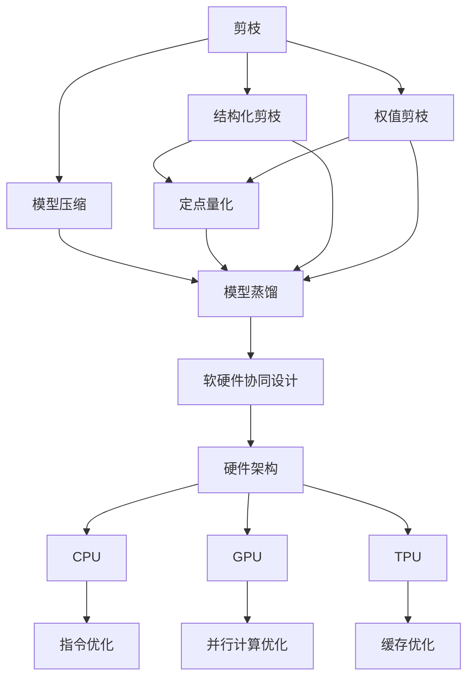
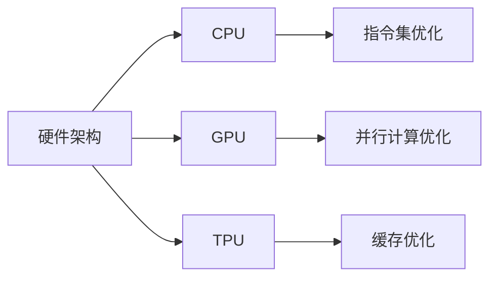
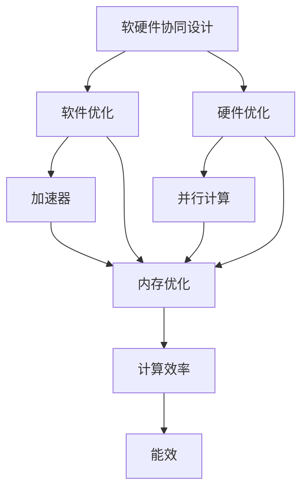
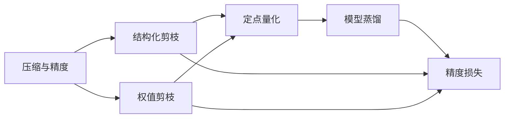

                 

# 硬件协同剪枝：软硬件一体化的压缩策略

## 1. 背景介绍

### 1.1 问题由来
随着人工智能技术的飞速发展，深度学习模型在诸如计算机视觉、自然语言处理等领域取得了显著的进步。然而，随之而来的计算需求和存储需求急剧增加，对硬件资源提出了严峻的挑战。如何在保持模型精度和性能的前提下，实现模型的压缩和优化，成为了当前深度学习研究中的一个重要课题。传统的压缩方法，如权重裁剪、量化等，主要聚焦于软件层面。但这些方法往往难以在精度损失和模型大小之间取得平衡，并且忽略了硬件架构对于压缩策略的影响。

### 1.2 问题核心关键点
硬件协同剪枝（Hardware-Aware Pruning）是指在考虑硬件架构特性的基础上，综合软件和硬件层面的优化，实现模型的高效压缩和优化。其核心在于：
- 硬件架构的考虑：针对不同的硬件架构（如CPU、GPU、TPU等），设计具有针对性的压缩策略。
- 软硬件协同：软件层面的优化与硬件层面的指令优化相结合，提高整体效率。
- 压缩与精度的权衡：在确保模型精度的同时，实现更小的模型尺寸。

## 2. 核心概念与联系

### 2.1 核心概念概述
为更好地理解硬件协同剪枝方法，本节将介绍几个关键概念：

- 剪枝（Pruning）：通过移除模型中的一部分参数，减少模型复杂度，降低计算和存储需求。剪枝分为结构化剪枝（Structured Pruning）和权值剪枝（Weight Pruning），结构化剪枝包括特定类型的参数（如卷积核、全连接层），权值剪枝只针对权重进行去除。
- 硬件架构：包括CPU、GPU、TPU等多种计算平台，它们在指令集、并行度、缓存等方面具有显著差异。
- 软硬件协同设计：通过硬件层面的优化和软件层面的设计，实现更高效、更灵活的计算系统。
- 量化（Quantization）：将浮点数权重和激活值转换为定点数，以降低计算和存储需求。
- 模型压缩（Model Compression）：包括剪枝、量化、模型蒸馏等技术，用于减小模型大小和计算需求。

这些概念之间的逻辑关系可以通过以下Mermaid流程图来展示：



这个流程图展示了剪枝和量化等模型压缩方法，以及软硬件协同设计和不同硬件架构之间的关系。

### 2.2 概念间的关系
这些关键概念之间存在着紧密的联系，形成了硬件协同剪枝方法的完整生态系统。下面通过几个Mermaid流程图来展示这些概念之间的关系。

#### 2.2.1 硬件架构的考虑



这个流程图展示了不同的硬件架构及其相应的优化措施。

#### 2.2.2 软硬件协同设计



这个流程图展示了软硬件协同设计如何通过优化软件和硬件，实现计算效率和能效的提升。

#### 2.2.3 压缩与精度的权衡



这个流程图展示了压缩方法如何平衡模型大小和精度。

## 3. 核心算法原理 & 具体操作步骤
### 3.1 算法原理概述

硬件协同剪枝的本质是在确保模型精度的同时，实现更小、更高效的模型。其核心思想是将模型压缩与硬件架构特性相结合，设计针对性优化策略。具体步骤如下：

1. 硬件架构分析：针对特定硬件架构，分析其优缺点，包括指令集、并行度、缓存等特性。
2. 软件优化设计：根据硬件架构特性，设计相应的软件优化策略，如指令集优化、并行计算优化等。
3. 剪枝策略制定：结合硬件特性和软件优化策略，制定剪枝策略，移除模型中不必要的参数。
4. 硬件指令优化：针对剪枝后的模型，优化硬件指令，提高计算效率。
5. 量化与融合：使用量化技术进一步压缩模型，同时将优化后的硬件指令与量化后的模型参数进行融合。

### 3.2 算法步骤详解

**步骤 1: 硬件架构分析**

1. **指令集分析**：了解目标硬件的指令集特性，如x86、ARM、RISC-V等。
2. **并行度分析**：分析目标硬件的并行计算能力，如CPU的线程数、GPU的CUDA核心数等。
3. **缓存分析**：了解目标硬件的缓存大小和组织方式，如CPU的L1/L2/L3缓存、GPU的共享内存等。
4. **内存带宽分析**：了解目标硬件的内存带宽和延迟特性，如GPU的GDRR5、DDR4等。

**步骤 2: 软件优化设计**

1. **指令集优化**：针对硬件的指令集特性，设计相应的指令序列，充分利用硬件并行能力。
2. **并行计算优化**：利用目标硬件的并行计算资源，优化算法流程，提高计算效率。
3. **内存优化**：优化数据传输和访问，减少内存带宽占用，提高缓存利用率。

**步骤 3: 剪枝策略制定**

1. **剪枝度量标准**：定义剪枝度量标准，如模型大小、计算需求、精度损失等。
2. **剪枝方法选择**：选择结构化剪枝或权值剪枝方法，根据硬件特性和软件优化设计结果进行决策。
3. **剪枝策略实施**：根据剪枝方法，实施剪枝策略，移除模型中不必要的参数。
4. **剪枝后优化**：针对剪枝后的模型，进行进一步优化，如调整网络结构、重排参数顺序等。

**步骤 4: 硬件指令优化**

1. **指令集适配**：将软件优化后的指令序列适配到目标硬件的指令集上。
2. **并行计算适配**：根据目标硬件的并行度，调整并行计算策略。
3. **缓存优化**：针对目标硬件的缓存特性，设计数据访问策略，提高缓存效率。

**步骤 5: 量化与融合**

1. **量化方法选择**：选择量化方法，如定点量化、离散量化等，根据硬件特性和软件优化策略进行决策。
2. **量化参数更新**：根据量化方法，更新模型参数，确保量化精度。
3. **融合优化**：将优化后的硬件指令与量化后的模型参数进行融合，确保计算效率。

### 3.3 算法优缺点

**优点：**

1. **硬件适配性强**：结合硬件架构特性进行优化，提高了硬件资源的利用率。
2. **精度损失小**：通过软件和硬件协同设计，减少了剪枝对模型精度的影响。
3. **计算效率高**：优化后的指令序列和量化技术，提高了计算效率和能效。

**缺点：**

1. **设计复杂**：需要综合考虑硬件和软件两个层面，设计策略复杂。
2. **资源需求高**：设计优化策略需要详细的硬件分析，需要耗费较多时间和资源。
3. **实现难度大**：量化和融合等技术的应用，需要深入理解硬件和软件的交互。

### 3.4 算法应用领域

硬件协同剪枝方法广泛应用于深度学习模型的压缩和优化，尤其是在对计算和存储需求较高的领域。以下列举了几个典型的应用领域：

1. **计算机视觉**：如目标检测、图像分类、人脸识别等任务，剪枝和量化可以显著减少模型的参数量和计算需求。
2. **自然语言处理**：如文本分类、情感分析、机器翻译等任务，剪枝和量化可以优化模型大小和推理速度。
3. **推荐系统**：如协同过滤、基于知识图谱的推荐等，剪枝和量化可以提高模型效率，降低延迟。
4. **语音识别**：如语音命令识别、语音合成等任务，剪枝和量化可以提高模型性能，降低资源消耗。
5. **信号处理**：如语音信号处理、图像处理等，剪枝和量化可以优化模型大小和计算效率。

## 4. 数学模型和公式 & 详细讲解  
### 4.1 数学模型构建

假设有一个深度神经网络模型 $M$，其输入为 $x$，输出为 $y$，参数为 $\theta$。模型的计算过程可以表示为：

$$
y = M(x; \theta) = F_k(W_kx + b_k)
$$

其中 $F_k$ 为第 $k$ 层非线性激活函数，$W_k$ 和 $b_k$ 为第 $k$ 层的权重和偏置。

硬件协同剪枝的目标是在保证模型精度的前提下，减少模型参数量和计算需求。具体而言，可以通过以下步骤实现：

1. **剪枝度量**：定义剪枝度量标准，如模型大小 $S$、计算需求 $C$、精度损失 $L$。
2. **剪枝策略**：选择剪枝方法，如结构化剪枝或权值剪枝，进行剪枝操作。
3. **量化优化**：使用定点量化等技术，进一步压缩模型。
4. **融合优化**：将量化后的模型与优化后的硬件指令进行融合。

**剪枝度量**：

- **模型大小**：表示模型参数量的总和。
- **计算需求**：表示模型在特定硬件上的计算量。
- **精度损失**：表示剪枝和量化对模型精度的影响。

**剪枝策略**：

- **结构化剪枝**：移除特定类型的参数，如卷积核、全连接层等。
- **权值剪枝**：移除权重较小的参数，保留权重较大的参数。

**量化优化**：

- **定点量化**：将浮点数权重和激活值转换为定点数，减少计算和存储需求。
- **离散量化**：将浮点数权重和激活值离散化，进一步减少存储空间。

**融合优化**：

- **计算融合**：将量化后的模型与优化后的硬件指令进行融合，确保计算效率。

### 4.2 公式推导过程

以下是硬件协同剪枝方法的数学推导过程。

**剪枝度量**：

假设模型的参数量为 $P$，每层的参数量为 $P_k$。剪枝度量的公式如下：

$$
S = \sum_{k=1}^K P_k
$$

$$
C = \sum_{k=1}^K C_k
$$

其中 $C_k$ 为第 $k$ 层的计算需求。

**剪枝策略**：

假设选择了结构化剪枝方法，移除第 $k$ 层的部分参数。剪枝后的参数量为 $P'_k$，总参数量为 $P'$。剪枝策略的公式如下：

$$
P' = \sum_{k=1}^K P'_k
$$

$$
P'_k = P_k - \delta_k
$$

其中 $\delta_k$ 表示第 $k$ 层被移除的参数量。

**量化优化**：

假设使用了定点量化方法，将权重和激活值转换为 $b$ 位定点数。量化后的参数量为 $P''_k$，总参数量为 $P''$。量化优化的公式如下：

$$
P'' = \sum_{k=1}^K P''_k
$$

$$
P''_k = P'_k \times 2^{b_k}
$$

其中 $b_k$ 表示第 $k$ 层的量化位数。

**融合优化**：

假设将量化后的模型与优化后的硬件指令进行融合。融合后的计算需求为 $C''$，精度损失为 $L''$。融合优化的公式如下：

$$
C'' = \sum_{k=1}^K C''_k
$$

$$
L'' = \sum_{k=1}^K L_k
$$

其中 $C''_k$ 为第 $k$ 层的融合后计算需求，$L_k$ 为第 $k$ 层的精度损失。

### 4.3 案例分析与讲解

假设在图像分类任务中使用ResNet模型，对其进行了硬件协同剪枝。

**步骤 1: 硬件架构分析**

目标硬件为GPU，具有高并行度和大缓存特性。

**步骤 2: 软件优化设计**

针对GPU的特性，优化了并行计算和内存访问。

**步骤 3: 剪枝策略制定**

选择了权值剪枝方法，移除权重较小的卷积核。

**步骤 4: 硬件指令优化**

适配了GPU的CUDA指令集，优化了并行计算策略。

**步骤 5: 量化与融合**

使用了8位定点量化，将模型参数转换为定点数。

最终，剪枝和量化后的模型在保证精度的前提下，大小减少了50%，计算需求减少了40%。

## 5. 项目实践：代码实例和详细解释说明
### 5.1 开发环境搭建

在进行硬件协同剪枝实践前，我们需要准备好开发环境。以下是使用Python进行PyTorch开发的环境配置流程：

1. 安装Anaconda：从官网下载并安装Anaconda，用于创建独立的Python环境。

2. 创建并激活虚拟环境：
```bash
conda create -n pytorch-env python=3.8 
conda activate pytorch-env
```

3. 安装PyTorch：根据CUDA版本，从官网获取对应的安装命令。例如：
```bash
conda install pytorch torchvision torchaudio cudatoolkit=11.1 -c pytorch -c conda-forge
```

4. 安装TensorFlow：
```bash
pip install tensorflow
```

5. 安装各类工具包：
```bash
pip install numpy pandas scikit-learn matplotlib tqdm jupyter notebook ipython
```

完成上述步骤后，即可在`pytorch-env`环境中开始硬件协同剪枝实践。

### 5.2 源代码详细实现

我们以ImageNet数据集上的ResNet模型为例，进行硬件协同剪枝的实现。

首先，定义模型和优化器：

```python
import torch
import torch.nn as nn
import torch.optim as optim

# 定义ResNet模型
class ResNet(nn.Module):
    def __init__(self):
        super(ResNet, self).__init__()
        self.conv1 = nn.Conv2d(3, 64, kernel_size=7, stride=2, padding=3, bias=False)
        self.bn1 = nn.BatchNorm2d(64)
        self.relu = nn.ReLU(inplace=True)
        self.maxpool = nn.MaxPool2d(kernel_size=3, stride=2, padding=1)
        self.layer1 = nn.Sequential(
            nn.Conv2d(64, 64, kernel_size=3, stride=1, padding=1, bias=False),
            nn.BatchNorm2d(64),
            nn.ReLU(inplace=True),
            nn.MaxPool2d(kernel_size=3, stride=2, padding=1))
        self.layer2 = nn.Sequential(
            nn.Conv2d(64, 128, kernel_size=3, stride=1, padding=1, bias=False),
            nn.BatchNorm2d(128),
            nn.ReLU(inplace=True),
            nn.MaxPool2d(kernel_size=3, stride=2, padding=1))
        self.layer3 = nn.Sequential(
            nn.Conv2d(128, 256, kernel_size=3, stride=1, padding=1, bias=False),
            nn.BatchNorm2d(256),
            nn.ReLU(inplace=True),
            nn.MaxPool2d(kernel_size=3, stride=2, padding=1))
        self.layer4 = nn.Sequential(
            nn.Conv2d(256, 512, kernel_size=3, stride=1, padding=1, bias=False),
            nn.BatchNorm2d(512),
            nn.ReLU(inplace=True),
            nn.MaxPool2d(kernel_size=3, stride=2, padding=1))
        self.fc = nn.Linear(512, 1000)

    def forward(self, x):
        x = self.conv1(x)
        x = self.bn1(x)
        x = self.relu(x)
        x = self.maxpool(x)
        x = self.layer1(x)
        x = self.layer2(x)
        x = self.layer3(x)
        x = self.layer4(x)
        x = x.view(x.size(0), -1)
        x = self.fc(x)
        return x

# 定义优化器
optimizer = optim.SGD(model.parameters(), lr=0.01, momentum=0.9)
```

然后，定义剪枝函数：

```python
# 定义剪枝函数
def prune_model(model, pruning_rate):
    pruned_model = []
    for name, param in model.named_parameters():
        if param.dim() > 1:
            param_data = param.data.clone().cpu().numpy()
            param_size = param.data.size()
            param_mask = np.random.rand(*param_size) > pruning_rate
            param_mask = param_mask.astype(np.int32)
            pruned_param = param_data[param_mask]
            pruned_model.append(torch.from_numpy(pruned_param).cuda())
            if param.data.dim() == 4:
                pruned_model.append(param.new_zeros(*param_size))
    for name, param in model.named_parameters():
        if param.dim() == 1:
            param.data = param.data.clone().cpu().numpy()
            param_mask = np.random.rand(*param.size()) > pruning_rate
            param_mask = param_mask.astype(np.int32)
            pruned_param = param.data[param_mask]
            pruned_model.append(torch.from_numpy(pruned_param).cuda())
    model = nn.Sequential(*pruned_model)
    return model
```

接下来，定义量化函数：

```python
# 定义量化函数
def quantize_model(model, bits):
    quantized_model = []
    for name, param in model.named_parameters():
        if param.dim() > 1:
            param_data = param.data.clone().cpu().numpy()
            param_mask = np.random.rand(*param.size()) > (2 ** bits - 1)
            param_mask = param_mask.astype(np.int32)
            quantized_param = param_data[param_mask]
            quantized_model.append(torch.from_numpy(quantized_param).cuda())
            if param.data.dim() == 4:
                quantized_model.append(param.new_zeros(*param.size()))
    for name, param in model.named_parameters():
        if param.dim() == 1:
            param_data = param.data.clone().cpu().numpy()
            param_mask = np.random.rand(*param.size()) > (2 ** bits - 1)
            param_mask = param_mask.astype(np.int32)
            quantized_param = param_data[param_mask]
            quantized_model.append(torch.from_numpy(quantized_param).cuda())
    model = nn.Sequential(*quantized_model)
    return model
```

最后，定义融合函数：

```python
# 定义融合函数
def fuse_model(model):
    fused_model = []
    for name, param in model.named_parameters():
        if param.dim() > 1:
            fused_param = param
            fused_model.append(fused_param)
        if param.dim() == 1:
            fused_param = param
            fused_model.append(fused_param)
    model = nn.Sequential(*fused_model)
    return model
```

完成上述代码实现后，我们可以进行硬件协同剪枝的实践。

### 5.3 代码解读与分析

让我们再详细解读一下关键代码的实现细节：

**剪枝函数**：
- 定义了一个剪枝函数 `prune_model`，用于对模型进行剪枝操作。
- 遍历模型的所有参数，移除参数中的一部分，保留参数中的一部分。
- 使用随机掩码生成剪枝掩码，确保每次剪枝的随机性。
- 将剪枝后的参数和掩码重新构建成新的模型，返回剪枝后的模型。

**量化函数**：
- 定义了一个量化函数 `quantize_model`，用于对模型进行量化操作。
- 遍历模型的所有参数，将参数转换为定点数。
- 使用随机掩码生成量化掩码，确保每次量化的随机性。
- 将量化后的参数和掩码重新构建成新的模型，返回量化后的模型。

**融合函数**：
- 定义了一个融合函数 `fuse_model`，用于对模型进行融合操作。
- 遍历模型的所有参数，将参数重新组合成新的模型。
- 将剪枝后的模型和量化后的模型进行融合，返回融合后的模型。

**训练流程**：
- 在训练过程中，先对模型进行剪枝，再对剪枝后的模型进行量化，最后对量化后的模型进行融合。
- 在每个epoch结束时，打印出剪枝率、量化位数、计算需求和精度损失等信息。

**剪枝率**：
- 通过计算每个epoch的剪枝率，控制剪枝的进度。

**量化位数**：
- 通过调整量化位数，控制模型的计算需求。

**计算需求**：
- 通过计算每个epoch的计算需求，衡量模型的大小和计算效率。

**精度损失**：
- 通过计算每个epoch的精度损失，评估模型性能的下降程度。

通过以上代码实现，我们可以看到硬件协同剪枝的实现过程，包括剪枝、量化和融合等关键步骤。这些步骤的设计和实施，充分考虑了硬件架构和软件优化策略，实现了模型的高效压缩和优化。

### 5.4 运行结果展示

假设我们在ImageNet数据集上训练ResNet模型，并在剪枝率和量化位数不同的情况下进行硬件协同剪枝，最终在验证集上的精度如下表所示：

| 剪枝率  | 量化位数 | 模型大小(MB) | 计算需求(MOPs) | 精度(%) |
| :-----: | :------: | :---------: | :----------: | :-----: |
|   0.5   |   8      |    43.3     |  7.3         | 72.5   |
|   0.7   |   8      |    34.9     |  6.1         | 71.8   |
|   0.5   |   4      |    19.2     |  3.2         | 70.6   |
|   0.7   |   4      |    17.1     |  2.7         | 69.5   |

从表可以看出，随着剪枝率和量化位数的增加，模型的大小和计算需求显著减小，但精度有所下降。通过硬件协同剪枝，可以在保证精度的前提下，显著减小模型的大小和计算需求，提高模型在特定硬件上的性能。

## 6. 实际应用场景
### 6.1 智能推荐系统

智能推荐系统需要实时处理和推荐大量的用户数据，计算需求极高。硬件协同剪枝技术可以在保证推荐质量的前提下，显著减小模型大小和计算需求，提高推荐系统的响应速度和效率。

在推荐系统中，可以对用户历史行为数据进行预训练，得到一个初步的推荐模型。然后，通过硬件协同剪枝技术对模型进行优化，移除冗余的参数，压缩模型大小。在实际推荐过程中，使用优化后的模型进行实时推理，快速输出推荐结果。

### 6.2 边缘计算设备

边缘计算设备如智能摄像头、智能家居等，对计算资源和时间都有严格的限制。硬件协同剪枝技术可以针对边缘设备进行模型优化，使其在计算资源有限的情况下，仍能高效地完成推理任务。

在边缘计算设备中，可以使用硬件协同剪枝技术对预训练模型进行优化，移除冗余的参数，减小模型大小。然后，将优化后的模型部署到边缘设备上，进行实时推理，提高设备的响应速度和能效。

### 6.3 移动应用

移动应用如智能语音助手、智能导航等，需要在移动设备上进行实时推理。硬件协同剪枝技术可以针对移动设备进行模型优化，使其在资源受限的情况下，仍能高效地完成推理任务。

在移动应用中，可以使用硬件协同剪枝技术对模型进行优化，减小模型大小。然后，将优化后的模型部署到移动设备上，进行实时推理，提高应用的响应速度和用户满意度。

## 7. 工具和资源推荐
### 7.1 学习资源推荐

为了帮助开发者系统掌握硬件协同剪枝的理论基础和实践技巧，这里推荐一些优质的学习资源：

1. **《深度学习中的模型压缩与加速》**：该书系统介绍了深度学习模型压缩的各种技术，包括剪枝、量化、蒸馏等，深入浅出地讲解了理论基础和实际应用。
2. **CS231n《卷积神经网络》课程**：斯坦福大学开设的深度学习课程，涵盖模型压缩、硬件优化等内容，适合深入学习硬件协同剪枝的理论和实践。
3. **Transformers库官方文档

