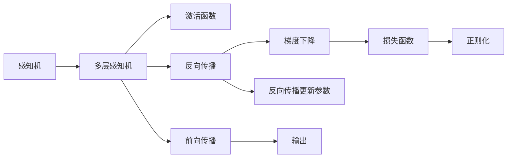

                 

# 神经网络(Neural Networks) - 原理与代码实例讲解

> 关键词：神经网络,反向传播,激活函数,深度学习,卷积神经网络(CNN),循环神经网络(RNN),Transformer,代码实例,模型优化

## 1. 背景介绍

神经网络（Neural Networks）是深度学习领域最重要的技术之一，它通过模拟人脑神经元的连接方式，解决了许多复杂的机器学习和模式识别问题。现代深度学习的发展离不开神经网络的支撑，它在图像识别、语音识别、自然语言处理、推荐系统、智能驾驶等多个领域取得了革命性的进展。

### 1.1 问题由来

神经网络的思想可以追溯到20世纪40年代的人工神经元理论。随着硬件的进步和算法的发展，人工神经网络从简单的感知机、多层感知器，发展到如今的深度神经网络、卷积神经网络、循环神经网络、变分自编码器、生成对抗网络等，其模型结构越来越复杂，应用领域也日益广泛。

但神经网络并非一蹴而就，其发展之路充满曲折。从1980年代到2010年代，神经网络经历了“人工智能寒冬”、“神经网络狂热”、“深度学习热潮”的多个阶段。其间，从简单的BP算法到复杂的深度学习框架，再到卷积神经网络、循环神经网络和注意力机制的引入，神经网络技术不断进步，应用领域不断扩展。

### 1.2 问题核心关键点

神经网络的核心关键点在于其模型结构、训练方法和优化策略。其中，模型结构是神经网络的骨架，训练方法是让模型“学会”的方法，优化策略则是在训练中调整模型参数以提升性能的方法。这些关键点紧密关联，共同决定了神经网络的性能和应用效果。

具体而言，模型结构通常包含输入层、隐藏层和输出层，隐藏层可以是多层或单层的，每个层包含多个神经元。训练方法包括前向传播和反向传播两个过程。前向传播是模型对输入数据进行处理的过程，反向传播则是根据损失函数调整模型参数的过程。优化策略包括梯度下降、动量、自适应学习率、正则化等方法，以加速模型收敛并提高泛化性能。

## 2. 核心概念与联系

### 2.1 核心概念概述

神经网络的内部结构及核心概念包括：

- **感知机**（Perceptron）：最基本的神经网络单元，通常只有一个输入和一个输出，用于二分类任务。
- **多层感知机**（MLP）：由多个神经元组成的层叠结构，每个层之间的神经元通过权重连接，能够处理更复杂的分类和回归任务。
- **激活函数**（Activation Function）：控制神经元输出的非线性函数，如Sigmoid、ReLU等。
- **反向传播**（Backpropagation）：通过链式法则计算模型参数梯度的方法，是神经网络训练的核心算法。
- **损失函数**（Loss Function）：度量模型预测输出与真实标签之间差距的函数，如均方误差（MSE）、交叉熵（Cross Entropy）等。
- **梯度下降**（Gradient Descent）：通过不断更新模型参数，最小化损失函数的算法。
- **正则化**（Regularization）：防止模型过拟合的技术，如L2正则化、Dropout等。

### 2.2 概念间的关系

这些核心概念之间紧密关联，共同构成了神经网络的基本框架和训练流程。我们通过以下Mermaid流程图来展示这些概念之间的关系：



这个流程图展示了神经网络的从感知机到多层感知机的演变过程，以及激活函数、反向传播、梯度下降、损失函数和正则化的作用和关系。

## 3. 核心算法原理 & 具体操作步骤

### 3.1 算法原理概述

神经网络的基本原理是利用输入数据训练一个模型，使其能够预测未知数据的标签。训练过程分为前向传播和反向传播两个步骤：

1. **前向传播**：将输入数据通过网络，计算出预测标签。每个神经元的输出通过激活函数进行处理，再传递给下一层。
2. **反向传播**：根据预测标签和真实标签之间的差距，计算出损失函数，然后通过链式法则反向计算每个神经元的梯度，进而更新网络参数。

通过不断重复前向传播和反向传播的过程，神经网络可以逐步优化参数，提高预测准确性。

### 3.2 算法步骤详解

以下是神经网络训练的详细步骤：

**Step 1: 数据准备**

- 收集训练数据，并进行数据预处理，如归一化、分词、截断等。
- 将数据集分为训练集、验证集和测试集。

**Step 2: 构建模型**

- 定义神经网络的层数、神经元个数等超参数。
- 使用深度学习框架（如TensorFlow、PyTorch）定义神经网络的计算图。
- 定义激活函数、损失函数和优化器。

**Step 3: 前向传播**

- 使用训练数据进行前向传播，计算出预测标签。
- 计算预测标签与真实标签之间的损失值。

**Step 4: 反向传播**

- 计算损失函数对每个参数的梯度。
- 使用梯度下降等优化器更新模型参数。

**Step 5: 模型评估**

- 在验证集和测试集上进行前向传播，计算预测标签和损失值。
- 根据验证集和测试集的损失值调整模型参数，避免过拟合。

**Step 6: 预测和部署**

- 使用模型进行预测，得到最终结果。
- 将模型部署到实际应用中。

### 3.3 算法优缺点

神经网络的优点包括：

- **强大的表达能力**：能够处理非线性关系，适应复杂的模式。
- **自适应学习**：通过训练能够自适应地学习新任务。
- **高效计算**：适合大规模数据集的并行计算。

其缺点包括：

- **需要大量数据**：数据量不足时易过拟合。
- **超参数调优困难**：需要人工调整学习率、层数、神经元个数等参数。
- **计算量大**：深度神经网络需要大量的计算资源。

### 3.4 算法应用领域

神经网络在许多领域得到了广泛应用，包括：

- **图像识别**：如物体检测、图像分类、人脸识别等。
- **语音识别**：如语音转文本、情感分析等。
- **自然语言处理**：如机器翻译、文本生成、问答系统等。
- **推荐系统**：如协同过滤、内容推荐、商品推荐等。
- **智能驾驶**：如自动驾驶、交通预测、道路识别等。
- **金融分析**：如信用评分、市场预测、交易分析等。
- **医疗诊断**：如图像诊断、病理学分析、药物研发等。

## 4. 数学模型和公式 & 详细讲解 & 举例说明

### 4.1 数学模型构建

设神经网络模型为 $f_{\theta}(x)$，其中 $\theta$ 为模型参数，$x$ 为输入数据。神经网络的输出为 $y=f_{\theta}(x)$。

模型的损失函数为 $L(y_{pred}, y_{true})$，其中 $y_{pred}$ 为模型的预测输出，$y_{true}$ 为真实标签。

神经网络训练的目标是找到一组最优参数 $\theta^*$，使得损失函数最小化：

$$
\theta^* = \mathop{\arg\min}_{\theta} L(y_{pred}, y_{true})
$$

### 4.2 公式推导过程

以下以二分类问题为例，推导交叉熵损失函数及其梯度计算公式。

假设神经网络的输出为 $\hat{y}$，模型预测输出为 $\hat{y}_{pred}$。

交叉熵损失函数定义为：

$$
L(y_{pred}, y_{true}) = -\frac{1}{N} \sum_{i=1}^N [y_i \log \hat{y}_{pred,i} + (1-y_i) \log (1-\hat{y}_{pred,i})]
$$

其中 $N$ 为样本数量。

根据链式法则，损失函数对模型参数 $\theta$ 的梯度为：

$$
\frac{\partial L}{\partial \theta} = \frac{\partial L}{\partial \hat{y}_{pred}} \frac{\partial \hat{y}_{pred}}{\partial \theta}
$$

其中 $\frac{\partial L}{\partial \hat{y}_{pred}}$ 为损失函数对预测输出的梯度，$\frac{\partial \hat{y}_{pred}}{\partial \theta}$ 为预测输出对模型参数的梯度。

### 4.3 案例分析与讲解

假设我们有一组训练数据，用于训练一个神经网络模型，其输入为 $x_i$，输出为 $y_i \in \{0, 1\}$。

使用二分类交叉熵损失函数，其梯度计算公式为：

$$
\frac{\partial L}{\partial \theta} = \frac{\partial}{\partial \theta} \left[ -\frac{1}{N} \sum_{i=1}^N [y_i \log \sigma(\hat{y}_{pred,i}) + (1-y_i) \log (1-\sigma(\hat{y}_{pred,i})) ] \right]
$$

其中 $\sigma$ 为激活函数，如 Sigmoid 函数。

以神经网络的前向传播过程为例，设输入为 $x$，输出为 $y_{pred}$，其中 $x$ 经过 $h$ 个隐藏层，每个隐藏层有 $n_h$ 个神经元，则前向传播的过程可以表示为：

$$
x \rightarrow h_1 \rightarrow h_2 \rightarrow \cdots \rightarrow h_h \rightarrow y_{pred}
$$

其中 $h_i$ 表示第 $i$ 个隐藏层，$n_h$ 表示该层的神经元个数，$W^{(i)}$ 表示第 $i$ 层的权重矩阵，$b^{(i)}$ 表示第 $i$ 层的偏置向量。

具体公式推导和计算如下：

$$
z^{(i)} = \sum_{j=1}^n W^{(i)}_j h^{(i-1)}_j + b^{(i)}
$$

$$
h^{(i)} = \sigma(z^{(i)})
$$

$$
\hat{y}_{pred} = \sigma(W^{(h)}_j h^{(h-1)}_j + b^{(h)})
$$

其中 $\sigma$ 为激活函数，如 Sigmoid 函数。

## 5. 项目实践：代码实例和详细解释说明

### 5.1 开发环境搭建

在进行神经网络训练时，我们需要准备好开发环境。以下是使用Python进行TensorFlow开发的环境配置流程：

1. 安装Anaconda：从官网下载并安装Anaconda，用于创建独立的Python环境。

2. 创建并激活虚拟环境：
```bash
conda create -n tensorflow-env python=3.8 
conda activate tensorflow-env
```

3. 安装TensorFlow：根据CUDA版本，从官网获取对应的安装命令。例如：
```bash
pip install tensorflow
```

4. 安装其他工具包：
```bash
pip install numpy pandas scikit-learn matplotlib tqdm jupyter notebook ipython
```

完成上述步骤后，即可在`tensorflow-env`环境中开始神经网络实践。

### 5.2 源代码详细实现

这里以一个简单的全连接神经网络为例，使用TensorFlow进行训练。

```python
import tensorflow as tf
from tensorflow.keras.datasets import mnist
from tensorflow.keras.utils import to_categorical

# 加载MNIST数据集
(x_train, y_train), (x_test, y_test) = mnist.load_data()

# 数据预处理
x_train = x_train.reshape(-1, 784) / 255.0
x_test = x_test.reshape(-1, 784) / 255.0
y_train = to_categorical(y_train, num_classes=10)
y_test = to_categorical(y_test, num_classes=10)

# 定义模型
model = tf.keras.Sequential([
    tf.keras.layers.Dense(64, activation='relu', input_shape=(784,)),
    tf.keras.layers.Dense(10, activation='softmax')
])

# 定义损失函数和优化器
loss_fn = tf.keras.losses.CategoricalCrossentropy(from_logits=True)
optimizer = tf.keras.optimizers.Adam()

# 训练模型
epochs = 10
batch_size = 128
model.compile(optimizer=optimizer, loss=loss_fn, metrics=['accuracy'])

model.fit(x_train, y_train, epochs=epochs, batch_size=batch_size, validation_data=(x_test, y_test))

# 评估模型
model.evaluate(x_test, y_test)
```

### 5.3 代码解读与分析

这里我们详细解读一下关键代码的实现细节：

**MNIST数据集加载**：
```python
(x_train, y_train), (x_test, y_test) = mnist.load_data()
```

**数据预处理**：
```python
x_train = x_train.reshape(-1, 784) / 255.0
x_test = x_test.reshape(-1, 784) / 255.0
y_train = to_categorical(y_train, num_classes=10)
y_test = to_categorical(y_test, num_classes=10)
```

**定义模型**：
```python
model = tf.keras.Sequential([
    tf.keras.layers.Dense(64, activation='relu', input_shape=(784,)),
    tf.keras.layers.Dense(10, activation='softmax')
])
```

**定义损失函数和优化器**：
```python
loss_fn = tf.keras.losses.CategoricalCrossentropy(from_logits=True)
optimizer = tf.keras.optimizers.Adam()
```

**训练模型**：
```python
epochs = 10
batch_size = 128
model.compile(optimizer=optimizer, loss=loss_fn, metrics=['accuracy'])

model.fit(x_train, y_train, epochs=epochs, batch_size=batch_size, validation_data=(x_test, y_test))
```

**评估模型**：
```python
model.evaluate(x_test, y_test)
```

可以看到，使用TensorFlow实现神经网络模型训练，代码实现相对简洁。TensorFlow提供了丰富的API，方便开发者进行模型定义、训练和评估。

## 6. 实际应用场景

### 6.1 图像识别

图像识别是神经网络最早的成功应用之一。通过卷积神经网络（CNN），神经网络在图像分类、物体检测、人脸识别等任务上取得了显著效果。

以图像分类为例，使用卷积层和池化层进行特征提取，再使用全连接层进行分类。通过在大规模标注数据上预训练，神经网络可以自动学习到图像的高级特征，实现高精度的图像分类。

### 6.2 自然语言处理

自然语言处理（NLP）是神经网络的重要应用领域。通过RNN、LSTM、GRU等循环神经网络，神经网络能够处理自然语言的序列信息，实现机器翻译、文本生成、情感分析、问答系统等任务。

以机器翻译为例，使用编码器-解码器结构，将源语言序列编码成向量，再使用解码器生成目标语言序列。通过在大规模双语语料上预训练，神经网络可以自动学习到语言的转换规律，实现高质量的翻译效果。

### 6.3 智能推荐

智能推荐系统是神经网络的重要应用场景之一。通过协同过滤、深度学习等技术，神经网络可以分析用户行为和物品属性，推荐个性化的物品。

以协同过滤为例，使用矩阵分解和神经网络进行用户行为和物品属性的建模，再使用神经网络进行推荐。通过在大规模用户行为数据上预训练，神经网络可以自动学习到用户和物品之间的关系，实现个性化的推荐。

### 6.4 未来应用展望

随着神经网络技术的不断发展，未来神经网络将在更多领域得到应用，为人类生产生活带来深刻变革。

在智慧医疗领域，神经网络可以用于医疗影像分析、病理学分析、药物研发等，辅助医生诊断和治疗，提高医疗水平。

在智能交通领域，神经网络可以用于交通预测、自动驾驶、智能导航等，提高交通效率，减少事故发生率。

在金融领域，神经网络可以用于信用评分、市场预测、交易分析等，提高金融决策的准确性和效率。

在艺术创作领域，神经网络可以用于图像生成、音乐创作、文学创作等，激发人类的创造力。

总之，神经网络技术的应用前景广阔，未来必将在更多领域发挥重要作用。

## 7. 工具和资源推荐

### 7.1 学习资源推荐

为了帮助开发者系统掌握神经网络的理论基础和实践技巧，这里推荐一些优质的学习资源：

1. 《深度学习》系列书籍：由Goodfellow、Bengio和Courville合著，全面介绍了深度学习的基本概念和算法，是深度学习领域必读的经典之作。

2. CS231n《卷积神经网络》课程：斯坦福大学开设的计算机视觉明星课程，涵盖了卷积神经网络的理论和实践，适合初学者和进阶者。

3. CS224n《序列建模》课程：斯坦福大学开设的自然语言处理明星课程，介绍了序列建模的基本方法和深度学习在NLP中的应用。

4. Goodfellow等人的论文《深度学习》：深度学习领域的奠基性论文，详细介绍了深度学习的基本算法和应用。

5. He等人的论文《Deep Residual Learning for Image Recognition》：提出残差网络，解决了深度神经网络训练过程中梯度消失的问题。

6. Bahdanau等人的论文《Neural Machine Translation by Jointly Learning to Align and Translate》：提出注意力机制，解决了机器翻译中的序列对齐问题。

通过学习这些资源，相信你一定能够全面掌握神经网络的理论基础和实践技巧，并将其应用于各种实际问题中。

### 7.2 开发工具推荐

高效的开发离不开优秀的工具支持。以下是几款用于神经网络开发常用的工具：

1. TensorFlow：由Google主导开发的深度学习框架，生产部署方便，适合大规模工程应用。

2. PyTorch：由Facebook开发的深度学习框架，灵活便捷，适合研究型任务和创新应用。

3. Keras：基于TensorFlow和Theano的高级API，易于使用，适合快速原型设计和实验。

4. JAX：Google开发的自动微分库，支持高效计算和可复用深度学习模型的构建。

5. MXNet：由Amazon开发的深度学习框架，支持分布式计算和多语言支持，适合大规模数据处理。

6. Theano：由蒙特利尔大学开发的深度学习框架，支持动态计算图和GPU加速。

合理利用这些工具，可以显著提升神经网络开发效率，加快创新迭代的步伐。

### 7.3 相关论文推荐

神经网络的研究发展迅速，以下是几篇奠基性的相关论文，推荐阅读：

1. He等人的论文《Delving Deep into Rectifiers: Surpassing Human-Level Performance on ImageNet Classification》：提出ReLU激活函数，解决了深度神经网络训练中的梯度消失问题。

2. Goodfellow等人的论文《Generative Adversarial Nets》：提出生成对抗网络（GAN），解决了生成模型中的模式崩溃问题。

3. LeCun等人的论文《Gradient-Based Learning Applied to Document Recognition》：提出BP算法，奠定了神经网络在图像识别领域的基础。

4. Hinton等人的论文《A Neural Probabilistic Language Model》：提出语言模型，为自然语言处理奠定了基础。

5. Hinton等人的论文《The Unsupervised Learning of Visual Representations by Convolutional Neural Networks》：提出卷积神经网络，为计算机视觉的发展奠定了基础。

这些论文代表了大神经网络的发展脉络，通过学习这些前沿成果，可以帮助研究者把握学科前进方向，激发更多的创新灵感。

除上述资源外，还有一些值得关注的前沿资源，帮助开发者紧跟神经网络微调技术的最新进展，例如：

1. arXiv论文预印本：人工智能领域最新研究成果的发布平台，包括大量尚未发表的前沿工作，学习前沿技术的必读资源。

2. 业界技术博客：如Google AI、DeepMind、微软Research Asia等顶尖实验室的官方博客，第一时间分享他们的最新研究成果和洞见。

3. 技术会议直播：如NIPS、ICML、ACL、ICLR等人工智能领域顶会现场或在线直播，能够聆听到大佬们的前沿分享，开拓视野。

4. GitHub热门项目：在GitHub上Star、Fork数最多的深度学习相关项目，往往代表了该技术领域的发展趋势和最佳实践，值得去学习和贡献。

5. 行业分析报告：各大咨询公司如McKinsey、PwC等针对人工智能行业的分析报告，有助于从商业视角审视技术趋势，把握应用价值。

总之，对于神经网络微调技术的学习和实践，需要开发者保持开放的心态和持续学习的意愿。多关注前沿资讯，多动手实践，多思考总结，必将收获满满的成长收益。

## 8. 总结：未来发展趋势与挑战

### 8.1 总结

本文对神经网络的基本原理和实践进行了全面系统的介绍。首先阐述了神经网络的发展历程和核心概念，明确了神经网络在机器学习和模式识别领域的独特价值。其次，从原理到实践，详细讲解了神经网络的基本结构和训练流程，给出了神经网络代码实例的实现方法。同时，本文还广泛探讨了神经网络在图像识别、自然语言处理、推荐系统等多个领域的应用前景，展示了神经网络技术的巨大潜力。此外，本文精选了神经网络微调技术的各类学习资源，力求为读者提供全方位的技术指引。

通过本文的系统梳理，可以看到，神经网络技术的发展取得了显著成就，但仍面临许多挑战。未来，伴随神经网络算法的不断进步和工程技术的优化，神经网络必将在更广泛的领域中发挥重要作用，推动人工智能技术的普及和发展。

### 8.2 未来发展趋势

展望未来，神经网络的发展将呈现以下几个趋势：

1. **更高效的结构**：如神经网络蒸馏、模块化网络等，提升模型的计算效率和可解释性。
2. **更丰富的学习范式**：如生成对抗网络、自监督学习、元学习等，增强模型的泛化能力和迁移学习能力。
3. **更深层次的模型**：如超深神经网络、多层感知机等，提升模型的表达能力和精度。
4. **多模态融合**：如跨模态学习、多感官融合等，提升模型对复杂信息的建模能力。
5. **联邦学习**：在分布式环境中训练神经网络，保护数据隐私和安全。

以上趋势凸显了神经网络技术的广阔前景。这些方向的探索发展，必将进一步提升神经网络的性能和应用范围，为人工智能技术的发展注入新的动力。

### 8.3 面临的挑战

尽管神经网络技术已经取得了瞩目成就，但在迈向更加智能化、普适化应用的过程中，它仍面临诸多挑战：

1. **计算资源瓶颈**：大规模深度神经网络的训练和推理需要大量的计算资源，对硬件提出了高要求。
2. **数据标注成本**：深度学习模型需要大量标注数据，数据标注的成本较高。
3. **模型复杂性**：神经网络的结构复杂，难以解释和调试，调试成本高。
4. **模型泛化能力**：深度神经网络容易过拟合，泛化能力有限。
5. **模型可解释性**：深度神经网络的决策过程难以解释，缺乏可解释性。
6. **模型鲁棒性**：神经网络对输入的微小变化敏感，鲁棒性较差。

这些挑战凸显了神经网络技术的局限性，需要进一步研究和解决。

### 8.4 研究展望

面对神经网络技术所面临的挑战，未来的研究需要在以下几个方面寻求新的突破：

1. **可解释性**：开发更可解释的神经网络模型，如决策树、线性回归等。
2. **泛化能力**：开发更具有泛化能力的神经网络模型，如生成对抗网络、自监督学习等。
3. **模型鲁棒性**：开发更具有鲁棒性的神经网络模型，如对抗训练、自适应学习等。
4. **计算资源**：开发更高效计算的神经网络模型，如神经网络蒸馏、模块化网络等。
5. **数据标注**：开发更高效的数据标注方法，如半监督学习、主动学习等。

这些研究方向的探索，必将引领神经网络技术迈向更高的台阶，为构建安全、可靠、可解释、可控的智能系统铺平道路。面向未来，神经网络技术还需要与其他人工智能技术进行更深入的融合，如知识表示、因果推理、强化学习等，多路径协同发力，共同推动人工智能技术的进步。只有勇于创新、敢于突破，才能不断拓展神经网络技术的边界，让智能技术更好地造福人类社会。

## 9. 附录：常见问题与解答

**Q1: 神经网络的基本结构是怎样的？**

A: 神经网络的基本结构通常包含输入层、隐藏层和输出层。隐藏层可以是多层或单层的，每个隐藏层有多个神经元，神经元之间通过权重连接。激活函数控制神经元的输出，反向传播算法用于更新模型参数。

**Q2: 如何训练神经网络？**

A: 神经网络的训练过程包括前向传播和反向传播两个步骤。前向传播计算预测输出，反向传播计算损失函数对参数的梯度。使用梯度下降等优化算法更新参数，最小化损失函数。

**Q3: 神经网络在实际应用中有哪些挑战？**

A: 神经网络在实际应用中面临计算资源、数据标注、模型复杂性、泛化能力、可解释性和鲁棒性等挑战。需要开发更高效计算、更高效数据标注、更可解释和鲁棒性更好的神经网络模型。

**Q4: 什么是深度学习？**

A

