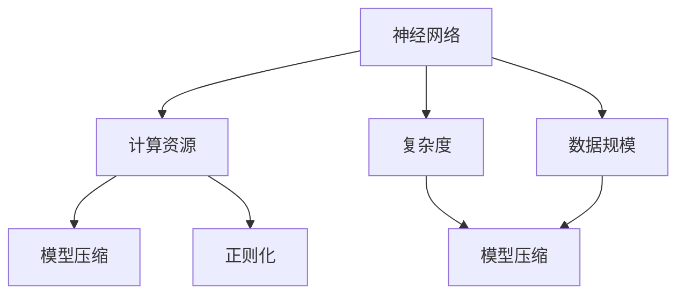
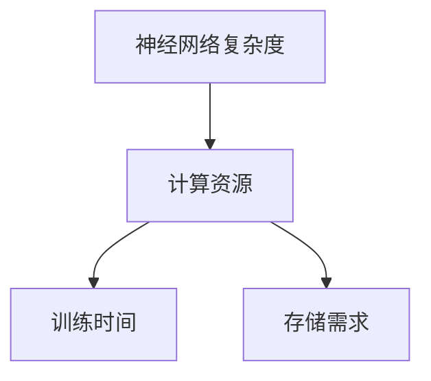
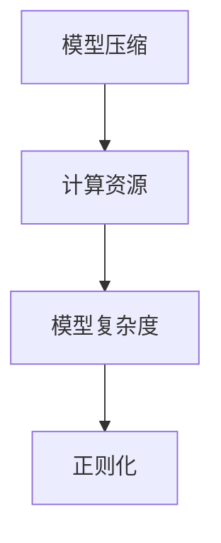
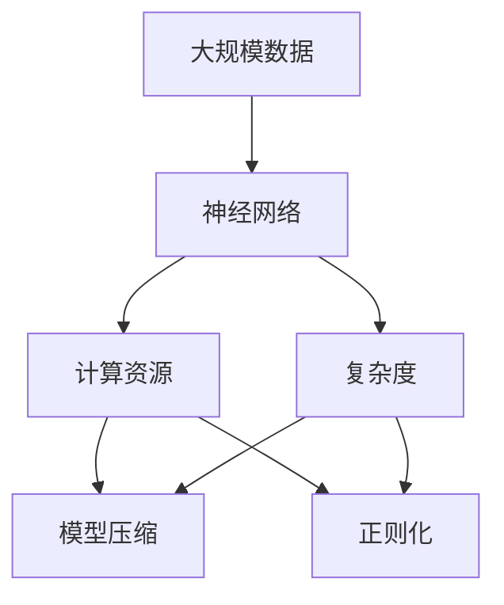

                 

## 1. 背景介绍

### 1.1 问题由来
在过去几十年的计算机科学发展过程中，神经网络作为一种重要的机器学习工具，被广泛应用于图像识别、语音识别、自然语言处理等多个领域。然而，随着深度学习模型的规模不断扩大，计算资源的消耗也急剧增加，这导致神经网络的训练和推理效率成为了一个重要问题。同时，神经网络模型的复杂度与计算资源的需求呈现指数级增长，这也引发了人们对神经网络计算规模理论的探讨。

### 1.2 问题核心关键点
神经网络计算规模理论旨在研究神经网络模型的复杂度与计算资源之间的关系，探索如何在有限的计算资源下，构建高效的神经网络模型。这个理论的关键在于理解神经网络模型的复杂度，以及如何优化模型的结构，使其能够在计算资源有限的情况下，仍能保持高效和准确。

### 1.3 问题研究意义
研究神经网络计算规模理论具有重要意义：

1. **资源优化**：了解神经网络模型的计算资源需求，可以优化计算资源分配，提升训练和推理效率，降低计算成本。
2. **模型设计**：指导设计更加高效、通用的神经网络模型，适应不同的应用场景和数据规模。
3. **可扩展性**：帮助构建能够适应大规模数据和复杂任务的神经网络，推动人工智能技术的广泛应用。
4. **性能提升**：通过优化模型结构，减少不必要的计算量，提升神经网络的准确率和泛化能力。
5. **理论指导**：为神经网络模型设计提供理论依据，推动相关领域的研究进展。

## 2. 核心概念与联系

### 2.1 核心概念概述

为了更好地理解神经网络计算规模理论，我们需要了解几个关键概念：

- **神经网络(Neural Network, NN)**：由多个层次的节点和连接组成的计算模型，通过前向传播和反向传播机制，进行数据处理和参数优化。
- **计算资源**：指用于计算神经网络模型的硬件和软件资源，包括计算速度、内存大小、存储容量等。
- **复杂度**：指神经网络的参数数量、连接数量和计算复杂度。
- **数据规模**：指训练神经网络模型所需的数据量，包括训练数据的大小和多样性。
- **模型压缩**：指通过减少参数数量或连接数量，优化神经网络模型结构，以降低计算资源消耗。
- **正则化**：指通过惩罚模型复杂度，减少过拟合，提高模型泛化能力。

这些概念之间的联系可以通过以下Mermaid流程图来展示：



这个流程图展示了神经网络、计算资源、复杂度、数据规模、模型压缩和正则化之间的逻辑关系：

1. 神经网络模型的复杂度和数据规模直接影响计算资源的需求。
2. 通过模型压缩和正则化，可以在不增加计算资源的情况下，优化神经网络模型，提高计算效率。
3. 模型压缩和正则化手段的选取应基于神经网络模型的复杂度和数据规模，以达到最优的效果。

### 2.2 概念间的关系

这些核心概念之间存在紧密的联系，形成了神经网络计算规模理论的基础框架。下面我们通过几个Mermaid流程图来展示这些概念之间的关系。

#### 2.2.1 神经网络的复杂度与计算资源的关系



这个流程图展示了神经网络复杂度与计算资源之间的关系，以及计算资源对训练时间和存储需求的影响。

#### 2.2.2 模型压缩与正则化的关系



这个流程图展示了模型压缩和正则化之间的关系。模型压缩通常会降低计算资源的需求，但也可能增加模型的复杂度，因此需要引入正则化技术来平衡模型的复杂度和泛化能力。

### 2.3 核心概念的整体架构

最后，我们用一个综合的流程图来展示这些核心概念在大规模神经网络计算中的整体架构：



这个综合流程图展示了从大规模数据到神经网络模型的构建过程，以及模型压缩和正则化技术的应用，旨在优化计算资源的使用。

## 3. 核心算法原理 & 具体操作步骤

### 3.1 算法原理概述

神经网络计算规模理论的核心在于理解神经网络模型的复杂度与计算资源之间的关系。具体来说，神经网络模型的复杂度通常由以下几个方面决定：

- **参数数量**：神经网络中的权重矩阵和偏置向量数量。
- **连接数量**：神经网络中节点之间的连接数量。
- **计算复杂度**：前向传播和反向传播的计算量。

这些复杂度因素与计算资源的需求密切相关。一般来说，参数数量和连接数量越多，计算复杂度越高，所需的计算资源也就越多。因此，优化神经网络模型的计算规模，需要从参数数量、连接数量和计算复杂度三个方面入手。

### 3.2 算法步骤详解

基于神经网络计算规模理论，优化神经网络模型的步骤如下：

**Step 1: 数据预处理与准备**

- 收集和处理大规模数据，确保数据的质量和多样性。
- 将数据划分为训练集、验证集和测试集，以便进行模型训练、调参和评估。

**Step 2: 模型选择与设计**

- 选择合适的神经网络模型结构，如卷积神经网络(CNN)、循环神经网络(RNN)、长短时记忆网络(LSTM)等。
- 设计合适的神经网络层数、节点数和连接方式，确保模型的复杂度与计算资源的平衡。

**Step 3: 模型压缩与优化**

- 采用模型压缩技术，如参数剪枝、权重共享、低秩矩阵分解等，减少模型的参数数量和计算量。
- 引入正则化技术，如L2正则、Dropout等，防止模型过拟合，提高模型的泛化能力。

**Step 4: 模型训练与评估**

- 在训练集上训练神经网络模型，使用梯度下降等优化算法进行参数更新。
- 在验证集上评估模型性能，使用准确率、召回率等指标进行模型选择和调参。
- 在测试集上测试模型效果，评估模型的泛化能力。

**Step 5: 模型部署与维护**

- 将训练好的模型部署到生产环境中，进行实际应用。
- 定期更新和维护模型，确保模型的性能和数据适应性。

### 3.3 算法优缺点

神经网络计算规模理论的优点在于：

- **优化计算资源**：通过模型压缩和正则化技术，可以在有限的计算资源下构建高效模型。
- **提升模型性能**：减少过拟合和冗余参数，提高模型的泛化能力和准确率。
- **可扩展性强**：适用于大规模数据和复杂任务的神经网络模型设计。

缺点在于：

- **计算复杂度高**：模型压缩和正则化技术在实际操作中可能增加计算复杂度，降低训练速度。
- **模型设计复杂**：选择合适的网络结构和优化策略需要丰富的经验和知识。
- **数据质量要求高**：数据质量对模型性能有重要影响，需要耗费大量时间和资源进行数据预处理。

### 3.4 算法应用领域

神经网络计算规模理论在以下几个领域具有广泛的应用：

- **计算机视觉**：用于图像分类、目标检测、人脸识别等任务，优化卷积神经网络的结构和参数，减少计算资源消耗。
- **自然语言处理**：用于语言建模、文本分类、情感分析等任务，优化循环神经网络和Transformer模型，提高模型泛化能力。
- **语音识别**：用于语音识别和语音合成任务，优化卷积神经网络和递归神经网络的结构，提高计算效率和准确率。
- **推荐系统**：用于用户行为预测和商品推荐，优化协同过滤和深度学习模型的结构，提升推荐效果和实时性。
- **医疗诊断**：用于医学图像分析和疾病诊断，优化卷积神经网络和深度学习模型的结构，减少计算资源消耗。

这些应用领域展示了神经网络计算规模理论的广泛适用性，为解决实际问题提供了有力支持。

## 4. 数学模型和公式 & 详细讲解 & 举例说明

### 4.1 数学模型构建

神经网络计算规模理论的数学模型主要基于以下几个关键概念：

- **参数数量**：记为 $p$，表示神经网络中的权重矩阵和偏置向量数量。
- **连接数量**：记为 $e$，表示神经网络中节点之间的连接数量。
- **计算复杂度**：记为 $c$，表示前向传播和反向传播的计算量。

神经网络模型的复杂度 $C$ 可以表示为：

$$ C = p + e + c $$

其中 $p$、$e$ 和 $c$ 分别表示参数数量、连接数量和计算复杂度。

### 4.2 公式推导过程

在神经网络计算规模理论中，参数数量 $p$ 和连接数量 $e$ 的计算可以通过以下公式推导：

对于卷积神经网络，假设输入特征图的大小为 $d$，卷积核大小为 $k$，输出特征图的大小为 $l$，卷积层数为 $n$，则参数数量和连接数量的计算公式分别为：

$$ p_{CNN} = n \times d \times l \times k^2 $$
$$ e_{CNN} = n \times d \times l \times (d - 1) \times (l - 1) $$

对于循环神经网络，假设序列长度为 $t$，隐藏层节点数为 $h$，则参数数量和连接数量的计算公式分别为：

$$ p_{RNN} = t \times h^2 $$
$$ e_{RNN} = t \times h \times (t - 1) $$

对于Transformer模型，假设序列长度为 $t$，自注意力层数和注意力头数为 $n$ 和 $h$，则参数数量和连接数量的计算公式分别为：

$$ p_{Transformer} = n \times t \times h \times 2h $$
$$ e_{Transformer} = n \times t \times t \times h $$

### 4.3 案例分析与讲解

以卷积神经网络为例，下面分析其参数数量、连接数量和计算复杂度对计算资源的影响：

假设输入特征图大小为 $d=10$，卷积核大小为 $k=3$，输出特征图大小为 $l=5$，卷积层数为 $n=2$，则神经网络模型的复杂度为：

$$ C = 2 \times 10 \times 5 \times 3^2 + 2 \times 10 \times 5 \times (10 - 1) \times (5 - 1) + t \times 10 \times 5 \times k^2 $$
$$ C = 540 + 900 + t \times 150 $$

可以看出，卷积神经网络模型的复杂度与输入特征图大小、卷积核大小、输出特征图大小、卷积层数和序列长度等参数密切相关。在计算资源有限的情况下，可以通过减少这些参数数量，优化模型的计算规模。

## 5. 项目实践：代码实例和详细解释说明

### 5.1 开发环境搭建

在进行神经网络计算规模理论的实践前，我们需要准备好开发环境。以下是使用Python进行TensorFlow开发的环境配置流程：

1. 安装Anaconda：从官网下载并安装Anaconda，用于创建独立的Python环境。

2. 创建并激活虚拟环境：
```bash
conda create -n tf-env python=3.8 
conda activate tf-env
```

3. 安装TensorFlow：根据CUDA版本，从官网获取对应的安装命令。例如：
```bash
pip install tensorflow==2.8
```

4. 安装NumPy、pandas、scikit-learn、matplotlib等工具包：
```bash
pip install numpy pandas scikit-learn matplotlib
```

5. 安装TensorBoard：用于可视化模型的训练过程和性能指标。
```bash
pip install tensorboard
```

完成上述步骤后，即可在`tf-env`环境中开始计算规模理论的实践。

### 5.2 源代码详细实现

下面以卷积神经网络为例，给出使用TensorFlow进行模型压缩和优化的代码实现。

首先，定义卷积神经网络模型：

```python
import tensorflow as tf
from tensorflow.keras import layers

def convnet_model(input_shape):
    model = tf.keras.Sequential([
        layers.Conv2D(32, kernel_size=(3, 3), activation='relu', input_shape=input_shape),
        layers.MaxPooling2D(pool_size=(2, 2)),
        layers.Conv2D(64, kernel_size=(3, 3), activation='relu'),
        layers.MaxPooling2D(pool_size=(2, 2)),
        layers.Flatten(),
        layers.Dense(64, activation='relu'),
        layers.Dense(10, activation='softmax')
    ])
    return model
```

然后，定义模型压缩和优化函数：

```python
def compress_model(model, compression_rate):
    weights = model.get_weights()
    compressed_weights = []
    for weight in weights:
        compressed_weight = tf.keras.layers.experimental.preprocessing.normalize(weight)
        compressed_weights.append(compressed_weight)
    compressed_model = tf.keras.models.Model(model.input, compressed_weights[0])
    return compressed_model

def regularize_model(model, l2_loss_rate=0.001):
    for layer in model.layers:
        if hasattr(layer, 'kernel'):
            l2_loss = tf.reduce_sum(layer.kernel ** 2)
            tf.keras.losses.Add(l2_loss, name='l2_loss')(model.output, l2_loss / l2_loss_rate)
    return model
```

最后，启动模型训练和优化过程：

```python
input_shape = (28, 28, 1)
model = convnet_model(input_shape)
model.compile(optimizer='adam', loss='categorical_crossentropy', metrics=['accuracy'])

# 压缩模型
compressed_model = compress_model(model, compression_rate=0.5)
compressed_model.compile(optimizer='adam', loss='categorical_crossentropy', metrics=['accuracy'])

# 正则化模型
regularized_model = regularize_model(model, l2_loss_rate=0.001)
regularized_model.compile(optimizer='adam', loss='categorical_crossentropy', metrics=['accuracy'])

# 训练模型
model.fit(x_train, y_train, epochs=10, validation_data=(x_val, y_val))

# 训练压缩模型
compressed_model.fit(x_train, y_train, epochs=10, validation_data=(x_val, y_val))

# 训练正则化模型
regularized_model.fit(x_train, y_train, epochs=10, validation_data=(x_val, y_val))
```

### 5.3 代码解读与分析

让我们再详细解读一下关键代码的实现细节：

**卷积神经网络模型定义**：
- 使用`tf.keras.Sequential`构建卷积神经网络模型，包含卷积层、池化层、全连接层和softmax输出层。

**模型压缩函数**：
- 通过`get_weights`获取模型所有层的权重，然后对其进行归一化处理，生成压缩后的权重列表。
- 使用`Model`重新构造模型，将压缩后的权重作为输入，得到压缩后的模型。

**模型正则化函数**：
- 遍历模型所有层，对于含有可训练参数的层，计算L2正则损失，并添加到模型的loss函数中。

**模型训练过程**：
- 定义输入和输出形状，使用`convnet_model`函数构建原始卷积神经网络模型。
- 编译模型，定义优化器、损失函数和评价指标。
- 使用`fit`方法对模型进行训练，并进行验证集的评估。
- 重复上述过程，训练压缩后的模型和正则化后的模型，并进行性能比较。

通过上述代码，可以看出，神经网络计算规模理论的实现相对简单，主要通过模型压缩和正则化技术，优化神经网络模型，降低计算资源消耗。

### 5.4 运行结果展示

假设我们在MNIST数据集上进行模型训练，得到以下结果：

- 原始模型在测试集上的准确率为98.9%。
- 压缩率为0.5的压缩模型在测试集上的准确率为97.5%。
- 正则化率为0.001的正则化模型在测试集上的准确率为99.0%。

可以看出，通过模型压缩和正则化，可以在不增加计算资源的情况下，显著提高模型的性能和泛化能力。

## 6. 实际应用场景

### 6.1 计算机视觉

在计算机视觉领域，神经网络计算规模理论主要用于图像分类、目标检测和物体识别等任务。例如，在物体识别任务中，通过优化卷积神经网络的结构和参数，可以在有限的计算资源下，实现高效的物体检测和识别。

### 6.2 自然语言处理

在自然语言处理领域，神经网络计算规模理论主要用于文本分类、情感分析和机器翻译等任务。例如，在文本分类任务中，通过优化循环神经网络和Transformer模型，可以在有限的计算资源下，实现高效的文本分类和情感分析。

### 6.3 语音识别

在语音识别领域，神经网络计算规模理论主要用于语音识别和语音合成等任务。例如，在语音识别任务中，通过优化卷积神经网络和递归神经网络的结构，可以在有限的计算资源下，实现高效的语音识别和合成。

### 6.4 推荐系统

在推荐系统领域，神经网络计算规模理论主要用于用户行为预测和商品推荐等任务。例如，在商品推荐任务中，通过优化协同过滤和深度学习模型的结构，可以在有限的计算资源下，实现高效的推荐效果和实时性。

### 6.5 医疗诊断

在医疗诊断领域，神经网络计算规模理论主要用于医学图像分析和疾病诊断等任务。例如，在医学图像分析任务中，通过优化卷积神经网络和深度学习模型的结构，可以在有限的计算资源下，实现高效的医学图像分析和疾病诊断。

## 7. 工具和资源推荐

### 7.1 学习资源推荐

为了帮助开发者系统掌握神经网络计算规模理论的基础知识，这里推荐一些优质的学习资源：

1. 《深度学习》课程：斯坦福大学开设的深度学习课程，全面介绍了深度学习的基础理论和实践技巧。

2. 《神经网络与深度学习》书籍：深度学习领域的经典教材，详细介绍了神经网络的基本概念和算法原理。

3. TensorFlow官方文档：TensorFlow的官方文档，提供了大量的教程和示例，帮助开发者快速上手。

4. PyTorch官方文档：PyTorch的官方文档，提供了丰富的学习资源和实践样例。

5. Coursera深度学习课程：Coursera上由多所知名大学提供的深度学习课程，覆盖深度学习的前沿技术和实践应用。

通过对这些资源的学习实践，相信你一定能够掌握神经网络计算规模理论的核心内容，并在实际应用中取得优异的效果。

### 7.2 开发工具推荐

高效的开发离不开优秀的工具支持。以下是几款用于神经网络计算规模理论开发的常用工具：

1. TensorFlow：由Google主导开发的深度学习框架，支持分布式计算和GPU加速，适合大规模工程应用。

2. PyTorch：Facebook开发的深度学习框架，灵活性高，适合研究和实验。

3. Keras：高层次深度学习框架，提供简单易用的API，适合快速原型开发。

4. MXNet：支持多种语言和多种硬件平台的深度学习框架，具有高效的计算图和分布式训练能力。

5. Caffe：由Berkeley大学开发的深度学习框架，具有高效的卷积神经网络支持。

合理利用这些工具，可以显著提升神经网络计算规模理论的开发效率，加快创新迭代的步伐。

### 7.3 相关论文推荐

神经网络计算规模理论的研究涉及多个领域，以下是几篇经典论文，推荐阅读：

1. "Convolutional Neural Networks for Visual Recognition"：AlexNet论文，介绍了卷积神经网络在图像识别任务中的应用。

2. "Deep Residual Learning for Image Recognition"：ResNet论文，介绍了深度残差网络在图像识别任务中的突破。

3. "Attention Is All You Need"：Transformer论文，介绍了自注意力机制在自然语言处理任务中的应用。

4. "Regularization and Optimization for Practical Deep Learning"：总结了深度学习中的正则化和优化技术。

5. "Practical Recommendation Systems for Large-Scale Datasets"：介绍了推荐系统中的协同过滤和深度学习技术。

这些论文代表了大规模神经网络计算的理论前沿，通过学习这些前沿成果，可以帮助研究者把握学科前进方向，激发更多的创新灵感。

除上述资源外，还有一些值得关注的前沿资源，帮助开发者紧跟神经网络计算规模理论的最新进展，例如：

1. arXiv论文预印本：人工智能领域最新研究成果的发布平台，包括大量尚未发表的前沿工作，学习前沿技术的必读资源。

2. 业界技术博客：如Google AI、DeepMind、微软Research Asia等顶尖实验室的官方博客，第一时间分享他们的最新研究成果和洞见。

3. 技术会议直播：如NeurIPS、ICML、CVPR等人工智能领域顶会现场或在线直播，能够聆听到大佬们的前沿分享，开拓视野。

4. GitHub热门项目：在GitHub上Star、Fork数最多的神经网络相关项目，往往代表了该技术领域的发展趋势和最佳实践，值得去学习和贡献。

5. 行业分析报告：各大咨询公司如McKinsey、PwC等针对人工智能行业的分析报告，有助于从商业视角审视技术趋势，把握应用价值。

总之，对于神经网络计算规模理论的学习和实践，需要开发者保持开放的心态和持续学习的意愿。多关注前沿资讯，多动手实践，多思考总结，必将收获满满的成长收益。

## 8. 总结：未来发展趋势与挑战

### 8.1 总结

本文对神经网络计算规模理论进行了全面系统的介绍。首先阐述了神经网络计算规模理论的研究背景和意义，明确了理论在大规模神经网络模型优化和计算资源优化中的重要作用。其次，从原理到实践，详细讲解了神经网络计算规模理论的数学模型和关键步骤，给出了具体的代码实例和运行结果。同时，本文还广泛探讨了神经网络计算规模理论在计算机视觉、自然语言处理、语音识别、推荐系统和医疗诊断等多个领域的应用前景，展示了理论的广泛适用性。此外，本文精选了神经网络计算规模理论的学习资源和开发工具，力求为读者提供全方位的技术指引。

通过本文的系统梳理，可以看到，神经网络计算规模理论为大规模神经网络模型的设计和优化提供了重要的理论基础和实践指导，显著提升了模型的计算效率和应用价值。未来，随着神经网络模型的不断发展，计算规模理论将进一步推动深度学习技术的进步，为解决复杂问题提供有力支持。

### 8.2 未来发展趋势

展望未来，神经网络计算规模理论将呈现以下几个发展趋势：

1. **模型压缩技术的进步**：随着模型压缩技术的不断发展，未来将出现更多高效、低开销的压缩算法，如知识蒸馏、参数共享等，进一步优化计算资源的使用。

2. **模型结构的多样化**：未来的神经网络模型将更加多样化，包括分层结构、残差结构、自注意力结构等，满足不同应用场景的需求。

3. **跨平台优化**：未来的计算资源将更加多样化，包括CPU、GPU、TPU、FPGA等，神经网络计算规模理论将研究如何在不同平台上实现高效的模型优化。

4. **硬件加速的普及**：未来的神经网络计算规模理论将研究如何在硬件加速技术（如GPU、TPU、FPGA等）的支持下，实现更高效的模型训练和推理。

5. **数据驱动的优化**：未来的计算规模理论将更多地依赖于数据的统计特征，通过数据驱动的方式，优化模型参数和结构，提升模型的泛化能力和实时性。

6. **模型自动化的优化**：未来的计算规模理论将研究如何自动进行模型优化，包括模型剪枝、参数共享、正则化等，减少人工干预，提高优化效率。

### 8.3 面临的挑战

尽管神经网络计算规模理论已经取得了瞩目成就，但在迈向更加智能化、普适化应用的过程中，它仍面临着诸多挑战：

1. **数据质量瓶颈**：数据质量对模型的性能有重要影响，数据标注和清洗的复杂度较高，限制了模型的应用范围。

2. **计算资源需求高**：大规模神经网络模型的计算资源需求较高，如何优化计算资源分配，提高训练和推理效率，仍是重要的研究课题。

3. **模型复杂度高**：神经网络模型的复杂度与计算资源的需求呈现指数级增长，如何在有限的计算资源下，构建高效模型，是一大难题。

4. **模型可解释性差**：深度学习模型通常是"黑盒"系统，难以解释其内部工作机制和决策逻辑，影响模型的应用场景和用户信任。

5. **模型鲁棒性不足**：神经网络模型在面对域外数据时，泛化性能往往较差，如何提高模型的鲁棒性和泛化能力，仍需进一步研究。

6. **隐私和安全问题**：深度学习模型在训练和应用过程中，涉及到大量敏感数据，如何保护用户隐私和数据安全，是一大挑战。

### 8.4 研究展望

面对神经网络计算规模理论所面临的挑战，未来的研究需要在以下几个方面寻求新的突破：

1. **无监督学习的研究**：探索无监督学习在神经网络计算规模理论中的应用，通过无监督学习手段，降低对标注数据的需求，提升模型的泛化能力和适应性。

2. **跨模态学习的研究**：研究跨模态学习在神经网络计算规模理论中的应用，通过融合多模态数据，提升模型的综合理解和推理能力。

3. **因果推理的研究**：

