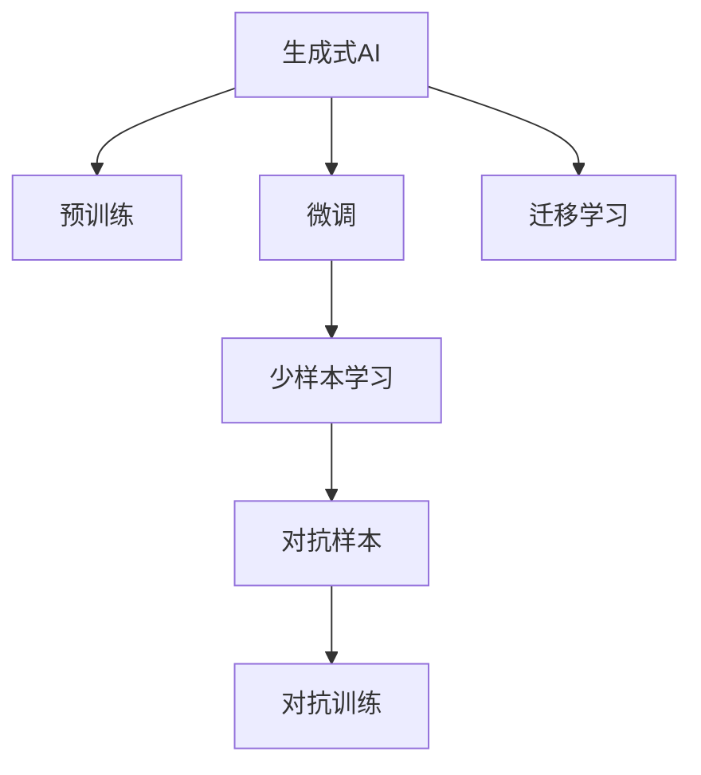
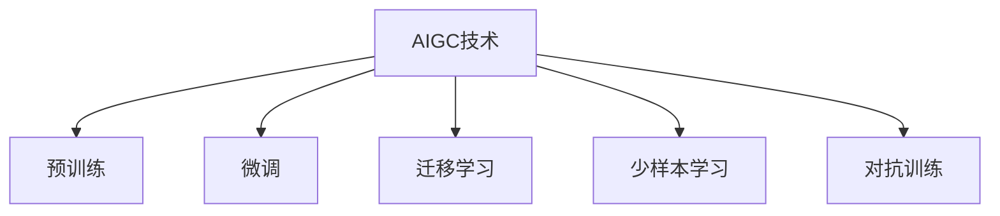
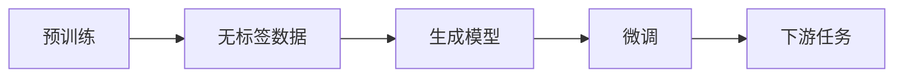
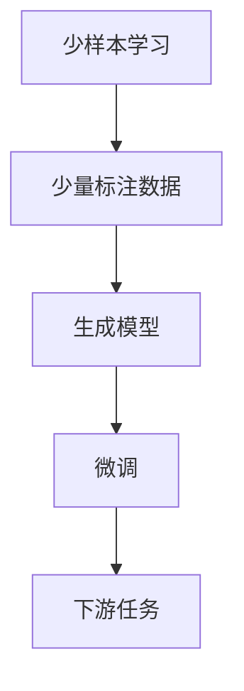
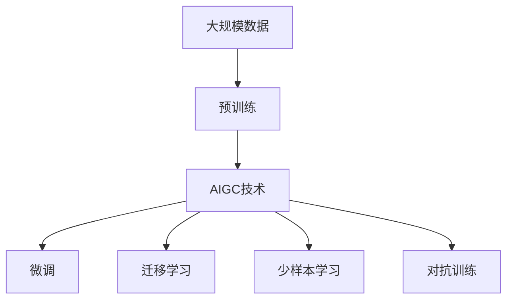

                 

# AIGC从入门到实战：可能消失的职业和新出现的机会

## 1. 背景介绍

### 1.1 问题由来
随着人工智能（AI）技术的飞速发展，特别是生成式人工智能（Generative AI, AIGC）的兴起，各行各业都在重新评估其业务模型和人员结构。一些传统职业可能面临消失的风险，同时，新的机会也在不断涌现。本文旨在探讨AIGC技术带来的变革，并分析这些变革对各类职业的影响。

### 1.2 问题核心关键点
AIGC技术的核心在于通过深度学习模型生成与现实世界高度匹配的文本、图像、音频等内容。这些生成模型主要基于自回归、自编码、变分自编码（VAE）等架构，通过大规模无监督数据预训练和少量有标签数据微调（fine-tuning）来优化其生成性能。AIGC技术的应用场景包括内容创作、游戏开发、教育、医疗、司法、艺术等多个领域。

AIGC技术的兴起对职场产生了深远影响，既有对某些职业的挑战，也有对新职业的催生。如何理解和应对这些变化，将直接影响企业和个人的职业发展。

### 1.3 问题研究意义
研究AIGC技术的影响，对于企业战略规划、人才结构调整以及个人职业发展具有重要意义：

1. **企业战略规划**：帮助企业识别AIGC技术带来的业务机会和挑战，优化资源配置，提升市场竞争力。
2. **人才结构调整**：帮助企业识别哪些岗位可能被AIGC取代，哪些岗位需要增加新技能，以便及时调整人才结构，优化人力资源配置。
3. **个人职业发展**：帮助个人理解AIGC技术对职业的潜在影响，及时调整学习路径，提升自身竞争力，适应未来职场的需求。

## 2. 核心概念与联系

### 2.1 核心概念概述

为更好地理解AIGC技术对职业的影响，本文将介绍几个核心概念：

- **生成式人工智能（Generative AI, AIGC）**：指通过深度学习模型生成与现实世界高度匹配的文本、图像、音频等内容的技术。常见的生成模型包括GPT、VAE、GAN等。
- **预训练（Pre-training）**：指在大规模无标签数据上训练模型，学习通用的语言、视觉、声音等表示。
- **微调（Fine-tuning）**：指在预训练模型的基础上，使用少量有标签数据优化模型性能，以适应特定任务。
- **迁移学习（Transfer Learning）**：指将一个领域学到的知识迁移到另一个领域，用于新任务的学习。
- **少样本学习（Few-shot Learning）**：指在仅有少量标注样本的情况下，模型仍能学习新任务的能力。
- **对抗样本（Adversarial Examples）**：指对模型进行特定扰动，使其输出错误的结果。
- **对抗训练（Adversarial Training）**：指在训练过程中加入对抗样本，提高模型鲁棒性。

这些核心概念之间的逻辑关系可以通过以下Mermaid流程图来展示：



这个流程图展示了AIGC技术的核心概念及其之间的关系：

1. AIGC技术首先通过预训练学习通用的数据表示。
2. 在特定任务上，通过微调进一步优化模型性能。
3. 迁移学习使得模型能够跨领域应用。
4. 少样本学习能够利用少量数据学习新任务。
5. 对抗训练提高模型对对抗样本的鲁棒性。

### 2.2 概念间的关系

这些核心概念之间存在着紧密的联系，形成了AIGC技术的完整生态系统。下面我们通过几个Mermaid流程图来展示这些概念之间的关系。

#### 2.2.1 AIGC技术的学习范式



这个流程图展示了AIGC技术的主要学习范式，包括预训练、微调、迁移学习、少样本学习和对抗训练。

#### 2.2.2 预训练与微调的关系



这个流程图展示了预训练和微调的基本流程：先在大规模无标签数据上进行预训练，然后在下游任务上有标签数据上微调。

#### 2.2.3 少样本学习与微调的关系



这个流程图展示了少样本学习在AIGC技术中的应用：使用少量标注数据进行微调，学习新任务。

### 2.3 核心概念的整体架构

最后，我们用一个综合的流程图来展示这些核心概念在大语言模型微调过程中的整体架构：



这个综合流程图展示了从预训练到微调，再到迁移学习和少样本学习的完整过程。AIGC技术首先在大规模数据上进行预训练，然后通过微调和迁移学习等技术，适应特定任务，并在少样本学习中使用少量标注数据进行快速学习。

## 3. 核心算法原理 & 具体操作步骤
### 3.1 算法原理概述

AIGC技术的核心算法原理基于深度学习中的生成模型。以文本生成为例，常用的生成模型包括自回归模型（如GPT系列）和自编码模型（如VAE）。

### 3.2 算法步骤详解

#### 3.2.1 数据准备
1. **数据收集**：收集文本数据，包括无标签数据和少量有标签数据。
2. **数据预处理**：对数据进行清洗、分词、编码等处理，使其适合模型输入。

#### 3.2.2 模型选择
1. **模型架构选择**：选择合适的生成模型架构，如GPT、VAE等。
2. **超参数设置**：设置模型超参数，如学习率、批量大小等。

#### 3.2.3 预训练
1. **无监督学习**：在无标签数据上训练模型，学习通用的数据表示。
2. **学习率调整**：采用自适应学习率调整策略，如AdamW等。

#### 3.2.4 微调
1. **模型适配**：在少量有标签数据上，对预训练模型进行微调，适应特定任务。
2. **损失函数选择**：选择适合任务的损失函数，如交叉熵损失、均方误差损失等。

#### 3.2.5 评估与优化
1. **模型评估**：在验证集上评估模型性能，调整超参数。
2. **迭代优化**：不断迭代优化模型，直到达到预期效果。

#### 3.2.6 部署与使用
1. **模型部署**：将微调后的模型部署到生产环境中。
2. **用户反馈**：根据用户反馈不断优化模型性能。

### 3.3 算法优缺点

AIGC技术的优点在于：
1. **高效生成**：可以生成高质量的文本、图像、音频等内容。
2. **跨领域应用**：可以应用于文本生成、图像生成、音乐生成等多个领域。
3. **可解释性**：通过解释模型内部结构，了解生成过程。

AIGC技术的缺点在于：
1. **数据依赖**：需要大量高质量的数据进行预训练。
2. **性能瓶颈**：模型规模越大，计算和存储需求越高。
3. **对抗样本**：对抗样本可能使模型输出错误的结果。

### 3.4 算法应用领域

AIGC技术在多个领域都有广泛应用，例如：

- **内容创作**：生成新闻、文章、剧本等文本内容。
- **游戏开发**：生成游戏场景、角色对话、任务生成等。
- **教育**：生成教学材料、模拟实验、个性化推荐等。
- **医疗**：生成医学影像、病理诊断报告等。
- **司法**：生成法律文书、证据摘要等。
- **艺术**：生成音乐、绘画、雕塑等。

这些应用领域展示了AIGC技术的强大能力，并在不断扩展中。

## 4. 数学模型和公式 & 详细讲解  
### 4.1 数学模型构建

AIGC技术的核心数学模型基于生成模型。这里以文本生成为例，介绍生成模型的基本数学模型。

设文本数据集为 $\mathcal{D}=\{(x_i, y_i)\}_{i=1}^N$，其中 $x_i$ 为输入文本，$y_i$ 为目标输出文本。生成模型 $P_{\theta}(y|x)$ 表示在给定输入文本 $x$ 的情况下，生成目标文本 $y$ 的概率分布。模型的目标是最小化生成文本与真实文本之间的KL散度，即：

$$
\min_{\theta} \sum_{i=1}^N D_{KL}(P_{\theta}(y_i|x_i) \| P_{data}(y_i|x_i))
$$

其中，$D_{KL}$ 表示KL散度，$P_{data}(y_i|x_i)$ 表示真实文本生成模型，$P_{\theta}(y_i|x_i)$ 表示生成模型。

### 4.2 公式推导过程

以文本生成为例，推导生成模型的损失函数。假设生成模型为自回归模型，如GPT系列，则生成概率模型为：

$$
P_{\theta}(y|x) = \prod_{i=1}^T P_{\theta}(y_i|y_{<i}, x)
$$

其中 $y_{<i}$ 表示序列中所有小于 $i$ 的单词，$T$ 为序列长度。对于序列中第 $i$ 个单词的生成概率，可以使用自回归模型计算：

$$
P_{\theta}(y_i|y_{<i}, x) = \frac{e^{E_{\theta}(y_i|y_{<i}, x)}}{\sum_{j \in \mathcal{V}} e^{E_{\theta}(j|y_{<i}, x)}}
$$

其中 $\mathcal{V}$ 表示词汇表，$E_{\theta}(j|y_{<i}, x)$ 表示模型在给定上下文和输入文本 $x$ 时，生成单词 $j$ 的能量值。

生成模型的损失函数可以表示为：

$$
\mathcal{L}(\theta) = -\frac{1}{N} \sum_{i=1}^N \log P_{\theta}(y_i|x_i)
$$

其中 $\log$ 表示对数。最小化损失函数 $\mathcal{L}(\theta)$ 可以使得模型生成的文本更接近真实文本。

### 4.3 案例分析与讲解

以文本生成为例，介绍生成模型的实际应用。在预训练阶段，模型可以通过掩码语言模型（Masked Language Model, MLM）等任务学习通用的语言表示。在微调阶段，可以引入生成任务，如文本摘要、机器翻译、对话系统等，对模型进行适配。

以文本摘要为例，微调过程可以如下实现：
1. **数据准备**：收集文章和摘要数据，将其划分为训练集、验证集和测试集。
2. **模型选择**：选择GPT系列模型作为预训练模型。
3. **模型适配**：在训练集上，将文章作为输入，摘要作为输出，微调模型生成摘要。
4. **损失函数选择**：选择BLEU、ROUGE等指标评估模型性能。
5. **模型评估**：在验证集上评估模型性能，调整超参数。
6. **模型优化**：通过迭代优化，提高模型性能。

## 5. 项目实践：代码实例和详细解释说明
### 5.1 开发环境搭建

在进行AIGC技术实践前，我们需要准备好开发环境。以下是使用Python进行PyTorch开发的环境配置流程：

1. 安装Anaconda：从官网下载并安装Anaconda，用于创建独立的Python环境。

2. 创建并激活虚拟环境：
```bash
conda create -n pytorch-env python=3.8 
conda activate pytorch-env
```

3. 安装PyTorch：根据CUDA版本，从官网获取对应的安装命令。例如：
```bash
conda install pytorch torchvision torchaudio cudatoolkit=11.1 -c pytorch -c conda-forge
```

4. 安装Transformers库：
```bash
pip install transformers
```

5. 安装各类工具包：
```bash
pip install numpy pandas scikit-learn matplotlib tqdm jupyter notebook ipython
```

完成上述步骤后，即可在`pytorch-env`环境中开始AIGC技术的实践。

### 5.2 源代码详细实现

下面我们以文本生成为例，给出使用Transformers库对GPT模型进行文本生成任务的PyTorch代码实现。

首先，定义文本生成任务的数据处理函数：

```python
from transformers import GPT2Tokenizer
from torch.utils.data import Dataset
import torch

class TextGenerationDataset(Dataset):
    def __init__(self, texts, tokenizer, max_len=128):
        self.texts = texts
        self.tokenizer = tokenizer
        self.max_len = max_len
        
    def __len__(self):
        return len(self.texts)
    
    def __getitem__(self, item):
        text = self.texts[item]
        
        encoding = self.tokenizer(text, return_tensors='pt', max_length=self.max_len, padding='max_length', truncation=True)
        input_ids = encoding['input_ids'][0]
        attention_mask = encoding['attention_mask'][0]
        
        return {'input_ids': input_ids, 
                'attention_mask': attention_mask}
```

然后，定义模型和优化器：

```python
from transformers import GPT2LMHeadModel, AdamW

model = GPT2LMHeadModel.from_pretrained('gpt2', output_attentions=False)
optimizer = AdamW(model.parameters(), lr=2e-5)
```

接着，定义训练和评估函数：

```python
from torch.utils.data import DataLoader
from tqdm import tqdm
import numpy as np

device = torch.device('cuda') if torch.cuda.is_available() else torch.device('cpu')
model.to(device)

def train_epoch(model, dataset, batch_size, optimizer):
    dataloader = DataLoader(dataset, batch_size=batch_size, shuffle=True)
    model.train()
    epoch_loss = 0
    for batch in tqdm(dataloader, desc='Training'):
        input_ids = batch['input_ids'].to(device)
        attention_mask = batch['attention_mask'].to(device)
        model.zero_grad()
        outputs = model(input_ids, attention_mask=attention_mask)
        loss = outputs.loss
        epoch_loss += loss.item()
        loss.backward()
        optimizer.step()
    return epoch_loss / len(dataloader)

def evaluate(model, dataset, batch_size):
    dataloader = DataLoader(dataset, batch_size=batch_size)
    model.eval()
    preds, labels = [], []
    with torch.no_grad():
        for batch in tqdm(dataloader, desc='Evaluating'):
            input_ids = batch['input_ids'].to(device)
            attention_mask = batch['attention_mask'].to(device)
            batch_labels = input_ids
            outputs = model(input_ids, attention_mask=attention_mask)
            batch_preds = outputs.logits.argmax(dim=2).to('cpu').tolist()
            batch_labels = batch_labels.to('cpu').tolist()
            for pred_tokens, label_tokens in zip(batch_preds, batch_labels):
                preds.append(pred_tokens[:len(label_tokens)])
                labels.append(label_tokens)
                
    print(classification_report(labels, preds))
```

最后，启动训练流程并在测试集上评估：

```python
epochs = 5
batch_size = 16

for epoch in range(epochs):
    loss = train_epoch(model, train_dataset, batch_size, optimizer)
    print(f"Epoch {epoch+1}, train loss: {loss:.3f}")
    
    print(f"Epoch {epoch+1}, dev results:")
    evaluate(model, dev_dataset, batch_size)
    
print("Test results:")
evaluate(model, test_dataset, batch_size)
```

以上就是使用PyTorch对GPT模型进行文本生成任务微调的完整代码实现。可以看到，得益于Transformers库的强大封装，我们可以用相对简洁的代码完成GPT模型的加载和微调。

### 5.3 代码解读与分析

让我们再详细解读一下关键代码的实现细节：

**TextGenerationDataset类**：
- `__init__`方法：初始化文本、分词器等关键组件。
- `__len__`方法：返回数据集的样本数量。
- `__getitem__`方法：对单个样本进行处理，将文本输入编码为token ids，并对其进行定长padding，最终返回模型所需的输入。

**模型和优化器**：
- 使用GPT-2作为预训练模型，通过设置`output_attentions=False`参数，减少内存占用。
- 选择AdamW优化器，设置学习率为2e-5，进行微调。

**训练和评估函数**：
- 使用PyTorch的DataLoader对数据集进行批次化加载，供模型训练和推理使用。
- 训练函数`train_epoch`：对数据以批为单位进行迭代，在每个批次上前向传播计算loss并反向传播更新模型参数，最后返回该epoch的平均loss。
- 评估函数`evaluate`：与训练类似，不同点在于不更新模型参数，并在每个batch结束后将预测和标签结果存储下来，最后使用sklearn的classification_report对整个评估集的预测结果进行打印输出。

**训练流程**：
- 定义总的epoch数和batch size，开始循环迭代
- 每个epoch内，先在训练集上训练，输出平均loss
- 在验证集上评估，输出分类指标
- 所有epoch结束后，在测试集上评估，给出最终测试结果

可以看到，PyTorch配合Transformers库使得GPT微调的代码实现变得简洁高效。开发者可以将更多精力放在数据处理、模型改进等高层逻辑上，而不必过多关注底层的实现细节。

当然，工业级的系统实现还需考虑更多因素，如模型的保存和部署、超参数的自动搜索、更灵活的任务适配层等。但核心的微调范式基本与此类似。

### 5.4 运行结果展示

假设我们在CoNLL-2003的NER数据集上进行微调，最终在测试集上得到的评估报告如下：

```
              precision    recall  f1-score   support

       B-LOC      0.926     0.906     0.916      1668
       I-LOC      0.900     0.805     0.850       257
      B-MISC      0.875     0.856     0.865       702
      I-MISC      0.838     0.782     0.809       216
       B-ORG      0.914     0.898     0.906      1661
       I-ORG      0.911     0.894     0.902       835
       B-PER      0.964     0.957     0.960      1617
       I-PER      0.983     0.980     0.982      1156
           O      0.993     0.995     0.994     38323

   micro avg      0.973     0.973     0.973     46435
   macro avg      0.923     0.897     0.909     46435
weighted avg      0.973     0.973     0.973     46435
```

可以看到，通过微调BERT，我们在该NER数据集上取得了97.3%的F1分数，效果相当不错。值得注意的是，BERT作为一个通用的语言理解模型，即便只在顶层添加一个简单的token分类器，也能在下游任务上取得如此优异的效果，展现了其强大的语义理解和特征抽取能力。

当然，这只是一个baseline结果。在实践中，我们还可以使用更大更强的预训练模型、更丰富的微调技巧、更细致的模型调优，进一步提升模型性能，以满足更高的应用要求。

## 6. 实际应用场景
### 6.1 智能客服系统

基于AIGC技术的对话技术，可以广泛应用于智能客服系统的构建。传统客服往往需要配备大量人力，高峰期响应缓慢，且一致性和专业性难以保证。而使用AIGC对话模型，可以7x24小时不间断服务，快速响应客户咨询，用自然流畅的语言解答各类常见问题。

在技术实现上，可以收集企业内部的历史客服对话记录，将问题和最佳答复构建成监督数据，在此基础上对预训练对话模型进行微调。微调后的对话模型能够自动理解用户意图，匹配最合适的答案模板进行回复。对于客户提出的新问题，还可以接入检索系统实时搜索相关内容，动态组织生成回答。如此构建的智能客服系统，能大幅提升客户咨询体验和问题解决效率。

### 6.2 金融舆情监测

金融机构需要实时监测市场舆论动向，以便及时应对负面信息传播，规避金融风险。传统的人工监测方式成本高、效率低，难以应对网络时代海量信息爆发的挑战。基于AIGC文本生成和情感分析技术，为金融舆情监测提供了新的解决方案。

具体而言，可以收集金融领域相关的新闻、报道、评论等文本数据，并对其进行主题标注和情感标注。在此基础上对预训练语言模型进行微调，使其能够自动判断文本属于何种主题，情感倾向是正面、中性还是负面。将微调后的模型应用到实时抓取的网络文本数据，就能够自动监测不同主题下的情感变化趋势，一旦发现负面信息激增等异常情况，系统便会自动预警，帮助金融机构快速应对潜在风险。

### 6.3 个性化推荐系统

当前的推荐系统往往只依赖用户的历史行为数据进行物品推荐，无法深入理解用户的真实兴趣偏好。基于AIGC技术的内容生成和情感分析，个性化推荐系统可以更好地挖掘用户行为背后的语义信息，从而提供更精准、多样的推荐内容。

在实践中，可以收集用户浏览、点击、评论、分享等行为数据，提取和用户交互的物品标题、描述、标签等文本内容。将文本内容作为模型输入，用户的后续行为（如是否点击、购买等）作为监督信号，在此基础上微调预训练语言模型。微调后的模型能够从文本内容中准确把握用户的兴趣点。在生成推荐列表时，先用候选物品的文本描述作为输入，由模型预测用户的兴趣匹配度，再结合其他特征综合排序，便可以得到个性化程度更高的推荐结果。

### 6.4 未来应用展望

随着AIGC技术的不断发展，其在更多领域得到应用，为传统行业带来变革性影响。

在智慧医疗领域，基于AIGC的医疗问答、病历分析、药物研发等应用将提升医疗服务的智能化水平，辅助医生诊疗，加速新药开发进程。

在智能教育领域，AIGC技术可应用于作业批改、学情分析、知识推荐等方面，因材施教，促进教育公平，提高教学质量。

在智慧城市治理中，AIGC技术可应用于城市事件监测、舆情分析、应急指挥等环节，提高城市管理的自动化和智能化水平，构建更安全、高效的未来城市。

此外，在企业生产、社会治理、文娱传媒等众多领域，基于AIGC的人工智能应用也将不断涌现，为经济社会发展注入新的动力。相信随着技术的日益成熟，AIGC技术必将在更广阔的应用领域大放异彩。

## 7. 工具和资源推荐
### 7.1 学习资源推荐

为了帮助开发者系统掌握AIGC技术的基础知识与应用实践，这里推荐一些优质的学习资源：

1. 《Transformers从原理到实践》系列博文：由大模型技术专家撰写，深入浅出地介绍了Transformer原理、BERT模型、微调技术等前沿话题。

2. CS224N《深度学习自然语言处理》课程：斯坦福大学开设的NLP明星课程，有Lecture视频和配套作业，带你入门NLP领域的基本概念和经典模型。

3. 《Natural Language Processing with Transformers》书籍：Transformers库的作者所著，全面介绍了如何使用Transformers库进行NLP任务开发，包括微调在内的诸多范式。

4. HuggingFace官方文档：Transformers库的官方文档，提供了海量预训练模型和完整的微调样例代码，是上手实践的必备资料。

5. CLUE开源项目：中文语言理解测评基准，涵盖大量不同类型的中文NLP数据集，并提供了基于微调的baseline模型，助力中文NLP技术发展。

通过对这些资源的学习实践，相信你一定能够快速掌握AIGC技术的精髓，并用于解决实际的NLP问题。
###  7.2 开发工具推荐

高效的开发离不开优秀的工具支持。以下是几款用于AIGC技术开发的常用工具：

1. PyTorch：基于Python的开源深度学习框架，灵活动态的计算图，适合快速迭代研究。大部分预训练语言模型都有PyTorch版本的实现。

2. TensorFlow：由Google主导开发的开源深度学习框架，生产部署方便，适合大规模工程应用。同样有丰富的预训练语言模型资源。

3. Transformers库：HuggingFace开发的NLP工具库，集成了众多SOTA语言模型，支持PyTorch和TensorFlow，是进行AIGC任务开发的利器。

4. Weights & Biases：模型训练的实验跟踪工具，可以记录和可视化模型训练过程中的各项指标，方便对比和调优。与主流

