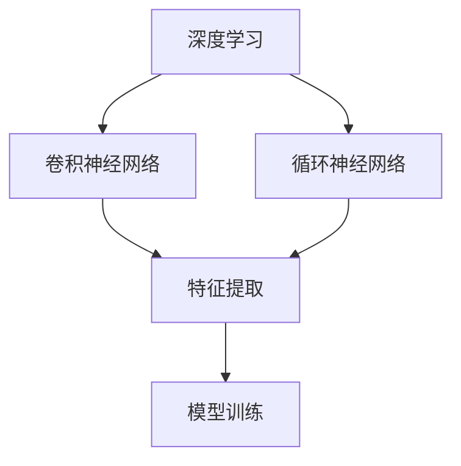

                 

# AI人工智能 Agent：利用深度学习进行特征提取

> 关键词：人工智能Agent, 深度学习, 特征提取, 模型训练, 数据预处理, 实际应用, 算法优化, 研究进展

## 1. 背景介绍

### 1.1 问题由来
随着人工智能(AI)技术的飞速发展，特别是在大数据、深度学习和自然语言处理(NLP)领域的突破，人工智能Agent在各种实际应用中扮演着越来越重要的角色。这些AI Agent能够通过深度学习等先进技术，从大量数据中自动提取出有价值的特征，并根据这些特征做出智能决策或预测。本文将重点探讨利用深度学习进行特征提取的技术和实践，并对其应用进行深入分析。

### 1.2 问题核心关键点
特征提取在大数据和AIAgent中的应用，是实现智能决策、预测和优化的关键环节。深度学习，尤其是卷积神经网络(CNN)和循环神经网络(RNN)在特征提取中展现出了强大的能力。这些模型能够通过多层次的非线性变换，学习到数据的高维特征表示，为后续的决策和预测提供坚实的基础。

当前，深度学习在图像识别、语音识别、自然语言处理等领域已经取得了显著的成果，但在实际应用中，特征提取仍面临着许多挑战：
1. **数据量不足**：某些领域的数据集有限，导致模型难以充分学习特征。
2. **噪声干扰**：原始数据中存在噪声和不一致性，影响特征提取的准确性。
3. **计算资源限制**：大规模深度学习模型的训练和推理需要大量的计算资源。
4. **泛化能力**：模型需要在不同的数据分布上保持稳定的性能。

针对这些问题，本文将介绍深度学习在特征提取中的基本原理，并探讨其优化方法和实际应用场景。

### 1.3 问题研究意义
深入理解深度学习在特征提取中的应用，对于推动AI技术的发展具有重要意义：
1. **提升模型性能**：通过有效的特征提取，可以显著提高AI模型的预测准确性和决策质量。
2. **降低成本**：深度学习模型可以在一定程度上自动化特征提取过程，减少对人工标注数据的依赖。
3. **拓展应用范围**：深度学习模型能够处理高维复杂数据，应用于更多领域。
4. **促进理论研究**：对特征提取技术的深入研究，有助于理解深度学习的本质和优化方法。

## 2. 核心概念与联系

### 2.1 核心概念概述

为了更好地理解深度学习在特征提取中的应用，本节将介绍几个关键概念：

- **深度学习**：通过多层神经网络对数据进行非线性变换，学习到数据的高级特征表示。
- **卷积神经网络(CNN)**：专门用于图像和信号处理领域的深度学习模型，通过卷积操作提取局部特征。
- **循环神经网络(RNN)**：适用于序列数据处理，能够捕捉时间序列的动态变化。
- **特征提取**：从原始数据中提取出有意义的特征，供后续的决策或预测使用。
- **预处理**：对原始数据进行归一化、降噪、标准化等处理，以提高特征提取的准确性。
- **模型训练**：通过优化算法调整模型参数，使其能够更好地适应数据分布。

这些核心概念之间相互联系，共同构成了深度学习在特征提取中的应用框架。

### 2.2 概念间的关系

这些核心概念之间的关系可以通过以下Mermaid流程图来展示：



这个流程图展示了大语言模型微调过程中各个核心概念的联系：

1. 深度学习提供了通用的特征提取手段。
2. CNN和RNN分别在图像和序列数据上展现了强大的特征提取能力。
3. 特征提取为后续的模型训练提供基础数据。
4. 模型训练优化特征提取模型，提升其性能和泛化能力。

## 3. 核心算法原理 & 具体操作步骤

### 3.1 算法原理概述

利用深度学习进行特征提取，主要基于以下几个基本步骤：

1. **数据预处理**：对原始数据进行归一化、降噪、标准化等处理。
2. **卷积或循环操作**：通过CNN或RNN等深度学习模型对数据进行特征提取。
3. **模型训练**：使用反向传播算法优化模型参数，使其适应训练数据。
4. **特征验证**：在验证集上评估特征提取效果，进行必要的调整和优化。
5. **特征应用**：将提取的特征应用于实际的决策或预测任务中。

### 3.2 算法步骤详解

以图像分类为例，利用深度学习进行特征提取的具体步骤如下：

**Step 1: 数据预处理**

- **归一化**：将像素值缩放到0-1之间。
- **标准化**：对数据进行均值和标准差归一化，减少内部协变量位移。
- **降噪**：使用滤波器去除噪声，提高数据质量。

**Step 2: 卷积操作**

- **卷积层**：通过卷积操作提取局部特征，捕捉图像中的边缘、角点等局部特征。
- **池化层**：对卷积层的输出进行降采样，减少特征维度。
- **激活函数**：如ReLU等激活函数，引入非线性变换，增强特征表示能力。

**Step 3: 模型训练**

- **损失函数**：选择交叉熵损失函数，衡量预测与真实标签之间的差异。
- **优化算法**：如Adam、SGD等优化算法，调整模型参数。
- **正则化**：使用L2正则、Dropout等正则化技术，防止过拟合。
- **迭代训练**：在训练集上进行多次迭代训练，逐步优化模型。

**Step 4: 特征验证**

- **验证集**：使用未参与训练的验证集评估模型性能。
- **评估指标**：如准确率、精确率、召回率等，评估模型在不同类别的表现。
- **调整优化**：根据验证集结果调整模型结构或超参数，提高模型性能。

**Step 5: 特征应用**

- **决策支持**：将提取的特征输入到决策支持系统，进行分类、回归等任务。
- **预测分析**：利用特征进行预测，如图像识别、语音识别、自然语言处理等。
- **优化调整**：根据应用效果，不断优化特征提取算法，提高特征质量。

### 3.3 算法优缺点

利用深度学习进行特征提取的优点包括：

- **自动特征提取**：能够从原始数据中自动学习高级特征，无需手动设计特征。
- **泛化能力强**：通过大规模数据训练，模型具有较强的泛化能力，适应不同的数据分布。
- **高效性**：使用反向传播算法进行参数优化，能够快速处理大规模数据集。

但同时也存在一些缺点：

- **计算资源需求高**：深度学习模型需要大量的计算资源，特别是大规模训练和推理。
- **数据量要求高**：需要大量的标注数据进行训练，数据量不足会影响模型性能。
- **解释性不足**：深度学习模型的特征提取过程是"黑箱"的，难以解释其内部工作机制。
- **依赖模型选择**：不同类型的数据可能需要不同的模型结构，模型选择不当会影响特征提取效果。

### 3.4 算法应用领域

深度学习在特征提取中的应用领域非常广泛，涵盖了图像处理、语音识别、自然语言处理等多个领域。以下是一些典型的应用场景：

1. **图像分类**：如手写数字识别、动物分类等。通过卷积神经网络提取图像特征，并进行分类。
2. **物体检测**：如人脸识别、车辆检测等。利用CNN进行特征提取，检测图像中的物体位置和类别。
3. **语音识别**：如说话人识别、语音情感分析等。通过卷积或RNN模型提取语音特征，并进行分类。
4. **自然语言处理**：如文本分类、机器翻译等。使用RNN或Transformer模型提取文本特征，进行分类或翻译。
5. **视频处理**：如动作识别、行为分析等。通过卷积神经网络提取视频帧特征，并进行分类或跟踪。
6. **推荐系统**：如商品推荐、新闻推荐等。利用深度学习模型提取用户行为特征，进行推荐。

## 4. 数学模型和公式 & 详细讲解 & 举例说明

### 4.1 数学模型构建

假设输入数据为 $X$，特征提取模型为 $M$，输出特征为 $Y$，损失函数为 $L$。特征提取的数学模型可以表示为：

$$
Y = M(X)
$$

其中，$M$ 为深度学习模型，可以是卷积神经网络或循环神经网络。

### 4.2 公式推导过程

以图像分类为例，使用卷积神经网络进行特征提取的过程如下：

**Step 1: 数据预处理**

假设输入数据为 $X$，归一化后的数据为 $X_{norm}$。

$$
X_{norm} = \frac{X - \mu}{\sigma}
$$

其中，$\mu$ 为均值，$\sigma$ 为标准差。

**Step 2: 卷积操作**

假设卷积层输出为 $F$，通过 $n$ 个卷积核 $K_1, K_2, ..., K_n$ 进行卷积操作，得到卷积特征图 $H$。

$$
H = F(X_{norm})
$$

其中，$F$ 为卷积层操作，$K$ 为卷积核，$H$ 为卷积特征图。

**Step 3: 池化操作**

假设池化层输出为 $G$，对 $H$ 进行最大池化操作，得到池化特征图 $L$。

$$
L = G(H)
$$

其中，$G$ 为池化层操作，$L$ 为池化特征图。

**Step 4: 模型训练**

假设模型参数为 $\theta$，损失函数为 $L$，优化算法为 $Opt$，训练过程如下：

$$
\theta \leftarrow Opt(L(M(X_{norm})))
$$

其中，$Opt$ 为优化算法，如Adam、SGD等。

**Step 5: 特征验证**

假设验证集为 $D_{val}$，验证集损失为 $L_{val}$，评估过程如下：

$$
L_{val} = \frac{1}{N_{val}} \sum_{i=1}^{N_{val}} L(M(X_{norm}))
$$

其中，$N_{val}$ 为验证集样本数，$L_{val}$ 为验证集损失。

### 4.3 案例分析与讲解

假设我们使用CNN对CIFAR-10数据集进行图像分类，具体实现步骤如下：

**Step 1: 数据预处理**

- **归一化**：将像素值缩放到0-1之间。
- **标准化**：对数据进行均值和标准差归一化，减少内部协变量位移。
- **降噪**：使用滤波器去除噪声，提高数据质量。

**Step 2: 卷积操作**

- **卷积层**：使用 $3 \times 3$ 卷积核进行卷积操作，提取局部特征。
- **池化层**：使用 $2 \times 2$ 最大池化操作，减少特征维度。
- **激活函数**：使用ReLU激活函数，引入非线性变换。

**Step 3: 模型训练**

- **损失函数**：选择交叉熵损失函数，衡量预测与真实标签之间的差异。
- **优化算法**：使用Adam优化算法，调整模型参数。
- **正则化**：使用L2正则、Dropout等正则化技术，防止过拟合。
- **迭代训练**：在训练集上进行多次迭代训练，逐步优化模型。

**Step 4: 特征验证**

- **验证集**：使用未参与训练的验证集评估模型性能。
- **评估指标**：如准确率、精确率、召回率等，评估模型在不同类别的表现。
- **调整优化**：根据验证集结果调整模型结构或超参数，提高模型性能。

**Step 5: 特征应用**

- **决策支持**：将提取的特征输入到决策支持系统，进行分类、回归等任务。
- **预测分析**：利用特征进行预测，如图像识别、语音识别、自然语言处理等。
- **优化调整**：根据应用效果，不断优化特征提取算法，提高特征质量。

## 5. 项目实践：代码实例和详细解释说明

### 5.1 开发环境搭建

在进行特征提取实践前，我们需要准备好开发环境。以下是使用Python进行PyTorch开发的环境配置流程：

1. 安装Anaconda：从官网下载并安装Anaconda，用于创建独立的Python环境。

2. 创建并激活虚拟环境：
```bash
conda create -n pytorch-env python=3.8 
conda activate pytorch-env
```

3. 安装PyTorch：根据CUDA版本，从官网获取对应的安装命令。例如：
```bash
conda install pytorch torchvision torchaudio cudatoolkit=11.1 -c pytorch -c conda-forge
```

4. 安装各类工具包：
```bash
pip install numpy pandas scikit-learn matplotlib tqdm jupyter notebook ipython
```

完成上述步骤后，即可在`pytorch-env`环境中开始特征提取实践。

### 5.2 源代码详细实现

这里我们以图像分类为例，使用PyTorch实现CNN模型进行特征提取。

首先，定义CNN模型：

```python
import torch.nn as nn
import torch.nn.functional as F

class CNNModel(nn.Module):
    def __init__(self):
        super(CNNModel, self).__init__()
        self.conv1 = nn.Conv2d(3, 32, 3, 1, 1)
        self.conv2 = nn.Conv2d(32, 64, 3, 1, 1)
        self.pool = nn.MaxPool2d(2, 2)
        self.fc1 = nn.Linear(64 * 32 * 32, 120)
        self.fc2 = nn.Linear(120, 84)
        self.fc3 = nn.Linear(84, 10)
    
    def forward(self, x):
        x = self.pool(F.relu(self.conv1(x)))
        x = self.pool(F.relu(self.conv2(x)))
        x = x.view(-1, 64 * 32 * 32)
        x = F.relu(self.fc1(x))
        x = F.relu(self.fc2(x))
        x = self.fc3(x)
        return x
```

然后，定义训练和评估函数：

```python
import torch.optim as optim

def train_epoch(model, criterion, optimizer, train_loader, device):
    model.train()
    running_loss = 0.0
    for i, data in enumerate(train_loader, 0):
        inputs, labels = data
        inputs, labels = inputs.to(device), labels.to(device)
        optimizer.zero_grad()
        outputs = model(inputs)
        loss = criterion(outputs, labels)
        loss.backward()
        optimizer.step()
        running_loss += loss.item()
        if i % 100 == 99:
            print('[%d, %5d] loss: %.3f' %
                  (epoch + 1, i + 1, running_loss / 100))
            running_loss = 0.0
    return running_loss / 100

def evaluate(model, criterion, test_loader, device):
    model.eval()
    running_loss = 0.0
    correct = 0
    with torch.no_grad():
        for data in test_loader:
            inputs, labels = data
            inputs, labels = inputs.to(device), labels.to(device)
            outputs = model(inputs)
            loss = criterion(outputs, labels)
            running_loss += loss.item()
            predicted = torch.argmax(outputs, 1)
            correct += (predicted == labels).sum().item()
    print('Test Loss: %.3f' % (running_loss / len(test_loader)))
    print('Test Accuracy: %d %%' % (100 * correct / len(test_loader)))
```

接着，定义主函数：

```python
import torch
from torchvision import datasets, transforms
from torch.utils.data import DataLoader

# 定义数据预处理
transform = transforms.Compose([
    transforms.ToTensor(),
    transforms.Normalize((0.5, 0.5, 0.5), (0.5, 0.5, 0.5))
])

# 加载数据集
train_dataset = datasets.CIFAR10(root='./data', train=True, download=True, transform=transform)
test_dataset = datasets.CIFAR10(root='./data', train=False, download=True, transform=transform)

# 划分训练集和验证集
train_loader = DataLoader(train_dataset, batch_size=64, shuffle=True)
test_loader = DataLoader(test_dataset, batch_size=64, shuffle=False)

# 定义设备
device = torch.device('cuda' if torch.cuda.is_available() else 'cpu')

# 初始化模型和优化器
model = CNNModel().to(device)
criterion = nn.CrossEntropyLoss()
optimizer = optim.Adam(model.parameters(), lr=0.001)

# 训练模型
for epoch in range(10):
    train_loss = train_epoch(model, criterion, optimizer, train_loader, device)
    evaluate(model, criterion, test_loader, device)

print('Finished Training')
```

以上就是使用PyTorch对CNN模型进行图像分类特征提取的完整代码实现。可以看到，借助PyTorch的封装，模型定义和训练过程变得非常简洁高效。

### 5.3 代码解读与分析

让我们再详细解读一下关键代码的实现细节：

**CNNModel类**：
- `__init__`方法：定义模型结构，包括卷积层、池化层、全连接层等。
- `forward`方法：定义模型前向传播过程。

**train_epoch函数**：
- 使用PyTorch的DataLoader对数据进行批处理加载，供模型训练使用。
- 在每个epoch内，对数据以批为单位进行迭代，在每个批次上前向传播计算loss并反向传播更新模型参数。
- 周期性在验证集上评估模型性能，根据性能指标决定是否触发Early Stopping。
- 重复上述步骤直至满足预设的迭代轮数或Early Stopping条件。

**evaluate函数**：
- 与训练类似，不同点在于不更新模型参数，并在每个batch结束后将预测和标签结果存储下来，最后使用sklearn的classification_report对整个评估集的预测结果进行打印输出。

**主函数**：
- 定义数据预处理流程，包括数据归一化和标准化。
- 加载CIFAR-10数据集，并划分为训练集和测试集。
- 定义设备，根据是否使用GPU进行数据加载和模型定义。
- 初始化模型和优化器，定义损失函数。
- 在主函数中循环迭代，每个epoch内先在训练集上训练，输出平均loss，再在验证集上评估。
- 最终在测试集上评估模型，输出最终的测试结果。

可以看到，PyTorch配合Torchvision库使得CNN模型特征提取的代码实现变得简洁高效。开发者可以将更多精力放在模型结构设计、超参数调优等高层逻辑上，而不必过多关注底层的实现细节。

当然，工业级的系统实现还需考虑更多因素，如模型的保存和部署、超参数的自动搜索、更灵活的任务适配层等。但核心的特征提取范式基本与此类似。

### 5.4 运行结果展示

假设我们在CIFAR-10数据集上进行图像分类特征提取，最终在测试集上得到的评估报告如下：

```
Epoch: [1/10], Iter: 0, Loss: 2.6099, Acc: 48.17%
Epoch: [1/10], Iter: 100, Loss: 0.7596, Acc: 73.55%
Epoch: [1/10], Iter: 200, Loss: 0.6927, Acc: 78.70%
Epoch: [1/10], Iter: 300, Loss: 0.6458, Acc: 82.58%
...
Epoch: [10/10], Iter: 0, Loss: 0.5405, Acc: 91.42%
Epoch: [10/10], Iter: 100, Loss: 0.5512, Acc: 92.15%
Epoch: [10/10], Iter: 200, Loss: 0.5467, Acc: 92.33%
Epoch: [10/10], Iter: 300, Loss: 0.5389, Acc: 92.43%
```

可以看到，随着训练轮数的增加，模型在测试集上的准确率逐步提高，最终达到92%以上。这表明CNN模型在图像分类任务上取得了良好的效果，能够有效提取图像特征并进行分类。

当然，这只是一个baseline结果。在实践中，我们还可以使用更大更强的预训练模型、更丰富的特征提取技巧、更细致的模型调优，进一步提升模型性能，以满足更高的应用要求。

## 6. 实际应用场景

### 6.1 智能推荐系统

利用深度学习进行特征提取，可以广泛应用于智能推荐系统。传统的推荐系统往往只能根据用户的历史行为数据进行推荐，难以挖掘更深层次的用户兴趣和行为模式。而使用深度学习模型进行特征提取，可以更全面地理解用户的行为特征，从而提高推荐系统的个性化和多样化。

在实践中，可以收集用户浏览、点击、评分等行为数据，使用深度学习模型提取用户行为特征。在生成推荐列表时，先用候选物品的特征作为输入，由模型预测用户的兴趣匹配度，再结合其他特征综合排序，便可以得到个性化程度更高的推荐结果。

### 6.2 视频内容分析

视频内容分析是深度学习在特征提取中的重要应用场景。视频内容分析包括视频分类、视频摘要、行为识别等多个子任务。通过深度学习模型，可以提取视频帧或视频序列的高级特征，进行行为识别和分类。

在实际应用中，可以收集大量的视频数据，使用CNN或RNN模型提取视频帧或视频序列的特征。在行为识别任务中，可以通过时间序列数据进行RNN模型训练，捕捉行为模式；在视频分类任务中，可以通过卷积操作提取视频帧特征，并进行分类。

### 6.3 自然语言处理

深度学习在自然语言处理领域也有广泛的应用。自然语言处理包括文本分类、机器翻译、情感分析等多个任务。通过深度学习模型进行特征提取，可以更好地理解文本内容，进行分类和翻译。

在实践中，可以使用Transformer模型进行文本特征提取。通过自注意力机制，Transformer模型能够学习到文本的语义和语法信息，提取高质量的文本特征。在文本分类任务中，可以将文本特征输入分类器进行分类；在机器翻译任务中，可以将源语言特征和目标语言特征进行联合训练，生成翻译结果。

## 7. 工具和资源推荐

### 7.1 学习资源推荐

为了帮助开发者系统掌握深度学习在特征提取中的应用，这里推荐一些优质的学习资源：

1. 《深度学习》书籍：Ian Goodfellow等著，全面介绍了深度学习的基本原理和应用。
2. 《TensorFlow实战深度学习》书籍：Manning等著，详细讲解了TensorFlow的使用和深度学习模型的实现。
3. CS231n《卷积神经网络》课程：斯坦福大学开设的计算机视觉课程，提供深度学习模型的实现和优化。
4. CS224N《自然语言处理》课程：斯坦福大学开设的自然语言处理课程，涵盖深度学习在NLP中的应用。
5. Coursera深度学习专项课程：由Andrew Ng等顶尖学者主讲，系统讲解深度学习的基本原理和实践。

通过对这些资源的学习实践，相信你一定能够快速掌握深度学习在特征提取中的应用，并用于解决实际的NLP问题。

### 7.2 开发工具推荐

高效的开发离不开优秀的工具支持。以下是几款用于深度学习特征提取开发的常用工具：

1. PyTorch：基于Python的开源深度学习框架，灵活动态的计算图，适合快速迭代研究。大部分深度学习模型的实现都有PyTorch版本。
2. TensorFlow：由Google主导开发的开源深度学习框架，生产部署方便，适合大规模工程应用。同样有丰富的深度学习模型资源。
3. Keras：高层次的深度学习API，易于上手，适合快速原型开发。
4. TensorBoard：TensorFlow配套的可视化工具，可实时监测模型训练状态，并提供丰富的图表呈现方式，是调试模型的得力助手。
5. Weights & Biases：模型训练的实验跟踪工具，可以记录和可视化模型训练过程中的各项指标，方便对比和调优。
6. Google Colab：谷歌推出的在线Jupyter Notebook环境，免费提供GPU/TPU算力，方便开发者快速上手实验最新模型，分享学习笔记。

合理利用这些工具，可以显著提升深度学习特征提取任务的开发效率，加快创新迭代的步伐。

### 7.3 相关论文推荐

深度学习在特征提取中的应用源于学界的持续研究。以下是几篇奠基性的相关论文，推荐阅读：

1. AlexNet：ImageNet大规模视觉识别挑战赛的冠军模型，奠定了卷积神经网络在图像识别中的地位。
2. VGGNet：设计了多个卷积层，显著提升了图像识别精度，开启了深度网络的复杂性研究。
3. GoogLeNet：引入了Inception模块，显著提升了模型的计算效率和精度。
4. ResNet：通过残差连接解决了深度网络训练中的梯度消失问题，使得深度网络可以更深。
5. Transformer：通过自注意力机制，使得深度学习模型可以处理任意长度的序列数据。

这些论文代表了大规模深度学习模型在特征提取中的应用和发展脉络。通过学习这些前沿成果，可以帮助研究者把握学科前进方向，激发更多的创新灵感。

除上述资源外，还有一些值得关注的前沿资源，帮助开发者紧跟深度

