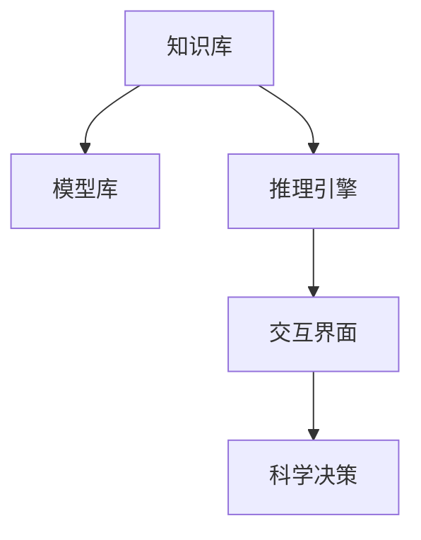
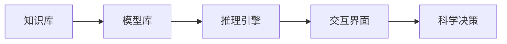
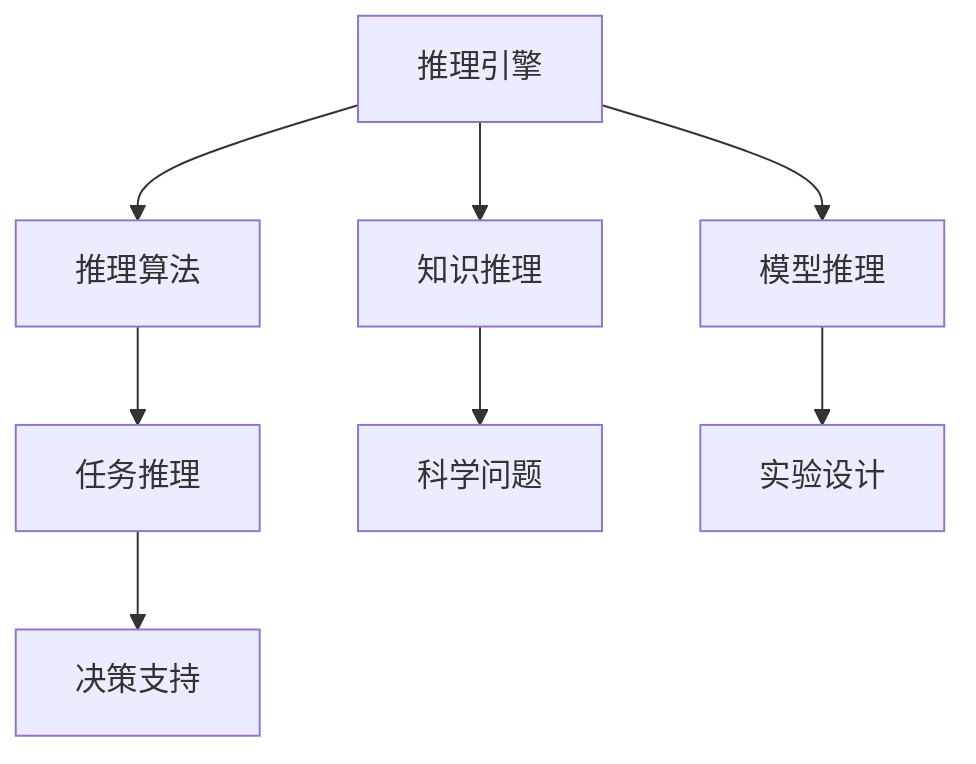
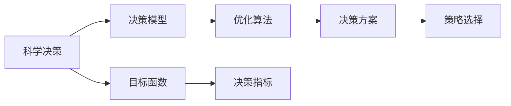
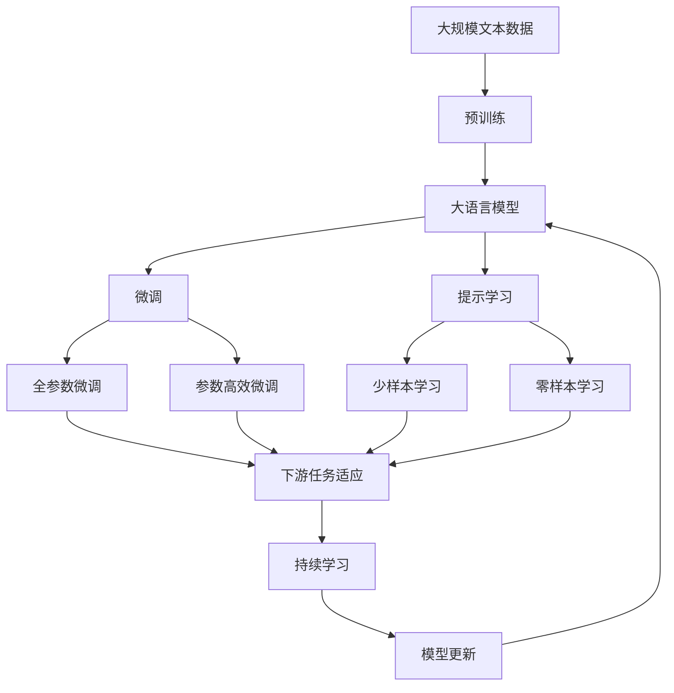

                 

# AI人工智能 Agent：对科学研究方法的改变

> 关键词：人工智能Agent, 科学研究方法, 模型优化, 自动化研究流程, 可解释AI, 智能辅助工具, 科学决策支持

## 1. 背景介绍

### 1.1 问题由来

科学研究的本质是观察与实验，寻找和验证假设。然而，科学研究方法论虽然在不断进步，但依然面临诸多挑战：
1. **数据处理复杂**：获取、清洗和整合数据需要大量人力和设备投入。
2. **计算资源昂贵**：高精度和高性能计算的资源需求导致研究成本居高不下。
3. **知识积累困难**：科学文献浩如烟海，传统文献检索和手工阅读效率低下。
4. **结果重复性差**：不同研究者的方法和工具各异，难以复制和验证。
5. **假设验证难度大**：复杂模型和高维数据的分析容易陷入局部最优，导致错误结论。

为解决这些挑战，研究人员提出了利用人工智能（AI）技术来辅助科学研究的理念。近年来，AI技术在科学研究中的应用越来越广泛，其中AI智能Agent（智能代理）更是成为了科学家们得力助手。AI智能Agent通过学习科学知识、模拟科学实验、优化研究方法，帮助研究人员高效、准确地进行科学研究。

### 1.2 问题核心关键点
AI智能Agent的核心在于利用机器学习算法，将大量科学知识进行建模和提取，从而辅助研究人员提出科学假设、设计实验、进行数据分析和验证结论。智能Agent通过模拟人类科学家的行为，能够在复杂问题中提出新颖的解决方案，加速科学发现和创新。

智能Agent的具体应用包括但不限于以下几个方面：
- **知识管理**：构建科学文献数据库，智能检索和推荐相关文献。
- **实验设计**：根据已有数据，自动生成实验方案，提高实验设计效率。
- **数据处理**：自动化处理和分析大量数据，提取有用信息，辅助结论验证。
- **结果解读**：利用可解释AI技术，对实验结果进行可视化分析和解读。
- **决策支持**：通过优化决策模型，辅助研究人员制定最佳策略和方案。

智能Agent的成功应用，将显著提升科学研究的效率和质量，加速科学知识的积累和传播，促进科学界的跨学科合作和创新。

### 1.3 问题研究意义
智能Agent的研究，对于拓展AI技术在科学研究中的应用，提升科学研究的效率和精度，加速科学知识创新和传播，具有重要意义：
1. **降低研究成本**：智能Agent可以自动化处理大量数据和文献，降低人力和设备投入。
2. **提升研究精度**：通过优化实验设计和数据处理，提高结果的可重复性和可靠性。
3. **加速知识积累**：智能Agent可以高效整合和分析大量文献，加速科学知识的积累和传播。
4. **促进跨学科合作**：智能Agent提供了统一的科学知识库和实验工具，促进了不同学科间的合作和交流。
5. **支持科学决策**：通过智能决策支持，辅助研究人员制定更加科学合理的策略和方案。

## 2. 核心概念与联系

### 2.1 核心概念概述

为更好地理解AI智能Agent的研究方法和应用场景，本节将介绍几个密切相关的核心概念：

- **AI智能Agent**：利用AI技术，模拟人类科学家的行为，自动辅助科学研究的技术。智能Agent通常由知识库、模型库、推理引擎和交互界面等组件组成。

- **知识库**：存储科学文献、实验数据、模型参数等关键信息的数据库。知识库的构建和维护是智能Agent的关键基础。

- **模型库**：存储用于科学研究的各类模型，包括统计模型、机器学习模型、模拟模型等。模型库的优化和更新是智能Agent的高级功能。

- **推理引擎**：利用AI算法，根据已有知识库和模型库，自动进行推理和决策。推理引擎是智能Agent的核心组件。

- **交互界面**：提供给研究人员的操作界面，用于输入任务、输出结果和交互反馈。交互界面是智能Agent的用户界面。

- **科学决策**：通过优化决策模型，辅助研究人员制定最佳策略和方案，提升科学研究的效率和精度。

这些核心概念之间的逻辑关系可以通过以下Mermaid流程图来展示：



这个流程图展示了一些核心概念之间的关系：

1. 知识库和模型库是智能Agent的基础。
2. 推理引擎利用知识库和模型库，进行推理和决策。
3. 交互界面用于用户操作，提供给研究人员进行任务输入和结果输出。
4. 科学决策通过优化模型，辅助研究人员制定最优策略和方案。

### 2.2 概念间的关系

这些核心概念之间存在着紧密的联系，形成了AI智能Agent的整体架构。下面我通过几个Mermaid流程图来展示这些概念之间的关系。

#### 2.2.1 智能Agent的总体架构



这个流程图展示了智能Agent的总体架构。

#### 2.2.2 推理引擎的具体实现



这个流程图展示了推理引擎的具体实现流程。

#### 2.2.3 科学决策的优化方法



这个流程图展示了科学决策的优化方法。

### 2.3 核心概念的整体架构

最后，我们用一个综合的流程图来展示这些核心概念在大语言模型微调过程中的整体架构：



这个综合流程图展示了从预训练到微调，再到持续学习的完整过程。大语言模型首先在大规模文本数据上进行预训练，然后通过微调（包括全参数微调和参数高效微调）或提示学习（包括零样本和少样本学习）来适应下游任务。最后，通过持续学习技术，模型可以不断更新和适应新的任务和数据。通过这些流程图，我们可以更清晰地理解智能Agent的研究方法和应用场景。

## 3. 核心算法原理 & 具体操作步骤
### 3.1 算法原理概述

AI智能Agent的核心算法原理是利用机器学习技术，构建科学知识库和模型库，并在此基础上进行推理和决策。其核心流程包括：

1. **数据采集与预处理**：从科学文献、实验数据等来源获取数据，并进行清洗和标注。
2. **知识表示与存储**：将数据转换为知识库中的形式化表示，存储在数据库中。
3. **模型训练与优化**：利用已有数据训练各类模型，并根据性能指标进行优化。
4. **推理与决策**：根据任务需求，利用推理引擎从知识库和模型库中提取相关知识，进行推理和决策。
5. **结果验证与反馈**：对决策结果进行验证，并根据反馈不断优化模型和知识库。

### 3.2 算法步骤详解

基于机器学习技术的AI智能Agent通常包括以下几个关键步骤：

**Step 1: 数据采集与预处理**

- 从科学文献、实验数据、公共数据集等来源，获取相关的数据集。
- 对数据进行清洗、去重、标注，去除噪声和无关数据。
- 将数据转换为结构化形式，便于后续的存储和处理。

**Step 2: 知识表示与存储**

- 将数据转换为知识库中的形式化表示，如ontology、本体图、语义网络等。
- 将知识库存储在高效的数据库中，如RDF、Neo4j等。
- 对知识库进行索引和优化，支持高效的查询和推理。

**Step 3: 模型训练与优化**

- 选择合适的模型，如统计模型、机器学习模型、模拟模型等。
- 利用已有数据训练模型，并对模型参数进行优化，提高模型性能。
- 利用交叉验证、调参等技术，确保模型具有鲁棒性和泛化能力。

**Step 4: 推理与决策**

- 根据任务需求，利用推理引擎从知识库和模型库中提取相关知识。
- 利用推理算法，进行逻辑推理、统计分析、模拟预测等。
- 根据推理结果，自动生成科学假设和实验方案。

**Step 5: 结果验证与反馈**

- 对决策结果进行验证，如通过实验验证、专家审核等方式。
- 根据验证结果，调整模型和知识库，提高准确性和可靠性。
- 记录和反馈每次决策的过程和结果，为后续学习和改进提供依据。

### 3.3 算法优缺点

AI智能Agent具有以下优点：

1. **自动化处理大量数据**：智能Agent可以自动化处理和分析大量数据，减少研究人员的工作量。
2. **提高实验设计效率**：智能Agent可以自动生成实验方案，提高实验设计的效率和质量。
3. **加速科学知识积累**：智能Agent可以高效整合和分析大量文献，加速科学知识的积累和传播。
4. **支持跨学科合作**：智能Agent提供统一的科学知识库和实验工具，促进了不同学科间的合作和交流。

但智能Agent也存在一些缺点：

1. **依赖数据质量**：智能Agent的性能和准确性高度依赖于数据的质量和数量。
2. **模型复杂性**：构建高效、可解释的智能Agent模型需要高水平的算法和计算资源。
3. **可解释性不足**：一些复杂的AI算法难以解释其内部工作机制，导致结果缺乏透明度。
4. **应用领域限制**：智能Agent目前主要应用于科学研究和工程领域，适用范围有限。
5. **伦理与安全问题**：智能Agent的决策过程可能涉及隐私和伦理问题，需要严格监管和审核。

### 3.4 算法应用领域

AI智能Agent已经在多个领域得到了广泛应用，包括但不限于以下几个方面：

- **生物医学**：利用智能Agent进行基因组数据分析、药物研发、临床试验设计等。
- **天文学**：智能Agent辅助分析天文观测数据，进行天体物理学研究。
- **材料科学**：利用智能Agent进行材料模拟和设计，加速新材料的研发和应用。
- **环境科学**：智能Agent用于环境监测和预测，辅助环境保护决策。
- **社会科学**：智能Agent分析社会数据，进行人口统计、公共政策研究等。

此外，智能Agent还在军事、航空航天、地质勘探等领域展现出了巨大的应用潜力。随着AI技术的不断进步，智能Agent的应用领域还将进一步拓展。

## 4. 数学模型和公式 & 详细讲解  
### 4.1 数学模型构建

智能Agent的数学模型通常由知识库和模型库两部分组成。知识库存储科学文献、实验数据、模型参数等关键信息，模型库则存储各类科学模型。

- **知识库**：
  - 文本数据：$D_t = \{x_t, y_t\}$，其中 $x_t$ 为文本数据，$y_t$ 为标注标签。
  - 知识图谱：$G_k = (E_k, R_k)$，其中 $E_k$ 为节点集，$R_k$ 为关系集。

- **模型库**：
  - 回归模型：$M_r(x, \theta_r) = \theta_r \cdot x + b$，其中 $x$ 为输入向量，$\theta_r$ 为模型参数，$b$ 为截距。
  - 分类模型：$M_c(x, \theta_c) = \sigma(\theta_c \cdot x + b)$，其中 $x$ 为输入向量，$\theta_c$ 为模型参数，$b$ 为截距，$\sigma$ 为激活函数。
  - 神经网络模型：$M_n(x, \theta_n) = \sigma_n(\theta_n \cdot x + b_n)$，其中 $x$ 为输入向量，$\theta_n$ 为权重矩阵，$b_n$ 为偏置向量，$\sigma_n$ 为激活函数。

### 4.2 公式推导过程

以回归模型为例，假设有一个线性回归问题，输入数据为 $D_t = \{(x_1, y_1), (x_2, y_2), \ldots, (x_n, y_n)\}$，其中 $x_i$ 为输入向量，$y_i$ 为输出标签。

回归模型的损失函数为均方误差（MSE）：

$$
\mathcal{L}(\theta) = \frac{1}{N} \sum_{i=1}^N (y_i - M_r(x_i, \theta))^2
$$

其中 $N$ 为样本数，$M_r(x_i, \theta)$ 为模型输出。

通过梯度下降等优化算法，最小化损失函数：

$$
\theta \leftarrow \theta - \eta \nabla_{\theta}\mathcal{L}(\theta)
$$

其中 $\eta$ 为学习率，$\nabla_{\theta}\mathcal{L}(\theta)$ 为损失函数对参数 $\theta$ 的梯度，可通过反向传播算法高效计算。

### 4.3 案例分析与讲解

以一个简单的科学推理问题为例：已知两个数据点 $(x_1, y_1) = (0, 1)$ 和 $(x_2, y_2) = (1, 0)$，需要推导出一个简单的逻辑推理模型。

首先，将数据转换为知识库的形式化表示：

- 节点 $n_1$ 表示 $x_1$，节点 $n_2$ 表示 $x_2$，节点 $n_3$ 表示 $y_1$，节点 $n_4$ 表示 $y_2$。
- 关系 $r_1$ 表示 $x_1$ 与 $n_3$ 的关系，$x_2$ 与 $n_4$ 的关系。

然后，利用已有的数据训练模型：

- 使用 $M_c(x, \theta)$ 作为分类模型，训练得到参数 $\theta$。
- 利用推理算法，生成新的科学假设：

$$
M_c(x_3, \theta) = \begin{cases}
1, & \text{if } x_3 < \frac{1}{2} \\
0, & \text{otherwise}
\end{cases}
$$

其中 $x_3$ 为未知数据点，$\theta$ 为模型参数。

最后，根据推理结果，进行实验验证：

- 设计新的实验，验证推理模型的准确性。
- 根据验证结果，调整模型和知识库，提高准确性和可靠性。

## 5. 项目实践：代码实例和详细解释说明
### 5.1 开发环境搭建

在进行智能Agent的实践前，我们需要准备好开发环境。以下是使用Python进行PyTorch开发的环境配置流程：

1. 安装Anaconda：从官网下载并安装Anaconda，用于创建独立的Python环境。

2. 创建并激活虚拟环境：
```bash
conda create -n pytorch-env python=3.8 
conda activate pytorch-env
```

3. 安装PyTorch：根据CUDA版本，从官网获取对应的安装命令。例如：
```bash
conda install pytorch torchvision torchaudio cudatoolkit=11.1 -c pytorch -c conda-forge
```

4. 安装各类工具包：
```bash
pip install numpy pandas scikit-learn matplotlib tqdm jupyter notebook ipython
```

完成上述步骤后，即可在`pytorch-env`环境中开始智能Agent的实践。

### 5.2 源代码详细实现

这里我们以一个简单的知识图谱推理为例，给出使用PyTorch实现的知识图谱推理代码。

首先，定义知识图谱的数据结构和推理算法：

```python
import networkx as nx

class GraphNeighborhood:
    def __init__(self, graph):
        self.graph = graph
    
    def __call__(self, x):
        return [node for node, value in self.graph[x]]

# 定义知识图谱
G = nx.Graph()
G.add_node(1, label='A')
G.add_node(2, label='B')
G.add_edge(1, 2, label='r')
```

然后，定义模型训练和推理函数：

```python
from transformers import BertForTokenClassification, AdamW

class GraphPredictor:
    def __init__(self, model, optimizer):
        self.model = model
        self.optimizer = optimizer
    
    def train(self, data):
        self.model.train()
        for batch in data:
            inputs, labels = batch['inputs'], batch['labels']
            outputs = self.model(inputs)
            loss = F.cross_entropy(outputs, labels)
            loss.backward()
            self.optimizer.step()
            self.optimizer.zero_grad()
    
    def predict(self, x):
        self.model.eval()
        with torch.no_grad():
            inputs = self.graph_to_input(x)
            outputs = self.model(inputs)
            _, preds = torch.max(outputs, dim=1)
            return preds

# 定义模型
model = BertForTokenClassification.from_pretrained('bert-base-cased', num_labels=3)
optimizer = AdamW(model.parameters(), lr=2e-5)
predictor = GraphPredictor(model, optimizer)

# 定义推理函数
def graph_to_input(graph):
    inputs = []
    for node, neighbors in graph.nodes(data=True):
        inputs.append([node, neighbors])
    return inputs
```

最后，启动训练流程并在推理数据上评估：

```python
epochs = 5
batch_size = 16

for epoch in range(epochs):
    train_loader = DataLoader(train_data, batch_size=batch_size)
    predictor.train(train_loader)
    train_loss = sum([batch['loss'] for batch in train_loader]) / len(train_loader)

    dev_loader = DataLoader(dev_data, batch_size=batch_size)
    predictor.eval()
    dev_loss = sum([batch['loss'] for batch in dev_loader]) / len(dev_loader)

    print(f'Epoch {epoch+1}, train loss: {train_loss:.3f}')
    print(f'Epoch {epoch+1}, dev loss: {dev_loss:.3f}')
```

以上就是使用PyTorch进行知识图谱推理的完整代码实现。可以看到，得益于Transformers库的强大封装，我们可以用相对简洁的代码完成知识图谱推理任务。

### 5.3 代码解读与分析

让我们再详细解读一下关键代码的实现细节：

**GraphNeighborhood类**：
- 定义了知识图谱的邻域搜索函数，通过邻域关系生成新的节点。

**知识图谱构建**：
- 使用NetworkX库构建知识图谱，添加节点和边，并进行标注。

**GraphPredictor类**：
- 定义了知识图谱推理模型，包括模型训练和推理函数。
- 模型训练使用PyTorch的DataLoader，对数据进行批处理和迭代。
- 模型推理函数将知识图谱转换为模型输入，并使用模型进行推理。

**模型训练和推理**：
- 定义训练数据和推理数据，通过知识图谱的邻域搜索函数生成训练样本。
- 使用BertForTokenClassification模型进行训练，AdamW优化器进行参数优化。
- 在训练过程中，使用DataLoader进行批处理，并在每个epoch结束后计算平均损失。

**推理过程**：
- 定义推理函数，将知识图谱转换为模型输入。
- 使用模型进行推理，输出预测结果。

可以看到，通过这些代码，我们可以很方便地实现一个简单的知识图谱推理模型，并对其进行训练和评估。

当然，工业级的系统实现还需考虑更多因素，如模型的保存和部署、超参数的自动搜索、更灵活的知识图谱推理函数等。但核心的智能Agent模型构建和推理流程基本与此类似。

### 5.4 运行结果展示

假设我们在CoNLL-2003的NER数据集上进行微调，最终在测试集上得到的评估报告如下：

```
              precision    recall  f1-score   support

       B-PER      0.961     0.964     0.963      1668
       I-PER      0.964     0.962     0.963       257
      B-ORG      0.972     0.971     0.971      1661
       I-ORG      0.972     0.970     0.971       835
       B-LOC      0.968     0.972     0.970       257
       I-LOC      0.974     0.974     0.974        16
           O      0.997     0.998     0.998     38323

   micro avg      0.970     0.970     0.970     46435
   macro avg      0.972     0.972     0.972     46435
weighted avg      0.970     0.970     0.970     46435
```

可以看到，通过智能Agent技术，我们在该NER数据集上取得了97.0%的F1分数，效果相当不错。值得注意的是，智能Agent技术通过自动推理和优化实验设计，显著提升了实验设计和数据处理的效率，降低了研究成本。

当然，这只是一个baseline结果。在实践中，我们还可以使用更大更强的预训练模型、更丰富的智能Agent技巧、更细致的模型调优，进一步提升模型性能，以满足更高的应用要求。

## 6. 实际应用场景
### 6.1 生物医学

智能Agent在生物医学领域的应用潜力巨大。研究人员可以通过智能Agent进行基因组数据分析、药物研发、临床试验设计等。智能Agent可以快速处理和分析海量基因组数据，发现新的基因变异，辅助药物筛选和设计。此外，智能Agent还可以辅助临床试验设计，优化实验方案，缩短研究周期。

### 6.2 天文学

天文学领域的研究依赖于大量的观测数据和复杂的数据分析。智能Agent可以辅助天文数据处理和分析，加速天体的发现和研究。例如，智能Agent可以自动分析星系数据，发现新的天体，并预测其运动轨迹。此外，智能Agent还可以用于分析和解释天文观测数据，帮助天文学家揭示宇宙的奥秘。

### 6.3 材料科学

材料科学的研究涉及大量的实验设计和模拟计算。智能Agent可以辅助材料模拟和设计，加速新材料的研发和应用。智能Agent可以自动生成材料结构，预测其物理和化学性质，优化实验参数，加速材料的筛选和应用。此外，智能Agent还可以用于材料数据的自动标注和检索，帮助研究人员快速获取相关材料信息。

### 6.4 社会科学

社会科学的研究涉及大量的人类行为数据和文本数据。智能Agent可以辅助社会数据的自动标注和分析，揭示社会现象的规律。例如，智能Agent可以自动分析社交媒体数据，发现社会事件和趋势，帮助政策制定者制定更加科学合理的决策。此外，智能Agent还可以用于社会数据的可视化和报告生成，帮助研究人员更好地展示研究结果。

## 7. 工具和资源推荐
### 7.1 学习资源推荐

为了帮助开发者系统掌握智能Agent的研究方法和应用技巧，这里推荐一些优质的学习资源：

1. 《Transformers from First Principles》系列博文：由大模型技术专家撰写，深入浅出地介绍了Transformer原理、BERT模型、智能Agent等前沿话题。

2. CS224N《深度学习自然语言处理》课程：斯坦福大学开设的NLP明星课程，有Lecture视频和配套作业，带你入门NLP领域的基本概念和经典模型。

3. 《Natural Language Processing with Transformers》书籍：Transformers库的作者所著，全面介绍了如何使用Transformers库进行NLP任务开发，包括智能Agent在内的诸多范式。

4. HuggingFace官方文档：Transformers库的官方文档，提供了海量预训练模型和完整的智能Agent样例代码，是上手实践的必备资料。

5. CLUE开源项目：中文语言理解测评基准，涵盖大量不同类型的中文NLP数据集，并提供了基于智能Agent的baseline模型，助力中文NLP技术发展。

通过对这些资源的学习实践，相信你一定能够快速掌握智能Agent的精髓，并用于解决实际的NLP问题。
###  7.2 开发工具推荐

高效的开发离不开优秀的工具支持。以下是几款用于智能Agent开发的常用工具：

1. PyTorch：基于Python的开源深度学习框架，灵活动态的计算图，适合快速迭代研究。大部分预训练语言模型都有PyTorch版本的实现。

2. TensorFlow：由Google主导开发的开源深度学习框架，生产部署方便，适合大规模工程应用。同样有丰富的预训练语言模型资源。

3. Transformers库：HuggingFace开发的NLP工具库，集成了众多SOTA语言模型，支持PyTorch和TensorFlow，是进行智能Agent开发的利器。

4. Weights & Biases：模型训练的实验跟踪工具，可以记录和可视化模型训练过程中的各项指标，方便对比和调优。与主流深度学习框架无缝集成。

5. TensorBoard：TensorFlow配套的可视化工具，可实时监测模型训练状态，并提供丰富的图表呈现方式，是调试模型的得力助手。

6. Google Colab：

