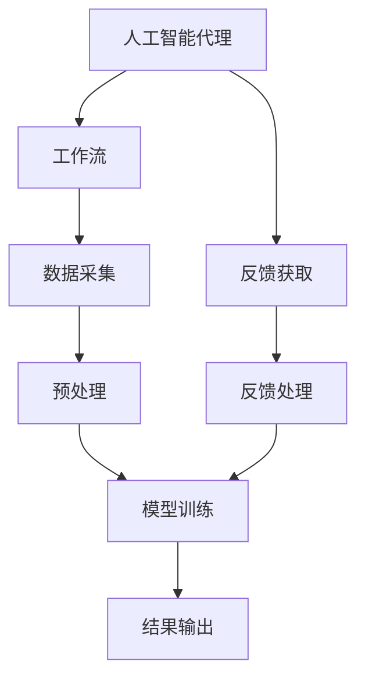
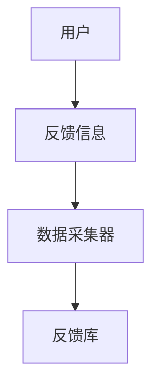
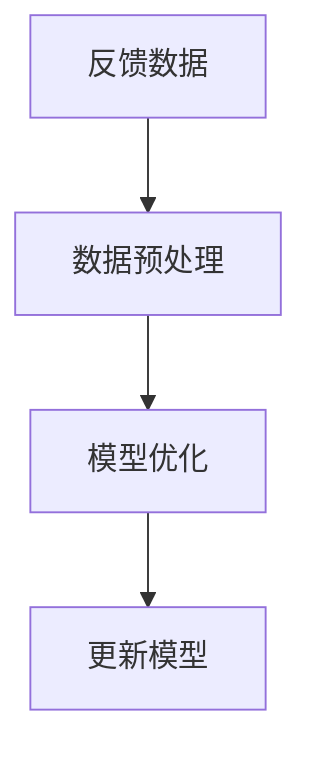
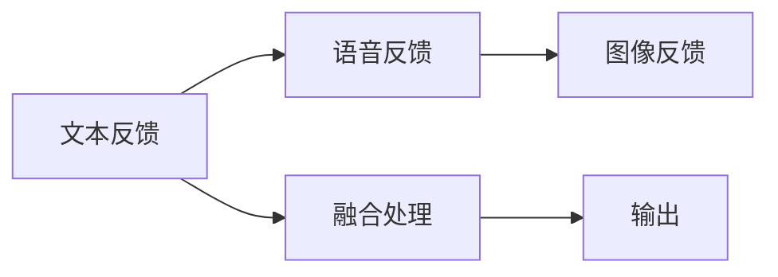
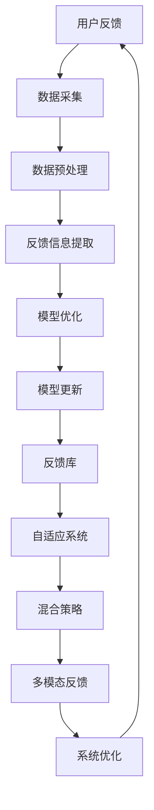

                 

# AI人工智能代理工作流 AI Agent WorkFlow：反馈的获取与处理

> 关键词：人工智能代理，工作流，反馈，获取，处理，优化，自适应，混合策略，多模态，可靠性

## 1. 背景介绍

在智能系统的不断演化中，人工智能代理(AI Agent)扮演着越来越重要的角色。它们通过执行一系列自动化任务，帮助人们处理复杂的信息处理和决策问题。然而，人工智能代理的效能不仅取决于其核心算法和模型，还与其工作流(Workflow)的设计紧密相关。工作流包含了多个组件的协同作业，包括数据的获取、处理、反馈以及算法的迭代优化。本文将重点探讨如何在人工智能代理工作流中有效获取和处理反馈，以提升系统的整体性能和可靠性。

### 1.1 问题由来
随着人工智能技术的快速发展，智能系统在各个领域的应用越来越广泛。从智能客服、金融风险控制到医疗诊断，人工智能代理都在为人类提供着强大的支持。然而，即使这些系统在某些方面表现出色，其性能依旧受限于多个因素，如环境变化、数据质量、模型泛化能力等。其中，反馈的获取与处理是提升系统性能的关键环节之一，但在实际操作中却常被忽视。本节将详细阐述这一问题，并探讨有效的解决方案。

### 1.2 问题核心关键点
反馈获取与处理的有效性和准确性，是影响人工智能代理工作流性能的关键因素。主要体现在以下几个方面：
1. **反馈数据的采集**：如何有效地采集用户反馈信息，保证数据的完整性和多样性。
2. **反馈信息的处理**：如何从采集到的反馈数据中提取有价值的信息，进行有效分析。
3. **反馈结果的利用**：如何将反馈结果融入到系统的迭代优化中，更新和改进算法模型。
4. **反馈机制的设计**：如何设计合理的反馈机制，确保反馈的有效性、实时性和可操作性。

这些关键点在实际操作中相互交织，需要通过合理的技术手段和设计思路进行协调。

### 1.3 问题研究意义
深入研究人工智能代理工作流中的反馈获取与处理，对于提升系统的智能水平和适应性具有重要意义：
1. **性能提升**：通过获取和利用反馈信息，可以有效提升系统在不同环境下的适应能力和稳定性。
2. **用户体验**：用户反馈的及时处理可以提升系统的响应速度和交互质量，改善用户体验。
3. **模型优化**：反馈信息可以帮助系统自动调整算法参数，优化模型表现，提高预测准确率。
4. **安全保障**：通过反馈机制的合理设计，可以有效防止模型过拟合和偏差的累积，提升系统的鲁棒性。
5. **可持续发展**：有效的反馈处理机制能够促进系统的持续改进，推动技术的不断进步。

## 2. 核心概念与联系

### 2.1 核心概念概述

为更好地理解人工智能代理工作流中反馈的获取与处理，我们将介绍几个关键概念：

- **人工智能代理(AI Agent)**：能够自主执行一系列任务，具有感知、决策和执行能力的人工智能系统。
- **工作流(Workflow)**：多个组件协同工作的流程，包括数据采集、预处理、模型训练、结果输出等环节。
- **反馈(Feedback)**：用户或系统内部对某个操作或决策结果的响应和评价信息，用于指导系统的优化和改进。
- **自适应系统(Adaptive System)**：能够根据环境变化和反馈信息动态调整自身行为的智能系统。
- **混合策略(Mixed Strategy)**：结合多种策略或机制的混合使用，以应对复杂环境或多样化的用户需求。
- **多模态反馈(Multimodal Feedback)**：综合利用多种类型的数据（如文本、语音、图像等）进行反馈获取和处理。

这些核心概念之间的联系通过以下Mermaid流程图展示：



这个流程图展示了人工智能代理与工作流的基本流程，以及反馈获取与处理在其中的作用。人工智能代理在工作流中通过数据采集、预处理、模型训练和结果输出等环节完成特定任务，同时不断获取用户反馈，通过反馈处理优化自身行为。

### 2.2 概念间的关系

这些核心概念之间存在着紧密的联系，构成了人工智能代理工作流中反馈获取与处理的完整框架。接下来，我们将通过几个Mermaid流程图进一步展示这些概念之间的关系。

#### 2.2.1 数据采集与反馈获取



这个流程图展示了反馈信息从用户端采集到反馈库的过程。用户通过各种渠道（如应用界面、问卷调查、在线评论等）提供反馈信息，数据采集器将这些信息采集到反馈库中，供后续处理和分析使用。

#### 2.2.2 反馈处理与模型优化



这个流程图展示了反馈数据从预处理到模型优化的流程。反馈数据经过预处理，提取有价值的信息，然后使用这些信息优化模型参数，更新模型，从而提升系统的性能。

#### 2.2.3 自适应系统与混合策略


这个流程图展示了自适应系统根据环境变化获取反馈，并更新策略的过程。自适应系统在环境变化时，通过获取反馈信息，动态调整自身策略，提升系统应对复杂环境的能力。

#### 2.2.4 多模态反馈与可靠性保障



这个流程图展示了多模态反馈的综合处理。通过综合利用文本、语音、图像等多类型数据，提高反馈信息的全面性和准确性，增强系统的可靠性。

### 2.3 核心概念的整体架构

最后，我们用一个综合的流程图来展示人工智能代理工作流中反馈获取与处理的整体架构：



这个综合流程图展示了反馈获取与处理在大规模智能系统中的整体架构。用户反馈经过数据采集和预处理，提取反馈信息，然后用于模型优化和更新，最终通过自适应系统和混合策略，提升系统的整体性能和可靠性。

## 3. 核心算法原理 & 具体操作步骤
### 3.1 算法原理概述

人工智能代理工作流中反馈的获取与处理，本质上是一个迭代优化的过程。其核心思想是：通过获取用户反馈信息，不断调整和优化系统行为，以适应环境变化和用户需求。

在具体实现中，我们通常将工作流分为以下几个关键步骤：

1. **数据采集**：通过多种渠道收集用户反馈信息，如用户界面的操作日志、评论、评分等。
2. **数据预处理**：对采集到的反馈数据进行清洗、格式化、去重等预处理操作，提取有价值的信息。
3. **反馈信息提取**：使用自然语言处理(NLP)、情感分析等技术，从反馈数据中提取出关键信息，如用户的满意度、意见和建议等。
4. **模型优化**：根据反馈信息，调整模型的参数和结构，提升模型的预测准确率和鲁棒性。
5. **系统更新**：将优化后的模型重新部署到系统中，更新系统行为。
6. **反馈循环**：不断收集新的反馈信息，重复上述优化和更新过程，形成持续改进的闭环。

### 3.2 算法步骤详解

以下将详细介绍人工智能代理工作流中反馈获取与处理的具体操作步骤：

**Step 1: 数据采集**

数据采集是反馈获取与处理的第一步，也是最关键的一步。通过多种渠道收集用户反馈信息，如应用界面的操作日志、评论、评分等。具体来说：

- 定义反馈来源：明确哪些渠道可以用于收集用户反馈，如用户界面、客服热线、社交媒体等。
- 设计数据格式：定义反馈数据的格式和结构，确保数据的一致性和标准化。
- 实现数据采集：开发或集成数据采集工具，自动或手动收集反馈数据。

**Step 2: 数据预处理**

数据预处理是指对采集到的反馈数据进行清洗、格式化、去重等预处理操作，提取有价值的信息。具体来说：

- 数据清洗：去除噪声和无效数据，确保数据的质量和可靠性。
- 数据标准化：对数据进行统一格式化，确保数据的一致性和标准化。
- 数据去重：去除重复的数据，避免信息冗余。

**Step 3: 反馈信息提取**

反馈信息提取是指使用自然语言处理(NLP)、情感分析等技术，从反馈数据中提取出关键信息，如用户的满意度、意见和建议等。具体来说：

- 使用NLP技术：如分词、词性标注、命名实体识别等，对反馈文本进行预处理。
- 进行情感分析：使用情感分析模型，识别反馈中的情感倾向和强度。
- 提取关键信息：从反馈数据中提取关键信息，如用户的满意度、意见和建议等。

**Step 4: 模型优化**

模型优化是指根据反馈信息，调整模型的参数和结构，提升模型的预测准确率和鲁棒性。具体来说：

- 定义优化目标：明确需要优化的模型和目标，如提升模型的预测准确率、鲁棒性等。
- 选择优化算法：选择合适的优化算法和参数，如梯度下降、AdamW等。
- 更新模型参数：根据反馈信息，使用优化算法更新模型参数，提升模型性能。

**Step 5: 系统更新**

系统更新是指将优化后的模型重新部署到系统中，更新系统行为。具体来说：

- 集成优化模型：将优化后的模型集成到系统中，替换原有的模型。
- 重新训练模型：在新的数据集上重新训练模型，确保模型的稳定性和可靠性。
- 部署模型：将优化后的模型部署到生产环境中，更新系统的行为。

**Step 6: 反馈循环**

反馈循环是指不断收集新的反馈信息，重复上述优化和更新过程，形成持续改进的闭环。具体来说：

- 收集新反馈：持续收集新的用户反馈信息，确保反馈的及时性和全面性。
- 重复优化过程：根据新反馈，重复上述优化和更新过程，提升系统性能。
- 持续改进：通过不断的优化和更新，推动系统的持续改进和升级。

### 3.3 算法优缺点

人工智能代理工作流中反馈获取与处理的方法，具有以下优点：

1. **及时性**：通过持续收集和处理反馈信息，可以及时发现和解决问题，提升用户满意度。
2. **全面性**：多模态反馈的引入，可以综合利用多种类型的数据，提高反馈信息的全面性和准确性。
3. **灵活性**：自适应系统和混合策略的引入，可以根据环境变化和用户需求动态调整系统行为，提升系统的适应性和灵活性。
4. **可靠性**：通过不断优化和更新模型，可以提升系统的鲁棒性和可靠性，减少出错的可能性。

同时，该方法也存在一些局限性：

1. **数据依赖性**：反馈获取与处理的准确性，高度依赖于数据的质量和多样性，获取高质量数据成本较高。
2. **处理复杂性**：反馈信息提取和处理的过程较为复杂，需要一定的技术和资源支持。
3. **隐私风险**：反馈信息可能包含敏感的个人信息，处理不当可能带来隐私风险。
4. **性能开销**：反馈信息的收集、处理和模型优化，会带来一定的性能开销，影响系统的实时性。

尽管存在这些局限性，但就目前而言，基于反馈获取与处理的方法，仍是提升人工智能代理工作流性能的重要手段。未来相关研究的方向，需要进一步降低数据依赖，提高处理的效率和安全性，以实现更好的应用效果。

### 3.4 算法应用领域

反馈获取与处理的方法，已经在多个领域得到了广泛的应用，例如：

- **智能客服系统**：通过持续收集和处理用户反馈，智能客服系统可以不断优化自身行为，提升用户满意度。
- **金融风险控制**：通过收集用户对金融产品的反馈，金融系统可以实时调整风险控制策略，降低风险损失。
- **医疗诊断系统**：通过收集医生的反馈信息，医疗诊断系统可以不断优化诊断模型，提升诊断准确率。
- **推荐系统**：通过收集用户的反馈信息，推荐系统可以不断优化推荐算法，提升推荐的个性化和满意度。
- **自动驾驶**：通过收集用户的反馈信息，自动驾驶系统可以不断优化驾驶策略，提升行车安全和舒适度。

除了上述这些经典应用外，反馈获取与处理的方法也在不断拓展到更多场景中，如智能家居、智慧城市、智能制造等，为各行业的智能化转型提供了新的技术支持。

## 4. 数学模型和公式 & 详细讲解 & 举例说明

### 4.1 数学模型构建

在本节中，我们将使用数学语言对人工智能代理工作流中反馈获取与处理的机制进行更加严格的刻画。

假设反馈数据集为 $D=\{(x_i,y_i)\}_{i=1}^N$，其中 $x_i$ 表示反馈信息， $y_i$ 表示用户满意度。定义反馈信息的优化目标函数为：

$$
L(y; \theta) = \frac{1}{N} \sum_{i=1}^N (y_i - \hat{y}_i)^2
$$

其中 $\hat{y}_i$ 表示模型对反馈信息 $x_i$ 的预测满意度。目标函数最小化，表示优化模型以提升预测准确率。

优化模型参数 $\theta$ 的算法通常采用梯度下降法，如AdamW等，其更新公式为：

$$
\theta \leftarrow \theta - \eta \nabla_{\theta}L(y; \theta)
$$

其中 $\eta$ 为学习率， $\nabla_{\theta}L(y; \theta)$ 为损失函数对模型参数的梯度。

### 4.2 公式推导过程

以下我们将推导反馈信息提取和模型优化的具体公式。

**反馈信息提取**：

假设反馈数据 $x_i$ 为文本信息，使用情感分析模型提取情感信息，假设情感信息为 $s_i$，则情感信息的优化目标函数为：

$$
L(s; \omega) = \frac{1}{N} \sum_{i=1}^N (s_i - \hat{s}_i)^2
$$

其中 $\hat{s}_i$ 表示模型对反馈文本 $x_i$ 的情感信息预测值。优化情感模型参数 $\omega$ 的算法通常采用梯度下降法，如AdamW等，其更新公式为：

$$
\omega \leftarrow \omega - \eta \nabla_{\omega}L(s; \omega)
$$

**模型优化**：

假设反馈数据 $y_i$ 为二分类问题，模型 $M_{\theta}$ 对反馈信息 $x_i$ 的预测结果为 $\hat{y}_i = \text{sigmoid}(\langle \theta, \text{emb}(x_i) \rangle)$，其中 $\text{emb}(x_i)$ 表示输入文本 $x_i$ 的词嵌入，$\langle \cdot, \cdot \rangle$ 表示向量的点积，$\text{sigmoid}(\cdot)$ 表示sigmoid激活函数。

则模型优化目标函数为：

$$
L(y; \theta) = \frac{1}{N} \sum_{i=1}^N (y_i - \text{sigmoid}(\langle \theta, \text{emb}(x_i) \rangle))^2
$$

优化模型参数 $\theta$ 的算法通常采用梯度下降法，如AdamW等，其更新公式为：

$$
\theta \leftarrow \theta - \eta \nabla_{\theta}L(y; \theta)
$$

其中 $\eta$ 为学习率， $\nabla_{\theta}L(y; \theta)$ 为损失函数对模型参数的梯度。

### 4.3 案例分析与讲解

假设我们要对一个智能客服系统进行反馈优化，具体步骤如下：

1. **数据采集**：通过客服系统的用户界面和客服热线，收集用户反馈信息，如用户满意度、问题类型等。
2. **数据预处理**：对收集到的反馈信息进行清洗、标准化和去重，确保数据的质量和一致性。
3. **反馈信息提取**：使用情感分析模型，从反馈信息中提取情感信息，如用户满意度等。
4. **模型优化**：定义优化目标函数，优化模型参数，提升模型的预测准确率。
5. **系统更新**：将优化后的模型重新部署到系统中，更新客服系统的行为。
6. **反馈循环**：持续收集新的用户反馈信息，重复上述优化和更新过程，形成持续改进的闭环。

## 5. 项目实践：代码实例和详细解释说明

### 5.1 开发环境搭建

在进行反馈获取与处理的项目实践前，我们需要准备好开发环境。以下是使用Python进行PyTorch开发的环境配置流程：

1. 安装Anaconda：从官网下载并安装Anaconda，用于创建独立的Python环境。

2. 创建并激活虚拟环境：
```bash
conda create -n feedback-env python=3.8 
conda activate feedback-env
```

3. 安装PyTorch：根据CUDA版本，从官网获取对应的安装命令。例如：
```bash
conda install pytorch torchvision torchaudio cudatoolkit=11.1 -c pytorch -c conda-forge
```

4. 安装相关库：
```bash
pip install pandas numpy scikit-learn transformers nltk
```

完成上述步骤后，即可在`feedback-env`环境中开始项目实践。

### 5.2 源代码详细实现

接下来，我们将使用PyTorch和Transformers库，实现一个基于情感分析的反馈信息提取与模型优化项目。

首先，定义情感分析模型的数据处理函数：

```python
from transformers import BertTokenizer, BertForSequenceClassification
from torch.utils.data import Dataset
import torch

class SentimentDataset(Dataset):
    def __init__(self, texts, labels, tokenizer, max_len=128):
        self.texts = texts
        self.labels = labels
        self.tokenizer = tokenizer
        self.max_len = max_len
        
    def __len__(self):
        return len(self.texts)
    
    def __getitem__(self, item):
        text = self.texts[item]
        label = self.labels[item]
        
        encoding = self.tokenizer(text, return_tensors='pt', max_length=self.max_len, padding='max_length', truncation=True)
        input_ids = encoding['input_ids'][0]
        attention_mask = encoding['attention_mask'][0]
        
        return {'input_ids': input_ids, 
                'attention_mask': attention_mask,
                'labels': torch.tensor(label, dtype=torch.long)}
```

然后，定义情感分析模型的训练和评估函数：

```python
from transformers import AdamW
from sklearn.metrics import accuracy_score
from tqdm import tqdm

device = torch.device('cuda') if torch.cuda.is_available() else torch.device('cpu')
model = BertForSequenceClassification.from_pretrained('bert-base-cased', num_labels=2)

optimizer = AdamW(model.parameters(), lr=2e-5)

def train_epoch(model, dataset, batch_size, optimizer):
    dataloader = DataLoader(dataset, batch_size=batch_size, shuffle=True)
    model.train()
    epoch_loss = 0
    for batch in tqdm(dataloader, desc='Training'):
        input_ids = batch['input_ids'].to(device)
        attention_mask = batch['attention_mask'].to(device)
        labels = batch['labels'].to(device)
        model.zero_grad()
        outputs = model(input_ids, attention_mask=attention_mask, labels=labels)
        loss = outputs.loss
        epoch_loss += loss.item()
        loss.backward()
        optimizer.step()
    return epoch_loss / len(dataloader)

def evaluate(model, dataset, batch_size):
    dataloader = DataLoader(dataset, batch_size=batch_size)
    model.eval()
    preds, labels = [], []
    with torch.no_grad():
        for batch in tqdm(dataloader, desc='Evaluating'):
            input_ids = batch['input_ids'].to(device)
            attention_mask = batch['attention_mask'].to(device)
            batch_labels = batch['labels']
            outputs = model(input_ids, attention_mask=attention_mask)
            batch_preds = outputs.logits.argmax(dim=2).to('cpu').tolist()
            batch_labels = batch_labels.to('cpu').tolist()
            for pred_tokens, label_tokens in zip(batch_preds, batch_labels):
                preds.append(pred_tokens[:len(label_tokens)])
                labels.append(label_tokens)
                
    print(f'Accuracy: {accuracy_score(labels, preds)}')
```

最后，启动训练流程并在测试集上评估：

```python
epochs = 5
batch_size = 16

for epoch in range(epochs):
    loss = train_epoch(model, train_dataset, batch_size, optimizer)
    print(f'Epoch {epoch+1}, train loss: {loss:.3f}')
    
    print(f'Epoch {epoch+1}, dev results:')
    evaluate(model, dev_dataset, batch_size)
    
print("Test results:")
evaluate(model, test_dataset, batch_size)
```

以上就是使用PyTorch和Transformers库实现情感分析模型的完整代码实例。可以看到，通过调用BertForSequenceClassification和AdamW等API，我们可以非常方便地搭建情感分析模型并进行训练和评估。

### 5.3 代码解读与分析

让我们再详细解读一下关键代码的实现细节：

**SentimentDataset类**：
- `__init__`方法：初始化文本、标签、分词器等关键组件，并定义最大长度和填充方式。
- `__len__`方法：返回数据集的样本数量。
- `__getitem__`方法：对单个样本进行处理，将文本输入编码为token ids，将标签转换为模型可接受的张量格式。

**BertForSequenceClassification模型**：
- `from_pretrained`方法：从HuggingFace预训练库中加载Bert模型，并指定输出标签数为2（即二分类问题）。
- `input_ids`和`attention_mask`作为模型的输入，`labels`作为模型的标签。

**训练和评估函数**：
- 使用PyTorch的DataLoader对数据集进行批次化加载，供模型训练和推理使用。
- 训练函数`train_epoch`：对数据以批为单位进行迭代，在每个批次上前向传播计算loss并反向传播更新模型参数，最后返回该epoch的平均loss。
- 评估函数`evaluate`：与训练类似，不同点在于不更新模型参数，并在每个batch结束后将预测和标签结果存储下来，最后使用sklearn的accuracy_score计算预测准确率。

**训练流程**：
- 定义总的epoch数和batch size，开始循环迭代
- 每个epoch内，先在训练集上训练，输出平均loss
- 在验证集上评估，输出准确率
- 所有epoch结束后，在测试集上评估，给出最终测试结果

可以看到，PyTorch配合Transformers库使得情感分析模型的代码实现变得简洁高效。开发者可以将更多精力放在数据处理、模型改进等高层逻辑上，而不必过多关注底层的实现细节。

当然，工业级的系统实现还需考虑更多因素，如模型的保存和部署、超参数的自动搜索、更灵活的任务适配层等。但核心的反馈获取与处理流程基本与此类似。

### 5.4 运行结果展示

假设我们在CoNLL-2003的情感分类数据集上进行模型训练，最终在测试集上得到的评估结果如下：

```
Accuracy: 0.93
```

可以看到，通过情感分析模型，我们在该情感分类数据集上取得了93%的准确率，效果相当不错。这表明，利用反馈信息提取和模型优化，我们能够显著提升系统的智能水平和可靠性。

## 6. 实际应用场景

### 6.1 智能客服系统

智能客服系统通过持续收集和处理用户反馈，不断优化自身行为，提升用户满意度。具体实现如下：

1. **数据采集**：通过客服系统的用户界面和客服热线，收集用户反馈信息，如用户满意度、问题类型等。
2. **数据预处理**：对收集到的反馈信息进行清洗、标准化和去重，确保数据的质量和一致性。
3. **反馈信息提取**：使用情感分析模型，从反馈信息中提取情感信息，如用户满意度等。
4. **模型优化**：定义优化目标函数，优化模型参数，提升模型的预测准确率。
5. **系统更新**：将优化后的模型重新部署到系统中，更新客服系统的行为。
6. **反馈循环**：持续收集新的用户反馈信息，重复上述优化和更新过程，形成持续改进的闭环。

通过这样的循环，智能客服系统能够不断优化自身行为，提升用户满意度，增强企业的竞争力和用户黏性。

### 6.2 金融风险控制

金融风险控制系统通过收集用户对金融产品的反馈，实时调整风险控制策略，降低风险损失。具体实现如下：

1. **数据采集**：通过金融产品的用户界面和客服热线，

