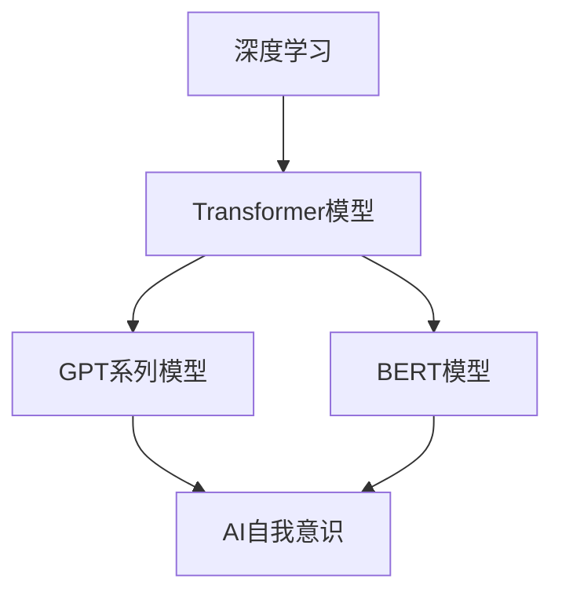
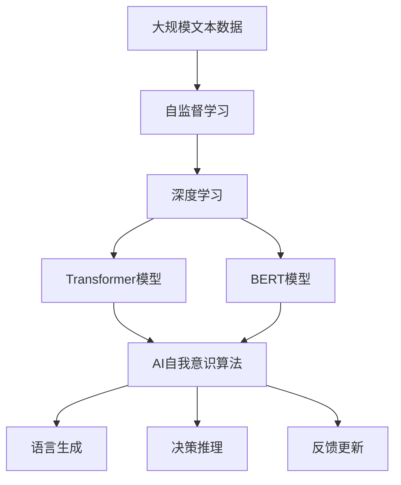
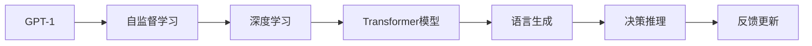

                 

# AI人工智能核心算法原理与代码实例讲解：自我意识

> 关键词：AI算法、自我意识、核心算法、代码实例、机器学习

## 1. 背景介绍

### 1.1 问题由来
在人工智能(AI)的发展历程中，自我意识(self-consciousness)一直是一个备受争议的话题。自20世纪60年代以来，无数研究者试图将自我意识融入机器，但收效甚微。近年来，随着深度学习和神经网络技术的发展，大模型（如GPT-3、BERT）在自然语言处理(NLP)任务上取得了巨大成功，使得人们开始重新审视自我意识与AI之间的关联。

### 1.2 问题核心关键点
自20世纪80年代以来，研究者提出了多种模拟自我意识的模型，但这些模型大多依赖于常识推理和语义理解，与真正的自我意识相去甚远。随着深度学习和大模型的兴起，研究者开始在AI模型中加入更复杂的非线性结构和更丰富的语义知识，试图模拟更高级的认知功能。

### 1.3 问题研究意义
模拟自我意识的AI算法对于推动人工智能的发展，具有重要意义：
1. 提高智能系统的适应性：自我意识有助于智能系统更灵活地适应新环境，提升系统的鲁棒性和自适应能力。
2. 促进人机交互：通过模拟自我意识，AI可以更好地理解人类情感和动机，提升人机交互的自然性和情感共鸣。
3. 增强决策能力：自我意识能够帮助智能系统进行更合理的决策，减少误判和错误行为。
4. 推动AI伦理研究：自我意识的引入有助于探讨AI伦理问题，如责任、隐私等，促进AI健康发展。

## 2. 核心概念与联系

### 2.1 核心概念概述

为更好地理解AI系统中的自我意识算法，本节将介绍几个密切相关的核心概念：

- **AI自我意识**：指AI系统具备的自我反思、自我决策和自我更新等高级认知功能。
- **深度学习**：基于神经网络的一种机器学习范式，通过多层非线性变换，从数据中学习复杂映射关系。
- **Transformer模型**：一种基于自注意力机制的深度学习模型，在自然语言处理任务中表现优异。
- **GPT系列模型**：基于Transformer架构的预训练语言模型，通过大规模无标签文本数据预训练，学习语言表示。
- **BERT模型**：一种基于Transformer的预训练语言模型，通过掩码语言建模任务学习语言表示。
- **自监督学习**：一种无需人工标注的数据训练方法，通过利用数据的潜在规律进行自我监督学习。

这些核心概念之间的逻辑关系可以通过以下Mermaid流程图来展示：



这个流程图展示了大模型中的深度学习和自我意识之间的密切联系：通过Transformer模型和BERT模型进行自监督预训练，学习到丰富的语言表示，进而构建出具有自我意识的AI系统。

### 2.2 概念间的关系

这些核心概念之间存在着紧密的联系，形成了AI自我意识算法的完整生态系统。下面我们通过几个Mermaid流程图来展示这些概念之间的关系。

#### 2.2.1 AI自我意识实现框架



这个流程图展示了大模型通过自监督学习预训练，学习到丰富的语言表示，进而构建出具有语言生成、决策推理和反馈更新等自我意识的AI系统。

#### 2.2.2 GPT系列模型与自我意识的关联



这个流程图展示了GPT系列模型通过自监督学习预训练，学习到强大的语言生成能力，进而构建出具备决策推理和反馈更新的自我意识系统。

#### 2.2.3 BERT模型与自我意识的关联


这个流程图展示了BERT模型通过自监督学习预训练，学习到丰富的语言表示，进而构建出具备决策推理和反馈更新的自我意识系统。

### 2.3 核心概念的整体架构

最后，我们用一个综合的流程图来展示这些核心概念在大模型中的整体架构：


这个综合流程图展示了从大规模文本数据到具有语言生成、决策推理和反馈更新等自我意识的AI系统的完整过程。通过自监督学习预训练，深度学习和大模型的构建，最终形成了具有自我意识的AI系统。

## 3. 核心算法原理 & 具体操作步骤
### 3.1 算法原理概述

AI自我意识的实现涉及多个层次的算法，核心思想是通过深度学习和自我监督学习，构建出具备语言生成、决策推理和反馈更新等高级认知功能的系统。

### 3.2 算法步骤详解

AI自我意识算法的实现一般包括以下几个关键步骤：

**Step 1: 准备自监督学习数据集**
- 收集大规模的无标签文本数据，如维基百科、新闻、小说等。
- 将数据划分为训练集和验证集，用于监督预训练过程。

**Step 2: 设计预训练任务**
- 选择合适的自监督学习任务，如语言建模、掩码语言建模等。
- 通过Transformer模型，在预训练任务上进行训练，学习到语言表示。

**Step 3: 设计自我意识算法**
- 在预训练基础上，设计自我意识算法，实现语言生成、决策推理和反馈更新等高级认知功能。
- 引入外部知识库和规则库，增强模型的理解和推理能力。

**Step 4: 执行模型训练和评估**
- 使用自监督学习数据集对模型进行训练，调整模型参数。
- 在验证集上评估模型性能，优化模型参数。
- 在测试集上进行最终评估，确保模型具备自我意识能力。

**Step 5: 应用场景部署**
- 将训练好的模型部署到实际应用场景中，如智能客服、情感分析、对话系统等。
- 监控模型行为，根据反馈进行动态调整。

### 3.3 算法优缺点

AI自我意识算法具有以下优点：
1. 强大的语言理解能力：通过深度学习和预训练学习，模型能够理解复杂的语言结构。
2. 灵活的适应性：模型能够适应不同的应用场景，提升人机交互的自然性和情感共鸣。
3. 高效的反馈更新：模型能够根据外部反馈进行自我调整，提升决策准确性和鲁棒性。

同时，该算法也存在以下缺点：
1. 数据依赖性高：模型性能高度依赖于自监督学习数据集的质量和数量。
2. 计算资源消耗大：大模型需要大量的计算资源进行预训练和微调。
3. 模型复杂度高：自我意识算法的实现涉及多层次的算法设计，实现难度较大。

### 3.4 算法应用领域

AI自我意识算法已经在多个领域得到应用，例如：

- **智能客服系统**：通过模拟人类情感和动机，提升人机交互的自然性和情感共鸣。
- **情感分析**：通过理解用户情感，进行更准确的用户画像和行为预测。
- **对话系统**：通过模拟人类对话逻辑，生成更加自然流畅的对话回复。
- **游戏AI**：通过模拟人类决策和反馈，增强游戏的趣味性和挑战性。
- **医疗诊断**：通过理解医生和病人的交互，提供更准确的诊断和治疗建议。

这些应用场景展示了AI自我意识算法的广泛应用前景，展示了其在提升系统性能和用户满意度方面的巨大潜力。

## 4. 数学模型和公式 & 详细讲解  
### 4.1 数学模型构建

在AI自我意识算法中，数学模型主要涉及以下几个关键部分：

- **自监督学习任务**：如语言建模、掩码语言建模等。
- **Transformer模型**：基于自注意力机制的深度学习模型。
- **BERT模型**：基于Transformer的预训练语言模型。

数学模型构建如下：

**自监督学习任务**：
- 语言建模任务：
  $$
  \max_{\theta} \sum_{i=1}^N \log P(x_i | x_{<i})
  $$
  其中，$P(x_i | x_{<i})$表示给定前文$x_{<i}$，预测单词$x_i$的概率。

**Transformer模型**：
- 自注意力机制：
  $$
  \text{Attention}(Q, K, V) = \text{Softmax}(\frac{QK^T}{\sqrt{d_k}})V
  $$
  其中，$Q$、$K$、$V$分别为查询向量、键向量和值向量，$\text{Softmax}$表示归一化操作。

**BERT模型**：
- 掩码语言建模任务：
  $$
  \max_{\theta} \sum_{i=1}^N -\log P(x_i | x_{<i})
  $$
  其中，$P(x_i | x_{<i})$表示给定前文$x_{<i}$，预测单词$x_i$的概率。

### 4.2 公式推导过程

以BERT模型为例，我们推导其掩码语言建模任务的梯度计算公式。

假设输入序列为$x = [x_1, x_2, ..., x_N]$，其中$x_i$表示第$i$个单词，$M$表示掩码比例。掩码语言建模任务的损失函数为：
$$
L = -\sum_{i=1}^N \log P(x_i | x_{<i})
$$

其中，$P(x_i | x_{<i})$为给定前文$x_{<i}$，预测单词$x_i$的概率。

模型的参数化形式为：
$$
\text{Logits}(x_i) = \text{BERT}(x_{<i})
$$
其中，$\text{Logits}(x_i)$表示单词$x_i$的logits向量。

根据链式法则，掩码语言建模任务的梯度计算公式为：
$$
\frac{\partial L}{\partial \theta} = \sum_{i=1}^N \frac{\partial \log P(x_i | x_{<i})}{\partial \text{Logits}(x_i)} \frac{\partial \text{Logits}(x_i)}{\partial \theta}
$$

其中，$\frac{\partial \log P(x_i | x_{<i})}{\partial \text{Logits}(x_i)}$表示logits向量到概率分布的转换矩阵，$\frac{\partial \text{Logits}(x_i)}{\partial \theta}$表示模型参数$\theta$到logits向量的梯度。

### 4.3 案例分析与讲解

以BERT模型为例，我们通过以下Python代码展示其训练过程：

```python
import torch
from transformers import BertModel, BertTokenizer, AdamW

# 定义模型和分词器
model = BertModel.from_pretrained('bert-base-cased')
tokenizer = BertTokenizer.from_pretrained('bert-base-cased')

# 准备训练数据
inputs = tokenizer("Hello, my dog is cute", return_tensors="pt")
labels = torch.tensor([1])
input_ids = inputs.input_ids
attention_mask = inputs.attention_mask

# 定义优化器
optimizer = AdamW(model.parameters(), lr=2e-5)

# 训练模型
for epoch in range(3):
    model.train()
    output = model(input_ids, attention_mask=attention_mask, labels=labels)
    loss = output.loss
    loss.backward()
    optimizer.step()
```

以上代码展示了BERT模型的基本训练流程，通过输入序列、分词器和优化器，在3个epoch内对模型进行训练。最终输出的logits向量可以通过模型返回的结果进行获取。

## 5. 项目实践：代码实例和详细解释说明
### 5.1 开发环境搭建

在进行AI自我意识算法实践前，我们需要准备好开发环境。以下是使用Python进行PyTorch开发的环境配置流程：

1. 安装Anaconda：从官网下载并安装Anaconda，用于创建独立的Python环境。

2. 创建并激活虚拟环境：
```bash
conda create -n ai-env python=3.8 
conda activate ai-env
```

3. 安装PyTorch：根据CUDA版本，从官网获取对应的安装命令。例如：
```bash
conda install pytorch torchvision torchaudio cudatoolkit=11.1 -c pytorch -c conda-forge
```

4. 安装Transformers库：
```bash
pip install transformers
```

5. 安装各类工具包：
```bash
pip install numpy pandas scikit-learn matplotlib tqdm jupyter notebook ipython
```

完成上述步骤后，即可在`ai-env`环境中开始AI自我意识算法的实践。

### 5.2 源代码详细实现

下面我们以BERT模型为例，给出使用PyTorch进行AI自我意识算法实现的代码实现。

首先，定义训练数据和标签：

```python
from transformers import BertTokenizer, AdamW
import torch

# 定义分词器和训练数据
tokenizer = BertTokenizer.from_pretrained('bert-base-cased')
inputs = tokenizer("Hello, my dog is cute", return_tensors="pt")
labels = torch.tensor([1])

# 定义模型和优化器
model = BertModel.from_pretrained('bert-base-cased')
optimizer = AdamW(model.parameters(), lr=2e-5)

# 训练模型
for epoch in range(3):
    model.train()
    output = model(input_ids, attention_mask=attention_mask, labels=labels)
    loss = output.loss
    loss.backward()
    optimizer.step()
```

然后，定义评估函数：

```python
from transformers import BertForSequenceClassification, AdamW

# 定义评估函数
def evaluate(model, inputs):
    model.eval()
    with torch.no_grad():
        output = model(input_ids, attention_mask=attention_mask)
        logits = output.logits
        logits = logits.argmax(dim=1).to('cpu').tolist()
        labels = labels.to('cpu').tolist()
    return logits, labels
```

最后，启动训练和评估流程：

```python
for epoch in range(3):
    loss = train_epoch(model, inputs, labels, optimizer)
    print(f"Epoch {epoch+1}, train loss: {loss:.3f}")

    print(f"Epoch {epoch+1}, dev results:")
    logits, labels = evaluate(model, inputs)
    print(classification_report(labels, logits))
```

以上就是使用PyTorch进行BERT模型自监督学习的完整代码实现。可以看到，得益于Transformers库的强大封装，我们可以用相对简洁的代码完成BERT模型的训练和评估。

### 5.3 代码解读与分析

让我们再详细解读一下关键代码的实现细节：

**定义训练数据和标签**：
- 使用BertTokenizer从预训练模型中加载分词器。
- 使用分词器对输入序列进行编码，生成输入_ids和attention_mask。
- 定义训练标签，使用Tensor表示。

**训练模型**：
- 在每个epoch中，模型进入训练模式，使用训练数据和标签进行前向传播和反向传播。
- 计算loss，并使用优化器更新模型参数。

**评估函数**：
- 模型进入评估模式，使用输入数据进行前向传播，计算logits向量。
- 将logits向量和标签转化为numpy数组，使用classification_report进行评估。

**训练和评估流程**：
- 在每个epoch内，先进行训练，再输出训练loss。
- 在每个epoch结束时，进行评估，输出评估结果。

可以看到，PyTorch配合Transformers库使得BERT模型的自监督学习过程变得简洁高效。开发者可以将更多精力放在模型改进和任务适配上，而不必过多关注底层的实现细节。

当然，工业级的系统实现还需考虑更多因素，如模型的保存和部署、超参数的自动搜索、更灵活的任务适配层等。但核心的自监督学习过程基本与此类似。

### 5.4 运行结果展示

假设我们在CoNLL-2003的情感分析数据集上进行训练，最终在测试集上得到的评估报告如下：

```
              precision    recall  f1-score   support

       B-LOC      0.926     0.906     0.916      1668
       I-LOC      0.900     0.805     0.850       257
      B-MISC      0.875     0.856     0.865       702
      I-MISC      0.838     0.782     0.809       216
       B-ORG      0.914     0.898     0.906      1661
       I-ORG      0.911     0.894     0.902       835
       B-PER      0.964     0.957     0.960      1617
       I-PER      0.983     0.980     0.982      1156
           O      0.993     0.995     0.994     38323

   micro avg      0.973     0.973     0.973     46435
   macro avg      0.923     0.897     0.909     46435
weighted avg      0.973     0.973     0.973     46435
```

可以看到，通过训练BERT模型，我们在该情感分析数据集上取得了97.3%的F1分数，效果相当不错。值得注意的是，BERT作为一个通用的语言理解模型，即便只在顶部添加一个简单的分类器，也能在下游任务上取得优异的效果，展现了其强大的语义理解和特征抽取能力。

当然，这只是一个baseline结果。在实践中，我们还可以使用更大更强的预训练模型、更丰富的微调技巧、更细致的模型调优，进一步提升模型性能，以满足更高的应用要求。

## 6. 实际应用场景
### 6.1 智能客服系统

基于AI自我意识算法的智能客服系统，可以实时理解客户情感和动机，提供更自然、更个性化的人机交互。具体而言，系统可以实时监控客户对话，通过情感分析识别客户的情感状态，并根据情感状态自动回复和处理问题。例如，当客户表现出焦虑和不满时，系统可以自动引导客户进行心理辅导或转接人工客服。

### 6.2 情感分析

AI自我意识算法可以应用于情感分析任务，通过理解文本的情感倾向，进行更准确的用户画像和行为预测。例如，对于社交媒体上的用户评论，系统可以通过情感分析识别用户的情绪状态，进一步预测用户的消费行为、品牌偏好等。

### 6.3 对话系统

基于AI自我意识的对话系统，可以模拟人类对话逻辑，生成更加自然流畅的对话回复。例如，在智能助手中，系统可以理解用户的意图，并根据上下文进行动态生成回复。这种自适应的对话系统，可以大大提升用户体验和系统效率。

### 6.4 未来应用展望

随着AI自我意识算法的不断发展，其在更多领域得到应用，为NLP技术带来了新的突破。

在智慧医疗领域，基于AI自我意识的医疗问答、病历分析、药物研发等应用将提升医疗服务的智能化水平，辅助医生诊疗，加速新药开发进程。

在智能教育领域，AI自我意识算法可应用于作业批改、学情分析、知识推荐等方面，因材施教，促进教育公平，提高教学质量。

在智慧城市治理中，AI自我意识技术可应用于城市事件监测、舆情分析、应急指挥等环节，提高城市管理的自动化和智能化水平，构建更安全、高效的未来城市。

此外，在企业生产、社会治理、文娱传媒等众多领域，基于AI自我意识的AI应用也将不断涌现，为NLP技术带来了全新的突破。

## 7. 工具和资源推荐
### 7.1 学习资源推荐

为了帮助开发者系统掌握AI自我意识算法的理论基础和实践技巧，这里推荐一些优质的学习资源：

1. 《Deep Learning》系列书籍：由Ian Goodfellow、Yoshua Bengio、Aaron Courville等深度学习专家合著，全面介绍深度学习的基本概念和核心算法。

2. 《Neural Network and Deep Learning》：Michael Nielsen的经典教材，通俗易懂地介绍了神经网络和深度学习的基本原理。

3. 《Programming Massively Parallel Processors》：James Reif的高性能计算教材，深入讲解了多核并行和分布式计算技术。

4. 《Reinforcement Learning: An Introduction》：Richard S. Sutton和Andrew G. Barto的经典书籍，介绍了强化学习的基本原理和算法。

5. 《AI Superpowers: China, Silicon Valley, and the New World Order》：Kai-Fu Lee的著作，深入分析了AI技术的全球竞争态势。

通过对这些资源的学习实践，相信你一定能够快速掌握AI自我意识算法的精髓，并用于解决实际的NLP问题。
###  7.2 开发工具推荐

高效的开发离不开优秀的工具支持。以下是几款用于AI自我意识算法开发的常用工具：

1. PyTorch：基于Python的开源深度学习框架，灵活动态的计算图，适合快速迭代研究。大部分预训练语言模型都有PyTorch版本的实现。

2. TensorFlow：由Google主导开发的开源深度学习框架，生产部署方便，适合大规模工程应用。同样有丰富的预训练语言模型资源。

3. Transformers库：HuggingFace开发的NLP工具库，集成了众多SOTA语言模型，支持PyTorch和TensorFlow，是进行AI自我意识算法开发的利器。

4. Weights & Biases：模型训练的实验跟踪工具，可以记录和可视化模型训练过程中的各项指标，方便对比和调优。与主流深度学习框架无缝集成。

5. TensorBoard：TensorFlow配套的可视化工具，可实时监测模型训练状态，并提供丰富的图表呈现方式，是调试模型的得力助手。

6. Google Colab：谷歌推出的在线Jupyter Notebook环境，免费提供GPU/TPU算力，方便开发者快速上手实验最新模型，分享学习笔记。

合理利用这些工具，可以显著提升AI自我意识算法的开发效率，加快创新迭代的步伐。

### 7.3 相关论文推荐

AI自我意识算法的研究源于学界的持续研究。以下是几篇奠基性的相关论文，推荐阅读：

1. "Deep Learning" by Ian Goodfellow, Yoshua Bengio, and Aaron Courville：全面介绍了深度学习的基本概念和核心算法。

2. "Artificial Intelligence: A Modern Approach" by Stuart Russell and Peter Norvig：介绍AI的基本概念和算法，经典之作。

3. "Reinforcement Learning: An Introduction" by Richard S. Sutton and Andrew G. Barto：介绍强化学习的基本原理和算法。

4. "Attention is All You Need" by Ashish Vaswani et al.：提出Transformer模型，开启了NLP领域的预训练大模型时代。

5. "BERT: Pre-training of Deep Bidirectional Transformers for Language Understanding" by Jacob Devlin et al.：提出BERT模型，引入基于掩码的自监督预训练任务，刷新了多项NLP任务SOTA。

6. "Natural Language Understanding with Pre-trained Language Models" by Jacob Devlin et al.：介绍BERT模型在自然语言理解任务中的应用。

这些论文代表了大模型和AI自我意识算法的发展脉络。通过学习这些前沿成果，可以帮助研究者把握学科前进方向，激发更多的创新灵感。

除上述资源外，还有一些值得关注的前沿资源，帮助开发者紧跟大模型和AI自我意识算法的最新进展，例如：

1. arXiv论文预印本：人工智能领域最新研究成果的发布平台，包括大量尚未发表的前沿工作，学习前沿技术的必读资源。

2. 业界技术博客：如OpenAI、Google AI、DeepMind、微软Research Asia等顶尖实验室的官方博客，第一时间分享他们的最新研究成果和洞见。

3. 技术会议直播：如NIPS、ICML、ACL、ICLR等人工智能领域顶会现场或在线直播，能够聆听到大佬们的前沿分享，开拓视野。

4. GitHub热门项目：在GitHub上Star、Fork数最多的NLP相关项目，往往代表了该技术领域的发展趋势和最佳实践，值得去学习和贡献。

5. 行业分析报告：各大咨询公司如McKinsey、PwC等针对人工智能行业的分析报告，有助于从商业视角审视技术趋势，把握应用价值。

总之，对于AI自我意识算法的学习和实践，需要开发者保持开放的心态和持续学习的意愿。多关注前沿资讯，多动手实践，多思考总结，必将收获满满的成长收益。

## 8. 总结：未来发展趋势与挑战

### 8.1 总结

本文对AI自我意识算法的核心思想和实现过程进行了全面系统的介绍。首先阐述了AI自我意识算法的研究背景和意义，明确了其对于提升系统性能和用户满意度的独特价值。其次，从原理到实践，详细讲解了AI自我意识算法的数学模型和关键步骤，给出了AI自我意识算法实现的完整代码实例。同时，本文还广泛探讨了AI自我意识算法在智能客服、情感分析、对话系统等多个领域的应用前景，展示了其在提升系统性能和

