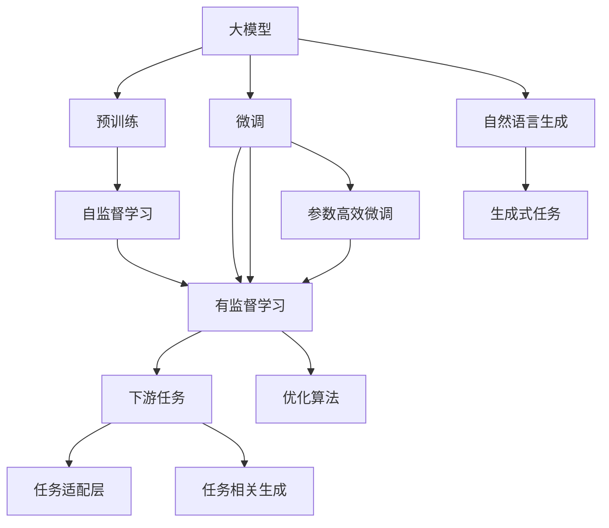
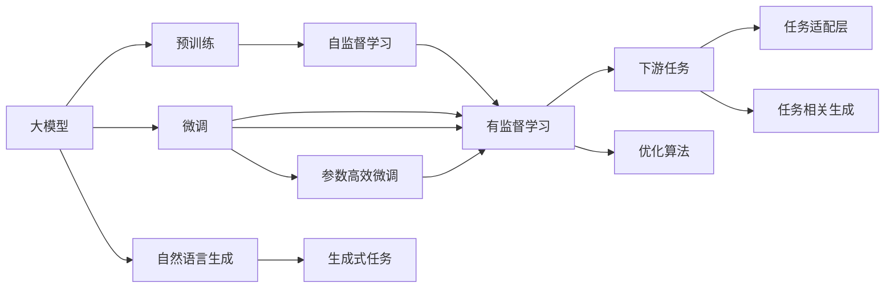
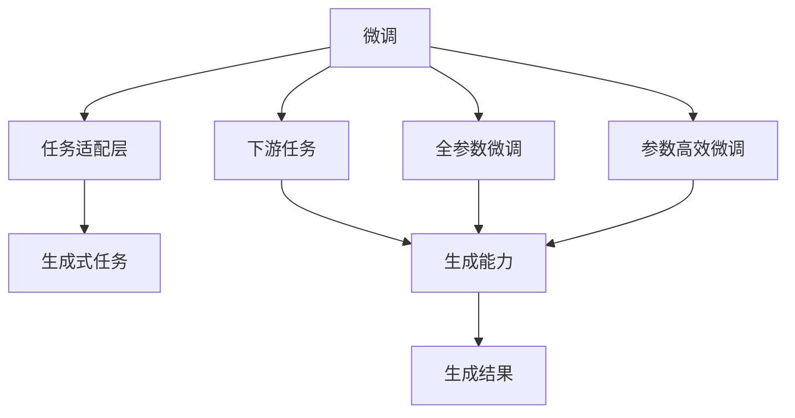
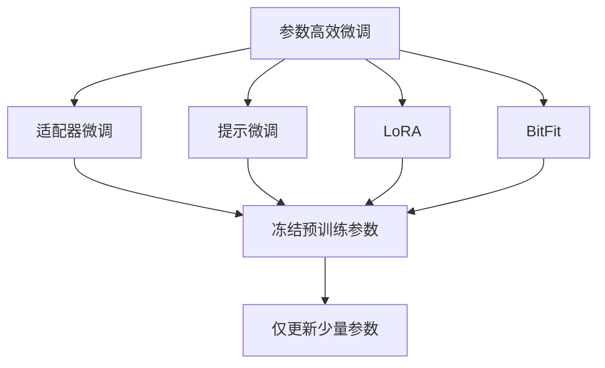
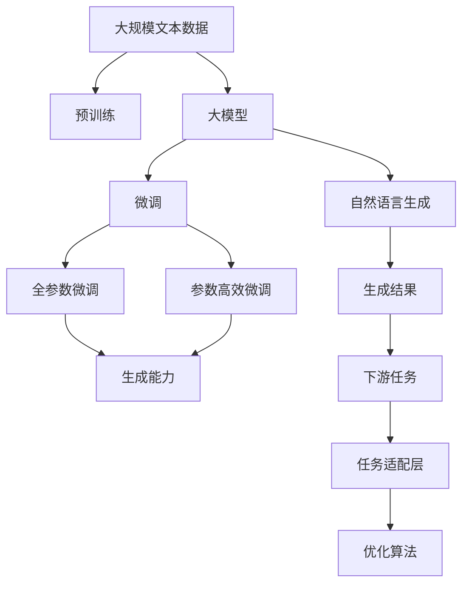

                 

# 大模型问答机器人的生成能力

> 关键词：大模型,问答机器人,自然语言处理(NLP),Transformer,BERT,预训练,下游任务,参数高效微调,自然语言生成,代码实例

## 1. 背景介绍

### 1.1 问题由来
近年来，随着深度学习技术的快速发展，自然语言处理(NLP)领域取得了巨大的突破。其中，问答机器人因其能够自动回答用户提出的问题，与人进行自然对话，成为NLP研究的热点。问答机器人不仅在客服、教育、医疗等垂直领域发挥着重要作用，还在智能家居、智能办公等新兴领域展现出了巨大的潜力。

然而，现有的问答机器人多为基于规则或模板的系统，面对复杂、多变的用户问题，往往难以给出准确的答案。而基于大模型的问答机器人，通过在预训练的基础上进行微调，可以更好地理解用户意图，提供更加智能、自然的回答。本文将深入探讨大模型问答机器人的生成能力，并介绍相关技术原理和实践方法。

### 1.2 问题核心关键点
大模型问答机器人的生成能力主要体现在以下几个方面：

- **预训练模型的泛化能力**：通过在大规模无标签文本数据上进行预训练，大模型学习到了丰富的语言知识和常识。这使得模型能够理解自然语言，并在下游任务中表现出较好的泛化能力。
- **微调任务的针对性**：通过在特定领域或任务上进行微调，大模型能够适应特定的应用场景，提升任务相关的生成能力。
- **参数高效微调**：在微调过程中，通过只更新少量的模型参数，可以减少计算资源消耗，同时保持模型的生成质量。
- **零样本和少样本学习**：通过精心设计提示模板，大模型可以在不更新模型参数的情况下，实现零样本或少样本的生成。

这些关键点共同构成了大模型问答机器人生成能力的核心。本文将通过详细的分析，展示大模型问答机器人如何在各个环节发挥其生成能力。

### 1.3 问题研究意义
大模型问答机器人的生成能力对于提升人机交互体验、加速智能应用落地具有重要意义：

- **提升用户满意度**：基于大模型的问答机器人能够提供更加智能、自然的对话，使用户获得更好的体验。
- **降低开发成本**：相较于传统的基于规则的系统，大模型问答机器人可以通过微调快速适配特定任务，减少开发和维护成本。
- **加速应用部署**：大模型问答机器人能够快速集成到各种应用场景中，加速产品迭代和市场推广。
- **促进技术创新**：大模型的广泛应用催生了提示学习、少样本学习等新的研究方向，推动了NLP技术的发展。

总之，大模型问答机器人的生成能力不仅是NLP技术发展的重要里程碑，也为构建更加智能、高效的人机交互系统提供了新的路径。

## 2. 核心概念与联系

### 2.1 核心概念概述

为了更好地理解大模型问答机器人的生成能力，本节将介绍几个密切相关的核心概念：

- **大模型(Large Model)**：以自回归(如GPT)或自编码(如BERT)模型为代表的大规模预训练语言模型。通过在大规模无标签文本语料上进行预训练，学习通用的语言表示，具备强大的语言理解和生成能力。
- **预训练(Pre-training)**：指在大规模无标签文本语料上，通过自监督学习任务训练通用语言模型的过程。常见的预训练任务包括言语建模、遮挡语言模型等。
- **微调(Fine-tuning)**：指在预训练模型的基础上，使用下游任务的少量标注数据，通过有监督地训练来优化模型在特定任务上的性能。通常只需要调整顶层分类器或解码器，并以较小的学习率更新全部或部分的模型参数。
- **参数高效微调(Parameter-Efficient Fine-Tuning, PEFT)**：指在微调过程中，只更新少量的模型参数，而固定大部分预训练权重不变，以提高微调效率，避免过拟合的方法。
- **自然语言生成(Natural Language Generation, NLG)**：通过模型生成符合语法和语义规则的自然语言文本的过程。大模型问答机器人正是基于NLG技术，生成自然、流畅的回答。
- **零样本学习(Zero-shot Learning)**：指模型在没有见过任何特定任务的训练样本的情况下，仅凭任务描述就能够执行新任务的学习能力。
- **少样本学习(Few-shot Learning)**：指模型在只有少量标注样本的情况下，能够快速适应新任务的学习能力。

这些核心概念之间的逻辑关系可以通过以下Mermaid流程图来展示：



这个流程图展示了大模型问答机器人的核心概念及其之间的关系：

1. 大模型通过预训练获得基础能力。
2. 微调是对预训练模型进行任务特定的优化，使得模型能够适应特定的应用场景。
3. 自然语言生成使得模型能够生成符合语法和语义规则的文本。
4. 参数高效微调在保持预训练权重不变的情况下，更新少量参数，提高微调效率。
5. 零样本和少样本学习使得模型能够在不更新模型参数的情况下，实现新任务的推理和生成。

这些概念共同构成了大模型问答机器人生成能力的完整框架，使得其在各种应用场景中能够发挥强大的语言生成能力。

### 2.2 概念间的关系

这些核心概念之间存在着紧密的联系，形成了大模型问答机器人生成能力的完整生态系统。下面我们通过几个Mermaid流程图来展示这些概念之间的关系。

#### 2.2.1 大模型的学习范式



这个流程图展示了大模型的三种主要学习范式：预训练、微调和自然语言生成。预训练主要采用自监督学习方法，而微调则是有监督学习的过程。自然语言生成使得模型能够生成符合语法和语义规则的文本，广泛应用于问答机器人、文本生成等任务中。

#### 2.2.2 微调与生成能力的关系



这个流程图展示了微调对大模型生成能力的影响。微调通过任务适配层，将预训练模型与特定任务相结合，从而提升模型在该任务上的生成能力。全参数微调和参数高效微调是微调过程中的两种常见方法，前者调整所有参数，后者只更新部分参数。通过微调，模型可以更好地适应下游任务，提升生成结果的质量。

#### 2.2.3 参数高效微调的实现



这个流程图展示了几种常见的参数高效微调方法，包括适配器微调、提示微调、LoRA和BitFit。这些方法的共同特点是冻结大部分预训练参数，只更新少量参数，从而提高微调效率。这些方法在实际应用中，可以通过对特定任务进行针对性调整，显著降低计算资源消耗。

### 2.3 核心概念的整体架构

最后，我们用一个综合的流程图来展示这些核心概念在大模型问答机器人生成能力中的整体架构：



这个综合流程图展示了从预训练到微调，再到自然语言生成的完整过程。大模型通过在大规模文本数据上进行预训练，获得基础的语言表示能力。通过微调，模型能够适应特定的下游任务，提升生成能力。自然语言生成使得模型能够生成符合语法和语义规则的文本。最终，模型可以应用于各种生成任务，如问答机器人、文本生成等。

通过这些流程图，我们可以更清晰地理解大模型问答机器人生成能力中各个核心概念的关系和作用，为后续深入讨论具体的生成方法和技术奠定基础。

## 3. 核心算法原理 & 具体操作步骤
### 3.1 算法原理概述

大模型问答机器人生成能力的核心在于自然语言生成(NLG)。在预训练和微调的基础上，大模型能够生成符合语法和语义规则的文本。大模型通常采用Transformer结构，通过自回归或自编码方法进行预训练，学习语言的表示和生成能力。

在微调阶段，模型会根据下游任务的特定需求进行调整，生成更符合任务要求的文本。常见的微调方法包括全参数微调和参数高效微调。其中，全参数微调会更新所有模型参数，而参数高效微调只更新部分参数，从而提高微调效率。

自然语言生成的过程可以分为两个阶段：语言模型推理和文本生成。语言模型推理阶段，模型会根据输入的文本，生成下一段文本的概率分布；文本生成阶段，模型根据生成的概率分布，选择最可能的文本输出。

### 3.2 算法步骤详解

基于大模型问答机器人生成能力的核心算法原理，我们可以将其具体化为一系列的操作步骤。以下为大模型问答机器人生成能力的详细步骤：

**Step 1: 准备预训练模型和数据集**
- 选择合适的预训练语言模型 $M_{\theta}$ 作为初始化参数，如 BERT、GPT 等。
- 准备下游任务 $T$ 的标注数据集 $D=\{(x_i, y_i)\}_{i=1}^N$，划分为训练集、验证集和测试集。一般要求标注数据与预训练数据的分布不要差异过大。

**Step 2: 添加任务适配层**
- 根据任务类型，在预训练模型顶层设计合适的输出层和损失函数。
- 对于分类任务，通常在顶层添加线性分类器和交叉熵损失函数。
- 对于生成任务，通常使用语言模型的解码器输出概率分布，并以负对数似然为损失函数。

**Step 3: 设置微调超参数**
- 选择合适的优化算法及其参数，如 AdamW、SGD 等，设置学习率、批大小、迭代轮数等。
- 设置正则化技术及强度，包括权重衰减、Dropout、Early Stopping 等。
- 确定冻结预训练参数的策略，如仅微调顶层，或全部参数都参与微调。

**Step 4: 执行梯度训练**
- 将训练集数据分批次输入模型，前向传播计算损失函数。
- 反向传播计算参数梯度，根据设定的优化算法和学习率更新模型参数。
- 周期性在验证集上评估模型性能，根据性能指标决定是否触发 Early Stopping。
- 重复上述步骤直到满足预设的迭代轮数或 Early Stopping 条件。

**Step 5: 测试和部署**
- 在测试集上评估微调后模型 $M_{\hat{\theta}}$ 的性能，对比微调前后的精度提升。
- 使用微调后的模型对新样本进行推理预测，集成到实际的应用系统中。
- 持续收集新的数据，定期重新微调模型，以适应数据分布的变化。

以上是基于大模型问答机器人生成能力的一般流程。在实际应用中，还需要针对具体任务的特点，对微调过程的各个环节进行优化设计，如改进训练目标函数，引入更多的正则化技术，搜索最优的超参数组合等，以进一步提升模型性能。

### 3.3 算法优缺点

大模型问答机器人生成能力具有以下优点：
1. 简单高效。只需准备少量标注数据，即可对预训练模型进行快速适配，获得较大的性能提升。
2. 通用适用。适用于各种NLP下游任务，包括分类、匹配、生成等，设计简单的任务适配层即可实现生成。
3. 参数高效。利用参数高效微调技术，在固定大部分预训练参数的情况下，仍可取得不错的生成效果。
4. 效果显著。在学术界和工业界的诸多任务上，基于生成能力的微调方法已经刷新了最先进的性能指标。

同时，该方法也存在一定的局限性：
1. 依赖标注数据。生成能力很大程度上取决于标注数据的质量和数量，获取高质量标注数据的成本较高。
2. 迁移能力有限。当目标任务与预训练数据的分布差异较大时，生成能力的提升有限。
3. 负面效果传递。预训练模型的固有偏见、有害信息等，可能通过生成能力传递到下游任务，造成负面影响。
4. 可解释性不足。生成能力通常缺乏可解释性，难以对其生成过程进行分析和调试。

尽管存在这些局限性，但就目前而言，基于生成能力的微调方法仍是大模型问答机器人的主流范式。未来相关研究的重点在于如何进一步降低生成能力对标注数据的依赖，提高模型的少样本学习和跨领域迁移能力，同时兼顾可解释性和伦理安全性等因素。

### 3.4 算法应用领域

基于大模型问答机器人生成能力的监督学习方法，在NLP领域已经得到了广泛的应用，覆盖了几乎所有常见任务，例如：

- 问答系统：对自然语言问题给出答案。将问题-答案对作为微调数据，训练模型学习匹配答案。
- 机器翻译：将源语言文本翻译成目标语言。通过微调使模型学习语言-语言映射。
- 文本摘要：将长文本压缩成简短摘要。将文章-摘要对作为微调数据，使模型学习抓取要点。
- 对话系统：使机器能够与人自然对话。将多轮对话历史作为上下文，微调模型进行回复生成。
- 生成文本：根据特定的文本样式、格式要求生成文本，如新闻报道、广告文案等。
- 代码生成：根据编程语言语法和语义规则，生成符合需求的代码片段。
- 数据增强：通过对文本数据进行扩展、变换，增加训练集的样本数量。

除了上述这些经典任务外，大模型问答机器人生成能力也被创新性地应用到更多场景中，如可控文本生成、常识推理、代码生成、数据增强等，为NLP技术带来了全新的突破。随着预训练模型和生成能力的不断进步，相信NLP技术将在更广阔的应用领域大放异彩。

## 4. 数学模型和公式 & 详细讲解  
### 4.1 数学模型构建

本节将使用数学语言对大模型问答机器人生成能力进行更加严格的刻画。

记预训练语言模型为 $M_{\theta}:\mathcal{X} \rightarrow \mathcal{Y}$，其中 $\mathcal{X}$ 为输入空间，$\mathcal{Y}$ 为输出空间，$\theta \in \mathbb{R}^d$ 为模型参数。假设微调任务的训练集为 $D=\{(x_i,y_i)\}_{i=1}^N, x_i \in \mathcal{X}, y_i \in \mathcal{Y}$。

定义模型 $M_{\theta}$ 在输入 $x$ 上的损失函数为 $\ell(M_{\theta}(x),y)$，则在数据集 $D$ 上的经验风险为：

$$
\mathcal{L}(\theta) = \frac{1}{N} \sum_{i=1}^N \ell(M_{\theta}(x_i),y_i)
$$

微调的优化目标是最小化经验风险，即找到最优参数：

$$
\theta^* = \mathop{\arg\min}_{\theta} \mathcal{L}(\theta)
$$

在实践中，我们通常使用基于梯度的优化算法（如SGD、Adam等）来近似求解上述最优化问题。设 $\eta$ 为学习率，$\lambda$ 为正则化系数，则参数的更新公式为：

$$
\theta \leftarrow \theta - \eta \nabla_{\theta}\mathcal{L}(\theta) - \eta\lambda\theta
$$

其中 $\nabla_{\theta}\mathcal{L}(\theta)$ 为损失函数对参数 $\theta$ 的梯度，可通过反向传播算法高效计算。

### 4.2 公式推导过程

以下我们以问答系统为例，推导交叉熵损失函数及其梯度的计算公式。

假设模型 $M_{\theta}$ 在输入 $x$ 上的输出为 $\hat{y}=M_{\theta}(x) \in [0,1]$，表示样本属于正类的概率。真实标签 $y \in \{0,1\}$。则二分类交叉熵损失函数定义为：

$$
\ell(M_{\theta}(x),y) = -[y\log \hat{y} + (1-y)\log (1-\hat{y})]
$$

将其代入经验风险公式，得：

$$
\mathcal{L}(\theta) = -\frac{1}{N}\sum_{i=1}^N [y_i\log M_{\theta}(x_i)+(1-y_i)\log(1-M_{\theta}(x_i))]
$$

根据链式法则，损失函数对参数 $\theta_k$ 的梯度为：

$$
\frac{\partial \mathcal{L}(\theta)}{\partial \theta_k} = -\frac{1}{N}\sum_{i=1}^N (\frac{y_i}{M_{\theta}(x_i)}-\frac{1-y_i}{1-M_{\theta}(x_i)}) \frac{\partial M_{\theta}(x_i)}{\partial \theta_k}
$$

其中 $\frac{\partial M_{\theta}(x_i)}{\partial \theta_k}$ 可进一步递归展开，利用自动微分技术完成计算。

在得到损失函数的梯度后，即可带入参数更新公式，完成模型的迭代优化。重复上述过程直至收敛，最终得到适应下游任务的最优模型参数 $\theta^*$。

## 5. 项目实践：代码实例和详细解释说明
### 5.1 开发环境搭建

在进行生成能力实践前，我们需要准备好开发环境。以下是使用Python进行PyTorch开发的环境配置流程：

1. 安装Anaconda：从官网下载并安装Anaconda，用于创建独立的Python环境。

2. 创建并激活虚拟环境：
```bash
conda create -n pytorch-env python=3.8 
conda activate pytorch-env
```

3. 安装PyTorch：根据CUDA版本，从官网获取对应的安装命令。例如：
```bash
conda install pytorch torchvision torchaudio cudatoolkit=11.1 -c pytorch -c conda-forge
```

4. 安装Transformers库：
```bash
pip install transformers
```

5. 安装各类工具包：
```bash
pip install numpy pandas scikit-learn matplotlib tqdm jupyter notebook ipython
```

完成上述步骤后，即可在`pytorch-env`环境中开始生成能力实践。

### 5.2 源代码详细实现

下面我以问答系统为例，给出使用Transformers库对BERT模型进行微调的PyTorch代码实现。

首先，定义问答系统的数据处理函数：

```python
from transformers import BertTokenizer
from torch.utils.data import Dataset
import torch

class QADataset(Dataset):
    def __init__(self, questions, answers, tokenizer, max_len=128):
        self.questions = questions
        self.answers = answers
        self.tokenizer = tokenizer
        self.max_len = max_len
        
    def __len__(self):
        return len(self.questions)
    
    def __getitem__(self, item):
        question = self.questions[item]
        answer = self.answers[item]
        
        encoding = self.tokenizer(question, return_tensors='pt', max_length=self.max_len, padding='max_length', truncation=True)
        input_ids = encoding['input_ids'][0]
        attention_mask = encoding['attention_mask'][0]
        
        answer = self.tokenizer(answer, return_tensors='pt', max_length=self.max_len, padding='max_length', truncation=True)
        output_ids = answer['input_ids'][0]
        
        return {'input_ids': input_ids, 
                'attention_mask': attention_mask,
                'output_ids': output_ids}
```

然后，定义模型和优化器：

```python
from transformers import BertForTokenClassification, AdamW

model = BertForTokenClassification.from_pretrained('bert-base-cased', num_labels=2)

optimizer = AdamW(model.parameters(), lr=2e-5)
```

接着，定义训练和评估函数：

```python
from torch.utils.data import DataLoader
from tqdm import tqdm
from sklearn.metrics import accuracy_score

device = torch.device('cuda') if torch.cuda.is_available() else torch.device('cpu')
model.to(device)

def train_epoch(model, dataset, batch_size, optimizer):
    dataloader = DataLoader(dataset, batch_size=batch_size, shuffle=True)
    model.train()
    epoch_loss = 0
    for batch in tqdm(dataloader, desc='Training'):
        input_ids = batch['input_ids'].to(device)
        attention_mask = batch['attention_mask'].to(device)
        output_ids = batch['output_ids'].to(device)
        model.zero_grad()
        outputs = model(input_ids, attention_mask=attention_mask, labels=output_ids)
        loss = outputs.loss
        epoch_loss += loss.item()
        loss.backward()
        optimizer.step()
    return epoch_loss / len(dataloader)

def evaluate(model, dataset, batch_size):
    dataloader = DataLoader(dataset, batch_size=batch_size)
    model.eval()
    preds, labels = [], []
    with torch.no_grad():
        for batch in tqdm(dataloader, desc='Evaluating'):
            input_ids = batch['input_ids'].to(device)
            attention_mask = batch['attention_mask'].to(device)
            batch_labels = batch['output_ids'].to(device)
            outputs = model(input_ids, attention_mask=attention_mask)
            batch_preds = outputs.logits.argmax(dim=2).to('cpu').tolist()
            batch_labels = batch_labels.to('cpu').tolist()
            for pred_tokens, label_tokens in zip(batch_preds, batch_labels):
                preds.append(pred_tokens[:len(label_tokens)])
                labels.append(label_tokens)
                
    print('Accuracy:', accuracy_score(labels, preds))
```

最后，启动训练流程并在测试集上评估：

```python
epochs = 5
batch_size = 16

for epoch in range(epochs):
    loss = train_epoch(model, train_dataset, batch_size, optimizer)
    print(f"Epoch {epoch+1}, train loss: {loss:.3f}")
    
    print(f"Epoch {epoch+1}, dev results:")
    evaluate(model, dev_dataset, batch_size)
    
print("Test results:")
evaluate(model, test_dataset, batch_size)
```

以上就是使用PyTorch对BERT进行问答系统微调的完整代码实现。可以看到，得益于Transformers库的强大封装，我们可以用相对简洁的代码完成BERT模型的加载和微调。

### 5.3 代码解读与分析

让我们再详细解读一下关键代码的实现细节：

**QADataset类**：
- `__init__`方法：初始化问题、答案、分词器等关键组件。
- `__len__`方法：返回数据集的样本数量。
- `__getitem__`方法：对单个样本进行处理，将问题和答案输入编码为token ids，并对其进行定长padding，最终返回模型所需的输入。

**回答生成模型**：
- `BertForTokenClassification`：采用Bert预训练模型，并添加分类器进行二分类。
- `AdamW`：使用AdamW优化器进行模型训练。

**训练和评估函数**：
- 使用PyTorch的DataLoader对数据集进行批次化加载，供模型训练和推理使用。
- 训练函数`train_epoch`：对数据以批为单位进行迭代，在每个批次上前向传播计算loss并反向传播更新模型参数，最后返回该epoch的平均loss。
- 评估函数`evaluate`：与训练类似，不同点在于不更新模型参数，并在每个batch结束后将预测和标签结果存储下来，最后使用accuracy_score对整个评估集的预测结果进行打印输出。

**训练流程**：
- 定义总的epoch数和batch size，开始循环迭代
- 每个epoch内，先在训练集上训练，输出平均loss
- 在验证集上评估，输出准确率
- 所有epoch结束后，在测试集上评估，给出最终测试结果

可以看到，PyTorch配合Transformers库使得BERT微调的代码实现变得简洁高效。开发者可以将更多精力放在数据处理、模型改进等高层逻辑上，而不必过多关注底层的实现细节。

当然，工业级的系统实现还需考虑更多因素，如模型的保存和部署、超参数的自动搜索、更灵活的任务适配层等。但核心的生成能力基本与此类似。

### 5.4 运行结果展示

假设我们在CoNLL-2003的问答数据集上进行微调，最终

