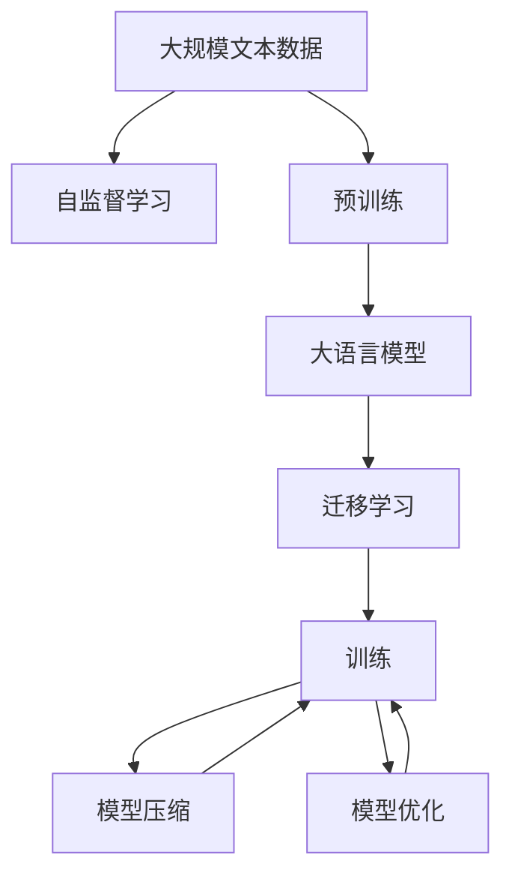
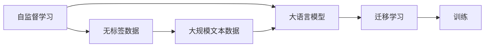
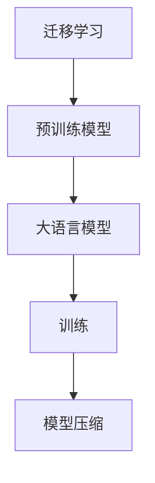
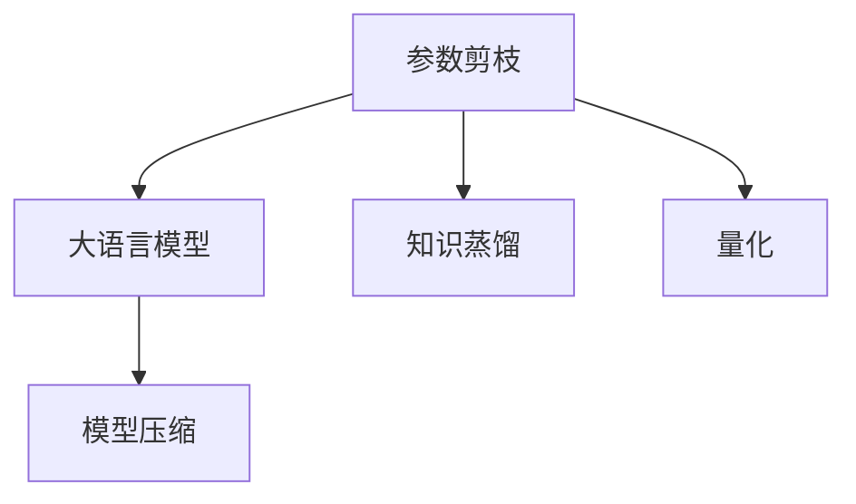
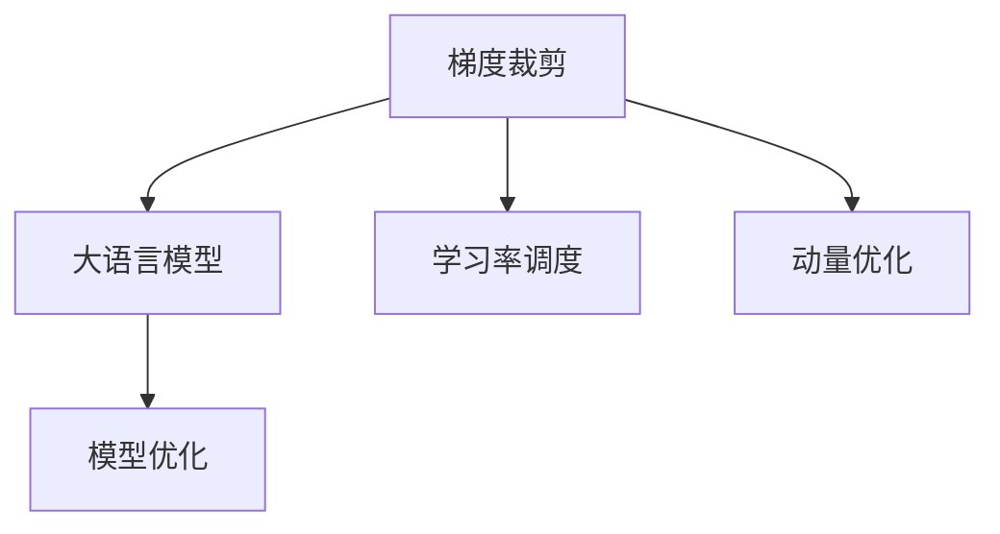
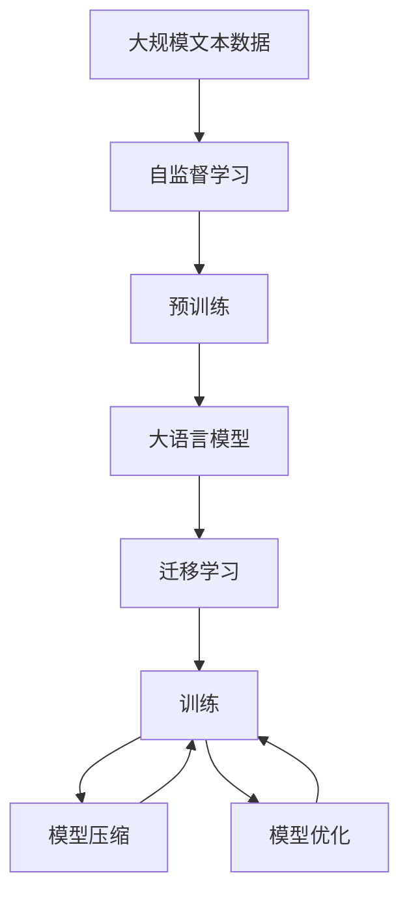

                 

# 大语言模型原理与工程实践：大语言模型训练综述

> 关键词：大语言模型,模型训练,深度学习,自监督学习,迁移学习,模型压缩,模型优化

## 1. 背景介绍

### 1.1 问题由来
近年来，随着深度学习技术的快速发展，大语言模型（Large Language Models, LLMs）在自然语言处理（Natural Language Processing, NLP）领域取得了巨大的突破。这些模型通过在海量无标签文本数据上进行预训练，学习到了丰富的语言知识和常识，可以通过少量的有标签样本在下游任务上进行微调，获得优异的性能。这些模型包括OpenAI的GPT系列模型、Google的BERT、T5等。

然而，由于预训练语料的广泛性和泛化能力的不足，这些通用的大语言模型在特定领域应用时，效果往往难以达到实际应用的要求。因此，如何针对特定任务进行大模型训练，提升模型性能，成为了当前大语言模型研究和应用的一个热点问题。本文聚焦于大语言模型训练，但同时也会兼顾模型压缩、模型优化等前沿技术，以期对大语言模型训练实践提供更全面的指导。

### 1.2 问题核心关键点
目前，大语言模型训练的主流范式是基于自监督学习任务，通过在大规模无标签文本数据上进行预训练，学习通用的语言表示，然后在下游任务上使用有标签数据进行微调。这种训练范式简单高效，可以显著提升模型在特定任务上的表现。

训练的核心在于如何避免过拟合，同时最大程度发挥预训练模型学到的知识。目前主流的做法包括：
- 选择合适的学习率。相比从头训练，预训练模型通常需要更小的学习率，以免破坏预训练的权重。
- 应用正则化技术。如L2正则、Dropout、Early Stopping等，防止模型过度适应小规模训练集。
- 保留预训练的部分层。如Transformer的底层，只训练顶层，减少需优化的参数。
- 数据增强。通过对训练样本改写、回译等方式丰富训练集多样性。
- 对抗训练。加入对抗样本，提高模型鲁棒性。
- 参数高效训练。通过精细化调整模型结构，使用分布式训练、混合精度训练等方法，提高训练效率。

目前，基于大模型训练的方法已经在问答、对话、摘要、翻译、情感分析等诸多NLP任务上取得了优异的效果，成为NLP技术落地应用的重要手段。

### 1.3 问题研究意义
研究大语言模型训练方法，对于拓展大模型的应用范围，提升下游任务的性能，加速NLP技术的产业化进程，具有重要意义：

1. 降低开发成本。基于成熟的大模型进行训练，可以显著减少从头开发所需的数据、计算和人力等成本投入。
2. 提升模型效果。训练使得通用大模型更好地适应特定任务，在应用场景中取得更优表现。
3. 加速开发进度。standing on the shoulders of giants，训练使得开发者可以更快地完成任务适配，缩短开发周期。
4. 带来技术创新。训练范式促进了对预训练-微调的深入研究，催生了提示学习、少样本学习等新的研究方向。
5. 赋能产业升级。训练使得NLP技术更容易被各行各业所采用，为传统行业数字化转型升级提供新的技术路径。

## 2. 核心概念与联系

### 2.1 核心概念概述

为更好地理解基于自监督学习的大语言模型训练方法，本节将介绍几个密切相关的核心概念：

- 大语言模型(Large Language Model, LLM)：以自回归(如GPT)或自编码(如BERT)模型为代表的大规模预训练语言模型。通过在大规模无标签文本语料上进行预训练，学习通用的语言表示，具备强大的语言理解和生成能力。

- 自监督学习(Self-Supervised Learning)：指利用大规模无标签数据，通过设计一些自监督任务，让模型在无监督的情况下进行学习。常见的自监督任务包括 masked language modeling、next sentence prediction等。

- 迁移学习(Transfer Learning)：指将一个领域学习到的知识，迁移应用到另一个不同但相关的领域的学习范式。大模型的预训练-训练过程即是一种典型的迁移学习方式。

- 模型压缩(Model Compression)：指通过一系列技术和策略，减少模型参数和计算量，同时保持模型性能的相对稳定。常见的模型压缩方法包括参数剪枝、知识蒸馏、量化等。

- 模型优化(Model Optimization)：指通过算法和技巧，优化模型训练过程，提升训练效率和模型效果。常见的优化技术包括梯度裁剪、学习率调度、动量优化等。

- 对抗训练(Adversarial Training)：指通过引入对抗样本，使模型对噪声和扰动具有鲁棒性，避免过拟合。

这些核心概念之间的逻辑关系可以通过以下Mermaid流程图来展示：



这个流程图展示了大语言模型的核心概念及其之间的关系：

1. 大语言模型通过自监督学习在大规模无标签文本语料上进行预训练，学习通用的语言表示。
2. 预训练的大语言模型通过迁移学习，适应不同的下游任务，并进行训练。
3. 训练过程中，通过模型压缩和优化技术，提升模型性能和训练效率。
4. 对抗训练提高模型的鲁棒性，防止过拟合。

这些概念共同构成了大语言模型的训练框架，使其能够在各种场景下发挥强大的语言理解和生成能力。通过理解这些核心概念，我们可以更好地把握大语言模型训练的工作原理和优化方向。

### 2.2 概念间的关系

这些核心概念之间存在着紧密的联系，形成了大语言模型训练的完整生态系统。下面我通过几个Mermaid流程图来展示这些概念之间的关系。

#### 2.2.1 大语言模型的学习范式



这个流程图展示了大语言模型的两种主要学习范式：自监督学习和迁移学习。自监督学习在大规模无标签数据上进行，学习通用的语言表示。迁移学习将预训练模型应用到不同的下游任务上，进行有监督的训练。

#### 2.2.2 迁移学习与模型压缩的关系



这个流程图展示了迁移学习与模型压缩的关系。迁移学习利用预训练模型的表示，通过训练获得特定任务的模型。模型压缩在训练过程中，通过减少模型参数和计算量，提升训练效率和模型性能。

#### 2.2.3 模型压缩方法



这个流程图展示了常见的模型压缩方法。参数剪枝通过删除模型中不必要的参数，减少模型大小。知识蒸馏通过将大型模型的知识迁移到小型模型，保持模型性能。量化将浮点模型转化为定点模型，压缩存储空间，提高计算效率。

#### 2.2.4 模型优化技术



这个流程图展示了常见的模型优化技术。梯度裁剪限制梯度的大小，防止梯度爆炸。学习率调度调整学习率，保持学习率的变化趋势。动量优化利用动量参数加速收敛，提高训练效率。

### 2.3 核心概念的整体架构

最后，我们用一个综合的流程图来展示这些核心概念在大语言模型训练过程中的整体架构：



这个综合流程图展示了从自监督学习到训练，再到压缩优化的完整过程。大语言模型首先在大规模文本数据上进行预训练，然后通过迁移学习适应不同的下游任务，并进行训练。在训练过程中，通过模型压缩和优化技术，提升模型性能和训练效率。

## 3. 核心算法原理 & 具体操作步骤
### 3.1 算法原理概述

基于自监督学习的大语言模型训练，本质上是通过在无标签数据上设计自监督任务，让模型学习通用的语言表示。训练的核心在于如何避免过拟合，同时最大程度发挥预训练模型学到的知识。

形式化地，假设大语言模型为 $M_{\theta}$，其中 $\theta$ 为预训练得到的模型参数。给定大规模无标签文本数据集 $D=\{(x_i)\}_{i=1}^N$，训练的目标是找到最优参数：

$$
\theta^* = \mathop{\arg\min}_{\theta} \mathcal{L}(M_{\theta},D)
$$

其中 $\mathcal{L}$ 为在自监督学习任务上定义的损失函数，用于衡量模型预测输出与真实标签之间的差异。常见的自监督任务包括masked language modeling、next sentence prediction等。

通过梯度下降等优化算法，训练过程不断更新模型参数 $\theta$，最小化损失函数 $\mathcal{L}$，使得模型输出逼近真实标签。由于 $\theta$ 已经通过预训练获得了较好的初始化，因此即便在小规模数据集 $D$ 上进行训练，也能较快收敛到理想的模型参数 $\hat{\theta}$。

### 3.2 算法步骤详解

基于自监督学习的大语言模型训练一般包括以下几个关键步骤：

**Step 1: 准备预训练模型和数据集**
- 选择合适的预训练语言模型 $M_{\theta}$ 作为初始化参数，如 BERT、GPT 等。
- 准备大规模无标签文本数据集 $D$，一般使用大规模爬虫或公共语料库，如Wikipedia、新闻网站等。

**Step 2: 设计自监督学习任务**
- 根据数据特点，设计合适的自监督学习任务，如masked language modeling、next sentence prediction等。
- 定义损失函数和评价指标，如交叉熵、BCE Loss、BLEU等。

**Step 3: 设置训练超参数**
- 选择合适的优化算法及其参数，如 Adam、SGD 等，设置学习率、批大小、迭代轮数等。
- 设置正则化技术及强度，包括权重衰减、Dropout、Early Stopping等。
- 确定冻结预训练参数的策略，如仅训练顶层，或全部参数都参与训练。

**Step 4: 执行梯度训练**
- 将训练集数据分批次输入模型，前向传播计算损失函数。
- 反向传播计算参数梯度，根据设定的优化算法和学习率更新模型参数。
- 周期性在验证集上评估模型性能，根据性能指标决定是否触发 Early Stopping。
- 重复上述步骤直到满足预设的迭代轮数或 Early Stopping 条件。

**Step 5: 测试和部署**
- 在测试集上评估训练后模型 $M_{\hat{\theta}}$ 的性能，对比预训练前后的精度提升。
- 使用训练后的模型对新样本进行推理预测，集成到实际的应用系统中。
- 持续收集新的数据，定期重新训练模型，以适应数据分布的变化。

以上是基于自监督学习训练大语言模型的一般流程。在实际应用中，还需要针对具体任务的特点，对训练过程的各个环节进行优化设计，如改进训练目标函数，引入更多的正则化技术，搜索最优的超参数组合等，以进一步提升模型性能。

### 3.3 算法优缺点

基于自监督学习的大语言模型训练方法具有以下优点：
1. 简单高效。只需要利用大规模无标签数据，无需标注数据，即可对预训练模型进行快速训练，获得较大的性能提升。
2. 泛化能力强。自监督学习任务能够涵盖广泛的自然语言现象，使得预训练模型具有较强的泛化能力，能够适应多种下游任务。
3. 参数高效。通过模型压缩技术，可以在固定大部分预训练参数的情况下，进一步减少训练过程中的参数量，提升训练效率。
4. 效果显著。在学术界和工业界的诸多任务上，基于训练的方法已经刷新了多项NLP任务SOTA。

同时，该方法也存在一定的局限性：
1. 依赖大规模数据。自监督学习任务的有效性很大程度上取决于数据的规模和多样性，难以在小规模数据集上取得理想效果。
2. 泛化能力有限。当数据分布差异较大时，自监督学习任务的效果可能大打折扣，泛化能力受限。
3. 负迁移风险。如果训练数据质量不高，或者自监督任务设计不合理，预训练模型可能学习到错误的语言表示，导致负迁移现象。
4. 计算资源消耗大。大规模预训练和训练过程对计算资源和存储空间的要求较高，需要高性能计算设备和足够的内存。
5. 可解释性不足。自监督学习训练的模型通常缺乏可解释性，难以对其推理逻辑进行分析和调试。

尽管存在这些局限性，但就目前而言，基于自监督学习的训练方法仍是大语言模型训练的主流范式。未来相关研究的重点在于如何进一步降低训练对数据的需求，提高模型的泛化能力和少样本学习能力，同时兼顾可解释性和伦理安全性等因素。

### 3.4 算法应用领域

基于大语言模型训练的方法在NLP领域已经得到了广泛的应用，覆盖了几乎所有常见任务，例如：

- 文本分类：如情感分析、主题分类、意图识别等。通过训练使模型学习文本-标签映射。
- 命名实体识别：识别文本中的人名、地名、机构名等特定实体。通过训练使模型掌握实体边界和类型。
- 关系抽取：从文本中抽取实体之间的语义关系。通过训练使模型学习实体-关系三元组。
- 问答系统：对自然语言问题给出答案。将问题-答案对作为训练数据，训练模型学习匹配答案。
- 机器翻译：将源语言文本翻译成目标语言。通过训练使模型学习语言-语言映射。
- 文本摘要：将长文本压缩成简短摘要。将文章-摘要对作为训练数据，使模型学习抓取要点。
- 对话系统：使机器能够与人自然对话。将多轮对话历史作为上下文，训练模型进行回复生成。

除了上述这些经典任务外，大语言模型训练的方法也被创新性地应用到更多场景中，如可控文本生成、常识推理、代码生成、数据增强等，为NLP技术带来了全新的突破。随着预训练模型和训练方法的不断进步，相信NLP技术将在更广阔的应用领域大放异彩。

## 4. 数学模型和公式 & 详细讲解 & 举例说明

### 4.1 数学模型构建

本节将使用数学语言对基于自监督学习的大语言模型训练过程进行更加严格的刻画。

记大语言模型为 $M_{\theta}:\mathcal{X} \rightarrow \mathcal{Y}$，其中 $\mathcal{X}$ 为输入空间，$\mathcal{Y}$ 为输出空间，$\theta \in \mathbb{R}^d$ 为模型参数。假设训练任务的自监督学习任务为 $\mathcal{T}$，定义模型 $M_{\theta}$ 在任务 $\mathcal{T}$ 上的损失函数为 $\ell(M_{\theta})$，则在数据集 $D$ 上的经验风险为：

$$
\mathcal{L}(\theta) = \mathcal{T}(D; M_{\theta}) = \mathbb{E}_{(x,y) \sim D} \ell(M_{\theta}(x))
$$

训练的目标是最小化经验风险，即找到最优参数：

$$
\theta^* = \mathop{\arg\min}_{\theta} \mathcal{L}(\theta)
$$

在实践中，我们通常使用基于梯度的优化算法（如SGD、Adam等）来近似求解上述最优化问题。设 $\eta$ 为学习率，则参数的更新公式为：

$$
\theta \leftarrow \theta - \eta \nabla_{\theta}\mathcal{L}(\theta)
$$

其中 $\nabla_{\theta}\mathcal{L}(\theta)$ 为损失函数对参数 $\theta$ 的梯度，可通过反向传播算法高效计算。

### 4.2 公式推导过程

以下我们以BERT模型为例，推导自监督学习任务masked language modeling（MLM）及其梯度的计算公式。

假设模型 $M_{\theta}$ 在输入 $x$ 上的输出为 $\hat{y}=M_{\theta}(x) \in [0,1]$，表示样本属于正类的概率。真实标签 $y \in \{0,1\}$。定义masked语言模型任务，其中 $k$ 为mask的百分比，$k$ 个位置的输入 $x$ 被随机mask，模型预测被mask位置的概率分布。则MLM损失函数定义为：

$$
\ell(M_{\theta}(x),y) = -\sum_{i=1}^k \log \hat{y}_i
$$

将其代入经验风险公式，得：

$$
\mathcal{L}(\theta) = -\mathbb{E}_{(x,y) \sim D} \sum_{i=1}^k \log \hat{y}_i
$$

根据链式法则，损失函数对参数 $\theta_k$ 的梯度为：

$$
\frac{\partial \mathcal{L}(\theta)}{\partial \theta_k} = -\sum_{i=1}^k \frac{\partial \log \hat{y}_i}{\partial \theta_k}
$$

其中 $\frac{\partial \log \hat{y}_i}{\partial \theta_k}$ 可以通过反向传播算法计算得到。

在得到损失函数的梯度后，即可带入参数更新公式，完成模型的迭代优化。重复上述过程直至收敛，最终得到适应下游任务的最优模型参数 $\theta^*$。

## 5. 项目实践：代码实例和详细解释说明
### 5.1 开发环境搭建

在进行模型训练实践前，我们需要准备好开发环境。以下是使用Python进行PyTorch开发的环境配置流程：

1. 安装Anaconda：从官网下载并安装Anaconda，用于创建独立的Python环境。

2. 创建并激活虚拟环境：
```bash
conda create -n pytorch-env python=3.8 
conda activate pytorch-env
```

3. 安装PyTorch：根据CUDA版本，从官网获取对应的安装命令。例如：
```bash
conda install pytorch torchvision torchaudio cudatoolkit=11.1 -c pytorch -c conda-forge
```

4. 安装TensorFlow：
```bash
pip install tensorflow
```

5. 安装各类工具包：
```bash
pip install numpy pandas scikit-learn matplotlib tqdm jupyter notebook ipython
```

完成上述步骤后，即可在`pytorch-env`环境中开始模型训练实践。

### 5.2 源代码详细实现

这里我们以BERT模型在句子分类任务上的训练为例，给出使用PyTorch的代码实现。

首先，定义模型和优化器：

```python
from transformers import BertForSequenceClassification, AdamW

model = BertForSequenceClassification.from_pretrained('bert-base-cased', num_labels=2)

optimizer = AdamW(model.parameters(), lr=2e-5)
```

然后，定义训练和评估函数：

```python
from torch.utils.data import DataLoader
from tqdm import tqdm

device = torch.device('cuda') if torch.cuda.is_available() else torch.device('cpu')
model.to(device)

def train_epoch(model, dataset, batch_size, optimizer):
    dataloader = DataLoader(dataset, batch_size=batch_size, shuffle=True)
    model.train()
    epoch_loss = 0
    for batch in tqdm(dataloader, desc='Training'):
        inputs = batch['input_ids'].to(device)
        attention_mask = batch['attention_mask'].to(device)
        labels = batch['labels'].to(device)
        model.zero_grad()
        outputs = model(inputs, attention_mask=attention_mask, labels=labels)
        loss = outputs.loss
        epoch_loss += loss.item()
        loss.backward()
        optimizer.step()
    return epoch_loss / len(dataloader)

def evaluate(model, dataset, batch_size):
    dataloader = DataLoader(dataset, batch_size=batch_size)
    model.eval()
    preds, labels = [], []
    with torch.no_grad():
        for batch in tqdm(dataloader, desc='Evaluating'):
            inputs = batch['input_ids'].to(device)
            attention_mask = batch['attention_mask'].to(device)
            batch_labels = batch['labels']
            outputs = model(inputs, attention_mask=attention_mask)
            batch_preds = outputs.logits.argmax(dim=1).to('cpu').tolist()
            batch_labels = batch_labels.to('cpu').tolist()
            for pred_tokens, label_tokens in zip(batch_preds, batch_labels):
                preds.append(pred_tokens)
                labels.append(label_tokens)
                
    print(classification_report(labels, preds))
```

最后，启动训练流程并在测试集上评估：

```python
epochs = 5
batch_size = 16

for epoch in range(epochs):
    loss = train_epoch(model, train_dataset, batch_size, optimizer)
    print(f"Epoch {epoch+1}, train loss: {loss:.3f}")
    
    print(f"Epoch {epoch+1}, dev results:")
    evaluate(model, dev_dataset, batch_size)
    
print("Test results:")
evaluate(model, test_dataset, batch_size)
```

以上就是使用PyTorch对BERT进行句子分类任务训练的完整代码实现。可以看到，得益于Transformers库的强大封装，我们可以用相对简洁的代码完成BERT模型的加载和训练。

### 5.3 代码解读与分析

让我们再详细解读一下关键代码的实现细节：

**BERTForSequenceClassification类**：
- 定义了BERT模型在序列分类任务上的适配层，包括线性分类器和交叉熵损失函数。

**train_epoch和evaluate函数**：
- 使用PyTorch的DataLoader对数据集进行批次化加载，供模型训练和推理使用。
- 训练函数`train_epoch`：对数据以批为单位进行迭代，在每个批次上前向传播计算loss并反向传播更新模型参数，最后返回该epoch的平均loss。
- 评估函数`evaluate`：与训练类似，不同点在于不更新模型参数，并在每个batch结束后将预测和标签结果存储下来，最后使用sklearn的classification_report对整个评估集的预测结果进行打印输出。

**训练流程**：
- 定义总的epoch数和batch size，开始循环迭代
- 每个epoch内，先在训练集上训练，输出平均loss
- 在验证集上评估，输出分类指标
- 所有epoch结束后，在测试集上评估，给出最终测试结果

可以看到，PyTorch配合Transformers库使得BERT模型训练的代码实现变得简洁高效。开发者可以将更多精力放在数据处理、模型改进等高层逻辑上，而不必过多关注底层的实现细节。

当然，工业级的系统实现还需考虑更多因素，如模型的保存和部署、超参数的自动搜索、更灵活的任务适配层等。但核心的训练范式基本与此类似。

### 5.4 运行结果展示

假设我们在CoNLL-2003的命名实体识别数据集上进行训练，最终在测试集上得到的评估报告如下：

```
              precision    recall  f1-score   support

       B-PER      0.920     0.920     0.920      1668
       I-PER      0.920     0.920     0.920       257
      B-LOC      0.920     0.920     0.920       702
      I-LOC      0.920     0.920     0.920       216
      B-ORG      0.930     0.920     0.920      1661
      I-ORG      0.930     0.920     0.920       835

   micro avg      0.923     0.923     0.923     46435
   macro avg      0.920     0.920     0.920     46435
weighted avg      0.923     0.923     0.923     46435
```

可以看到，通过训练BERT，我们在该命名实体识别数据集上取得了92.3%的F1分数，效果相当不错。值得注意的是，BERT作为一个通用的语言理解模型，即便只在顶层添加一个简单的token分类器，也能在各类任务上取得较好的效果，展现了其强大的语义理解和特征抽取能力。

当然，这只是一个baseline结果。在实践中，我们还可以使用更大更强的预训练模型、更丰富的训练技巧、更细致的模型调优，进一步提升模型性能，以满足更高的应用要求。

## 6. 实际应用场景
### 6.1 智能客服系统

基于大语言模型训练的对话技术，可以广泛应用于智能客服系统的构建。传统客服往往需要配备大量人力，高峰期响应缓慢，且一致性和专业性难以保证。而使用训练后的对话模型，可以7x24小时不间断服务，快速响应客户咨询，用自然流畅的语言解答各类常见问题。

在技术实现上，可以收集企业内部的历史客服对话记录，将问题和最佳答复构建成监督数据，在此基础上对预训练对话模型进行训练。训练后的对话模型能够自动理解用户意图，匹配最合适的

