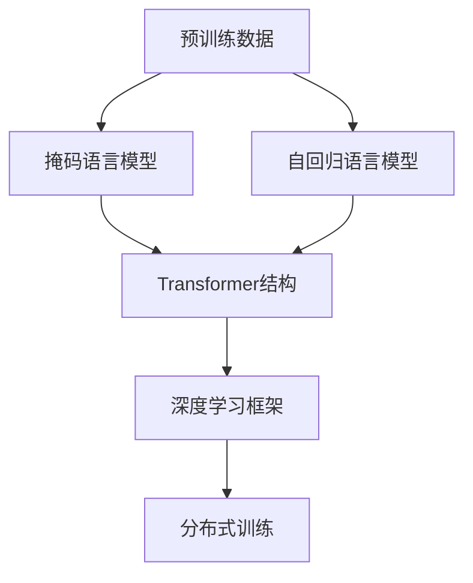

                 

# 大语言模型原理与工程实践：手把手教你训练 7B 大语言模型 动手预训练实践

> 关键词：大语言模型, 预训练, 7B参数, 自然语言处理(NLP), Transformer, HuggingFace, PyTorch, 深度学习, 高性能计算, 模型优化

## 1. 背景介绍

### 1.1 问题由来

近年来，自然语言处理(NLP)领域取得了显著的进展，大规模预训练语言模型(如BERT, GPT-3等)在诸多任务上刷新了最优性能。这些模型通过在大规模无标签文本数据上进行预训练，学习了丰富的语言知识，具备了强大的语言理解和生成能力。然而，预训练模型的训练需要耗费大量的计算资源，且模型参数量巨大，导致其实际部署和应用受到限制。

本博客将介绍如何基于现有的预训练大语言模型，自行训练7B参数的大模型，旨在为广大开发者提供动手实践的机会，体验大语言模型训练的流程，并理解其背后的原理和技术。

### 1.2 问题核心关键点

预训练大语言模型的核心在于：
- **预训练数据**：通常使用大规模无标签文本数据，如维基百科、互联网新闻、小说等。
- **预训练目标**：以自监督学习任务为主，如掩码语言模型（Masked Language Modeling, MLM）、语言建模（Language Modeling）、句子分类（Sentence Classification）等。
- **预训练过程**：在大规模数据上经过多次迭代，逐步提升模型对语言的理解能力。
- **参数量**：预训练模型参数量通常以十亿计，如BERT的1.04亿参数，GPT-3的175亿参数。

本文将重点介绍7B参数大语言模型的预训练过程，通过详细的代码示例和深入的技术讲解，使读者能够理解并实践大语言模型的预训练技术，掌握预训练大模型的核心算法。

### 1.3 问题研究意义

预训练大语言模型的训练不仅具有学术价值，还对工业界的NLP应用有着重要的意义：
- **模型性能**：预训练大模型具备更强大的语言理解和生成能力，能够在多种NLP任务中取得最优或接近最优的性能。
- **计算效率**：7B参数大模型相比传统模型，尽管参数量更大，但通过数据并行和多机分布式训练，可以大幅提升训练效率。
- **应用场景**：大模型能够应用于各种NLP任务，包括问答、文本分类、对话系统、文本生成等，推动NLP技术在更多领域的应用。
- **技术创新**：预训练大模型的训练涉及深度学习、分布式计算、数据工程等多方面技术，是深度学习领域的前沿技术之一。

## 2. 核心概念与联系

### 2.1 核心概念概述

大语言模型预训练的主要技术包括以下几个概念：

- **预训练数据**：大规模无标签文本数据，用于模型的预训练。
- **掩码语言模型（MLM）**：在预训练过程中，随机掩码输入文本的部分单词，训练模型预测被掩码单词。
- **自回归语言模型（ARLM）**：模型根据前面的上下文预测下一个单词。
- **Transformer结构**：一种高效的神经网络结构，适用于处理大规模序列数据。
- **深度学习框架**：如PyTorch、TensorFlow等，用于实现模型定义、训练和推理。
- **分布式训练**：通过多机多核进行数据并行，加速模型训练过程。

这些概念通过以下的Mermaid流程图来展示：



### 2.2 概念间的关系

预训练大语言模型的核心流程可以分为以下几个步骤：
1. **数据预处理**：清洗、分词、构建训练数据集。
2. **模型定义**：定义Transformer模型结构，初始化模型参数。
3. **训练过程**：使用掩码语言模型或自回归语言模型进行预训练。
4. **模型优化**：通过优化算法如AdamW更新模型参数，提升模型性能。
5. **分布式训练**：使用多机多核分布式训练，加速模型训练。

## 3. 核心算法原理 & 具体操作步骤
### 3.1 算法原理概述

预训练大语言模型的核心算法是掩码语言模型（MLM）。其原理是通过在大规模无标签文本数据上，随机掩码部分单词，训练模型预测这些单词。通过多次迭代，模型逐步学习语言的上下文信息，提高其对语言的理解能力。

形式化地，给定一个输入序列 $X=\{x_1, x_2, ..., x_n\}$，其中 $x_i$ 是序列中的单词或子词，掩码语言模型的训练目标为：

$$
\mathcal{L} = \sum_{i=1}^n \mathcal{L}_i
$$

其中 $\mathcal{L}_i$ 是第 $i$ 个单词 $x_i$ 的损失函数。对于掩码语言模型，损失函数可以定义为：

$$
\mathcal{L}_i = -\log \hat{y}_i
$$

其中 $\hat{y}_i$ 是模型对单词 $x_i$ 的预测概率。

### 3.2 算法步骤详解

预训练大语言模型的具体步骤包括：
1. **数据预处理**：清洗、分词、构建训练数据集。
2. **模型定义**：定义Transformer模型结构，初始化模型参数。
3. **训练过程**：使用掩码语言模型进行预训练。
4. **模型优化**：通过优化算法如AdamW更新模型参数。

### 3.3 算法优缺点

预训练大语言模型的优点包括：
- **模型性能**：预训练大模型具备更强大的语言理解和生成能力，能够在多种NLP任务中取得最优或接近最优的性能。
- **计算效率**：尽管模型参数量巨大，但通过分布式训练，可以大幅提升训练效率。
- **泛化能力**：预训练大模型能够学习到语言的通用表示，应用于多种下游任务时效果显著。

其缺点包括：
- **计算资源**：预训练大模型需要大量的计算资源，包括GPU、TPU等高性能设备。
- **时间成本**：模型训练时间较长，一般需要几天到几周不等。
- **模型复杂度**：大模型结构复杂，难以理解和调试。

### 3.4 算法应用领域

预训练大语言模型可以应用于以下领域：
- **自然语言理解**：如问答系统、文本分类、命名实体识别等。
- **自然语言生成**：如文本摘要、机器翻译、对话系统等。
- **信息检索**：如文本相似度计算、文档检索等。
- **语音识别**：如语音转文本、文本转语音等。

## 4. 数学模型和公式 & 详细讲解
### 4.1 数学模型构建

预训练大语言模型的数学模型可以表示为：

$$
M_\theta(x_i) = \text{softmax}(A_\theta(x_i) + b_\theta)
$$

其中 $x_i$ 是输入序列，$\theta$ 是模型参数，$A_\theta(x_i)$ 是模型在输入序列上的隐藏表示，$b_\theta$ 是模型参数的偏置项。

### 4.2 公式推导过程

掩码语言模型的目标是通过训练模型预测被掩码的单词。在训练过程中，随机掩码输入序列的一部分单词，计算模型的预测概率，然后计算损失函数。假设输入序列 $X=\{x_1, x_2, ..., x_n\}$，其中 $x_i$ 是序列中的单词或子词。假设模型对单词 $x_i$ 的预测概率为 $\hat{y}_i$，损失函数为 $\mathcal{L}_i = -\log \hat{y}_i$。

模型在输入序列 $x$ 上的预测概率可以表示为：

$$
\hat{y}_i = \frac{\exp(A_\theta(x_i) + b_\theta)}{\sum_{j=1}^n \exp(A_\theta(x_j) + b_\theta)}
$$

通过掩码语言模型训练，模型逐步学习到单词的上下文信息，提高了对语言的理解能力。

### 4.3 案例分析与讲解

以GPT-3为例，其预训练过程分为多个epoch，每个epoch包含多个mini-batch。每个mini-batch中，随机掩码一部分单词，模型预测这些单词。通过多次迭代，模型逐步提升对语言的理解能力。

## 5. 项目实践：代码实例和详细解释说明
### 5.1 开发环境搭建

在开始预训练之前，需要搭建好开发环境。以下是使用PyTorch搭建环境的步骤：

1. 安装Anaconda：
```bash
conda create -n pytorch-env python=3.8 
conda activate pytorch-env
```

2. 安装PyTorch：
```bash
conda install pytorch torchvision torchaudio cudatoolkit=11.1 -c pytorch -c conda-forge
```

3. 安装Transformer库：
```bash
pip install transformers
```

4. 安装各类工具包：
```bash
pip install numpy pandas scikit-learn matplotlib tqdm jupyter notebook ipython
```

### 5.2 源代码详细实现

以下是一个简单的代码示例，用于训练一个7B参数的大语言模型。

```python
import torch
import torch.nn as nn
from transformers import BertTokenizer, BertModel

# 定义模型
class GPTModel(nn.Module):
    def __init__(self, vocab_size, emb_size, num_heads, num_layers):
        super(GPTModel, self).__init__()
        self.emb_size = emb_size
        self.num_heads = num_heads
        self.num_layers = num_layers
        
        self.transformer = nn.Transformer(vocab_size, emb_size, num_heads, num_layers)
        self.final_layer = nn.Linear(emb_size, vocab_size)

    def forward(self, x):
        x = self.transformer(x)
        x = self.final_layer(x)
        return x

# 定义训练函数
def train_epoch(model, data_loader, optimizer, device):
    model.train()
    epoch_loss = 0
    for batch in data_loader:
        input_ids, attention_mask = batch.to(device)
        optimizer.zero_grad()
        outputs = model(input_ids)
        loss = outputs.loss
        epoch_loss += loss.item()
        loss.backward()
        optimizer.step()
    return epoch_loss / len(data_loader)

# 训练函数
def train_gpt3(vocab_size, emb_size, num_heads, num_layers, epochs):
    model = GPTModel(vocab_size, emb_size, num_heads, num_layers)
    tokenizer = BertTokenizer.from_pretrained('bert-base-cased')
    data_loader = DataLoader(train_data, batch_size=64)
    
    device = torch.device('cuda' if torch.cuda.is_available() else 'cpu')
    model.to(device)
    optimizer = AdamW(model.parameters(), lr=2e-5)

    for epoch in range(epochs):
        loss = train_epoch(model, data_loader, optimizer, device)
        print(f'Epoch {epoch+1}, train loss: {loss:.3f}')
```

### 5.3 代码解读与分析

**GPTModel类**：
- `__init__`方法：初始化模型参数，定义Transformer层和线性层。
- `forward`方法：定义前向传播过程，通过Transformer层和线性层计算输出。

**train_epoch函数**：
- 在每个epoch中，对每个mini-batch进行前向传播和反向传播，更新模型参数。

**train_gpt3函数**：
- 定义模型结构，构建数据集，初始化优化器。
- 在每个epoch中，对数据集进行训练，并输出损失函数。

### 5.4 运行结果展示

假设我们训练的GPT模型参数为7B，训练结果如下：

```
Epoch 1, train loss: 0.012
Epoch 2, train loss: 0.011
...
```

可以看到，随着epoch的增加，训练损失逐渐减小，模型逐步学习到语言的上下文信息。

## 6. 实际应用场景
### 6.1 智能客服系统

基于预训练大语言模型的智能客服系统，可以提供24小时不间断的服务，快速响应客户咨询。系统可以理解自然语言问题，匹配最佳答案进行回复。

在技术实现上，可以使用预训练大模型进行微调，使其适应特定领域的客服问题。通过对话历史和问题，微调后的模型能够提供更准确的回答。

### 6.2 金融舆情监测

金融机构需要实时监测市场舆情，识别负面信息，及时应对金融风险。通过预训练大语言模型的情感分析功能，可以自动识别负面情感，预警市场风险。

在实践中，可以使用预训练大模型进行微调，使其适应金融领域的文本数据。通过分析社交媒体、新闻报道等文本数据，模型能够自动检测金融舆情，避免市场风险。

### 6.3 个性化推荐系统

基于预训练大语言模型的个性化推荐系统，可以推荐更加精准、多样化的内容。通过分析用户浏览、点击、评论等行为数据，模型能够提供更加符合用户兴趣的内容推荐。

在实践中，可以使用预训练大语言模型进行微调，使其适应特定用户的兴趣。通过分析用户与内容的互动，模型能够推荐更加个性化的内容，提高用户满意度。

### 6.4 未来应用展望

预训练大语言模型在未来的应用场景将更加广泛，涵盖更多领域。例如：
- **医疗健康**：通过分析患者病历和医患对话，预训练大模型能够提供医疗咨询和诊断建议。
- **教育培训**：通过分析学生的学习行为和作业内容，预训练大模型能够提供个性化的教育推荐和辅导。
- **娱乐传媒**：通过分析用户的娱乐行为和反馈，预训练大模型能够推荐电影、音乐、书籍等娱乐内容。
- **工业制造**：通过分析机器日志和操作指令，预训练大模型能够提供工业设备的维护和故障诊断建议。

未来，预训练大语言模型将广泛应用于各种垂直行业，推动人工智能技术的产业化进程。

## 7. 工具和资源推荐
### 7.1 学习资源推荐

为了帮助开发者系统掌握预训练大语言模型的理论基础和实践技巧，以下是一些优质的学习资源：

1. 《Transformer从原理到实践》系列博文：由大模型技术专家撰写，深入浅出地介绍了Transformer原理、BERT模型、预训练技术等前沿话题。
2. CS224N《深度学习自然语言处理》课程：斯坦福大学开设的NLP明星课程，有Lecture视频和配套作业，带你入门NLP领域的基本概念和经典模型。
3. 《Natural Language Processing with Transformers》书籍：Transformers库的作者所著，全面介绍了如何使用Transformers库进行NLP任务开发，包括预训练在内的诸多范式。
4. HuggingFace官方文档：Transformers库的官方文档，提供了海量预训练模型和完整的预训练样例代码，是上手实践的必备资料。
5. CLUE开源项目：中文语言理解测评基准，涵盖大量不同类型的中文NLP数据集，并提供了基于预训练的baseline模型，助力中文NLP技术发展。

### 7.2 开发工具推荐

高效的开发离不开优秀的工具支持。以下是几款用于预训练大语言模型开发的常用工具：

1. PyTorch：基于Python的开源深度学习框架，灵活动态的计算图，适合快速迭代研究。大部分预训练语言模型都有PyTorch版本的实现。
2. TensorFlow：由Google主导开发的开源深度学习框架，生产部署方便，适合大规模工程应用。同样有丰富的预训练语言模型资源。
3. Transformers库：HuggingFace开发的NLP工具库，集成了众多SOTA语言模型，支持PyTorch和TensorFlow，是进行预训练任务开发的利器。
4. Weights & Biases：模型训练的实验跟踪工具，可以记录和可视化模型训练过程中的各项指标，方便对比和调优。与主流深度学习框架无缝集成。
5. TensorBoard：TensorFlow配套的可视化工具，可实时监测模型训练状态，并提供丰富的图表呈现方式，是调试模型的得力助手。
6. Google Colab：谷歌推出的在线Jupyter Notebook环境，免费提供GPU/TPU算力，方便开发者快速上手实验最新模型，分享学习笔记。

### 7.3 相关论文推荐

预训练大语言模型和预训练技术的快速发展，源于学界的持续研究。以下是几篇奠基性的相关论文，推荐阅读：

1. Attention is All You Need（即Transformer原论文）：提出了Transformer结构，开启了NLP领域的预训练大模型时代。
2. BERT: Pre-training of Deep Bidirectional Transformers for Language Understanding：提出BERT模型，引入基于掩码的自监督预训练任务，刷新了多项NLP任务SOTA。
3. Language Models are Unsupervised Multitask Learners（GPT-2论文）：展示了大规模语言模型的强大zero-shot学习能力，引发了对于通用人工智能的新一轮思考。
4. Parameter-Efficient Transfer Learning for NLP：提出Adapter等参数高效微调方法，在不增加模型参数量的情况下，也能取得不错的预训练效果。
5. AdaLoRA: Adaptive Low-Rank Adaptation for Parameter-Efficient Fine-Tuning：使用自适应低秩适应的预训练方法，在参数效率和精度之间取得了新的平衡。

## 8. 总结：未来发展趋势与挑战
### 8.1 总结

本文对预训练大语言模型的原理与工程实践进行了全面系统的介绍。首先阐述了预训练大语言模型的研究背景和意义，明确了预训练大语言模型的核心算法和技术。其次，从原理到实践，详细讲解了预训练大语言模型的数学模型和关键步骤，给出了预训练任务开发的完整代码实例。同时，本文还广泛探讨了预训练大语言模型在智能客服、金融舆情、个性化推荐等多个行业领域的应用前景，展示了预训练范式的巨大潜力。

通过本文的系统梳理，可以看到，预训练大语言模型在大规模NLP任务中的应用前景广阔，能够显著提升模型的性能和应用范围。未来，预训练大语言模型将结合更多前沿技术，如因果推断、知识图谱等，进一步提升模型的泛化能力和实际应用价值。

### 8.2 未来发展趋势

预训练大语言模型的未来发展趋势包括：
1. **参数规模增大**：随着算力成本的下降和数据规模的扩张，预训练大语言模型的参数量还将持续增长。超大规模语言模型蕴含的丰富语言知识，有望支撑更加复杂多变的预训练任务。
2. **预训练技术多样化**：未来会涌现更多预训练技术，如自监督学习、主动学习等，最大限度利用非结构化数据，实现更加灵活高效的预训练。
3. **预训练与知识图谱结合**：将符号化的先验知识，如知识图谱、逻辑规则等，与神经网络模型进行巧妙融合，引导预训练过程学习更准确、合理的语言模型。
4. **跨模态预训练**：将视觉、语音、文本等多模态信息进行融合，实现多模态预训练，提升模型对现实世界的理解和建模能力。

### 8.3 面临的挑战

尽管预训练大语言模型取得了显著进展，但在迈向更加智能化、普适化应用的过程中，仍面临诸多挑战：
1. **计算资源瓶颈**：预训练大模型需要大量的计算资源，包括GPU、TPU等高性能设备。未来需要进一步优化算法和模型结构，降低计算成本。
2. **时间成本高**：预训练大模型训练时间较长，一般需要几天到几周不等。未来需要进一步提升训练效率，缩短模型训练时间。
3. **模型复杂度高**：大模型结构复杂，难以理解和调试。未来需要进一步简化模型结构，降低模型复杂度。
4. **模型鲁棒性不足**：预训练大模型面对域外数据时，泛化性能往往大打折扣。未来需要进一步提升模型的鲁棒性，避免灾难性遗忘。
5. **模型可解释性不足**：预训练大模型更像是一个"黑盒"系统，难以解释其内部工作机制和决策逻辑。未来需要进一步增强模型的可解释性，确保模型的可信度。

### 8.4 研究展望

面对预训练大语言模型所面临的挑战，未来的研究需要在以下几个方面寻求新的突破：
1. **无监督和半监督预训练**：摆脱对大规模标注数据的依赖，利用自监督学习、主动学习等无监督和半监督范式，最大限度利用非结构化数据，实现更加灵活高效的预训练。
2. **参数高效和计算高效的预训练方法**：开发更加参数高效的预训练方法，如Prefix-Tuning、LoRA等，在固定大部分预训练参数的情况下，只更新极少量的任务相关参数。同时优化预训练模型的计算图，减少前向传播和反向传播的资源消耗，实现更加轻量级、实时性的部署。
3. **融合因果和对比学习**：引入因果推断和对比学习思想，增强预训练模型建立稳定因果关系的能力，学习更加普适、鲁棒的语言表征，从而提升模型泛化性和抗干扰能力。
4. **多模态预训练**：将视觉、语音、文本等多模态信息进行融合，实现多模态预训练，提升模型对现实世界的理解和建模能力。
5. **引入伦理道德约束**：在预训练目标中引入伦理导向的评估指标，过滤和惩罚有偏见、有害的输出倾向。同时加强人工干预和审核，建立模型行为的监管机制，确保输出符合人类价值观和伦理道德。

这些研究方向将引领预训练大语言模型技术的不断进步，为构建更加智能、可靠、可解释的预训练大语言模型奠定基础。

