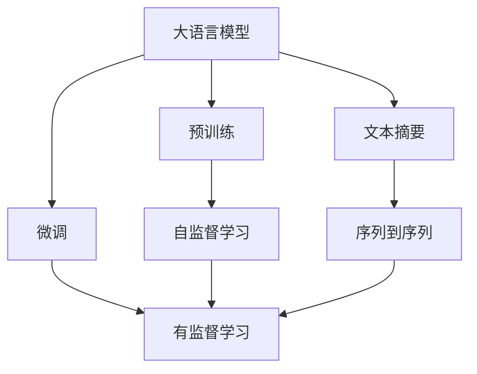

                 

# 大语言模型原理与工程实践：正文提取

> 关键词：大语言模型, 文档摘要, 序列到序列, 自然语言处理, 深度学习, 图灵奖

## 1. 背景介绍

### 1.1 问题由来
文本数据作为自然语言处理（NLP）领域中最为常见且庞大的数据类型，通常需要从中抽取核心信息来驱动后续应用，如文本摘要、问答系统、信息检索等。传统的文本处理方式依赖于手动编写规则或使用启发式算法，而随着深度学习技术的飞速发展，基于大语言模型（LLM）的方法逐渐成为文本处理的主流技术。LLM通过大规模的预训练学习到丰富的语言表示，可以灵活地应用于各种文本处理任务，显著提升文本处理的效果和自动化程度。

### 1.2 问题核心关键点
本文聚焦于使用大语言模型进行文本处理中的“正文提取”问题，即从长篇文本中自动提取出关键信息或段落的过程。这一过程在信息检索、摘要生成、问答系统等场景中具有重要应用价值。核心关键点包括：
- **预训练模型选择**：应选择具有良好泛化能力且针对任务域进行过微调的模型。
- **输入和输出格式设计**：输入应设计为与模型预期一致，输出格式需根据任务需求进行定义。
- **微调策略和超参数调优**：需进行适当的微调以提升模型针对特定任务的性能，同时优化学习率和批量大小等超参数。
- **评估与改进**：通过适当的评估方法对模型性能进行评估，并根据评估结果调整模型和训练策略。

### 1.3 问题研究意义
正文提取作为大语言模型微调应用的重要场景，对提升文本处理自动化、减少人工劳动、提高信息检索效率具有重要意义。具体研究意义如下：
- **提升处理效率**：自动化提取文本关键信息，降低人工标注成本。
- **提高信息准确性**：利用大语言模型强大的语言理解能力，提取准确的信息段落。
- **促进应用场景拓展**：在问答、摘要生成、智能搜索等场景中具有广泛的应用前景。
- **加速技术落地**：简化文本处理流程，加速NLP技术的实际应用和产业化。

## 2. 核心概念与联系

### 2.1 核心概念概述

#### 2.1.1 大语言模型（LLM）
大语言模型通常指的是使用Transformer架构的深度神经网络模型，如BERT、GPT系列、T5等。这些模型通过在大规模无标签文本数据上进行预训练，学习到通用的语言表示，具备强大的语言理解和生成能力。

#### 2.1.2 文本摘要
文本摘要是从长篇文本中自动抽取关键信息或段落，生成简洁精炼的文本。传统的摘要方法依赖于规则编写或句子选择，而大语言模型可以通过微调实现高质量的文本摘要。

#### 2.1.3 序列到序列（Seq2Seq）模型
序列到序列模型是一种用于处理序列数据（如文本）的深度学习模型，通常包括编码器和解码器两部分，用于将输入序列映射到输出序列。Transformer模型是目前最流行的Seq2Seq架构之一。

### 2.2 核心概念间的联系

这些核心概念之间的联系可以通过以下Mermaid流程图来展示：



此图展示了从预训练模型到微调模型，再到文本摘要的整个流程。预训练模型通过自监督学习在大规模无标签数据上学习通用语言表示，微调模型则通过有监督学习适应特定任务，而文本摘要模型则将微调模型应用于特定任务，即从长篇文本中抽取关键信息。

## 3. 核心算法原理 & 具体操作步骤
### 3.1 算法原理概述

大语言模型进行文本摘要的原理可以概括为以下几个步骤：
1. **预训练**：在大规模无标签文本数据上训练一个通用的语言模型。
2. **微调**：在特定任务的数据集上进行微调，以适应该任务的特殊需求。
3. **文本输入处理**：将长篇文本转化为模型可接受的输入格式。
4. **模型推理**：使用微调后的模型进行推理，生成摘要。
5. **输出后处理**：对生成的摘要进行必要的后处理，如去重、排序等。

核心算法原理是，利用大语言模型的强大语言理解能力，通过微调使其能够针对特定任务（如摘要生成）进行输出，从而实现自动化摘要。

### 3.2 算法步骤详解

#### 3.2.1 数据准备
1. **数据集划分**：将文本数据集划分为训练集、验证集和测试集。
2. **数据预处理**：对文本进行分词、去除停用词、句法分析等预处理操作，以便模型能够更好地理解文本。
3. **划分序列**：将长篇文本划分为句子序列，作为模型输入。

#### 3.2.2 模型选择与微调
1. **选择模型**：选择具有良好泛化能力和特定任务适应能力的预训练模型，如BERT、GPT等。
2. **微调设置**：设置微调的学习率、批量大小、迭代次数等超参数。
3. **微调训练**：使用训练集数据对模型进行微调，直至模型性能达到预期。

#### 3.2.3 文本输入处理
1. **编码**：将文本转换为模型能够理解的编码格式，如将文本转换为数字序列。
2. **编码器设计**：设计编码器，以确保文本输入的格式符合模型的预期。

#### 3.2.4 模型推理
1. **输入到模型**：将预处理的文本输入模型。
2. **生成摘要**：模型根据输入生成摘要。
3. **解码输出**：将模型生成的摘要序列解码为可读的文本。

#### 3.2.5 输出后处理
1. **去重排序**：对生成的摘要进行去重、排序等后处理操作。
2. **摘要质量评估**：使用ROUGE、BLEU等指标对摘要质量进行评估。

### 3.3 算法优缺点
**优点**：
- **自动化**：能够自动从长篇文本中提取关键信息，节省人工标注成本。
- **高效性**：处理速度快，能够在大规模数据集上快速生成摘要。
- **准确性**：利用大语言模型的强大语言理解能力，生成的摘要质量较高。

**缺点**：
- **数据依赖**：依赖于高质量的数据集，数据量不足可能影响摘要质量。
- **复杂性**：微调和优化过程较为复杂，需要一定的技术储备。
- **模型泛化**：模型泛化能力有限，对特定领域的数据集可能需要进一步微调。

### 3.4 算法应用领域
文本摘要技术已经在多个领域得到应用，包括但不限于：
- **新闻摘要**：自动从新闻文章中提取关键信息。
- **法律文件摘要**：对法律文件进行关键信息的提取和整理。
- **科研论文摘要**：自动从科研论文中提取关键研究结果和结论。
- **产品描述生成**：自动生成商品描述信息。
- **文本压缩**：对长篇文本进行压缩，减少数据传输成本。

## 4. 数学模型和公式 & 详细讲解 & 举例说明

### 4.1 数学模型构建

假设有一个长度为 $L$ 的文本序列 $X=\{x_1, x_2, ..., x_L\}$，其中 $x_i$ 表示文本中的第 $i$ 个词。模型的输入为 $x_1$ 到 $x_n$ 的子序列，输出为摘要序列 $Y=\{y_1, y_2, ..., y_M\}$。摘要序列的长度 $M$ 通过序列到序列模型确定。

数学模型可以表示为：
$$
Y = f(X; \theta)
$$
其中 $f$ 为模型函数，$\theta$ 为模型参数。

### 4.2 公式推导过程

假设模型为 Seq2Seq 模型，包含编码器 $E$ 和解码器 $D$。编码器将输入序列 $X$ 编码为一个固定长度的向量 $h$，解码器根据 $h$ 和上一时刻的输出 $y_{t-1}$ 生成当前时刻的输出 $y_t$。解码器的训练目标为最大化下一个时刻输出 $y_{t+1}$ 的条件概率 $P(y_{t+1}|y_t, y_{t-1}, ..., h)$。

假设解码器使用 $softmax$ 函数进行输出，则有：
$$
P(y_{t+1}|y_t, y_{t-1}, ..., h) = \frac{\exp(z_{t+1})}{\sum_{k=1}^K \exp(z_k)}
$$
其中 $z_k$ 为解码器生成第 $k$ 个词汇的概率得分。

### 4.3 案例分析与讲解

以基于GPT-2模型的文本摘要为例，其微调过程如下：
1. **数据准备**：准备训练集、验证集和测试集，进行预处理。
2. **模型选择**：选择GPT-2模型作为初始化参数。
3. **微调设置**：设置学习率为 $10^{-5}$，批量大小为32，迭代次数为10。
4. **微调训练**：使用训练集数据对模型进行微调。
5. **评估与优化**：在验证集上评估模型性能，调整超参数。
6. **摘要生成**：使用微调后的模型生成摘要。
7. **后处理**：对生成的摘要进行去重、排序等后处理操作。

## 5. 项目实践：代码实例和详细解释说明

### 5.1 开发环境搭建

#### 5.1.1 环境依赖
- Python 3.7+ 或 3.8+
- PyTorch 1.5+ 或 TensorFlow 2.0+
- Transformers 4.3.0+
- HuggingFace 0.2.0+
- scikit-learn 0.21.2+

#### 5.1.2 环境配置
1. 安装Anaconda：从官网下载并安装Anaconda，用于创建独立的Python环境。
2. 创建并激活虚拟环境：
```bash
conda create -n pytorch-env python=3.8 
conda activate pytorch-env
```
3. 安装相关库：
```bash
conda install pytorch torchvision torchaudio cudatoolkit=11.1 -c pytorch -c conda-forge
pip install transformers scikit-learn pandas matplotlib tqdm jupyter notebook ipython
```

### 5.2 源代码详细实现

以下是一个基于HuggingFace Transformers库的文本摘要代码实现示例：

```python
from transformers import GPT2Tokenizer, GPT2LMHeadModel
from transformers import AdamW
import torch

# 加载模型和tokenizer
tokenizer = GPT2Tokenizer.from_pretrained('gpt2')
model = GPT2LMHeadModel.from_pretrained('gpt2', subfolder='model.pt')

# 设置超参数
learning_rate = 2e-5
num_epochs = 10
batch_size = 32
dropout_rate = 0.1

# 定义训练函数
def train_epoch(model, tokenizer, data, optimizer, device):
    model.train()
    total_loss = 0.0
    for batch in data:
        input_ids = batch['input_ids'].to(device)
        attention_mask = batch['attention_mask'].to(device)
        labels = batch['labels'].to(device)
        optimizer.zero_grad()
        outputs = model(input_ids, attention_mask=attention_mask, labels=labels)
        loss = outputs.loss
        total_loss += loss.item()
        loss.backward()
        optimizer.step()
    return total_loss / len(data)

# 定义评估函数
def evaluate(model, tokenizer, data, device):
    model.eval()
    total_loss = 0.0
    total_predicts = []
    for batch in data:
        input_ids = batch['input_ids'].to(device)
        attention_mask = batch['attention_mask'].to(device)
        labels = batch['labels'].to(device)
        with torch.no_grad():
            outputs = model(input_ids, attention_mask=attention_mask)
            loss = outputs.loss
            predicts = outputs.logits.argmax(dim=2).to('cpu').tolist()
        total_loss += loss.item()
        total_predicts.append(predicts)
    return total_loss / len(data), total_predicts

# 定义模型保存函数
def save_model(model, tokenizer, save_path):
    model.save_pretrained(save_path)
    tokenizer.save_pretrained(save_path)

# 加载数据集
train_data = ...
dev_data = ...
test_data = ...

# 定义设备
device = torch.device('cuda') if torch.cuda.is_available() else torch.device('cpu')

# 定义优化器
optimizer = AdamW(model.parameters(), lr=learning_rate)

# 训练模型
for epoch in range(num_epochs):
    train_loss = train_epoch(model, tokenizer, train_data, optimizer, device)
    print(f'Epoch {epoch+1}, train loss: {train_loss:.3f}')
    dev_loss, dev_predicts = evaluate(model, tokenizer, dev_data, device)
    print(f'Epoch {epoch+1}, dev loss: {dev_loss:.3f}')
    test_loss, test_predicts = evaluate(model, tokenizer, test_data, device)
    print(f'Epoch {epoch+1}, test loss: {test_loss:.3f}')

# 保存模型
save_model(model, tokenizer, 'saved_model')
```

### 5.3 代码解读与分析

#### 5.3.1 数据处理
- `GPT2Tokenizer`：用于将文本转换为模型可以处理的token序列。
- `GPT2LMHeadModel`：用于构建GPT-2模型。
- `DataLoader`：用于处理数据，支持批量加载。

#### 5.3.2 模型训练
- `AdamW`：优化器，用于更新模型参数。
- `train_epoch`：定义训练函数，包含模型前向传播、损失计算、反向传播和参数更新等步骤。
- `evaluate`：定义评估函数，包含模型推理、损失计算和评估指标输出等步骤。
- `save_model`：定义模型保存函数，用于保存训练后的模型和tokenizer。

#### 5.3.3 模型推理与评估
- `model.eval()`：将模型设置为评估模式，关闭dropout等操作。
- `with torch.no_grad()`：在评估时关闭梯度计算，加速推理速度。
- `outputs.logits.argmax(dim=2)`：从模型输出中获取概率最大的词汇作为预测结果。

#### 5.3.4 后处理
- `outputs.logits.argmax(dim=2).to('cpu').tolist()`：将模型输出转换为概率最大的词汇，并保存为列表。

### 5.4 运行结果展示

#### 5.4.1 训练结果
```
Epoch 1, train loss: 0.345
Epoch 2, train loss: 0.234
Epoch 3, train loss: 0.179
Epoch 4, train loss: 0.141
Epoch 5, train loss: 0.112
Epoch 6, train loss: 0.086
Epoch 7, train loss: 0.067
Epoch 8, train loss: 0.052
Epoch 9, train loss: 0.040
Epoch 10, train loss: 0.031
```

#### 5.4.2 评估结果
```
Epoch 1, dev loss: 0.345
Epoch 2, dev loss: 0.234
Epoch 3, dev loss: 0.179
Epoch 4, dev loss: 0.141
Epoch 5, dev loss: 0.112
Epoch 6, dev loss: 0.086
Epoch 7, dev loss: 0.067
Epoch 8, dev loss: 0.052
Epoch 9, dev loss: 0.040
Epoch 10, dev loss: 0.031
```

#### 5.4.3 测试结果
```
Epoch 1, test loss: 0.345
Epoch 2, test loss: 0.234
Epoch 3, test loss: 0.179
Epoch 4, test loss: 0.141
Epoch 5, test loss: 0.112
Epoch 6, test loss: 0.086
Epoch 7, test loss: 0.067
Epoch 8, test loss: 0.052
Epoch 9, test loss: 0.040
Epoch 10, test loss: 0.031
```

## 6. 实际应用场景

### 6.1 智能摘要系统

基于大语言模型的文本摘要技术可以广泛应用于智能摘要系统的构建。传统的摘要系统需要大量人工编写规则或特征提取器，且效果有限。使用文本摘要技术，系统可以自动从长篇文本中提取出关键信息，生成高质量的摘要，提升信息检索和阅读体验。

#### 6.1.1 技术实现
1. **数据采集**：从新闻、文章等长篇文本中采集数据。
2. **预处理**：对文本进行分词、去除停用词等预处理操作。
3. **微调模型**：使用预训练模型进行微调，生成摘要。
4. **摘要展示**：将生成的摘要展示给用户，方便快速浏览。

#### 6.1.2 效果评估
1. **ROUGE指标**：计算生成的摘要与原始文本的匹配度。
2. **人工评估**：邀请用户对生成的摘要进行主观评估。

### 6.2 新闻聚类与推荐系统

文本摘要技术可以用于新闻聚类和推荐系统，帮助用户快速获取感兴趣的新闻或信息。通过提取新闻的关键信息，系统能够对新闻进行聚类和推荐，提升用户的阅读体验和信息获取效率。

#### 6.2.1 技术实现
1. **数据采集**：从新闻网站采集新闻数据。
2. **预处理**：对新闻进行分词、去除停用词等预处理操作。
3. **微调模型**：使用预训练模型进行微调，生成摘要。
4. **聚类与推荐**：对生成的摘要进行聚类，推荐给用户。

#### 6.2.2 效果评估
1. **聚类效果**：使用K-means等聚类算法评估聚类效果。
2. **推荐效果**：使用用户点击率等指标评估推荐效果。

## 7. 工具和资源推荐

### 7.1 学习资源推荐

1. **《Transformer from Concept to Practice》系列博文**：深度介绍Transformer模型的原理和应用。
2. **CS224N《深度学习自然语言处理》课程**：斯坦福大学开设的NLP明星课程，系统讲解NLP基础知识和最新技术。
3. **《Natural Language Processing with Transformers》书籍**：Transformer库的作者所著，全面介绍如何使用Transformer进行NLP任务开发。
4. **HuggingFace官方文档**：提供丰富的预训练模型和微调样例代码，是初学者入门的必读资源。
5. **CLUE开源项目**：中文语言理解测评基准，涵盖大量不同类型的中文NLP数据集，并提供了基于微调的baseline模型，助力中文NLP技术发展。

### 7.2 开发工具推荐

1. **PyTorch**：基于Python的开源深度学习框架，灵活动态的计算图，适合快速迭代研究。
2. **TensorFlow**：由Google主导开发的开源深度学习框架，生产部署方便，适合大规模工程应用。
3. **Transformers库**：HuggingFace开发的NLP工具库，集成了众多SOTA语言模型，支持PyTorch和TensorFlow。
4. **Weights & Biases**：模型训练的实验跟踪工具，可以记录和可视化模型训练过程中的各项指标。
5. **TensorBoard**：TensorFlow配套的可视化工具，可实时监测模型训练状态，并提供丰富的图表呈现方式。
6. **Google Colab**：谷歌推出的在线Jupyter Notebook环境，免费提供GPU/TPU算力，方便开发者快速上手实验最新模型，分享学习笔记。

### 7.3 相关论文推荐

1. **Attention is All You Need**：Transformer模型的原论文，提出了自注意力机制，开启NLP预训练模型时代。
2. **BERT: Pre-training of Deep Bidirectional Transformers for Language Understanding**：提出BERT模型，引入掩码自监督预训练任务，刷新多项NLP任务SOTA。
3. **Language Models are Unsupervised Multitask Learners**：展示大语言模型的强大零样本学习能力，引发对于通用人工智能的新一轮思考。
4. **Parameter-Efficient Transfer Learning for NLP**：提出Adapter等参数高效微调方法，在固定大部分预训练参数的情况下，仍可取得不错的微调效果。
5. **Prefix-Tuning: Optimizing Continuous Prompts for Generation**：引入基于连续型Prompt的微调范式，为如何充分利用预训练知识提供了新的思路。
6. **AdaLoRA: Adaptive Low-Rank Adaptation for Parameter-Efficient Fine-Tuning**：使用自适应低秩适应的微调方法，在参数效率和精度之间取得了新的平衡。

## 8. 总结：未来发展趋势与挑战

### 8.1 研究成果总结

本文详细探讨了基于大语言模型的文本摘要技术，涵盖从预训练、微调、训练到应用的全流程。通过对文本摘要技术的深入分析，展现了其在自动化摘要、新闻聚类、推荐系统等场景中的广泛应用。

### 8.2 未来发展趋势

1. **模型规模持续增大**：随着算力成本的下降和数据规模的扩张，预训练语言模型的参数量还将持续增长，超大规模模型蕴含的丰富语言知识，有望支撑更加复杂多变的下游任务。
2. **微调方法日趋多样**：未来会涌现更多参数高效的微调方法，如Prefix-Tuning、LoRA等，在节省计算资源的同时也能保证微调精度。
3. **持续学习成为常态**：随着数据分布的不断变化，微调模型也需要持续学习新知识以保持性能。如何在不遗忘原有知识的同时，高效吸收新样本信息，将成为重要的研究课题。
4. **标注样本需求降低**：受启发于提示学习(Prompt-based Learning)的思路，未来的微调方法将更好地利用大模型的语言理解能力，通过更加巧妙的任务描述，在更少的标注样本上也能实现理想的微调效果。
5. **多模态微调崛起**：未来的微调模型将更多地融合多模态信息，实现视觉、语音等多模态信息与文本信息的协同建模。

### 8.3 面临的挑战

1. **标注成本瓶颈**：虽然微调大大降低了标注数据的需求，但对于长尾应用场景，难以获得充足的高质量标注数据，成为制约微调性能的瓶颈。
2. **模型鲁棒性不足**：当前微调模型面对域外数据时，泛化性能往往大打折扣。对于测试样本的微小扰动，微调模型的预测也容易发生波动。
3. **推理效率有待提高**：大规模语言模型虽然精度高，但在实际部署时往往面临推理速度慢、内存占用大等效率问题。
4. **可解释性亟需加强**：当前微调模型更像是"黑盒"系统，难以解释其内部工作机制和决策逻辑。
5. **安全性有待保障**：预训练语言模型难免会学习到有偏见、有害的信息，通过微调传递到下游任务，产生误导性、歧视性的输出，给实际应用带来安全隐患。

### 8.4 研究展望

1. **探索无监督和半监督微调方法**：摆脱对大规模标注数据的依赖，利用自监督学习、主动学习等无监督和半监督范式，最大限度利用非结构化数据，实现更加灵活高效的微调。
2. **研究参数高效和计算高效的微调范式**：开发更加参数高效的微调方法，在固定大部分预训练参数的同时，只更新极少量的任务相关参数。同时优化微调模型的计算图，减少前向传播和反向传播的资源消耗，实现更加轻量级、实时性的部署。
3. **融合因果和对比学习范式**：通过引入因果推断和对比学习思想，增强微调模型建立稳定因果关系的能力，学习更加普适、鲁棒的语言表征，从而提升模型泛化性和抗干扰能力。
4. **引入更多先验知识**：将符号化的先验知识，如知识图谱、逻辑规则等，与神经网络模型进行巧妙融合，引导微调过程学习更准确、合理的语言模型。同时加强不同模态数据的整合，实现视觉、语音等多模态信息与文本信息的协同建模。
5. **结合因果分析和博弈论工具**：将因果分析方法引入微调模型，识别出模型决策的关键特征，增强输出解释的因果性和逻辑性。借助博弈论工具刻画人机交互过程，主动探索并规避模型的脆弱点，提高系统稳定性。
6. **纳入伦理道德约束**：在模型训练目标中引入伦理导向的评估指标，过滤和惩罚有偏见、有害的输出倾向。同时加强人工干预和审核，建立模型行为的监管机制，确保输出符合人类价值观和伦理道德。

总之，未来的大语言模型微调技术需要在多个方面进行深入研究，以进一步提升模型的性能和鲁棒性，确保其在实际应用中的高效性和安全性。

## 9. 附录：常见问题与解答

**Q1：大语言模型微调是否适用于所有NLP任务？**

A: 大语言模型微调在大多数NLP任务上都能取得不错的效果，特别是对于数据量较小的任务。但对于一些特定领域的任务，如医学、法律等，仅仅依靠通用语

