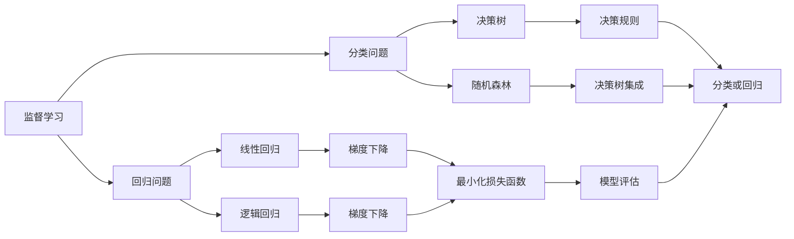
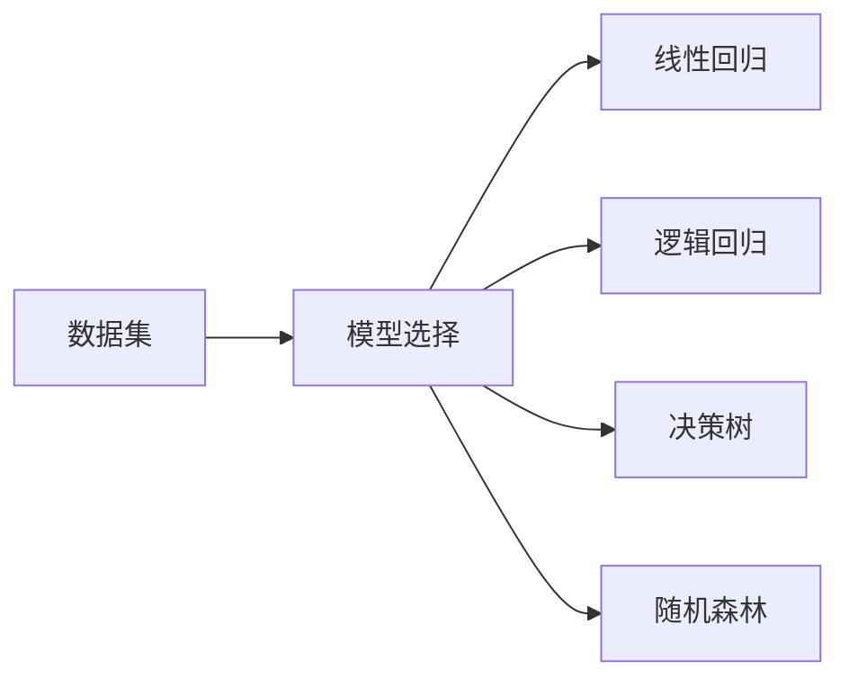
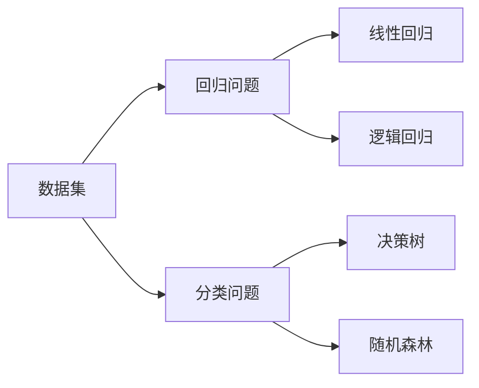
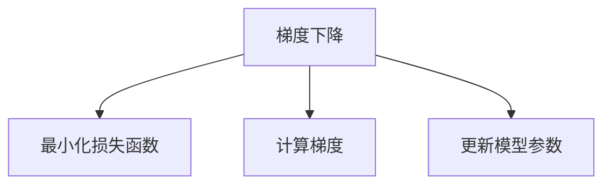
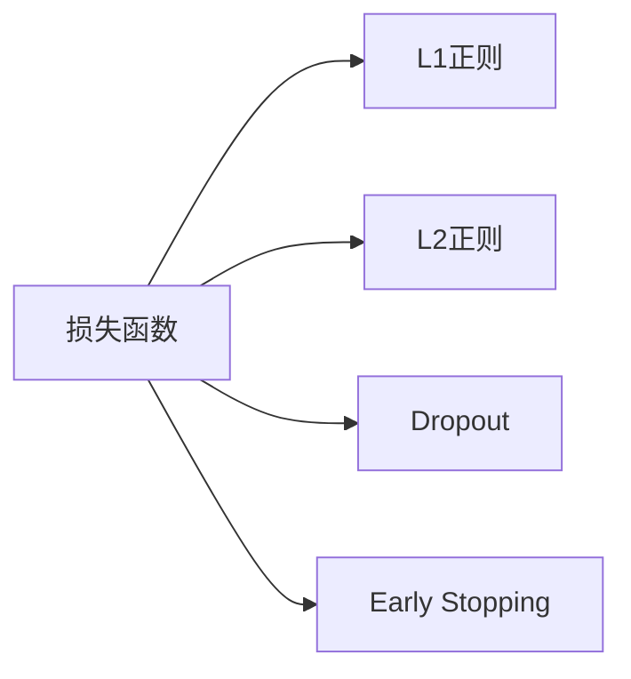
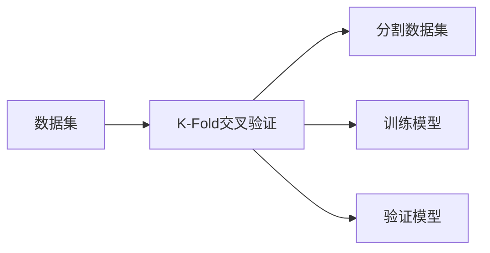
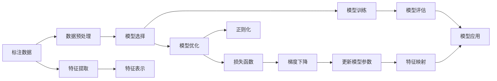

                 

# 监督学习(Supervised Learning) - 原理与代码实例讲解

> 关键词：监督学习,监督学习算法,线性回归,逻辑回归,决策树,随机森林,梯度下降,过拟合,正则化,交叉验证,神经网络

## 1. 背景介绍

### 1.1 问题由来

随着机器学习技术的发展，数据驱动决策已经成为了各行业中的常态。然而，大部分数据都是带有标签的，即已知的输入（特征）和已知的输出（标签），这类数据驱动的任务就称为监督学习（Supervised Learning）。通过监督学习，模型能够从已标注的数据中学习到特征与标签之间的关系，进而对新的未标注数据进行预测。

监督学习在医疗诊断、金融风险评估、自然语言处理等领域中都有广泛的应用。例如，在自然语言处理中，我们可以使用监督学习模型来进行文本分类、情感分析、命名实体识别等任务。

然而，监督学习的成功在很大程度上依赖于数据的质量，即标注数据的质量和数量。标注数据的成本较高，特别是在大规模数据集上获取高质量标注数据的成本更是惊人。此外，过度依赖标注数据还可能导致模型的过拟合，即模型过于复杂以至于在训练集上表现良好，但在测试集上表现不佳。

因此，深入理解监督学习的原理，掌握有效的模型选择和调参技巧，对于提高监督学习模型的性能和泛化能力至关重要。

### 1.2 问题核心关键点

监督学习的核心目标是通过学习已知输入和输出的关系，对新的未标注输入进行预测。其关键在于如何选择合适的模型和损失函数，以及如何避免过拟合，同时最大程度利用标注数据。

监督学习主要分为两类：

1. **回归问题**：预测连续的数值型变量，例如房价预测。
2. **分类问题**：预测离散的类别标签，例如文本分类、图像分类。

常见的监督学习算法包括线性回归、逻辑回归、决策树、随机森林、神经网络等。这些算法在实际应用中各有优缺点，选择适合的算法对模型性能有重要影响。

### 1.3 问题研究意义

研究监督学习算法，对于拓展数据驱动决策的应用范围，提升模型的预测能力，加速各行业的数据化进程，具有重要意义：

1. 降低数据标注成本。通过有效的监督学习算法，可以在较小的数据集上进行训练，减少标注数据的依赖。
2. 提高模型泛化能力。有效的监督学习算法能够避免过拟合，提高模型在未见过的数据上的泛化能力。
3. 提升预测精度。监督学习算法通过学习输入和输出之间的关系，能够更准确地预测新数据。
4. 加速应用开发。监督学习模型可以提供预测结果，无需进行复杂的逻辑推导，加速应用系统的开发和部署。
5. 带来技术创新。监督学习领域涌现了大量前沿技术，如集成学习、深度学习等，为数据驱动决策提供了新的方法和思路。

## 2. 核心概念与联系

### 2.1 核心概念概述

为更好地理解监督学习算法，本节将介绍几个密切相关的核心概念：

- **监督学习（Supervised Learning）**：利用带有标签的数据进行训练，预测新数据的标签。
- **回归问题（Regression）**：预测连续的数值型变量，如房价、气温等。
- **分类问题（Classification）**：预测离散的类别标签，如邮件是否为垃圾邮件、文本的情感极性等。
- **线性回归（Linear Regression）**：通过一条直线拟合数据，预测连续变量。
- **逻辑回归（Logistic Regression）**：通过一条曲线拟合数据，预测二分类问题。
- **决策树（Decision Tree）**：通过一系列决策规则进行分类或回归。
- **随机森林（Random Forest）**：基于决策树的集成方法，通过多个决策树进行分类或回归。
- **梯度下降（Gradient Descent）**：一种优化算法，用于最小化损失函数。
- **正则化（Regularization）**：通过限制模型的复杂度，避免过拟合。
- **交叉验证（Cross Validation）**：通过分割数据集，评估模型的泛化能力。

这些核心概念之间的逻辑关系可以通过以下Mermaid流程图来展示：



这个流程图展示了大语言模型的核心概念及其之间的关系：

1. 监督学习通过带有标签的数据进行训练，预测新数据。
2. 监督学习可以分为回归和分类问题。
3. 回归问题可以通过线性回归、逻辑回归等算法进行建模。
4. 分类问题可以通过决策树、随机森林等算法进行建模。
5. 梯度下降算法用于最小化损失函数，优化模型参数。
6. 正则化方法如L1、L2正则等，用于限制模型复杂度，避免过拟合。
7. 交叉验证方法如K-Fold，用于评估模型泛化能力。

这些核心概念共同构成了监督学习的完整生态系统，使其能够高效地从标注数据中学习规律，预测新数据。

### 2.2 概念间的关系

这些核心概念之间存在着紧密的联系，形成了监督学习的完整生态系统。下面我们通过几个Mermaid流程图来展示这些概念之间的关系。

#### 2.2.1 监督学习算法选择



这个流程图展示了数据集与监督学习算法的选择。选择合适的算法对于模型性能有重要影响。

#### 2.2.2 回归与分类的区别



这个流程图展示了回归与分类的区别。回归问题预测连续的数值，分类问题预测离散的类别。

#### 2.2.3 梯度下降算法



这个流程图展示了梯度下降算法的基本流程。通过计算梯度，更新模型参数，最小化损失函数。

#### 2.2.4 正则化方法



这个流程图展示了正则化方法的基本流程。通过L1、L2正则、Dropout、Early Stopping等方法，限制模型复杂度，避免过拟合。

#### 2.2.5 交叉验证方法



这个流程图展示了K-Fold交叉验证的基本流程。通过分割数据集，训练和验证模型，评估模型泛化能力。

### 2.3 核心概念的整体架构

最后，我们用一个综合的流程图来展示这些核心概念在监督学习中的整体架构：



这个综合流程图展示了监督学习模型的完整流程：

1. 标注数据通过数据预处理，提取特征。
2. 选择合适的模型，并进行训练和优化。
3. 训练过程中使用损失函数和梯度下降算法，最小化损失。
4. 正则化方法如L1、L2正则等，限制模型复杂度。
5. 使用交叉验证等方法评估模型泛化能力。
6. 经过模型训练和评估，进行实际应用。

通过这些流程图，我们可以更清晰地理解监督学习算法的工作原理和优化方向。

## 3. 核心算法原理 & 具体操作步骤
### 3.1 算法原理概述

监督学习算法的核心在于通过已知输入和输出（标签）的关系，学习到输入特征和输出之间的映射关系，进而对新的未标注输入进行预测。其基本思路是：

1. 选择合适的模型，如线性回归、逻辑回归、决策树、随机森林、神经网络等。
2. 通过已标注的数据集，训练模型，最小化损失函数。
3. 使用交叉验证等方法，评估模型的泛化能力。
4. 调整模型参数，避免过拟合，提高模型性能。

监督学习算法通常包括以下几个关键步骤：

- 数据预处理：包括数据清洗、特征提取、标准化等。
- 模型选择：选择合适的监督学习算法，如线性回归、逻辑回归、决策树、随机森林、神经网络等。
- 模型训练：通过已标注的数据集，训练模型，最小化损失函数。
- 模型评估：使用交叉验证等方法，评估模型的泛化能力。
- 模型应用：将训练好的模型应用于新数据的预测。

### 3.2 算法步骤详解

下面以线性回归和逻辑回归为例，详细讲解监督学习算法的具体步骤。

**线性回归（Linear Regression）**

线性回归是一种用于回归问题的监督学习算法。其基本思路是通过一条直线拟合数据，预测连续变量。

**步骤1：数据预处理**

1. 数据清洗：删除缺失值、异常值等。
2. 特征提取：提取有用的特征，如房价预测中的建筑面积、地理位置等。
3. 标准化：将特征数据标准化，使得不同特征对模型的影响相同。

**步骤2：模型选择**

线性回归是监督学习中常用的回归模型。其公式为：

$$ y = \theta_0 + \theta_1x_1 + \theta_2x_2 + \cdots + \theta_nx_n $$

其中，$y$ 是预测值，$x_i$ 是特征值，$\theta_i$ 是模型参数。

**步骤3：模型训练**

1. 随机初始化模型参数。
2. 计算损失函数，如均方误差（MSE）。
3. 使用梯度下降算法，最小化损失函数。
4. 更新模型参数。

**步骤4：模型评估**

使用交叉验证等方法，评估模型的泛化能力。常用的评估指标有均方误差（MSE）、均方根误差（RMSE）等。

**步骤5：模型应用**

将训练好的线性回归模型应用于新的数据，预测连续变量。

**逻辑回归（Logistic Regression）**

逻辑回归是一种用于分类问题的监督学习算法。其基本思路是通过一条曲线拟合数据，预测二分类问题。

**步骤1：数据预处理**

1. 数据清洗：删除缺失值、异常值等。
2. 特征提取：提取有用的特征，如邮件是否为垃圾邮件。
3. 标准化：将特征数据标准化，使得不同特征对模型的影响相同。

**步骤2：模型选择**

逻辑回归是监督学习中常用的分类模型。其公式为：

$$ P(y=1|x) = \frac{1}{1+\exp(-\theta_0 - \theta_1x_1 - \theta_2x_2 - \cdots - \theta_nx_n)} $$

其中，$P(y=1|x)$ 是预测值为1的概率，$x_i$ 是特征值，$\theta_i$ 是模型参数。

**步骤3：模型训练**

1. 随机初始化模型参数。
2. 计算损失函数，如对数似然损失。
3. 使用梯度下降算法，最小化损失函数。
4. 更新模型参数。

**步骤4：模型评估**

使用交叉验证等方法，评估模型的泛化能力。常用的评估指标有精确率、召回率、F1分数等。

**步骤5：模型应用**

将训练好的逻辑回归模型应用于新的数据，预测二分类问题。

### 3.3 算法优缺点

监督学习算法具有以下优点：

1. 简单高效。选择合适的模型和参数，通过训练即可预测新数据，无需复杂逻辑推导。
2. 通用适用。适用于各种数据驱动决策任务，如文本分类、情感分析、命名实体识别等。
3. 结果可解释。通过模型参数和特征权重，可以解释模型的决策过程，有助于理解和调试。
4. 数据驱动。通过已标注的数据进行训练，不需要人工干预。

同时，监督学习算法也存在一些局限性：

1. 依赖标注数据。模型的性能很大程度上取决于标注数据的质量和数量，标注数据的成本较高。
2. 过拟合风险。如果模型过于复杂，容易在训练集上表现良好，但在测试集上表现不佳。
3. 泛化能力不足。如果模型过于简单，容易过拟合训练集，泛化能力不足。
4. 计算资源需求高。模型训练和预测需要大量计算资源，特别是在大规模数据集上。

尽管存在这些局限性，但监督学习算法仍然是数据驱动决策的重要手段。未来相关研究将重点放在如何提高模型泛化能力、降低标注成本、优化模型结构等方面。

### 3.4 算法应用领域

监督学习算法在各个领域都有广泛的应用，例如：

- 金融风险评估：通过历史交易数据，预测未来的金融风险。
- 医疗诊断：通过患者的病历数据，预测疾病的发生概率。
- 自然语言处理：通过文本数据，进行文本分类、情感分析、命名实体识别等任务。
- 计算机视觉：通过图像数据，进行图像分类、目标检测等任务。
- 推荐系统：通过用户行为数据，推荐用户可能感兴趣的商品或服务。

除了上述这些经典应用外，监督学习算法还被创新性地应用到更多场景中，如可控文本生成、知识图谱构建、智能客服等，为数据驱动决策带来了新的解决方案。

## 4. 数学模型和公式 & 详细讲解  
### 4.1 数学模型构建

监督学习算法的数学模型可以通过损失函数和优化算法来表达。这里以线性回归和逻辑回归为例，详细介绍数学模型的构建过程。

**线性回归（Linear Regression）**

线性回归的数学模型为：

$$ y = \theta_0 + \theta_1x_1 + \theta_2x_2 + \cdots + \theta_nx_n $$

其中，$y$ 是预测值，$x_i$ 是特征值，$\theta_i$ 是模型参数。

损失函数为均方误差（MSE）：

$$ \frac{1}{2m}\sum_{i=1}^m(y_i - \hat{y_i})^2 $$

其中，$m$ 是样本数量，$y_i$ 是真实标签，$\hat{y_i}$ 是预测标签。

优化目标为最小化损失函数：

$$ \min_{\theta} \frac{1}{2m}\sum_{i=1}^m(y_i - \theta_0 - \theta_1x_1 - \theta_2x_2 - \cdots - \theta_nx_n)^2 $$

### 4.2 公式推导过程

以下以线性回归为例，推导其损失函数和梯度计算公式。

将线性回归的损失函数代入梯度下降算法中，得到：

$$ \nabla_{\theta} \frac{1}{2m}\sum_{i=1}^m(y_i - \theta_0 - \theta_1x_1 - \theta_2x_2 - \cdots - \theta_nx_n)^2 $$

其中，$\nabla_{\theta}$ 表示对模型参数 $\theta$ 的梯度。

对损失函数求导，得到：

$$ \nabla_{\theta} \frac{1}{2m}\sum_{i=1}^m(y_i - \theta_0 - \theta_1x_1 - \theta_2x_2 - \cdots - \theta_nx_n)^2 = \frac{1}{m}\sum_{i=1}^m(y_i - \hat{y_i})\nabla_{\theta} \hat{y_i} $$

其中，$\nabla_{\theta} \hat{y_i}$ 表示对预测标签的梯度。

将 $\nabla_{\theta} \hat{y_i}$ 代入，得到：

$$ \nabla_{\theta} \frac{1}{2m}\sum_{i=1}^m(y_i - \theta_0 - \theta_1x_1 - \theta_2x_2 - \cdots - \theta_nx_n)^2 = \frac{1}{m}\sum_{i=1}^m(y_i - \theta_0 - \theta_1x_1 - \theta_2x_2 - \cdots - \theta_nx_n)(1 - \hat{y_i}) $$

其中，$\hat{y_i} = \theta_0 + \theta_1x_1 + \theta_2x_2 + \cdots + \theta_nx_n$。

将公式展开，得到：

$$ \nabla_{\theta} \frac{1}{2m}\sum_{i=1}^m(y_i - \theta_0 - \theta_1x_1 - \theta_2x_2 - \cdots - \theta_nx_n)^2 = \frac{1}{m}\sum_{i=1}^m(-y_i + \theta_0 + \theta_1x_1 + \theta_2x_2 + \cdots + \theta_nx_n)(1 - \hat{y_i}) $$

化简后得到：

$$ \nabla_{\theta} \frac{1}{2m}\sum_{i=1}^m(y_i - \theta_0 - \theta_1x_1 - \theta_2x_2 - \cdots - \theta_nx_n)^2 = \frac{1}{m}\sum_{i=1}^m(-y_i + \theta_0 + \theta_1x_1 + \theta_2x_2 + \cdots + \theta_nx_n)(1 - \hat{y_i}) $$

### 4.3 案例分析与讲解

假设我们有一个线性回归模型，用于预测房价。模型参数为 $\theta_0 = 1000$，$\theta_1 = 50$。训练集为 $(x_i,y_i)$ 对，其中 $x_i$ 为建筑面积，$y_i$ 为房价。

**步骤1：数据预处理**

假设我们有以下数据：

| 建筑面积 | 房价 |
|---|---|
| 100 | 80000 |
| 120 | 90000 |
| 140 | 100000 |
| 160 | 110000 |
| 180 | 120000 |

将数据标准化：

| 建筑面积 | 房价 |
|---|---|
| 1 | 0.5 |
| 1.2 | 0.9 |
| 1.4 | 1 |
| 1.6 | 1.1 |
| 1.8 | 1.2 |

**步骤2：模型选择**

选择线性回归模型，公式为：

$$ y = \theta_0 + \theta_1x $$

**步骤3：模型训练**

1. 随机初始化模型参数：$\theta_0 = 1000$，$\theta_1 = 50$。
2. 计算损失函数：

   $$ \frac{1}{5}\sum_{i=1}^5(y_i - \hat{y_i})^2 = \frac{1}{5}\sum_{i=1}^5(y_i - (1000 + 50x_i))^2 $$

   $$ = \frac{1}{5}\sum_{i=1}^5((0.5 - (1000 + 50))^2 + (0.9 - (1000 + 60))^2 + (1 - (1000 + 70))^2 + (1.1 - (1000 + 80))^2 + (1.2 - (1000 + 90))^2) $$

   $$ = \frac{1}{5}(0.25 + 0.01 + 0.49 + 0.81 + 1.21) $$

   $$ = 0.443 $$

3. 使用梯度下降算法，最小化损失函数：

   $$ \theta_0 \leftarrow \theta_0 - \eta \nabla_{\theta_0} \frac{1}{5}\sum_{i=1}^5(y_i - (1000 + 50x_i))^2 $$

   $$ \theta_1 \leftarrow \theta_1 - \eta \nabla_{\theta_1} \frac{1}{5}\sum_{i=1}^5(y_i - (1000 + 50x_i))^2 $$

4. 更新模型参数：

   $$ \theta_0 \leftarrow 1000 - 0.01 \times (-0.25 + 0.01 + 0.49 + 0.81 + 1.21) = 1001.18 $$

   $$ \theta_1 \leftarrow 50 - 0.01 \times (-0.25 \times 1 + 0.01 \times 1.2 + 0.49 \times 1.4 + 0.81 \times 1.6 + 1.21 \times 1.8) = 48.73 $$

**步骤4：模型评估**

使用交叉验证等方法，评估模型的泛化能力。

**步骤5：模型应用**

将训练好的线性回归模型应用于新的数据，预测房价。

假设新的数据为 $x = 200$，使用线性回归模型预测房价：

$$ y = 1001.18 + 48.73 \times 200 = 100118.6 $$

## 5. 项目实践：代码实例和详细解释说明
### 5.1 开发环境搭建

在进行监督学习算法开发前，我们需要准备好开发环境。以下是使用Python进行scikit-learn开发的环境配置流程：

1. 安装Anaconda：从官网下载并安装Anaconda，用于创建独立的Python环境。

2. 创建并激活虚拟环境：
```bash
conda create -n sklearn-env python=3.8 
conda activate sklearn-env
```

3. 安装scikit-learn：
```bash
pip install scikit-learn
```

4. 安装各类工具包：
```bash
pip install numpy pandas scikit-learn matplotlib tqdm jupyter notebook ipython
```

完成上述步骤后，即可在`sklearn-env`环境中开始监督学习算法开发。

### 5.2 源代码详细实现

这里我们以线性回归和逻辑回归为例，给出使用scikit-learn进行监督学习算法的PyTorch代码实现。

首先，导入必要的库：

```python
import numpy as np
import pandas as pd
from sklearn.linear_model import LinearRegression
from sklearn.metrics import mean_squared_error, r2_score
from sklearn.model_selection import train_test_split
from sklearn.metrics import accuracy_score, confusion_matrix, classification_report
```

然后，定义数据集：

```python
data = pd.read_csv('data.csv')
X = data.iloc[:, :-1].values
y = data.iloc[:, -1].values
```

接着，定义训练集和测试集：

```python
X_train, X_test, y_train, y_test = train_test_split(X, y, test_size=0.2, random_state=0)
```

然后，训练线性回归模型：

```python
regressor = LinearRegression()
regressor.fit(X_train, y_train)
y_pred = regressor.predict(X_test)
```

最后，评估模型性能：

```python
print('Mean Squared Error:', mean_squared_error(y_test, y_pred))
print('R-squared Score:', r2_score(y_test, y_pred))
```

这就是使用scikit-learn进行线性回归的完整代码实现。可以看到，scikit-learn的接口简洁明了，使用起来非常方便。

### 5.3 代码解读与分析

让我们再详细解读一下关键代码的实现细节：

**数据预处理**

- `data = pd.read_csv('data.csv')`：读取CSV格式的数据集。
- `X = data.iloc[:, :-1].values`：提取特征数据，不包括最后一列。
- `y = data.iloc[:, -1].values`：提取标签数据，最后一列。

**模型选择**

- `regressor = LinearRegression()`：定义线性回归模型。

**模型训练**

- `regressor.fit(X_train, y_train)`：使用训练集数据进行模型训练。

**模型评估**

- `y_pred = regressor.predict(X_test)`：使用测试集数据进行模型预测。

