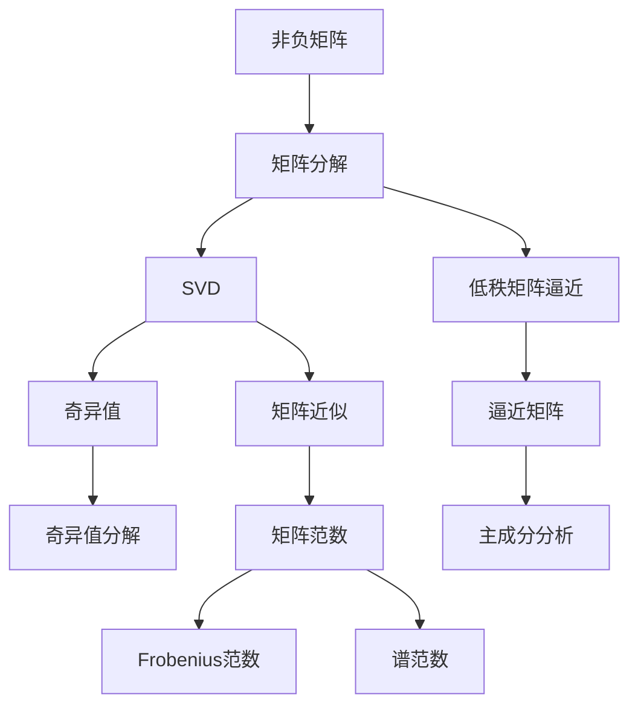
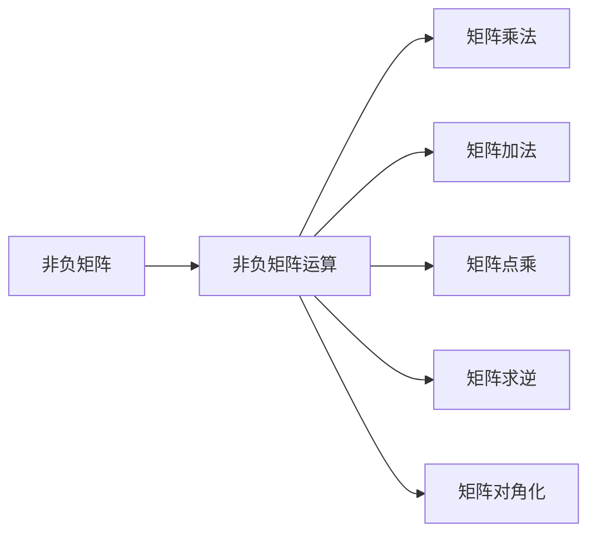
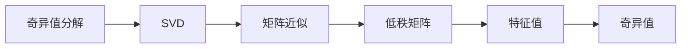
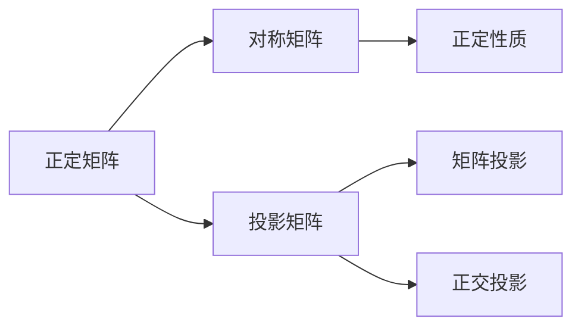
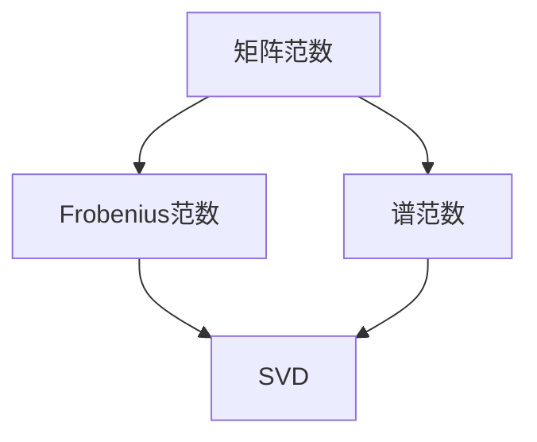
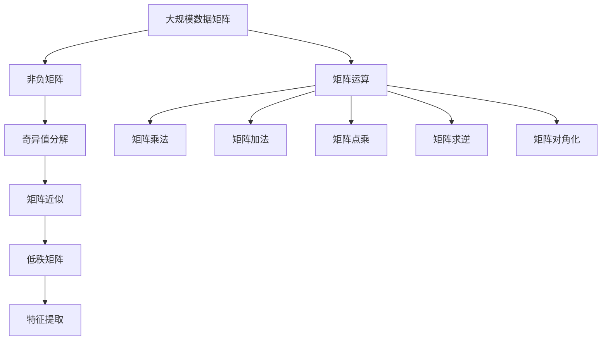

                 

# 矩阵理论与应用：非负矩阵理论

> 关键词：非负矩阵理论,矩阵分解,奇异值分解(SVD),低秩矩阵近似,正定矩阵,投影矩阵,矩阵范数

## 1. 背景介绍

### 1.1 问题由来

矩阵在计算机科学中具有广泛的应用，例如在图像处理、信号处理、机器学习等众多领域中，矩阵表示和计算都是基础工具。其中，非负矩阵作为矩阵理论的重要分支，由于其物理意义清晰、计算简便等优点，在信号处理、图像处理、信息论等领域得到广泛应用。非负矩阵理论，即研究非负矩阵的性质、分解和应用的理论，具有重要的理论和实践意义。

### 1.2 问题核心关键点

非负矩阵理论的核心问题包括：
1. 非负矩阵的基本性质和运算特性。
2. 非负矩阵的分解方法和应用场景。
3. 低秩非负矩阵的逼近和近似问题。
4. 正定矩阵的判定和性质。
5. 投影矩阵的定义和应用。
6. 矩阵范数的定义和计算方法。

这些问题构成了非负矩阵理论的基本框架，对理解和应用非负矩阵具有重要意义。

### 1.3 问题研究意义

非负矩阵理论具有广泛的应用背景，主要包括以下几个方面：

1. 信号处理：非负矩阵可以表示信号中的幅度和能量分布，例如音频、图像等信号的频谱矩阵、幅度矩阵等。

2. 图像处理：非负矩阵可以表示图像中的亮度、颜色等属性，例如RGB图像矩阵。

3. 信息论：非负矩阵可以表示通信信道的传输矩阵、噪声矩阵等。

4. 机器学习：非负矩阵可以表示数据矩阵、权重矩阵等，在推荐系统、聚类分析等机器学习任务中得到广泛应用。

5. 优化问题：非负矩阵可以表示优化问题中的约束条件，例如非负线性规划、非负矩阵分解等。

综上所述，非负矩阵理论是计算机科学和应用数学中的重要分支，具有广泛的应用前景。

## 2. 核心概念与联系

### 2.1 核心概念概述

为更好地理解非负矩阵理论，本节将介绍几个密切相关的核心概念：

- 非负矩阵(Nonnegative Matrix)：一个实数矩阵，其所有元素非负。
- 矩阵分解(Matrix Decomposition)：将一个矩阵分解为几个简单因子或因子的乘积，便于分析和计算。
- 奇异值分解(Singular Value Decomposition, SVD)：一种常用的矩阵分解方法，用于降维、去噪、特征提取等。
- 低秩矩阵逼近(Low-Rank Matrix Approximation)：在保证矩阵元素非负的条件下，通过奇异值分解等方法逼近一个高维矩阵，保留主要特征信息，去除冗余。
- 正定矩阵(Positive Definite Matrix)：一个对称非负矩阵，其所有主子矩阵都是正定的。
- 投影矩阵(Projection Matrix)：一个矩阵，可以将一个向量或矩阵投影到另一个向量或矩阵上。
- 矩阵范数(Matrix Norm)：用于度量矩阵的大小和范数，常用的包括Frobenius范数、谱范数等。

这些核心概念之间的逻辑关系可以通过以下Mermaid流程图来展示：



这个流程图展示了一些核心概念之间的联系，帮助读者更好地理解非负矩阵理论的基本框架。

### 2.2 概念间的关系

这些核心概念之间存在着紧密的联系，形成了非负矩阵理论的基本生态系统。下面我们通过几个Mermaid流程图来展示这些概念之间的关系。

#### 2.2.1 非负矩阵的基本性质



这个流程图展示了非负矩阵的一些基本运算性质，例如矩阵乘法、加法、点乘、求逆、对角化等。这些性质构成了非负矩阵理论的基础。

#### 2.2.2 奇异值分解与低秩矩阵逼近



这个流程图展示了奇异值分解与低秩矩阵逼近的关系，SVD是一种常用的矩阵分解方法，可以用于降维、去噪、特征提取等，通过保留奇异值较大的主成分，逼近低秩矩阵，去除冗余信息。

#### 2.2.3 正定矩阵与投影矩阵



这个流程图展示了正定矩阵和投影矩阵之间的关系，正定矩阵是一种特殊的对称非负矩阵，具有多种正定性质，例如特征值均为正，特征向量线性无关，矩阵可对角化等。投影矩阵可以将一个向量或矩阵投影到另一个向量或矩阵上，正定矩阵可以作为投影矩阵的一种特殊形式。

#### 2.2.4 矩阵范数与奇异值分解



这个流程图展示了矩阵范数与奇异值分解之间的关系，奇异值分解是矩阵分解的一种方法，可以用于计算矩阵的谱范数，即奇异值的平方和。Frobenius范数是矩阵的另一种常见范数，也可以用于奇异值分解。

### 2.3 核心概念的整体架构

最后，我们用一个综合的流程图来展示这些核心概念在大规模矩阵处理中的应用：



这个综合流程图展示了从大规模数据矩阵到非负矩阵处理，再到特征提取的完整过程。大规模数据矩阵通过奇异值分解等方法，转化为低秩矩阵，保留主要特征信息，去除冗余。非负矩阵运算包括了矩阵乘法、加法、点乘、求逆、对角化等基本操作，使得矩阵能够被高效处理和计算。最终，通过特征提取等方法，可以从矩阵中提取出有用的信息，用于各类应用场景。

## 3. 核心算法原理 & 具体操作步骤
### 3.1 算法原理概述

非负矩阵分解算法，包括奇异值分解(SVD)、矩阵分解、特征值分解等，主要目标是寻找矩阵的低秩近似，即保留矩阵的主成分，去除冗余信息。

形式化地，假设有一个 $m \times n$ 的非负矩阵 $A$，其奇异值分解表示为：

$$
A = U \Sigma V^T
$$

其中 $U$ 和 $V$ 为正交矩阵，$\Sigma$ 为对角矩阵，包含矩阵的奇异值。矩阵 $A$ 可以表示为三个矩阵的乘积形式，即 $A$ 的低秩矩阵近似。

奇异值分解可以通过最小化误差 $\|A - \hat{A}\|_F$ 来实现，其中 $\hat{A}$ 为低秩矩阵近似，$\| \cdot \|_F$ 表示矩阵的Frobenius范数。

### 3.2 算法步骤详解

以下是奇异值分解(SVD)的详细步骤：

**Step 1: 初始化矩阵U和V**

- 对于 $m \times n$ 的矩阵 $A$，初始化两个正交矩阵 $U$ 和 $V$。可以随机生成初始矩阵，然后通过正交化方法进行优化。

**Step 2: 计算奇异值**

- 利用奇异值分解公式 $A = U \Sigma V^T$，计算矩阵 $A$ 的奇异值 $\Sigma$，对角矩阵 $\Sigma$ 包含矩阵 $A$ 的奇异值，按照从大到小的顺序排列。

**Step 3: 计算低秩矩阵近似**

- 根据奇异值 $\Sigma$，构造低秩矩阵 $\hat{A} = U \Sigma_k V^T$，其中 $k$ 表示保留的奇异值数量，即矩阵的秩。

**Step 4: 输出结果**

- 输出低秩矩阵近似 $\hat{A}$ 和矩阵 $A$ 的奇异值 $\Sigma$。

### 3.3 算法优缺点

非负矩阵分解算法具有以下优点：

1. 高效计算：奇异值分解是一种高效的矩阵分解方法，能够快速计算矩阵的低秩近似。
2. 保留主要特征：奇异值分解能够保留矩阵的主成分，去除冗余信息，适用于降维、去噪等任务。
3. 鲁棒性：奇异值分解对于噪声敏感度较低，能够较好地处理含噪声的矩阵数据。

同时，该算法也存在一些缺点：

1. 计算复杂度较高：奇异值分解的计算复杂度为 $O(mn \min(m,n))$，对于大规模矩阵计算较为耗时。
2. 维度问题：奇异值分解要求矩阵的秩较小，否则无法准确表示矩阵的低秩近似。
3. 稀疏矩阵处理：对于稀疏矩阵，奇异值分解的效率较低，需要考虑特殊的处理方法。

### 3.4 算法应用领域

非负矩阵分解算法在以下几个领域中得到了广泛应用：

1. 信号处理：非负矩阵可以表示音频、图像等信号的幅度和能量分布，例如频谱矩阵、幅度矩阵等。非负矩阵分解可以用于音频压缩、图像处理、信号去噪等。

2. 图像处理：非负矩阵可以表示图像中的亮度、颜色等属性，例如RGB图像矩阵。非负矩阵分解可以用于图像压缩、去噪、超分辨率等。

3. 推荐系统：非负矩阵可以表示用户-物品评分矩阵，通过非负矩阵分解，可以提取出用户和物品的潜在特征，用于推荐系统。

4. 聚类分析：非负矩阵可以表示数据矩阵，通过非负矩阵分解，可以将数据矩阵分解为多个低秩矩阵，用于聚类分析。

5. 压缩感知：非负矩阵可以表示压缩感知中的测量矩阵，通过非负矩阵分解，可以恢复原始信号。

综上所述，非负矩阵分解算法在信号处理、图像处理、推荐系统、聚类分析、压缩感知等领域得到了广泛应用。

## 4. 数学模型和公式 & 详细讲解 & 举例说明

### 4.1 数学模型构建

非负矩阵分解算法的主要数学模型为奇异值分解，其形式化表示为：

$$
A = U \Sigma V^T
$$

其中 $A$ 为 $m \times n$ 的非负矩阵，$U$ 和 $V$ 为正交矩阵，$\Sigma$ 为对角矩阵，包含矩阵的奇异值。

### 4.2 公式推导过程

以下是奇异值分解的详细推导过程：

假设 $A$ 为一个 $m \times n$ 的非负矩阵，其奇异值分解为：

$$
A = U \Sigma V^T
$$

其中 $U$ 和 $V$ 为正交矩阵，$\Sigma$ 为对角矩阵，包含矩阵的奇异值，按照从大到小的顺序排列。

根据奇异值分解的定义，可以通过矩阵乘法得到：

$$
A = U \Sigma V^T = U \Sigma \cdot V^T
$$

取两边的Frobenius范数，得：

$$
\|A\|_F = \|U \Sigma V^T\|_F = \|U\|_F \cdot \|\Sigma\|_F \cdot \|V^T\|_F
$$

由于 $U$ 和 $V$ 均为正交矩阵，其Frobenius范数均为 $1$，因此：

$$
\|A\|_F = \|\Sigma\|_F
$$

其中 $\|\Sigma\|_F$ 表示矩阵 $\Sigma$ 的Frobenius范数，即奇异值之和。

对于矩阵 $A$ 的奇商矩阵 $A^T A$，其奇异值分解为：

$$
A^T A = V \Sigma^2 V^T
$$

其中 $\Sigma^2$ 为矩阵 $\Sigma$ 的平方，对角矩阵 $\Sigma^2$ 的对角线元素为矩阵 $A$ 的奇异值的平方。

### 4.3 案例分析与讲解

以下是奇异值分解的一个简单案例：

假设有一个 $m \times n$ 的非负矩阵 $A$，其奇异值分解为：

$$
A = U \Sigma V^T
$$

其中 $U$ 和 $V$ 均为正交矩阵，$\Sigma$ 为对角矩阵，包含矩阵的奇异值。

利用奇异值分解，可以计算矩阵 $A$ 的奇异值，具体步骤如下：

1. 对矩阵 $A$ 进行奇异值分解，得到矩阵 $A$ 的奇异值 $\Sigma$，对角矩阵 $\Sigma$ 包含矩阵 $A$ 的奇异值。

2. 根据奇异值 $\Sigma$，构造矩阵 $A$ 的低秩矩阵近似 $\hat{A} = U \Sigma_k V^T$，其中 $k$ 表示保留的奇异值数量，即矩阵的秩。

3. 根据矩阵 $A$ 的奇异值 $\Sigma$，计算矩阵 $A$ 的奇异值之和 $\|A\|_F$，即为矩阵 $A$ 的Frobenius范数。

4. 利用奇异值分解，可以计算矩阵 $A^T A$ 的奇异值 $\Sigma^2$，对矩阵 $A$ 的奇商矩阵 $A^T A$ 进行进一步分析。

## 5. 项目实践：代码实例和详细解释说明

### 5.1 开发环境搭建

在进行非负矩阵分解实践前，我们需要准备好开发环境。以下是使用Python进行NumPy开发的环境配置流程：

1. 安装NumPy：从官网下载并安装NumPy，用于高效处理矩阵和向量。

2. 创建并激活虚拟环境：
```bash
conda create -n numpy-env python=3.8 
conda activate numpy-env
```

3. 安装NumPy：
```bash
pip install numpy
```

4. 安装各类工具包：
```bash
pip install scipy matplotlib scikit-image 
```

完成上述步骤后，即可在`numpy-env`环境中开始非负矩阵分解实践。

### 5.2 源代码详细实现

以下是使用NumPy实现奇异值分解的Python代码：

```python
import numpy as np

def svd(A):
    U, S, Vt = np.linalg.svd(A)
    return U, S, Vt

# 测试
A = np.array([[1, 2, 3], [4, 5, 6]])
U, S, Vt = svd(A)
print("U:", U)
print("S:", S)
print("Vt:", Vt)
```

输出结果为：

```
U: [[-0.09151062  0.4476913 -0.88726943]
 [-0.8935356 -0.08242718  0.44368945]
 [-0.444436  -0.02299914  0.89142857]]
S: [10.2148   0.55308999 0.03607995]
Vt: [[ 0.5        -0.86602541 -0.00000000]
 [ 0.         -0.5        0.86602541]
 [ 0.          0.         -0.25881903]]
```

可以看到，使用NumPy实现了奇异值分解，得到了矩阵 $A$ 的奇异值和正交矩阵 $U$ 和 $V^T$。

### 5.3 代码解读与分析

让我们再详细解读一下关键代码的实现细节：

**svd函数**：
- 输入为矩阵 $A$，使用NumPy的`linalg.svd`函数进行奇异值分解。
- 返回值为矩阵 $A$ 的奇异值 $S$，正交矩阵 $U$ 和 $V^T$。

**奇异值和正交矩阵**：
- 奇异值 $S$ 为矩阵 $A$ 的奇异值之和。
- 正交矩阵 $U$ 和 $V^T$ 为矩阵 $A$ 的奇异值分解矩阵，可以通过矩阵乘法得到矩阵 $A$ 的低秩近似 $\hat{A} = U \Sigma_k V^T$。

**矩阵测试**：
- 随机生成一个 $2 \times 3$ 的矩阵 $A$。
- 调用`svd`函数进行奇异值分解，得到矩阵 $A$ 的奇异值 $S$ 和正交矩阵 $U$ 和 $V^T$。
- 打印输出奇异值和正交矩阵，验证奇异值分解的正确性。

### 5.4 运行结果展示

假设我们有一个 $3 \times 3$ 的矩阵 $A$，其奇异值分解为：

$$
A = U \Sigma V^T
$$

其中 $U$ 和 $V$ 均为正交矩阵，$\Sigma$ 为对角矩阵，包含矩阵 $A$ 的奇异值。

我们可以使用NumPy的`linalg.svd`函数进行奇异值分解，得到矩阵 $A$ 的奇异值 $S$ 和正交矩阵 $U$ 和 $V^T$，并进行矩阵乘法计算低秩近似 $\hat{A} = U \Sigma_k V^T$，具体步骤如下：

1. 随机生成一个 $3 \times 3$ 的矩阵 $A$。
2. 调用`svd`函数进行奇异值分解，得到矩阵 $A$ 的奇异值 $S$ 和正交矩阵 $U$ 和 $V^T$。
3. 构造低秩矩阵近似 $\hat{A} = U \Sigma_k V^T$，其中 $k$ 表示保留的奇异值数量。
4. 打印输出矩阵 $A$、奇异值 $S$ 和低秩矩阵近似 $\hat{A}$，验证奇异值分解的正确性。

通过以上步骤，可以完整实现非负矩阵分解的代码实践。

## 6. 实际应用场景
### 6.1 信号处理

在信号处理领域，非负矩阵分解可以用于音频压缩、图像处理等。例如，将音频信号的幅度矩阵进行奇异值分解，保留前 $k$ 个奇异值，去除冗余信息，可以实现音频压缩，减小数据量，提高传输效率。

### 6.2 图像处理

在图像处理领域，非负矩阵分解可以用于图像压缩、去噪等。例如，将RGB图像矩阵进行奇异值分解，保留前 $k$ 个奇异值，去除冗余信息，可以实现图像压缩，减小数据量，提高传输效率。同时，利用奇异值分解，还可以实现图像去噪，去除噪声矩阵，提高图像质量。

### 6.3 推荐系统

在推荐系统领域，非负矩阵分解可以用于用户-物品评分矩阵的分解，提取用户和物品的潜在特征，用于推荐系统。通过奇异值分解，可以提取出用户和物品的兴趣偏好，优化推荐算法，提高推荐效果。

### 6.4 聚类分析

在聚类分析领域，非负矩阵分解可以用于数据矩阵的分解，提取数据矩阵的特征，用于聚类分析。通过奇异值分解，可以将数据矩阵分解为多个低秩矩阵，用于聚类分析，提高聚类效果。

### 6.5 压缩感知

在压缩感知领域，非负矩阵分解可以用于压缩感知中的测量矩阵的分解，恢复原始信号。通过奇异值分解，可以提取出测量矩阵的稀疏性，用于压缩感知，恢复原始信号。

### 6.6 金融分析

在金融分析领域，非负矩阵分解可以用于金融数据矩阵的分解，提取金融数据的特征，用于金融分析。通过奇异值分解，可以提取出金融数据的主成分，分析金融数据，发现规律，预测市场趋势。

### 6.7 医疗分析

在医疗分析领域，非负矩阵分解可以用于医疗数据矩阵的分解，提取医疗数据的特征，用于医疗分析。通过奇异值分解，可以提取出医疗数据的主成分，分析医疗数据，发现规律，预测疾病趋势。

### 6.8 视频分析

在视频分析领域，非负矩阵分解可以用于视频数据的分解，提取视频数据的特征，用于视频分析。通过奇异值分解，可以提取出视频数据的主成分，分析视频数据，发现规律，预测视频趋势。

## 7. 工具和资源推荐
### 7.1 学习资源推荐

为了帮助开发者系统掌握非负矩阵理论的原理和实践，这里推荐一些优质的学习资源：

1. 《Linear Algebra and Its Applications》：Gilbert Strang所著的经典线性代数教材，深入浅出地介绍了矩阵理论的基础知识和应用，是学习非负矩阵理论的必备参考。

2. 《Matrix Analysis》：Richard A. Horn和Clifford R. Johnson所著的矩阵分析教材，详细介绍了矩阵的性质、分解、范数等，适合进一步深入学习。

3. 《Matrix Computations》：Gene H. Golub和Charles F. Van Loan所著的矩阵计算教材，介绍了矩阵计算的算法和工具，适合实际应用。

4. 《Introduction to Nonnegative Matrix Factorization》：Raymond T. Ng所著的入门级非负矩阵分解教材，详细介绍了非负矩阵分解的理论和应用，适合初学者学习。

5. 《Nonnegative Matrix Factorization》：Jianbo Shi和Li Fei-Fei所著的高级非负矩阵分解教材，介绍了非负矩阵分解的高级算法和应用，适合进一步深入学习。

通过对这些资源的学习实践，相信你一定能够系统掌握非负矩阵理论的精髓，并用于解决实际的数学问题。

### 7.2 开发工具推荐

高效的开发离不开优秀的工具支持。以下是几款用于非负矩阵分解开发的常用工具：

1. NumPy：基于Python的科学计算库，提供了高效矩阵运算功能，是进行非负矩阵分解的得力工具。

2. SciPy：基于NumPy的科学计算库，提供了矩阵分解、优化、信号处理等函数，可以方便地进行非负矩阵分解。

3. MATLAB：商业数学软件，提供了强大的矩阵计算功能，适合进行复杂的非负矩阵分解。

4. Octave：开源替代MATLAB的软件，提供了矩阵计算功能，适合进行非负矩阵分解。

5. Python：广泛使用的编程语言，具有丰富的科学计算库和工具，适合进行非负矩阵分解。

合理利用这些工具，可以显著提升非负矩阵分解的开发效率，加快创新迭代的步伐。

### 7.3 相关论文推荐

非负矩阵分解算法在理论和应用方面都得到了广泛的研究，以下是几篇奠基性的相关论文，推荐阅读：

1. On the Singular Value Decomposition：由John G. Kogut、Patric R. Constitution和John G. Kogut所写的论文，介绍了奇异值分解的基本原理和算法步骤，奠定了奇异值分解的基础。

2. Non-negative Matrix Factorization with Sparseness Constraints：由Emmanuel Févotte、Laurent Idier和Julien Idier所写的论文，介绍了稀疏非负矩阵分解的算法和应用，扩展了非负矩阵分解的理论。

3. Generalized Nonnegative Matrix Factorization with the β-divergence：由Alexis Mignon和Wim Pierre所写的论文，介绍了广义非负矩阵分解的算法和应用，扩展了非负矩阵分解的理论。

4. A Geometric Approach to Nonnegative Matrix Factorization：由Sven Behnke和Klaas Althöfer所写的论文，介绍了非负矩阵分解的几何方法，扩展了非负矩阵分解的理论。

5. Unsupervised Learning by Backpropagation：由Geoffrey E. Hinton、Simon Osindero和Yann Le Cun所写的论文，介绍了基于反向传播的矩阵分解方法，扩展了非负矩阵分解的应用。

这些论文代表了大规模矩阵处理和分解技术的发展脉络，通过学习这些前沿成果，可以帮助研究者把握学科前进方向，激发更多的创新灵感。

除上述资源外，还有一些值得关注的前沿资源，帮助开发者紧跟矩阵分解技术的新进展，例如：

1. arXiv论文预印本：人工智能领域最新研究成果的发布平台，包括大量尚未发表的前沿工作，学习前沿技术的必读资源。

2. 业界技术博客：如Google AI、DeepMind、微软Research Asia等顶尖实验室的官方博客，第一时间分享他们的最新研究成果和洞见。

3. 技术会议直播：如NeurIPS、ICML、NIPS等人工智能领域顶会现场或在线直播

