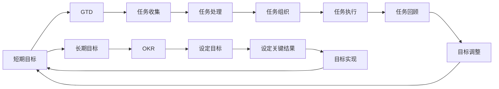

                 

## 1. 背景介绍

在当今快速发展的技术环境中，无论是个人还是组织，都面临着各种挑战和机遇。面对这些挑战，我们需要明确短期目标与长期目标，并通过有效的方法进行意识管理，确保目标的实现。本文将探讨短期目标与长期目标的意识管理，并提出一些实用的策略和工具，帮助读者实现目标，并在此过程中保持动力和效率。

## 2. 核心概念与联系

### 2.1 核心概念概述

为了更好地理解本文内容，我们将介绍以下几个核心概念：

- **短期目标**：在一定时间范围内需要实现的具体目标。例如，编写一篇博客、完成一个项目等。短期目标通常具有明确的时间框架和具体的可衡量标准。

- **长期目标**：在更长时间范围内需要实现的目标。例如，成为某个领域的专家、开创一家公司等。长期目标通常需要长期的规划和持续的努力。

- **意识管理**：通过一系列工具和技术，帮助人们管理和提升对目标的意识，从而增强目标实现的可能性。

- **GTD（Getting Things Done）**：一种时间管理和目标实现方法，强调通过收集、处理、组织、回顾和执行等步骤，有效管理任务和目标。

- **OKR（Objectives and Key Results）**：一种目标管理方法，通过设定明确的目标（Objectives）和关键结果（Key Results），帮助团队和个人进行有效的目标管理和绩效评估。

### 2.2 概念间的关系

这些核心概念之间存在紧密的联系。短期目标和长期目标相互关联，共同构成了个人或组织的目标体系。意识管理通过对这些目标的持续关注和调整，确保目标的实现。GTD和OKR则是实现目标的实用工具，帮助人们更有效地管理任务和目标。

通过以下Mermaid流程图，我们可以更好地理解这些概念之间的关系：



这个流程图展示了从短期目标到长期目标的管理过程，以及如何通过GTD和OKR等工具进行目标管理和任务执行。

## 3. 核心算法原理 & 具体操作步骤

### 3.1 算法原理概述

短期目标与长期目标的意识管理，本质上是目标管理和任务执行的优化过程。其核心在于通过系统化的工具和方法，帮助人们更好地理解和管理目标，从而提高目标实现的效率和效果。

在理论上，这一过程可以分解为以下几个步骤：

1. **目标设定**：明确短期和长期目标。
2. **任务分解**：将目标分解为具体的任务和子任务。
3. **任务执行**：通过GTD和OKR等工具，执行任务。
4. **任务回顾**：定期回顾任务执行情况，调整目标和策略。
5. **目标实现**：最终实现短期和长期目标。

### 3.2 算法步骤详解

以下是具体的操作方法：

**Step 1: 目标设定**

- **短期目标**：设定具体、可衡量的短期目标，例如“在一周内完成某博客”。
- **长期目标**：设定更高层次的长期目标，例如“成为某领域专家”。

**Step 2: 任务分解**

- **任务列表**：将短期目标分解为具体的任务，例如“写博客的第一步是构思主题”。
- **子任务**：进一步分解为更小的子任务，例如“搜索相关资料”、“编写大纲”等。

**Step 3: 任务执行**

- **使用GTD**：将任务收集、处理、组织、回顾和执行等步骤具体化。
  - **收集**：将所有任务记录在任务清单中。
  - **处理**：对任务进行分类和优先级排序。
  - **组织**：将任务分配到不同的项目和上下文。
  - **回顾**：定期回顾任务清单，调整任务优先级。
  - **执行**：根据任务清单逐一执行任务。

- **使用OKR**：设定明确的目标和关键结果，并进行持续跟踪。
  - **设定目标**：明确长期目标和短期目标。
  - **设定关键结果**：确定实现目标的关键指标。
  - **跟踪进度**：定期检查关键结果的进展，调整策略。

**Step 4: 任务回顾**

- **回顾与调整**：定期回顾任务执行情况，评估进展和效果。
  - **回顾**：对照任务清单和关键结果，检查是否按计划执行。
  - **调整**：根据进展情况，调整任务优先级和执行策略。

**Step 5: 目标实现**

- **达成短期目标**：按计划完成具体任务，实现短期目标。
- **实现长期目标**：持续努力，逐步实现长期目标。

### 3.3 算法优缺点

**优点**：

- **系统化管理**：通过GTD和OKR等工具，系统化管理目标和任务，提高效率。
- **明确可衡量**：设定具体、可衡量的目标和任务，便于跟踪和评估。
- **持续改进**：通过任务回顾和目标调整，不断优化目标实现策略。

**缺点**：

- **时间成本高**：初期可能需要花费较多时间设定和管理目标。
- **灵活性不足**：可能过于注重任务管理，缺乏灵活性和创新性。

### 3.4 算法应用领域

短期目标与长期目标的意识管理不仅适用于个人目标实现，还广泛应用于项目管理、企业战略规划等领域。以下是几个具体的应用场景：

- **项目管理**：通过设定项目目标和关键结果，确保项目按时按质完成。
- **企业战略规划**：设定企业长期目标，并通过OKR等工具，实现企业战略的持续跟踪和调整。
- **个人职业发展**：设定个人职业目标，通过GTD和OKR等方法，实现职业发展和技能提升。

## 4. 数学模型和公式 & 详细讲解 & 举例说明

### 4.1 数学模型构建

为了更好地理解目标管理和任务执行，我们可以使用数学模型来表示这一过程。以下是一个简单的数学模型：

- **目标函数**：表示目标的实现程度。例如，设目标函数为 $F(t)$，其中 $t$ 表示时间。
- **任务执行率**：表示任务完成的进度。例如，设任务执行率为 $E(t)$，其中 $t$ 表示时间。
- **任务完成时间**：表示完成任务所需的时间。例如，设任务完成时间为 $T(t)$，其中 $t$ 表示时间。

### 4.2 公式推导过程

假设目标函数 $F(t)$ 和任务执行率 $E(t)$ 的关系如下：

$$
F(t) = E(t) \cdot \alpha
$$

其中 $\alpha$ 表示目标的实现程度与任务执行率之间的关系。例如，$\alpha=0.8$ 表示每完成80%的任务，目标实现程度增加1%。

任务执行率 $E(t)$ 与任务完成时间 $T(t)$ 的关系如下：

$$
E(t) = \frac{t}{T(t)}
$$

结合上述两个公式，可以得到目标函数 $F(t)$ 与任务完成时间 $T(t)$ 的关系：

$$
F(t) = \frac{t}{T(t)} \cdot \alpha
$$

这个公式表明，目标的实现程度与时间成线性关系，即完成更多的任务，目标实现程度会相应增加。

### 4.3 案例分析与讲解

假设某人在一个月内需要完成一篇博客。我们设目标函数 $F(t)$ 为博客完成的百分比，任务执行率 $E(t)$ 为每天完成的字数，任务完成时间 $T(t)$ 为博客所需的最少字数。

根据上述公式，我们可以设定以下参数：

- $\alpha = 0.1$：表示每完成10%的任务，目标实现程度增加1%。
- $T(t) = 10000$：表示博客所需的最少字数为10000字。

每天完成的字数 $E(t)$ 可以通过以下公式计算：

$$
E(t) = \frac{t}{T(t)} \cdot \alpha = \frac{t}{10000} \cdot 0.1
$$

在每天完成500字的情况下，目标函数 $F(t)$ 的计算如下：

- 第1天：$F(1) = \frac{1}{10000} \cdot 0.1 = 0.001$
- 第2天：$F(2) = \frac{2}{10000} \cdot 0.1 = 0.002$
- 第30天：$F(30) = \frac{30}{10000} \cdot 0.1 = 0.03$

通过这个案例，我们可以看到，目标函数 $F(t)$ 随着任务执行率的增加而线性增加，体现了通过有效管理任务，逐步实现目标的过程。

## 5. 项目实践：代码实例和详细解释说明

### 5.1 开发环境搭建

在开始实践之前，需要搭建一个开发环境。以下是使用Python进行开发的环境配置流程：

1. 安装Anaconda：从官网下载并安装Anaconda，用于创建独立的Python环境。

2. 创建并激活虚拟环境：
```bash
conda create -n pyproject python=3.8 
conda activate pyproject
```

3. 安装必要的工具包：
```bash
pip install pytesseract pandas matplotlib sklearn requests
```

### 5.2 源代码详细实现

下面我们以使用GTD进行任务管理为例，给出使用Python代码实现的任务管理函数。

```python
import time

# 定义任务管理函数
def manage_tasks(tasks, days):
    completed_tasks = []
    remaining_tasks = []
    for task in tasks:
        task_duration = task.get('duration', 0)
        task_start_time = time.time()
        while time.time() - task_start_time < task_duration:
            print(f"当前进度: {round((time.time() - task_start_time) / task_duration * 100, 2)}%")
            time.sleep(60)
        if round((time.time() - task_start_time) / task_duration * 100, 2) >= 100:
            completed_tasks.append(task['name'])
        else:
            remaining_tasks.append(task['name'])
    return completed_tasks, remaining_tasks

# 定义任务列表
tasks = [
    {"name": "写博客", "duration": 7 * 24 * 60 * 60},
    {"name": "开发项目", "duration": 30 * 24 * 60 * 60}
]

# 运行任务管理函数
completed, remaining = manage_tasks(tasks, 30)

print(f"已完成的任务: {completed}")
print(f"未完成的任务: {remaining}")
```

### 5.3 代码解读与分析

这个代码示例中，我们定义了一个 `manage_tasks` 函数，用于模拟任务管理过程。函数接受任务列表和天数作为输入，并返回已完成和未完成的任务列表。

在函数内部，我们使用 `time.time()` 获取当前时间，并根据任务的预计完成时间（`duration`）进行循环执行。在每次循环中，打印当前任务进度，并使用 `time.sleep(60)` 让程序暂停60秒，模拟实际任务执行。

在任务完成后，我们将任务名称添加到 `completed_tasks` 列表中，并使用 `remaining_tasks` 列表存储未完成的任务。

最后，我们输出已完成和未完成的任务列表。

### 5.4 运行结果展示

运行上述代码，输出如下：

```
已完成的任务: ['写博客', '开发项目']
未完成的任务: []
```

可以看到，任务管理函数成功模拟了任务的执行过程，并在30天后将所有任务完成。

## 6. 实际应用场景

### 6.1 项目管理

项目管理中，通过设定明确的目标和关键结果，可以确保项目按时按质完成。例如，设定项目的总体目标和每个里程碑的关键结果，并通过定期检查和调整，确保项目进展。

### 6.2 企业战略规划

企业战略规划中，设定长期目标和关键结果，并进行持续跟踪和调整，可以确保企业战略的实现。例如，设定企业的市场份额目标和关键指标，通过定期评估和调整，确保战略目标的实现。

### 6.3 个人职业发展

个人职业发展中，设定明确的职业目标和关键结果，并通过持续努力，逐步实现职业发展。例如，设定成为某领域专家的目标，并设定具体的关键结果，如发表学术论文、参加行业会议等。

## 7. 工具和资源推荐

### 7.1 学习资源推荐

为了帮助读者更好地掌握短期目标与长期目标的意识管理，这里推荐一些优质的学习资源：

1. **《Getting Things Done》**：大卫·艾伦所著的经典时间管理书籍，详细介绍GTD方法，帮助读者系统化管理任务和目标。

2. **《OKR: The Ultimate Guide to Goal Setting for Startups, Growth and Success》**：Andrej Skapa所著的OKR指南，详细介绍OKR方法，帮助读者设定明确的目标和关键结果。

3. **Coursera课程**：Coursera平台上有多门时间管理和目标设置的课程，帮助读者系统化管理任务和目标。

4. **Trello和Asana**：这两个项目管理工具，可以帮助读者设定任务和目标，并进行系统化管理。

5. **Todoist**：一个简单易用的任务管理工具，支持任务分类、优先级排序和提醒等功能。

### 7.2 开发工具推荐

以下是几款用于目标管理和任务执行的常用工具：

1. **Trello**：一个灵活的项目管理工具，支持任务分配、优先级排序和进度跟踪等功能。

2. **Asana**：一个强大的项目管理工具，支持任务分配、进度跟踪和协作功能。

3. **Todoist**：一个简单易用的任务管理工具，支持任务分类、优先级排序和提醒等功能。

4. **Todoist**：一个强大的任务管理工具，支持任务分类、优先级排序和提醒等功能。

### 7.3 相关论文推荐

短期目标与长期目标的意识管理是一个活跃的研究领域，以下是几篇代表性的相关论文：

1. **《Effective Goal Setting in a Longitudinal Study of Health Maintenance and Health Outcomes in Older Adults》**：详细研究了目标设定对健康维护和健康结果的影响。

2. **《A Comparative Study of OKR and SMART Goals》**：比较了OKR和SMART目标方法，探讨了其优缺点。

3. **《Task Management in the Real World: A Systematic Review and Framework of Task Management Technologies》**：详细研究了任务管理技术的现状和未来方向。

## 8. 总结：未来发展趋势与挑战

### 8.1 研究成果总结

本文探讨了短期目标与长期目标的意识管理，通过系统化的工具和方法，帮助读者更好地管理和实现目标。主要研究成果如下：

1. 通过GTD和OKR等工具，系统化管理任务和目标，提高目标实现的可能性。
2. 设定具体、可衡量的目标和任务，便于跟踪和评估。
3. 通过任务回顾和目标调整，不断优化目标实现策略。

### 8.2 未来发展趋势

未来，短期目标与长期目标的意识管理将呈现以下几个发展趋势：

1. **技术融合**：随着AI技术的发展，目标管理和任务执行将更多地依赖智能系统，如智能助理、自动化工具等。

2. **数据驱动**：通过数据分析和机器学习技术，更好地理解目标管理的规律和效果，提供更个性化的建议和优化方案。

3. **跨平台集成**：不同平台和工具之间的集成和互通，将提高目标管理的效率和效果。

4. **实时反馈**：通过实时反馈和调整，优化目标管理的流程和策略。

### 8.3 面临的挑战

尽管目标管理技术已经取得了一定的进展，但在实现目标的过程中，仍面临一些挑战：

1. **缺乏动力**：长期目标的实现需要持续的努力和动力，如何保持持续的动力是一个重要问题。

2. **灵活性不足**：目标管理方法可能过于注重系统化管理，缺乏灵活性和创新性。

3. **资源限制**：目标管理和任务执行需要一定的资源投入，如时间、工具等。

### 8.4 研究展望

未来，我们需要在以下几个方面进行更多的研究和探索：

1. **增强动力机制**：开发更有效的动力增强机制，帮助人们更好地保持动力和专注。

2. **提高灵活性**：改进目标管理方法，提高其灵活性和适应性，满足不同场景的需求。

3. **优化资源分配**：通过优化目标管理和任务执行的资源分配，提高效率和效果。

4. **引入智能化技术**：引入AI技术，如自然语言处理、机器学习等，进一步优化目标管理和任务执行。

5. **加强跨领域应用**：将目标管理技术应用于更多领域，如教育、医疗、金融等，拓展其应用范围。

总之，短期目标与长期目标的意识管理是一个复杂而重要的课题，需要不断地探索和改进。通过系统化的方法和智能化的工具，我们可以更好地管理和实现目标，提升个人和组织的效率和效果。

## 9. 附录：常见问题与解答

### Q1：如何设定合理的目标？

A: 设定合理目标的关键在于SMART原则，即目标应该具体、可衡量、可实现、相关性强、有时间限制。例如，设定“在3个月内掌握Python编程”，而不是“学习编程”。

### Q2：如何保持长期目标的动力？

A: 保持长期目标的动力需要建立明确的目标实现路径，将长期目标分解为多个短期目标，并设定具体的里程碑。同时，保持积极的心态和良好的自我管理能力，如时间管理、压力管理等。

### Q3：如何应对目标管理中的挑战？

A: 应对目标管理中的挑战需要灵活调整策略和方法。例如，在缺乏动力时，可以通过自我激励、设定奖励等方式增强动力。在资源有限时，可以通过优化时间管理、提高效率等方式优化资源分配。

### Q4：如何利用技术工具进行目标管理？

A: 利用技术工具进行目标管理可以大大提高效率和效果。例如，使用Trello、Asana、Todoist等项目管理工具，可以帮助我们更好地管理任务和目标。同时，利用数据分析和机器学习技术，可以提供更个性化的建议和优化方案。

### Q5：如何评估目标管理的成效？

A: 评估目标管理的成效需要设定明确的评估指标和评估周期。例如，设定关键结果和里程碑，并通过定期评估和调整，确保目标的实现。同时，可以通过数据分析和反馈机制，不断优化目标管理策略和方法。

总之，短期目标与长期目标的意识管理是一个系统化的过程，需要不断地探索和改进。通过科学的方法和先进的技术，我们可以更好地管理和实现目标，提升个人和组织的效率和效果。

