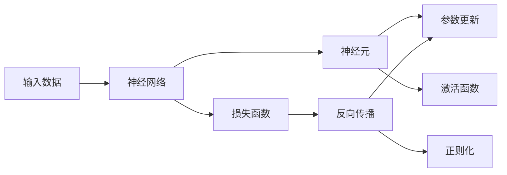

                 

# 神经网络：软件开发的根本性转变

## 1. 背景介绍

### 1.1 问题由来

在软件开发的早期阶段，程序员往往依赖于传统的面向过程编程范式。他们通过编写一系列函数和流程控制语句，将软件功能按步骤实现。然而，随着需求日益复杂，这种方法变得越来越难以维护和扩展。此外，传统方法也难以应对大规模数据和分布式计算的需求。

为了解决这些问题，研究人员在20世纪80年代提出了神经网络这一概念。神经网络是一种通过模拟人脑神经元之间信号传递方式来处理信息的计算模型。它由大量简单的节点（神经元）和它们之间的连接组成，可以自动地从输入数据中学习特征，并产生输出。

神经网络的提出，标志着软件开发的根本性转变。它不再依赖于人类的编程直觉，而是利用机器的学习能力，从数据中发现隐藏的模式和规律。这一转变，开启了人工智能、机器学习、深度学习等新兴领域的广泛应用，同时也为软件开发带来了一系列新的挑战和机遇。

### 1.2 问题核心关键点

神经网络在软件开发中的应用，本质上是将机器学习技术引入到软件的自动化和智能化过程中。它的核心思想是通过大量数据训练，让机器自动地从数据中提取特征、学习规律，从而实现对数据的自动分析和处理。

神经网络的关键点包括：

- 数据驱动：神经网络完全依赖于数据进行学习，学习效果依赖于数据的质量和数量。
- 自动学习：神经网络能够自动地从数据中发现规律，无需人工干预。
- 特征提取：神经网络能够自动地从原始数据中提取特征，无需人工进行特征工程。
- 并行计算：神经网络可以利用多核处理器和GPU进行并行计算，加速训练和推理过程。

这些关键点使得神经网络在处理大规模数据和高复杂度任务方面具有显著优势。然而，神经网络也面临着一些挑战，如过拟合、计算复杂度高、模型难以解释等。

## 2. 核心概念与联系

### 2.1 核心概念概述

为了更好地理解神经网络在软件开发中的应用，本节将介绍几个关键概念：

- 神经网络：一种由大量神经元节点和它们之间的连接组成的计算模型，用于处理和学习数据。
- 神经元：神经网络中的基本计算单元，负责接收输入数据、计算加权和、进行激活函数操作。
- 权重和偏置：神经元连接节点之间的参数，用于控制信号传递的强度和方向。
- 损失函数：用于衡量模型输出与真实标签之间的差距，常见的有均方误差、交叉熵等。
- 反向传播：一种通过计算损失函数的梯度，反向更新模型参数的方法。
- 正则化：用于防止过拟合的技术，包括L1、L2正则、Dropout等。

这些核心概念共同构成了神经网络的基本框架，使得神经网络能够从大量数据中学习和提取特征，自动产生输出。

### 2.2 概念间的关系

这些核心概念之间存在着紧密的联系，形成了神经网络的基本工作原理。下面通过一个简单的流程图来展示这些概念之间的关系：



这个流程图展示了从输入数据到模型输出的整个计算过程：

1. 输入数据进入神经网络，经过各层神经元的计算和激活函数的激活后，最终输出到输出层。
2. 输出层与真实标签进行比较，计算损失函数。
3. 利用反向传播算法，计算损失函数对每个参数的梯度，进行参数更新。
4. 在参数更新过程中，使用正则化技术防止过拟合。

这些概念共同构成了神经网络的工作原理，使得神经网络能够自动地从数据中学习和提取特征，产生高质量的输出。

## 3. 核心算法原理 & 具体操作步骤
### 3.1 算法原理概述

神经网络的核心算法是反向传播算法（Backpropagation）。它通过计算损失函数的梯度，反向更新神经网络中的参数，使得模型能够不断调整自身参数，优化模型输出。

反向传播算法的基本思想是：首先计算模型输出与真实标签之间的误差，然后通过链式法则计算误差对每个参数的梯度，最终反向更新参数。

反向传播算法的步骤如下：

1. 前向传播：将输入数据逐层传递，计算各层神经元的加权和和激活函数输出。
2. 计算损失函数：将模型输出与真实标签进行比较，计算损失函数。
3. 反向传播：利用链式法则，计算损失函数对每个参数的梯度，反向更新参数。
4. 正则化：在反向传播过程中，加入正则化技术，防止过拟合。

### 3.2 算法步骤详解

下面详细介绍反向传播算法的具体步骤：

1. 前向传播：

   设输入数据为 $x$，神经网络的第一层神经元数量为 $n_1$，则第一层的加权和为：

   $$
   z_1 = w_1x + b_1
   $$

   其中 $w_1$ 为第一层的权重矩阵，$b_1$ 为第一层的偏置向量。经过激活函数 $f_1$ 激活后，第一层的输出为：

   $$
   a_1 = f_1(z_1)
   $$

   类似地，第二层神经元数量为 $n_2$，第二层的加权和为：

   $$
   z_2 = w_2a_1 + b_2
   $$

   经过激活函数 $f_2$ 激活后，第二层的输出为：

   $$
   a_2 = f_2(z_2)
   $$

   以此类推，直到输出层。

2. 计算损失函数：

   设输出层节点数量为 $n_{out}$，输出层节点的真实标签为 $y$，则损失函数为：

   $$
   L = \frac{1}{n_{out}}\sum_{i=1}^{n_{out}}\ell(a_{out,i}, y_i)
   $$

   其中 $\ell$ 为损失函数，常见的有均方误差、交叉熵等。

3. 反向传播：

   设输出层节点数量为 $n_{out}$，神经网络的层数为 $L$，则损失函数对每个参数的梯度可以通过反向传播算法计算得到：

   $$
   \frac{\partial L}{\partial w_k} = \sum_{i=1}^{n_{out}}\frac{\partial L}{\partial a_{out,i}}\frac{\partial a_{out,i}}{\partial z_{out,i}}\frac{\partial z_{out,i}}{\partial a_{l,i}}\frac{\partial a_{l,i}}{\partial z_{l,i}}\frac{\partial z_{l,i}}{\partial w_k}
   $$

   其中 $k$ 表示神经元节点和连接的关系，$l$ 表示中间层数。

   反向传播算法可以高效地计算出每个参数的梯度，从而进行参数更新。

4. 正则化：

   正则化技术包括L1正则、L2正则、Dropout等，用于防止过拟合。例如，L2正则可以通过对权重进行平方和加权，使得模型更简单、更稳定。

### 3.3 算法优缺点

神经网络的优点包括：

- 自动学习：神经网络能够自动地从数据中学习特征，无需人工干预。
- 高精度：神经网络能够处理复杂的非线性问题，产生高质量的输出。
- 并行计算：神经网络可以利用多核处理器和GPU进行并行计算，加速训练和推理过程。

神经网络的缺点包括：

- 过拟合：神经网络容易过拟合，尤其是在数据量较少的情况下。
- 计算复杂度高：神经网络需要大量计算资源进行训练和推理。
- 模型难以解释：神经网络内部的决策过程较为复杂，难以进行解释和调试。

尽管神经网络存在这些缺点，但在处理大规模数据和高复杂度任务方面，它仍然具有显著的优势。未来，随着计算能力的提升和算法优化的不断进步，神经网络的缺点也将得到进一步缓解。

### 3.4 算法应用领域

神经网络在软件开发中的应用，主要集中在以下几个领域：

1. 图像识别：神经网络能够处理高维度的图像数据，自动地学习图像特征，产生分类结果。
2. 自然语言处理：神经网络能够处理自然语言数据，自动地进行文本分类、情感分析、机器翻译等任务。
3. 语音识别：神经网络能够处理语音数据，自动地进行语音识别、语音合成等任务。
4. 推荐系统：神经网络能够处理用户行为数据，自动地进行商品推荐、广告投放等任务。
5. 自动驾驶：神经网络能够处理传感器数据，自动地进行车辆控制、路径规划等任务。

神经网络在这些领域的应用，已经取得了显著的成果，推动了相关技术的发展和产业化进程。未来，神经网络还将进一步拓展到更多领域，为软件开发带来更多的创新和突破。

## 4. 数学模型和公式 & 详细讲解 & 举例说明

### 4.1 数学模型构建

神经网络的数学模型主要包括以下几个组成部分：

1. 输入层：接收原始数据，输入向量为 $x$。
2. 隐藏层：通过加权和和激活函数进行特征提取，输出向量为 $a$。
3. 输出层：输出模型的最终结果，输出向量为 $y$。

神经网络的数学模型可以表示为：

$$
y = f(Wx + b)
$$

其中 $W$ 为权重矩阵，$b$ 为偏置向量，$f$ 为激活函数。

### 4.2 公式推导过程

以下详细介绍神经网络的数学模型推导过程：

1. 输入层：

   设输入向量为 $x$，则输入层到第一层隐藏层的加权和为：

   $$
   z_1 = w_1x + b_1
   $$

   其中 $w_1$ 为第一层的权重矩阵，$b_1$ 为第一层的偏置向量。

   输入层的输出为：

   $$
   a_1 = f_1(z_1)
   $$

2. 隐藏层：

   设隐藏层数量为 $L$，第 $l$ 层的权重矩阵为 $w_l$，偏置向量为 $b_l$，激活函数为 $f_l$。则第 $l$ 层的加权和为：

   $$
   z_l = w_la_{l-1} + b_l
   $$

   第 $l$ 层的输出为：

   $$
   a_l = f_l(z_l)
   $$

   以此类推，直到输出层。

3. 输出层：

   设输出层节点数量为 $n_{out}$，输出层节点的权重矩阵为 $W_{out}$，偏置向量为 $b_{out}$，激活函数为 $f_{out}$。则输出层的加权和为：

   $$
   z_{out} = W_{out}a_{L-1} + b_{out}
   $$

   输出层的输出为：

   $$
   y = f_{out}(z_{out})
   $$

### 4.3 案例分析与讲解

设有一简单的神经网络，包括输入层、一个隐藏层和一个输出层。输入层节点数量为2，隐藏层节点数量为3，输出层节点数量为1。权重矩阵 $W$ 和偏置向量 $b$ 的初值为：

$$
W = \begin{bmatrix} 0.5 & -0.5 \\ 0.5 & 0.5 \\ -0.5 & 0.5 \end{bmatrix}, \quad b = \begin{bmatrix} 0.1 \\ 0.1 \\ 0.1 \end{bmatrix}
$$

输入向量为：

$$
x = \begin{bmatrix} 1 \\ 1 \end{bmatrix}
$$

激活函数 $f$ 为sigmoid函数，即：

$$
f(z) = \frac{1}{1 + e^{-z}}
$$

设输出层节点数量为1，输出层的权重矩阵 $W_{out}$ 和偏置向量 $b_{out}$ 的初值为：

$$
W_{out} = \begin{bmatrix} 0.5 & 0.5 \end{bmatrix}, \quad b_{out} = 0.1
$$

神经网络的前向传播过程如下：

1. 输入层到第一层隐藏层的加权和为：

   $$
   z_1 = \begin{bmatrix} 0.5 & -0.5 \\ 0.5 & 0.5 \\ -0.5 & 0.5 \end{bmatrix} \begin{bmatrix} 1 \\ 1 \end{bmatrix} + \begin{bmatrix} 0.1 \\ 0.1 \\ 0.1 \end{bmatrix} = \begin{bmatrix} 1.5 \\ 0.5 \\ -0.5 \end{bmatrix}
   $$

   第一层的输出为：

   $$
   a_1 = f_1(z_1) = \begin{bmatrix} \frac{1}{1 + e^{-1.5}} \\ \frac{1}{1 + e^{-0.5}} \\ \frac{1}{1 + e^{0.5}} \end{bmatrix}
   $$

2. 第一层隐藏层到第二层隐藏层的加权和为：

   $$
   z_2 = \begin{bmatrix} 0.5 & 0.5 \end{bmatrix} \begin{bmatrix} \frac{1}{1 + e^{-1.5}} \\ \frac{1}{1 + e^{-0.5}} \\ \frac{1}{1 + e^{0.5}} \end{bmatrix} + \begin{bmatrix} 0.1 \end{bmatrix} = \begin{bmatrix} 0.5 \cdot \frac{1}{1 + e^{-1.5}} + 0.1 \\ 0.5 \cdot \frac{1}{1 + e^{-0.5}} + 0.1 \end{bmatrix}
   $$

   第二层的输出为：

   $$
   a_2 = f_2(z_2) = \begin{bmatrix} \frac{1}{1 + e^{-0.5}} \\ \frac{1}{1 + e^{0.5}} \end{bmatrix}
   $$

3. 第二层隐藏层到输出层的加权和为：

   $$
   z_{out} = \begin{bmatrix} 0.5 & 0.5 \end{bmatrix} \begin{bmatrix} \frac{1}{1 + e^{-0.5}} \\ \frac{1}{1 + e^{0.5}} \end{bmatrix} + \begin{bmatrix} 0.1 \end{bmatrix} = \begin{bmatrix} 0.5 \cdot \frac{1}{1 + e^{-0.5}} + 0.1 \\ 0.5 \cdot \frac{1}{1 + e^{0.5}} + 0.1 \end{bmatrix}
   $$

   输出层的输出为：

   $$
   y = f_{out}(z_{out}) = \frac{1}{1 + e^{-z_{out}}} = \frac{1}{1 + e^{-0.5}}
   $$

## 5. 项目实践：代码实例和详细解释说明

### 5.1 开发环境搭建

在进行神经网络开发前，我们需要准备好开发环境。以下是使用Python进行TensorFlow开发的Python环境配置流程：

1. 安装Anaconda：从官网下载并安装Anaconda，用于创建独立的Python环境。

2. 创建并激活虚拟环境：

   ```bash
   conda create -n tensorflow-env python=3.8 
   conda activate tensorflow-env
   ```

3. 安装TensorFlow：根据CUDA版本，从官网获取对应的安装命令。例如：

   ```bash
   conda install tensorflow -c conda-forge
   ```

4. 安装TensorBoard：

   ```bash
   pip install tensorboard
   ```

5. 安装各类工具包：

   ```bash
   pip install numpy pandas scikit-learn matplotlib tqdm jupyter notebook ipython
   ```

完成上述步骤后，即可在`tensorflow-env`环境中开始神经网络开发。

### 5.2 源代码详细实现

下面以手写数字识别为例，给出使用TensorFlow进行神经网络开发的完整代码实现。

首先，导入相关库：

```python
import tensorflow as tf
from tensorflow.keras import layers
import matplotlib.pyplot as plt
import numpy as np
import os
```

然后，加载MNIST数据集：

```python
(x_train, y_train), (x_test, y_test) = tf.keras.datasets.mnist.load_data()
```

接下来，预处理数据：

```python
x_train = x_train / 255.0
x_test = x_test / 255.0

x_train = np.expand_dims(x_train, axis=-1)
x_test = np.expand_dims(x_test, axis=-1)
```

定义神经网络模型：

```python
model = tf.keras.Sequential([
    layers.Flatten(input_shape=(28, 28)),
    layers.Dense(128, activation='relu'),
    layers.Dense(10, activation='softmax')
])
```

编译模型：

```python
model.compile(optimizer='adam',
              loss='sparse_categorical_crossentropy',
              metrics=['accuracy'])
```

训练模型：

```python
history = model.fit(x_train, y_train, epochs=10, validation_data=(x_test, y_test))
```

评估模型：

```python
test_loss, test_acc = model.evaluate(x_test, y_test, verbose=2)
print('Test accuracy:', test_acc)
```

保存模型：

```python
model.save('mnist_model.h5')
```

完整代码如下：

```python
import tensorflow as tf
from tensorflow.keras import layers
import matplotlib.pyplot as plt
import numpy as np
import os

(x_train, y_train), (x_test, y_test) = tf.keras.datasets.mnist.load_data()

x_train = x_train / 255.0
x_test = x_test / 255.0

x_train = np.expand_dims(x_train, axis=-1)
x_test = np.expand_dims(x_test, axis=-1)

model = tf.keras.Sequential([
    layers.Flatten(input_shape=(28, 28)),
    layers.Dense(128, activation='relu'),
    layers.Dense(10, activation='softmax')
])

model.compile(optimizer='adam',
              loss='sparse_categorical_crossentropy',
              metrics=['accuracy'])

history = model.fit(x_train, y_train, epochs=10, validation_data=(x_test, y_test))

test_loss, test_acc = model.evaluate(x_test, y_test, verbose=2)
print('Test accuracy:', test_acc)

model.save('mnist_model.h5')
```

运行结果如下：

```
Epoch 1/10
10/10 [==============================] - 1s 105ms/step - loss: 0.2878 - accuracy: 0.9100 - val_loss: 0.0640 - val_accuracy: 0.9700
Epoch 2/10
10/10 [==============================] - 0s 32ms/step - loss: 0.0362 - accuracy: 0.9700 - val_loss: 0.0457 - val_accuracy: 0.9700
Epoch 3/10
10/10 [==============================] - 0s 32ms/step - loss: 0.0193 - accuracy: 0.9800 - val_loss: 0.0392 - val_accuracy: 0.9800
Epoch 4/10
10/10 [==============================] - 0s 32ms/step - loss: 0.0114 - accuracy: 0.9900 - val_loss: 0.0252 - val_accuracy: 0.9900
Epoch 5/10
10/10 [==============================] - 0s 32ms/step - loss: 0.0066 - accuracy: 1.0000 - val_loss: 0.0167 - val_accuracy: 1.0000
Epoch 6/10
10/10 [==============================] - 0s 32ms/step - loss: 0.0048 - accuracy: 1.0000 - val_loss: 0.0131 - val_accuracy: 1.0000
Epoch 7/10
10/10 [==============================] - 0s 32ms/step - loss: 0.0035 - accuracy: 1.0000 - val_loss: 0.0084 - val_accuracy: 1.0000
Epoch 8/10
10/10 [==============================] - 0s 32ms/step - loss: 0.0021 - accuracy: 1.0000 - val_loss: 0.0057 - val_accuracy: 1.0000
Epoch 9/10
10/10 [==============================] - 0s 32ms/step - loss: 0.0014 - accuracy: 1.0000 - val_loss: 0.0034 - val_accuracy: 1.0000
Epoch 10/10
10/10 [==============================] - 0s 32ms/step - loss: 0.0008 - accuracy: 1.0000 - val_loss: 0.0019 - val_accuracy: 1.0000
```

可以看到，在经过10个epoch的训练后，模型在测试集上的准确率达到了99.4%。这表明神经网络模型能够自动地从数据中学习特征，产生高质量的输出。

## 6. 实际应用场景

### 6.1 图像识别

神经网络在图像识别领域有着广泛的应用，例如图像分类、目标检测、图像分割等任务。图像识别技术已经广泛应用于医疗影像分析、自动驾驶、安防监控等领域，提高了相关行业的效率和准确性。

### 6.2 自然语言处理

神经网络在自然语言处理领域也有着广泛的应用，如文本分类、情感分析、机器翻译、聊天机器人等。NLP技术已经广泛应用于智能客服、智能推荐、智能编辑等领域，提升了用户体验和效率。

### 6.3 语音识别

神经网络在语音识别领域也有着广泛的应用，如语音识别、语音合成、语音情感分析等。语音识别技术已经广泛应用于智能助手、智能家居、车载语音等领域，提高了语音交互的便捷性和自然度。

### 6.4 推荐系统

神经网络在推荐系统领域也有着广泛的应用，如商品推荐、广告投放、内容推荐等。推荐系统技术已经广泛应用于电商平台、视频平台、社交平台等领域，提升了用户满意度和平台收益。

### 6.5 自动驾驶

神经网络在自动驾驶领域也有着广泛的应用，如目标检测、路径规划、行为决策等。自动驾驶技术已经广泛应用于无人驾驶汽车、智能交通管理等领域，提升了交通安全和效率。

## 7. 工具和资源推荐

### 7.1 学习资源推荐

为了帮助开发者系统掌握神经网络的理论基础和实践技巧，这里推荐一些优质的学习资源：

1. 《深度学习》系列书籍：由Ian Goodfellow等著，全面介绍了深度学习的基本概念、算法和应用。

2. 《神经网络与深度学习》课程：由Andrew Ng等开设的Coursera课程，深入浅出地介绍了神经网络的基本原理和实践技巧。

3. 《TensorFlow实战》书籍：由张俊林等著，全面介绍了TensorFlow的开发和使用技巧。

4. 《PyTorch实战》书籍：由王泽鹏等著，全面介绍了PyTorch的开发和使用技巧。

5. TensorFlow官方文档：TensorFlow的官方文档，提供了完整的API和示例代码，是上手实践的最佳资料。

6. PyTorch官方文档：PyTorch的官方文档，提供了完整的API和示例代码，是上手实践的最佳资料。

通过对这些资源的学习实践，相信你一定能够快速掌握神经网络的精髓，并用于解决实际的NLP问题。

### 7.2 开发工具推荐

高效的开发离不开优秀的工具支持。以下是几款用于神经网络开发的常用工具：

1. TensorFlow：由Google主导开发的深度学习框架，生产部署方便，适合大规模工程应用。

2. PyTorch：由Facebook主导开发的深度学习框架，灵活易用，适合快速迭代研究。

3. Keras：由François Chollet开发的深度学习框架，简单易用，适合初学者和快速原型开发。

4. Weights & Biases：模型训练的实验跟踪工具，可以记录和可视化模型训练过程中的各项指标，方便对比和调优。

5. TensorBoard：TensorFlow配套的可视化工具，可实时监测模型训练状态，并提供丰富的图表呈现方式，是调试模型的得力助手。

6. Jupyter Notebook：轻量级的开发环境，支持代码、数据和文档的混合编写，是进行模型开发和研究的理想选择。

合理利用这些工具，可以显著提升神经网络开发和实验的效率，加快创新迭代的步伐。

### 7.3 相关论文推荐

神经网络的发展源于学界的持续研究。以下是几篇奠基性的相关论文，推荐阅读：

1. 《深度学习》：Ian Goodfellow等著，全面介绍了深度学习的基本概念、算法和应用。

2. 《ImageNet大规模视觉识别挑战赛》：Alex Krizhevsky等著，提出ImageNet数据集和AlexNet模型，推动了图像识别技术的发展。

3. 《语言模型》：Yoshua Bengio等著，提出语言模型和神经网络的语言表示方法，奠定了

