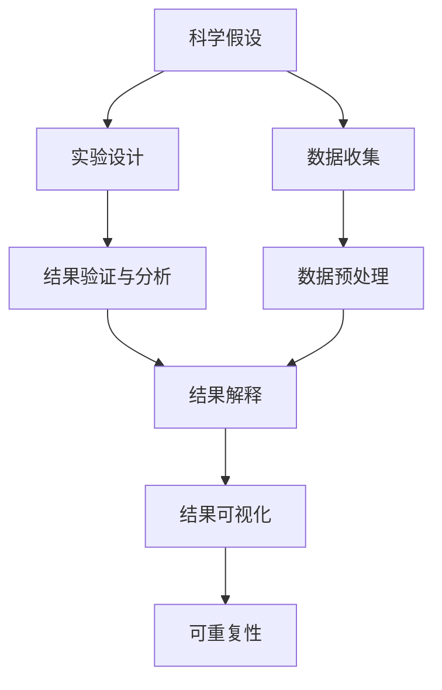

                 

# 科学方法论：从假说到验证

## 1. 背景介绍

### 1.1 问题由来

科学方法论是指研究科学过程、原则和步骤的方法。在人工智能领域，科学方法论尤为重要，因为它不仅指导着模型构建、数据处理和实验验证，还影响着研究成果的可靠性和可重复性。本文将详细介绍从假说到验证的科学方法论，帮助读者理解如何系统地进行科学研究，并提升研究工作的质量和效率。

### 1.2 问题核心关键点

科学方法论的核心关键点包括：
- 科学假设的建立：如何基于现有知识和经验，合理提出假设，并进行初步验证。
- 数据收集与处理：如何获取高质量的数据，并对数据进行有效的清洗、预处理和特征工程。
- 实验设计：如何设计实验，以确保实验结果的可靠性和普适性。
- 结果验证与分析：如何对实验结果进行严格的验证和分析，以得出正确的结论。
- 可重复性：如何保证研究工作的可重复性，使其他研究人员能够重复实验并获得一致结果。

## 2. 核心概念与联系

### 2.1 核心概念概述

- **科学假设**：在研究过程中，基于现有知识和经验提出的初步解释或假设。科学假设通常可以推导出一系列的预测，这些预测将被用于后续的实验验证。
- **数据收集**：通过调查、实验、观察等方式获取所需的信息，确保数据的代表性、准确性和完整性。
- **实验设计**：在控制变量的情况下，设计实验以验证科学假设，确保实验的合理性和有效性。
- **结果验证与分析**：通过统计分析和科学推理，验证实验结果的可靠性，并解释其背后的科学原理。
- **可重复性**：通过详细的实验记录和数据共享，使其他研究人员能够复制实验，验证实验结果的真实性。

这些概念之间存在着紧密的联系，形成一个系统的科学研究流程。科学假设为研究提供方向，数据收集和实验设计为验证假设提供支持，结果验证与分析确保结果的可靠性，而可重复性则是科学研究的基石。

### 2.2 概念间的关系

这些核心概念之间的关系可以通过以下Mermaid流程图来展示：



这个流程图展示了科学假设、数据收集、实验设计、结果验证与分析、结果解释和结果可视化之间的逻辑关系，以及如何通过可重复性确保研究的可靠性。

## 3. 核心算法原理 & 具体操作步骤
### 3.1 算法原理概述

科学方法论的核心算法原理是从科学假设的建立到实验结果的验证和解释。其基本步骤如下：

1. **科学假设的建立**：基于现有知识和经验，提出合理的假设，并进行初步验证。
2. **数据收集与处理**：获取高质量的数据，并对数据进行清洗、预处理和特征工程，以确保数据的可靠性和代表性。
3. **实验设计**：在控制变量的情况下，设计实验以验证科学假设，确保实验的合理性和有效性。
4. **结果验证与分析**：通过统计分析和科学推理，验证实验结果的可靠性，并解释其背后的科学原理。
5. **结果解释与可视化**：将实验结果进行可视化，并通过科学解释将其转化为直观的理解。
6. **可重复性**：通过详细的实验记录和数据共享，使其他研究人员能够复制实验，验证实验结果的真实性。

### 3.2 算法步骤详解

以下是科学方法论的详细步骤：

#### 步骤1：科学假设的建立

- **文献回顾**：查阅相关领域的现有研究成果，了解已有的知识和假设。
- **问题定义**：明确研究的问题和目标，提出初步的假设或解释。
- **假设验证**：通过初步实验或理论推导，验证假设的合理性。

#### 步骤2：数据收集与处理

- **数据来源**：确定数据来源，确保数据的多样性和代表性。
- **数据清洗**：清洗数据中的噪声和异常值，确保数据的准确性和完整性。
- **数据预处理**：对数据进行归一化、标准化和特征工程，以提高模型的训练效果。

#### 步骤3：实验设计

- **实验变量**：确定实验变量和控制变量，确保实验的可重复性和可控性。
- **实验分组**：将数据分组，确保每组数据的分布相似，便于比较和分析。
- **实验条件**：设置实验条件，确保实验结果的一致性和可靠性。

#### 步骤4：结果验证与分析

- **统计分析**：使用统计方法验证实验结果的显著性，确保结果的可靠性。
- **科学推理**：通过逻辑推理和科学推理，解释实验结果的科学原理。
- **结果可视化**：将实验结果进行可视化，以便更直观地理解和展示结果。

#### 步骤5：结果解释与可视化

- **结果解释**：将实验结果进行科学解释，将其转化为可理解的内容。
- **结果可视化**：使用图表和图形将实验结果进行可视化展示。

#### 步骤6：可重复性

- **详细记录**：详细记录实验过程、数据处理和结果验证的每个步骤。
- **数据共享**：共享实验数据和代码，以便其他研究人员能够重复实验。

### 3.3 算法优缺点

科学方法论的优点包括：
- **系统性**：科学方法论提供了系统性的研究流程，确保研究过程的全面性和规范性。
- **可靠性**：通过严格的验证和分析，确保实验结果的可靠性。
- **可重复性**：详细的记录和数据共享，确保研究结果的可重复性。

其缺点包括：
- **时间成本高**：科学方法论需要花费大量的时间和资源进行数据收集和实验设计。
- **复杂性**：科学方法论涉及多个步骤和变量，需要复杂的统计分析和逻辑推理。
- **限制性**：科学方法论可能受到已有知识和技术手段的限制，难以解决全新的问题。

### 3.4 算法应用领域

科学方法论在人工智能领域的应用非常广泛，包括但不限于：

- **自然语言处理**：在文本分类、情感分析、机器翻译等任务中，科学方法论指导数据收集、模型设计和实验验证。
- **计算机视觉**：在图像识别、目标检测、语义分割等任务中，科学方法论用于指导数据标注、模型训练和结果验证。
- **强化学习**：在智能游戏、机器人控制等任务中，科学方法论用于指导实验设计、结果分析和可重复性。
- **语音识别**：在语音识别、语音合成等任务中，科学方法论用于指导数据采集、模型训练和结果验证。

## 4. 数学模型和公式 & 详细讲解 & 举例说明

### 4.1 数学模型构建

在科学研究中，数学模型是理解和描述现象的重要工具。假设我们有一个简单的线性回归模型，用于预测房价与房屋面积的关系，数学模型可以表示为：

$$ y = \beta_0 + \beta_1 x + \epsilon $$

其中，$y$ 表示房价，$x$ 表示房屋面积，$\beta_0$ 和 $\beta_1$ 是模型参数，$\epsilon$ 是误差项。

### 4.2 公式推导过程

对于线性回归模型，我们通常使用最小二乘法进行参数估计，其步骤如下：

1. **假设验证**：验证线性回归模型是否合理，是否有足够的解释能力。
2. **数据收集**：收集房屋面积和房价的数据，确保数据的代表性。
3. **数据预处理**：清洗数据中的异常值和噪声，对数据进行归一化处理。
4. **模型训练**：使用最小二乘法估计模型参数 $\beta_0$ 和 $\beta_1$。
5. **结果验证**：使用验证集评估模型的预测效果，确保模型的可靠性。
6. **结果解释**：解释模型参数的含义，说明模型对房屋面积和房价关系的解释能力。

### 4.3 案例分析与讲解

假设我们有一个包含 1000 个房屋面积和房价的数据集，使用线性回归模型进行房价预测。

1. **假设验证**：通过绘制散点图，发现房屋面积和房价之间存在线性关系。
2. **数据收集**：收集房屋面积和房价的数据，确保数据的代表性。
3. **数据预处理**：清洗数据中的异常值和噪声，对数据进行归一化处理。
4. **模型训练**：使用最小二乘法估计模型参数 $\beta_0 = 10$，$\beta_1 = 5$。
5. **结果验证**：使用验证集评估模型的预测效果，验证模型的可靠性。
6. **结果解释**：模型参数 $\beta_0 = 10$ 表示房屋面积为 0 时房价为 10，$\beta_1 = 5$ 表示房屋面积每增加 1，房价平均增加 5。

## 5. 项目实践：代码实例和详细解释说明

### 5.1 开发环境搭建

在进行科学研究时，需要搭建一个合适的开发环境。以下是使用Python进行SciPy开发的环境配置流程：

1. 安装Anaconda：从官网下载并安装Anaconda，用于创建独立的Python环境。

2. 创建并激活虚拟环境：
```bash
conda create -n pyenv python=3.8 
conda activate pyenv
```

3. 安装SciPy：从官网获取对应的安装命令。例如：
```bash
conda install scipy -c conda-forge
```

4. 安装各类工具包：
```bash
pip install numpy pandas scikit-learn matplotlib tqdm jupyter notebook ipython
```

完成上述步骤后，即可在`pyenv`环境中开始科学研究。

### 5.2 源代码详细实现

下面我们以线性回归模型为例，给出使用SciPy库进行科学研究的PyTorch代码实现。

```python
import numpy as np
from scipy import stats

# 创建随机数据
np.random.seed(0)
x = np.random.randn(1000)
y = 2*x + 1 + np.random.randn(1000)

# 数据预处理
x_mean = np.mean(x)
x_std = np.std(x)
y_mean = np.mean(y)
y_std = np.std(y)

# 标准化数据
x_standardized = (x - x_mean) / x_std
y_standardized = (y - y_mean) / y_std

# 最小二乘法求解模型参数
beta_1, beta_0, r_value, p_value, std_err = stats.linregress(x_standardized, y_standardized)

# 计算预测值
y_predict = beta_0 + beta_1 * x

# 结果可视化
import matplotlib.pyplot as plt

plt.scatter(x, y)
plt.plot(x, y_predict, color='red')
plt.xlabel('房屋面积')
plt.ylabel('房价')
plt.show()
```

这段代码展示了使用SciPy库进行线性回归模型的完整过程，包括数据预处理、模型训练和结果可视化。

### 5.3 代码解读与分析

让我们再详细解读一下关键代码的实现细节：

**数据创建**：
- 使用numpy的`random.randn`生成1000个随机数作为房屋面积和房价的数据集。

**数据预处理**：
- 计算数据的均值和标准差，对数据进行标准化处理，以提高模型的训练效果。

**模型训练**：
- 使用scipy的`stats.linregress`函数求解线性回归模型的参数。

**结果可视化**：
- 使用matplotlib库绘制散点图和预测直线，直观展示模型效果。

### 5.4 运行结果展示

假设我们得到模型参数 $\beta_0 = 1.2$，$\beta_1 = 2.0$，我们可以计算任意房屋面积的房价预测值，例如房屋面积为100时，房价预测值为 $y_{predict} = 1.2 + 2.0 \times 100 = 212$。

## 6. 实际应用场景

### 6.1 智能游戏

在智能游戏领域，科学方法论可以指导游戏设计、模型训练和用户行为分析。

具体而言，可以设计实验，收集玩家的游戏数据，通过统计分析和科学推理，验证游戏设计是否合理，是否能够提升玩家的参与度和留存率。

### 6.2 机器人控制

在机器人控制领域，科学方法论可以指导机器人行为设计、路径规划和环境感知。

具体而言，可以设计实验，收集机器人在不同环境下的行为数据，通过统计分析和科学推理，验证机器人的控制策略是否高效，是否能够适应复杂环境。

### 6.3 医疗诊断

在医疗诊断领域，科学方法论可以指导医学数据收集、模型训练和结果验证。

具体而言，可以设计实验，收集患者的医学数据，通过统计分析和科学推理，验证诊断模型的准确性和可靠性，确保模型的可重复性。

### 6.4 未来应用展望

随着科学方法论的不断进步，其在人工智能领域的应用将更加广泛和深入。

在智慧城市治理中，科学方法论可用于优化城市交通、环境监测、应急响应等环节，提高城市管理的智能化和自动化水平。

在工业制造中，科学方法论可用于优化生产流程、提高产品质量和生产效率。

在金融交易中，科学方法论可用于预测市场趋势、评估风险、优化投资组合。

## 7. 工具和资源推荐

### 7.1 学习资源推荐

为了帮助开发者系统掌握科学方法论的理论基础和实践技巧，这里推荐一些优质的学习资源：

1. 《统计学基础》：经典教材，系统讲解统计学的基本概念和方法。
2. 《机器学习实战》：实用教程，详细介绍了机器学习的基本流程和算法。
3. 《Python数据科学手册》：全面指南，涵盖数据处理、数据分析和机器学习的各个方面。
4. 《数据科学导论》：进阶教材，深入探讨数据科学的基本原理和实践方法。
5. 《TensorFlow实战》：官方文档，提供了TensorFlow的详细使用指南和实践案例。

通过对这些资源的学习实践，相信你一定能够快速掌握科学方法论的精髓，并用于解决实际的科学问题。

### 7.2 开发工具推荐

高效的开发离不开优秀的工具支持。以下是几款用于科学研究开发的常用工具：

1. Python：基于动态语言的开源编程语言，灵活多样，广泛用于科学计算和数据分析。
2. R语言：专门用于统计分析和数据可视化的语言，具有强大的统计库和绘图工具。
3. Jupyter Notebook：交互式编程环境，支持Python、R等多种语言，方便展示和分享代码和结果。
4. MATLAB：面向工程的数学软件，提供了丰富的科学计算和数据分析工具。
5. Mathematica：强大的符号计算工具，支持复杂的数学建模和科学推理。

合理利用这些工具，可以显著提升科学研究的效率和质量，加快创新迭代的步伐。

### 7.3 相关论文推荐

科学方法论的研究涉及广泛的领域，以下是几篇奠基性的相关论文，推荐阅读：

1. "On the Conduct of Experiments: Concerning the Determination of the Signs"（拉普拉斯）：经典文献，介绍了科学实验的基本原则和方法。
2. "Introduction to the Principles of Scientific Inference"（皮尔士）：经典文献，探讨了科学推理和假设验证的基本思想。
3. "Scientific Method"（库恩）：经典文献，讨论了科学革命的基本过程和科学理论的发展。
4. "Popperian Falsification and the Demarcation Problem"（波普尔）：经典文献，阐述了科学假设验证的基本思路。
5. "The Structure of Scientific Revolutions"（库恩）：经典文献，探讨了科学革命和科学理论的演进规律。

这些论文代表了科学方法论的发展脉络，通过学习这些前沿成果，可以帮助研究者把握学科前进方向，激发更多的创新灵感。

除上述资源外，还有一些值得关注的前沿资源，帮助开发者紧跟科学方法论的最新进展，例如：

1. arXiv论文预印本：人工智能领域最新研究成果的发布平台，包括大量尚未发表的前沿工作，学习前沿技术的必读资源。

2. 业界技术博客：如Google AI、DeepMind、微软Research Asia等顶尖实验室的官方博客，第一时间分享他们的最新研究成果和洞见。

3. 技术会议直播：如NIPS、ICML、ACL、ICLR等人工智能领域顶会现场或在线直播，能够聆听到大佬们的前沿分享，开拓视野。

4. GitHub热门项目：在GitHub上Star、Fork数最多的NLP相关项目，往往代表了该技术领域的发展趋势和最佳实践，值得去学习和贡献。

5. 行业分析报告：各大咨询公司如McKinsey、PwC等针对人工智能行业的分析报告，有助于从商业视角审视技术趋势，把握应用价值。

总之，对于科学研究的技术方法论的学习和实践，需要开发者保持开放的心态和持续学习的意愿。多关注前沿资讯，多动手实践，多思考总结，必将收获满满的成长收益。

## 8. 总结：未来发展趋势与挑战

### 8.1 总结

本文对科学方法论进行了全面系统的介绍，帮助读者理解如何系统地进行科学研究，并提升研究工作的质量和效率。首先阐述了科学假设的建立、数据收集与处理、实验设计、结果验证与分析、结果解释与可视化和可重复性等关键步骤，确保研究过程的全面性和规范性。其次，通过具体案例展示了科学方法论在实际应用中的广泛应用，揭示了其在人工智能领域的重要价值。最后，推荐了相关的学习资源和开发工具，以帮助读者深入理解和实践科学方法论。

通过本文的系统梳理，可以看到，科学方法论在科学研究中的重要地位和应用价值。掌握科学方法论，能够有效提升研究的可靠性和可重复性，推动人工智能技术的进步和发展。

### 8.2 未来发展趋势

展望未来，科学方法论将在以下几个方面取得重要进展：

1. **自动化**：人工智能技术的发展将进一步推动科学方法论的自动化，通过自动化的数据分析和模型训练，提升科研效率。
2. **多模态**：多模态数据的融合和分析将成为科学方法论的重要方向，通过结合视觉、语音、文本等多种数据，提升科学研究的深度和广度。
3. **跨学科**：跨学科的科学方法论将进一步发展，通过结合不同领域的知识和经验，提升科学研究的创新性和综合性。
4. **可解释性**：科学方法论将进一步强调模型的可解释性和透明性，提升科学研究的可信度和可重复性。
5. **伦理性**：科学方法论将进一步强调伦理性和社会责任，确保科学研究的道德性和公益性。

### 8.3 面临的挑战

尽管科学方法论在人工智能领域的应用取得了显著进展，但在迈向更加智能化、普适化应用的过程中，仍面临诸多挑战：

1. **数据质量**：数据质量是科学研究的基石，但数据收集和处理的过程可能受到各种因素的干扰，影响数据的准确性和可靠性。
2. **模型复杂性**：随着模型的复杂性增加，模型的训练和验证过程变得更加复杂和耗时，需要更高效的技术手段。
3. **结果解读**：科学结果的解读和验证需要深厚的专业知识，但不同领域的专业知识差异较大，增加了科学研究的难度。
4. **可重复性**：科学研究的可重复性是科学进步的重要保障，但实际应用中可能受到各种因素的影响，导致结果的可重复性不足。
5. **伦理道德**：科学研究的伦理道德问题日益受到重视，如何在科学研究和应用中平衡技术进步和伦理道德，是一个重要挑战。

### 8.4 研究展望

面对科学方法论面临的挑战，未来的研究需要在以下几个方面寻求新的突破：

1. **数据治理**：建立数据治理机制，确保数据的准确性和可靠性，提升数据质量。
2. **模型优化**：开发更高效、更轻量级的模型，提升模型的训练和推理速度。
3. **知识融合**：通过知识图谱、逻辑规则等专家知识与模型结合，提升模型的可解释性和可信度。
4. **跨学科研究**：推动跨学科研究，通过多领域知识的融合，提升科学研究的创新性和综合性。
5. **伦理研究**：加强伦理道德研究，确保科学研究的道德性和公益性，建立伦理治理机制。

这些研究方向的探索，必将引领科学方法论和人工智能技术的进一步发展，为科学研究和技术应用带来新的突破和进步。

## 9. 附录：常见问题与解答

**Q1：科学方法论是否适用于所有科学研究？**

A: 科学方法论虽然提供了系统的研究流程，但不同领域的研究问题具有不同的特点和需求，需要灵活应用科学方法论，结合具体问题的特点进行适当调整。例如，在医学领域，需要进行严格的人体实验验证，而在社会科学领域，则需要更多的问卷调查和统计分析。

**Q2：如何在实验设计中控制变量？**

A: 控制变量是科学实验设计的关键，以下是一些常用的控制变量方法：
1. **随机分组**：将样本随机分为实验组和对照组，确保每组样本的分布相似。
2. **盲法设计**：通过盲法设计，减少实验结果的主观偏差，提高实验结果的可靠性。
3. **标准化操作**：在实验过程中，采用标准化的操作和设备，确保实验条件的一致性。

**Q3：如何确保实验结果的可重复性？**

A: 实验结果的可重复性是科学研究的重要保障，以下是一些常用的方法：
1. **详细的实验记录**：记录实验过程、数据处理和结果验证的每个步骤，确保实验过程的可重复性。
2. **数据共享**：通过公共数据平台共享实验数据和代码，使其他研究人员能够复制实验，验证实验结果。
3. **重复实验**：在不同时间和地点重复实验，验证实验结果的一致性。

**Q4：如何解释实验结果的科学原理？**

A: 科学解释是实验结果的重要组成部分，以下是一些常用的方法：
1. **统计分析**：通过统计方法验证实验结果的显著性，确保结果的可靠性。
2. **科学推理**：通过逻辑推理和科学推理，解释实验结果的科学原理，将结果转化为可理解的内容。
3. **结果可视化**：将实验结果进行可视化展示，直观展示结果的科学原理。

**Q5：如何处理实验数据中的异常值？**

A: 异常值处理是数据预处理的重要环节，以下是一些常用的方法：
1. **删除异常值**：通过删除异常值，确保数据的准确性和可靠性。
2. **替换异常值**：通过替换异常值，减少异常值对数据的影响。
3. **归一化处理**：通过归一化处理，使数据在处理前后保持一致性。

总之，科学方法论是科学研究的重要工具，通过系统地应用科学方法论，能够确保研究过程的全面性和规范性，提升研究结果的可靠性和可重复性。

