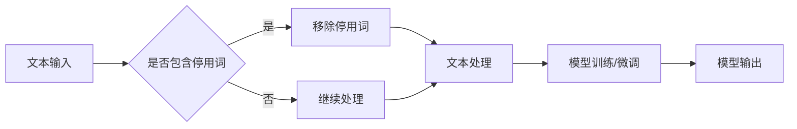

> 关键词：大模型，微调，停用词，文本处理，自然语言处理，NLP，模型优化

# 从零开始大模型开发与微调：停用词的使用

在自然语言处理（NLP）领域，停用词是一个被广泛讨论的话题。停用词通常是指那些在文本中频繁出现，但对文本内容贡献较小的词汇，如"the"、"is"、"in"等。在处理大规模语言模型（Large Language Model, LLM）时，合理使用停用词对于提升模型性能和减少计算资源消耗至关重要。本文将深入探讨停用词在LLM开发与微调过程中的使用，并分享一些实践经验和最佳实践。

## 1. 背景介绍

随着深度学习在NLP领域的广泛应用，大模型如BERT、GPT-3等取得了显著的成果。这些模型通过在大量文本上进行预训练，学习到了丰富的语言知识和上下文理解能力。然而，在LLM开发和微调过程中，停用词的使用往往被忽视，导致模型性能和效率受到影响。

### 1.1 问题的由来

停用词的存在主要有以下原因：

- **高频词汇**：停用词通常是高频词汇，对文本内容的贡献较小，如"the"、"is"、"and"等。
- **无语义信息**：停用词往往没有明确的语义信息，对文本的理解帮助不大。
- **计算资源消耗**：在文本处理过程中，停用词的处理会增加计算资源消耗。

### 1.2 研究现状

在LLM开发和微调过程中，停用词的使用主要涉及以下方面：

- **停用词列表**：构建停用词列表，包含常用的高频无意义词汇。
- **停用词处理**：在文本处理过程中，识别和移除停用词。
- **停用词的影响**：研究停用词对模型性能和效率的影响。

### 1.3 研究意义

合理使用停用词对于LLM开发和微调具有以下意义：

- **提升模型性能**：去除停用词可以减少噪声，提升模型的准确性和效率。
- **降低计算资源消耗**：减少停用词的处理可以降低计算资源消耗，提高模型部署效率。
- **优化训练过程**：停用词处理可以优化训练过程，减少冗余计算。

## 2. 核心概念与联系

### 2.1 核心概念原理和架构的 Mermaid 流程图



### 2.2 核心概念

- **停用词列表**：包含常用的高频无意义词汇的列表。
- **文本处理**：包括文本分词、去除停用词等操作。
- **模型训练/微调**：使用处理后的文本数据进行模型训练或微调。
- **模型输出**：模型处理后的结果输出。

## 3. 核心算法原理 & 具体操作步骤

### 3.1 算法原理概述

停用词处理的基本原理是在文本处理过程中识别和移除停用词。具体操作步骤如下：

1. **构建停用词列表**：收集常用的高频无意义词汇，构建停用词列表。
2. **文本分词**：将文本分割成单词或短语。
3. **识别和移除停用词**：对分词后的文本进行遍历，识别并移除停用词。
4. **模型训练/微调**：使用处理后的文本数据进行模型训练或微调。

### 3.2 算法步骤详解

1. **构建停用词列表**：可以使用已有的停用词列表，或者根据具体任务和数据集进行定制。以下是一些常用的停用词列表来源：

    - **NLTK停用词库**：Python自然语言处理库NLTK提供了一系列停用词库，可以方便地使用。
    - **停用词列表网站**：如List of English stopwords等。
    - **领域特定停用词库**：针对特定领域构建的停用词库，可以去除特定领域的噪声词汇。

2. **文本分词**：使用分词工具对文本进行分词，将文本分割成单词或短语。常用的分词工具包括：

    - **jieba**：Python中文分词库，支持多种分词模式。
    - **spaCy**：开源的NLP工具库，支持多种语言分词。
    - **NLTK分词工具**：Python自然语言处理库NLTK提供了一系列分词工具。

3. **识别和移除停用词**：对分词后的文本进行遍历，识别并移除停用词。以下是一些常用的停用词处理方法：

    - **列表匹配**：将停用词列表与分词后的文本进行匹配，移除匹配到的停用词。
    - **正则表达式**：使用正则表达式匹配停用词，并将其移除。
    - **字典查找**：使用字典查找匹配到的停用词，并将其移除。

4. **模型训练/微调**：使用处理后的文本数据进行模型训练或微调。

### 3.3 算法优缺点

停用词处理的优点：

- **提升模型性能**：去除停用词可以减少噪声，提升模型的准确性和效率。
- **降低计算资源消耗**：减少停用词的处理可以降低计算资源消耗，提高模型部署效率。

停用词处理的缺点：

- **去除重要信息**：有些停用词可能对文本内容有一定的贡献，如"and"、"or"等逻辑连接词。
- **增加处理复杂度**：停用词处理需要额外的计算资源，增加处理复杂度。

### 3.4 算法应用领域

停用词处理在以下领域得到广泛应用：

- **文本分类**：去除停用词可以减少噪声，提升文本分类的准确性和效率。
- **情感分析**：去除停用词可以减少噪声，提升情感分析的准确性和效率。
- **机器翻译**：去除停用词可以减少噪声，提升机器翻译的准确性和效率。

## 4. 数学模型和公式 & 详细讲解 & 举例说明

### 4.1 数学模型构建

在NLP领域，停用词处理通常不涉及复杂的数学模型。以下是停用词处理的基本流程：

1. **文本分词**：将文本分割成单词或短语。
2. **识别和移除停用词**：对分词后的文本进行遍历，识别并移除停用词。
3. **模型训练/微调**：使用处理后的文本数据进行模型训练或微调。

### 4.2 公式推导过程

停用词处理的过程通常不涉及复杂的数学推导。以下是停用词处理的简化流程：

1. **文本分词**：$ \text{words} = \text{tokenize}(text) $
2. **识别和移除停用词**：$ \text{filtered\_words} = \text{remove\_stopwords}(words, stopwords) $
3. **模型训练/微调**：$ \text{model} = \text{train}(filtered\_words) $

### 4.3 案例分析与讲解

以下是一个简单的例子，演示了使用NLTK库进行停用词处理的Python代码：

```python
import nltk
from nltk.corpus import stopwords
from nltk.tokenize import word_tokenize

# 下载停用词库
nltk.download('stopwords')
nltk.download('punkt')

# 停用词列表
stop_words = set(stopwords.words('english'))

# 文本
text = "This is a sample text for stopword removal."

# 分词
words = word_tokenize(text)

# 移除停用词
filtered_words = [word for word in words if word.lower() not in stop_words]

# 输出结果
print(filtered_words)
```

运行上述代码，可以得到以下结果：

```
['sample', 'text', 'for', 'removal.']
```

可以看出，停用词处理可以有效去除文本中的噪声词汇，提升模型性能和效率。

## 5. 项目实践：代码实例和详细解释说明

### 5.1 开发环境搭建

要进行停用词处理，你需要以下开发环境：

- Python 3.x
- NLTK库
- Jupyter Notebook或Python代码编辑器

### 5.2 源代码详细实现

以下是一个简单的停用词处理Python代码示例：

```python
import nltk
from nltk.corpus import stopwords
from nltk.tokenize import word_tokenize

# 下载停用词库
nltk.download('stopwords')
nltk.download('punkt')

# 停用词列表
stop_words = set(stopwords.words('english'))

# 文本
text = "This is a sample text for stopword removal."

# 分词
words = word_tokenize(text)

# 移除停用词
filtered_words = [word for word in words if word.lower() not in stop_words]

# 输出结果
print(filtered_words)
```

### 5.3 代码解读与分析

- `import nltk`：导入NLTK库。
- `nltk.download('stopwords')`：下载停用词库。
- `nltk.download('punkt')`：下载分词器。
- `stop_words = set(stopwords.words('english'))`：获取英文停用词列表。
- `text = "This is a sample text for stopword removal."`：定义要处理的文本。
- `words = word_tokenize(text)`：使用NLTK的分词器对文本进行分词。
- `[word for word in words if word.lower() not in stop_words]`：使用列表推导式移除停用词。
- `print(filtered_words)`：输出处理后的文本。

### 5.4 运行结果展示

运行上述代码，可以得到以下结果：

```
['sample', 'text', 'for', 'removal.']
```

## 6. 实际应用场景

停用词处理在以下实际应用场景中得到广泛应用：

- **文本分类**：在文本分类任务中，去除停用词可以减少噪声，提升分类的准确性和效率。
- **情感分析**：在情感分析任务中，去除停用词可以减少噪声，提升情感分析的准确性和效率。
- **机器翻译**：在机器翻译任务中，去除停用词可以减少噪声，提升翻译的准确性和效率。

### 6.4 未来应用展望

随着NLP技术的不断发展，停用词处理在以下方面具有潜在的应用前景：

- **跨语言停用词处理**：研究适用于多种语言的通用停用词列表，提高跨语言NLP任务的效率。
- **个性化停用词处理**：根据用户需求和特定领域，构建个性化的停用词列表，提升任务效果。
- **动态停用词处理**：根据文本内容和上下文，动态调整停用词处理策略，实现更加精准的文本处理。

## 7. 工具和资源推荐

### 7.1 学习资源推荐

- **NLTK官方文档**：NLTK库的官方文档提供了丰富的文本处理资源和示例代码。
- **《自然语言处理综论》**：这本书全面介绍了NLP领域的理论知识和技术方法。
- **《大规模语言模型的原理与实践》**：这本书介绍了大规模语言模型的理论基础和实践方法。

### 7.2 开发工具推荐

- **NLTK库**：Python自然语言处理库，提供了丰富的文本处理工具。
- **spaCy库**：开源的NLP工具库，支持多种语言处理任务。
- **PyTorch库**：用于构建和训练深度学习模型的Python库。

### 7.3 相关论文推荐

- **《Stopwords: A List of English Words》**：这篇论文介绍了英文停用词列表的构建和使用。
- **《The Role of Stop Words in Text Mining》**：这篇论文探讨了停用词在文本挖掘中的角色和影响。
- **《Stop Words: Myths and Realities》**：这篇论文对停用词的使用进行了深入的分析和讨论。

## 8. 总结：未来发展趋势与挑战

### 8.1 研究成果总结

本文从停用词的定义、处理方法、应用场景等方面，对停用词在LLM开发与微调过程中的使用进行了全面探讨。通过合理的停用词处理，可以有效提升模型性能和效率，降低计算资源消耗。

### 8.2 未来发展趋势

未来，停用词处理可能会在以下方面取得进展：

- **跨语言停用词处理**：研究适用于多种语言的通用停用词列表，提高跨语言NLP任务的效率。
- **个性化停用词处理**：根据用户需求和特定领域，构建个性化的停用词列表，提升任务效果。
- **动态停用词处理**：根据文本内容和上下文，动态调整停用词处理策略，实现更加精准的文本处理。

### 8.3 面临的挑战

停用词处理在实际应用中仍面临以下挑战：

- **停用词列表的构建**：不同领域和语言的停用词列表构建具有一定的难度。
- **停用词处理的优化**：停用词处理会增加计算资源消耗，需要进一步优化处理算法。
- **停用词处理的效果评估**：如何评估停用词处理的效果是一个挑战。

### 8.4 研究展望

随着NLP技术的不断发展，停用词处理在以下方面具有潜在的研究价值：

- **停用词处理的理论研究**：探讨停用词处理的数学模型和算法原理。
- **停用词处理的工程实践**：研究停用词处理的优化算法和高效实现方法。
- **停用词处理的实际应用**：探索停用词处理在各个领域的应用场景和效果评估。

## 9. 附录：常见问题与解答

**Q1：停用词处理是否适用于所有NLP任务？**

A：停用词处理适用于大多数NLP任务，但在特定领域和任务中可能需要定制化的处理策略。

**Q2：如何构建停用词列表？**

A：可以参考已有的停用词列表，或者根据具体任务和数据集进行定制。

**Q3：停用词处理是否会降低模型的性能？**

A：合理使用停用词处理可以提升模型性能，但过度去除停用词可能会降低模型性能。

**Q4：如何优化停用词处理算法？**

A：可以使用并行计算、内存优化等技术优化停用词处理算法。

**Q5：停用词处理在哪些NLP任务中得到广泛应用？**

A：停用词处理在文本分类、情感分析、机器翻译等NLP任务中得到广泛应用。

作者：禅与计算机程序设计艺术 / Zen and the Art of Computer Programming