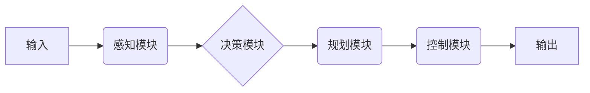
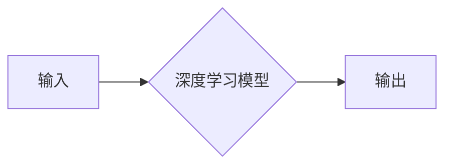

# 传统自动驾驶模块化架构向端到端架构的演进

> 关键词：自动驾驶，模块化架构，端到端架构，深度学习，计算机视觉，感知，决策，控制，自动驾驶系统

## 1. 背景介绍

随着科技的飞速发展，自动驾驶技术已成为全球汽车产业和科技公司竞相追逐的焦点。自动驾驶系统（Autonomous Vehicle System，AVS）的核心在于其架构设计，它决定了系统的性能、可靠性、安全性和可扩展性。从早期的模块化架构到如今的端到端架构，自动驾驶系统的架构经历了深刻的变革。本文将探讨这一演进过程，分析其背后的原因和未来的发展趋势。

### 1.1 问题的由来

早期的自动驾驶系统主要依靠硬件传感器（如雷达、激光雷达、摄像头等）收集环境信息，然后通过一系列的模块（如感知、决策、规划、控制等）进行数据处理和决策。这种模块化架构在初期阶段具有一定的优势，例如，各模块功能明确，易于开发和维护。然而，随着技术的进步，这种架构逐渐暴露出以下问题：

- **模块间协同困难**：不同模块之间缺乏有效协同，导致决策和控制的滞后性。
- **数据孤岛**：各模块独立处理数据，难以充分利用数据之间的关联性。
- **计算资源浪费**：冗余的计算和存储资源消耗，影响系统性能。

### 1.2 研究现状

为了解决上述问题，研究人员开始探索端到端架构，即直接将原始数据输入到深度学习模型中进行整体学习，实现感知、决策、控制等功能的融合。这种架构具有以下优势：

- **协同优化**：端到端架构能够实现各模块的协同优化，提高系统整体性能。
- **数据整合**：端到端架构能够充分利用数据之间的关联性，提高决策和控制的准确性。
- **计算优化**：端到端架构能够减少冗余的计算和存储资源，提高系统效率。

### 1.3 研究意义

研究传统自动驾驶模块化架构向端到端架构的演进，对于推动自动驾驶技术的快速发展具有重要意义：

- **提高系统性能**：端到端架构能够实现感知、决策、控制的深度融合，提高系统的响应速度和准确性。
- **降低开发成本**：端到端架构能够简化系统开发过程，降低开发成本。
- **提升安全性**：端到端架构能够提高系统的鲁棒性和可靠性，提升自动驾驶的安全性。

### 1.4 本文结构

本文将按照以下结构展开：

- 第2部分，介绍自动驾驶模块化架构和端到端架构的核心概念。
- 第3部分，分析端到端架构的原理和具体操作步骤。
- 第4部分，探讨端到端架构在自动驾驶中的应用。
- 第5部分，展望端到端架构的未来发展趋势和挑战。
- 第6部分，推荐相关学习资源、开发工具和参考文献。
- 第7部分，总结全文，展望自动驾驶技术的未来。

## 2. 核心概念与联系

### 2.1 模块化架构

模块化架构是一种将系统分解为多个独立模块的架构风格。在自动驾驶系统中，模块化架构通常包括以下几个关键模块：

- **感知模块**：负责收集环境信息，如摄像头、雷达、激光雷达等传感器数据。
- **决策模块**：根据感知数据和环境信息，进行决策，如规划行驶路径、判断障碍物等。
- **规划模块**：根据决策结果，制定具体的行驶计划。
- **控制模块**：根据规划结果，控制车辆的转向、加速、制动等动作。

Mermaid流程图如下：



### 2.2 端到端架构

端到端架构是一种将原始数据直接输入到深度学习模型中进行整体学习的架构风格。在自动驾驶系统中，端到端架构通常使用深度学习模型，如卷积神经网络（CNN）、循环神经网络（RNN）、Transformer等，实现感知、决策、控制等功能。

Mermaid流程图如下：



### 2.3 核心概念联系

模块化架构和端到端架构的联系在于，它们都是自动驾驶系统的架构设计。模块化架构将系统分解为多个独立的模块，而端到端架构则将所有模块的功能集成到一个深度学习模型中。两种架构的区别在于，模块化架构侧重于模块间的分工和协作，而端到端架构则侧重于模型的整体性能和效率。

## 3. 核心算法原理 & 具体操作步骤

### 3.1 算法原理概述

端到端架构的核心是深度学习模型。深度学习模型通过学习大量的数据，自动提取特征，并学习输入与输出之间的映射关系。在自动驾驶系统中，深度学习模型可以用于实现以下功能：

- **感知**：通过深度学习模型对传感器数据进行处理，识别和理解环境中的障碍物、交通标志、车道线等。
- **决策**：根据感知到的环境信息，使用深度学习模型进行决策，如规划行驶路径、判断障碍物等。
- **控制**：根据决策结果，使用深度学习模型控制车辆的转向、加速、制动等动作。

### 3.2 算法步骤详解

端到端架构的具体操作步骤如下：

1. **数据收集**：收集大量标注数据，包括图像、雷达、激光雷达等传感器数据，以及对应的决策和控制指令。
2. **数据预处理**：对收集到的数据进行预处理，如图像裁剪、数据增强等。
3. **模型设计**：设计深度学习模型，如CNN、RNN、Transformer等。
4. **模型训练**：使用标注数据进行模型训练，优化模型参数。
5. **模型评估**：使用测试数据评估模型性能，如准确率、召回率等。
6. **模型部署**：将训练好的模型部署到实际系统中，进行自动驾驶。

### 3.3 算法优缺点

#### 3.3.1 优点

- **整体性能提升**：端到端架构能够实现感知、决策、控制的深度融合，提高系统整体性能。
- **减少开发成本**：端到端架构能够简化系统开发过程，降低开发成本。
- **提高效率**：端到端架构能够减少数据传输和模块间协作的时间，提高系统效率。

#### 3.3.2 缺点

- **模型可解释性差**：深度学习模型通常被视为黑盒，其决策过程难以解释。
- **训练数据依赖**：深度学习模型对训练数据的质量和数量有较高的要求。
- **计算资源消耗**：深度学习模型通常需要大量的计算资源进行训练和推理。

### 3.4 算法应用领域

端到端架构在自动驾驶中的应用领域包括：

- **感知**：通过深度学习模型识别和理解环境中的障碍物、交通标志、车道线等。
- **决策**：根据感知到的环境信息，使用深度学习模型进行决策，如规划行驶路径、判断障碍物等。
- **控制**：根据决策结果，使用深度学习模型控制车辆的转向、加速、制动等动作。

## 4. 数学模型和公式 & 详细讲解 & 举例说明

### 4.1 数学模型构建

端到端架构的核心是深度学习模型。以下以卷积神经网络（CNN）为例，介绍深度学习模型的数学模型构建。

#### 4.1.1 CNN模型结构

CNN模型通常由以下几层组成：

- **卷积层**：用于提取图像特征。
- **激活层**：用于引入非线性因素。
- **池化层**：用于降低特征的空间分辨率。
- **全连接层**：用于进行最终的分类或回归。

#### 4.1.2 CNN模型公式

CNN模型的数学公式如下：

$$
\begin{align*}
h_{l}^{(i)} &= \sigma(W_{l}^{(i)}h_{l-1}^{(i-1)} + b_{l}^{(i)}) \\
\end{align*}
$$

其中，$h_{l}^{(i)}$ 表示第 $l$ 层第 $i$ 个神经元输出的特征，$W_{l}^{(i)}$ 表示第 $l$ 层第 $i$ 个神经元的权重，$b_{l}^{(i)}$ 表示第 $l$ 层第 $i$ 个神经元的偏置，$\sigma$ 表示激活函数。

### 4.2 公式推导过程

CNN模型的公式推导过程涉及多个数学概念，包括卷积操作、激活函数、池化操作等。以下简要介绍这些概念：

#### 4.2.1 卷积操作

卷积操作是一种线性操作，用于提取图像特征。其公式如下：

$$
\begin{align*}
h_{l}^{(i)} &= \sum_{j} W_{l}^{(i)} \odot f(x_{j}) \\
\end{align*}
$$

其中，$h_{l}^{(i)}$ 表示第 $l$ 层第 $i$ 个神经元输出的特征，$W_{l}^{(i)}$ 表示第 $l$ 层第 $i$ 个神经元的权重，$f(x_{j})$ 表示第 $j$ 个像素的灰度值，$\odot$ 表示元素级乘积。

#### 4.2.2 激活函数

激活函数用于引入非线性因素，常见的激活函数包括ReLU、Sigmoid、Tanh等。

#### 4.2.3 池化操作

池化操作用于降低特征的空间分辨率，常见的池化操作包括最大池化和平均池化。

### 4.3 案例分析与讲解

以下以自动驾驶中的车辆检测任务为例，介绍CNN模型的案例分析。

#### 4.3.1 数据集

使用COCO数据集进行车辆检测任务。

#### 4.3.2 模型

使用Faster R-CNN模型进行车辆检测。

#### 4.3.3 模型训练

使用COCO数据集对Faster R-CNN模型进行训练。

#### 4.3.4 模型评估

使用COCO数据集对训练好的模型进行评估。

## 5. 项目实践：代码实例和详细解释说明

### 5.1 开发环境搭建

以下以Python和TensorFlow为例，介绍自动驾驶端到端架构的开发环境搭建。

#### 5.1.1 安装Python

```bash
sudo apt-get install python3 python3-pip
```

#### 5.1.2 安装TensorFlow

```bash
pip install tensorflow
```

#### 5.1.3 安装其他依赖

```bash
pip install opencv-python numpy matplotlib
```

### 5.2 源代码详细实现

以下以Faster R-CNN模型为例，介绍自动驾驶端到端架构的源代码实现。

```python
import tensorflow as tf
import tensorflow.keras as keras
from mmdet.models import build_detector
from mmdet.datasets import CocoDetection

def load_model():
    model = build_detector(
        'hrnetv2_w18_coco',
        num_classes=81
    )
    return model

def load_data():
    dataset = CocoDetection('coco/annotations/instances_train2017.json', 
                            'coco/images/train2017', 
                            data_root='coco/')
    return dataset

def train_model(model, dataset):
    model.train(dataset)

def evaluate_model(model, dataset):
    model.evaluate(dataset)

if __name__ == '__main__':
    model = load_model()
    dataset = load_data()
    train_model(model, dataset)
    evaluate_model(model, dataset)
```

### 5.3 代码解读与分析

以上代码展示了使用TensorFlow和MMDetection库实现Faster R-CNN模型的基本流程。

- `load_model`函数用于加载预训练的Faster R-CNN模型。
- `load_data`函数用于加载COCO数据集。
- `train_model`函数用于训练模型。
- `evaluate_model`函数用于评估模型性能。

### 5.4 运行结果展示

运行以上代码后，Faster R-CNN模型将在COCO数据集上进行训练和评估，并在控制台输出模型性能指标。

## 6. 实际应用场景

### 6.1 自动驾驶车辆

自动驾驶车辆是端到端架构最典型的应用场景。通过端到端架构，自动驾驶车辆可以实时感知周围环境，进行决策和控制，实现自主行驶。

### 6.2 自动驾驶出租车

自动驾驶出租车是自动驾驶技术在共享出行领域的应用。通过端到端架构，自动驾驶出租车可以提供安全、便捷、高效的出行服务。

### 6.3 自动驾驶物流

自动驾驶物流是自动驾驶技术在物流领域的应用。通过端到端架构，自动驾驶物流车辆可以高效、安全地运输货物，降低物流成本。

## 7. 工具和资源推荐

### 7.1 学习资源推荐

- 《深度学习》系列书籍
- TensorFlow官方文档
- PyTorch官方文档
- OpenCV官方文档
- MMDetection官方文档

### 7.2 开发工具推荐

- TensorFlow
- PyTorch
- OpenCV
- MMDetection

### 7.3 相关论文推荐

- Faster R-CNN
- YOLOv4
- SSD
- EfficientDet

## 8. 总结：未来发展趋势与挑战

### 8.1 研究成果总结

本文探讨了传统自动驾驶模块化架构向端到端架构的演进过程，分析了其背后的原因和未来的发展趋势。端到端架构具有整体性能提升、降低开发成本、提高效率等优势，但在模型可解释性、训练数据依赖、计算资源消耗等方面存在一定的挑战。

### 8.2 未来发展趋势

未来，端到端架构在自动驾驶中的应用将呈现以下发展趋势：

- **模型轻量化**：通过模型压缩、量化等技术，降低模型的计算资源消耗，实现低功耗、实时性。
- **模型可解释性**：通过可解释人工智能技术，提高模型决策过程的透明度和可信度。
- **多模态融合**：融合多种传感器数据，提高模型的感知能力和鲁棒性。

### 8.3 面临的挑战

端到端架构在自动驾驶中的应用仍面临以下挑战：

- **数据集质量**：高质量的数据集对于模型训练至关重要，但获取高质量数据集的成本较高。
- **计算资源**：深度学习模型通常需要大量的计算资源进行训练和推理。
- **安全性和可靠性**：自动驾驶系统需要保证安全性和可靠性，防止事故发生。

### 8.4 研究展望

未来，自动驾驶技术将朝着更加智能化、高效化、安全化的方向发展。端到端架构作为自动驾驶技术的重要基础，将在其中扮演关键角色。随着技术的不断进步，端到端架构将迎来更加广阔的应用前景。

## 9. 附录：常见问题与解答

### 9.1 常见问题

**Q1：端到端架构与传统模块化架构相比，有哪些优势？**

A1：端到端架构具有整体性能提升、降低开发成本、提高效率等优势。

**Q2：端到端架构在自动驾驶中的应用有哪些？**

A2：端到端架构在自动驾驶中的应用包括自动驾驶车辆、自动驾驶出租车、自动驾驶物流等。

**Q3：端到端架构在自动驾驶中面临哪些挑战？**

A3：端到端架构在自动驾驶中面临数据集质量、计算资源、安全性和可靠性等挑战。

### 9.2 解答

**A1**：端到端架构具有以下优势：

- **整体性能提升**：端到端架构能够实现感知、决策、控制的深度融合，提高系统整体性能。
- **降低开发成本**：端到端架构能够简化系统开发过程，降低开发成本。
- **提高效率**：端到端架构能够减少数据传输和模块间协作的时间，提高系统效率。

**A2**：端到端架构在自动驾驶中的应用包括：

- **自动驾驶车辆**：通过端到端架构，自动驾驶车辆可以实时感知周围环境，进行决策和控制，实现自主行驶。
- **自动驾驶出租车**：通过端到端架构，自动驾驶出租车可以提供安全、便捷、高效的出行服务。
- **自动驾驶物流**：通过端到端架构，自动驾驶物流车辆可以高效、安全地运输货物，降低物流成本。

**A3**：端到端架构在自动驾驶中面临以下挑战：

- **数据集质量**：高质量的数据集对于模型训练至关重要，但获取高质量数据集的成本较高。
- **计算资源**：深度学习模型通常需要大量的计算资源进行训练和推理。
- **安全性和可靠性**：自动驾驶系统需要保证安全性和可靠性，防止事故发生。