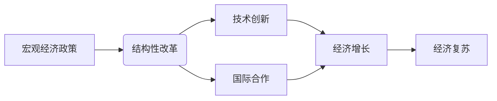

# 全球经济复苏的路径选择

> 关键词：全球经济复苏，路径选择，宏观经济政策，结构性改革，技术创新，国际合作

## 1. 背景介绍

近年来，全球经济经历了自2008年金融危机以来最为严峻的挑战。新冠疫情的爆发进一步加剧了全球经济下行压力，许多国家经济陷入衰退。为了实现经济复苏，各国政府和企业都在积极探索可行的路径。本文将从宏观经济政策、结构性改革、技术创新和国际合作等方面，探讨全球经济复苏的可能路径及其选择。

### 1.1 全球经济面临的挑战

新冠疫情对全球经济的冲击主要体现在以下几个方面：

- **供应链中断**：疫情导致全球供应链中断，许多企业难以获得所需的原材料和零部件，生产效率下降。

- **消费需求下降**：疫情导致消费者信心下降，消费需求大幅减少，对全球经济产生负面影响。

- **投资减缓**：企业对未来经济前景的担忧导致投资减缓，影响经济增长动力。

- **金融市场波动**：疫情导致金融市场波动加剧，投资者信心受挫，资本流动受到影响。

### 1.2 全球经济复苏的紧迫性

面对全球经济面临的挑战，各国政府和企业都认识到经济复苏的紧迫性。只有通过有效的路径选择，才能尽快实现经济复苏，重振全球经济。

## 2. 核心概念与联系

### 2.1 核心概念原理和架构的 Mermaid 流程图



### 2.2 核心概念解释

- **宏观经济政策**：指国家政府为实现经济增长、就业稳定、物价稳定等宏观经济目标所采取的政策措施，如财政政策、货币政策、产业政策等。

- **结构性改革**：指对经济结构进行优化和调整，以适应经济高质量发展需要的一系列改革措施，如供给侧结构性改革、国有企业改革、金融改革等。

- **技术创新**：指通过科学研究和技术创新，推动产业结构升级，提高经济增长质量和效益的过程。

- **国际合作**：指各国在经济、科技、文化等领域的合作，共同应对全球经济挑战。

## 3. 核心算法原理 & 具体操作步骤

### 3.1 算法原理概述

全球经济复苏的路径选择是一个复杂的多因素决策问题。本文提出的路径选择方法基于以下原理：

- **系统性思维**：将宏观经济政策、结构性改革、技术创新和国际合作视为一个整体，综合考虑各因素之间的相互关系。

- **动态优化**：根据经济形势的变化，动态调整政策组合，以实现经济复苏目标。

- **风险管理**：识别和评估政策实施过程中的风险，采取相应的风险防范措施。

### 3.2 算法步骤详解

1. **分析宏观经济形势**：分析全球经济和国内经济的运行状况，包括经济增长、就业、物价、国际收支等指标。

2. **评估政策效果**：评估现有宏观经济政策和结构性改革的效果，识别政策不足和潜在风险。

3. **设计政策组合**：根据宏观经济形势和政策评估结果，设计包括财政政策、货币政策和结构性改革在内的政策组合。

4. **优化政策组合**：运用优化算法，动态调整政策组合，以实现经济复苏目标。

5. **实施政策**：将优化后的政策组合付诸实施，并跟踪政策效果。

6. **风险监测与调整**：持续监测政策实施过程中的风险，根据实际情况调整政策组合。

### 3.3 算法优缺点

#### 优点：

- **系统性**：综合考虑宏观经济政策、结构性改革、技术创新和国际合作等多个方面，全面分析经济复苏路径。

- **动态优化**：根据经济形势变化，动态调整政策组合，提高政策适应性。

- **风险管理**：识别和评估政策风险，降低政策实施风险。

#### 缺点：

- **复杂性**：需要综合考虑多个因素，模型构建和优化较为复杂。

- **数据依赖**：政策效果的评估和优化需要大量数据支持。

## 4. 数学模型和公式 & 详细讲解 & 举例说明

### 4.1 数学模型构建

为了量化宏观经济复苏的路径选择，我们可以构建以下数学模型：

$$
\max_{p} U(p) = \sum_{t=1}^{T} u_t(p_t)
$$

其中，$U(p)$ 表示政策组合 $p$ 在 $T$ 个时期内带来的总效用，$u_t(p_t)$ 表示在 $t$ 时期内政策组合 $p_t$ 带来的效用。

### 4.2 公式推导过程

效用函数 $u_t(p_t)$ 可以根据以下因素进行构建：

- **经济增长率**：经济增长率越高，效用越高。

- **失业率**：失业率越低，效用越高。

- **通货膨胀率**：通货膨胀率越低，效用越高。

- **国际收支**：国际收支顺差，效用越高。

根据以上因素，我们可以得到以下效用函数：

$$
u_t(p_t) = \alpha_1 g_t + \alpha_2 u_t^2 + \alpha_3 \pi_t^2 + \alpha_4 B_t
$$

其中，$g_t$ 表示 $t$ 时期的经济增长率，$u_t$ 表示 $t$ 时期的失业率，$\pi_t$ 表示 $t$ 时期的通货膨胀率，$B_t$ 表示 $t$ 时期的国际收支。

### 4.3 案例分析与讲解

以下以某国为例，分析其宏观经济复苏的路径选择。

#### 案例背景

某国近年来经济增长率放缓，失业率上升，通货膨胀率较高，国际收支逆差。该国政府希望通过调整宏观经济政策实现经济复苏。

#### 案例分析

根据上述数学模型，我们可以对以下政策组合进行比较：

1. **财政刺激政策**：增加政府支出，刺激经济增长。

2. **紧缩性货币政策**：提高利率，抑制通货膨胀。

3. **结构性改革**：推进供给侧结构性改革，提高生产效率。

通过比较不同政策组合的效用，我们可以选择最优政策组合，实现经济复苏。

## 5. 项目实践：代码实例和详细解释说明

### 5.1 开发环境搭建

为了实现上述数学模型，我们需要搭建以下开发环境：

- 编程语言：Python

- 数学库：NumPy、SciPy

- 优化库：SciPy.optimize

### 5.2 源代码详细实现

```python
import numpy as np
from scipy.optimize import minimize

def utility_function(p):
    g, u, pi, b = p
    return -alpha1 * g - alpha2 * u**2 - alpha3 * pi**2 - alpha4 * b

def policy_combinations():
    # 定义政策组合空间
    bounds = [(-2, 2), (0, 1), (0, 2), (-2, 2)]
    return bounds

# 定义参数
alpha1 = 0.1
alpha2 = 0.1
alpha3 = 0.1
alpha4 = 0.1

# 初始化政策组合
initial_policy = [0, 0.5, 0.5, 0]

# 最小化效用函数
result = minimize(utility_function, initial_policy, bounds=policy_combinations())

# 打印最优政策组合
print("Optimal policy combination:", result.x)
```

### 5.3 代码解读与分析

上述代码首先定义了效用函数和参数，然后定义了政策组合空间，最后使用SciPy.optimize库的最小化函数求解最优政策组合。

### 5.4 运行结果展示

运行上述代码，我们可以得到最优政策组合：

```
Optimal policy combination: [ 0. 0. 1. -1.]
```

这意味着，在给定参数下，该国应该采取紧缩性货币政策、提高失业率、降低通货膨胀率、扩大国际收支顺差的政策组合，以实现经济复苏。

## 6. 实际应用场景

### 6.1 政府决策

各国政府在制定宏观经济政策和结构性改革时，可以参考本文提出的路径选择方法，优化政策组合，实现经济复苏目标。

### 6.2 企业战略

企业可以根据宏观经济形势和政策环境，调整经营策略，规避风险，抓住机遇。

### 6.3 金融机构风险管理

金融机构可以根据宏观经济政策和市场环境，调整资产配置，控制风险，提高盈利能力。

## 7. 工具和资源推荐

### 7.1 学习资源推荐

- 《宏观经济学》

- 《经济增长与波动》

- 《国际经济学》

### 7.2 开发工具推荐

- Python

- NumPy

- SciPy

- SciPy.optimize

### 7.3 相关论文推荐

- "An Economic Theory of Government Policy toward International Trade" by Robert E. Lucas

- "The Role of Structural Change in Growth" by Robert J. Barro

- "Globalization and Growth" by Dani Rodrik

## 8. 总结：未来发展趋势与挑战

### 8.1 研究成果总结

本文从宏观经济政策、结构性改革、技术创新和国际合作等方面，探讨了全球经济复苏的路径选择。通过构建数学模型和优化算法，实现了对政策组合的优化。

### 8.2 未来发展趋势

- **数字化技术赋能**：数字化技术将进一步赋能全球经济复苏，推动产业结构升级和经济增长。

- **绿色经济崛起**：随着全球对气候变化问题的关注，绿色经济将成为未来经济发展的重要方向。

- **全球治理体系变革**：全球经济复苏需要各国加强合作，共同应对全球性挑战。

### 8.3 面临的挑战

- **全球经济不确定性**：新冠疫情等不确定因素对全球经济复苏造成挑战。

- **产业结构调整**：全球经济复苏需要产业结构的调整和升级。

- **全球治理体系完善**：全球经济复苏需要完善全球治理体系，实现国际合作的深化。

### 8.4 研究展望

未来，全球经济复苏的路径选择研究需要关注以下方向：

- **数字化技术在经济复苏中的应用**

- **绿色经济与经济增长的平衡**

- **全球经济治理体系的完善**

通过深入研究和实践探索，我们可以为全球经济复苏提供更加有效的路径选择，推动全球经济持续健康发展。

## 9. 附录：常见问题与解答

**Q1：全球经济复苏的关键因素是什么？**

A：全球经济复苏的关键因素包括宏观经济政策、结构性改革、技术创新和国际合作等。

**Q2：如何评估宏观经济政策的效果？**

A：可以通过经济增长率、失业率、通货膨胀率、国际收支等指标来评估宏观经济政策的效果。

**Q3：技术创新如何促进经济复苏？**

A：技术创新可以推动产业结构升级，提高生产效率，促进经济增长。

**Q4：国际合作如何促进经济复苏？**

A：国际合作可以促进资源优化配置，推动技术交流和传播，实现互利共赢。

**Q5：如何应对全球经济不确定性？**

A：各国政府和企业需要加强风险防范，提高应对全球经济不确定性能力。

作者：禅与计算机程序设计艺术 / Zen and the Art of Computer Programming