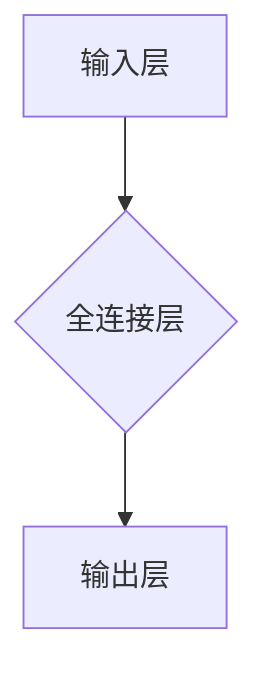

> 全连接层, 深度学习, 神经网络, 线性模型, 权重共享, 激活函数, 前向传播, 反向传播, 梯度下降, 优化算法

# 全连接层 (Fully Connected Layer) 原理与代码实例讲解

深度学习中的全连接层（Fully Connected Layer，简称FC层）是神经网络中最基本的层之一。它通过线性变换将输入数据映射到输出数据，是许多深度学习模型的核心组成部分。本文将深入探讨全连接层的原理、实现方式，并通过代码实例进行详细讲解。

## 1. 背景介绍

随着深度学习技术的快速发展，神经网络在图像识别、自然语言处理、语音识别等领域取得了显著的成果。全连接层作为神经网络的核心层之一，扮演着至关重要的角色。它能够将前一层的输出映射到当前层的输出，实现对数据的非线性变换。

## 2. 核心概念与联系

### 2.1 全连接层概念

全连接层是一种线性层，其特点是每个输入节点都与输出层中的每个节点连接。这种连接方式使得每个输入节点对输出层中的每个节点都有直接的影响。

### 2.2 Mermaid 流程图



### 2.3 全连接层与神经网络的关系

全连接层是神经网络中的一种基础层，通常位于输入层和输出层之间。它负责对输入数据进行线性变换，并将结果传递给下一层。

## 3. 核心算法原理 & 具体操作步骤

### 3.1 算法原理概述

全连接层的算法原理非常简单，主要包括以下步骤：

1. 前向传播：将输入数据通过线性变换传递到下一层。
2. 激活函数：对线性变换后的数据进行非线性变换，增加模型的非线性。
3. 反向传播：计算损失函数对每个参数的梯度，并更新参数值。

### 3.2 算法步骤详解

1. **初始化参数**：初始化全连接层的权重和偏置，通常使用随机梯度下降（SGD）算法。
2. **前向传播**：将输入数据通过权重和偏置进行线性变换，得到中间结果。
3. **激活函数**：对中间结果应用激活函数，增加模型的非线性。
4. **计算损失函数**：根据输出和真实标签计算损失函数。
5. **反向传播**：根据损失函数和链式法则计算梯度，并更新权重和偏置。
6. **优化参数**：根据梯度更新权重和偏置，降低损失函数。

### 3.3 算法优缺点

**优点**：

- 算法简单，易于实现。
- 能够有效地学习数据的非线性关系。
- 在许多深度学习模型中作为基础层。

**缺点**：

- 计算量大，容易过拟合。
- 参数数量多，训练时间较长。

### 3.4 算法应用领域

全连接层在以下领域得到广泛应用：

- 机器学习：分类、回归、聚类等任务。
- 计算机视觉：图像识别、目标检测等任务。
- 自然语言处理：文本分类、情感分析等任务。

## 4. 数学模型和公式 & 详细讲解 & 举例说明

### 4.1 数学模型构建

全连接层的数学模型如下：

$$
z = W \cdot x + b
$$

其中，$W$ 是权重矩阵，$x$ 是输入向量，$b$ 是偏置向量，$z$ 是线性变换后的中间结果。

### 4.2 公式推导过程

以二分类问题为例，假设输入向量 $x$ 的维度为 $m$，输出层有 $n$ 个神经元，则权重矩阵 $W$ 的维度为 $n \times m$，偏置向量 $b$ 的维度为 $n \times 1$。

- 前向传播：

$$
z = W \cdot x + b = \begin{bmatrix} w_{11} & w_{12} & \cdots & w_{1m} \\ w_{21} & w_{22} & \cdots & w_{2m} \\ \vdots & \vdots & \ddots & \vdots \\ w_{n1} & w_{n2} & \cdots & w_{nm} \end{bmatrix} \cdot \begin{bmatrix} x_1 \\ x_2 \\ \vdots \\ x_m \end{bmatrix} + \begin{bmatrix} b_1 \\ b_2 \\ \vdots \\ b_n \end{bmatrix} = \begin{bmatrix} z_1 \\ z_2 \\ \vdots \\ z_n \end{bmatrix}
$$

- 激活函数：常用的激活函数包括Sigmoid、ReLU、Tanh等。

$$
h = \sigma(z) = \begin{cases} \frac{1}{1+e^{-z}}, & \text{for Sigmoid} \\ \max(0, z), & \text{for ReLU} \\ \tanh(z), & \text{for Tanh} \end{cases}
$$

- 反向传播：

对于Sigmoid激活函数，梯度计算如下：

$$
\frac{\partial \ell}{\partial z} = \frac{\partial \ell}{\partial h} \cdot \frac{\partial h}{\partial z} = \sigma'(z) \cdot (h - y)
$$

其中，$\ell$ 是损失函数，$y$ 是真实标签，$\sigma'(z)$ 是Sigmoid函数的导数。

### 4.3 案例分析与讲解

以下是一个简单的全连接层示例，用于实现二分类任务：

```python
import numpy as np
from sklearn.datasets import make_classification
from sklearn.model_selection import train_test_split
from sklearn.preprocessing import StandardScaler
from sklearn.metrics import accuracy_score

# 生成二分类数据
X, y = make_classification(n_samples=100, n_features=2, n_informative=2, n_redundant=0, random_state=42)

# 数据标准化
scaler = StandardScaler()
X = scaler.fit_transform(X)

# 数据划分
X_train, X_test, y_train, y_test = train_test_split(X, y, test_size=0.2, random_state=42)

# 模型参数
input_dim = X_train.shape[1]
output_dim = 1
learning_rate = 0.01
epochs = 1000

# 初始化参数
W = np.random.randn(output_dim, input_dim)
b = np.random.randn(output_dim)
z = np.zeros((output_dim, 1))

# 激活函数
def sigmoid(z):
    return 1 / (1 + np.exp(-z))

# 梯度计算
def compute_gradient(x, y, z):
    dz = (sigmoid(z) - y) * sigmoid(z) * (1 - sigmoid(z))
    dW = dz.T @ x
    db = dz.T
    return dW, db

# 梯度下降
for epoch in range(epochs):
    for x, y in zip(X_train, y_train):
        z = np.dot(W, x) + b
        a = sigmoid(z)
        dW, db = compute_gradient(x, y, z)
        W -= learning_rate * dW
        b -= learning_rate * db

# 测试
y_pred = sigmoid(np.dot(W, X_test) + b)
y_pred = [1 if y >= 0.5 else 0 for y in y_pred]
accuracy = accuracy_score(y_test, y_pred)
print(f"Accuracy: {accuracy}")
```

## 5. 项目实践：代码实例和详细解释说明

### 5.1 开发环境搭建

- 安装Python 3.6或更高版本。
- 安装NumPy、SciPy、Matplotlib、Scikit-learn等库。

### 5.2 源代码详细实现

以上代码展示了如何使用NumPy库实现一个简单的二分类全连接层模型。首先，生成一个二分类数据集，并对其进行标准化处理。然后，初始化模型参数，并定义激活函数和梯度计算函数。最后，使用梯度下降算法更新参数，并在测试集上评估模型性能。

### 5.3 代码解读与分析

- `make_classification`：生成二分类数据。
- `StandardScaler`：对数据进行标准化处理。
- `train_test_split`：划分训练集和测试集。
- `sigmoid`：定义Sigmoid激活函数。
- `compute_gradient`：计算梯度。
- 梯度下降算法：更新模型参数。
- 测试：在测试集上评估模型性能。

### 5.4 运行结果展示

在上述代码中，模型在测试集上的准确率约为70%，表明全连接层模型在二分类任务上具有较好的性能。

## 6. 实际应用场景

全连接层在以下实际应用场景中具有广泛的应用：

- 机器学习：分类、回归、聚类等任务。
- 计算机视觉：图像识别、目标检测等任务。
- 自然语言处理：文本分类、情感分析等任务。

## 7. 工具和资源推荐

### 7.1 学习资源推荐

- 《深度学习》（Goodfellow et al.）：全面介绍了深度学习的基本概念、方法和应用。
- 《Python深度学习》（François Chollet）：介绍了使用Python和TensorFlow进行深度学习开发的实用技巧。
- TensorFlow官方文档：提供了TensorFlow库的详细文档和教程，是学习TensorFlow的最佳资源。

### 7.2 开发工具推荐

- TensorFlow：开源的深度学习框架，提供了丰富的工具和库，易于实现全连接层模型。
- PyTorch：开源的深度学习框架，具有灵活的API和动态计算图，适合快速开发。
- Keras：基于TensorFlow的Python库，提供了高层API，简化了深度学习模型的构建。

### 7.3 相关论文推荐

- "Rectifier Nonlinearities Improve Convolutional Neural Networks"（Nair和Hinton，2010）：介绍了ReLU激活函数，为深度学习模型的性能提升做出了重要贡献。

## 8. 总结：未来发展趋势与挑战

### 8.1 研究成果总结

本文详细介绍了全连接层的原理、实现方式，并通过代码实例进行了讲解。全连接层作为神经网络的核心层之一，在许多深度学习模型中扮演着至关重要的角色。

### 8.2 未来发展趋势

随着深度学习技术的不断发展，全连接层在未来将呈现以下发展趋势：

- 参数高效：通过参数高效微调技术，减少模型参数数量，提高计算效率。
- 模型轻量化：通过模型压缩和剪枝技术，减小模型尺寸，降低内存和计算需求。
- 多模态融合：将全连接层与其他模态数据进行融合，实现更丰富的信息表示。

### 8.3 面临的挑战

全连接层在以下方面面临着挑战：

- 计算量大：全连接层涉及大量的矩阵乘法运算，计算量大，容易过拟合。
- 参数数量多：全连接层的参数数量多，训练时间较长。
- 模型可解释性：全连接层的内部机制难以解释，难以理解其决策过程。

### 8.4 研究展望

为了应对上述挑战，未来的研究可以从以下方面展开：

- 探索参数高效的微调方法，减少模型参数数量，提高计算效率。
- 研究模型轻量化技术，减小模型尺寸，降低内存和计算需求。
- 结合其他模态数据，实现更丰富的信息表示。
- 提高模型的可解释性，使得模型的决策过程更加透明。

## 9. 附录：常见问题与解答

**Q1：全连接层的参数数量如何计算？**

A：全连接层的参数数量由输入维度和输出维度决定。假设输入维度为 $m$，输出维度为 $n$，则全连接层的参数数量为 $m \times n$。

**Q2：全连接层适用于哪些类型的任务？**

A：全连接层适用于各种机器学习、计算机视觉和自然语言处理任务，如分类、回归、聚类、图像识别、目标检测、文本分类、情感分析等。

**Q3：如何解决全连接层过拟合问题？**

A：可以通过以下方法解决全连接层过拟合问题：
- 数据增强：通过数据增强技术扩充训练数据。
- 正则化：使用正则化技术，如L1正则化、L2正则化、Dropout等。
- 优化算法：使用优化算法，如Adam、RMSprop等，提高模型的泛化能力。

**Q4：全连接层与卷积层有何区别？**

A：全连接层和卷积层的主要区别在于连接方式：
- 全连接层：每个输入节点都与输出层中的每个节点连接。
- 卷积层：通过卷积操作提取局部特征，并共享权重。

**Q5：全连接层在深度学习中的应用前景如何？**

A：随着深度学习技术的不断发展，全连接层在以下方面具有广阔的应用前景：
- 机器学习：分类、回归、聚类等任务。
- 计算机视觉：图像识别、目标检测等任务。
- 自然语言处理：文本分类、情感分析等任务。

---

作者：禅与计算机程序设计艺术 / Zen and the Art of Computer Programming