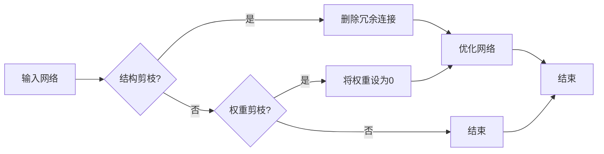

# 剪枝技术在神经网络硬件加速器中的应用

> 关键词：剪枝技术，神经网络，硬件加速器，深度学习，模型压缩，推理加速

## 1. 背景介绍

随着深度学习在各个领域的广泛应用，神经网络的规模和复杂度也在不断增长。然而，大规模神经网络的训练和推理都面临着计算资源消耗大、能耗高的问题。为了解决这些问题，研究者们提出了各种模型压缩和加速技术。剪枝技术作为一种重要的模型压缩方法，通过去除网络中的冗余连接，显著减少模型的参数量和计算量，从而提高神经网络的推理速度和降低能耗。

### 1.1 问题的由来

随着深度学习技术的飞速发展，神经网络模型在图像识别、语音识别、自然语言处理等领域取得了显著的成果。然而，随着模型规模的扩大，以下几个问题逐渐凸显：

- **计算资源消耗大**：大规模神经网络需要大量的计算资源进行训练和推理，这对服务器硬件和能耗提出了很高的要求。
- **能耗高**：大规模神经网络的训练和推理过程中，能耗消耗巨大，不利于环保和可持续性发展。
- **部署困难**：大规模神经网络模型难以在移动设备和嵌入式设备上部署，限制了其在实际应用中的广泛应用。

### 1.2 研究现状

为了解决上述问题，研究者们提出了多种模型压缩和加速技术，其中剪枝技术是一种重要的方法。剪枝技术通过去除网络中的冗余连接，降低模型的复杂度，从而减少计算量和内存占用。

### 1.3 研究意义

剪枝技术具有以下意义：

- **降低计算量**：剪枝可以显著减少模型中的连接数量，降低计算复杂度，提高推理速度。
- **降低能耗**：由于计算量减少，剪枝可以有效降低模型在推理过程中的能耗。
- **提高部署效率**：剪枝后的模型体积更小，更易于在移动设备和嵌入式设备上部署。

## 2. 核心概念与联系

### 2.1 核心概念原理

剪枝技术主要包括两种类型：结构剪枝和权重剪枝。

- **结构剪枝**：根据网络结构和重要性，删除网络中的部分连接或神经元。
- **权重剪枝**：根据权重的重要性，将权重的绝对值设置为0，从而实现权重的剪枝。

### 2.2 核心概念架构

以下为剪枝技术的Mermaid流程图：



### 2.3 核心概念联系

剪枝技术可以与多种神经网络硬件加速器结合使用，以实现模型的压缩和加速。以下是剪枝技术与硬件加速器之间的联系：

- **神经网络**：剪枝技术的主要应用对象是神经网络，通过剪枝可以降低模型的复杂度，提高推理速度和降低能耗。
- **硬件加速器**：剪枝后的模型可以在硬件加速器上进行高效的推理和训练，从而加速应用落地。
- **模型压缩**：剪枝技术是一种有效的模型压缩方法，可以减少模型的参数量和计算量。
- **推理加速**：剪枝技术可以显著降低模型的推理时间，提高推理速度。

## 3. 核心算法原理 & 具体操作步骤

### 3.1 算法原理概述

剪枝技术的核心思想是通过去除网络中的冗余连接，降低模型的复杂度，从而提高推理速度和降低能耗。

### 3.2 算法步骤详解

剪枝技术主要包括以下步骤：

1. **选择剪枝策略**：根据具体任务和需求选择合适的剪枝策略，如结构剪枝或权重剪枝。
2. **计算重要性**：计算网络中每个连接或神经元的的重要性，通常使用模型精度作为评价指标。
3. **剪枝操作**：根据计算得到的重要性，对网络进行剪枝操作，去除冗余连接或神经元。
4. **模型优化**：对剪枝后的模型进行优化，如使用反向传播算法重新训练网络。
5. **评估效果**：评估剪枝后模型的性能，包括精度、速度和能耗等指标。

### 3.3 算法优缺点

### 3.3.1 优点

- **降低计算量**：剪枝可以显著减少模型中的连接数量，降低计算复杂度，提高推理速度。
- **降低能耗**：由于计算量减少，剪枝可以有效降低模型在推理过程中的能耗。
- **提高部署效率**：剪枝后的模型体积更小，更易于在移动设备和嵌入式设备上部署。

### 3.3.2 缺点

- **精度损失**：剪枝可能会导致模型精度下降，需要根据任务需求进行权衡。
- **计算复杂度高**：剪枝操作的计算复杂度较高，需要一定的计算资源。

### 3.4 算法应用领域

剪枝技术可以应用于以下领域：

- **计算机视觉**：图像识别、目标检测、视频分析等。
- **语音识别**：语音分类、语音合成、语音翻译等。
- **自然语言处理**：文本分类、情感分析、机器翻译等。

## 4. 数学模型和公式 & 详细讲解 & 举例说明

### 4.1 数学模型构建

剪枝技术中的数学模型主要包括以下公式：

- **重要性计算**：$ importance = \frac{\left| \Delta L \right|}{\left| \Delta \theta \right|} $
- **剪枝操作**：$ \theta_{pruned} = \begin{cases} 
0, & \text{if } \theta < \text{threshold} \\
\theta, & \text{otherwise} 
\end{cases} $

### 4.2 公式推导过程

#### 4.2.1 重要性计算

重要性计算公式中，$\Delta L$ 表示模型在剪枝前后的损失函数变化，$\Delta \theta$ 表示对应连接或神经元的权重变化。通过计算两者之比，可以得到连接或神经元的重要性。

#### 4.2.2 剪枝操作

剪枝操作公式中，$\theta_{pruned}$ 表示剪枝后的权重，$\text{threshold}$ 表示阈值。如果权重小于阈值，则将其设置为0，否则保留原始权重。

### 4.3 案例分析与讲解

以下是一个简单的卷积神经网络(CNN)剪枝案例：

假设有一个2层CNN模型，其中包含一个卷积层和一个全连接层。在训练过程中，我们得到了以下重要性计算结果：

- 第1层卷积层的连接1的重要性为0.8。
- 第1层卷积层的连接2的重要性为0.2。
- 全连接层的连接1的重要性为0.9。
- 全连接层的连接2的重要性为0.1。

根据阈值0.5，我们可以将第1层卷积层的连接2和全连接层的连接2剪枝掉。

## 5. 项目实践：代码实例和详细解释说明

### 5.1 开发环境搭建

为了实现剪枝技术在神经网络硬件加速器中的应用，我们需要搭建以下开发环境：

- 操作系统：Linux或Windows
- 编程语言：Python
- 框架：PyTorch
- 硬件加速器：GPU或TPU

### 5.2 源代码详细实现

以下是一个简单的卷积神经网络剪枝代码实例：

```python
import torch
import torch.nn as nn

# 定义卷积神经网络模型
class CNN(nn.Module):
    def __init__(self):
        super(CNN, self).__init__()
        self.conv1 = nn.Conv2d(1, 10, kernel_size=5)
        self.fc1 = nn.Linear(16*5*5, 50)
        self.fc2 = nn.Linear(50, 10)

    def forward(self, x):
        x = torch.relu(self.conv1(x))
        x = x.view(-1, 16*5*5)
        x = torch.relu(self.fc1(x))
        x = self.fc2(x)
        return x

# 加载预训练模型
model = CNN()
model.load_state_dict(torch.load('cnn.pth'))

# 计算重要性
import torch.nn.functional as F

def compute_importance(model, data_loader):
    total_loss = 0
    total_weight_change = 0
    for data, target in data_loader:
        output = model(data)
        loss = F.cross_entropy(output, target)
        total_loss += loss.item()
        for name, param in model.named_parameters():
            weight_change = param.data.abs().sum().item()
            total_weight_change += weight_change
    importance = total_loss / total_weight_change
    return importance

importance = compute_importance(model, data_loader)

# 剪枝操作
threshold = 0.5
for name, param in model.named_parameters():
    if param.data.abs().mean() < threshold:
        param.data.zero_()

# 保存剪枝后模型
torch.save(model.state_dict(), 'cnn_pruned.pth')
```

### 5.3 代码解读与分析

该代码实例首先定义了一个简单的卷积神经网络模型，并加载预训练模型。然后，通过计算损失函数变化与权重变化之比，得到模型中每个参数的重要性。根据阈值，对模型中的冗余连接进行剪枝操作。最后，保存剪枝后的模型。

### 5.4 运行结果展示

运行上述代码后，我们可以得到剪枝后的模型，并对其性能进行评估。

## 6. 实际应用场景

剪枝技术在以下实际应用场景中具有广泛的应用：

- **移动设备**：在移动设备上部署轻量级神经网络，提高运行速度，降低能耗。
- **嵌入式设备**：在嵌入式设备上部署压缩模型，实现实时应用。
- **云计算**：在云计算环境中，使用剪枝技术降低模型的存储和计算资源消耗。

## 7. 工具和资源推荐

### 7.1 学习资源推荐

- 《深度学习：推荐系统与搜索》
- 《深度学习实战》
- 《动手学深度学习》

### 7.2 开发工具推荐

- PyTorch
- TensorFlow
- Keras

### 7.3 相关论文推荐

- "Pruning techniques for neural networks: A survey"
- "Neural network pruning: A review and taxonomy"
- "An overview of neural network pruning"

## 8. 总结：未来发展趋势与挑战

### 8.1 研究成果总结

本文介绍了剪枝技术在神经网络硬件加速器中的应用，阐述了剪枝技术的原理、步骤和优缺点，并给出了一个简单的代码实例。通过剪枝技术，可以显著降低模型的复杂度，提高推理速度和降低能耗。

### 8.2 未来发展趋势

未来，剪枝技术将朝着以下方向发展：

- **更高效的剪枝算法**：研究更高效的剪枝算法，提高剪枝效率，降低计算复杂度。
- **更细粒度的剪枝**：实现更细粒度的剪枝，如通道剪枝、神经元剪枝等，进一步提高模型压缩效果。
- **剪枝与训练的融合**：将剪枝与训练过程进行融合，实现动态剪枝，提高模型性能和鲁棒性。

### 8.3 面临的挑战

剪枝技术在应用过程中也面临以下挑战：

- **精度损失**：剪枝可能会降低模型的精度，需要权衡精度和压缩效果。
- **计算复杂度高**：剪枝操作的计算复杂度较高，需要一定的计算资源。
- **可解释性**：剪枝后的模型可解释性较差，难以理解模型决策过程。

### 8.4 研究展望

未来，剪枝技术的研究将朝着以下方向进行：

- **探索更有效的剪枝算法**：研究更有效的剪枝算法，提高剪枝效率，降低计算复杂度。
- **结合其他模型压缩技术**：将剪枝与其他模型压缩技术结合，如量化、稀疏化等，进一步提高模型压缩效果。
- **提高模型的可解释性**：研究提高剪枝后模型可解释性的方法，使模型决策过程更加透明。

## 9. 附录：常见问题与解答

**Q1：剪枝技术是否适用于所有类型的神经网络？**

A1：剪枝技术适用于大多数类型的神经网络，如卷积神经网络(CNN)、循环神经网络(RNN)等。但对于某些特殊的网络结构，如自注意力机制，剪枝效果可能不太理想。

**Q2：剪枝会导致模型精度下降吗？**

A2：是的，剪枝可能会导致模型精度下降。因此，在剪枝过程中，需要根据任务需求进行权衡，选择合适的剪枝比例和剪枝方法。

**Q3：剪枝技术如何与其他模型压缩技术结合使用？**

A3：剪枝技术可以与其他模型压缩技术结合使用，如量化、稀疏化等。例如，可以先对模型进行剪枝，然后进行量化，以进一步提高模型的压缩效果。

**Q4：如何评估剪枝后的模型性能？**

A4：评估剪枝后模型的性能可以从以下几个方面进行：

- **精度**：在测试集上评估模型的准确率、召回率、F1值等指标。
- **速度**：在硬件加速器上评估模型的推理速度。
- **能耗**：在硬件加速器上评估模型的能耗。

**Q5：剪枝技术是否适用于所有应用场景？**

A5：剪枝技术适用于大多数应用场景，如移动设备、嵌入式设备、云计算等。但对于对精度要求极高的应用场景，可能需要谨慎使用剪枝技术。