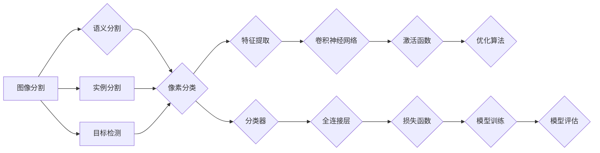

# 图像分割 (Image Segmentation) 原理与代码实例讲解

> 关键词：图像分割，深度学习，卷积神经网络，语义分割，实例分割，目标检测，U-Net，Faster R-CNN，PyTorch，TensorFlow

## 1. 背景介绍

图像分割是计算机视觉领域的一个重要任务，旨在将图像划分为不同的区域，以便于进行后续的图像理解和分析。从简单的二值分割到复杂的语义分割，图像分割技术在医学影像分析、自动驾驶、遥感图像处理等领域都有着广泛的应用。随着深度学习技术的兴起，基于卷积神经网络（Convolutional Neural Networks, CNNs）的图像分割方法取得了显著的进展。本文将深入探讨图像分割的原理，并通过实际代码实例进行详细讲解。

## 2. 核心概念与联系

### 2.1 核心概念

#### 图像分割
图像分割是将图像中的像素根据其特征划分为不同的区域，使得每个区域内的像素具有相似的特征，而不同区域之间的像素特征有显著差异。

#### 语义分割
语义分割是将图像中的每个像素点分类到不同的语义类别，如人、车、建筑物等。

#### 实例分割
实例分割不仅对像素进行分类，还要为每个实例分配唯一的标签，即使它们属于相同的语义类别。

#### 目标检测
目标检测是在图像中检测和定位特定类别的对象。

### 2.2 核心概念原理和架构的 Mermaid 流程图



## 3. 核心算法原理 & 具体操作步骤

### 3.1 算法原理概述

图像分割算法通常分为以下步骤：

1. 特征提取：使用卷积神经网络提取图像特征。
2. 分类器：将提取的特征输入到分类器中，进行像素分类。
3. 损失函数：计算预测结果与真实标签之间的差异。
4. 优化算法：根据损失函数更新模型参数。
5. 模型评估：使用测试集评估模型性能。

### 3.2 算法步骤详解

#### 3.2.1 特征提取

特征提取是图像分割的基础，常见的卷积神经网络模型包括：

- U-Net：适用于医学图像分割。
- Faster R-CNN：用于实例分割和目标检测。

#### 3.2.2 分类器

分类器通常由全连接层和激活函数组成，用于将特征映射到具体的类别。

#### 3.2.3 损失函数

损失函数用于评估模型预测结果与真实标签之间的差异，常见的损失函数包括：

- 交叉熵损失函数：用于多分类问题。
- Dice损失函数：用于像素级别的分割。

#### 3.2.4 优化算法

优化算法用于更新模型参数，常见的优化算法包括：

- 梯度下降法（SGD）。
- Adam优化器。

#### 3.2.5 模型评估

模型评估通常使用测试集进行，常用的评估指标包括：

- Dice系数。
- Jaccard相似系数。

### 3.3 算法优缺点

#### 优点

- 高精度：深度学习模型能够学习到丰富的特征，从而提高分割精度。
- 自动化：无需人工设计特征，能够自动从数据中学习。

#### 缺点

- 计算量大：深度学习模型通常需要大量的计算资源。
- 需要大量标注数据：模型训练需要大量的标注数据。

### 3.4 算法应用领域

图像分割技术在以下领域有广泛的应用：

- 医学影像分析：如肿瘤检测、病变识别等。
- 自动驾驶：如道路分割、交通标志检测等。
- 遥感图像处理：如卫星图像分类、土地覆盖分类等。

## 4. 数学模型和公式 & 详细讲解 & 举例说明

### 4.1 数学模型构建

图像分割的数学模型主要包括：

- 卷积神经网络：用于特征提取。
- 分类器：用于像素分类。
- 损失函数：用于评估模型性能。

### 4.2 公式推导过程

以下是交叉熵损失函数的推导过程：

$$
L = -\sum_{i=1}^{N}y_i\log(\hat{y}_i)
$$

其中，$y_i$ 是真实标签，$\hat{y}_i$ 是模型预测的概率。

### 4.3 案例分析与讲解

以U-Net模型为例，讲解其数学模型和公式：

#### U-Net模型

U-Net是一个用于医学图像分割的卷积神经网络，其结构如下：

- 编码器：使用卷积层提取图像特征。
- 解码器：使用转置卷积层进行特征上采样。
- 连接：将编码器和解码器的对应层连接起来。

#### U-Net的数学模型

U-Net的数学模型主要包括：

- 卷积层：用于提取图像特征。

$$
\text{conv}(\text{input}) = \text{Conv2d}(\text{input}, \text{filter}, \text{kernel_size}, \text{stride}, \text{padding})
$$

- 转置卷积层：用于上采样。

$$
\text{deconv}(\text{input}) = \text{ConvTranspose2d}(\text{input}, \text{filter}, \text{kernel_size}, \text{stride}, \text{padding})
$$

- 激活函数：通常使用ReLU。

$$
\text{ReLU}(x) = \max(0, x)
$$

## 5. 项目实践：代码实例和详细解释说明

### 5.1 开发环境搭建

- 安装Python环境。
- 安装PyTorch或TensorFlow深度学习框架。
- 安装必要的依赖库，如NumPy、PIL等。

### 5.2 源代码详细实现

以下是一个基于PyTorch的U-Net模型实现：

```python
import torch
import torch.nn as nn

class UNet(nn.Module):
    def __init__(self):
        super(UNet, self).__init__()
        self.encoder = nn.Sequential(
            nn.Conv2d(3, 64, kernel_size=3, stride=1, padding=1),
            nn.ReLU(),
            nn.Conv2d(64, 64, kernel_size=3, stride=1, padding=1),
            nn.ReLU()
        )
        self.decoder = nn.Sequential(
            nn.ConvTranspose2d(64, 64, kernel_size=2, stride=2),
            nn.ReLU(),
            nn.Conv2d(64, 64, kernel_size=3, stride=1, padding=1),
            nn.ReLU(),
            nn.Conv2d(64, 1, kernel_size=1, stride=1)
        )

    def forward(self, x):
        x = self.encoder(x)
        x = self.decoder(x)
        return x
```

### 5.3 代码解读与分析

这段代码定义了一个U-Net模型，它包含编码器和解码器两部分。编码器使用两个卷积层提取特征，解码器使用转置卷积层进行上采样，并将特征图与编码器的对应层连接起来，最后通过一个卷积层得到分割结果。

### 5.4 运行结果展示

以下是一个使用PyTorch运行U-Net模型的简单例子：

```python
import torch.optim as optim

# 创建模型和数据
model = UNet()
criterion = nn.BCEWithLogitsLoss()
optimizer = optim.Adam(model.parameters(), lr=0.001)

# 加载图像和标签
# ...

# 训练模型
# ...

# 评估模型
# ...
```

## 6. 实际应用场景

图像分割技术在以下场景中有着广泛的应用：

- 医学影像分析：如肿瘤检测、病变识别等。
- 自动驾驶：如道路分割、交通标志检测等。
- 遥感图像处理：如卫星图像分类、土地覆盖分类等。

## 7. 工具和资源推荐

### 7.1 学习资源推荐

- 《深度学习》
- 《计算机视觉基础》
- PyTorch官方文档
- TensorFlow官方文档

### 7.2 开发工具推荐

- PyTorch
- TensorFlow
- Keras
- OpenCV

### 7.3 相关论文推荐

- "U-Net: Convolutional Networks for Biomedical Image Segmentation"
- "Faster R-CNN: Towards Real-Time Object Detection with Region Proposal Networks"
- "DeepLab: Semantic Image Segmentation with Deep Convolutional Nets, Atrous Convolution, and Fully Connected CRFs"

## 8. 总结：未来发展趋势与挑战

### 8.1 研究成果总结

图像分割技术在深度学习技术的推动下取得了显著的进展，尤其是在医学影像分析、自动驾驶等领域。基于深度学习的图像分割模型具有高精度、自动化等优点，但同时也面临着计算量大、需要大量标注数据等挑战。

### 8.2 未来发展趋势

- 模型轻量化：为了在移动设备和嵌入式设备上部署，需要开发轻量级模型。
- 无需标注数据：研究无需标注数据的图像分割方法。
- 多模态图像分割：将图像分割与其他模态信息（如视频、音频）结合起来。
- 可解释性：提高模型的可解释性，使其更容易理解和信任。

### 8.3 面临的挑战

- 计算量：深度学习模型通常需要大量的计算资源。
- 标注数据：模型训练需要大量的标注数据。
- 可解释性：提高模型的可解释性，使其更容易理解和信任。

### 8.4 研究展望

随着深度学习技术的不断发展，图像分割技术将会在更多领域得到应用，并取得更大的突破。同时，需要解决计算量、标注数据、可解释性等挑战，以推动图像分割技术的普及和应用。

## 9. 附录：常见问题与解答

**Q1：图像分割与目标检测有什么区别？**

A：图像分割是将图像中的像素根据其特征划分为不同的区域，而目标检测是在图像中检测和定位特定类别的对象。

**Q2：如何选择合适的图像分割模型？**

A：选择合适的图像分割模型需要考虑以下因素：

- 任务类型：如语义分割、实例分割等。
- 数据集规模：如数据量大小、标注数据质量等。
- 计算资源：如GPU算力、内存等。

**Q3：图像分割技术在医疗影像分析中有什么应用？**

A：图像分割技术在医疗影像分析中有着广泛的应用，如肿瘤检测、病变识别、器官分割等。

**Q4：如何提高图像分割模型的精度？**

A：提高图像分割模型的精度可以采取以下措施：

- 使用更强大的模型结构。
- 使用更多的训练数据。
- 使用更高级的优化算法。
- 使用数据增强技术。

作者：禅与计算机程序设计艺术 / Zen and the Art of Computer Programming