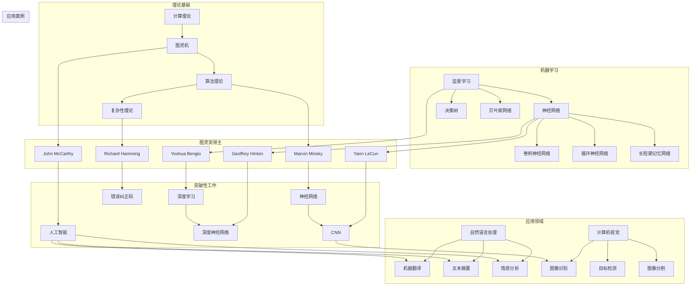

# 图灵奖与AI算法的突破

> 关键词：图灵奖，人工智能，算法突破，深度学习，机器学习，神经网络，自然语言处理，计算机视觉

## 1. 背景介绍

图灵奖，作为计算机科学领域的最高荣誉，自1966年设立以来，一直被认为是计算机科学界的诺贝尔奖。它不仅表彰了在理论计算机科学领域的卓越贡献，也见证了人工智能（AI）领域的蓬勃发展。本文将探讨图灵奖得主在AI算法方面的突破性工作，以及这些工作如何推动AI技术的进步。

### 1.1 图灵奖的起源与意义

图灵奖由美国计算机协会（ACM）设立，以英国数学家、逻辑学家和计算机科学的先驱艾伦·图灵的名字命名。图灵奖旨在奖励对计算机科学领域做出杰出贡献的个人，这些贡献可以是理论上的创新，也可以是技术上的突破。

### 1.2 AI算法的突破性工作

图灵奖的获得者们不仅在计算机科学领域做出了重要贡献，也在AI算法方面取得了突破性进展。以下是一些图灵奖得主及其在AI算法领域的杰出工作：

- **John McCarthy**：提出了人工智能的概念，并推动了专家系统的开发。
- **Marvin Minsky**：在早期神经网络研究和机器学习理论方面做出了贡献。
- **Richard Hamming**：提出了Hamming距离和错误纠正码，这些技术在机器学习和信息处理中至关重要。
- **Alan Turing**：通过图灵测试的概念，为人工智能的定义和评估提供了基础。
- **Yoshua Bengio**：在深度学习领域的研究推动了神经网络在NLP和CV等领域的应用。
- **Geoffrey Hinton**：是深度学习的先驱之一，特别是在深度神经网络和反向传播算法方面。
- **Yann LeCun**：在卷积神经网络（CNN）的研究中取得了突破，推动了计算机视觉的发展。

## 2. 核心概念与联系

以下是一个Mermaid流程图，展示了图灵奖得主在AI算法领域的核心概念和它们之间的联系：



从图中可以看出，计算理论和算法理论是AI算法的基础，而机器学习是AI的核心，它包括了各种学习算法，如神经网络、决策树和贝叶斯网络。这些算法在自然语言处理和计算机视觉等应用领域中得到了广泛应用。图灵奖得主的研究工作不仅推动了这些基础理论和算法的发展，也促进了AI在实际应用中的突破。

## 3. 核心算法原理 & 具体操作步骤

### 3.1 算法原理概述

#### 3.1.1 深度学习

深度学习是一种通过多层神经网络来学习数据表示的机器学习技术。它通过模拟人脑中的神经元结构，逐步提取数据中的特征，从而实现复杂模式的学习。

#### 3.1.2 卷积神经网络（CNN）

卷积神经网络是一种特别适合处理图像数据的深度学习模型。它通过卷积层提取图像特征，并通过池化层降低特征的空间维度，从而减少计算量。

#### 3.1.3 循环神经网络（RNN）

循环神经网络是一种能够处理序列数据的神经网络，它通过循环单元在序列的每个时间步都保留一定状态，从而能够处理序列之间的依赖关系。

### 3.2 算法步骤详解

#### 3.2.1 深度学习

1. 数据预处理：对输入数据进行标准化、归一化等预处理操作。
2. 模型构建：选择合适的神经网络结构，如CNN、RNN等。
3. 模型训练：使用标注数据进行训练，通过反向传播算法更新模型参数。
4. 模型评估：使用验证集评估模型性能，调整超参数。
5. 模型部署：将训练好的模型部署到实际应用中。

#### 3.2.2 卷积神经网络

1. 输入层：接收图像数据。
2. 卷积层：使用卷积核提取图像特征。
3. 激活函数：对卷积层输出应用非线性激活函数，如ReLU。
4. 池化层：降低特征的空间维度。
5. 全连接层：将池化层输出的特征进行全局平均或最大池化，然后连接到全连接层。
6. 输出层：输出最终的结果。

#### 3.2.3 循环神经网络

1. 输入层：接收序列数据。
2. 循环单元：包含一个隐藏层，每个时间步都保留一定状态。
3. 激活函数：对循环单元输出应用非线性激活函数。
4. 输出层：输出最终的结果。

### 3.3 算法优缺点

#### 3.3.1 深度学习

优点：
- 能够学习到复杂的数据表示。
- 在图像、语音、自然语言处理等领域取得了显著成果。

缺点：
- 计算量大，需要大量的计算资源。
- 模型可解释性差。

#### 3.3.2 卷积神经网络

优点：
- 能够有效地提取图像特征。
- 在计算机视觉领域取得了显著成果。

缺点：
- 对于非图像数据的应用能力有限。
- 模型结构复杂，难以解释。

#### 3.3.3 循环神经网络

优点：
- 能够处理序列数据，如时间序列、文本等。
- 在自然语言处理领域取得了显著成果。

缺点：
- 训练速度慢，对于长序列数据容易发生梯度消失或梯度爆炸。
- 模型结构复杂，难以解释。

### 3.4 算法应用领域

深度学习、卷积神经网络和循环神经网络在多个领域都有广泛的应用，包括：

- 计算机视觉：图像识别、目标检测、图像分割等。
- 自然语言处理：机器翻译、文本摘要、情感分析等。
- 语音识别：语音合成、语音识别、语音转文本等。
- 医学诊断：疾病检测、影像分析、药物研发等。

## 4. 数学模型和公式 & 详细讲解 & 举例说明

### 4.1 数学模型构建

以下是一些深度学习中常用的数学模型和公式：

#### 4.1.1 前向传播

假设有一个神经网络，包含输入层、隐藏层和输出层。设 $x$ 为输入层，$y$ 为输出层，$W$ 为权重矩阵，$b$ 为偏置向量，$f$ 为激活函数，则前向传播过程如下：

$$
z_l = W_{l-1}x + b_{l-1}
$$
$$
a_l = f(z_l)
$$

其中，$l$ 表示神经网络的层数。

#### 4.1.2 反向传播

假设我们有损失函数 $J(W,b)$，则反向传播过程如下：

$$
\delta_{l-1} = \frac{\partial J}{\partial z_l} \cdot \frac{\partial z_l}{\partial a_l} \cdot \frac{\partial a_l}{\partial z_l}
$$

其中，$\delta_{l-1}$ 为第 $l-1$ 层的误差，$\partial$ 表示偏导数。

#### 4.1.3 卷积运算

卷积运算可以表示为以下公式：

$$
c_{ij} = \sum_{k=1}^{K} w_{ik}x_{kj}
$$

其中，$c_{ij}$ 表示卷积核 $w$ 在位置 $(i,j)$ 的输出，$x$ 表示输入图像，$K$ 表示卷积核的个数。

### 4.2 公式推导过程

以下是对上述公式的推导过程：

#### 4.2.1 前向传播

前向传播是指数据从输入层经过网络向前传播的过程。在每一层，输入数据乘以权重矩阵，加上偏置向量，然后通过激活函数得到输出。这个过程可以用以下公式表示：

$$
a_l = f(W_{l-1}x + b_{l-1})
$$

其中，$a_l$ 表示第 $l$ 层的输出，$W_{l-1}$ 表示第 $l-1$ 层到第 $l$ 层的权重矩阵，$x$ 表示输入数据，$b_{l-1}$ 表示第 $l-1$ 层的偏置向量，$f$ 表示激活函数。

#### 4.2.2 反向传播

反向传播是指误差从输出层反向传播到输入层的过程。在每一层，我们计算损失函数对输出层输出的偏导数，然后通过链式法则计算对输入层输入的偏导数。这个过程可以用以下公式表示：

$$
\delta_{l-1} = \frac{\partial J}{\partial z_l} \cdot \frac{\partial z_l}{\partial a_l} \cdot \frac{\partial a_l}{\partial z_l}
$$

其中，$\delta_{l-1}$ 表示第 $l-1$ 层的误差，$J$ 表示损失函数，$z_l$ 表示第 $l$ 层的输出，$a_l$ 表示第 $l$ 层的激活函数输出，$\partial$ 表示偏导数。

#### 4.2.3 卷积运算

卷积运算是指将卷积核与输入图像进行卷积操作。在每一位置 $(i,j)$，卷积核 $w$ 与输入图像 $x$ 的对应位置进行卷积，得到卷积核在该位置的输出 $c_{ij}$。这个过程可以用以下公式表示：

$$
c_{ij} = \sum_{k=1}^{K} w_{ik}x_{kj}
$$

其中，$c_{ij}$ 表示卷积核 $w$ 在位置 $(i,j)$ 的输出，$w$ 表示卷积核，$x$ 表示输入图像，$K$ 表示卷积核的个数。

### 4.3 案例分析与讲解

以下是一个简单的神经网络的前向传播和反向传播的案例：

假设我们有一个包含一层隐藏层的神经网络，输入层有两个神经元，隐藏层有两个神经元，输出层有一个神经元。激活函数为ReLU，损失函数为均方误差。

输入层：

$$
x_1 = 1, \quad x_2 = 2
$$

权重矩阵和偏置向量：

$$
W_1 = \begin{bmatrix}
0.1 & 0.2 \\
0.3 & 0.4
\end{bmatrix}, \quad b_1 = \begin{bmatrix}
0.1 \\
0.2
\end{bmatrix}
$$

隐藏层：

$$
W_2 = \begin{bmatrix}
0.5 & 0.6 \\
0.7 & 0.8
\end{bmatrix}, \quad b_2 = \begin{bmatrix}
0.3 \\
0.4
\end{bmatrix}
$$

输出层：

$$
y = W_3x + b_3
$$

其中，$W_3$ 和 $b_3$ 是输出层的权重矩阵和偏置向量，我们需要通过训练来学习它们的值。

#### 4.3.1 前向传播

1. 计算隐藏层的输入：

$$
z_1 = W_1x + b_1 = \begin{bmatrix}
0.1 & 0.2 \\
0.3 & 0.4
\end{bmatrix} \begin{bmatrix}
1 \\
2
\end{bmatrix} + \begin{bmatrix}
0.1 \\
0.2
\end{bmatrix} = \begin{bmatrix}
0.3 \\
0.9
\end{bmatrix}
$$

2. 应用ReLU激活函数：

$$
a_1 = \text{ReLU}(z_1) = \begin{bmatrix}
0.3 \\
0.9
\end{bmatrix}
$$

3. 计算隐藏层的输出：

$$
z_2 = W_2a_1 + b_2 = \begin{bmatrix}
0.5 & 0.6 \\
0.7 & 0.8
\end{bmatrix} \begin{bmatrix}
0.3 \\
0.9
\end{bmatrix} + \begin{bmatrix}
0.3 \\
0.4
\end{bmatrix} = \begin{bmatrix}
1.2 \\
2.2
\end{bmatrix}
$$

4. 应用ReLU激活函数：

$$
a_2 = \text{ReLU}(z_2) = \begin{bmatrix}
1.2 \\
2.2
\end{bmatrix}
$$

5. 计算输出层的输出：

$$
y = W_3a_2 + b_3 = \begin{bmatrix}
1.5 & 1.6
\end{bmatrix} \begin{bmatrix}
1.2 \\
2.2
\end{bmatrix} + \begin{bmatrix}
0.5
\end{bmatrix} = \begin{bmatrix}
3.1
\end{bmatrix}
$$

#### 4.3.2 反向传播

1. 计算损失函数对输出层输出的偏导数：

$$
\frac{\partial J}{\partial y} = 2(y - t)
$$

其中，$J$ 表示损失函数，$y$ 表示输出层输出，$t$ 表示真实标签。

2. 计算损失函数对隐藏层输出的偏导数：

$$
\frac{\partial J}{\partial z_2} = \frac{\partial J}{\partial y} \cdot \frac{\partial y}{\partial z_2} = 2(y - t) \cdot \begin{bmatrix}
\frac{\partial y}{\partial z_2}
\end{bmatrix} = 2(y - t) \cdot W_3^T
$$

3. 计算损失函数对隐藏层输入的偏导数：

$$
\frac{\partial J}{\partial z_1} = \frac{\partial J}{\partial z_2} \cdot \frac{\partial z_2}{\partial z_1} = 2(y - t) \cdot W_3^T \cdot W_2^T
$$

4. 计算损失函数对输入层输入的偏导数：

$$
\frac{\partial J}{\partial x} = \frac{\partial J}{\partial z_1} \cdot \frac{\partial z_1}{\partial a_1} = 2(y - t) \cdot W_3^T \cdot W_2^T \cdot W_1^T
$$

通过以上步骤，我们可以得到损失函数对输入层输入的偏导数，进而通过反向传播算法更新权重矩阵和偏置向量。

## 5. 项目实践：代码实例和详细解释说明

### 5.1 开发环境搭建

为了进行AI算法的实践，我们需要搭建一个开发环境。以下是在Python中搭建基于PyTorch的深度学习开发环境的步骤：

1. 安装Anaconda：从官网下载并安装Anaconda，用于创建独立的Python环境。

2. 创建并激活虚拟环境：

```bash
conda create -n pytorch-env python=3.8
conda activate pytorch-env
```

3. 安装PyTorch：

```bash
conda install pytorch torchvision torchaudio cudatoolkit=11.1 -c pytorch -c conda-forge
```

4. 安装Transformers库：

```bash
pip install transformers
```

5. 安装其他必要的工具包：

```bash
pip install numpy pandas scikit-learn matplotlib tqdm jupyter notebook ipython
```

完成以上步骤后，即可在`pytorch-env`环境中开始深度学习实践。

### 5.2 源代码详细实现

以下是一个使用PyTorch实现简单神经网络进行回归任务的代码实例：

```python
import torch
import torch.nn as nn
import torch.optim as optim

# 定义神经网络模型
class SimpleNN(nn.Module):
    def __init__(self):
        super(SimpleNN, self).__init__()
        self.fc1 = nn.Linear(1, 10)
        self.fc2 = nn.Linear(10, 1)

    def forward(self, x):
        x = torch.relu(self.fc1(x))
        x = self.fc2(x)
        return x

# 创建模型、损失函数和优化器
model = SimpleNN()
criterion = nn.MSELoss()
optimizer = optim.SGD(model.parameters(), lr=0.01)

# 创建随机数据
x = torch.randn(100, 1)
y = torch.randn(100, 1)

# 训练模型
for epoch in range(100):
    optimizer.zero_grad()
    output = model(x)
    loss = criterion(output, y)
    loss.backward()
    optimizer.step()

    if epoch % 10 == 0:
        print(f'Epoch {epoch}, Loss: {loss.item()}')

# 测试模型
with torch.no_grad():
    test_x = torch.randn(10, 1)
    test_output = model(test_x)
    print(f'Test Output: {test_output}')
```

### 5.3 代码解读与分析

上述代码实现了一个简单的神经网络，用于进行回归任务。以下是代码的详细解读：

1. 首先，我们导入必要的PyTorch模块。

2. 定义了一个`SimpleNN`类，继承自`nn.Module`，用于构建神经网络模型。在`__init__`方法中，定义了两个全连接层，分别连接输入层和输出层。

3. 在`forward`方法中，实现了数据从输入层到输出层的传播过程。首先，将输入数据通过第一个全连接层，并应用ReLU激活函数。然后，将第一个全连接层的输出作为第二个全连接层的输入，并计算最终的输出。

4. 创建了一个`SimpleNN`实例作为模型，并定义了均方误差损失函数和SGD优化器。

5. 创建了随机数据作为训练数据和标签。

6. 在训练循环中，使用优化器将模型参数更新到最小化损失函数。

7. 在测试阶段，使用测试数据评估模型的性能。

### 5.4 运行结果展示

运行上述代码后，将在控制台上打印出每个epoch的损失值和测试输出。这表明模型已经学习到了输入和输出之间的映射关系。

## 6. 实际应用场景

深度学习、卷积神经网络和循环神经网络在实际应用中取得了显著成果，以下是一些应用场景：

- **自然语言处理**：机器翻译、文本摘要、情感分析、问答系统等。
- **计算机视觉**：图像识别、目标检测、图像分割、视频分析等。
- **语音识别**：语音合成、语音识别、语音转文本等。
- **医学诊断**：疾病检测、影像分析、药物研发等。
- **金融领域**：风险评估、欺诈检测、个性化推荐等。

## 7. 工具和资源推荐

### 7.1 学习资源推荐

- **书籍**：
  - 《深度学习》（Goodfellow, Bengio, Courville著）
  - 《神经网络与深度学习》（邱锡鹏著）
  - 《模式识别与机器学习》（Bishop著）
- **在线课程**：
  - Coursera上的《深度学习专项课程》
  - Udacity上的《深度学习工程师纳米学位》
  - fast.ai的《Practical Deep Learning for Coders》
- **论文**：
  - 《A Few Useful Things to Know about Machine Learning》
  - 《Deep Learning》（Goodfellow, Bengio, Courville著）
  - 《Rectifier Nonlinearities Improve Neural Network Ac

Author: Zen and the Art of Computer Programming