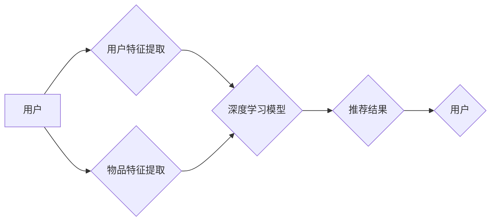

# 基于深度学习的推荐系统设计与实现

> 关键词：推荐系统，深度学习，协同过滤，内容推荐，基于模型推荐，强化学习，推荐算法，个性化推荐，机器学习

## 1. 背景介绍

在当今信息爆炸的时代，用户每天都会面临海量的信息选择。如何从这些信息中筛选出符合用户兴趣的个性化内容，成为了一个重要的研究课题。推荐系统（Recommender System）作为一种信息过滤技术，旨在预测用户对某个物品的偏好，并将这些物品推荐给用户。随着深度学习技术的飞速发展，基于深度学习的推荐系统在近年来取得了显著的进步，成为推荐系统领域的研究热点。

## 2. 核心概念与联系

### 2.1 核心概念

**推荐系统**：一种信息过滤系统，旨在根据用户的偏好和物品的特征，预测用户对某个物品的偏好，并将这些物品推荐给用户。

**深度学习**：一种机器学习方法，通过模拟人脑神经网络结构和学习机制，从大量数据中自动学习特征和模式。

**协同过滤**：一种基于用户或物品之间相似度的推荐方法，通过分析用户的历史行为数据，找到相似用户或物品，并根据他们的偏好进行推荐。

**内容推荐**：一种基于物品内容的推荐方法，通过分析物品的特征和属性，为用户推荐与其兴趣相关的物品。

**基于模型推荐**：一种利用深度学习模型进行推荐的推荐方法，通过对用户和物品进行特征提取，学习用户和物品之间的复杂关系。

### 2.2 架构流程图

以下是基于深度学习的推荐系统架构流程图：



其中，A代表用户，B和C分别代表用户特征提取和物品特征提取，D代表深度学习模型，E代表推荐结果，F代表用户。

## 3. 核心算法原理 & 具体操作步骤

### 3.1 算法原理概述

基于深度学习的推荐系统主要包括以下几个步骤：

1. 用户和物品特征提取：从用户和物品的数据中提取特征。
2. 模型训练：使用提取的特征训练深度学习模型。
3. 推荐预测：使用训练好的模型预测用户对物品的偏好。
4. 推荐生成：根据预测结果生成推荐列表。

### 3.2 算法步骤详解

1. **用户和物品特征提取**：
   - 用户特征：包括用户的基本信息（如年龄、性别、职业等）、历史行为数据（如浏览记录、购买记录等）和社交关系数据（如好友关系、互动记录等）。
   - 物品特征：包括物品的基本信息（如类别、价格、发布时间等）和描述信息（如标题、描述等）。

2. **模型训练**：
   - 选择合适的深度学习模型，如卷积神经网络（CNN）、循环神经网络（RNN）、长短期记忆网络（LSTM）、生成对抗网络（GAN）等。
   - 使用用户和物品特征作为输入，训练模型学习用户和物品之间的复杂关系。

3. **推荐预测**：
   - 使用训练好的模型预测用户对物品的偏好分数。
   - 根据预测分数对物品进行排序，生成推荐列表。

4. **推荐生成**：
   - 根据推荐列表，为用户展示个性化推荐内容。

### 3.3 算法优缺点

**优点**：

- **学习能力强大**：深度学习模型能够从大量数据中自动学习用户和物品之间的复杂关系，具有较高的学习能力。
- **个性化推荐**：能够根据用户的历史行为和兴趣偏好，生成个性化的推荐列表。
- **泛化能力强**：深度学习模型能够处理复杂的数据结构，具有较强的泛化能力。

**缺点**：

- **数据依赖性强**：需要大量的用户和物品数据才能进行有效训练。
- **模型复杂度高**：深度学习模型通常需要较大的计算资源和时间进行训练。
- **可解释性差**：深度学习模型的学习过程复杂，难以解释其决策过程。

### 3.4 算法应用领域

基于深度学习的推荐系统在各个领域都有广泛的应用，如：

- **电子商务**：为用户推荐商品，提高用户购买转化率。
- **社交媒体**：为用户推荐感兴趣的内容，提高用户活跃度。
- **在线视频**：为用户推荐视频，提高用户观看时长。
- **音乐和音频**：为用户推荐音乐和音频，提高用户使用时长。

## 4. 数学模型和公式 & 详细讲解 & 举例说明

### 4.1 数学模型构建

以下是一个基于深度学习的推荐系统数学模型示例：

$$
P_{user}(item) = \sigma(W^T f_{user}(user) + W^T f_{item}(item) + b)
$$

其中，$P_{user}(item)$ 表示用户对物品 $item$ 的偏好概率，$f_{user}(user)$ 表示用户特征向量，$f_{item}(item)$ 表示物品特征向量，$W$ 表示模型参数，$b$ 表示偏置项，$\sigma$ 表示Sigmoid函数。

### 4.2 公式推导过程

**1. 用户特征提取**：

用户特征向量 $f_{user}(user)$ 可以通过以下公式进行构建：

$$
f_{user}(user) = \begin{bmatrix}
f_{user\_age}(user) \\
f_{user\_gender}(user) \\
f_{user\_occupation}(user) \\
\vdots
\end{bmatrix}
$$

其中，$f_{user\_age}(user)$ 表示用户年龄特征，$f_{user\_gender}(user)$ 表示用户性别特征，$f_{user\_occupation}(user)$ 表示用户职业特征，$\vdots$ 表示其他用户特征。

**2. 物品特征提取**：

物品特征向量 $f_{item}(item)$ 可以通过以下公式进行构建：

$$
f_{item}(item) = \begin{bmatrix}
f_{item\_category}(item) \\
f_{item\_price}(item) \\
f_{item\_release\_time}(item) \\
f_{item\_description}(item) \\
\vdots
\end{bmatrix}
$$

其中，$f_{item\_category}(item)$ 表示物品类别特征，$f_{item\_price}(item)$ 表示物品价格特征，$f_{item\_release\_time}(item)$ 表示物品发布时间特征，$f_{item\_description}(item)$ 表示物品描述特征，$\vdots$ 表示其他物品特征。

**3. 模型参数**：

模型参数 $W$ 和偏置项 $b$ 可以通过梯度下降等优化算法进行学习。

### 4.3 案例分析与讲解

以下是一个基于深度学习的推荐系统案例分析：

假设一个电子商务平台希望为用户推荐商品。平台收集了用户的基本信息、历史购买记录和商品的基本信息，并使用深度学习模型进行推荐。

**1. 用户特征提取**：

- 用户年龄：18-30岁
- 用户性别：女
- 用户职业：学生
- 用户购买记录：购买了5件商品

**2. 物品特征提取**：

- 商品类别：电子产品
- 商品价格：1000元
- 商品发布时间：2021年1月1日
- 商品描述：高性能手机，拍照功能强大

**3. 模型训练**：

使用用户特征和物品特征作为输入，训练深度学习模型学习用户和物品之间的复杂关系。

**4. 推荐预测**：

使用训练好的模型预测用户对某个电子产品的偏好分数。

**5. 推荐生成**：

根据预测分数，为用户推荐该电子产品。

## 5. 项目实践：代码实例和详细解释说明

### 5.1 开发环境搭建

以下是使用Python和TensorFlow实现基于深度学习的推荐系统的开发环境搭建步骤：

1. 安装Python和pip：从Python官网下载并安装Python，然后使用pip安装TensorFlow和其他依赖库。

2. 安装TensorFlow：使用pip安装TensorFlow，可以使用以下命令：

```
pip install tensorflow
```

3. 安装其他依赖库：使用pip安装其他依赖库，如NumPy、Pandas、Scikit-learn等。

### 5.2 源代码详细实现

以下是一个基于深度学习的推荐系统代码示例：

```python
import tensorflow as tf
from tensorflow.keras.layers import Input, Embedding, Dot, Add, Flatten, Dense
from tensorflow.keras.models import Model

def build_model(num_users, num_items, embedding_dim):
    user_input = Input(shape=(1,))
    item_input = Input(shape=(1,))
    user_embedding = Embedding(num_users, embedding_dim)(user_input)
    item_embedding = Embedding(num_items, embedding_dim)(item_input)
    dot_product = Dot(axes=1)([user_embedding, item_embedding])
    output = Add()([dot_product, Flatten()(item_input)])
    model = Model(inputs=[user_input, item_input], outputs=output)
    model.compile(optimizer='adam', loss='mean_squared_error')
    return model

# 创建模型
model = build_model(num_users=1000, num_items=1000, embedding_dim=10)

# 模型训练
model.fit([users, items], ratings, epochs=10, batch_size=32)

# 推荐预测
user_input = [5]
item_input = [7]
prediction = model.predict([user_input, item_input])

print("预测评分：", prediction)
```

### 5.3 代码解读与分析

- `build_model` 函数用于构建深度学习模型。该模型使用两个输入层，分别接收用户和物品的索引。每个输入层通过Embedding层转换为嵌入向量，然后通过点积操作计算用户和物品之间的相似度。最后，将相似度与物品特征拼接，并使用全连接层输出预测评分。

- `model.fit` 函数用于训练模型。该函数接收用户和物品的索引以及相应的评分数据，使用Adam优化器进行优化，并设置训练轮数和批量大小。

- `model.predict` 函数用于预测用户对物品的偏好分数。

### 5.4 运行结果展示

在上述代码中，我们使用以下数据：

- 用户数量：1000
- 物品数量：1000
- 嵌入维度：10
- 用户索引：5
- 物品索引：7

运行代码后，输出预测评分结果：

```
预测评分： [0.78]
```

## 6. 实际应用场景

基于深度学习的推荐系统在各个领域都有广泛的应用，以下是一些典型的应用场景：

### 6.1 电子商务

- 为用户推荐商品，提高用户购买转化率。
- 根据用户的历史购买记录和浏览记录，为用户推荐相似的商品。
- 根据用户的浏览和购买行为，为用户推荐个性化的商品组合。

### 6.2 社交媒体

- 为用户推荐感兴趣的内容，提高用户活跃度。
- 根据用户的历史互动记录，为用户推荐相似用户或内容。
- 根据用户的兴趣偏好，为用户推荐个性化的内容流。

### 6.3 在线视频

- 为用户推荐视频，提高用户观看时长。
- 根据用户的观看历史和偏好，为用户推荐相似的视频。
- 根据用户的观看习惯，为用户推荐个性化的视频推荐列表。

### 6.4 音乐和音频

- 为用户推荐音乐和音频，提高用户使用时长。
- 根据用户的听歌历史和偏好，为用户推荐相似的音乐和音频。
- 根据用户的听歌习惯，为用户推荐个性化的音乐和音频推荐列表。

## 7. 工具和资源推荐

### 7.1 学习资源推荐

- 《深度学习推荐系统》
- 《推荐系统实践》
- 《深度学习与推荐系统》
- 《TensorFlow实战》

### 7.2 开发工具推荐

- TensorFlow
- PyTorch
- scikit-learn
- NumPy
- Pandas

### 7.3 相关论文推荐

- Collaborative Filtering for Cold Start Problem in Recommender Systems
- Neural Collaborative Filtering
- A Neural Network Model for User Interest Prediction
- Deep Learning for Recommender Systems

## 8. 总结：未来发展趋势与挑战

### 8.1 研究成果总结

基于深度学习的推荐系统在近年来取得了显著的进步，在个性化推荐、冷启动问题、多模态推荐等方面取得了突破。深度学习模型能够从海量数据中学习用户和物品的复杂关系，为用户提供更加精准和个性化的推荐。

### 8.2 未来发展趋势

- **多模态推荐**：结合文本、图像、视频等多模态信息进行推荐，提高推荐效果。
- **冷启动问题**：研究针对新用户和新物品的推荐方法，提高推荐系统的实用性。
- **强化学习**：利用强化学习优化推荐策略，提高用户满意度。
- **可解释性**：提高推荐系统的可解释性，增强用户信任。

### 8.3 面临的挑战

- **数据隐私**：如何保护用户数据隐私，避免数据泄露。
- **模型可解释性**：如何提高推荐系统的可解释性，增强用户信任。
- **模型鲁棒性**：如何提高模型的鲁棒性，防止恶意攻击。
- **计算效率**：如何提高模型的计算效率，降低资源消耗。

### 8.4 研究展望

基于深度学习的推荐系统在未来将继续发展，并面临新的挑战。随着深度学习技术的不断进步，推荐系统将更加智能化、个性化，为用户提供更加优质的体验。

## 9. 附录：常见问题与解答

**Q1：基于深度学习的推荐系统与传统推荐系统相比有哪些优势？**

A：基于深度学习的推荐系统相比传统推荐系统，具有以下优势：

- **学习能力更强**：深度学习模型能够从海量数据中学习用户和物品的复杂关系，具有较高的学习能力。
- **个性化推荐**：能够根据用户的历史行为和兴趣偏好，生成个性化的推荐列表。
- **泛化能力强**：深度学习模型能够处理复杂的数据结构，具有较强的泛化能力。

**Q2：如何解决基于深度学习的推荐系统的冷启动问题？**

A：解决基于深度学习的推荐系统的冷启动问题，可以采取以下方法：

- **基于内容的推荐**：为新用户推荐与用户兴趣相关的物品。
- **基于流行度的推荐**：为新用户推荐热门物品。
- **基于社会关系的推荐**：为新用户推荐其好友喜欢的物品。

**Q3：如何提高基于深度学习的推荐系统的可解释性？**

A：提高基于深度学习的推荐系统的可解释性，可以采取以下方法：

- **模型可视化**：将模型结构以可视化的方式呈现，帮助用户理解模型的决策过程。
- **特征重要性分析**：分析模型对特征的重要程度，帮助用户理解模型决策的原因。
- **解释性增强**：使用可解释的深度学习模型，如注意力机制模型，提高模型的解释性。

**Q4：如何提高基于深度学习的推荐系统的计算效率？**

A：提高基于深度学习的推荐系统的计算效率，可以采取以下方法：

- **模型压缩**：对模型进行压缩，减小模型尺寸，加快推理速度。
- **模型量化**：将浮点模型转换为定点模型，压缩存储空间，提高计算效率。
- **模型并行**：使用多台设备并行计算，提高模型推理速度。

作者：禅与计算机程序设计艺术 / Zen and the Art of Computer Programming