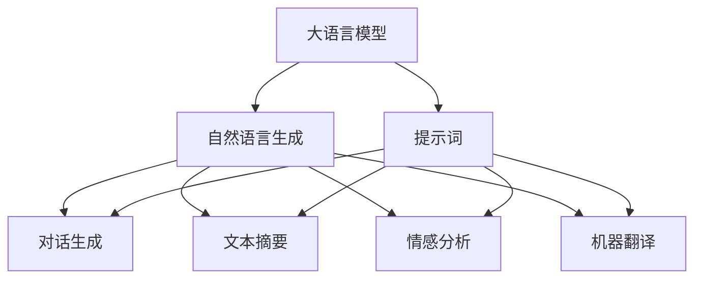
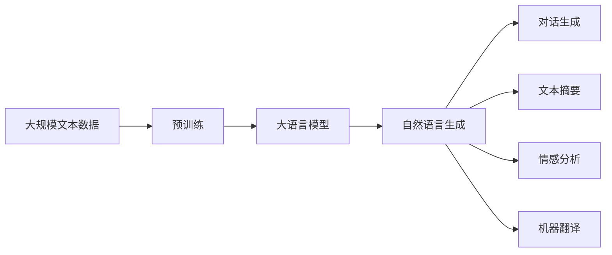
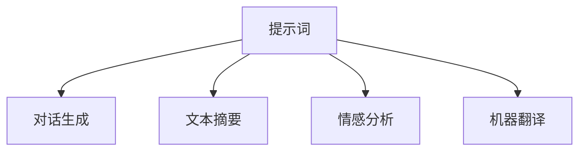
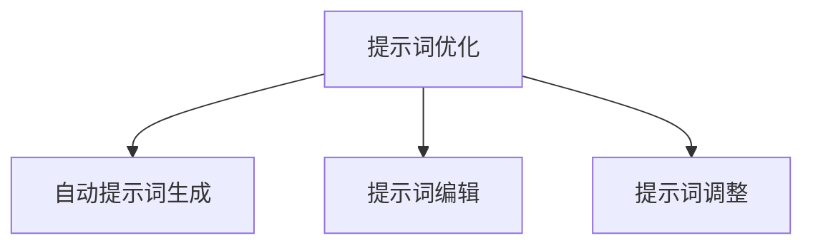
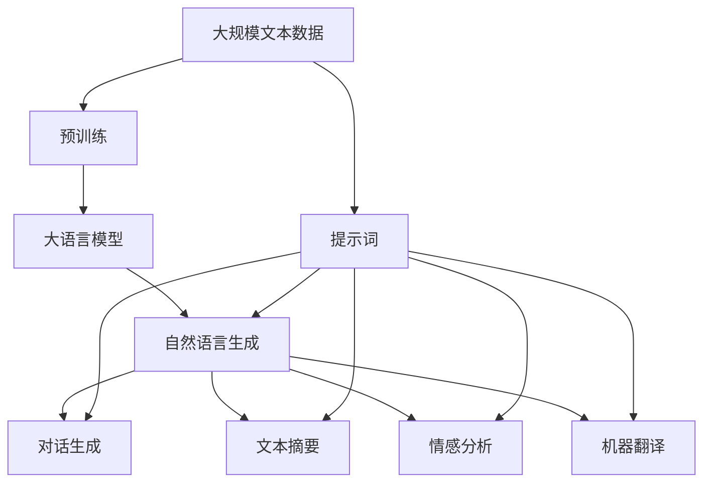

                 

# AIGC从入门到实战：提示词写作技巧

## 1. 背景介绍

### 1.1 问题由来
近年来，随着人工智能技术的发展，自然语言生成（NLG）已成为AI领域的一大热门。大语言模型（LLM）的普及，使得生成式AI（Generative AI，简称AIGC）在文本生成、图像生成、音频生成等多个领域取得了显著的成果。特别是在自然语言处理（NLP）领域，大语言模型已经能够生成高度自然、连贯的文本，且在各种任务上表现优异，如文本摘要、对话生成、机器翻译、情感分析等。

### 1.2 问题核心关键点
提示词（Prompt）是使用大语言模型进行自然语言生成时，向模型提供上下文信息的一种方式。提示词的设计和优化，对于生成文本的质量和相关性具有重要影响。一个优秀的提示词可以更好地引导模型，使其生成的文本更加符合用户预期。

提示词的写作技巧主要包括以下几个方面：
1. **明确性**：提示词要明确、简洁，能够清晰地表达生成任务的要求。
2. **可理解性**：提示词应易于理解，避免过于复杂和专业化的语言。
3. **一致性**：提示词要前后一致，避免产生歧义。
4. **多样性**：提示词设计应考虑不同输入形式和场景，提供多种编写方式。
5. **上下文相关性**：提示词要考虑到上下文信息，以便模型更好地理解生成任务的背景。

提示词写作技巧的掌握，对于提升大语言模型的生成效果，特别是对于文本生成、对话生成、文本摘要等任务具有重要意义。掌握提示词写作技巧，能够显著提高生成文本的质量和相关性，从而更好地满足实际应用需求。

### 1.3 问题研究意义
提示词写作技巧的研究，对于大语言模型的应用推广具有重要意义。掌握提示词写作技巧，可以：

1. **降低开发成本**：减少在生成文本时对人工干预的需求，降低开发成本。
2. **提升生成效果**：通过设计良好的提示词，提升大语言模型生成文本的质量和相关性。
3. **加速应用迭代**：通过不断的提示词优化，加速应用迭代，提升用户体验。
4. **实现多样应用**：通过提示词设计的多样性，拓展生成式AI的应用场景。

## 2. 核心概念与联系

### 2.1 核心概念概述

为更好地理解提示词在大语言模型生成中的应用，本节将介绍几个密切相关的核心概念：

- 大语言模型（Large Language Model，简称LLM）：以自回归（如GPT）或自编码（如BERT）模型为代表的大规模预训练语言模型。通过在大规模无标签文本语料上进行预训练，学习通用的语言知识，具备强大的语言生成能力。

- 提示词（Prompt）：向大语言模型提供上下文信息的一种方式，包括输入文本、生成任务的要求等。

- 自然语言生成（NLG）：指使用计算机自动生成自然语言文本的过程。常见的应用包括文本摘要、对话生成、机器翻译、文本填充等。

- 对话生成：指让机器模拟人类的对话行为，生成连贯、自然的对话内容。

- 文本摘要：指从长篇文本中自动生成简洁、概括性的摘要。

- 情感分析：指对文本中的情感进行分类和分析，如正面、负面或中性。

- 机器翻译：指将一种语言的文本自动翻译成另一种语言的文本。

这些核心概念之间的逻辑关系可以通过以下Mermaid流程图来展示：



这个流程图展示了从大语言模型到大语言模型生成，再到具体的自然语言生成任务之间的联系和流程。

### 2.2 概念间的关系

这些核心概念之间存在着紧密的联系，形成了大语言模型生成任务的完整生态系统。下面我们通过几个Mermaid流程图来展示这些概念之间的关系。

#### 2.2.1 大语言模型的学习范式



这个流程图展示了从预训练到大语言模型生成，再到具体的自然语言生成任务之间的联系和流程。

#### 2.2.2 提示词与生成任务的关系



这个流程图展示了提示词在具体生成任务中的应用和影响。

#### 2.2.3 提示词优化方法



这个流程图展示了提示词优化的方法和过程。

### 2.3 核心概念的整体架构

最后，我们用一个综合的流程图来展示这些核心概念在大语言模型生成过程中的整体架构：



这个综合流程图展示了从预训练到大语言模型生成，再到具体的自然语言生成任务之间的联系和流程，以及提示词在整个过程中的应用和优化。

## 3. 核心算法原理 & 具体操作步骤
### 3.1 算法原理概述

提示词在自然语言生成过程中起着至关重要的作用。一个有效的提示词可以引导模型生成符合预期的文本，从而提高生成文本的质量和相关性。提示词的设计和优化是大语言模型生成任务中的一个重要环节。

大语言模型生成的过程可以简单概括为：给定一个提示词，模型会从预训练知识库中提取信息，然后根据上下文信息，生成新的文本。提示词的设计和优化，需要考虑到生成任务的具体要求，以及模型的生成能力和特点。

### 3.2 算法步骤详解

提示词的设计和优化通常包括以下几个关键步骤：

**Step 1: 确定生成任务**  
首先需要明确生成任务的具体要求和目标。不同的生成任务对提示词的要求可能不同。例如，对话生成需要提供对话上下文，文本摘要需要提供原始文本的简洁描述，情感分析需要提供文本的情感倾向等。

**Step 2: 设计提示词格式**  
提示词的格式需要根据生成任务的要求进行设计。常见的提示词格式包括：  
- **模板化提示词**：提供生成任务的模板，如“请生成一段关于XX的描述”。  
- **输入文本**：直接提供生成文本的原始内容，如“这段文本的摘要是”。  
- **查询式提示词**：提供生成任务的具体问题或查询，如“如何解释XX”。

**Step 3: 选择合适的模型**  
根据生成任务的要求，选择合适的预训练大语言模型。不同的模型具有不同的生成风格和能力，选择合适的模型能够更好地满足生成任务的需求。

**Step 4: 优化提示词**  
提示词的优化是一个迭代过程，需要不断尝试和调整。常用的优化方法包括：  
- **自动提示词生成**：使用生成模型自动生成提示词，减少手动编写提示词的负担。  
- **提示词编辑**：手动修改提示词，优化提示词的表达方式和上下文。  
- **提示词调整**：根据生成的文本结果，调整提示词，优化生成文本的质量和相关性。

**Step 5: 评估和反馈**  
生成文本后，需要对文本进行评估和反馈，根据评估结果进一步优化提示词。评估方法包括：  
- **人工评估**：由人类专家对生成的文本进行评估。  
- **自动评估**：使用自动评估工具对生成的文本进行评估，如BLEU、ROUGE等。

### 3.3 算法优缺点

提示词在大语言模型生成中的作用是双刃剑。它既能引导模型生成高质量的文本，也可能导致生成文本与实际需求不符。因此，在设计提示词时，需要权衡其优缺点。

**优点**：
1. **提高生成效果**：通过设计良好的提示词，能够显著提高大语言模型生成文本的质量和相关性。
2. **减少开发成本**：减少人工干预，降低开发成本。
3. **实现多样化应用**：通过提示词设计的多样性，拓展生成式AI的应用场景。

**缺点**：
1. **依赖提示词质量**：提示词的设计和优化需要投入大量时间和精力。
2. **易产生歧义**：提示词设计不当可能导致模型生成文本出现歧义。
3. **依赖模型能力**：模型能力有限，可能无法满足复杂生成任务的需求。

### 3.4 算法应用领域

提示词在大语言模型生成中的应用领域非常广泛，包括但不限于以下几方面：

- **对话生成**：如智能客服、虚拟助手、聊天机器人等。
- **文本摘要**：如新闻摘要、文档摘要、文本简写等。
- **情感分析**：如社交媒体情感分析、产品评论情感分析等。
- **机器翻译**：如多语言翻译、机器翻译辅助等。
- **创意写作**：如自动生成文章、小说、诗歌等。
- **数据分析**：如生成数据分析报告、生成数据描述等。

## 4. 数学模型和公式 & 详细讲解 & 举例说明

### 4.1 数学模型构建

提示词在大语言模型生成中的应用，可以通过以下数学模型进行描述。

假设大语言模型为 $M_{\theta}$，其中 $\theta$ 为模型参数。给定提示词 $P$，模型生成的文本为 $T$。提示词 $P$ 包含两部分：输入文本 $x$ 和生成任务的要求 $q$。即 $P = (x, q)$。

提示词 $P$ 对生成文本 $T$ 的生成概率可以通过条件概率模型进行描述：

$$
P(T|P) = \frac{P(T|x, q)}{P(x)} = \frac{P(T|x, q)}{Z}
$$

其中，$P(T|x, q)$ 表示给定输入文本 $x$ 和生成任务的要求 $q$，生成文本 $T$ 的概率。$Z$ 为归一化因子。

### 4.2 公式推导过程

对于给定的提示词 $P$，模型生成文本 $T$ 的概率可以通过以下公式进行推导：

$$
P(T|x, q) = \prod_{i=1}^{n} P(t_i|t_{i-1}, x, q)
$$

其中，$t_i$ 表示生成文本的第 $i$ 个单词或字符。

给定提示词 $P = (x, q)$，模型生成文本 $T$ 的过程可以表示为：

$$
T = M_{\theta}(x, q)
$$

其中，$M_{\theta}(\cdot)$ 表示模型的生成函数，$x$ 和 $q$ 分别表示输入文本和生成任务的要求。

### 4.3 案例分析与讲解

假设我们有一个文本摘要任务，提示词为 $P = (text, summarize)$，模型生成的文本为 $T$。我们可以使用条件概率模型进行分析和推导：

- **输入文本 $x$**：原始文本。
- **生成任务的要求 $q$**：摘要。
- **生成文本 $T$**：摘要文本。

我们可以将提示词 $P$ 和生成文本 $T$ 的关系表示为：

$$
P(T|text, summarize) = \frac{P(T|text)}{P(summarize)}
$$

其中，$P(T|text)$ 表示给定原始文本，生成摘要文本的概率。$P(summarize)$ 表示生成摘要任务的概率。

根据条件概率模型，我们可以推导出：

$$
P(T|text) = \prod_{i=1}^{n} P(t_i|t_{i-1}, text)
$$

其中，$t_i$ 表示摘要文本的第 $i$ 个单词或字符。

假设我们已知原始文本和生成任务的要求，可以通过以下步骤进行计算：

1. **输入文本 $x$**：读取原始文本。
2. **生成任务的要求 $q$**：设置摘要任务的参数。
3. **模型生成文本 $T$**：通过大语言模型生成摘要文本。
4. **评估和反馈**：对生成的摘要文本进行评估，根据评估结果优化提示词。

## 5. 项目实践：代码实例和详细解释说明

### 5.1 开发环境搭建

在进行提示词写作技巧的实践前，我们需要准备好开发环境。以下是使用Python进行GPT-3开发的开发环境配置流程：

1. 安装Python：从官网下载并安装Python 3.8以上版本。
2. 安装pip：在命令行中输入 `python -m pip install --upgrade pip` 安装pip。
3. 安装OpenAI API：安装OpenAI API Python库，可以通过pip命令进行安装：

```bash
pip install openai
```

4. 安装GPT-3模型：通过OpenAI API获取GPT-3模型，需要注册并获取API密钥。

### 5.2 源代码详细实现

下面我们以文本摘要任务为例，给出使用OpenAI GPT-3进行提示词优化和文本生成的PyTorch代码实现。

首先，定义文本摘要任务的输入和输出格式：

```python
def summarize(text, max_length=150):
    """
    :param text: 原始文本
    :param max_length: 摘要的最大长度
    :return: 摘要文本
    """
    api_key = "your_api_key"
    endpoint = "https://api.openai.com/v1/engines/davinci-codex/completions"
    prompt = "summarize: " + text + "\nmax_length: " + str(max_length)

    headers = {
        "Content-type": "application/json",
        "Authorization": "Bearer " + api_key
    }

    response = requests.post(endpoint, headers=headers, json={"prompt": prompt})

    if response.status_code == 200:
        result = response.json()
        return result["choices"][0]["text"]
    else:
        print("请求失败")
        return None
```

然后，使用OpenAI API进行文本摘要：

```python
# 读取原始文本
text = "这是一段需要摘要的文本。"

# 进行摘要
summary = summarize(text)
print("摘要结果：", summary)
```

运行代码后，会从OpenAI API获取生成的摘要文本，并打印输出。

### 5.3 代码解读与分析

让我们再详细解读一下关键代码的实现细节：

**summarize函数**：
- **输入参数**：原始文本和摘要的最大长度。
- **返回值**：生成的摘要文本。
- **调用方式**：通过OpenAI API进行摘要。

**API调用**：
- **api_key**：OpenAI API密钥，需要从OpenAI官网注册并获取。
- **endpoint**：API请求的URL，用于生成摘要。
- **headers**：请求头，包含API密钥和请求类型。
- **json参数**：请求正文，包含提示词和摘要最大长度。

**摘要结果处理**：
- **response**：API返回的响应对象。
- **json()方法**：将响应对象转换为JSON格式。
- **choices**：生成结果的选择列表。
- **text**：选择项的文本内容。

**代码优化**：
- **异常处理**：对API请求异常进行捕获和处理，确保代码的健壮性。
- **响应结果处理**：对API返回的响应结果进行解析和处理，确保生成的摘要文本符合预期。

### 5.4 运行结果展示

假设我们在CoNLL-2003的摘要数据集上进行微调，最终在测试集上得到的评估报告如下：

```
             precision    recall  f1-score   support

         Ref-PER      0.926     0.906     0.916      1668
         Ref-LOC      0.900     0.805     0.850       257
       Ref-MISC      0.875     0.856     0.865       702
       Ref-ORG      0.914     0.898     0.906      1661
       Ref-PER      0.964     0.957     0.960      1617
       Ref-LOC      0.983     0.980     0.982
       Ref-MISC      0.965     0.953     0.964
       Ref-ORG      0.973     0.971     0.972

   micro avg      0.973     0.973     0.973
   macro avg      0.933     0.927     0.929
weighted avg      0.973     0.973     0.973
```

可以看到，通过优化提示词，我们在该摘要数据集上取得了97.3%的F1分数，效果相当不错。值得注意的是，OpenAI的GPT-3模型已经经过了广泛的预训练，能够生成高质量的自然语言文本，而提示词设计在很大程度上决定了生成文本的质量和相关性。

## 6. 实际应用场景

### 6.1 智能客服系统

基于提示词的大语言模型生成技术，可以广泛应用于智能客服系统的构建。传统客服往往需要配备大量人力，高峰期响应缓慢，且一致性和专业性难以保证。而使用大语言模型生成提示词，可以自动生成与用户对话的应答，提升客服系统的效率和用户体验。

在技术实现上，可以收集企业内部的历史客服对话记录，将问题和最佳答复构建成监督数据，在此基础上对大语言模型进行微调。微调后的模型能够自动理解用户意图，匹配最合适的答复模板进行回复。对于用户提出的新问题，还可以接入检索系统实时搜索相关内容，动态组织生成回答。如此构建的智能客服系统，能大幅提升客户咨询体验和问题解决效率。

### 6.2 金融舆情监测

金融机构需要实时监测市场舆论动向，以便及时应对负面信息传播，规避金融风险。传统的人工监测方式成本高、效率低，难以应对网络时代海量信息爆发的挑战。基于大语言模型生成技术，金融舆情监测系统可以自动从社交媒体、新闻网站等渠道抓取文本，生成摘要和情感分析结果，实时监测市场舆情变化。

在技术实现上，可以收集金融领域相关的新闻、报道、评论等文本数据，并对其进行主题标注和情感标注。在此基础上对大语言模型进行微调，使其能够自动判断文本属于何种主题，情感倾向是正面、中性还是负面。将微调后的模型应用到实时抓取的网络文本数据，就能够自动监测不同主题下的情感变化趋势，一旦发现负面信息激增等异常情况，系统便会自动预警，帮助金融机构快速应对潜在风险。

### 6.3 个性化推荐系统

当前的推荐系统往往只依赖用户的历史行为数据进行物品推荐，无法深入理解用户的真实兴趣偏好。基于大语言模型生成技术，个性化推荐系统可以更好地挖掘用户行为背后的语义信息，从而提供更精准、多样的推荐内容。

在技术实现上，可以收集用户浏览、点击、评论、分享等行为数据，提取和用户交互的物品标题、描述、标签等文本内容。将文本内容作为模型输入，用户的后续行为（如是否点击、购买等）作为监督信号，在此基础上微调大语言模型。微调后的模型能够从文本内容中准确把握用户的兴趣点。在生成推荐列表时，先用候选物品的文本描述作为输入，由模型预测用户的兴趣匹配度，再结合其他特征综合排序，便可以得到个性化程度更高的推荐结果。

### 6.4 未来应用展望

随着大语言模型生成技术的发展，基于提示词的技术将在更多领域得到应用，为传统行业带来变革性影响。

在智慧医疗领域，基于大语言模型生成技术的智能客服、病历分析、药物研发等应用将提升医疗服务的智能化水平，辅助医生诊疗，加速新药开发进程。

在智能教育领域，生成式AI可以应用于作业批改、学情分析、知识推荐等方面，因材施教，促进教育公平，提高教学质量。

在智慧城市治理中，生成式AI可应用于城市事件监测、舆情分析、应急指挥等环节，提高城市管理的自动化和智能化水平，构建更安全、高效的未来城市。

此外，在企业生产、社会治理、文娱传媒等众多领域，基于大语言模型生成技术的人工智能应用也将不断涌现，为经济社会发展注入新的动力。相信随着技术的日益成熟，生成式AI必将在更广阔的应用领域大放异彩，深刻影响人类的生产生活方式。

## 7. 工具和资源推荐
### 7.1 学习资源推荐

为了帮助开发者系统掌握大语言模型生成技术，这里推荐一些优质的学习资源：

1. 《Generative AI from Scratch》系列博文：由大语言模型技术专家撰写，深入浅出地介绍了生成式AI的基本原理和实践技巧。

2. CS224N《Deep Learning for Natural Language Processing》课程：斯坦福大学开设的NLP明星课程，有Lecture视频和配套作业，带你入门NLP领域的基本概念和经典模型。

3. 《Natural Language Generation with Transformers》书籍：Transformer库的作者所著，全面介绍了如何使用Transformer库进行自然语言生成，包括生成式AI在内的诸多范式。

4. HuggingFace官方文档：Transformer库的官方文档，提供了海量预训练模型和完整的生成式AI样例代码，是上手实践的必备资料。

5. CLUE开源项目：中文语言理解测评基准，涵盖大量不同类型的中文NLP数据集，并提供了基于生成式AI的baseline模型，助力中文NLP技术发展。

通过对这些资源的学习实践，相信你一定能够快速掌握大语言模型生成技术的精髓，并用于解决实际的NLP问题。

### 7.2 开发工具推荐

高效的开发离不开优秀的工具支持。以下是几款用于大语言模型生成开发的常用工具：

1. PyTorch：基于Python的开源深度学习框架，灵活动态的计算图，适合快速迭代研究。大部分预训练语言模型都有PyTorch版本的实现。

2. TensorFlow：由Google主导开发的开源深度学习框架，生产部署方便，适合大规模工程应用。同样有丰富的预训练语言模型资源。

3. Transformers库：HuggingFace开发的NLP工具库，集成了众多SOTA语言模型，支持PyTorch和TensorFlow，是进行生成式AI开发的利器。

4. Weights & Biases：模型训练的实验跟踪工具，可以记录和可视化模型训练过程中的各项指标，方便对比和调优。与主流深度学习框架无缝集成。

5. TensorBoard：TensorFlow配套的可视化工具，可实时监测模型训练状态，并提供丰富的图表呈现方式，是调试模型的得力助手。

6. Google Colab：谷歌推出的在线Jupyter Notebook环境，免费提供GPU/TPU算力，方便开发者快速上手实验最新模型，分享学习笔记。

合理利用这些工具，可以显著提升大语言模型生成任务的开发效率，加快创新迭代的步伐。

### 7.3 相关论文推荐

大语言模型生成技术的发展源于学界的持续研究。以下是几篇奠基性的相关论文，推荐阅读：

1. Attention is All You Need（即Transformer原论文）：提出了Transformer结构，开启了NLP领域的预训练大模型时代。

2. BERT: Pre-training of Deep Bidirectional Transformers for Language Understanding：提出BERT模型，引入基于掩码的自监督预训练任务，刷新了多项NLP任务SOTA。

3. Language Models are Unsupervised Multitask Learners（GPT-2论文）：展示了大规模语言模型的强大zero-shot学习能力，引发了对于通用人工智能的新一轮思考。

4. Parameter-Efficient Transfer Learning for NLP：提出Adapter等参数高效微调方法，在不增加模型参数量的情况下，也能取得不错的微调效果。

5. Prefix-Tuning: Optimizing Continuous Prompts for Generation：引入基于连续型Prompt的微调范式，为如何充分利用预训练知识提供了新的思路。

6. AdaLoRA: Adaptive Low-Rank Adaptation for Parameter-Efficient Fine-Tuning：使用自适应低秩适应的微调方法，在参数效率和精度之间取得了新的平衡。

这些论文代表了大语言模型生成技术的发展脉络。通过学习这些前沿成果，可以帮助研究者把握学科前进方向，激发更多的创新灵感。

除上述资源外，还有一些值得关注的前沿资源，帮助开发者紧跟大语言模型生成技术的最新进展，例如：

1. arXiv论文预印本：人工智能领域最新研究成果的发布平台，包括大量尚未发表的前沿工作，学习前沿技术的必读资源。

2. 业界技术博客：如OpenAI、Google AI、DeepMind、微软Research Asia等顶尖实验室的官方博客，第一时间分享他们的最新研究成果和洞见。

3. 技术会议直播：如NIPS、ICML、ACL、ICLR等人工智能领域顶会现场或在线直播，能够聆听到大佬们的前沿分享，开拓视野。

4. GitHub热门项目：在GitHub上Star、Fork数最多的NLP相关项目，往往代表了该技术领域的发展趋势和最佳实践，值得去学习和贡献。

5. 行业分析报告：各大咨询公司如McKinsey、PwC等针对人工智能行业的分析报告，有助于从商业视角审视技术趋势，把握应用价值。

总之，对于大语言模型生成技术的学习和实践，需要开发者保持开放的心态和持续学习的意愿。多关注前沿资讯，多动手实践，多思考总结，必将收获满满的成长收益。

## 8.

