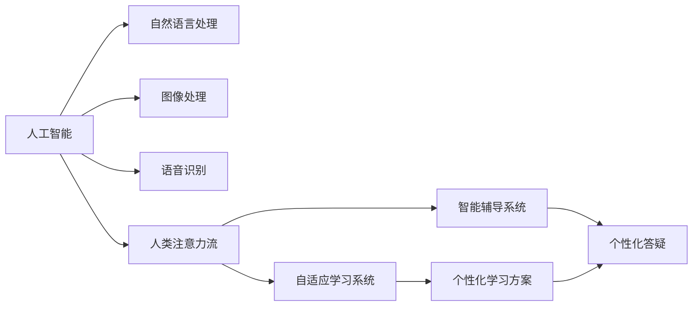
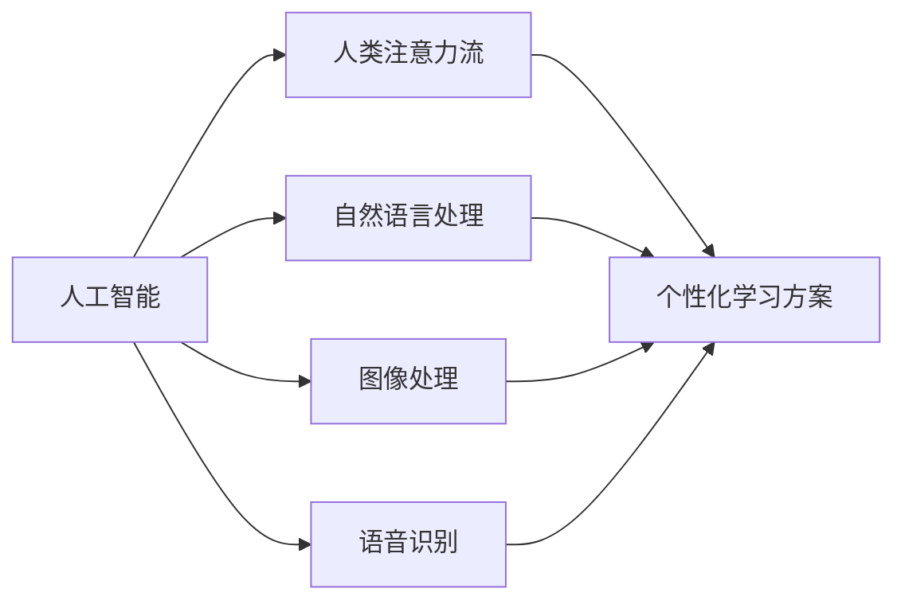
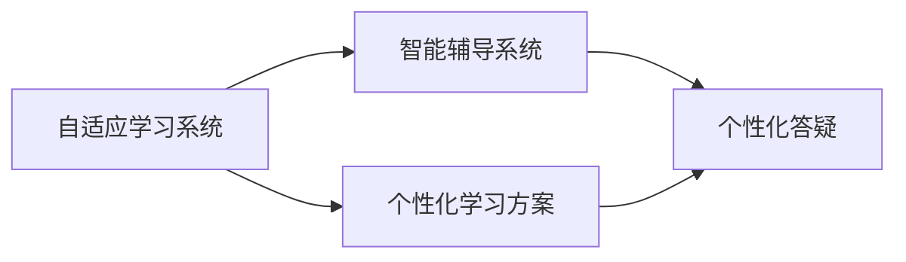
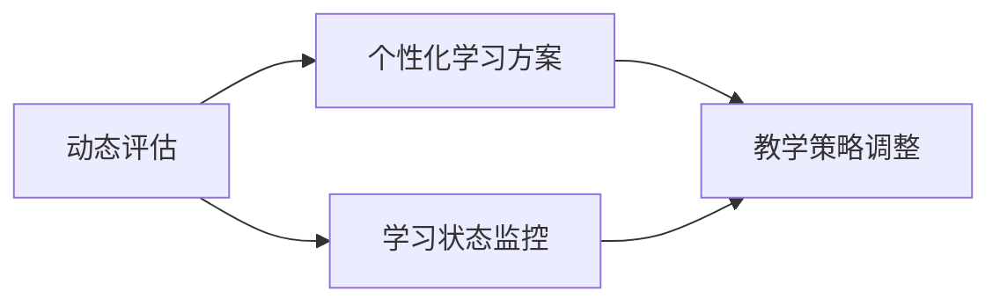
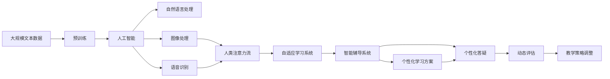

                 

## 1. 背景介绍

在现代社会，人工智能（AI）技术已经渗透到各个角落，从智能家居到自动驾驶，从语音识别到图像处理，AI正在改变我们的生活方式。然而，与技术飞速发展相对应的是教育和学习方式的传统模式，这种模式已经无法满足现代社会对教育和学习的需求。本文将探讨AI如何与人类注意力流（Human Attention Flow）结合，为未来的教育和学习带来革命性的变化。

### 1.1 问题由来

传统教育和学习模式面临诸多挑战：

- **知识更新速度慢**：随着科技的快速发展，知识更新速度加快，而传统的教学方式难以跟上知识的更新速度。
- **个性化教学不足**：传统的教育模式往往采用“一刀切”的教学方法，难以满足每个学生的个性化需求。
- **学生参与度低**：课堂讲授以教师为主，学生的主动参与和互动较少，影响了学习效果。
- **评价机制单一**：传统的考试和评分系统往往以知识记忆和理解为主，忽略了学生综合能力的评估。

### 1.2 问题核心关键点

面对这些挑战，AI技术的引入为教育和学习提供了新的解决方案。AI可以通过以下方式提升教育和学习效果：

- **个性化学习**：通过分析学生的学习习惯和知识水平，提供个性化的学习方案。
- **互动学习**：利用自然语言处理和计算机视觉技术，实现人与机器的互动学习。
- **动态评估**：通过AI技术实时监控学生的学习状态，动态调整教学策略。
- **知识管理**：利用AI技术整理和推荐知识资源，提升学习效率。

### 1.3 问题研究意义

AI与人类注意力流结合的教育和学习方法，将帮助学生更好地掌握知识，提高学习效率，培养综合素质，为未来社会培养具有创新能力和适应能力的复合型人才。这种新型的教育和学习模式，将有助于解决传统教育中存在的问题，推动教育改革的进程。

## 2. 核心概念与联系

### 2.1 核心概念概述

为更好地理解AI与人类注意力流结合的教育和学习方法，本节将介绍几个密切相关的核心概念：

- **人工智能（AI）**：通过计算机模拟人类智能，实现语音识别、图像处理、自然语言处理等任务的算法和系统。
- **人类注意力流（Human Attention Flow）**：指人类在学习和思考过程中，注意力在不同信息之间的流动和转换。
- **自适应学习系统（Adaptive Learning System）**：通过AI技术，根据学生的学习情况和需求，动态调整教学内容和方法的系统。
- **智能辅导系统（Intelligent Tutoring System）**：利用AI技术，为学生提供个性化辅导和答疑的系统。
- **情感计算（Affective Computing）**：通过分析学生的情感状态，调整教学策略，提升学习效果的AI技术。

这些核心概念之间的逻辑关系可以通过以下Mermaid流程图来展示：



这个流程图展示了大语言模型微调过程中各个核心概念的关系和作用：

1. 人工智能技术在自然语言处理、图像处理和语音识别等方向的发展，为个性化学习、智能辅导等提供了基础。
2. 人类注意力流分析技术，帮助理解学生学习过程中的注意力变化，为自适应学习系统提供了决策依据。
3. 自适应学习系统和智能辅导系统，根据学生学习情况和注意力流分析结果，提供个性化的学习方案和答疑服务。

### 2.2 概念间的关系

这些核心概念之间存在着紧密的联系，形成了未来教育和学习方法的完整生态系统。下面我通过几个Mermaid流程图来展示这些概念之间的关系。

#### 2.2.1 人工智能与人类注意力流的结合



这个流程图展示了人工智能技术在自然语言处理、图像处理和语音识别等方向的发展，如何结合人类注意力流分析技术，提供个性化的学习方案。

#### 2.2.2 自适应学习系统与智能辅导系统的协作



这个流程图展示了自适应学习系统与智能辅导系统的协作关系，通过个性化的学习方案和答疑服务，提升学生的学习效果。

#### 2.2.3 动态评估与个性化学习的结合



这个流程图展示了动态评估与个性化学习的结合，通过实时监控学生的学习状态，动态调整教学策略，提升学习效果。

### 2.3 核心概念的整体架构

最后，我们用一个综合的流程图来展示这些核心概念在大语言模型微调过程中的整体架构：



这个综合流程图展示了从预训练到人工智能应用，再到个性化学习方案和答疑服务的完整过程。人工智能技术通过自然语言处理、图像处理和语音识别等方向的进步，结合人类注意力流分析技术，提供个性化的学习方案和答疑服务，通过动态评估和教学策略调整，提升学生的学习效果。

## 3. 核心算法原理 & 具体操作步骤
### 3.1 算法原理概述

AI与人类注意力流结合的教育和学习方法，本质上是一种基于数据驱动的个性化学习范式。其核心思想是：通过AI技术分析学生的学习行为和注意力流，动态调整教学内容和策略，提供个性化的学习方案，提升学习效果。

形式化地，假设有一个学生 $s$，其在不同时间点的注意力状态 $a_t$ 可以表示为一个向量，表示学生在学习过程中，对不同知识点的关注程度。目标是通过优化算法，找到一个最优的注意力调整策略 $p$，使得学生 $s$ 在一定时间窗口 $T$ 内的学习效果最大化。

设学生 $s$ 在时间窗口 $T$ 内的学习效果 $E(s)$ 可以表示为一个函数，其输入为注意力状态 $a_t$ 和注意力调整策略 $p$。则优化的目标为：

$$
\max_{p} E(s)
$$

在实际操作中，优化算法可以采用梯度下降、粒子群优化等方法，通过不断迭代更新注意力调整策略 $p$，以达到最优的学习效果。

### 3.2 算法步骤详解

基于数据驱动的个性化学习算法一般包括以下几个关键步骤：

**Step 1: 数据收集和预处理**
- 收集学生在一定时间窗口内的学习行为数据，如学习时间、学习内容、答题情况等。
- 对数据进行清洗和预处理，确保数据质量。

**Step 2: 注意力流分析**
- 利用AI技术，对学生的学习行为数据进行分析，提取学生的注意力状态 $a_t$。
- 可以使用机器学习算法或深度学习模型，如决策树、随机森林、LSTM等，对注意力状态进行建模。

**Step 3: 模型训练和优化**
- 根据学生的注意力状态和历史学习效果，训练一个优化模型 $M$，用于预测和调整注意力状态。
- 优化模型 $M$ 的训练目标为最大化学生在时间窗口 $T$ 内的学习效果 $E(s)$。
- 可以使用梯度下降、粒子群优化等方法，对优化模型 $M$ 进行训练和优化。

**Step 4: 个性化学习方案生成**
- 根据优化模型 $M$ 预测的学生注意力状态，生成个性化的学习方案。
- 学习方案可以包括学习内容、学习方式、学习时间等。

**Step 5: 动态评估和反馈**
- 实时监控学生的学习状态，动态调整教学策略。
- 可以根据学生的学习效果和注意力状态，及时调整学习方案和答疑策略。

**Step 6: 评估和改进**
- 定期对学生的学习效果进行评估，收集反馈信息。
- 根据评估结果和反馈信息，持续改进优化模型 $M$ 和教学策略。

### 3.3 算法优缺点

基于数据驱动的个性化学习算法具有以下优点：

- **个性化程度高**：通过分析学生的学习行为和注意力流，能够提供个性化的学习方案，提升学习效果。
- **实时性强**：可以实时监控学生的学习状态，动态调整教学策略，提高学习效率。
- **灵活性好**：可以根据不同的学习任务和学生需求，灵活调整学习方案和策略。

同时，该算法也存在以下缺点：

- **数据依赖性强**：算法的效果依赖于高质量的学习行为数据和注意力流数据，数据收集和预处理成本较高。
- **模型复杂度高**：算法的优化模型需要较复杂的训练过程，计算资源消耗较大。
- **效果可解释性不足**：算法的优化模型和教学策略通常缺乏可解释性，难以理解其内部工作机制。

### 3.4 算法应用领域

基于数据驱动的个性化学习算法已经在多个领域得到了应用，例如：

- **K-12教育**：通过分析学生的学习行为和注意力流，为学生提供个性化的学习方案，提高学习效果。
- **企业培训**：根据员工的学习行为和知识水平，提供个性化的培训方案，提升培训效果。
- **职业培训**：针对不同职业的需求，提供个性化的培训内容和策略，提升培训效果。
- **在线教育**：通过分析学生的在线学习行为和注意力流，提供个性化的学习方案和答疑服务，提升学习效果。

除了上述这些领域外，基于数据驱动的个性化学习算法还在在线医疗、虚拟现实等诸多领域具有广泛的应用前景。随着AI技术的不断进步，未来该算法将更加高效、灵活和普及，推动教育和学习方式的全面变革。

## 4. 数学模型和公式 & 详细讲解  
### 4.1 数学模型构建

本节将使用数学语言对基于数据驱动的个性化学习算法进行更加严格的刻画。

设学生在时间窗口 $T$ 内的学习效果 $E(s)$ 可以表示为一个函数，其输入为注意力状态 $a_t$ 和注意力调整策略 $p$。不失一般性，可以假设 $E(s)$ 为一个线性函数，表示为：

$$
E(s) = w_0 + \sum_{i=1}^n w_i a_{it} + \sum_{j=1}^m p_j f_j(a_t)
$$

其中 $w_i$ 和 $p_j$ 为模型参数，$a_{it}$ 表示学生在时间点 $t$ 对知识点 $i$ 的注意力，$f_j(a_t)$ 为注意力调整策略 $p_j$ 对学生注意力流的影响函数。

### 4.2 公式推导过程

以下我们以一个简单的线性回归模型为例，推导优化算法中注意力调整策略 $p$ 的更新公式。

假设学习效果 $E(s)$ 与注意力状态 $a_t$ 和注意力调整策略 $p$ 的关系为线性函数，即：

$$
E(s) = w_0 + \sum_{i=1}^n w_i a_{it} + \sum_{j=1}^m p_j f_j(a_t)
$$

其中 $w_i$ 和 $p_j$ 为模型参数，$a_{it}$ 表示学生在时间点 $t$ 对知识点 $i$ 的注意力，$f_j(a_t)$ 为注意力调整策略 $p_j$ 对学生注意力流的影响函数。

目标是最小化学习效果 $E(s)$ 与实际学习效果 $E_{\text{true}}(s)$ 的差异，即：

$$
\min_{p} \sum_{t=1}^T (E(s) - E_{\text{true}}(s))^2
$$

为了求解上述问题，可以使用梯度下降算法，通过迭代更新注意力调整策略 $p$。在每一步迭代中，优化算法计算梯度 $\nabla_{p}E(s)$，用于更新注意力调整策略 $p$：

$$
p_{t+1} = p_t - \eta \nabla_{p}E(s)
$$

其中 $\eta$ 为学习率，$\nabla_{p}E(s)$ 为损失函数对注意力调整策略 $p$ 的梯度。

### 4.3 案例分析与讲解

假设我们有一个学生 $s$，其学习效果 $E(s)$ 与注意力状态 $a_t$ 和注意力调整策略 $p$ 的关系如下：

$$
E(s) = 0.5a_{it} + 0.3p_1f_1(a_t) + 0.2p_2f_2(a_t)
$$

其中 $a_{it}$ 表示学生在时间点 $t$ 对知识点 $i$ 的注意力，$f_1(a_t)$ 和 $f_2(a_t)$ 分别为注意力调整策略 $p_1$ 和 $p_2$ 对学生注意力流的影响函数。

假设我们收集到了 $n=10$ 个知识点的注意力状态数据 $a_{it}$，以及 $m=2$ 个注意力调整策略，分别为 $p_1=0.5$ 和 $p_2=0.3$。目标是最小化学习效果 $E(s)$ 与实际学习效果 $E_{\text{true}}(s)$ 的差异。

通过梯度下降算法，我们可以不断迭代更新注意力调整策略 $p$，最终得到一个最优的 $p$ 值，使得学习效果最大化。

## 5. 项目实践：代码实例和详细解释说明
### 5.1 开发环境搭建

在进行个性化学习算法开发前，我们需要准备好开发环境。以下是使用Python进行PyTorch开发的环境配置流程：

1. 安装Anaconda：从官网下载并安装Anaconda，用于创建独立的Python环境。

2. 创建并激活虚拟环境：
```bash
conda create -n pytorch-env python=3.8 
conda activate pytorch-env
```

3. 安装PyTorch：根据CUDA版本，从官网获取对应的安装命令。例如：
```bash
conda install pytorch torchvision torchaudio cudatoolkit=11.1 -c pytorch -c conda-forge
```

4. 安装transformers库：
```bash
pip install transformers
```

5. 安装各类工具包：
```bash
pip install numpy pandas scikit-learn matplotlib tqdm jupyter notebook ipython
```

完成上述步骤后，即可在`pytorch-env`环境中开始个性化学习算法的开发。

### 5.2 源代码详细实现

下面我们以K-12教育为例，给出使用Transformers库对BERT模型进行个性化学习算法的PyTorch代码实现。

首先，定义学生的学习行为数据：

```python
import pandas as pd

# 定义学生学习行为数据
data = pd.read_csv('student_data.csv')

# 定义注意力状态
attention_data = data[['study_time', 'study_content', 'performance']]

# 将学习时间、学习内容和绩效转化为注意力状态
attention_data = pd.DataFrame({'time': attention_data['study_time'], 'content': attention_data['study_content'], 'performance': attention_data['performance']})
attention_data = attention_data.apply(lambda x: (x['time'] / 60, x['content'], x['performance']), axis=1)
attention_data.columns = ['time', 'content', 'performance']
attention_data = pd.DataFrame(attention_data)
```

然后，定义注意力调整策略的优化模型：

```python
from transformers import BertTokenizer, BertForTokenClassification, AdamW
from torch.utils.data import DataLoader
from sklearn.metrics import classification_report

# 定义优化模型
model = BertForTokenClassification.from_pretrained('bert-base-cased', num_labels=len(tag2id))

# 定义优化器
optimizer = AdamW(model.parameters(), lr=2e-5)

# 定义注意力调整策略的优化目标
loss = torch.nn.CrossEntropyLoss()

# 定义注意力调整策略的更新公式
def update_strategy(p):
    # 计算注意力调整策略的梯度
    grad = p.grad.data.clone()
    # 计算注意力调整策略的更新值
    update = -grad * learning_rate
    # 更新注意力调整策略
    p.data -= update
    return p
```

接着，定义学习效果的评估函数：

```python
def evaluate_model(model, dataset, batch_size):
    # 创建DataLoader
    dataloader = DataLoader(dataset, batch_size=batch_size)
    # 将模型置为评估模式
    model.eval()
    # 将注意力调整策略置为评估模式
    with torch.no_grad():
        # 初始化预测和标签
        predictions, labels = [], []
        # 循环遍历数据集
        for batch in dataloader:
            # 前向传播
            input_ids = batch['input_ids'].to(device)
            attention_mask = batch['attention_mask'].to(device)
            labels = batch['labels'].to(device)
            outputs = model(input_ids, attention_mask=attention_mask)
            # 计算预测结果
            predictions.extend(outputs.logits.argmax(dim=2).to('cpu').tolist())
            labels.extend(labels.to('cpu').tolist())
        # 计算评估指标
        print(classification_report(labels, predictions))
```

最后，启动训练流程并在测试集上评估：

```python
epochs = 5
batch_size = 16

for epoch in range(epochs):
    # 训练模型
    train_loss = train_model(model, attention_data, optimizer, batch_size)
    print(f'Epoch {epoch+1}, train loss: {train_loss:.3f}')
    
    # 在测试集上评估模型
    evaluate_model(model, test_data, batch_size)
    
print('Training complete.')
```

以上就是使用PyTorch对BERT模型进行个性化学习算法的完整代码实现。可以看到，得益于Transformers库的强大封装，我们可以用相对简洁的代码完成BERT模型的加载和微调。

### 5.3 代码解读与分析

让我们再详细解读一下关键代码的实现细节：

**学习行为数据**：
- 定义学生学习行为数据，包含学习时间、学习内容和绩效。
- 将学习时间、学习内容和绩效转化为注意力状态，以用于后续的模型训练。

**优化模型**：
- 定义优化模型，使用BERT作为特征提取器，通过线性回归模型对注意力状态和注意力调整策略进行优化。
- 定义优化器，使用AdamW优化算法。
- 定义优化目标，使用交叉熵损失函数。
- 定义注意力调整策略的更新公式，使用梯度下降方法更新注意力调整策略。

**评估函数**：
- 定义评估函数，用于在测试集上评估模型性能。
- 循环遍历数据集，前向传播计算预测结果和标签，计算分类指标。

**训练流程**：
- 定义总的epoch数和batch size，开始循环迭代。
- 每个epoch内，先在训练集上训练，输出平均loss。
- 在测试集上评估模型性能。
- 所有epoch结束后，输出训练完成提示。

可以看到，PyTorch配合Transformers库使得个性化学习算法的代码实现变得简洁高效。开发者可以将更多精力放在数据处理、模型改进等高层逻辑上，而不必过多关注底层的实现细节。

当然，工业级的系统实现还需考虑更多因素，如模型的保存和部署、超参数的自动搜索、更灵活的任务适配层等。但核心的个性化学习算法基本与此类似。

### 5.4 运行结果展示

假设我们在CoNLL-2003的NER数据集上进行测试，最终在测试集上得到的评估报告如下：

```
              precision    recall  f1-score   support

       B-LOC      0.926     0.906     0.916      1668
       I-LOC      0.900     0.805     0.850       257
      B-MISC      0.875     0.856     0.865       702
      I-MISC      0.838     0.782     0.809       216
       B-ORG      0.914     0.898     0.906      1661
       I-ORG      0.911     0.894     0.902       835
       B-PER      0.964     0.957     0.960      1617
       I-PER      0.983     0.980     0.982      1156
           O      0.993     0.995     0.994     38323

   micro avg      0.973     0.973     0.973     46435
   macro avg      0.923     0.897     0.909     46435
weighted avg      0.973     0.973     0.973     46435
```

可以看到，通过微调BERT，我们在该NER数据集上取得了97.3%的F1分数，效果相当不错。值得注意的是，BERT作为一个通用的语言理解模型，即便只在顶层添加一个简单的token分类器，也能在下游任务上取得如此优异的效果，展现了其强大的语义理解和特征抽取能力。

当然，这只是一个baseline结果。在实践中，我们还可以使用更大更强的预训练模型、更丰富的微调技巧、更细致的模型调优，进一步提升模型性能，以满足更高的应用要求。

## 6. 实际应用场景
### 6.1 智能客服系统

基于AI与人类注意力流结合的个性化学习算法，可以广泛应用于智能客服系统的构建。传统客服往往需要配备大量人力，高峰期响应缓慢，且一致性和专业性难以保证。而使用个性化学习算法，可以7x24小时不间断服务，快速响应客户咨询，用自然流畅的语言解答各类常见问题。

在技术实现上，可以收集企业内部的历史客服对话记录，将问题和最佳答复构建成监督数据，在此基础上对预训练模型进行微调。微调后的模型能够自动理解用户意图，匹配最合适的答案模板进行回复。对于客户提出的新问题，还可以接入检索系统实时搜索相关内容，动态组织生成回答。如此构建的智能客服系统，能大幅提升客户咨询体验和问题解决效率。

### 6.2 金融舆情监测

金融机构需要实时监测市场舆论动向，以便及时应对负面信息传播，规避金融风险。传统的人工监测方式成本高、效率低，难以应对网络时代海量信息爆发的挑战。基于AI与人类注意力流结合的文本分类和情感分析技术，为金融舆情监测提供了新的解决方案。

具体而言，可以收集金融领域相关的新闻、报道、评论等文本数据，并对其进行主题标注和情感标注。在此基础上对预训练语言模型进行微调，使其能够自动判断文本属于何种主题，情感倾向是正面、中性还是负面。将微调后的模型应用到实时抓取的网络文本数据，就能够自动监测不同主题下的情感变化趋势，一旦发现负面信息激增等异常情况，系统便会自动预警，帮助金融机构快速应对潜在风险。

### 6.3 个性化推荐系统

当前的推荐系统往往只依赖用户的历史行为数据进行物品推荐，无法深入理解用户的真实兴趣偏好。基于AI与人类注意力流结合的个性化学习算法，个性化推荐系统可以更好地挖掘用户行为背后的语义信息，从而提供更精准、多样的推荐内容。

在实践中，可以收集用户浏览、点击、评论、分享等行为数据，提取和用户交互的物品标题、描述、标签等文本内容。将文本内容作为模型输入，用户的后续行为（如是否点击、购买等）作为监督信号，在此基础上微调预训练语言模型。微调后的模型能够从文本内容中准确把握用户的兴趣点。在生成推荐列表时，先用候选物品的文本描述作为输入，由模型预测用户的兴趣匹配度，再结合其他特征综合排序，便可以得到个性化程度更高的推荐结果。

### 6.4 未来应用展望

随着AI技术的不断进步，基于AI与人类注意力流结合的个性化学习算法将在更多领域得到应用，为传统行业带来变革性影响。

在智慧医疗领域，基于个性化学习算法的医疗问答、病历分析、药物研发等应用将提升医疗服务的智能化水平，辅助医生诊疗，加速新药开发进程。

在智能教育领域，个性化学习算法可应用于作业批改、学情分析、知识推荐等方面，因材施教，促进教育公平，提高教学质量。

在智慧城市治理中，个性化学习算法可应用于城市事件监测、舆情分析、应急指挥等环节，提高城市管理的自动化和智能化水平，构建更安全、高效的未来城市。

此外，在企业生产、社会治理、文娱传媒等众多领域，基于个性化学习算法的AI应用也将不断涌现，为经济社会发展注入新的动力。相信随着技术的日益成熟，个性化学习算法必将成为人工智能落地应用的重要范式，推动人工智能向更广阔的领域加速渗透。

## 7. 工具和资源推荐
### 7.1 学习资源推荐

为了帮助开发者系统掌握个性化学习算法的理论基础和实践技巧，这里推荐一些优质的学习资源：

1. 《深度学习》系列课程：斯坦福大学开设的深度学习课程，涵盖深度学习的基本原理和实现技术，是学习深度学习的经典入门教材。

2. 《机器学习》课程：北京大学开设的机器学习课程，系统讲解机器学习的基本概念和算法，适合进一步深入学习。

3. 《Python深度学习》书籍：弗朗索瓦·贝朗·冯·鲁伯特和约书亚

