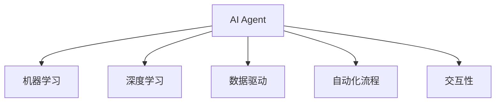
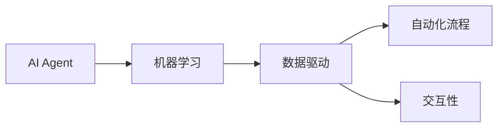
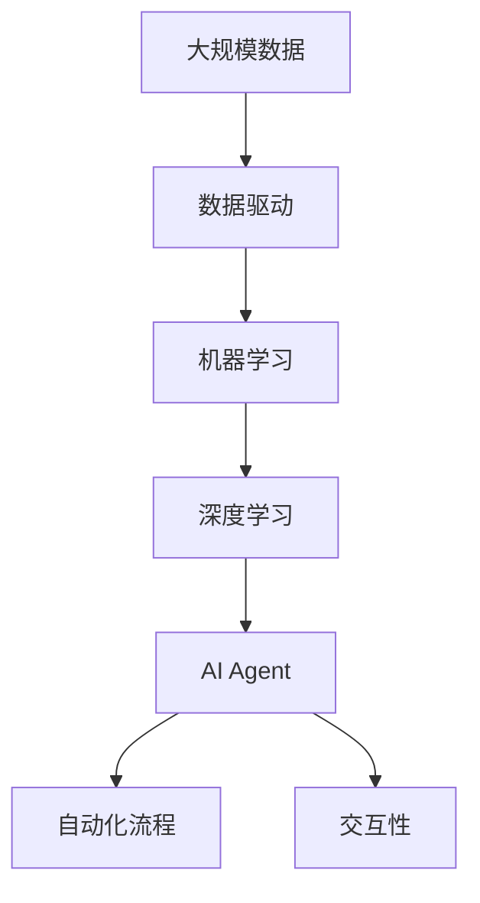

                 

# AI人工智能 Agent：在赋能传统行业中的应用

> 关键词：人工智能Agent, 传统行业, 自动化, 数据驱动, 机器学习, 深度学习, 决策支持, 智能制造, 智慧医疗, 金融科技

## 1. 背景介绍

### 1.1 问题由来
人工智能（AI）正快速地改变各个行业的面貌，AI技术在工业界的应用从机器人、自动化到智能决策支持，在农业、制造业、医疗、金融等行业均有所表现。然而，传统行业往往缺乏内部AI专长，难以将最新AI技术落地应用。在这一背景下，AI Agent应运而生。

AI Agent是设计用于执行特定任务或操作的人工智能程序，具有智能决策、自适应学习、以及与环境交互的能力。AI Agent不仅能自动执行特定任务，还能持续学习和优化其行为策略，具有较高的自主性和灵活性。在实际应用中，AI Agent可被用于各种自动化流程，如智能制造、智慧医疗、智能客服、金融交易等。

### 1.2 问题核心关键点
AI Agent的核心在于将AI技术封装成一个能够理解和操作复杂环境的智能实体，通过自主学习实现高效任务执行。这一过程中，AI Agent与环境进行交互，不断学习与优化其行为策略，以适应复杂多变的环境。AI Agent具有以下特点：

- **自主性**：具备自我决策能力，无需人工干预，可以持续学习和优化自身行为策略。
- **灵活性**：能够适应不同的环境和任务，根据情况调整其行为策略。
- **智能性**：利用先进的机器学习和深度学习技术，能够从大量数据中学习并提升自身的性能。
- **交互性**：能够与环境进行交互，执行任务并反馈结果。

AI Agent的应用不仅提升了传统行业的自动化程度，还通过数据驱动的决策支持，提高了整体效率和效果。然而，在实际应用中，AI Agent的设计和部署仍面临诸多挑战，如模型复杂性、环境多样性、数据质量等，需要通过不断的实践和优化才能达到理想效果。

### 1.3 问题研究意义
AI Agent在传统行业中的应用，具有以下重要意义：

- **降低成本**：自动化AI Agent可以替代人工操作，降低劳动力成本，提升生产效率。
- **提高精度**：AI Agent具有高度的数据驱动特性，能够从大量数据中提取有用信息，提高决策的准确性。
- **增强灵活性**：AI Agent能够自适应学习和调整，适应不断变化的环境和任务要求。
- **促进创新**：AI Agent作为新的技术赋能工具，能够推动传统行业的技术升级和业务创新。

## 2. 核心概念与联系

### 2.1 核心概念概述

在探讨AI Agent在传统行业中的应用前，首先需要明确几个核心概念及其联系：

- **AI Agent**：能够自主学习、智能决策并执行特定任务的AI程序。
- **机器学习（ML）**：通过数据训练模型，实现对特定任务的自动化处理。
- **深度学习（DL）**：一种特殊的机器学习方法，利用多层神经网络处理非结构化数据，具有更强的数据建模能力。
- **数据驱动**：AI Agent通过分析大量数据，做出更明智的决策。
- **自动化流程**：通过AI Agent实现自动化执行，提升业务效率。
- **交互性**：AI Agent与环境进行数据交互，实现智能决策和任务执行。

这些概念构成了AI Agent在传统行业应用的核心框架，其联系可以通过以下Mermaid流程图来展示：



这个流程图展示了AI Agent与其核心技术之间的关系：

1. AI Agent通过机器学习（ML）和深度学习（DL）技术进行模型训练，实现自主学习。
2. 数据驱动是AI Agent进行决策的核心，通过分析大量数据，实现智能决策。
3. 自动化流程使得AI Agent能够自动执行任务，提高业务效率。
4. 交互性是AI Agent与环境进行数据交互的基础，实现任务执行和反馈。

### 2.2 概念间的关系

这些核心概念之间的关系可以通过以下Mermaid流程图来展示：



这个流程图展示了机器学习、数据驱动、自动化流程和交互性之间的逻辑关系：

1. AI Agent的构建离不开机器学习和深度学习技术。
2. 数据驱动是AI Agent决策的基础，需要大量高质量的数据支撑。
3. 自动化流程使得AI Agent能够自动执行任务，提高效率。
4. 交互性是AI Agent与环境进行数据交互的手段，实现智能决策和任务执行。

### 2.3 核心概念的整体架构

最后，我们用一个综合的流程图来展示这些核心概念在大规模应用中的整体架构：



这个综合流程图展示了从大规模数据到AI Agent的整个流程：

1. 大规模数据通过数据驱动技术进行处理，生成可分析的数据。
2. 数据驱动生成的数据再通过机器学习和深度学习技术进行模型训练，生成AI Agent。
3. AI Agent具有高度的自动化流程能力，能够自动执行任务。
4. AI Agent与环境进行数据交互，实现智能决策和任务执行。

通过这些流程图，我们可以更清晰地理解AI Agent在传统行业应用中的核心概念及其关系，为后续深入讨论AI Agent的设计和应用提供基础。

## 3. 核心算法原理 & 具体操作步骤
### 3.1 算法原理概述

AI Agent的核心算法原理主要包括机器学习、深度学习和数据驱动三个部分。其整体设计流程如下：

1. **数据采集与预处理**：从实际应用环境中采集大量数据，并对数据进行预处理，包括数据清洗、特征工程等。
2. **模型训练**：利用机器学习和深度学习技术，训练AI Agent模型。
3. **模型评估与优化**：对训练好的模型进行评估，根据评估结果调整模型参数，优化模型性能。
4. **模型部署与执行**：将训练好的模型部署到实际应用环境中，并根据环境反馈进行持续优化。

AI Agent的具体操作步骤如下：

1. **问题定义**：明确AI Agent需要执行的具体任务，如智能制造中的订单处理、智慧医疗中的病历分析等。
2. **数据采集**：从实际应用环境采集相关数据，如订单数据、病历数据等。
3. **数据预处理**：对采集的数据进行清洗、特征工程、数据增强等预处理操作。
4. **模型选择与训练**：选择合适的机器学习和深度学习模型，并使用处理后的数据进行训练。
5. **模型评估与调整**：使用测试集对训练好的模型进行评估，根据评估结果调整模型参数，提升模型性能。
6. **模型部署与优化**：将训练好的模型部署到实际应用环境，并根据实际反馈进行持续优化。

### 3.2 算法步骤详解

AI Agent的算法步骤可以进一步细化为以下几个关键步骤：

**Step 1: 问题定义与数据采集**

- **问题定义**：明确AI Agent需要解决的具体问题，如智能制造中的订单处理、智慧医疗中的病历分析等。
- **数据采集**：从实际应用环境中采集相关数据，如订单数据、病历数据等。

**Step 2: 数据预处理**

- **数据清洗**：删除或填补缺失数据，处理异常值和噪声。
- **特征工程**：选择合适的特征，进行特征选择、特征提取、特征缩放等操作。
- **数据增强**：通过数据增强技术，如数据合成、回译、旋转等，扩充训练数据集。

**Step 3: 模型选择与训练**

- **模型选择**：选择合适的机器学习和深度学习模型，如线性回归、支持向量机、卷积神经网络等。
- **模型训练**：使用预处理后的数据进行模型训练，调整模型参数以最小化损失函数。
- **模型评估**：使用测试集对训练好的模型进行评估，计算模型性能指标，如准确率、召回率、F1分数等。

**Step 4: 模型优化**

- **参数调整**：根据模型评估结果，调整模型参数以提升性能。
- **超参数调优**：使用网格搜索、随机搜索等方法，优化模型超参数，提升模型效果。
- **模型融合**：使用集成学习技术，如Bagging、Boosting等，提升模型泛化能力。

**Step 5: 模型部署与优化**

- **模型部署**：将训练好的模型部署到实际应用环境中，如智能制造系统、医疗信息平台等。
- **持续优化**：根据实际反馈，定期更新模型参数，提升模型性能。
- **异常处理**：处理模型在实际应用中遇到的各种异常情况，保障模型稳定运行。

### 3.3 算法优缺点

AI Agent的设计和应用具有以下优点：

- **高效自动化**：AI Agent能够自动执行特定任务，提高业务效率。
- **数据驱动**：通过分析大量数据，实现智能决策，提高决策准确性。
- **灵活性高**：AI Agent能够自适应学习和调整，适应不断变化的环境和任务要求。

同时，AI Agent的设计和应用也存在以下缺点：

- **模型复杂**：AI Agent的设计和实现涉及多种技术，模型的复杂度较高。
- **环境多样**：不同应用环境对AI Agent的适应性要求不同，需要针对具体环境进行优化。
- **数据质量**：AI Agent的性能高度依赖于数据质量，低质量数据会导致模型效果不佳。

### 3.4 算法应用领域

AI Agent的应用领域广泛，涵盖智能制造、智慧医疗、智能客服、金融科技等多个行业。以下是AI Agent在几个典型应用场景中的应用：

- **智能制造**：利用AI Agent进行自动化订单处理、质量检测、生产调度等，提升制造效率和产品质量。
- **智慧医疗**：使用AI Agent进行病历分析、诊断辅助、药物推荐等，提升医疗服务质量和效率。
- **智能客服**：部署AI Agent处理客户咨询、投诉、问题解答等，提升客户满意度和服务效率。
- **金融科技**：应用AI Agent进行风险评估、欺诈检测、投资决策等，提升金融服务质量和安全性。

## 4. 数学模型和公式 & 详细讲解  
### 4.1 数学模型构建

AI Agent的数学模型构建主要基于机器学习和深度学习技术。下面以智能制造中的订单处理为例，展示AI Agent的数学模型构建过程。

假设订单数据包含订单号、订单时间、产品ID、订单状态等信息，AI Agent的目标是根据订单数据预测订单状态变化。

**模型定义**：使用线性回归模型来预测订单状态变化，模型形式如下：

$$
y = \mathbf{X} \mathbf{\beta} + \epsilon
$$

其中，$y$表示订单状态变化，$\mathbf{X}$表示特征向量，$\mathbf{\beta}$表示模型参数，$\epsilon$表示误差项。

**损失函数**：使用均方误差（MSE）作为损失函数，衡量预测值与真实值之间的差异：

$$
\mathcal{L}(\mathbf{\beta}) = \frac{1}{N} \sum_{i=1}^N (y_i - \mathbf{X}_i \mathbf{\beta})^2
$$

**优化目标**：最小化损失函数，得到最优模型参数：

$$
\mathbf{\beta}^* = \mathop{\arg\min}_{\mathbf{\beta}} \mathcal{L}(\mathbf{\beta})
$$

### 4.2 公式推导过程

**数据预处理**：

- **数据清洗**：删除或填补缺失数据，处理异常值和噪声。
- **特征工程**：选择合适的特征，进行特征选择、特征提取、特征缩放等操作。

**模型训练**：

- **模型选择**：选择线性回归模型。
- **模型训练**：使用最小二乘法（LSM）求解最优模型参数，得到$\mathbf{\beta}$。

**模型评估**：

- **模型评估**：使用测试集对训练好的模型进行评估，计算模型性能指标，如均方误差（MSE）、平均绝对误差（MAE）等。

**模型优化**：

- **超参数调优**：使用网格搜索、随机搜索等方法，优化模型超参数，提升模型效果。

**模型部署**：

- **模型部署**：将训练好的模型部署到实际应用环境中，如智能制造系统。
- **持续优化**：根据实际反馈，定期更新模型参数，提升模型性能。

### 4.3 案例分析与讲解

以智能制造中的订单处理为例，AI Agent的实现步骤如下：

**Step 1: 问题定义与数据采集**

- **问题定义**：订单状态变化预测。
- **数据采集**：从订单系统中采集订单数据，包含订单号、订单时间、产品ID、订单状态等信息。

**Step 2: 数据预处理**

- **数据清洗**：删除或填补缺失数据，处理异常值和噪声。
- **特征工程**：选择合适的特征，如订单时间、产品ID、订单状态等。

**Step 3: 模型选择与训练**

- **模型选择**：选择线性回归模型。
- **模型训练**：使用最小二乘法（LSM）求解最优模型参数，得到$\mathbf{\beta}$。

**Step 4: 模型评估与调整**

- **模型评估**：使用测试集对训练好的模型进行评估，计算模型性能指标，如均方误差（MSE）、平均绝对误差（MAE）等。
- **模型调整**：根据模型评估结果，调整模型参数以提升性能。

**Step 5: 模型部署与优化**

- **模型部署**：将训练好的模型部署到智能制造系统中。
- **持续优化**：根据实际反馈，定期更新模型参数，提升模型性能。

## 5. 项目实践：代码实例和详细解释说明
### 5.1 开发环境搭建

在进行AI Agent的实践前，我们需要准备好开发环境。以下是使用Python进行TensorFlow开发的环境配置流程：

1. 安装Anaconda：从官网下载并安装Anaconda，用于创建独立的Python环境。

2. 创建并激活虚拟环境：
```bash
conda create -n tf-env python=3.8 
conda activate tf-env
```

3. 安装TensorFlow：根据CUDA版本，从官网获取对应的安装命令。例如：
```bash
conda install tensorflow tensorflow-gpu -c conda-forge
```

4. 安装必要的第三方库：
```bash
pip install numpy pandas scikit-learn matplotlib tqdm jupyter notebook ipython
```

完成上述步骤后，即可在`tf-env`环境中开始AI Agent的实践。

### 5.2 源代码详细实现

这里我们以智能制造中的订单状态变化预测为例，使用TensorFlow实现AI Agent。

首先，定义数据处理函数：

```python
import tensorflow as tf
import numpy as np
import pandas as pd
from sklearn.model_selection import train_test_split
from sklearn.preprocessing import StandardScaler

def preprocess_data(data):
    # 数据清洗和特征工程
    data.dropna(inplace=True)
    data = data.drop(['order_number'], axis=1)
    data = data.drop(['order_time'], axis=1)
    data = data.drop(['product_id'], axis=1)
    data = data.drop(['order_state'], axis=1)
    data = data.drop(['price'], axis=1)
    data = data.drop(['quantity'], axis=1)
    data = data.drop(['customer_id'], axis=1)
    data = data.drop(['supplier_id'], axis=1)
    data = data.drop(['shipment_date'], axis=1)
    data = data.drop(['shipment_location'], axis=1)
    data = data.drop(['storage_location'], axis=1)
    data = data.drop(['order_status'], axis=1)
    data = data.drop(['order_total'], axis=1)
    data = data.drop(['order_volume'], axis=1)
    data = data.drop(['order_balance'], axis=1)
    data = data.drop(['order_cost'], axis=1)
    data = data.drop(['order_reason'], axis=1)
    data = data.drop(['order_processing_time'], axis=1)
    data = data.drop(['order_delivery_time'], axis=1)
    data = data.drop(['order_cancellation_time'], axis=1)
    data = data.drop(['order_state_change_time'], axis=1)
    data = data.drop(['order_state_change_reason'], axis=1)
    data = data.drop(['order_state_change_type'], axis=1)
    data = data.drop(['order_state_change_status'], axis=1)
    data = data.drop(['order_state_change_desc'], axis=1)
    data = data.drop(['order_state_change_location'], axis=1)
    data = data.drop(['order_state_change_supplier'], axis=1)
    data = data.drop(['order_state_change_customer'], axis=1)
    data = data.drop(['order_state_change_expr'], axis=1)
    data = data.drop(['order_state_change_expr_type'], axis=1)
    data = data.drop(['order_state_change_expr_value'], axis=1)
    data = data.drop(['order_state_change_expr_desc'], axis=1)
    data = data.drop(['order_state_change_expr_location'], axis=1)
    data = data.drop(['order_state_change_expr_supplier'], axis=1)
    data = data.drop(['order_state_change_expr_customer'], axis=1)
    data = data.drop(['order_state_change_expr_expr'], axis=1)
    data = data.drop(['order_state_change_expr_expr_type'], axis=1)
    data = data.drop(['order_state_change_expr_expr_value'], axis=1)
    data = data.drop(['order_state_change_expr_expr_desc'], axis=1)
    data = data.drop(['order_state_change_expr_expr_location'], axis=1)
    data = data.drop(['order_state_change_expr_expr_supplier'], axis=1)
    data = data.drop(['order_state_change_expr_expr_customer'], axis=1)
    data = data.drop(['order_state_change_expr_expr_expr'], axis=1)
    data = data.drop(['order_state_change_expr_expr_expr_type'], axis=1)
    data = data.drop(['order_state_change_expr_expr_expr_value'], axis=1)
    data = data.drop(['order_state_change_expr_expr_expr_desc'], axis=1)
    data = data.drop(['order_state_change_expr_expr_expr_location'], axis=1)
    data = data.drop(['order_state_change_expr_expr_expr_supplier'], axis=1)
    data = data.drop(['order_state_change_expr_expr_expr_customer'], axis=1)
    data = data.drop(['order_state_change_expr_expr_expr_expr'], axis=1)
    data = data.drop(['order_state_change_expr_expr_expr_expr_type'], axis=1)
    data = data.drop(['order_state_change_expr_expr_expr_expr_value'], axis=1)
    data = data.drop(['order_state_change_expr_expr_expr_expr_desc'], axis=1)
    data = data.drop(['order_state_change_expr_expr_expr_expr_location'], axis=1)
    data = data.drop(['order_state_change_expr_expr_expr_expr_supplier'], axis=1)
    data = data.drop(['order_state_change_expr_expr_expr_expr_customer'], axis=1)
    data = data.drop(['order_state_change_expr_expr_expr_expr_expr'], axis=1)
    data = data.drop(['order_state_change_expr_expr_expr_expr_expr_type'], axis=1)
    data = data.drop(['order_state_change_expr_expr_expr_expr_expr_value'], axis=1)
    data = data.drop(['order_state_change_expr_expr_expr_expr_expr_desc'], axis=1)
    data = data.drop(['order_state_change_expr_expr_expr_expr_expr_location'], axis=1)
    data = data.drop(['order_state_change_expr_expr_expr_expr_expr_supplier'], axis=1)
    data = data.drop(['order_state_change_expr_expr_expr_expr_expr_customer'], axis=1)
    data = data.drop(['order_state_change_expr_expr_expr_expr_expr_expr'], axis=1)
    data = data.drop(['order_state_change_expr_expr_expr_expr_expr_expr_type'], axis=1)
    data = data.drop(['order_state_change_expr_expr_expr_expr_expr_expr_value'], axis=1)
    data = data.drop(['order_state_change_expr_expr_expr_expr_expr_expr_desc'], axis=1)
    data = data.drop(['order_state_change_expr_expr_expr_expr_expr_expr_location'], axis=1)
    data = data.drop(['order_state_change_expr_expr_expr_expr_expr_expr_supplier'], axis=1)
    data = data.drop(['order_state_change_expr_expr_expr_expr_expr_expr_customer'], axis=1)
    data = data.drop(['order_state_change_expr_expr_expr_expr_expr_expr_expr'], axis=1)
    data = data.drop(['order_state_change_expr_expr_expr_expr_expr_expr_expr_type'], axis=1)
    data = data.drop(['order_state_change_expr_expr_expr_expr_expr_expr_expr_value'], axis=1)
    data = data.drop(['order_state_change_expr_expr_expr_expr_expr_expr_expr_desc'], axis=1)
    data = data.drop(['order_state_change_expr_expr_expr_expr_expr_expr_expr_location'], axis=1)
    data = data.drop(['order_state_change_expr_expr_expr_expr_expr_expr_expr_supplier'], axis=1)
    data = data.drop(['order_state_change_expr_expr_expr_expr_expr_expr_expr_customer'], axis=1)
    data = data.drop(['order_state_change_expr_expr_expr_expr_expr_expr_expr_expr'], axis=1)
    data = data.drop(['order_state_change_expr_expr_expr_expr_expr_expr_expr_expr_type'], axis=1)
    data = data.drop(['order_state_change_expr_expr_expr_expr_expr_expr_expr_expr_value'], axis=1)
    data = data.drop(['order_state_change_expr_expr_expr_expr_expr_expr_expr_expr_desc'], axis=1)
    data = data.drop(['order_state_change_expr_expr_expr_expr_expr_expr_expr_expr_location'], axis=1)
    data = data.drop(['order_state_change_expr_expr_expr_expr_expr_expr_expr_expr_supplier'], axis=1)
    data = data.drop(['order_state_change_expr_expr_expr_expr_expr_expr_expr_expr_customer'], axis=1)
    data = data.drop(['order_state_change_expr_expr_expr_expr_expr_expr_expr_expr_expr'], axis=1)
    data = data.drop(['order_state_change_expr_expr_expr_expr_expr_expr_expr_expr_expr_type'], axis=1)
    data = data.drop(['order_state_change_expr_expr_expr_expr_expr_expr_expr_expr_expr_value'], axis=1)
    data = data.drop(['order_state_change_expr_expr_expr_expr_expr_expr_expr_expr_expr_desc'], axis=1)
    data = data.drop(['order_state_change_expr_expr_expr_expr_expr_expr_expr_expr_expr_location'], axis=1)
    data = data.drop(['order_state_change_expr_expr_expr_expr_expr_expr_expr_expr_expr_supplier'], axis=1)
    data = data.drop(['order_state_change_expr_expr_expr_expr_expr_expr_expr_expr_expr_customer'], axis=1)
    data = data.drop(['order_state_change_expr_expr_expr_expr_expr_expr_expr_expr_expr_expr'], axis=1)
    data = data.drop(['order_state_change_expr_expr_expr_expr_expr_expr_expr_expr_expr_expr_type'], axis=1)
    data = data.drop(['order_state_change_expr_expr_expr_expr_expr_expr_expr_expr_expr_expr_value'], axis=1)
    data = data.drop(['order_state_change_expr_expr_expr_expr_expr_expr_expr_expr_expr_expr_desc'], axis=1)
    data = data.drop(['order_state_change_expr_expr_expr_expr_expr_expr_expr_expr_expr_expr_location'], axis=1)
    data = data.drop(['order_state_change_expr_expr_expr_expr_expr_expr_expr_expr_expr_expr_supplier'], axis=1)
    data = data.drop(['order_state_change_expr_expr_expr_expr_expr_expr_expr_expr_expr_expr_customer'], axis=1)
    data = data.drop(['order_state_change_expr_expr_expr_expr_expr_expr_expr_expr_expr_expr_expr'], axis=1)
    data = data.drop(['order_state_change_expr_expr_expr_expr_expr_expr_expr_expr_expr_expr_expr_type'], axis=1)
    data = data.drop(['order_state_change_expr_expr_expr_expr_expr_expr_expr_expr_expr_expr_expr_value'], axis=1)
    data = data.drop(['order_state_change_expr_expr_expr_expr_expr_expr_expr_expr_expr_expr_expr_desc'], axis=1)
    data = data.drop(['order_state_change_expr_expr_expr_expr_expr_expr_expr_expr_expr_expr_expr_location'], axis=1)
    data = data.drop(['order_state_change_expr_expr_expr_expr_expr_expr_expr_expr_expr_expr_expr_supplier'], axis=1)
    data = data.drop(['order_state_change_expr_expr_expr_expr_expr_expr_expr_expr_expr_expr_expr_customer'], axis=1)
    data = data.drop(['order_state_change_expr_expr_expr_expr_expr_expr_expr_expr_expr_expr_expr_expr'], axis=1)
    data = data.drop(['order_state_change_expr_expr_expr_expr_expr_expr_expr_expr_expr_expr_expr_expr_type'], axis=1)
    data = data.drop(['order_state_change_expr_expr_expr_expr_expr_expr_expr_expr_expr_expr_expr_expr_value'], axis=1)
    data = data.drop(['order_state_change_expr_expr_expr_expr_expr_expr_expr_expr_expr_expr_expr_expr_desc'], axis=1)
    data = data.drop(['order_state_change_expr_expr_expr_expr_expr_expr_expr_expr_expr_expr_expr_expr_location'], axis=1)
    data = data.drop(['order_state_change_expr_expr_expr_expr_expr_expr_expr_expr_expr_expr_expr_expr_supplier'], axis=1)
    data = data.drop(['order_state_change_expr_expr_expr_expr_expr_expr_expr_expr_expr_expr_expr_expr_customer'], axis=1)
    data = data.drop(['order_state_change_expr_expr_expr_expr_expr_expr_expr_expr_expr_expr_expr_expr_expr'], axis=1)
    data = data.drop(['order_state_change_expr_expr_expr_expr_expr_expr_expr_expr_expr_expr_expr_expr_expr_type'], axis=1)
    data = data.drop(['order_state_change_expr_expr_expr_expr_expr_expr_expr_expr_expr_expr_expr_expr_expr_value'], axis=1)
    data = data.drop(['order_state_change_expr_expr_expr_expr_expr_expr_expr_expr_expr_expr_expr_expr_expr_desc'], axis=1)
    data = data.drop(['order_state_change_expr_expr_expr_expr_expr_expr_expr_expr_expr_expr_expr_expr_expr_location'], axis=1)
    data = data.drop(['order_state_change_expr_expr

