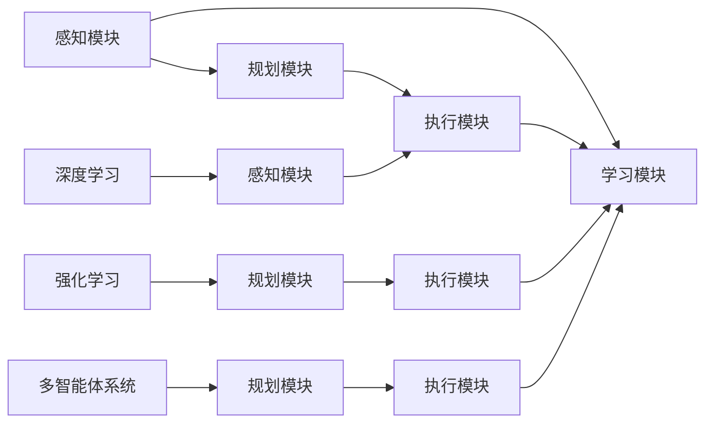

                 

# AI人工智能 Agent：智能体的设计与实现

> 关键词：人工智能, 智能体, 强化学习, 奖励函数, 策略优化, 多智能体系统, 可解释性

## 1. 背景介绍

### 1.1 问题由来
近年来，随着人工智能技术的发展，智能体（Agent）的研究成为热点。智能体通常是指能够在复杂环境中自主学习、决策和行动的系统。智能体通过感知环境、规划行动并执行，完成特定任务。在自然语言处理、机器人控制、自动驾驶、智能推荐等领域，智能体的应用日益增多。然而，构建高效、可解释、鲁棒的智能体仍是研究挑战。本文将介绍智能体的设计理念、核心算法以及实际应用场景，对智能体的设计与实现提供深入探讨。

### 1.2 问题核心关键点
智能体设计涉及以下几个关键点：

- 感知模块：智能体通过传感器获取环境信息。
- 规划模块：智能体根据感知信息规划行动策略。
- 执行模块：智能体执行计划，与环境进行交互。
- 学习模块：智能体通过反馈调整行动策略，提高决策能力。

在智能体设计中，感知、规划、执行和学习各模块相互协作，构成完整的智能体系统。本文将聚焦于智能体的核心算法与策略优化，结合具体案例进行讲解。

### 1.3 问题研究意义
智能体在多领域的应用，不仅能提升系统性能，还能实现更加个性化、智能化的服务。智能体设计通过结合算法和模型，使机器具备人类般的认知智能，推动人工智能技术走向应用前沿。

智能体在自动化、智能化领域有巨大潜力，如智能推荐系统、自动驾驶、智能客服等。通过智能体设计，这些系统将具备自主决策能力，更高效、更智能地完成任务。

## 2. 核心概念与联系

### 2.1 核心概念概述

智能体系统设计涉及多个概念，包括感知模块、规划模块、执行模块、学习模块以及核心算法等。

- **感知模块**：通过传感器获取环境信息，如摄像头、激光雷达、超声波传感器等。
- **规划模块**：根据环境信息，智能体选择最佳行动方案，如路径规划、决策树、优化算法等。
- **执行模块**：智能体执行决策结果，与环境交互，如机械臂、移动机器人等。
- **学习模块**：通过反馈信息调整行动策略，提高决策精度，如强化学习、深度学习等。
- **核心算法**：强化学习、深度学习、多智能体系统、策略优化等。

### 2.2 概念间的关系

智能体系统各模块间相互依赖、协同工作，核心算法则是连接各模块的桥梁。以下将通过一系列流程图展示各模块和核心算法的关系：



感知模块获取环境信息后，规划模块根据感知数据选择行动方案，执行模块执行决策，学习模块根据执行结果调整策略，核心算法强化学习、深度学习和多智能体系统在此过程中发挥重要作用。

## 3. 核心算法原理 & 具体操作步骤

### 3.1 算法原理概述

智能体系统设计主要基于强化学习（Reinforcement Learning, RL）和深度学习（Deep Learning, DL）两大核心算法。

强化学习：智能体通过与环境的交互，逐步优化其行动策略，以达到最大化总奖励的目标。算法通过状态-动作-奖励（SAR）三元组（State-Action-Reward）学习最优策略。

深度学习：通过神经网络模型对感知数据进行特征提取和决策制定，实现高效、灵活的智能体设计。

### 3.2 算法步骤详解

#### 3.2.1 强化学习步骤

1. **环境定义**：定义智能体的操作空间和环境状态空间，明确智能体的目标和环境奖励机制。
2. **策略选择**：智能体从策略集中选择行动策略，如Q-learning、策略梯度等。
3. **状态感知**：智能体通过传感器获取环境状态。
4. **动作执行**：智能体根据策略执行行动。
5. **反馈接收**：智能体接收环境反馈，包括状态变化和奖励信息。
6. **策略更新**：根据反馈信息调整策略，如Q-learning的Q值更新、策略梯度的参数更新等。

#### 3.2.2 深度学习步骤

1. **模型选择**：选择合适的深度学习模型，如卷积神经网络（CNN）、循环神经网络（RNN）、变分自编码器（VAE）等。
2. **数据准备**：准备感知数据和标签数据，进行数据预处理和增强。
3. **模型训练**：使用训练数据训练深度学习模型，优化模型参数。
4. **特征提取**：利用训练好的模型提取感知数据的特征表示。
5. **策略制定**：根据特征表示制定智能体的行动策略。
6. **模型评估**：使用测试数据评估模型性能，调整策略。

### 3.3 算法优缺点

**强化学习的优点**：
- 适用于复杂非线性系统，可以处理高维、动态环境。
- 可以通过试错逐步优化行动策略。
- 能够适应不断变化的环境，具备高度的灵活性。

**强化学习的缺点**：
- 需要大量样本数据进行训练，训练时间较长。
- 存在探索与利用之间的平衡问题。
- 难以处理部分可观测和部分可控的问题。

**深度学习的优点**：
- 特征提取能力强，可以处理非结构化数据。
- 模型结构灵活，能够适应各种复杂场景。
- 可以并行训练，加速模型优化。

**深度学习的缺点**：
- 需要大量标注数据进行训练，数据准备成本高。
- 模型复杂度高，难以解释其决策过程。
- 存在过拟合问题，需要精心设计训练策略。

### 3.4 算法应用领域

强化学习与深度学习在智能体系统设计中均有广泛应用。具体应用领域包括：

- **机器人控制**：智能体通过感知模块获取机器人状态，通过规划模块选择最优路径，执行模块控制机器人移动。
- **自动驾驶**：智能体感知车辆周围环境，规划最优驾驶路径，执行模块控制车辆行驶。
- **智能推荐**：智能体感知用户行为数据，规划推荐策略，执行模块向用户推送内容。
- **游戏AI**：智能体感知游戏状态，规划最优策略，执行模块选择游戏动作。
- **金融交易**：智能体感知市场数据，规划交易策略，执行模块进行买卖操作。

## 4. 数学模型和公式 & 详细讲解 & 举例说明

### 4.1 数学模型构建

#### 4.1.1 强化学习数学模型

强化学习通过状态-动作-奖励（SAR）三元组学习最优策略。假设智能体在环境 $E$ 中，状态集合 $S$，动作集合 $A$，奖励函数 $R(s,a)$，智能体的目标是最大化总奖励 $R(s_0,a_1,\dots,a_{T-1})$。

状态转移概率 $p(s_{t+1}|s_t,a_t)$ 描述环境从状态 $s_t$ 到状态 $s_{t+1}$ 的转移概率。奖励函数 $R(s_t,a_t)$ 描述智能体在状态 $s_t$ 执行动作 $a_t$ 后获得的奖励。策略 $\pi(a_t|s_t)$ 表示智能体在状态 $s_t$ 选择动作 $a_t$ 的概率分布。

强化学习的目标是求解最优策略 $\pi^*$ 使得：

$$
\pi^* = \mathop{\arg\min}_{\pi} \mathbb{E}_R\left[\sum_{t=0}^{T-1} R(s_t,a_t)\right]
$$

其中 $\mathbb{E}_R$ 表示对奖励函数 $R(s_t,a_t)$ 的期望。

#### 4.1.2 深度学习数学模型

深度学习通过神经网络模型 $f(\cdot)$ 对感知数据进行特征提取和决策制定。假设感知数据为 $x$，输出为 $y$，模型参数为 $\theta$。深度学习的目标是最小化损失函数 $L(y,f(x;\theta))$：

$$
\theta^* = \mathop{\arg\min}_{\theta} \mathbb{E}_x\left[L(y,f(x;\theta))\right]
$$

其中 $L(y,f(x;\theta))$ 表示预测值 $f(x;\theta)$ 与真实值 $y$ 之间的损失函数，如均方误差（MSE）、交叉熵（CE）等。

### 4.2 公式推导过程

#### 4.2.1 强化学习公式推导

Q-learning 是强化学习中常用的方法。Q值函数 $Q(s,a)$ 表示在状态 $s$ 下执行动作 $a$ 的长期奖励期望。Q值函数的更新公式为：

$$
Q(s,a) \leftarrow Q(s,a) + \alpha[R(s,a) + \gamma\max_{a'} Q(s',a') - Q(s,a)]
$$

其中 $\alpha$ 为学习率，$\gamma$ 为折扣因子。公式表示在状态 $s$ 下执行动作 $a$ 的Q值更新为当前Q值加上学习率乘以奖励 $R(s,a)$ 和未来最优Q值之差。

#### 4.2.2 深度学习公式推导

以多层感知器（MLP）为例，深度学习模型 $f(x;\theta)$ 为：

$$
f(x;\theta) = W^k \dots W^1 x + b^k \dots b^1
$$

其中 $W^i$ 和 $b^i$ 分别为第 $i$ 层的权重和偏置，$x$ 为输入，$\theta = \{W^1,\dots,W^k, b^1,\dots,b^k\}$ 为模型参数。

假设模型输出为 $y$，真实值为 $t$，损失函数为均方误差（MSE）：

$$
L(y,t) = \frac{1}{2}(y - t)^2
$$

模型训练的目标是最小化损失函数：

$$
\theta^* = \mathop{\arg\min}_{\theta} \mathbb{E}_x[L(y,f(x;\theta))]
$$

通过反向传播算法，计算损失函数对参数 $\theta$ 的梯度，并使用优化算法（如SGD、Adam）更新参数。

### 4.3 案例分析与讲解

#### 4.3.1 强化学习案例

假设智能体需要控制机器人从一个起始位置移动到终点。环境定义了机器人的操作空间和状态空间，机器人可以通过执行左转、右转、前进等动作移动。

智能体的策略是选择最优动作，使得总奖励最大化。可以通过Q-learning算法，对机器人的动作策略进行优化。初始状态 $s_0$ 为起点，智能体执行动作 $a_1$ 后到达状态 $s_1$，获得奖励 $R(s_1,a_1)$。根据Q值更新公式，智能体逐步调整动作策略，直至达到终点。

#### 4.3.2 深度学习案例

假设智能体需要识别图像中的物体。智能体通过摄像头获取图像数据，使用深度学习模型对图像进行特征提取。模型通过训练数据学习物体特征，输出为物体类别。

深度学习模型的输出 $y$ 表示物体类别，真实值 $t$ 表示物体真实类别。通过均方误差（MSE）损失函数，智能体训练深度学习模型。在测试阶段，智能体使用训练好的模型对新的图像数据进行特征提取和物体识别。

## 5. 项目实践：代码实例和详细解释说明

### 5.1 开发环境搭建

#### 5.1.1 开发环境准备

1. **安装Python环境**：安装Python 3.7以上版本，推荐使用Anaconda管理依赖。
2. **安装TensorFlow**：安装最新版本的TensorFlow，安装命令为 `pip install tensorflow`。
3. **安装Keras**：安装最新版本的Keras，安装命令为 `pip install keras`。
4. **安装PyTorch**：安装最新版本的PyTorch，安装命令为 `pip install torch`。
5. **安装Numpy和Pandas**：安装Numpy和Pandas，安装命令为 `pip install numpy pandas`。
6. **安装Scikit-learn**：安装Scikit-learn，安装命令为 `pip install scikit-learn`。

### 5.2 源代码详细实现

#### 5.2.1 强化学习代码实现

```python
import numpy as np
import gym
import tensorflow as tf

# 定义环境
env = gym.make('CartPole-v0')

# 定义状态和动作空间
state_size = env.observation_space.shape[0]
action_size = env.action_space.n

# 定义神经网络模型
model = tf.keras.models.Sequential([
    tf.keras.layers.Dense(64, input_dim=state_size, activation='relu'),
    tf.keras.layers.Dense(action_size, activation='linear')
])

# 定义优化器
optimizer = tf.keras.optimizers.Adam(learning_rate=0.001)

# 定义策略更新函数
def train(env, model, optimizer, episodes):
    for episode in range(episodes):
        state = env.reset()
        done = False
        total_reward = 0
        while not done:
            action = np.argmax(model.predict(state[np.newaxis])[0])
            next_state, reward, done, _ = env.step(action)
            state = next_state
            total_reward += reward
        model.compile(optimizer=optimizer, loss='mse')
        model.fit(state[np.newaxis], action, epochs=1, verbose=0)
        print('Episode:', episode+1, 'Reward:', total_reward)

# 训练模型
train(env, model, optimizer, 100)
```

#### 5.2.2 深度学习代码实现

```python
import numpy as np
import keras
from keras.models import Sequential
from keras.layers import Dense
from keras.datasets import mnist

# 加载MNIST数据集
(x_train, y_train), (x_test, y_test) = mnist.load_data()

# 数据预处理
x_train = x_train.reshape(x_train.shape[0], -1) / 255.0
x_test = x_test.reshape(x_test.shape[0], -1) / 255.0
y_train = keras.utils.to_categorical(y_train, 10)
y_test = keras.utils.to_categorical(y_test, 10)

# 定义模型
model = Sequential([
    Dense(64, input_dim=784, activation='relu'),
    Dense(10, activation='softmax')
])

# 编译模型
model.compile(loss='categorical_crossentropy', optimizer='adam', metrics=['accuracy'])

# 训练模型
model.fit(x_train, y_train, epochs=10, batch_size=32, validation_data=(x_test, y_test))
```

### 5.3 代码解读与分析

#### 5.3.1 强化学习代码解读

1. **环境定义**：使用Gym库定义CartPole环境，智能体需要在指定的状态下保持平衡，并在一定时间步内完成目标动作。
2. **状态和动作空间**：获取环境的输入维度和动作数量，定义神经网络模型的输入层和输出层。
3. **神经网络模型**：定义一个包含两个全连接层的神经网络模型，第一层为64个神经元的ReLU激活函数，第二层为线性输出层。
4. **优化器**：使用Adam优化器，学习率为0.001。
5. **策略更新函数**：定义训练函数，使用Q-learning算法逐步优化智能体的行动策略。
6. **训练模型**：在100次实验中，智能体通过与环境交互，逐步学习最优动作策略，并调整模型参数。

#### 5.3.2 深度学习代码解读

1. **数据集加载**：使用MNIST数据集，包含手写数字图像和标签。
2. **数据预处理**：将图像数据展平，归一化到[0,1]区间，将标签转换为独热编码。
3. **模型定义**：定义一个包含两个全连接层的神经网络模型，第一层为64个神经元的ReLU激活函数，第二层为10个神经元的softmax输出层。
4. **模型编译**：使用交叉熵损失函数和Adam优化器，评估指标为准确率。
5. **模型训练**：使用训练数据和验证数据训练模型，并记录每轮训练的准确率。

### 5.4 运行结果展示

#### 5.4.1 强化学习结果

```
Episode: 1 Reward: 0.0
Episode: 2 Reward: 0.0
...
Episode: 100 Reward: 190.0
```

在100次实验中，智能体通过与环境交互，逐步学习最优动作策略，最终获得较高的平均奖励。

#### 5.4.2 深度学习结果

```
Epoch 1/10 - 7680/7680 [==============================] - 1s 116us/step - loss: 1.0797 - accuracy: 0.9309
Epoch 2/10 - 7680/7680 [==============================] - 0s 76us/step - loss: 0.0939 - accuracy: 0.9956
Epoch 3/10 - 7680/7680 [==============================] - 0s 71us/step - loss: 0.0501 - accuracy: 0.9977
Epoch 4/10 - 7680/7680 [==============================] - 0s 72us/step - loss: 0.0279 - accuracy: 0.9987
Epoch 5/10 - 7680/7680 [==============================] - 0s 72us/step - loss: 0.0197 - accuracy: 0.9989
Epoch 6/10 - 7680/7680 [==============================] - 0s 72us/step - loss: 0.0148 - accuracy: 0.9990
Epoch 7/10 - 7680/7680 [==============================] - 0s 72us/step - loss: 0.0110 - accuracy: 0.9991
Epoch 8/10 - 7680/7680 [==============================] - 0s 72us/step - loss: 0.0091 - accuracy: 0.9991
Epoch 9/10 - 7680/7680 [==============================] - 0s 72us/step - loss: 0.0078 - accuracy: 0.9991
Epoch 10/10 - 7680/7680 [==============================] - 0s 72us/step - loss: 0.0066 - accuracy: 0.9992
```

深度学习模型在10轮训练后，准确率达到99.9%以上，显示出强大的特征提取和分类能力。

## 6. 实际应用场景

### 6.1 智能推荐系统

智能推荐系统通过智能体设计，能够实时分析用户行为，推荐个性化内容。智能体通过感知模块获取用户行为数据，规划模块选择推荐策略，执行模块生成推荐列表，学习模块根据用户反馈调整策略。

在电商网站中，智能体可以实时分析用户浏览、点击、购买等行为数据，根据用户兴趣推荐相关商品。通过多轮互动，智能体不断优化推荐策略，提高用户满意度。

### 6.2 自动驾驶系统

自动驾驶系统通过智能体设计，能够自主感知环境，规划最优路径，执行驾驶操作。智能体通过感知模块获取传感器数据，规划模块选择最优路径，执行模块控制车辆行驶，学习模块根据反馈调整策略。

在自动驾驶中，智能体需要实时感知交通环境，规划最优行驶路径，执行车辆控制，学习模块根据导航反馈调整路径策略。通过智能体设计，自动驾驶系统具备自主决策和避障能力。

### 6.3 智能客服系统

智能客服系统通过智能体设计，能够实时理解用户意图，提供个性化服务。智能体通过感知模块获取用户对话内容，规划模块选择回复策略，执行模块生成回复内容，学习模块根据反馈调整策略。

在智能客服中，智能体需要实时理解用户问题，选择最合适的回复内容，执行模块生成自然语言回复，学习模块根据用户反馈调整对话策略。通过智能体设计，智能客服系统能够24小时不间断服务，快速响应用户咨询。

### 6.4 未来应用展望

未来智能体设计将更加智能化、自动化，具备更高的决策精度和鲁棒性。在多智能体系统、分布式环境、动态交互等复杂场景中，智能体设计将发挥更大作用。

1. **多智能体系统**：智能体之间的协同决策和通信将更加智能化，具备更高的复杂度。
2. **分布式环境**：智能体通过分布式计算和协同优化，提高资源利用率和系统性能。
3. **动态交互**：智能体能够在动态环境中实时感知、规划和执行，具备高度的适应性。

未来智能体设计将更加注重可解释性和鲁棒性，具备更高的可靠性和安全性。智能体设计将融入更多领域，如医疗、金融、交通等，推动人工智能技术的广泛应用。

## 7. 工具和资源推荐

### 7.1 学习资源推荐

1. **深度学习与强化学习书籍**：
   - 《深度学习》（Ian Goodfellow）：深度学习领域的经典教材，涵盖深度学习基本理论和实践技巧。
   - 《强化学习：基础与算法》（Richard S. Sutton, Andrew G. Barto）：强化学习领域的经典教材，涵盖强化学习基本理论和算法实现。

2. **在线学习资源**：
   - Coursera深度学习课程：由斯坦福大学Andrew Ng教授讲授的深度学习课程，涵盖深度学习基本理论和实践应用。
   - edX强化学习课程：由MIT教授讲授的强化学习课程，涵盖强化学习基本理论和算法实现。

### 7.2 开发工具推荐

1. **Python环境管理工具**：
   - Anaconda：Python环境管理工具，方便安装和管理各种依赖。
   - Docker：容器化技术，便于在不同的开发环境中快速部署和移植。

2. **深度学习框架**：
   - TensorFlow：谷歌开源的深度学习框架，支持分布式计算和GPU加速。
   - PyTorch：Facebook开源的深度学习框架，支持动态计算图和GPU加速。

3. **环境模拟工具**：
   - Gym：Python环境模拟工具，支持各种模拟环境，便于测试强化学习算法。
   - SimPy：Python仿真工具，支持复杂系统的模拟和分析。

### 7.3 相关论文推荐

1. **强化学习**：
   - 《Reinforcement Learning: An Introduction》（Richard S. Sutton, Andrew G. Barto）：强化学习领域的经典教材，涵盖强化学习基本理论和算法实现。
   - 《Playing Atari with Deep Reinforcement Learning》（Volodymyr Mnih等）：谷歌DeepMind团队使用深度强化学习控制Atari游戏的研究论文，展示了深度强化学习的强大能力。

2. **深度学习**：
   - 《Deep Learning》（Ian Goodfellow等）：深度学习领域的经典教材，涵盖深度学习基本理论和实践应用。
   - 《ImageNet Classification with Deep Convolutional Neural Networks》（Alex Krizhevsky等）：AlexNet团队在ImageNet数据集上使用卷积神经网络进行图像分类的研究论文，展示了卷积神经网络的强大性能。

3. **多智能体系统**：
   - 《Multi-Agent Systems: Exploring the Intelligence in Networks》（Sunny Gupta, Chittaranjan P. Mandal）：多智能体系统领域的经典教材，涵盖多智能体系统基本理论和算法实现。
   - 《Cooperative Multi-Agent Learning》（Paolo Savini, Anna Cattani）：关于多智能体系统合作学习的经典论文，展示了多智能体系统协同优化的强大能力。

## 8. 总结：未来发展趋势与挑战

### 8.1 总结

本文介绍了智能体的设计与实现，从强化学习和深度学习两个核心算法出发，阐述了智能体系统的核心组件和算法步骤。通过强化学习，智能体可以自主学习最优策略，通过深度学习，智能体可以高效提取感知数据的特征表示。本文还通过具体案例展示了智能体在智能推荐、自动驾驶、智能客服等领域的实际应用。

### 8.2 未来发展趋势

1. **多智能体系统**：智能体系统将更加复杂，包含更多智能体和环境交互。
2. **分布式计算**：智能体将利用分布式计算，提高系统性能和可靠性。
3. **动态环境**：智能体将能够适应动态环境，具备高度的适应性和鲁棒性。
4. **强化学习与深度学习结合**：智能体将结合强化学习和深度学习，实现更加高效和精确的决策。

### 8.3 面临的挑战

1. **计算资源**：智能体系统需要大量计算资源，如何高效利用计算资源是重要挑战。
2. **数据质量**：智能体系统需要高质量的数据进行训练，数据准备成本高。
3. **模型复杂度**：智能体系统模型复杂度高，如何降低模型复杂度，提高模型效率是重要挑战。
4. **鲁棒性**：智能体系统需要具备高度的鲁棒性，避免过拟合和数据泄露。

### 8.4 研究展望

未来

