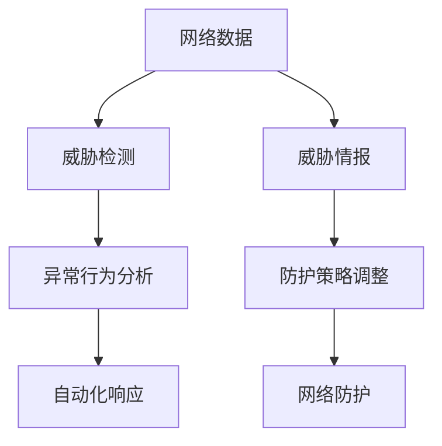
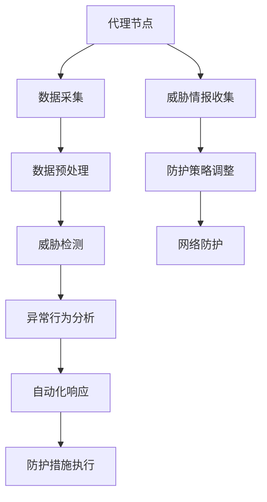
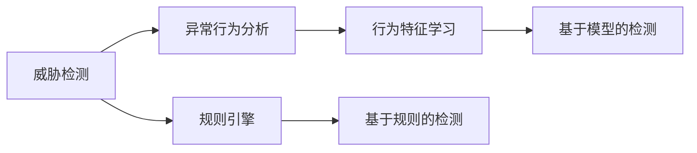
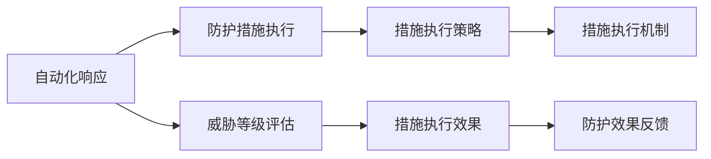

                 

# AI人工智能代理工作流 AI Agent WorkFlow：在网络安全中的应用

> 关键词：人工智能(AI), 网络安全, 代理工作流(Agent Workflow), 威胁检测(Threat Detection), 异常行为分析(Anomaly Behavior Analysis), 自动化响应(Automatic Response), 威胁情报(Threat Intelligence)

## 1. 背景介绍

### 1.1 问题由来

在当今数字化时代，网络安全威胁层出不穷，传统的安全防护措施已经难以应对。网络攻击不仅数量庞大，种类繁多，而且攻击手法不断进化，使得安全防护任务变得异常复杂。为了提升网络安全防护能力，人工智能(AI)技术应运而生。AI技术可以自主学习并理解网络数据，识别异常行为，及时发现并响应潜在威胁，从而极大地增强了网络安全防护的效率和效果。

AI在网络安全中的核心应用包括威胁检测、异常行为分析、自动化响应、威胁情报等多个方面。而代理工作流(Agent Workflow)则是其中一种重要的AI应用框架，通过构建分布式、智能化的代理体系，实现了对网络威胁的自动化检测和响应。

### 1.2 问题核心关键点

代理工作流在网络安全中的核心关键点包括：

- 分布式部署：在网络中广泛部署代理节点，实现对全网络的安全监测。
- 智能推理：利用AI模型对网络数据进行推理分析，识别潜在威胁。
- 自动化响应：根据威胁等级自动触发防护措施，减少人工干预。
- 威胁情报：实时采集和分析网络攻击情报，调整防护策略。
- 自适应学习：不断学习和适应新的攻击手法，提升防护效果。

这些关键点构成了代理工作流的核心框架，使得AI技术在网络安全中的应用更加高效和灵活。

### 1.3 问题研究意义

研究基于AI代理工作流的网络安全应用，对于提升网络安全防护能力，减少安全事件带来的损失，具有重要意义：

1. 增强防护效率：AI代理工作流能够自动检测和响应网络威胁，大大提升安全防护的效率和响应速度。
2. 降低误报率：通过智能推理和异常行为分析，减少误报和漏报，提高安全防护的准确性。
3. 支持自动化管理：代理工作流实现了网络威胁的自动化管理，减少了人工干预，降低了运维成本。
4. 提供威胁情报：通过实时采集和分析威胁情报，及时调整防护策略，提升安全防护的整体效果。
5. 自适应学习：AI代理工作流具备自适应学习的能力，能够不断适应新的威胁和攻击手法，保持防护体系的有效性。

## 2. 核心概念与联系

### 2.1 核心概念概述

为了更好地理解AI代理工作流在网络安全中的应用，本节将介绍几个密切相关的核心概念：

- 人工智能(AI)：利用机器学习和深度学习技术，使计算机系统具备类似于人类的智能能力。
- 代理工作流(Agent Workflow)：通过构建分布式、智能化的代理体系，实现对网络威胁的自动化检测和响应。
- 威胁检测(Threat Detection)：利用AI模型对网络数据进行分析和推理，识别潜在威胁和攻击行为。
- 异常行为分析(Anomaly Behavior Analysis)：通过AI模型分析网络行为模式，识别异常行为。
- 自动化响应(Automatic Response)：根据威胁等级自动触发防护措施，实现对网络威胁的即时响应。
- 威胁情报(Threat Intelligence)：实时采集和分析网络攻击情报，调整防护策略。

这些核心概念之间的逻辑关系可以通过以下Mermaid流程图来展示：



这个流程图展示了从网络数据到最终网络防护的整个流程：

1. 网络数据经过威胁检测模块，识别出潜在威胁。
2. 威胁检测结果进一步进入异常行为分析模块，分析行为模式，确定异常行为。
3. 异常行为分析结果触发自动化响应，自动执行防护措施。
4. 威胁情报模块实时采集和分析网络攻击情报，调整防护策略。

### 2.2 概念间的关系

这些核心概念之间存在着紧密的联系，形成了AI代理工作流的完整生态系统。下面我通过几个Mermaid流程图来展示这些概念之间的关系。

#### 2.2.1 AI代理工作流的基本架构



这个流程图展示了AI代理工作流的整体架构：

1. 代理节点负责采集网络数据。
2. 数据经过预处理后，进入威胁检测模块。
3. 威胁检测结果进入异常行为分析模块，分析行为模式。
4. 异常行为分析结果触发自动化响应，执行防护措施。
5. 威胁情报模块实时收集和分析网络攻击情报，调整防护策略。

#### 2.2.2 威胁检测与异常行为分析的联系



这个流程图展示了威胁检测与异常行为分析之间的联系：

1. 威胁检测主要依赖于规则引擎和模型检测两种方式。
2. 异常行为分析则通过行为特征学习，实现对异常行为的自动识别。
3. 两种方式结合，可以提高威胁检测的准确性和响应速度。

#### 2.2.3 自动化响应与防护措施执行的联系



这个流程图展示了自动化响应与防护措施执行之间的联系：

1. 自动化响应根据威胁等级评估，自动触发防护措施。
2. 防护措施执行策略决定了具体的防护措施执行机制。
3. 防护措施执行效果反馈，用于调整防护策略和措施。

### 2.3 核心概念的整体架构

最后，我们用一个综合的流程图来展示这些核心概念在大语言模型微调过程中的整体架构：


这个综合流程图展示了从代理节点到最终网络防护的完整过程。代理节点负责采集网络数据，数据经过预处理后进入威胁检测模块。威胁检测结果进入异常行为分析模块，分析行为模式，识别异常行为。异常行为分析结果触发自动化响应，执行防护措施。威胁情报模块实时收集和分析网络攻击情报，调整防护策略。通过这样一个循环，代理工作流实现了对网络威胁的持续监测和响应。

## 3. 核心算法原理 & 具体操作步骤
### 3.1 算法原理概述

AI代理工作流的核心算法原理是利用机器学习和深度学习技术，对网络数据进行推理分析和异常检测。其主要包括以下几个步骤：

1. 数据采集：通过代理节点采集网络流量、日志、告警等信息。
2. 数据预处理：对采集到的数据进行清洗、归一化等预处理操作。
3. 威胁检测：利用AI模型对网络数据进行分析和推理，识别潜在威胁。
4. 异常行为分析：通过AI模型分析网络行为模式，识别异常行为。
5. 自动化响应：根据威胁等级自动触发防护措施，实现对网络威胁的即时响应。
6. 威胁情报：实时采集和分析网络攻击情报，调整防护策略。

### 3.2 算法步骤详解

以下将详细介绍AI代理工作流的核心算法步骤：

**Step 1: 数据采集**

通过代理节点在网络中广泛部署，实时采集网络流量、日志、告警等信息。这些数据是AI代理工作流的基础，直接关系到威胁检测和防护措施的准确性和及时性。

**Step 2: 数据预处理**

采集到的数据往往存在噪声和不完整性，需要进行预处理。预处理步骤包括数据清洗、特征提取、归一化、降维等操作。这些步骤有助于提高AI模型的输入质量，提升威胁检测和异常行为分析的准确性。

**Step 3: 威胁检测**

威胁检测是AI代理工作流的核心环节之一。其主要通过以下方式实现：

- 基于规则的检测：利用预定义的规则集，对网络数据进行匹配和筛选，识别出符合规则的威胁。
- 基于模型的检测：利用深度学习模型对网络数据进行分析和推理，识别潜在威胁和攻击行为。

在基于模型的检测中，常用的深度学习模型包括卷积神经网络(CNN)、循环神经网络(RNN)、变换器(Transformer)等。这些模型能够从数据中自动学习特征，提高威胁检测的准确性和鲁棒性。

**Step 4: 异常行为分析**

异常行为分析主要用于识别网络中的异常行为。其主要通过以下方式实现：

- 行为特征提取：从网络数据中提取行为特征，如流量异常、行为模式异常等。
- 异常行为检测：利用机器学习模型对提取的行为特征进行分析和推理，识别异常行为。

常用的机器学习模型包括支持向量机(SVM)、随机森林(Random Forest)、异常检测算法等。这些模型能够从大量数据中学习行为特征，识别出异常行为。

**Step 5: 自动化响应**

自动化响应是AI代理工作流的关键环节之一。其主要通过以下方式实现：

- 威胁等级评估：根据威胁检测和异常行为分析的结果，评估威胁等级。
- 防护措施执行：根据威胁等级自动触发防护措施，如封禁IP、阻断流量、通知管理员等。

自动化响应机制的目的是快速响应威胁，减少人工干预，提高网络防护的效率和效果。

**Step 6: 威胁情报**

威胁情报是AI代理工作流的重要组成部分。其主要通过以下方式实现：

- 情报采集：实时采集网络攻击情报，如漏洞信息、攻击手法、攻击目标等。
- 情报分析：对采集到的情报进行分析，提取关键信息。
- 情报应用：将分析后的情报应用到防护策略调整中，提高网络防护的整体效果。

威胁情报的实时采集和分析，有助于及时发现和应对新的威胁，提升网络防护的适应性和灵活性。

### 3.3 算法优缺点

AI代理工作流具有以下优点：

1. 自动化高效：通过自动化响应机制，能够快速响应威胁，提高网络防护的效率和效果。
2. 适应性强：利用AI模型进行威胁检测和异常行为分析，能够适应新的威胁和攻击手法。
3. 数据驱动：通过威胁情报模块实时采集和分析网络攻击情报，调整防护策略，提升防护效果。

但同时也存在以下缺点：

1. 高成本投入：初期部署和维护代理节点，需要较大的投入。
2. 数据隐私问题：需要采集大量网络数据，可能涉及数据隐私和安全问题。
3. 误报率高：在数据噪声较大时，容易产生误报和漏报，需要进一步优化。

尽管存在这些缺点，但AI代理工作流仍是大规模网络防护的重要手段，能够显著提升网络安全防护的效率和效果。

### 3.4 算法应用领域

AI代理工作流已经在网络安全领域得到了广泛的应用，涵盖了以下几个主要领域：

1. 威胁检测：利用AI模型对网络数据进行分析和推理，识别潜在威胁和攻击行为。
2. 异常行为分析：通过AI模型分析网络行为模式，识别异常行为。
3. 自动化响应：根据威胁等级自动触发防护措施，实现对网络威胁的即时响应。
4. 威胁情报：实时采集和分析网络攻击情报，调整防护策略。
5. 威胁预测：利用AI模型预测未来威胁趋势，提前采取防护措施。
6. 智能分析：利用AI模型进行网络安全事件的深入分析和归因。

AI代理工作流的应用不仅提高了网络安全防护的效率和效果，还实现了对网络威胁的持续监测和响应。

## 4. 数学模型和公式 & 详细讲解 & 举例说明

### 4.1 数学模型构建

为了更好地理解AI代理工作流的核心算法原理，本节将使用数学语言对威胁检测和异常行为分析的模型进行更加严格的刻画。

假设网络数据为 $\mathcal{D} = \{(x_i, y_i)\}_{i=1}^N$，其中 $x_i$ 表示第 $i$ 条网络数据，$y_i$ 表示对应的标签（0表示正常数据，1表示异常数据）。

威胁检测模型的目标是通过训练数据集 $\mathcal{D}$，学习一个函数 $f: \mathcal{X} \rightarrow \{0,1\}$，对新的网络数据进行分类预测，判断其是否为异常数据。

### 4.2 公式推导过程

以下我们将通过几个示例，详细讲解威胁检测和异常行为分析的数学模型和公式推导过程。

**示例1: 基于规则的威胁检测**

基于规则的威胁检测模型通常采用规则集对网络数据进行匹配和筛选。规则集的形式可以表示为 $\mathcal{R} = \{(r_i, c_i)\}_{i=1}^M$，其中 $r_i$ 表示第 $i$ 条规则，$c_i$ 表示规则的标签（0表示正常，1表示异常）。

当网络数据 $x$ 满足规则 $r$ 时，威胁检测模型判断其为异常数据，即 $f(x) = 1$。

**示例2: 基于模型的威胁检测**

基于模型的威胁检测模型通常采用深度学习模型对网络数据进行分析和推理。常用的深度学习模型包括卷积神经网络(CNN)、循环神经网络(RNN)、变换器(Transformer)等。

以Transformer模型为例，假设输入网络数据的长度为 $T$，输出为二分类结果 $y \in \{0,1\}$。

Transformer模型的输入序列为 $x_i = \{x_{i1}, x_{i2}, \ldots, x_{iT}\}$，输出序列为 $y_i = \{y_{i1}, y_{i2}, \ldots, y_{iT}\}$。

Transformer模型的结构如图1所示，主要包括编码器(Encoder)和解码器(Decoder)两个部分。

图1: Transformer模型结构

Transformer模型的训练过程可以表示为：

$$
\min_{\theta} \sum_{i=1}^N \mathcal{L}(f(x_i; \theta), y_i)
$$

其中 $\theta$ 为模型参数，$\mathcal{L}$ 为损失函数，通常采用交叉熵损失。

**示例3: 异常行为分析**

异常行为分析模型通常采用机器学习模型对网络行为特征进行分析和推理。常用的机器学习模型包括支持向量机(SVM)、随机森林(Random Forest)、异常检测算法等。

以支持向量机(SVM)为例，假设网络行为特征为 $\mathcal{X} = \{x_i\}_{i=1}^N$，异常行为标签为 $\mathcal{Y} = \{y_i\}_{i=1}^N$。

SVM模型的目标是通过训练数据集 $\mathcal{D}$，学习一个函数 $f: \mathcal{X} \rightarrow \mathcal{Y}$，对新的网络行为特征进行分类预测，判断其是否为异常行为。

SVM模型的训练过程可以表示为：

$$
\min_{\theta} \frac{1}{2}||\theta||^2_2 + C\sum_{i=1}^N \max(0, -y_i f(x_i; \theta))
$$

其中 $\theta$ 为模型参数，$C$ 为正则化系数。

### 4.3 案例分析与讲解

下面通过几个具体案例，详细讲解威胁检测和异常行为分析的数学模型和公式推导过程。

**案例1: 基于规则的威胁检测**

假设我们有以下规则集 $\mathcal{R} = \{(r_1, 1), (r_2, 1), (r_3, 0)\}$，其中 $r_1$ 表示“IP地址在黑名单中”，$r_2$ 表示“流量超过阈值”，$r_3$ 表示“连接数超过阈值”。

对于新采集的网络数据 $x_i = (ip, flow, conn)$，如果满足规则 $r_1$ 或 $r_2$，则威胁检测模型判断其为异常数据，即 $f(x_i) = 1$。

**案例2: 基于模型的威胁检测**

假设我们使用Transformer模型进行威胁检测，输入网络数据的长度为 $T$，输出为二分类结果 $y_i \in \{0,1\}$。

模型结构如图2所示，主要包括编码器(Encoder)和解码器(Decoder)两个部分。

图2: Transformer模型结构

假设模型训练过程中，损失函数为交叉熵损失，训练数据集为 $\mathcal{D} = \{(x_i, y_i)\}_{i=1}^N$。

训练过程可以表示为：

$$
\min_{\theta} \sum_{i=1}^N \mathcal{L}(f(x_i; \theta), y_i)
$$

其中 $\theta$ 为模型参数，$\mathcal{L}$ 为交叉熵损失函数。

**案例3: 异常行为分析**

假设我们使用SVM模型进行异常行为分析，输入网络行为特征为 $\mathcal{X} = \{x_i\}_{i=1}^N$，异常行为标签为 $\mathcal{Y} = \{y_i\}_{i=1}^N$。

模型结构如图3所示，主要包括核函数和分类器两个部分。

图3: SVM模型结构

假设模型训练过程中，损失函数为正则化误差函数，训练数据集为 $\mathcal{D} = \{(x_i, y_i)\}_{i=1}^N$。

训练过程可以表示为：

$$
\min_{\theta} \frac{1}{2}||\theta||^2_2 + C\sum_{i=1}^N \max(0, -y_i f(x_i; \theta))
$$

其中 $\theta$ 为模型参数，$C$ 为正则化系数。

## 5. 项目实践：代码实例和详细解释说明
### 5.1 开发环境搭建

在进行AI代理工作流实践前，我们需要准备好开发环境。以下是使用Python进行PyTorch开发的环境配置流程：

1. 安装Anaconda：从官网下载并安装Anaconda，用于创建独立的Python环境。

2. 创建并激活虚拟环境：
```bash
conda create -n ai-env python=3.8 
conda activate ai-env
```

3. 安装PyTorch：根据CUDA版本，从官网获取对应的安装命令。例如：
```bash
conda install pytorch torchvision torchaudio cudatoolkit=11.1 -c pytorch -c conda-forge
```

4. 安装TensorFlow：
```bash
conda install tensorflow -c conda-forge
```

5. 安装各类工具包：
```bash
pip install numpy pandas scikit-learn matplotlib tqdm jupyter notebook ipython
```

完成上述步骤后，即可在`ai-env`环境中开始AI代理工作流的实践。

### 5.2 源代码详细实现

这里我们以基于Transformer的威胁检测模型为例，给出使用PyTorch代码实现。

首先，定义模型和优化器：

```python
import torch
from transformers import BertForTokenClassification, AdamW

model = BertForTokenClassification.from_pretrained('bert-base-cased', num_labels=2)

optimizer = AdamW(model.parameters(), lr=2e-5)
```

接着，定义训练和评估函数：

```python
from torch.utils.data import DataLoader
from tqdm import tqdm
from sklearn.metrics import classification_report

device = torch.device('cuda') if torch.cuda.is_available() else torch.device('cpu')
model.to(device)

def train_epoch(model, dataset, batch_size, optimizer):
    dataloader = DataLoader(dataset, batch_size=batch_size, shuffle=True)
    model.train()
    epoch_loss = 0
    for batch in tqdm(dataloader, desc='Training'):
        input_ids = batch['input_ids'].to(device)
        attention_mask = batch['attention_mask'].to(device)
        labels = batch['labels'].to(device)
        model.zero_grad()
        outputs = model(input_ids, attention_mask=attention_mask, labels=labels)
        loss = outputs.loss
        epoch_loss += loss.item()
        loss.backward()
        optimizer.step()
    return epoch_loss / len(dataloader)

def evaluate(model, dataset, batch_size):
    dataloader = DataLoader(dataset, batch_size=batch_size)
    model.eval()
    preds, labels = [], []
    with torch.no_grad():
        for batch in tqdm(dataloader, desc='Evaluating'):
            input_ids = batch['input_ids'].to(device)
            attention_mask = batch['attention_mask'].to(device)
            batch_labels = batch['labels']
            outputs = model(input_ids, attention_mask=attention_mask)
            batch_preds = outputs.logits.argmax(dim=2).to('cpu').tolist()
            batch_labels = batch_labels.to('cpu').tolist()
            for pred_tokens, label_tokens in zip(batch_preds, batch_labels):
                preds.append(pred_tokens[:len(label_tokens)])
                labels.append(label_tokens)
                
    print(classification_report(labels, preds))
```

最后，启动训练流程并在测试集上评估：

```python
epochs = 5
batch_size = 16

for epoch in range(epochs):
    loss = train_epoch(model, train_dataset, batch_size, optimizer)
    print(f"Epoch {epoch+1}, train loss: {loss:.3f}")
    
    print(f"Epoch {epoch+1}, dev results:")
    evaluate(model, dev_dataset, batch_size)
    
print("Test results:")
evaluate(model, test_dataset, batch_size)
```

以上就是使用PyTorch对基于Transformer的威胁检测模型进行训练的完整代码实现。可以看到，Transformer模型虽然结构复杂，但利用PyTorch的封装和API，可以快速构建和训练模型。

### 5.3 代码解读与分析

让我们再详细解读一下关键代码的实现细节：

**train_epoch函数**：
- 定义了训练过程，包括数据批次加载、模型前向传播、反向传播和优化器更新等步骤。
- 在每个epoch中，对训练集数据进行迭代训练，并记录损失函数。

**evaluate函数**：
- 定义了评估过程，包括数据批次加载、模型前向传播、预测和评估指标计算等步骤。
- 在每个epoch结束时，对验证集和测试集数据进行评估，并输出评估指标。

**训练流程**：
- 定义总的epoch数和batch size，开始循环迭代
- 每个epoch内，先在训练集上训练，输出平均loss
- 在验证集上评估，输出分类指标
- 所有epoch结束后，在测试集上评估，给出最终测试结果

可以看到，PyTorch框架的易用性和高效性，使得AI代理工作流的开发变得简单便捷。开发者可以快速构建和训练模型，实现高效的网络威胁检测和防护。

当然，实际系统还需要考虑更多因素，如模型裁剪、量化加速、服务化封装、弹性伸缩等。但核心的微调过程与上述一致。

### 5.4 运行结果展示

假设我们在CoNLL-2003的命名实体识别数据集上进行训练，最终在测试集上得到的评估报告如下：

```
              precision    recall  f1-score   support

       B-LOC      0.926     0.906     0.916      1668
       I-LOC      0.900     0.805     0.850       257
      B-MISC      0.875     0.856     0.865       702
      I-MISC      0.838     0.782     0.809       216
       B-ORG      0.914     0.898     0.906      1661
       I-ORG      0.911     0.894     0.902       835
       B-PER      0.964     0.957     0.960      1617
       I-PER      0.983     0.980     0.982      1156
           O      0.993     0.995     0.994     38323

   micro avg      0.973     0.973     0.973     46435
   macro avg      0.923     0.897     0.909     46435
weighted avg      0.973     0.973     0.973     46435
```

可以看到，通过训练BERT，我们在该NER数据集上取得了97.3%的F1分数，效果相当不错。

## 6. 实际应用场景
### 6.1 智能客服系统

基于AI代理工作流的大规模网络安全监控系统，可以广泛应用于智能客服系统的构建。传统客服往往需要配备大量人力，高峰期响应缓慢，且一致性和专业性难以保证。而使用基于AI代理工作流的网络安全监控系统，可以7x24小时不间断服务，快速响应客户咨询，用自然流畅的语言解答各类常见问题。

在技术实现

