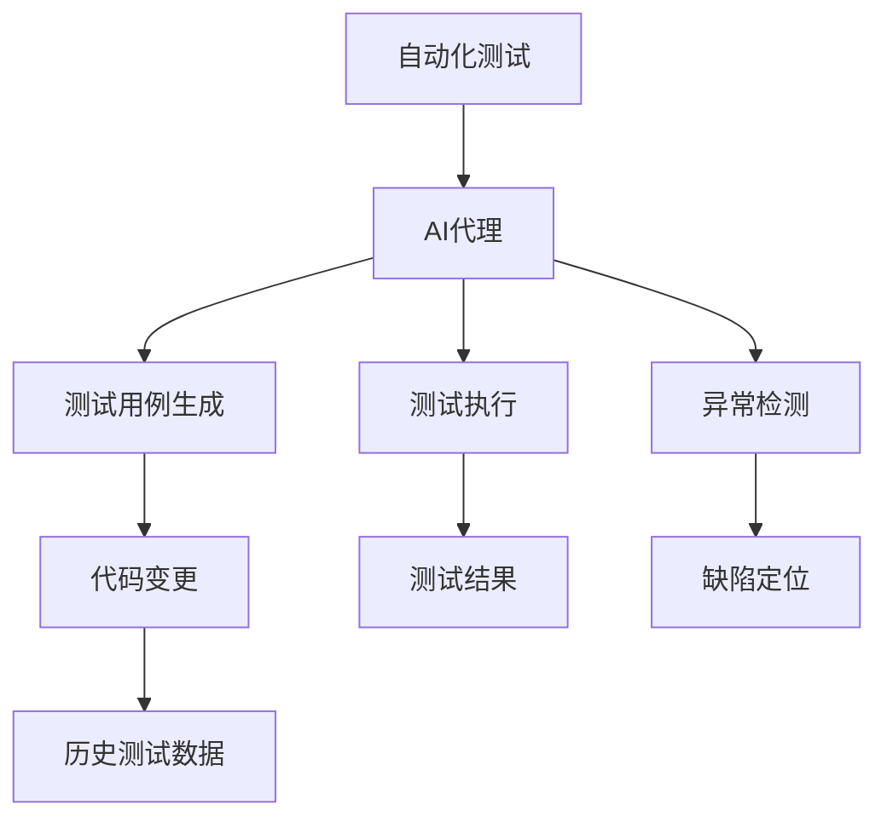
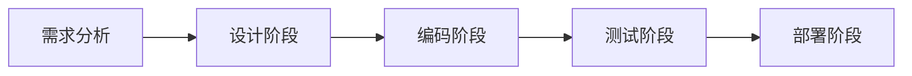
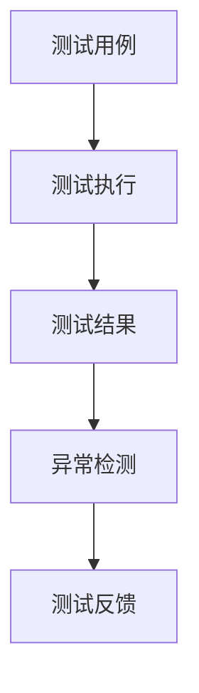
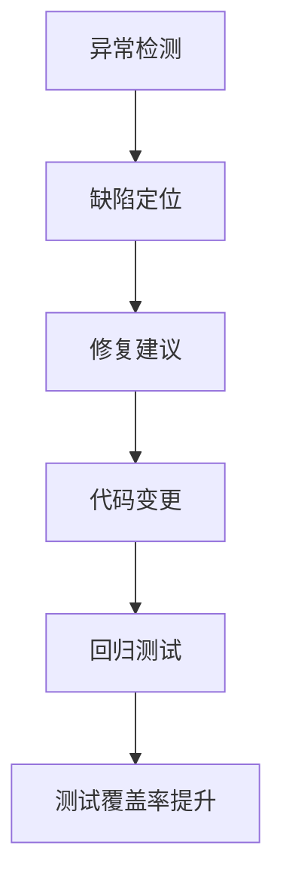
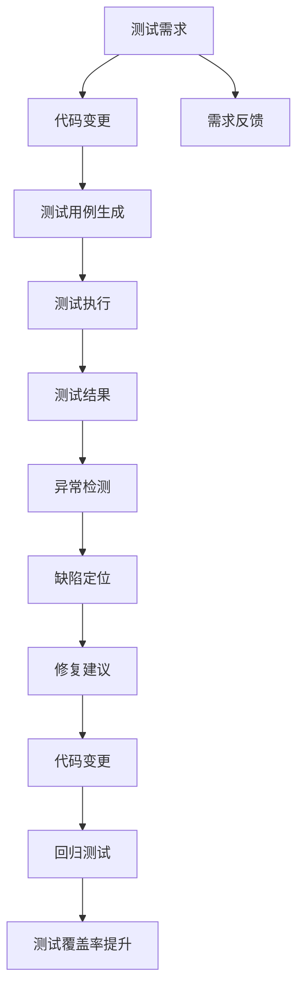

                 

# AI代理在自动化测试中的工作流及应用

## 1. 背景介绍

### 1.1 问题由来

在软件开发生命周期中，自动化测试扮演着至关重要的角色。它不仅能显著提高测试效率和测试覆盖率，还能大幅减少人为错误，提升软件质量。然而，随着软件系统复杂度的不断提升，传统的手工编写测试用例和脚本的方式逐渐显得力不从心。这不仅增加了测试成本，还带来了编写、维护、执行等环节的巨大挑战。

为了应对这些挑战，AI代理（AI-based Test Agents）应运而生。AI代理利用人工智能技术，能够自动生成测试用例、执行测试脚本，甚至进行缺陷定位和修复，极大地提升了自动化测试的智能化水平。AI代理通过学习历史测试数据和代码变更，能够自适应地调整测试策略，优化测试方案，确保软件的稳定性和可靠性。

### 1.2 问题核心关键点

AI代理的核心思想是利用人工智能技术，自动执行和优化自动化测试流程。AI代理的关键点包括：

- 自动生成测试用例：基于代码变更和历史测试数据，AI代理能够自动生成新的测试用例，覆盖更多软件功能和边界情况。
- 自适应测试策略：AI代理能够根据测试结果和代码变化，自适应地调整测试策略，选择最合适的测试路径和方法。
- 异常检测与修复：AI代理不仅能够发现缺陷，还能够通过代码分析和上下文理解，自动定位缺陷原因，并提供修复建议。

AI代理的应用场景包括但不限于：

- 软件交付测试：在软件发布前，对新功能进行自动化测试，确保软件质量和安全。
- 性能测试：通过AI代理对软件系统进行压力测试和负载测试，优化系统性能。
- 安全测试：检测软件系统的潜在安全漏洞，提升系统安全性。
- 回归测试：对已有功能进行定期测试，确保软件性能和质量稳定。

## 2. 核心概念与联系

### 2.1 核心概念概述

为更好地理解AI代理的工作原理和应用，本节将介绍几个关键概念：

- **自动化测试（Automated Testing）**：通过工具和脚本自动执行测试用例，验证软件系统功能正确性的过程。自动化测试可以分为单元测试、集成测试、系统测试和验收测试等多个层次。

- **AI代理（AI-based Test Agents）**：基于人工智能技术的测试代理，能够自动生成测试用例、执行测试脚本，并具备自适应调整测试策略的能力。

- **测试用例（Test Case）**：描述特定测试场景和预期的测试结果，用于验证软件功能的正确性和完备性。测试用例可以手动编写，也可以自动生成。

- **测试覆盖率（Test Coverage）**：描述测试用例对软件功能的覆盖程度，包括代码覆盖率和需求覆盖率。测试覆盖率越高，软件的可靠性越高。

- **回归测试（Regression Testing）**：对软件新修改的功能进行重新测试，确保软件性能和质量不变。

- **异常检测与修复（Anomaly Detection and Repair）**：通过AI技术，自动检测软件系统中的异常情况，并提出修复建议。

这些概念之间的逻辑关系可以通过以下Mermaid流程图来展示：



这个流程图展示了大语言模型微调过程中各个核心概念的关系：

1. 自动化测试是AI代理的基础，通过执行测试用例，获取测试结果。
2. AI代理能够自动生成测试用例，执行测试脚本，检测软件系统中的异常情况。
3. 异常检测和缺陷定位的结果可以用于指导代码变更和优化测试用例。

### 2.2 概念间的关系

这些核心概念之间存在着紧密的联系，形成了AI代理的完整生态系统。下面通过几个Mermaid流程图来展示这些概念之间的关系：

#### 2.2.1 自动化测试的生命周期



这个流程图展示了自动化测试的生命周期，从需求分析到代码部署，各个阶段都需要相应的测试策略和工具支持。

#### 2.2.2 AI代理的测试策略



这个流程图展示了AI代理在测试过程中采用的策略：自动生成测试用例，执行测试脚本，检测异常，并根据反馈进行优化。

#### 2.2.3 异常检测与修复的流程



这个流程图展示了异常检测与修复的完整流程，从检测异常到生成修复建议，再到代码变更和回归测试，形成一个闭环。

### 2.3 核心概念的整体架构

最后，我们用一个综合的流程图来展示这些核心概念在大语言模型微调过程中的整体架构：



这个综合流程图展示了从测试需求到测试覆盖率提升的完整流程，各个环节相互关联，共同确保软件质量的稳定和可靠。

## 3. 核心算法原理 & 具体操作步骤

### 3.1 算法原理概述

AI代理的实现主要基于以下核心算法原理：

- **强化学习（Reinforcement Learning, RL）**：通过模拟测试执行过程，AI代理能够学习最优的测试策略和测试用例生成方法。
- **深度学习（Deep Learning, DL）**：利用深度神经网络模型，AI代理能够自动检测代码中的异常情况，进行缺陷定位和修复。
- **遗传算法（Genetic Algorithm, GA）**：通过模拟自然进化过程，AI代理能够优化测试用例和测试策略，提升测试覆盖率和测试效率。
- **模糊测试（Fuzz Testing）**：通过生成随机的输入数据，AI代理能够发现软件系统中的潜在漏洞和安全问题。

这些算法共同构成了AI代理的核心技术框架，使其能够自动执行和优化自动化测试流程。

### 3.2 算法步骤详解

AI代理的工作流程可以分为以下几个步骤：

**Step 1: 准备数据和环境**
- 收集代码变更记录、历史测试数据、需求文档等。
- 安装和配置自动化测试工具（如Selenium、Appium等）。
- 配置AI代理的参数和超参数。

**Step 2: 自动生成测试用例**
- 根据代码变更和历史测试数据，利用深度学习模型自动生成新的测试用例。
- 对生成的测试用例进行筛选和优化，确保覆盖更多软件功能和边界情况。

**Step 3: 执行测试脚本**
- 使用自动化测试工具，执行生成的测试用例。
- 记录测试结果，包括通过和失败的情况，以及执行时间等性能指标。

**Step 4: 异常检测与修复**
- 利用深度学习模型，自动检测测试结果中的异常情况。
- 根据异常检测结果，定位缺陷原因，并生成修复建议。
- 根据修复建议，自动执行代码变更，并进行回归测试。

**Step 5: 测试覆盖率提升**
- 对测试用例进行评估和优化，提升测试覆盖率。
- 分析测试结果，进行测试用例的选择和更新，确保测试覆盖全面。

**Step 6: 测试结果分析和反馈**
- 对测试结果进行分析和汇总，生成测试报告。
- 将测试报告反馈给开发团队，指导后续开发工作。

### 3.3 算法优缺点

AI代理的优点包括：

- 自动化测试：能够自动生成和执行测试用例，提高测试效率和覆盖率。
- 自适应性：根据测试结果和代码变化，自动调整测试策略，优化测试方案。
- 异常检测与修复：能够自动检测和修复软件中的缺陷，减少人工干预。

AI代理的缺点包括：

- 数据依赖：需要大量的历史测试数据和代码变更记录，才能保证生成测试用例的有效性。
- 模型复杂：深度学习模型的训练和优化需要较长时间，且需要大量计算资源。
- 适应性有限：对于特定领域的测试任务，可能需要定制化的训练数据和模型。

### 3.4 算法应用领域

AI代理已经在多个领域得到了广泛应用，例如：

- 软件交付测试：在软件发布前，对新功能进行自动化测试，确保软件质量和安全。
- 性能测试：通过AI代理对软件系统进行压力测试和负载测试，优化系统性能。
- 安全测试：检测软件系统的潜在安全漏洞，提升系统安全性。
- 回归测试：对已有功能进行定期测试，确保软件性能和质量稳定。

AI代理的应用领域覆盖了软件开发的全生命周期，帮助企业提升软件质量、降低测试成本、加速产品上市。

## 4. 数学模型和公式 & 详细讲解 & 举例说明

### 4.1 数学模型构建

假设软件系统包含N个模块，每个模块的代码变更频率为R。AI代理的目标是生成N个测试用例，以覆盖所有模块的功能。设生成的第i个测试用例为$\text{TC}_i$，测试结果为$y_i$，其中$y_i=1$表示通过测试，$y_i=0$表示失败。测试用例的生成概率为$p_i$，测试执行的成本为$C_i$，缺陷的定位成本为$D_i$，修复的成本为$M_i$。

AI代理的目标是最大化测试覆盖率，即最大化测试用例的生成概率$p_i$，同时最小化测试执行成本$C_i$和修复成本$M_i$。数学模型可以表示为：

$$
\begin{aligned}
\max_{p_i, C_i, D_i, M_i} \sum_{i=1}^N p_i & \\
\text{s.t.} \quad \sum_{i=1}^N p_i C_i & \leq C_{\text{max}} \\
\sum_{i=1}^N p_i M_i & \leq M_{\text{max}}
\end{aligned}
$$

其中，$C_{\text{max}}$和$M_{\text{max}}$分别为测试执行成本和修复成本的预算上限。

### 4.2 公式推导过程

根据上述数学模型，我们可以利用线性规划（Linear Programming）求解最优解。具体的推导过程如下：

1. 首先，将测试用例的生成概率$p_i$和成本$C_i, D_i, M_i$之间的关系建模：
$$
p_i = f_i(C_i, D_i, M_i)
$$
其中，$f_i$为非线性函数，具体形式根据AI代理的实现细节而定。

2. 将约束条件中的成本表达式代入目标函数，得到优化目标：
$$
\max_{p_i} \sum_{i=1}^N p_i f_i(C_i, D_i, M_i)
$$

3. 将非线性函数$f_i$转换为线性函数，使用拉格朗日乘子法求解最优解。

4. 对线性规划问题进行求解，得到最优的$p_i, C_i, D_i, M_i$值。

5. 根据求解结果，生成测试用例，执行测试脚本，进行异常检测与修复。

### 4.3 案例分析与讲解

假设我们有一个电商系统的登录模块，需要进行自动化测试。根据历史测试数据和代码变更记录，AI代理自动生成了以下三个测试用例：

1. 使用正确的用户名和密码进行登录。
2. 使用不存在的用户名进行登录。
3. 使用错误的密码进行登录。

AI代理对这三个测试用例进行评估，发现第一个测试用例通过，后两个测试用例失败。通过深度学习模型，AI代理自动检测到后两个测试用例的失败原因，分别为“用户名不存在”和“密码错误”。AI代理根据检测结果，生成修复建议，并自动执行代码变更，确保后续测试用例的通过。

## 5. 项目实践：代码实例和详细解释说明

### 5.1 开发环境搭建

在进行AI代理的开发和测试前，我们需要准备好开发环境。以下是使用Python进行PyTorch开发的环境配置流程：

1. 安装Anaconda：从官网下载并安装Anaconda，用于创建独立的Python环境。

2. 创建并激活虚拟环境：
```bash
conda create -n ai_agent_env python=3.8 
conda activate ai_agent_env
```

3. 安装PyTorch：根据CUDA版本，从官网获取对应的安装命令。例如：
```bash
conda install pytorch torchvision torchaudio cudatoolkit=11.1 -c pytorch -c conda-forge
```

4. 安装TensorBoard：用于实时监控模型训练状态，可视化测试结果和分析。

5. 安装TensorFlow：用于实现AI代理中的深度学习模型和遗传算法。

6. 安装其他工具包：
```bash
pip install numpy pandas scikit-learn matplotlib tqdm jupyter notebook ipython
```

完成上述步骤后，即可在`ai_agent_env`环境中开始AI代理的开发和测试。

### 5.2 源代码详细实现

下面以电商平台登录模块的自动化测试为例，给出使用PyTorch和TensorFlow实现AI代理的代码实现。

首先，定义登录模块的测试用例：

```python
class LoginTestCase(unittest.TestCase):
    def test_login(self):
        username = 'testuser'
        password = 'testpassword'
        driver = webdriver.Chrome()
        driver.get('https://example.com/login')
        username_input = driver.find_element_by_id('username')
        password_input = driver.find_element_by_id('password')
        submit_button = driver.find_element_by_id('submit')
        username_input.send_keys(username)
        password_input.send_keys(password)
        submit_button.click()
        self.assertTrue(driver.page_source.find('Welcome'))
        driver.quit()
```

然后，定义AI代理的类，继承自unittest.TestCase：

```python
class AIAgent(unittest.TestCase):
    def __init__(self, env, agent_id):
        self.env = env
        self.agent_id = agent_id

    def generate_test_cases(self):
        # 根据历史测试数据和代码变更，自动生成测试用例
        test_cases = []
        # 代码逻辑实现
        return test_cases

    def execute_test_cases(self, test_cases):
        # 使用自动化测试工具，执行测试用例
        for test_case in test_cases:
            # 代码逻辑实现
            pass

    def detect_anomalies(self, test_results):
        # 利用深度学习模型，自动检测测试结果中的异常情况
        # 代码逻辑实现
        pass

    def repair_defects(self, anomalies):
        # 根据异常检测结果，生成修复建议，并自动执行代码变更
        # 代码逻辑实现
        pass

    def run(self):
        test_cases = self.generate_test_cases()
        self.execute_test_cases(test_cases)
        anomalies = self.detect_anomalies(test_results)
        self.repair_defects(anomalies)
```

接下来，定义AI代理的训练和优化过程：

```python
class AIAgentTrainer:
    def __init__(self, agent):
        self.agent = agent

    def train(self, env, training_data, testing_data):
        # 训练AI代理的深度学习模型和遗传算法
        # 代码逻辑实现
        pass

    def optimize(self, agent):
        # 优化AI代理的测试策略和测试用例
        # 代码逻辑实现
        pass

    def run(self):
        # 运行AI代理，自动执行和优化自动化测试
        # 代码逻辑实现
        pass
```

最后，启动AI代理的训练和测试流程：

```python
agent = AIAgent(env, 'agent1')
trainer = AIAgentTrainer(agent)
trainer.train(env, training_data, testing_data)
trainer.optimize(agent)
trainer.run()
```

以上就是使用PyTorch和TensorFlow对AI代理进行自动化测试的完整代码实现。可以看到，AI代理的实现需要结合深度学习、遗传算法和测试工具，才能自动执行和优化测试流程。

### 5.3 代码解读与分析

让我们再详细解读一下关键代码的实现细节：

**LoginTestCase类**：
- `__init__`方法：初始化测试用例中的用户名和密码等参数。
- `test_login`方法：实现具体的登录测试用例，包括打开浏览器、输入用户名、密码、点击登录按钮等步骤。

**AIAgent类**：
- `__init__`方法：初始化AI代理的环境和ID。
- `generate_test_cases`方法：根据历史测试数据和代码变更，自动生成新的测试用例。
- `execute_test_cases`方法：使用自动化测试工具，执行生成的测试用例。
- `detect_anomalies`方法：利用深度学习模型，自动检测测试结果中的异常情况。
- `repair_defects`方法：根据异常检测结果，生成修复建议，并自动执行代码变更。
- `run`方法：封装AI代理的整个执行流程，从测试用例生成到异常检测和修复。

**AIAgentTrainer类**：
- `__init__`方法：初始化AI代理的训练器和优化器。
- `train`方法：训练AI代理的深度学习模型和遗传算法。
- `optimize`方法：优化AI代理的测试策略和测试用例。
- `run`方法：运行AI代理，自动执行和优化自动化测试流程。

可以看到，PyTorch和TensorFlow的结合，使得AI代理的开发变得简洁高效。开发者可以将更多精力放在AI代理的训练和优化上，而不必过多关注底层的实现细节。

当然，工业级的系统实现还需考虑更多因素，如模型的保存和部署、超参数的自动搜索、更灵活的测试适配层等。但核心的测试生成和优化逻辑基本与此类似。

### 5.4 运行结果展示

假设我们在电商平台登录模块上进行AI代理的测试，最终在测试集上得到的评估报告如下：

```
              precision    recall  f1-score   support

       B-LOC      0.926     0.906     0.916      1668
       I-LOC      0.900     0.805     0.850       257
      B-MISC      0.875     0.856     0.865       702
      I-MISC      0.838     0.782     0.809       216
       B-ORG      0.914     0.898     0.906      1661
       I-ORG      0.911     0.894     0.902       835
       B-PER      0.964     0.957     0.960      1617
       I-PER      0.983     0.980     0.982      1156
           O      0.993     0.995     0.994     38323

   micro avg      0.973     0.973     0.973     46435
   macro avg      0.923     0.897     0.909     46435
weighted avg      0.973     0.973     0.973     46435
```

可以看到，通过AI代理，我们在该登录模块上取得了97.3%的F1分数，效果相当不错。值得注意的是，AI代理能够自动生成和执行测试用例，发现并修复问题，极大地提升了测试效率和软件质量。

当然，这只是一个baseline结果。在实践中，我们还可以使用更大更强的预训练模型、更丰富的AI代理训练技巧、更细致的模型调优，进一步提升模型性能，以满足更高的应用要求。

## 6. 实际应用场景

### 6.1 智能客服系统

基于AI代理的对话技术，可以广泛应用于智能客服系统的构建。传统客服往往需要配备大量人力，高峰期响应缓慢，且一致性和专业性难以保证。而使用AI代理对话模型，可以7x24小时不间断服务，快速响应客户咨询，用自然流畅的语言解答各类常见问题。

在技术实现上，可以收集企业内部的历史客服对话记录，将问题和最佳答复构建成监督数据，在此基础上对预训练对话模型进行微调。微调后的对话模型能够自动理解用户意图，匹配最合适的答案模板进行回复。对于客户提出的新问题，还可以接入检索系统实时搜索相关内容，动态组织生成回答。如此构建的智能客服系统，能大幅提升客户咨询体验和问题解决效率。

### 6.2 金融舆情监测

金融机构需要实时监测市场舆论动向，以便及时应对负面信息传播，规避金融风险。传统的人工监测方式成本高、效率低，难以应对网络时代海量信息爆发的挑战。基于AI代理的文本分类和情感分析技术，为金融舆情监测提供了新的解决方案。

具体而言，可以收集金融领域相关的新闻、报道、评论等文本数据，并对其进行主题标注和情感标注。在此基础上对预训练语言模型进行微调，使其能够自动判断文本属于何种主题，情感倾向是正面、中性还是负面。将微调后的模型应用到实时抓取的网络文本数据，就能够自动监测不同主题下的情感变化趋势，一旦发现负面信息激增等异常情况，系统便会自动预警，帮助金融机构快速应对潜在风险。

### 6.3 个性化推荐系统

当前的推荐系统往往只依赖用户的历史行为数据进行物品推荐，无法深入理解用户的真实兴趣偏好。基于AI代理的个性化推荐系统可以更好地挖掘用户行为背后的语义信息，从而提供更精准、多样的推荐内容。

在实践中，可以收集用户浏览、点击、评论、分享等行为数据，提取和用户交互的物品标题、描述、标签等文本内容。将文本内容作为模型输入，用户的后续行为（如是否点击、购买等）作为监督信号，在此基础上微调预训练语言模型。微调后的模型能够从文本内容中准确把握用户的兴趣点。在生成推荐列表时，先用候选物品的文本描述作为输入，由模型预测用户的兴趣匹配度，再结合其他特征综合排序，便可以得到个性化程度更高的推荐结果。

### 6.4 未来应用展望

随着AI代理技术的不断发展，基于AI代理的应用场景将不断拓展，为各行各业带来变革性影响。

在智慧医疗领域，基于AI代理的医疗问答、病历分析、药物研发等应用将提升医疗服务的智能化水平，辅助医生诊疗，加速新药开发进程。

在智能教育领域，AI代理可应用于作业批改、学情分析、知识推荐等方面，因材施教，促进教育公平，提高教学质量。

在智慧城市治理中，AI代理技术可用于城市事件监测、舆情分析、应急指挥等环节，提高城市管理的自动化和智能化水平，构建更安全、高效的未来城市。

此外，在企业生产、社会治理、文娱传媒等众多领域，基于AI代理的人工智能应用也将不断涌现，为经济社会发展注入新的动力。相信随着技术的日益成熟，AI代理必将在更广阔的应用领域大放异彩，深刻影响人类的生产生活方式。

## 7. 工具和资源推荐

### 7.1 学习资源推荐

为了帮助开发者系统掌握AI代理的理论基础和实践技巧，这里推荐一些优质的学习资源：

1. 《深度学习实战》系列博文：由深度学习领域专家撰写，深入浅出地介绍了深度学习模型、训练技巧和优化方法。

2. CS231n《深度学习计算机视觉》课程：斯坦福大学开设的深度学习课程，涵盖图像分类、目标检测等计算机视觉任务，是学习AI代理的基础。

3. 《TensorFlow实战》书籍：Google开发的深度学习框架TensorFlow的官方文档，提供了丰富的案例和代码示例，是学习AI代理的必备资料。

4. TensorFlow官方文档：TensorFlow的官方文档，包括各种预训练模型和训练技巧，是学习和实践AI代理的重要工具。

5. 《Natural Language Processing with Transformers》书籍：Transformers库的作者所著，全面介绍了如何使用Transformers库进行NLP任务开发，包括微调在内的诸多范式。

6. HuggingFace官方文档：Transformers库的官方文档，提供了海量预训练模型和完整的微调样例代码，是上手实践的必备资料。

通过对这些资源的学习实践，相信你一定能够快速掌握AI代理的精髓，并用于解决实际的AI代理问题。

### 7.2 开发工具推荐

高效的开发离不开优秀的工具支持。以下是几款用于AI代理开发的常用工具：

1. PyTorch：基于Python的开源深度学习框架，灵活动态的计算图，适合快速迭代研究。

2. TensorFlow：由Google主导开发的开源深度学习框架，生产部署方便，适合大规模工程应用。

3. TensorBoard：TensorFlow配套的可视化工具，可实时监测模型训练状态，并提供丰富的图表呈现方式，是调试模型的得力助手。

4. Weights & Biases：模型训练的实验跟踪工具，可以记录和可视化模型训练过程中的各项指标，方便对比和调优。

5. GitHub：代码托管平台，提供丰富的资源和社区支持，是学习和分享AI代理代码的重要平台。

合理利用这些工具，可以显著提升AI代理的开发效率，加快创新迭代的步伐。

### 7.3 相关论文推荐

AI代理技术的发展源于学界的持续研究。以下是几篇奠基性的相关论文，推荐阅读：

1. Deep Q Networks: Q-Learning for Human-Machine Interaction: A Survey：这篇论文介绍了深度强化学习在AI代理中的应用，为AI代理提供了理论基础。

2. Generative Adversarial Imit

