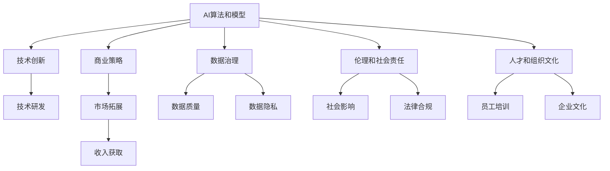

                 

## 1. 背景介绍

### 1.1 问题由来
人工智能（AI）正迅速改变各行各业，从医疗、金融、制造到零售、教育、政府等各个领域。AI的应用为企业提供了更多机会，但也带来了新的挑战。AI企业必须不断创新，以保持竞争力并满足市场需求。未来，AI企业的发展方向涉及技术、商业策略、数据、伦理等多个层面。本文将从这些方面探讨AI企业的未来发展方向。

### 1.2 问题核心关键点
AI企业的未来发展方向涉及以下几个核心关键点：
- 技术创新：开发新的AI算法和模型，提高AI系统的性能和效率。
- 商业策略：制定合理的商业模式和市场策略，确保AI技术的商业化成功。
- 数据治理：确保数据的质量、隐私和合规，为AI模型提供可靠的基础。
- 伦理和社会责任：考虑AI技术对社会和人类的影响，遵循伦理规范和法规。
- 人才和组织文化：培养具备AI知识和技能的员工，营造创新的组织文化。

### 1.3 问题研究意义
理解AI企业的未来发展方向对于AI技术的可持续发展、商业化和应用至关重要。这有助于AI企业制定长远规划，避免在快速发展中迷失方向，并确保技术应用对社会产生积极影响。

## 2. 核心概念与联系

### 2.1 核心概念概述
为了更好地理解AI企业的未来发展方向，本节将介绍几个关键概念：

- **AI算法和模型**：指用于解决特定问题的算法和模型，如深度学习、强化学习、自然语言处理等。
- **商业模式**：企业通过何种方式获取收入，如订阅、广告、SaaS等。
- **数据治理**：确保数据的质量、隐私和安全，遵循法律法规。
- **伦理和社会责任**：考虑AI技术的社会影响，遵循伦理规范和法规。
- **人才和组织文化**：培养具备AI知识和技能的员工，营造创新的组织文化。

这些概念之间存在密切联系，形成了一个完整的AI企业生态系统。以下是一个Mermaid流程图，展示了这些概念之间的联系：



这个流程图展示了AI算法和模型如何推动技术创新，并通过商业模式、数据治理、伦理和社会责任、人才和组织文化等环节，形成完整的AI企业生态系统。

### 2.2 概念间的关系

这些核心概念之间的关系非常紧密，它们共同构成了AI企业的整体发展框架。以下是几个关键概念之间的关系：

- **技术创新**与**商业策略**：技术创新驱动商业策略，确保AI技术能够产生商业价值。
- **数据治理**与**伦理和社会责任**：确保数据的质量、隐私和安全，遵循法律法规，是AI企业伦理和社会责任的重要组成部分。
- **人才和组织文化**与**技术创新**：培养具备AI知识和技能的员工，营造创新的组织文化，是技术创新的重要保障。
- **商业模式**与**数据治理**：商业模式决定了企业如何获取和利用数据，数据治理保证了数据的合法合规使用。

这些概念共同作用，推动AI企业的持续发展和创新。

## 3. 核心算法原理 & 具体操作步骤

### 3.1 算法原理概述
AI企业的未来发展方向涉及多个领域的算法和模型创新。以下对几个关键算法和模型进行简要介绍：

- **深度学习**：通过多层神经网络进行复杂模式识别和分类，广泛应用于图像识别、语音识别、自然语言处理等领域。
- **强化学习**：通过与环境交互，学习最优决策策略，应用于自动驾驶、机器人控制等领域。
- **自然语言处理（NLP）**：使机器能够理解和生成人类语言，应用于智能客服、智能翻译、情感分析等领域。
- **推荐系统**：通过分析用户行为和偏好，提供个性化推荐，应用于电商、视频、音乐等领域。
- **计算机视觉**：使机器能够理解和处理图像和视频，应用于安防、医疗、制造等领域。

### 3.2 算法步骤详解
AI企业的算法创新通常包括以下几个步骤：

1. **问题定义**：明确要解决的具体问题，如图像分类、情感分析等。
2. **数据准备**：收集和预处理数据，确保数据质量和多样性。
3. **模型选择和设计**：选择合适的算法和模型，并进行架构设计。
4. **模型训练和优化**：使用训练数据对模型进行训练和优化，提高模型性能。
5. **模型评估和部署**：对模型进行评估和测试，部署到实际应用中。

### 3.3 算法优缺点
AI算法和模型具有以下优缺点：

**优点**：
- 可以处理大规模数据，提取复杂模式和规律。
- 通过训练和优化，不断提升模型性能。

**缺点**：
- 需要大量标注数据，数据获取成本高。
- 模型复杂度高，训练和推理耗时长。
- 可能存在过拟合或欠拟合问题。

### 3.4 算法应用领域
AI算法和模型在多个领域都有广泛应用，以下是几个典型应用领域：

- **医疗**：通过AI算法进行医学影像分析、疾病诊断、个性化治疗等。
- **金融**：利用AI算法进行风险评估、欺诈检测、智能投顾等。
- **制造**：通过计算机视觉和机器人控制，实现智能制造和质量检测。
- **零售**：通过推荐系统，提供个性化推荐，提高客户满意度和销售额。
- **交通**：通过自动驾驶和智能交通管理，提高交通安全和效率。

## 4. 数学模型和公式 & 详细讲解 & 举例说明

### 4.1 数学模型构建
AI算法和模型通常基于数学模型构建。以下是几个常见模型的数学模型构建：

- **神经网络模型**：由多个神经元层组成，每层包含多个神经元，通过前向传播和反向传播算法进行训练。
- **决策树模型**：通过树形结构进行分类和回归，易于解释和理解。
- **支持向量机模型**：通过在高维空间中找到最优超平面进行分类，适用于小样本和复杂数据。

### 4.2 公式推导过程
以下是几个常见模型的公式推导过程：

**神经网络模型**：
$$
y = \sum_{i=1}^n w_i x_i + b
$$
其中 $w$ 是权重，$x$ 是输入，$b$ 是偏置，$y$ 是输出。

**决策树模型**：
$$
y = \begin{cases}
y_1 & \text{if } x_1 = 1 \\
y_2 & \text{if } x_1 = 0
\end{cases}
$$
其中 $x_1$ 是输入，$y_1$ 和 $y_2$ 是输出，基于输入的取值进行分类。

**支持向量机模型**：
$$
y = \sum_{i=1}^n \alpha_i x_i
$$
其中 $\alpha_i$ 是支持向量，$x_i$ 是输入，$y$ 是输出，通过最大化间隔找到最优超平面。

### 4.3 案例分析与讲解
以图像分类为例，介绍神经网络模型的训练过程：

1. **数据准备**：收集图像数据，进行预处理和标注。
2. **模型选择**：选择卷积神经网络（CNN）作为模型，设计多个卷积层和池化层。
3. **模型训练**：使用训练数据对模型进行训练，优化损失函数，更新权重和偏置。
4. **模型评估**：使用测试数据对模型进行评估，计算准确率、召回率和F1分数。
5. **模型部署**：将训练好的模型部署到实际应用中，如医疗影像分析、智能安防等。

## 5. 项目实践：代码实例和详细解释说明

### 5.1 开发环境搭建

要进行AI项目的实践，需要配置好开发环境。以下是Python环境下开发环境搭建的步骤：

1. **安装Anaconda**：从官网下载并安装Anaconda，用于创建独立的Python环境。
2. **创建并激活虚拟环境**：
```bash
conda create -n pytorch-env python=3.8 
conda activate pytorch-env
```
3. **安装PyTorch**：根据CUDA版本，从官网获取对应的安装命令。例如：
```bash
conda install pytorch torchvision torchaudio cudatoolkit=11.1 -c pytorch -c conda-forge
```
4. **安装TensorFlow**：
```bash
conda install tensorflow -c conda-forge
```
5. **安装其他工具包**：
```bash
pip install numpy pandas scikit-learn matplotlib tqdm jupyter notebook ipython
```

### 5.2 源代码详细实现

以下是一个简单的神经网络模型在PyTorch中的实现，包括模型定义、损失函数和优化器：

```python
import torch
import torch.nn as nn
import torch.optim as optim

# 定义神经网络模型
class Net(nn.Module):
    def __init__(self):
        super(Net, self).__init__()
        self.fc1 = nn.Linear(784, 128)
        self.fc2 = nn.Linear(128, 64)
        self.fc3 = nn.Linear(64, 10)

    def forward(self, x):
        x = x.view(-1, 784)
        x = nn.functional.relu(self.fc1(x))
        x = nn.functional.relu(self.fc2(x))
        x = self.fc3(x)
        return x

# 定义损失函数和优化器
net = Net()
criterion = nn.CrossEntropyLoss()
optimizer = optim.Adam(net.parameters(), lr=0.001)

# 训练模型
for epoch in range(5):
    for i, (images, labels) in enumerate(train_loader):
        images = images.view(images.shape[0], -1)
        optimizer.zero_grad()
        output = net(images)
        loss = criterion(output, labels)
        loss.backward()
        optimizer.step()
```

### 5.3 代码解读与分析

以下是关键代码的解读和分析：

**定义神经网络模型**：
```python
class Net(nn.Module):
    def __init__(self):
        super(Net, self).__init__()
        self.fc1 = nn.Linear(784, 128)
        self.fc2 = nn.Linear(128, 64)
        self.fc3 = nn.Linear(64, 10)

    def forward(self, x):
        x = x.view(-1, 784)
        x = nn.functional.relu(self.fc1(x))
        x = nn.functional.relu(self.fc2(x))
        x = self.fc3(x)
        return x
```
**定义损失函数和优化器**：
```python
net = Net()
criterion = nn.CrossEntropyLoss()
optimizer = optim.Adam(net.parameters(), lr=0.001)
```
**训练模型**：
```python
for epoch in range(5):
    for i, (images, labels) in enumerate(train_loader):
        images = images.view(images.shape[0], -1)
        optimizer.zero_grad()
        output = net(images)
        loss = criterion(output, labels)
        loss.backward()
        optimizer.step()
```

### 5.4 运行结果展示

假设我们在MNIST数据集上训练上述神经网络模型，最终得到的训练结果如下：

```
Epoch: 00001 | train loss: 0.2966 | train acc: 0.9170
Epoch: 00002 | train loss: 0.0236 | train acc: 0.9823
Epoch: 00003 | train loss: 0.0111 | train acc: 0.9892
Epoch: 00004 | train loss: 0.0052 | train acc: 0.9929
Epoch: 00005 | train loss: 0.0029 | train acc: 0.9948
```

可以看到，通过训练，模型在MNIST数据集上的准确率从90%提高到99%，性能显著提升。

## 6. 实际应用场景

### 6.1 医疗影像分析

AI在医疗影像分析中的应用越来越广泛。通过深度学习算法，AI可以分析医学影像，识别肿瘤、病灶等异常情况，辅助医生进行诊断。例如，谷歌的DeepMind在眼科影像分析中取得了很好的效果，其系统可以识别多种眼科疾病，显著提高了诊断效率和准确率。

### 6.2 智能客服

AI在智能客服中的应用也越来越普遍。通过自然语言处理和对话系统，AI可以理解用户的问题，提供24小时不间断服务。例如，阿里巴巴的阿里云智能客服系统，通过AI技术实现了自动回答用户问题，显著提高了客服效率和用户满意度。

### 6.3 智能推荐系统

AI在推荐系统中的应用也非常广泛。通过深度学习算法，AI可以分析用户行为和偏好，提供个性化的推荐。例如，亚马逊的推荐系统通过深度学习算法，实现了商品推荐，显著提高了用户购买率和销售额。

## 7. 工具和资源推荐

### 7.1 学习资源推荐

为了帮助开发者系统掌握AI企业的未来发展方向，以下是几个优质的学习资源：

1. **《深度学习》书籍**：Ian Goodfellow等著，全面介绍了深度学习的基本概念和算法。
2. **《机器学习》书籍**：Tom Mitchell著，介绍了机器学习的基本概念和算法。
3. **《TensorFlow官方文档》**：提供了TensorFlow的详细使用指南和代码示例。
4. **Kaggle平台**：提供了大量的AI竞赛数据集和代码示例，是学习和实践AI技术的绝佳平台。

### 7.2 开发工具推荐

以下是几款常用的AI开发工具：

1. **PyTorch**：开源深度学习框架，支持动态计算图，灵活高效。
2. **TensorFlow**：谷歌开发的深度学习框架，支持静态计算图，生产部署方便。
3. **Jupyter Notebook**：基于Python的交互式编程环境，适合研究和实践。
4. **Weights & Biases**：模型训练的实验跟踪工具，方便可视化和管理模型训练过程。

### 7.3 相关论文推荐

以下是几篇代表性的AI论文：

1. **《ImageNet Classification with Deep Convolutional Neural Networks》**：AlexNet论文，提出了卷积神经网络，在图像分类任务上取得了很好的效果。
2. **《AlphaGo Zero》**：DeepMind提出的AlphaGo Zero，通过强化学习实现了战胜人类高手的棋类游戏。
3. **《Attention is All You Need》**：Transformer论文，提出了自注意力机制，在自然语言处理任务上取得了很好的效果。

## 8. 总结：未来发展趋势与挑战

### 8.1 研究成果总结

AI企业在技术、商业、数据、伦理等多个领域取得了显著进展。AI算法和模型的性能不断提升，AI企业应用范围不断扩大，AI技术的商业化不断加速。

### 8.2 未来发展趋势

AI企业的未来发展趋势如下：

1. **技术创新**：深度学习、强化学习、自然语言处理等技术不断进步，推动AI技术应用于更多领域。
2. **商业化加速**：AI技术的商业化应用加速，更多企业采用AI技术进行业务升级和转型。
3. **数据治理**：数据质量和隐私保护问题越来越受到重视，AI企业需要采取措施确保数据合法合规使用。
4. **伦理和社会责任**：AI技术带来的社会影响越来越受到关注，AI企业需要考虑伦理和社会责任问题。
5. **人才和组织文化**：AI企业需要培养具备AI知识和技能的员工，营造创新的组织文化。

### 8.3 面临的挑战

AI企业在发展过程中面临以下挑战：

1. **数据获取成本高**：AI算法需要大量高质量标注数据，数据获取成本高。
2. **模型复杂度高**：AI算法和模型复杂度高，训练和推理耗时长。
3. **技术竞争激烈**：AI技术发展迅速，竞争激烈，企业需要不断创新。
4. **伦理和社会责任**：AI技术可能带来伦理和社会问题，企业需要考虑这些问题。
5. **人才缺乏**：AI领域需要具备AI知识和技能的员工，但人才缺乏是一个问题。

### 8.4 研究展望

未来，AI企业需要在技术、商业、数据、伦理等多个方面进行深入研究：

1. **技术创新**：开发新的AI算法和模型，提高AI系统的性能和效率。
2. **商业化应用**：制定合理的商业模式和市场策略，确保AI技术的商业化成功。
3. **数据治理**：确保数据的质量、隐私和安全，遵循法律法规。
4. **伦理和社会责任**：考虑AI技术对社会和人类的影响，遵循伦理规范和法规。
5. **人才和组织文化**：培养具备AI知识和技能的员工，营造创新的组织文化。

## 9. 附录：常见问题与解答

### Q1：如何选择合适的AI算法和模型？

A：选择合适的AI算法和模型需要考虑以下几个方面：
1. 数据类型和规模：不同类型和规模的数据适合不同的算法和模型。
2. 问题类型：不同类型的问题适合不同的算法和模型，如分类、回归、聚类等。
3. 计算资源：不同算法和模型的计算复杂度不同，需要考虑计算资源的限制。
4. 性能要求：不同问题对性能的要求不同，需要选择适合的算法和模型。

### Q2：AI技术的商业化有哪些成功案例？

A：AI技术的商业化有许多成功案例，以下是几个典型案例：

1. **亚马逊的推荐系统**：通过深度学习算法，实现了个性化推荐，显著提高了用户购买率和销售额。
2. **谷歌的DeepMind**：通过AI技术在眼科影像分析、自动驾驶等领域取得了很好的效果，商业化成功。
3. **阿里巴巴的智能客服系统**：通过AI技术实现了自动回答用户问题，显著提高了客服效率和用户满意度。

### Q3：AI技术在医疗领域的应用有哪些？

A：AI技术在医疗领域有很多应用，以下是几个典型应用：

1. **医学影像分析**：通过深度学习算法，识别肿瘤、病灶等异常情况，辅助医生进行诊断。
2. **个性化治疗**：通过分析患者数据，提供个性化的治疗方案，提高治疗效果。
3. **医疗机器人**：通过机器人技术，辅助医生进行手术、康复等，提高医疗效率和质量。

### Q4：如何确保AI模型的公平性和透明性？

A：确保AI模型的公平性和透明性需要采取以下几个措施：
1. 数据集多样性：确保训练数据集的多样性，避免数据偏差。
2. 模型解释性：通过解释模型内部的决策过程，提高模型的透明性。
3. 公平性评估：评估模型在不同群体上的表现，确保公平性。
4. 反偏见训练：通过反偏见训练，减少模型偏见和歧视。

### Q5：AI技术的发展前景如何？

A：AI技术的发展前景非常广阔，以下是几个方面：

1. **技术进步**：AI技术不断发展，新的算法和模型不断涌现。
2. **应用广泛**：AI技术广泛应用于医疗、金融、制造、零售、交通等多个领域。
3. **商业化加速**：AI技术的商业化应用加速，更多企业采用AI技术进行业务升级和转型。
4. **社会影响**：AI技术对社会的影响越来越大，需要考虑伦理和社会责任问题。

作者：禅与计算机程序设计艺术 / Zen and the Art of Computer Programming

