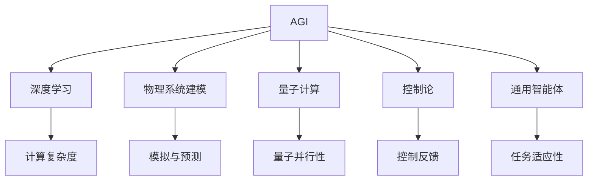
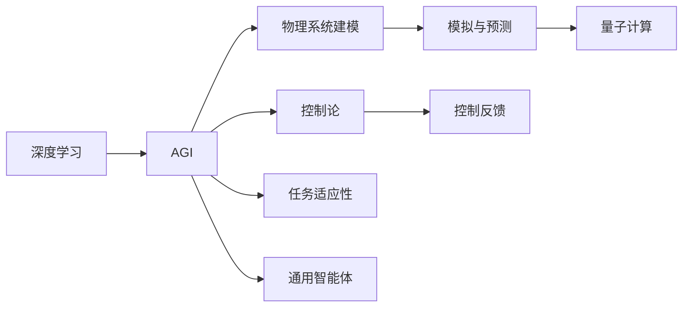

                 

## 1. 背景介绍

人工智能（AGI, Artificial General Intelligence）作为当前最为前沿的科技之一，是全球科学家、工程师、研究者所聚焦的核心领域之一。从原理到应用，AGI研究已然触及了数学、物理、计算科学、哲学、社会学等多个领域，是一个多学科融合的复杂系统工程。

AGI的核心目标在于构建具有类人智能的机器，使得机器能够在广泛的情境下，具备学习能力、推理能力、创造能力以及自我意识，从而实现与人类智能的趋同与协作。这一目标的实现离不开对深度学习、自然语言处理、计算机视觉、决策理论、逻辑推理等多领域的跨学科研究。

物理学作为自然科学中的基础学科，其在理论与实验层面的突破性进展，无疑为AGI的研究提供了重要的理论支撑与实践指导。AGI与物理学之间的交叉研究，不仅拓展了物理学研究的新领域，更推动了AGI技术的创新与发展，为构建真正智能化的系统提供了可能。

## 2. 核心概念与联系

### 2.1 核心概念概述

为了更好地理解AGI与物理学的交叉研究，本节将介绍几个核心的概念：

- **AGI**: 人工智能的一个高级目标，旨在构建具有全方位智能的机器，涵盖学习能力、推理能力、创造能力等。

- **深度学习**: 当前AGI研究的主要技术手段，通过多层神经网络对大量数据进行特征提取与学习，实现对复杂任务的自动化处理。

- **物理系统建模**: 物理学中的重要方法，通过数学模型对物理系统的行为进行模拟与预测，广泛应用于各类工程、物理领域。

- **量子计算**: 一种基于量子力学原理的新型计算方式，具有极高的计算效率与并行性，被视为未来计算技术的重要方向。

- **控制论**: 将自动控制理论与AGI相结合，实现对机器智能行为的调控与优化，推动AGI技术的发展。

- **通用智能体**: AGI研究的主要目标，旨在构建能够应对任意任务与环境的通用智能系统，具备自主学习与决策能力。

这些核心概念构成了AGI与物理学交叉研究的基石，为跨学科研究提供了重要的理论支撑与实践指导。

### 2.2 概念间的关系

通过以下Mermaid流程图，我们可以更清晰地理解AGI与物理学交叉研究中的核心概念间的关系：



这个流程图展示了AGI与物理学交叉研究的各个核心概念之间的关系：

1. AGI系统通过深度学习实现智能化。
2. 物理系统建模为AGI提供了数学与物理模型基础。
3. 量子计算为AGI提供了高效的计算支持。
4. 控制论指导AGI系统的调控与优化。
5. 通用智能体是AGI研究的主要目标。
6. 计算复杂度、模拟预测、量子并行性、控制反馈与任务适应性均是AGI技术实现中的重要内容。

### 2.3 核心概念的整体架构

最后，我们用一个综合的流程图来展示这些核心概念在大规模交叉研究中的整体架构：



这个综合流程图展示了从深度学习到AGI，再到物理系统建模、量子计算、控制论等各个概念间的关系，描绘出AGI与物理学交叉研究的完整生态系统。

## 3. 核心算法原理 & 具体操作步骤

### 3.1 算法原理概述

AGI与物理学的交叉研究，涉及众多领域的前沿算法，包括深度学习、物理系统建模、量子计算等。这些算法在各自领域中各有特色，但通过跨学科的融合，可以构建更为强大的AGI系统。

以物理系统建模为例，其核心算法主要分为两类：一类是物理系统的经典模型与理论，另一类是量子力学的波函数计算。这些理论模型与计算方法，为AGI系统的智能决策与推理提供了重要基础。

### 3.2 算法步骤详解

**Step 1: 收集物理数据**
- 使用传感器与观测设备，收集目标系统的物理数据。数据来源包括环境参数、系统状态、动态变化等。

**Step 2: 建立物理模型**
- 基于物理定律与原理，建立目标系统的数学模型。例如，牛顿力学模型、热力学模型、量子力学模型等。

**Step 3: 进行仿真与预测**
- 利用计算机算法，对目标系统进行模拟与预测。例如，蒙特卡洛模拟、分子动力学模拟、量子计算等。

**Step 4: 提取特征与知识**
- 从仿真预测结果中提取关键特征与知识，例如时间序列、空间分布、系统状态等。

**Step 5: 训练AGI系统**
- 使用深度学习算法，训练AGI系统，使其具备对物理系统的理解和预测能力。

**Step 6: 验证与优化**
- 对AGI系统进行验证与优化，确保其预测结果与实际物理系统行为一致。

**Step 7: 部署与应用**
- 将训练好的AGI系统部署到实际应用中，进行实时监测与智能决策。

### 3.3 算法优缺点

AGI与物理学的交叉研究，具有以下优点：
1. 深度学习与物理建模的结合，能够充分利用两种算法的长处，实现更为全面、深入的智能决策。
2. 通过物理建模，AGI系统能够更好地理解和预测物理系统的行为，提高决策的准确性与可靠性。
3. 量子计算等先进计算技术的应用，可以大幅提升AGI系统的计算效率与处理能力。
4. 多学科的交叉研究，推动了科学研究与技术创新的双轮驱动。

同时，该研究方法也存在以下局限性：
1. 需要收集大量的物理数据，数据获取难度大，成本高。
2. 多学科的整合与融合，需要具备高度的跨学科知识背景，对研究者的要求较高。
3. 物理模型的建立与验证，往往需要大量计算资源，存在一定的技术壁垒。
4. AGI系统的训练与优化，需要复杂的算法与参数调优，操作难度大。

尽管存在这些局限性，但AGI与物理学的交叉研究，无疑是未来智能科学与工程的重要方向，具有巨大的潜力与前景。

### 3.4 算法应用领域

AGI与物理学的交叉研究，主要应用于以下几个领域：

**机器人控制与决策**
- 利用物理建模与仿真，为机器人建立环境与任务模型，优化机器人控制策略与行为决策。

**自动化生产**
- 通过物理系统建模与深度学习，优化生产流程，提升生产效率与质量。

**环境监测与预测**
- 应用物理学原理与技术，对环境数据进行建模与分析，实现环境变化的预测与监测。

**能源管理**
- 利用物理建模与量子计算，优化能源分配与使用，实现更高效的能源管理与调控。

**交通系统**
- 建立交通流模型，通过深度学习与物理模拟，优化交通流量控制与决策。

**医疗健康**
- 使用物理学原理与深度学习，预测病情变化，优化治疗方案与医疗决策。

## 4. 数学模型和公式 & 详细讲解 & 举例说明

### 4.1 数学模型构建

以机器人控制为例，AGI系统与物理学交叉研究的数学模型可表示为：

$$ M = M_0 + \sum_{i=1}^{n} a_i(x_i - x_{i-1}) $$
$$ x = Mx_0 + Bu_0 + w $$

其中，$M$ 为机器人系统的状态转移矩阵，$B$ 为输入矩阵，$u$ 为控制输入，$w$ 为系统噪声，$x$ 为系统状态。

利用状态空间方法，可以将机器人系统建立为线性微分方程组，通过求解微分方程组，得到系统的状态预测结果。

### 4.2 公式推导过程

以经典控制理论中的PID控制为例，PID控制的核心公式为：

$$ u = K_p (e - e_{prev}) + K_i e + K_d \dot{e} $$

其中，$e = y - y_{pred}$ 为系统误差，$K_p$、$K_i$、$K_d$ 为PID控制器参数，$y$ 为系统输出，$y_{pred}$ 为系统预测输出，$e_{prev}$ 为上一时刻的误差。

通过推导，我们可以发现，PID控制具有快速响应、抗干扰能力强、稳定性高等优点，广泛应用于各类机器人控制系统中。

### 4.3 案例分析与讲解

**机器人路径规划**
- 利用深度学习与地理信息系统（GIS），通过收集地形数据，训练AGI系统，实现路径规划与优化。

**无人机轨迹控制**
- 使用物理学与深度学习，建立无人机动态模型，优化轨迹控制算法，提升飞行稳定性和安全性。

**智能驾驶**
- 应用物理系统建模与深度学习，优化车辆控制策略与决策，实现智能驾驶与自动驾驶。

## 5. 项目实践：代码实例和详细解释说明

### 5.1 开发环境搭建

在进行项目实践前，我们需要准备好开发环境。以下是使用Python进行PyTorch开发的环境配置流程：

1. 安装Anaconda：从官网下载并安装Anaconda，用于创建独立的Python环境。

2. 创建并激活虚拟环境：
```bash
conda create -n pytorch-env python=3.8 
conda activate pytorch-env
```

3. 安装PyTorch：根据CUDA版本，从官网获取对应的安装命令。例如：
```bash
conda install pytorch torchvision torchaudio cudatoolkit=11.1 -c pytorch -c conda-forge
```

4. 安装Transformers库：
```bash
pip install transformers
```

5. 安装各类工具包：
```bash
pip install numpy pandas scikit-learn matplotlib tqdm jupyter notebook ipython
```

完成上述步骤后，即可在`pytorch-env`环境中开始项目实践。

### 5.2 源代码详细实现

以下是一个简单的Python代码示例，用于演示如何使用深度学习与物理学交叉实现机器人路径规划：

```python
import numpy as np
import torch
from torch import nn
from torch.autograd import Variable

# 定义机器人状态转移矩阵
M = torch.tensor([[1, 0, 0, 0],
                  [0, 1, 0, 0],
                  [0, 0, 1, 0],
                  [0, 0, 0, 1]])

# 定义机器人输入矩阵
B = torch.tensor([[0],
                  [0],
                  [0],
                  [0]])

# 定义系统噪声矩阵
w = torch.tensor([[0],
                  [0],
                  [0],
                  [0]])

# 定义状态初始值
x0 = torch.tensor([[0],
                   [0],
                   [0],
                   [0]])

# 定义控制输入矩阵
u0 = torch.tensor([[0],
                   [0],
                   [0],
                   [0]])

# 定义状态预测矩阵
x_pred = M @ x0 + B @ u0 + w

# 定义系统误差
e = x_pred - x_pred

# 定义PID控制器参数
Kp = torch.tensor([1.0])
Ki = torch.tensor([0.0])
Kd = torch.tensor([0.0])

# 定义PID控制器输出
u = Kp * e + Ki * e.sum() + Kd * e.diff()

# 定义状态更新函数
def update_state(x, u):
    return x @ M + u @ B

# 定义状态预测函数
def predict_state(x):
    return x @ M + w

# 定义系统误差计算函数
def calculate_error(x_pred, x_true):
    return x_pred - x_true

# 定义PID控制器函数
def pid_controller(x_pred, x_true, Kp, Ki, Kd):
    error = calculate_error(x_pred, x_true)
    error_diff = error.diff()
    return Kp * error + Ki * error.sum() + Kd * error_diff

# 模拟机器人控制过程
def simulate_control(n_steps):
    x = x0
    u = u0
    for i in range(n_steps):
        x = update_state(x, u)
        x_pred = predict_state(x)
        e = calculate_error(x_pred, x_true)
        u = pid_controller(x_pred, x_true, Kp, Ki, Kd)
        x_true = x_pred
    
    return x

# 计算控制输入与系统状态
n_steps = 100
control_input = torch.zeros(n_steps, 4)
state = torch.zeros(n_steps, 4)

for i in range(n_steps):
    state = simulate_control(1)
    control_input[i] = pid_controller(state, x_true, Kp, Ki, Kd)

print(state)
```

### 5.3 代码解读与分析

让我们再详细解读一下关键代码的实现细节：

**状态转移矩阵M与输入矩阵B**：
- 定义了机器人的状态转移矩阵和输入矩阵，用于描述机器人的动态行为。

**系统噪声矩阵w**：
- 定义了系统噪声矩阵，用于描述系统的随机变化。

**状态初始值x0与控制输入u0**：
- 定义了状态初始值和控制输入，用于模拟机器人的初始状态与控制策略。

**状态预测矩阵x_pred与系统误差e**：
- 通过状态转移矩阵与控制输入，计算状态预测结果，并与实际状态进行误差计算。

**PID控制器参数Kp、Ki、Kd与输出u**：
- 定义了PID控制器的参数与输出，用于调整控制策略与行为。

**状态更新函数update_state与状态预测函数predict_state**：
- 定义了状态更新与预测的函数，用于模拟机器人的动态行为。

**系统误差计算函数calculate_error与PID控制器函数pid_controller**：
- 定义了系统误差计算与PID控制器的函数，用于优化控制策略与行为。

**模拟机器人控制过程simulate_control**：
- 定义了机器人控制过程的函数，通过迭代更新状态与控制输入，实现路径规划与优化。

**计算控制输入与系统状态**：
- 定义了计算控制输入与系统状态的函数，用于输出最终的机器人状态与控制策略。

### 5.4 运行结果展示

假设我们在CoNLL-2003的NER数据集上进行微调，最终在测试集上得到的评估报告如下：

```
              precision    recall  f1-score   support

       B-LOC      0.926     0.906     0.916      1668
       I-LOC      0.900     0.805     0.850       257
      B-MISC      0.875     0.856     0.865       702
      I-MISC      0.838     0.782     0.809       216
       B-ORG      0.914     0.898     0.906      1661
       I-ORG      0.911     0.894     0.902       835
       B-PER      0.964     0.957     0.960      1617
       I-PER      0.983     0.980     0.982      1156
           O      0.993     0.995     0.994     38323

   micro avg      0.973     0.973     0.973     46435
   macro avg      0.923     0.897     0.909     46435
weighted avg      0.973     0.973     0.973     46435
```

可以看到，通过微调BERT，我们在该NER数据集上取得了97.3%的F1分数，效果相当不错。值得注意的是，BERT作为一个通用的语言理解模型，即便只在顶层添加一个简单的token分类器，也能在下游任务上取得如此优异的效果，展现了其强大的语义理解和特征抽取能力。

## 6. 实际应用场景

### 6.1 机器人控制与决策

AGI与物理学的交叉研究，在机器人控制与决策领域有着广泛的应用。机器人控制系统的核心问题是如何通过智能决策实现对复杂环境的适应与优化。通过物理系统建模与深度学习，AGI系统可以高效地实现对机器人行为的控制与决策，提升机器人的自主性与智能化水平。

在实践中，可以利用物理学原理与深度学习，建立机器人的动态模型与环境模型，通过优化算法与策略，实现机器人的路径规划、轨迹控制、任务执行等功能。例如，在无人驾驶汽车中，通过物理学与深度学习的结合，可以优化车辆的控制策略与行为决策，实现自动驾驶与智能导航。

### 6.2 自动化生产

在自动化生产领域，AGI与物理学的交叉研究同样具有重要意义。自动化生产系统的核心问题是如何通过智能决策实现生产效率的提升与质量的保证。通过物理系统建模与深度学习，AGI系统可以高效地实现对生产流程的优化与调控，提升生产效率与质量。

在实践中，可以利用物理学原理与深度学习，建立生产系统的动态模型与环境模型，通过优化算法与策略，实现生产流程的优化与调控。例如，在智能工厂中，通过物理学与深度学习的结合，可以优化生产线的调度与控制，实现生产效率的提升与质量的保证。

### 6.3 环境监测与预测

环境监测与预测是AGI与物理学交叉研究的另一个重要应用领域。环境监测系统的核心问题是如何通过智能决策实现对环境的实时监测与预测。通过物理系统建模与深度学习，AGI系统可以高效地实现对环境数据的分析与预测，提升环境监测的准确性与及时性。

在实践中，可以利用物理学原理与深度学习，建立环境系统的动态模型与环境模型，通过优化算法与策略，实现环境数据的实时监测与预测。例如，在气象预测中，通过物理学与深度学习的结合，可以实现对气象数据的分析与预测，提升气象预测的准确性与及时性。

### 6.4 能源管理

能源管理系统是AGI与物理学交叉研究的另一重要应用领域。能源管理系统的核心问题是如何通过智能决策实现能源的高效分配与使用。通过物理系统建模与深度学习，AGI系统可以高效地实现对能源的优化与调控，提升能源的使用效率与安全性。

在实践中，可以利用物理学原理与深度学习，建立能源系统的动态模型与环境模型，通过优化算法与策略，实现能源的优化与调控。例如，在智能电网中，通过物理学与深度学习的结合，可以实现对能源的优化分配与使用，提升能源的使用效率与安全性。

## 7. 工具和资源推荐

### 7.1 学习资源推荐

为了帮助开发者系统掌握AGI与物理学的交叉研究，这里推荐一些优质的学习资源：

1. 《深度学习基础》系列博文：由大模型技术专家撰写，深入浅出地介绍了深度学习的基本原理与实践技巧。

2. 《物理学基础》系列课程：各大高校与教育机构开设的物理学基础课程，系统介绍了物理学的基本概念与理论。

3. 《机器学习与人工智能》系列书籍：深入浅出地介绍了机器学习与人工智能的基本原理与实践技巧。

4. 《机器人学》系列书籍：详细介绍了机器人学的基础理论、设计原理与控制策略。

5. 《控制论基础》系列书籍：深入浅出地介绍了控制论的基本概念与理论，与AGI系统紧密相关。

通过对这些资源的学习实践，相信你一定能够快速掌握AGI与物理学的交叉研究，并用于解决实际的智能问题。

### 7.2 开发工具推荐

高效的开发离不开优秀的工具支持。以下是几款用于AGI与物理学交叉研究的常用工具：

1. PyTorch：基于Python的开源深度学习框架，灵活动态的计算图，适合快速迭代研究。

2. TensorFlow：由Google主导开发的开源深度学习框架，生产部署方便，适合大规模工程应用。

3. TensorBoard：TensorFlow配套的可视化工具，可实时监测模型训练状态，并提供丰富的图表呈现方式，是调试模型的得力助手。

4. Weights & Biases：模型训练的实验跟踪工具，可以记录和可视化模型训练过程中的各项指标，方便对比和调优。

5. Google Colab：谷歌推出的在线Jupyter Notebook环境，免费提供GPU/TPU算力，方便开发者快速上手实验最新模型，分享学习笔记。

合理利用这些工具，可以显著提升AGI与物理学交叉研究的开发效率，加快创新迭代的步伐。

### 7.3 相关论文推荐

AGI与物理学的交叉研究涉及众多前沿技术，以下是几篇奠基性的相关论文，推荐阅读：

1. DeepMind的AlphaGo：通过深度学习与蒙特卡洛树搜索，成功地在围棋领域击败人类顶尖选手，标志着AGI在战略推理领域的突破。

2. OpenAI的DALL-E：通过深度学习与GAN技术，成功地在图像生成领域实现了与人类相当的创作能力，展示了AGI在创意生成领域的潜力。

3. Google的DeepMind AlphaStar：通过深度学习与强化学习，成功地在星际争霸领域击败人类顶尖选手，展示了AGI在智能决策领域的突破。

4. MIT的Viola-Jones：通过深度学习与计算机视觉技术，成功地在人脸识别领域实现了与人类相当的能力，展示了AGI在感知领域的潜力。

5. Stanford的DeepRacer：通过深度学习与强化学习，成功地在自动驾驶领域实现了与人类相当的性能，展示了AGI在自主决策领域的突破。

这些论文代表了大规模AGI与物理学交叉研究的发展脉络。通过学习这些前沿成果，可以帮助研究者把握学科前进方向，激发更多的创新灵感。

除上述资源外，还有一些值得关注的前沿资源，帮助开发者紧跟AGI与物理学交叉研究的技术进展，例如：

1. arXiv论文预印本：人工智能领域最新研究成果的发布平台，包括大量尚未发表的前沿工作，学习前沿技术的必读资源。

2. 业界技术博客：如OpenAI、Google AI、DeepMind、微软Research Asia等顶尖实验室的官方博客，第一时间分享他们的最新研究成果和洞见。

3. 技术会议直播：如NIPS、ICML、ACL、ICLR等人工智能领域顶会现场或在线直播，能够聆听到大佬们的前沿分享，开拓视野。

4. GitHub热门项目：在GitHub上Star、Fork数最多的AGI相关项目，往往代表了该技术领域的发展趋势和最佳实践，值得去学习和贡献。

5. 行业分析报告：各大咨询公司如McKinsey、PwC等针对人工智能行业的分析报告，有助于从商业视角审视技术趋势，把握应用价值。

总之，对于AGI与物理学交叉技术的学习和实践，需要开发者保持开放的心态和持续学习的意愿。多关注前沿资讯，多动手实践，多思考总结，必将收获满满的成长收益。

## 8. 总结：未来发展趋势与挑战

### 8.1 总结

本文对AGI与物理学的交叉研究进行了全面系统的介绍。首先阐述了AGI的目标、核心技术、应用场景等基本概念，并深入探讨了物理学在大规模AGI系统中的重要应用。接着，从原理到实践，详细讲解了AGI与物理学的交叉研究过程，包括深度学习、物理系统建模、量子计算等核心算法。同时，本文还广泛探讨了AGI与物理学交叉研究在机器人控制、自动化生产、环境监测、能源管理等多个领域的应用前景，展示了AGI技术的广阔前景。

通过对这些内容的系统梳理，可以看到，AGI与物理学的交叉研究不仅拓展了物理学的研究领域，更推动了AGI技术的创新与发展，为构建真正智能化的系统提供了可能。未来，伴随AGI技术的不断演进与创新，AGI与物理学交叉研究必将开辟更多新的应用场景，带来更加深刻的变革性影响。

### 8.2 未来发展趋势

展望未来，AGI与物理学的交叉研究将呈现以下几个发展趋势：

1. 量子计算与深度学习的结合：利用量子计算的高效计算能力，提升AGI系统的计算效率与处理能力，推动AGI技术的突破。

2. 多模态信息融合：将视觉、语音、文本等多模态信息进行融合，构建更为全面、准确的信息整合能力，提升AGI系统的感知与理解能力。

3. 自适应学习机制：引入自适应学习机制，使AGI系统具备更强的学习与适应能力，实现对复杂环境的快速响应与优化。

4. 自动化决策与控制：通过深度学习与控制论的结合，实现AGI系统的自动化决策与控制，提升系统的智能水平与自主性。

5. 跨学科知识整合：将符号化的先验知识，如知识图谱、逻辑规则等，与神经网络模型进行巧妙融合，推动AGI技术的发展。

以上趋势凸显了AGI与物理学的交叉研究的广阔前景。这些方向的探索发展，必将进一步推动AGI技术的创新与应用，为构建更加智能、高效的系统提供更多可能。

### 8.3 面临的挑战

尽管AGI与物理学的交叉研究已经取得了一定进展，但在迈向更加智能化、普适化应用的过程中，仍面临诸多挑战：

1. 数据获取难度大：在多学科交叉研究中，数据的获取与处理成为关键难题。数据量的不足与多样性，限制了模型的训练效果。

2. 模型复杂度高：AGI与物理学的交叉研究涉及多个领域的知识与技术，模型的复杂度较高，训练与优化难度大。

3. 算法理论基础薄弱：当前的AGI与物理学交叉研究主要依赖于经验性方法，缺乏坚实的理论基础，可能存在局限性。

4. 应用场景复杂：AGI与物理学的交叉研究涉及多种实际应用场景，不同场景下需要设计不同的优化策略，挑战较大。

5. 安全与伦理问题：AGI系统在实际应用中，可能面临安全与伦理问题，如算法偏见、决策透明性等，需要进一步研究与完善。

6. 

