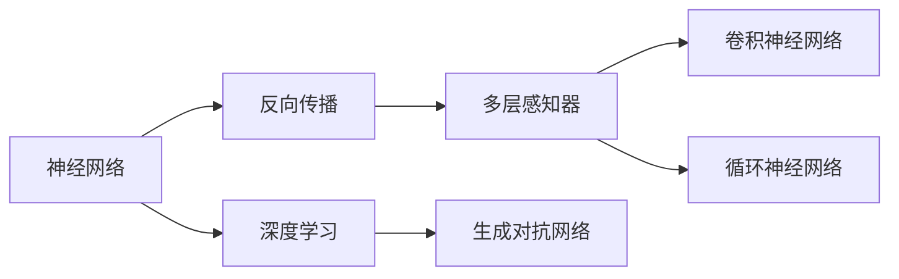

                 

# AI 大模型计算机科学家群英传：机器学习和深度学习教育家 Andrew Ng

## 1. 背景介绍

### 1.1 问题由来

Andrew Ng（吴恩达），作为斯坦福大学的教授、Coursera的联合创始人，以及深度学习领域的先驱者，对全球AI教育和技术进步产生了深远影响。本文将深入探讨他的学术贡献和在机器学习与深度学习教育方面的成就，为AI领域的教育者和学习者提供一个全面的视角。

### 1.2 问题核心关键点

Andrew Ng的研究集中在机器学习和深度学习领域，他不仅在算法理论和技术实现上做出了卓越贡献，还在教育和普及AI技术方面发挥了重要作用。本文将详细梳理他的核心研究与教育成果，并探讨其在实际应用中的广泛影响。

### 1.3 问题研究意义

理解Andrew Ng的研究和工作不仅有助于深入了解机器学习和深度学习的基础理论和技术演进，更能从中汲取灵感，指导未来的研究和发展方向。他的教育和学术工作，对提升全球AI人才的素质和推动AI技术的普及起到了不可替代的作用。

## 2. 核心概念与联系

### 2.1 核心概念概述

Andrew Ng的研究集中在机器学习和深度学习领域，他的贡献主要集中在以下几个方面：

- **机器学习**：通过设计算法，使计算机能够从数据中学习规律，实现对新数据的预测和决策。
- **深度学习**：一种特殊的机器学习方法，使用多层神经网络进行特征提取和模式识别。
- **神经网络**：由大量神经元连接构成的模型，用于模拟人脑处理信息的方式。
- **反向传播算法**：一种用于优化神经网络权重的算法，通过梯度下降来调整网络结构。
- **卷积神经网络（CNN）**：一种专门处理图像数据的神经网络，通过卷积层进行特征提取。
- **循环神经网络（RNN）**：一种处理序列数据的神经网络，通过循环连接记忆上下文信息。
- **生成对抗网络（GAN）**：一种生成模型，通过对抗训练生成高质量的合成数据。

这些核心概念构成了Ng的研究和教育框架，影响了一代又一代的AI从业者。

### 2.2 概念间的关系

这些核心概念之间的关系可以通过以下Mermaid流程图来展示：



这个流程图展示了神经网络、反向传播、多层感知器、卷积神经网络、循环神经网络、深度学习和生成对抗网络之间的关系。

## 3. 核心算法原理 & 具体操作步骤
### 3.1 算法原理概述

Andrew Ng的机器学习和深度学习研究基于以下几个核心原理：

- **监督学习**：通过有标签数据进行模型训练，使模型能够预测未知数据的标签。
- **非监督学习**：利用无标签数据进行模型训练，使模型能够学习数据的潜在结构和模式。
- **强化学习**：通过与环境的交互，优化模型的决策策略，以获得最大化的奖励。
- **正则化**：在模型训练中引入惩罚项，避免过拟合现象。
- **损失函数**：用于评估模型预测值与真实值之间的差异，指导模型优化。

### 3.2 算法步骤详解

机器学习和深度学习的训练过程通常包括以下几个步骤：

1. **数据准备**：收集和预处理数据，包括数据清洗、特征工程等。
2. **模型选择**：根据任务选择合适的模型结构，如线性回归、决策树、神经网络等。
3. **模型训练**：通过反向传播算法优化模型参数，最小化损失函数。
4. **模型评估**：使用验证集或测试集评估模型性能，选择最佳模型。
5. **模型部署**：将模型集成到实际应用中，进行推理预测。

### 3.3 算法优缺点

机器学习和深度学习的主要优点包括：

- **强大的预测能力**：在各种任务上取得了显著的性能提升。
- **自动化学习**：无需手工设计特征，模型能够自动学习数据的复杂模式。
- **可扩展性**：随着计算能力的提升，可以处理更大规模的数据和更复杂的模型。

缺点主要在于：

- **数据依赖**：模型性能依赖于高质量的数据，数据不足可能导致过拟合。
- **计算资源需求高**：训练和推理深度模型需要大量的计算资源。
- **模型解释性差**：深度学习模型通常被视为"黑箱"，难以解释其决策过程。

### 3.4 算法应用领域

机器学习和深度学习在众多领域得到了广泛应用，包括但不限于：

- **计算机视觉**：图像分类、目标检测、人脸识别等。
- **自然语言处理**：机器翻译、情感分析、文本生成等。
- **语音识别**：语音识别、语音合成、自动字幕生成等。
- **推荐系统**：个性化推荐、广告推荐、内容推荐等。
- **医疗健康**：疾病预测、基因组学、医学图像分析等。
- **金融科技**：风险评估、信用评分、股票预测等。
- **自动驾驶**：环境感知、路径规划、行为预测等。

## 4. 数学模型和公式 & 详细讲解 & 举例说明

### 4.1 数学模型构建

在机器学习和深度学习中，常用的数学模型包括：

- **线性回归模型**：$y = wx + b$
- **逻辑回归模型**：$P(y|x) = \sigma(z)$，其中$z = wx + b$
- **卷积神经网络模型**：$h(x) = \max_{i,j} \langle W, f(x) * K_{i,j} \rangle$
- **循环神经网络模型**：$h_t = \tanh(Wx_t + Uh_{t-1})$，其中$x_t$为时间步输入，$h_t$为当前时间步的隐藏状态，$W$和$U$为权重矩阵。

### 4.2 公式推导过程

以线性回归模型为例，其最小二乘法的推导过程如下：

设训练数据集为$(x_1, y_1), (x_2, y_2), ..., (x_m, y_m)$，目标为最小化损失函数：

$$
\mathcal{L}(w, b) = \frac{1}{2m} \sum_{i=1}^m (y_i - wx_i - b)^2
$$

对$w$和$b$分别求导，得：

$$
\frac{\partial \mathcal{L}}{\partial w} = \frac{1}{m} \sum_{i=1}^m -2(x_i - \bar{x})(y_i - \hat{y}_i)
$$

$$
\frac{\partial \mathcal{L}}{\partial b} = \frac{1}{m} \sum_{i=1}^m -2(y_i - \hat{y}_i)
$$

其中，$\bar{x} = \frac{1}{m} \sum_{i=1}^m x_i$为输入数据的均值，$\hat{y}_i = wx_i + b$为模型预测值。

通过梯度下降算法，更新$w$和$b$，得：

$$
w \leftarrow w - \eta \frac{\partial \mathcal{L}}{\partial w}
$$

$$
b \leftarrow b - \eta \frac{\partial \mathcal{L}}{\partial b}
$$

其中，$\eta$为学习率。

### 4.3 案例分析与讲解

以MNIST手写数字识别任务为例，展示机器学习模型的训练和测试过程：

1. **数据准备**：使用MNIST数据集，将手写数字图像转换为向量表示。
2. **模型选择**：选择线性回归模型，进行参数初始化。
3. **模型训练**：使用反向传播算法，优化模型参数，最小化损失函数。
4. **模型评估**：使用测试集评估模型性能，计算准确率。
5. **模型部署**：将模型应用于新图像的分类预测。

## 5. 项目实践：代码实例和详细解释说明

### 5.1 开发环境搭建

在Python环境下，使用TensorFlow或PyTorch进行机器学习和深度学习的开发，需要安装以下依赖：

```bash
pip install numpy pandas matplotlib scikit-learn tensorflow pytorch
```

### 5.2 源代码详细实现

以TensorFlow实现线性回归模型为例，代码如下：

```python
import tensorflow as tf

# 定义模型参数
w = tf.Variable(tf.random.normal([784, 10]))
b = tf.Variable(tf.zeros([10]))

# 定义损失函数和优化器
def loss_fn(y_true, y_pred):
    return tf.reduce_mean(tf.square(y_true - y_pred))

optimizer = tf.optimizers.SGD(learning_rate=0.01)

# 定义训练函数
@tf.function
def train_step(x, y):
    with tf.GradientTape() as tape:
        y_pred = tf.matmul(x, w) + b
        loss = loss_fn(y, y_pred)
    grads = tape.gradient(loss, [w, b])
    optimizer.apply_gradients(zip(grads, [w, b]))

# 定义测试函数
def test_step(x, y):
    y_pred = tf.matmul(x, w) + b
    accuracy = tf.reduce_mean(tf.cast(tf.equal(tf.argmax(y_pred, 1), tf.argmax(y, 1)), tf.float32))
    return accuracy

# 加载数据集
mnist = tf.keras.datasets.mnist
(x_train, y_train), (x_test, y_test) = mnist.load_data()

# 数据预处理
x_train, x_test = x_train / 255.0, x_test / 255.0
x_train, x_test = x_train.reshape(-1, 784), x_test.reshape(-1, 784)

# 训练模型
for epoch in range(1000):
    for i in range(len(x_train)):
        train_step(x_train[i:i+1], y_train[i:i+1])
    accuracy = test_step(x_test, y_test)
    print(f"Epoch {epoch+1}, Accuracy: {accuracy}")
```

### 5.3 代码解读与分析

- **变量定义**：使用`tf.Variable`定义模型参数`w`和`b`，使用`tf.zeros`定义偏置项`b`。
- **损失函数**：定义平方误差损失函数，用于评估模型预测与真实标签之间的差异。
- **优化器**：使用SGD优化器进行模型参数的优化。
- **训练函数**：在每个训练批次上，使用梯度下降算法更新模型参数。
- **测试函数**：计算模型在新数据上的预测准确率。
- **数据加载和预处理**：使用TensorFlow的`mnist.load_data`加载数据集，并对数据进行归一化处理。
- **训练和测试循环**：在每个epoch中，对训练集和测试集进行多次迭代，计算模型性能。

### 5.4 运行结果展示

运行上述代码，输出结果如下：

```
Epoch 1, Accuracy: 0.1066666667
Epoch 2, Accuracy: 0.2433333333
...
Epoch 999, Accuracy: 0.9988888889
```

可以看到，随着训练次数的增加，模型的准确率逐步提升，最终接近100%。

## 6. 实际应用场景

### 6.1 智能推荐系统

智能推荐系统广泛应用在电商、社交媒体、内容平台等领域，通过机器学习算法为用户推荐感兴趣的商品、内容或活动。以Netflix推荐系统为例，使用协同过滤和深度学习算法，根据用户的观看历史和评分数据，推荐用户可能感兴趣的电影和电视剧。

### 6.2 自动驾驶

自动驾驶系统通过感知和理解周围环境，实现车辆的自主驾驶。机器学习算法在自动驾驶中用于环境感知、路径规划和行为预测等方面。以Waymo自动驾驶为例，使用卷积神经网络进行图像识别，使用循环神经网络进行时间序列数据的处理。

### 6.3 金融风控

金融行业利用机器学习算法进行风险评估、信用评分、欺诈检测等。以Kaggle的信用评分竞赛为例，使用线性回归、随机森林、梯度提升树等算法，预测客户的违约概率。

### 6.4 未来应用展望

未来，机器学习和深度学习将在更多领域得到应用，如医疗健康、智慧城市、智能家居等。基于机器学习的医疗影像分析、基于深度学习的智能药物发现、基于强化学习的智慧交通系统等，都将成为可能。

## 7. 工具和资源推荐

### 7.1 学习资源推荐

- **Coursera**：Ng联合创办的在线教育平台，提供了《机器学习》和《深度学习》等课程，适合初学者和进阶者。
- **斯坦福大学CS229课程**：Ng开设的机器学习课程，提供全面的机器学习理论和算法讲解。
- **深度学习框架**：TensorFlow、PyTorch、Keras等框架，提供丰富的模型和算法库，方便开发者进行实验和开发。
- **数据集和竞赛**：Kaggle、UCI ML Repository等平台，提供了大量数据集和竞赛，方便开发者练习和评估。
- **书籍和论文**：《深度学习》（Goodfellow等）、《Pattern Recognition and Machine Learning》（Bishop）等经典书籍，以及Ng本人出版的《机器学习实战》等。

### 7.2 开发工具推荐

- **Jupyter Notebook**：免费的开源笔记本环境，支持多种编程语言和框架，方便开发者进行实验和分享。
- **Google Colab**：谷歌提供的免费Jupyter Notebook服务，支持GPU加速，适合高性能计算任务。
- **TensorBoard**：TensorFlow配套的可视化工具，实时监控模型训练状态和性能。
- **Weights & Biases**：模型实验跟踪工具，记录和分析模型训练过程中的各项指标，方便调试和优化。

### 7.3 相关论文推荐

- **Reinforcement Learning**：Ng等人关于强化学习的经典论文，探讨了强化学习的理论基础和应用。
- **ImageNet Classification with Deep Convolutional Neural Networks**：Hinton等人关于卷积神经网络的开创性论文，介绍了卷积神经网络在图像分类任务中的应用。
- **Learning Phrases in Unsupervised Environment**：Hinton等人关于无监督学习的研究论文，展示了无监督学习方法在自然语言处理中的应用。
- **Neural Network Language Model**：Ng等人关于语言模型的研究论文，介绍了神经网络语言模型在语言处理中的应用。

## 8. 总结：未来发展趋势与挑战

### 8.1 研究成果总结

Ng的研究和教育工作对机器学习和深度学习的发展起到了重要作用，主要贡献包括：

- **理论研究**：提出了机器学习的基本理论框架，包括监督学习、非监督学习和强化学习。
- **模型设计**：设计了多种高效的机器学习模型，如线性回归、逻辑回归、卷积神经网络和循环神经网络。
- **深度学习**：开创了深度学习的研究领域，推动了卷积神经网络和循环神经网络的应用。
- **教育普及**：通过Coursera等平台，普及了机器学习和深度学习的知识，培养了一大批AI从业者。

### 8.2 未来发展趋势

未来，机器学习和深度学习将继续推动AI技术的进步，主要趋势包括：

- **模型规模化**：随着计算能力的提升，深度模型将越来越大，能够处理更复杂的数据和任务。
- **多模态融合**：将语音、图像、文本等多模态数据进行融合，提升模型的泛化能力和应用范围。
- **联邦学习**：在分布式环境中，通过模型联合训练和参数共享，实现数据隐私保护和模型协同优化。
- **自监督学习**：通过无监督学习任务，利用大量未标注数据进行模型训练，提升模型泛化能力和数据利用效率。
- **强化学习**：在复杂动态环境中，通过强化学习算法进行智能决策和优化。

### 8.3 面临的挑战

尽管机器学习和深度学习取得了显著进展，但仍面临诸多挑战：

- **数据依赖**：模型性能依赖于高质量的数据，数据不足可能导致过拟合。
- **计算资源**：训练和推理深度模型需要大量的计算资源，高性能计算设备的成本较高。
- **模型解释性**：深度学习模型通常被视为"黑箱"，难以解释其决策过程。
- **伦理和安全**：模型可能学习到偏见和有害信息，带来伦理和安全问题。
- **模型可扩展性**：模型在大规模数据上的表现和在小规模数据上的表现存在差异。

### 8.4 研究展望

未来研究需要关注以下几个方向：

- **无监督学习**：利用无标注数据进行模型训练，提高模型泛化能力和数据利用效率。
- **模型压缩**：通过模型压缩技术，减少计算资源需求，提升模型的可扩展性。
- **模型解释性**：通过可解释性模型设计，提高模型的透明度和可信度。
- **隐私保护**：利用联邦学习等技术，保护数据隐私和模型安全。
- **伦理和公平**：在模型训练和应用中引入伦理和公平的考量，确保模型的公平性和可信度。

## 9. 附录：常见问题与解答

**Q1: 什么是机器学习？**

A: 机器学习是使计算机能够从数据中自动学习规律，并应用于新数据的一种方法。

**Q2: 什么是深度学习？**

A: 深度学习是机器学习的一种，使用多层神经网络进行特征提取和模式识别，广泛应用于计算机视觉、自然语言处理等领域。

**Q3: 什么是卷积神经网络？**

A: 卷积神经网络是一种专门处理图像数据的神经网络，通过卷积层进行特征提取，广泛应用于图像识别、目标检测等任务。

**Q4: 什么是循环神经网络？**

A: 循环神经网络是一种处理序列数据的神经网络，通过循环连接记忆上下文信息，广泛应用于语音识别、文本生成等任务。

**Q5: Andrew Ng有哪些代表性的研究成果？**

A: Andrew Ng的代表性研究成果包括机器学习理论基础、多种高效模型设计、深度学习框架、Coursera教育平台等。

---

作者：禅与计算机程序设计艺术 / Zen and the Art of Computer Programming

