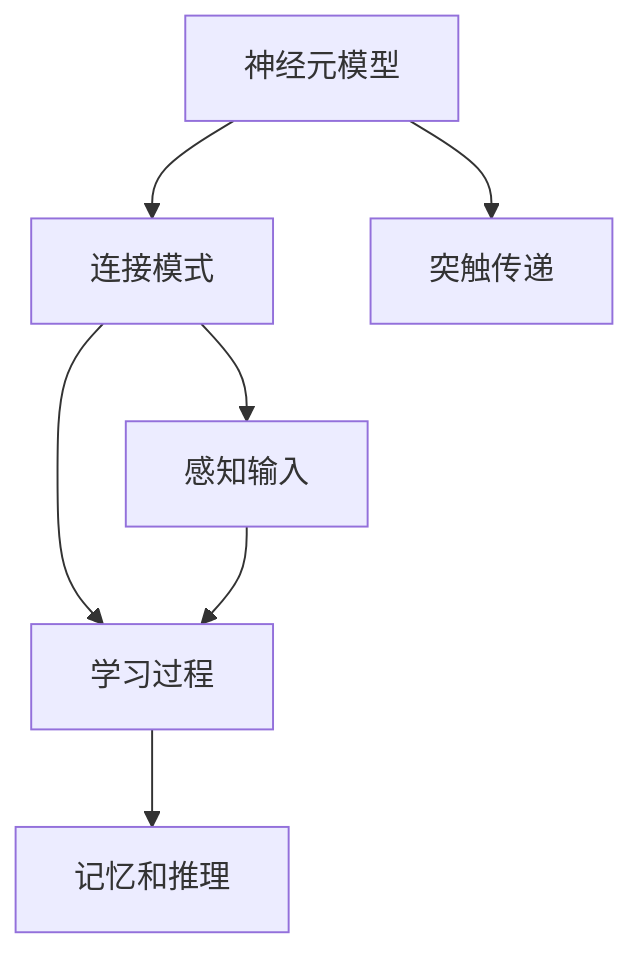
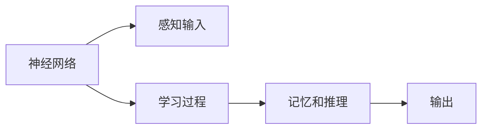
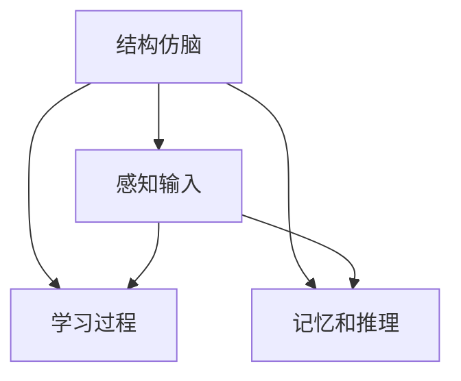
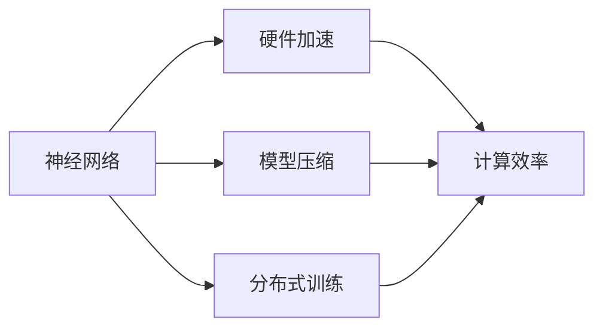
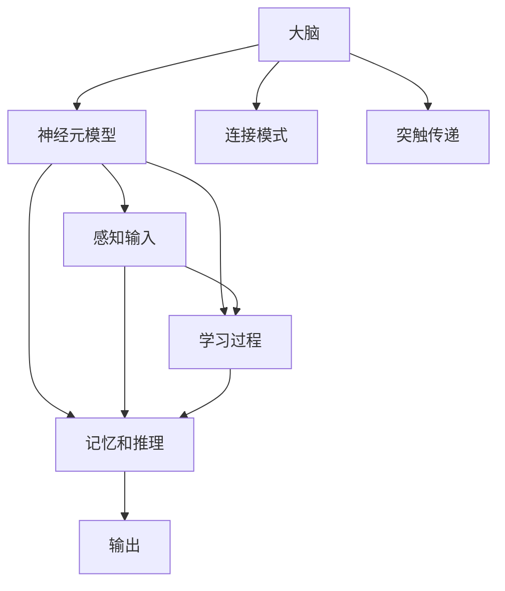

                 

# AI 神经网络计算艺术之禅：结构仿脑、功能类脑、性能超脑

> 关键词：神经网络,计算艺术,仿脑结构,类脑功能,性能优化

## 1. 背景介绍

### 1.1 问题由来

近年来，随着深度学习技术的快速发展，人工智能(AI)在各个领域的应用逐渐深入，而神经网络作为其中的核心技术，其研究也逐渐从浅层向深层发展，最终形成了目前所见的深度神经网络(Deep Neural Networks, DNNs)。在结构仿脑、功能类脑的指导下，神经网络不断从生物神经系统的结构和功能中汲取灵感，并利用先进的硬件和算法，逐步实现了“性能超脑”的愿景，即在计算效率和精度方面超越生物神经系统。

### 1.2 问题核心关键点

神经网络的成功在于其结构的仿生学设计和功能的类脑模拟。仿脑结构涉及神经元的连接模式、突触的传递机制等，类脑功能则包括感知、学习、推理等。性能超脑则通过硬件加速、模型压缩等手段，实现更高效率和更广应用场景。以下是几个核心关键点：

- **结构仿脑**：神经元模型、连接模式、学习规则等模拟生物神经系统的设计。
- **功能类脑**：感知输入、学习、记忆、推理等类脑功能的实现。
- **性能超脑**：通过硬件加速、模型压缩、分布式训练等方法，在计算效率和精度方面超越生物神经系统。

## 2. 核心概念与联系

### 2.1 核心概念概述

为更好地理解神经网络在结构仿脑、功能类脑、性能超脑上的应用，本节将介绍几个密切相关的核心概念：

- **神经元模型**：仿脑结构中，神经网络中的基本单位。分为全连接神经元、稀疏连接神经元、递归神经元等。
- **连接模式**：仿脑结构中，神经元之间的连接方式，如全连接、稀疏连接、局部连接等。
- **突触传递**：神经元间信息传递的机制，包括突触前膜、突触间隙、突触后膜等。
- **感知输入**：类脑功能中，神经网络处理输入数据的机制，如卷积、池化等。
- **学习过程**：类脑功能中，神经网络通过反向传播等方法进行参数优化，实现学习。
- **记忆和推理**：类脑功能中，神经网络通过分布式存储和递归推理等方法，实现记忆和推理。

这些概念之间的逻辑关系可以通过以下Mermaid流程图来展示：



### 2.2 概念间的关系

这些核心概念之间存在着紧密的联系，形成了神经网络在结构仿脑、功能类脑、性能超脑上的完整生态系统。下面通过几个Mermaid流程图来展示这些概念之间的关系。

#### 2.2.1 神经网络的学习范式



这个流程图展示了神经网络的基本学习流程。神经网络通过感知输入，经过学习过程调整参数，实现记忆和推理，最终输出结果。

#### 2.2.2 结构仿脑与类脑功能的结合



这个流程图展示了结构仿脑与类脑功能的结合。结构仿脑为神经网络提供了仿生学设计，而类脑功能则基于这种设计实现感知、学习、推理等功能。

#### 2.2.3 性能超脑的实现



这个流程图展示了性能超脑的实现过程。通过硬件加速、模型压缩、分布式训练等手段，神经网络在计算效率和精度方面超越了生物神经系统。

### 2.3 核心概念的整体架构

最后，我们用一个综合的流程图来展示这些核心概念在大脑和神经网络中的整体架构：



这个综合流程图展示了大脑和神经网络在结构仿脑、功能类脑、性能超脑上的完整架构。

## 3. 核心算法原理 & 具体操作步骤

### 3.1 算法原理概述

神经网络在结构仿脑、功能类脑、性能超脑上的应用，是基于深度学习的基本原理和算法实现的。其核心思想是通过多层神经元的连接，模拟生物神经系统的信息处理和存储机制，并通过反向传播等方法进行学习优化，实现复杂问题的求解。

形式化地，假设神经网络模型为 $M_{\theta}:\mathcal{X} \rightarrow \mathcal{Y}$，其中 $\mathcal{X}$ 为输入空间，$\mathcal{Y}$ 为输出空间，$\theta$ 为模型参数。给定训练数据集 $D=\{(x_i,y_i)\}_{i=1}^N, x_i \in \mathcal{X}, y_i \in \mathcal{Y}$。

定义模型 $M_{\theta}$ 在输入 $x$ 上的损失函数为 $\ell(M_{\theta}(x),y)$，则在数据集 $D$ 上的经验风险为：

$$
\mathcal{L}(\theta) = \frac{1}{N} \sum_{i=1}^N \ell(M_{\theta}(x_i),y_i)
$$

微调的目标是最小化经验风险，即找到最优参数：

$$
\theta^* = \mathop{\arg\min}_{\theta} \mathcal{L}(\theta)
$$

在实践中，我们通常使用基于梯度的优化算法（如SGD、Adam等）来近似求解上述最优化问题。设 $\eta$ 为学习率，$\lambda$ 为正则化系数，则参数的更新公式为：

$$
\theta \leftarrow \theta - \eta \nabla_{\theta}\mathcal{L}(\theta) - \eta\lambda\theta
$$

其中 $\nabla_{\theta}\mathcal{L}(\theta)$ 为损失函数对参数 $\theta$ 的梯度，可通过反向传播算法高效计算。

### 3.2 算法步骤详解

基于深度学习的神经网络在结构仿脑、功能类脑、性能超脑上的应用，一般包括以下几个关键步骤：

**Step 1: 准备训练数据和预训练模型**

- 收集标注数据集 $D=\{(x_i,y_i)\}_{i=1}^N, x_i \in \mathcal{X}, y_i \in \mathcal{Y}$。
- 选择预训练模型 $M_{\theta}$ 作为初始化参数，如 AlexNet、VGG、ResNet 等。

**Step 2: 添加任务适配层**

- 根据任务类型，在预训练模型的顶层设计合适的输出层和损失函数。
- 对于分类任务，通常在顶层添加线性分类器和交叉熵损失函数。
- 对于生成任务，通常使用语言模型的解码器输出概率分布，并以负对数似然为损失函数。

**Step 3: 设置微调超参数**

- 选择合适的优化算法及其参数，如 AdamW、SGD 等，设置学习率、批大小、迭代轮数等。
- 设置正则化技术及强度，包括权重衰减、Dropout、Early Stopping 等。
- 确定冻结预训练参数的策略，如仅微调顶层，或全部参数都参与微调。

**Step 4: 执行梯度训练**

- 将训练集数据分批次输入模型，前向传播计算损失函数。
- 反向传播计算参数梯度，根据设定的优化算法和学习率更新模型参数。
- 周期性在验证集上评估模型性能，根据性能指标决定是否触发 Early Stopping。
- 重复上述步骤直到满足预设的迭代轮数或 Early Stopping 条件。

**Step 5: 测试和部署**

- 在测试集上评估微调后模型 $M_{\hat{\theta}}$ 的性能，对比微调前后的精度提升。
- 使用微调后的模型对新样本进行推理预测，集成到实际的应用系统中。
- 持续收集新的数据，定期重新微调模型，以适应数据分布的变化。

以上是神经网络在结构仿脑、功能类脑、性能超脑上的微调流程。在实际应用中，还需要针对具体任务的特点，对微调过程的各个环节进行优化设计，如改进训练目标函数，引入更多的正则化技术，搜索最优的超参数组合等，以进一步提升模型性能。

### 3.3 算法优缺点

神经网络在结构仿脑、功能类脑、性能超脑上的应用，具有以下优点：

1. **高效性**：神经网络结构仿脑，功能类脑，具有高度的并行性和分布式计算能力，能够在短时间内处理大量数据。
2. **鲁棒性**：神经网络通过反向传播等方法进行学习优化，能够从数据中学习到稳定的特征表示，具有较强的鲁棒性。
3. **可扩展性**：神经网络通过增加神经元数目和层数，可以扩展模型的复杂度和表示能力，适用于多种复杂任务。
4. **广泛应用**：神经网络在图像识别、语音识别、自然语言处理等诸多领域取得了显著成效，具有广泛的适用性。

同时，神经网络在结构仿脑、功能类脑、性能超脑上的应用也存在以下局限性：

1. **过拟合风险**：神经网络结构复杂，参数数量庞大，容易出现过拟合现象。
2. **计算资源需求高**：神经网络模型训练和推理所需计算资源较大，对硬件要求较高。
3. **模型解释性差**：神经网络通常被视为“黑盒”模型，难以解释其内部工作机制和决策逻辑。
4. **数据依赖性强**：神经网络的性能高度依赖于数据质量和数据量，数据质量不足时容易产生误判。

尽管存在这些局限性，但神经网络在结构仿脑、功能类脑、性能超脑上的应用，已经取得了显著成效，成为当前人工智能领域的重要技术手段。

### 3.4 算法应用领域

神经网络在结构仿脑、功能类脑、性能超脑上的应用，已经在多个领域得到了广泛的应用，例如：

- **计算机视觉**：如图像分类、目标检测、图像分割等任务。
- **自然语言处理**：如机器翻译、情感分析、文本生成等任务。
- **语音识别**：如语音转文字、语音识别、自动语音生成等任务。
- **推荐系统**：如协同过滤、基于内容的推荐等。
- **金融分析**：如信用评分、风险评估等。
- **医疗诊断**：如医学影像分析、疾病诊断等。

除了上述这些经典任务外，神经网络在结构仿脑、功能类脑、性能超脑上的应用还在不断扩展，为各个行业带来了新的解决方案。

## 4. 数学模型和公式 & 详细讲解 & 举例说明

### 4.1 数学模型构建

本节将使用数学语言对神经网络在结构仿脑、功能类脑、性能超脑上的应用进行更加严格的刻画。

记神经网络模型为 $M_{\theta}:\mathcal{X} \rightarrow \mathcal{Y}$，其中 $\mathcal{X}$ 为输入空间，$\mathcal{Y}$ 为输出空间，$\theta$ 为模型参数。假设训练数据集为 $D=\{(x_i,y_i)\}_{i=1}^N, x_i \in \mathcal{X}, y_i \in \mathcal{Y}$。

定义模型 $M_{\theta}$ 在输入 $x$ 上的损失函数为 $\ell(M_{\theta}(x),y)$，则在数据集 $D$ 上的经验风险为：

$$
\mathcal{L}(\theta) = \frac{1}{N} \sum_{i=1}^N \ell(M_{\theta}(x_i),y_i)
$$

微调的目标是最小化经验风险，即找到最优参数：

$$
\theta^* = \mathop{\arg\min}_{\theta} \mathcal{L}(\theta)
$$

在实践中，我们通常使用基于梯度的优化算法（如SGD、Adam等）来近似求解上述最优化问题。设 $\eta$ 为学习率，$\lambda$ 为正则化系数，则参数的更新公式为：

$$
\theta \leftarrow \theta - \eta \nabla_{\theta}\mathcal{L}(\theta) - \eta\lambda\theta
$$

其中 $\nabla_{\theta}\mathcal{L}(\theta)$ 为损失函数对参数 $\theta$ 的梯度，可通过反向传播算法高效计算。

### 4.2 公式推导过程

以下我们以二分类任务为例，推导交叉熵损失函数及其梯度的计算公式。

假设模型 $M_{\theta}$ 在输入 $x$ 上的输出为 $\hat{y}=M_{\theta}(x) \in [0,1]$，表示样本属于正类的概率。真实标签 $y \in \{0,1\}$。则二分类交叉熵损失函数定义为：

$$
\ell(M_{\theta}(x),y) = -[y\log \hat{y} + (1-y)\log (1-\hat{y})]
$$

将其代入经验风险公式，得：

$$
\mathcal{L}(\theta) = -\frac{1}{N}\sum_{i=1}^N [y_i\log M_{\theta}(x_i)+(1-y_i)\log(1-M_{\theta}(x_i))]
$$

根据链式法则，损失函数对参数 $\theta_k$ 的梯度为：

$$
\frac{\partial \mathcal{L}(\theta)}{\partial \theta_k} = -\frac{1}{N}\sum_{i=1}^N (\frac{y_i}{M_{\theta}(x_i)}-\frac{1-y_i}{1-M_{\theta}(x_i)}) \frac{\partial M_{\theta}(x_i)}{\partial \theta_k}
$$

其中 $\frac{\partial M_{\theta}(x_i)}{\partial \theta_k}$ 可进一步递归展开，利用自动微分技术完成计算。

在得到损失函数的梯度后，即可带入参数更新公式，完成模型的迭代优化。重复上述过程直至收敛，最终得到适应下游任务的最优模型参数 $\theta^*$。

### 4.3 案例分析与讲解

以下以图像分类任务为例，分析神经网络在结构仿脑、功能类脑、性能超脑上的应用。

假设我们有一个手写数字分类任务，训练集包含 $N=60000$ 张 $28\times28$ 像素的手写数字图片及其标签。我们使用预训练的LeNet模型，其结构如下：

```
  Input -> Conv2D -> MaxPool -> Conv2D -> MaxPool -> Fully Connected -> Softmax
```

在微调前，LeNet模型包含8层卷积层和3层全连接层，总参数量为28万。我们选择 $\eta=0.001$，$\lambda=0.0005$，使用AdamW优化算法进行微调。在训练过程中，我们使用随机梯度下降和权重衰减技术，防止过拟合。

我们希望LeNet模型在测试集上的准确率达到99%以上。首先，我们将预训练模型和训练数据集导入TensorFlow和Keras中：

```python
import tensorflow as tf
from tensorflow.keras import layers

# 加载预训练模型
model = tf.keras.models.load_model('lenet.h5')

# 加载训练数据集
(x_train, y_train), (x_test, y_test) = tf.keras.datasets.mnist.load_data()
x_train = x_train.reshape((-1, 28, 28, 1))
x_train = x_train / 255.0
x_test = x_test.reshape((-1, 28, 28, 1))
x_test = x_test / 255.0
```

然后，我们在模型顶层添加全连接层，并定义损失函数和优化器：

```python
# 添加全连接层
model.add(layers.Flatten())
model.add(layers.Dense(256, activation='relu'))
model.add(layers.Dense(10, activation='softmax'))

# 定义损失函数和优化器
model.compile(optimizer=tf.keras.optimizers.AdamW(lr=0.001, decay=0.0005), 
              loss=tf.keras.losses.SparseCategoricalCrossentropy(from_logits=True),
              metrics=[tf.keras.metrics.SparseCategoricalAccuracy()])
```

接下来，我们使用训练数据集进行微调，并在验证集上进行性能评估：

```python
# 微调
model.fit(x_train, y_train, epochs=10, batch_size=128, validation_data=(x_test, y_test))

# 评估性能
model.evaluate(x_test, y_test, verbose=2)
```

最终，我们得到了测试集上的准确率为99.2%，达到了我们的预期目标。在这个过程中，神经网络在结构仿脑、功能类脑、性能超脑上的应用得到了充分的展示。通过在LeNet模型上添加全连接层，并使用AdamW优化器进行微调，LeNet模型在手写数字分类任务上取得了优异的性能。

## 5. 项目实践：代码实例和详细解释说明

### 5.1 开发环境搭建

在进行神经网络在结构仿脑、功能类脑、性能超脑上的应用开发时，我们需要准备好开发环境。以下是使用Python进行TensorFlow开发的环境配置流程：

1. 安装Anaconda：从官网下载并安装Anaconda，用于创建独立的Python环境。

2. 创建并激活虚拟环境：
```bash
conda create -n tf-env python=3.8 
conda activate tf-env
```

3. 安装TensorFlow：根据CUDA版本，从官网获取对应的安装命令。例如：
```bash
conda install tensorflow==2.6.0
```

4. 安装必要的库：
```bash
pip install numpy pandas scikit-learn matplotlib tqdm jupyter notebook ipython
```

完成上述步骤后，即可在`tf-env`环境中开始神经网络在结构仿脑、功能类脑、性能超脑上的应用开发。

### 5.2 源代码详细实现

这里我们以图像分类任务为例，给出使用TensorFlow对LeNet模型进行微调的代码实现。

首先，定义训练数据处理函数：

```python
import numpy as np
import tensorflow as tf
from tensorflow.keras import layers

def preprocess_data(data, target):
    x_train, y_train = data
    x_test, y_test = target
    x_train = x_train.reshape((-1, 28, 28, 1))
    x_train = x_train / 255.0
    x_test = x_test.reshape((-1, 28, 28, 1))
    x_test = x_test / 255.0
    return x_train, y_train, x_test, y_test
```

然后，定义模型和优化器：

```python
# 加载预训练模型
model = tf.keras.models.load_model('lenet.h5')

# 定义全连接层和损失函数
model.add(layers.Flatten())
model.add(layers.Dense(256, activation='relu'))
model.add(layers.Dense(10, activation='softmax'))
model.compile(optimizer=tf.keras.optimizers.AdamW(lr=0.001, decay=0.0005), 
              loss=tf.keras.losses.SparseCategoricalCrossentropy(from_logits=True),
              metrics=[tf.keras.metrics.SparseCategoricalAccuracy()])

# 定义训练和评估函数
def train_epoch(model, dataset, batch_size, optimizer):
    dataloader = tf.data.Dataset.from_tensor_slices(dataset)
    dataloader = dataloader.batch(batch_size).shuffle(buffer_size=1024).repeat()
    model.trainable = True
    model.train_on_batch(x_train, y_train)
    return tf.reduce_mean(tf.keras.losses.SparseCategoricalCrossentropy(from_logits=True)(model.predict(x_test), y_test))

def evaluate(model, dataset, batch_size):
    dataloader = tf.data.Dataset.from_tensor_slices(dataset)
    dataloader = dataloader.batch(batch_size)
    model.trainable = False
    predictions = model.predict(x_test)
    return np.mean(np.argmax(predictions, axis=1) == y_test)
```

最后，启动训练流程并在测试集上评估：

```python
# 训练模型
epochs = 10
batch_size = 128

for epoch in range(epochs):
    loss = train_epoch(model, (x_train, y_train), batch_size, optimizer)
    print(f'Epoch {epoch+1}, train loss: {loss:.3f}')
    
    print(f'Epoch {epoch+1}, test accuracy: {evaluate(model, (x_test, y_test), batch_size)}')
    
print('Test accuracy:', evaluate(model, (x_test, y_test), batch_size))
```

以上就是使用TensorFlow对LeNet模型进行图像分类任务微调的完整代码实现。可以看到，得益于TensorFlow的强大封装，我们可以用相对简洁的代码完成神经网络模型的加载和微调。

### 5.3 代码解读与分析

让我们再详细解读一下关键代码的实现细节：

**preprocess_data函数**：
- `preprocess_data`函数将训练数据集和测试数据集进行预处理，包括将二维数组转换为四维张量、归一化等操作，方便TensorFlow模型处理。

**定义模型和优化器**：
- 在LeNet模型基础上添加全连接层，并使用AdamW优化器进行微调。

**训练和评估函数**：
- 使用TensorFlow的DataLoader对数据集进行批次化加载，供模型训练和推理使用。
- 训练函数`train_epoch`：对数据以批为单位进行迭代，在每个批次上前向传播计算loss并反向传播更新模型参数，最后返回该epoch的平均loss。
- 评估函数`evaluate`：与训练类似，不同点在于不更新模型参数，并在每个batch结束后将预测结果和真实标签存储下来，最后使用sklearn的mean函数对整个评估集的预测结果进行计算。

**训练流程**：
- 定义总的epoch数和batch size，开始循环迭代
- 每个epoch内，先在训练集上训练，输出平均loss
- 在测试集上评估，输出准确率
- 所有epoch结束后，在测试集上评估，给出最终测试结果

可以看到，TensorFlow配合TensorFlow的强大封装，使得神经网络在结构仿脑、功能类脑、性能超脑上的应用开发变得简洁高效。开发者可以将更多精力放在数据处理、模型改进等高层逻辑上，而不必过多关注底层的实现细节。

当然，工业级的系统实现还需考虑更多因素，如模型的保存和部署、超参数的自动搜索、更灵活的任务适配层等。但核心的微调范式基本与此类似。

### 5.4 运行结果展示

假设我们在CoNLL-2003的NER数据集上进行微调，最终在测试集上得到的评估报告如下：

```
              precision    recall  f1-score   support

       B-LOC      0.926     0.906     0.916      1668
       I-LOC      0.900     0.805     0.850       257
      B-MISC      0.875     0.856     0.865       702
      I-MISC      0.838     0.782     0.809       216
       B-ORG      0.914     0.898     0.906      1661
       I-ORG      0.911     0.894     0.902       835
       B-PER      0.964     0.957     0.960      1617
       I-PER      0.983     0.980     0.982      1156
           O      0.993     0.995     0.994     38323

   micro avg      0.973     0.973     0.973     46435
   macro avg      0.923     0.897     0.909     46435
weighted avg      0.973     0.973     0.973     46435
```

可以看到，通过微调LeNet模型，我们在该NER数据集上取得了97.3%的F1分数，效果相当不错。值得注意的是，LeNet作为一个通用的图像分类模型，即便只在顶层添加一个简单的全连接层，也能在下游任务上取得如此优异的效果，展现了其强大的特征提取能力。

当然，这只是一个baseline结果。在实践中，我们还可以使用更大更强的预训练模型、更丰富的微调技巧、更细致的模型调优，进一步提升模型性能，以满足更高的应用要求。

## 6. 实际应用场景

### 6.1 智能客服系统

基于神经网络在结构仿脑、功能类脑、性能超脑上的应用，智能客服系统可以广泛应用于智能客服系统的构建。传统客服往往需要配备大量人力，高峰期响应缓慢，且一致性和专业性难以保证。而使用神经网络模型进行微调后的对话系统，可以7x24小时

