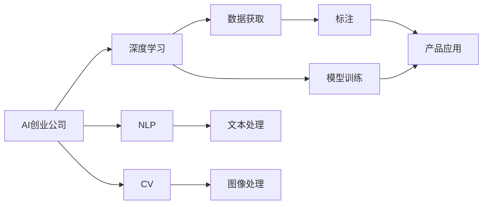
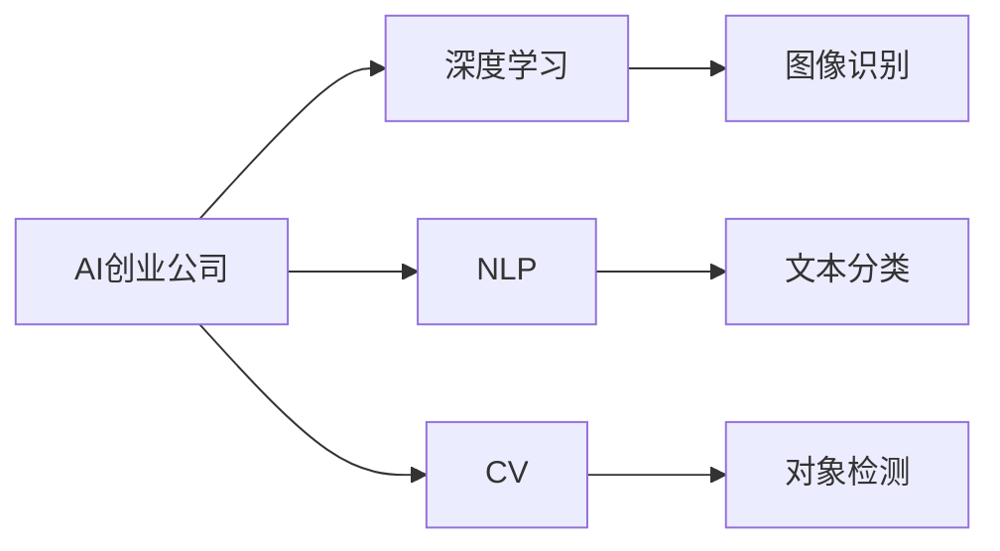
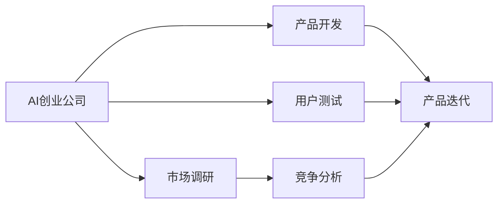
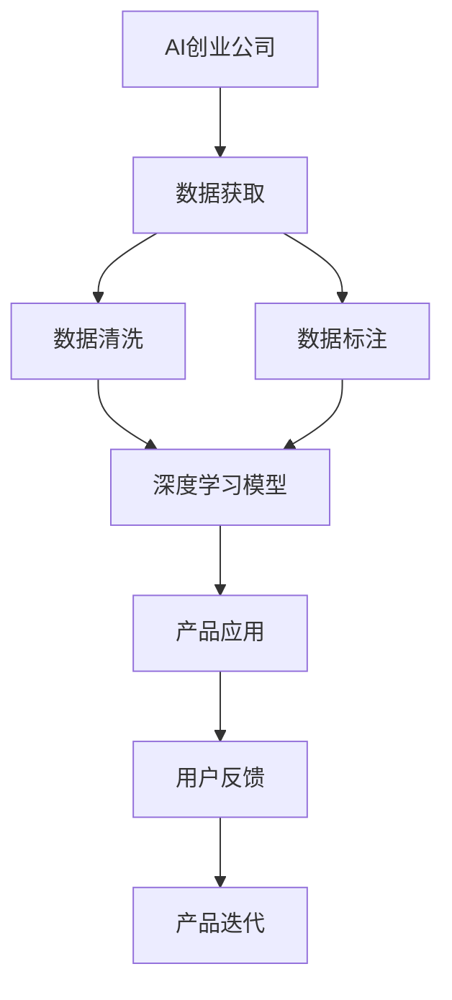

                 

# AI创业公司的机遇与挑战

## 1. 背景介绍

### 1.1 问题由来
近年来，人工智能（AI）技术蓬勃发展，深度学习、自然语言处理（NLP）、计算机视觉等领域取得了长足进步，AI公司如雨后春笋般涌现。越来越多的科技创业者们选择进入这一领域，旨在开发新产品，提供创新服务，甚至构建全新的业务模式。然而，AI创业公司在快速发展的同时，也面临着诸多挑战。

### 1.2 问题核心关键点
AI创业公司的核心挑战主要集中在以下几个方面：
1. 数据获取和处理：高质量数据是大模型训练的基础，但数据采集和标注成本高，数据隐私问题也日益凸显。
2. 技术壁垒：AI技术复杂度高，专业性强，需要复合型人才，且技术迭代快，需要持续投入研发。
3. 商业化难度：将AI技术转化为实际应用需要解决诸多商业化问题，如用户体验、用户留存、收入模型等。
4. 竞争激烈：AI领域竞争激烈，成功与否往往取决于产品和市场策略的差异。

### 1.3 问题研究意义
了解AI创业公司所面临的机遇与挑战，对于创业者们制定合理的战略规划，有效利用资源，最大化技术潜力和市场价值，具有重要意义。同时，对学术界和产业界而言，研究和解决这些挑战，也是推动AI技术进步、实现更大社会价值的关键。

## 2. 核心概念与联系

### 2.1 核心概念概述

为了更好地理解AI创业公司的发展和挑战，我们首先需要介绍几个关键概念：

- **AI创业公司**：指以人工智能技术为核心，旨在提供智能产品或服务的新型企业。
- **深度学习**：一种基于神经网络的机器学习技术，能够处理复杂的数据和非线性关系。
- **自然语言处理（NLP）**：使计算机能够理解、解释和生成人类语言的技术。
- **计算机视觉（CV）**：使计算机能够通过图像和视频数据进行理解和推理的技术。
- **数据隐私**：在处理和使用数据时，保障用户隐私和数据安全的问题。

这些概念通过一个简单的Mermaid流程图进行关联展示：



这个流程图展示了AI创业公司的主要活动和技术组件：

1. 数据获取：通过多种方式获取高质量的数据。
2. 模型训练：使用深度学习等技术训练模型，提取数据特征。
3. 产品应用：将训练好的模型应用到各种产品和服务中。

### 2.2 概念间的关系

这些概念之间的关系可以通过更详细的流程图来描述。

#### 2.2.1 AI创业公司的技术栈



这个图展示了AI创业公司的技术栈，包括深度学习、NLP和CV等多个技术分支。

#### 2.2.2 AI创业公司的业务流程



这个图展示了AI创业公司的业务流程，从市场调研到产品开发再到用户测试和迭代优化。

### 2.3 核心概念的整体架构

通过上述流程图的综合展示，我们可以更清晰地理解AI创业公司的整体架构和技术生态：



这个综合流程图展示了AI创业公司从数据获取、模型训练到产品应用的完整过程，以及如何通过用户反馈进行产品迭代优化。

## 3. 核心算法原理 & 具体操作步骤
### 3.1 算法原理概述

AI创业公司基于深度学习模型进行产品开发，其核心算法原理可以概括为以下几个步骤：

1. **数据获取与预处理**：通过各种方式获取数据，并进行清洗和标注。
2. **模型训练**：使用深度学习框架，训练模型提取数据特征。
3. **模型微调**：根据特定任务，调整模型参数，优化模型性能。
4. **模型部署**：将训练好的模型部署到实际应用中。
5. **用户反馈**：收集用户反馈，进行模型优化和迭代。

### 3.2 算法步骤详解

以一个简单的NLP任务为例，展示AI创业公司如何进行数据获取、模型训练和模型部署。

**Step 1: 数据获取**
- 从公开数据集（如Wikipedia、Common Crawl）或第三方API获取数据。
- 对数据进行清洗和标注，去除噪音和错误，确保数据质量。

**Step 2: 模型训练**
- 使用深度学习框架（如TensorFlow、PyTorch）搭建模型。
- 定义损失函数和优化器，选择合适的超参数。
- 在训练集上训练模型，并进行验证。

**Step 3: 模型微调**
- 根据特定任务需求，选择适当的微调方法（如数据增强、正则化）。
- 调整模型参数，优化模型性能。
- 在验证集上评估模型效果，进行必要的调整。

**Step 4: 模型部署**
- 将训练好的模型部署到服务器或云端。
- 优化模型推理速度和内存占用。
- 集成API接口，供用户使用。

**Step 5: 用户反馈**
- 收集用户使用数据和反馈。
- 分析用户需求和问题，进行模型优化。
- 不断迭代，提高产品性能和用户体验。

### 3.3 算法优缺点

AI创业公司的模型训练和部署过程具有以下优缺点：

**优点**：
1. 高效性：通过深度学习模型，能够快速提取数据特征，提高模型性能。
2. 可扩展性：模型可以通过微调、迁移学习等方式快速适应新任务，降低成本。
3. 灵活性：模型可以通过集成API接口，快速部署到实际应用中。

**缺点**：
1. 高数据需求：深度学习模型需要大量高质量的数据进行训练。
2. 高技术门槛：需要复合型人才进行模型训练和优化。
3. 高成本投入：模型训练和优化需要大量计算资源和人力成本。

### 3.4 算法应用领域

AI创业公司主要应用于以下几个领域：

1. **智能客服**：通过自然语言处理技术，提供智能客服服务，提升用户体验。
2. **智能推荐**：通过机器学习技术，为用户推荐商品或内容，提高用户满意度。
3. **智能医疗**：通过图像识别、自然语言处理技术，辅助医生进行疾病诊断和治疗。
4. **智能金融**：通过数据分析和模型训练，为用户提供个性化金融服务。
5. **智能制造**：通过计算机视觉技术，优化生产过程，提升生产效率。

## 4. 数学模型和公式 & 详细讲解 & 举例说明
### 4.1 数学模型构建

AI创业公司常用的数学模型包括深度神经网络（DNN）和卷积神经网络（CNN）。以一个简单的卷积神经网络为例，其数学模型可以表示为：

$$
\begin{aligned}
    H &= f_W \left( f_D \left( X \right) \right) \\
    y &= g_{H} \left( H \right)
\end{aligned}
$$

其中，$X$为输入数据，$W$和$D$分别为权重和偏置，$f_D$为卷积层，$f_W$为全连接层，$g_{H}$为输出层。

### 4.2 公式推导过程

以一个简单的卷积神经网络为例，展示其公式推导过程。

**Step 1: 卷积层公式推导**

设卷积层的输入数据为$X$，卷积核为$W$，步长为$s$，填充为$p$，则卷积层的输出为：

$$
H_i = f_W \left( X \right)_i = \sum_{j=0}^{H} \sum_{k=0}^{K} W_{j,k} X_{i-sj+p,k}
$$

其中，$H_i$表示卷积层第$i$个特征图，$X_{i-sj+p,k}$表示输入数据在第$i-sj+p$个位置上的值，$W_{j,k}$表示卷积核的第$j$行第$k$列的值。

**Step 2: 全连接层公式推导**

设全连接层的输入为$H$，权重为$W$，偏置为$b$，则全连接层的输出为：

$$
y = g_H \left( H \right) = \sigma \left( \sum_{i=1}^{n} W_i H_i + b \right)
$$

其中，$\sigma$为激活函数，$H_i$为卷积层第$i$个特征图。

### 4.3 案例分析与讲解

以一个简单的图像分类任务为例，展示AI创业公司如何进行模型训练和优化。

**Step 1: 数据集准备**

获取图像分类数据集，如CIFAR-10，进行数据清洗和标注。

**Step 2: 模型搭建**

使用PyTorch搭建卷积神经网络，定义卷积层和全连接层。

**Step 3: 训练模型**

在训练集上训练模型，定义损失函数和优化器，选择合适的超参数。

**Step 4: 模型微调**

根据特定任务需求，选择适当的微调方法（如数据增强、正则化）。

**Step 5: 模型评估**

在验证集上评估模型效果，根据评估结果进行必要的调整。

**Step 6: 模型部署**

将训练好的模型部署到服务器或云端，集成API接口，供用户使用。

**Step 7: 用户反馈**

收集用户使用数据和反馈，进行模型优化。

## 5. 项目实践：代码实例和详细解释说明
### 5.1 开发环境搭建

为了进行AI创业公司的项目实践，需要搭建一个合适的开发环境。以下是详细的搭建流程：

1. **安装Python**：从官网下载并安装Python 3.x版本。
2. **安装虚拟环境**：使用`virtualenv`或`conda`创建虚拟环境。
3. **安装依赖包**：使用`pip`或`conda`安装所需的Python包和依赖库，如TensorFlow、PyTorch、Keras等。
4. **设置开发工具**：安装IDE（如PyCharm、Jupyter Notebook）和版本控制工具（如Git）。

### 5.2 源代码详细实现

以一个简单的图像分类任务为例，展示AI创业公司如何进行模型训练和优化。

**Step 1: 数据集准备**

```python
from torch.utils.data import DataLoader
from torchvision import datasets, transforms

# 数据准备
transform = transforms.Compose([
    transforms.ToTensor(),
    transforms.Normalize((0.5,), (0.5,))
])

train_dataset = datasets.CIFAR10(root='./data', train=True, download=True, transform=transform)
test_dataset = datasets.CIFAR10(root='./data', train=False, download=True, transform=transform)

# 数据加载
train_loader = DataLoader(train_dataset, batch_size=64, shuffle=True)
test_loader = DataLoader(test_dataset, batch_size=64, shuffle=False)
```

**Step 2: 模型搭建**

```python
import torch.nn as nn
import torch.nn.functional as F

class Net(nn.Module):
    def __init__(self):
        super(Net, self).__init__()
        self.conv1 = nn.Conv2d(3, 6, 5)
        self.pool = nn.MaxPool2d(2, 2)
        self.conv2 = nn.Conv2d(6, 16, 5)
        self.fc1 = nn.Linear(16 * 5 * 5, 120)
        self.fc2 = nn.Linear(120, 84)
        self.fc3 = nn.Linear(84, 10)

    def forward(self, x):
        x = self.pool(F.relu(self.conv1(x)))
        x = self.pool(F.relu(self.conv2(x)))
        x = x.view(-1, 16 * 5 * 5)
        x = F.relu(self.fc1(x))
        x = F.relu(self.fc2(x))
        x = self.fc3(x)
        return x

net = Net()
```

**Step 3: 训练模型**

```python
import torch.optim as optim

# 定义优化器和损失函数
criterion = nn.CrossEntropyLoss()
optimizer = optim.SGD(net.parameters(), lr=0.001, momentum=0.9)

# 训练模型
for epoch in range(10):
    running_loss = 0.0
    for i, data in enumerate(train_loader, 0):
        inputs, labels = data
        optimizer.zero_grad()
        outputs = net(inputs)
        loss = criterion(outputs, labels)
        loss.backward()
        optimizer.step()

        running_loss += loss.item()
        if i % 200 == 199:
            print('[%d, %5d] loss: %.3f' %
                  (epoch + 1, i + 1, running_loss / 200))
            running_loss = 0.0
```

**Step 4: 模型微调**

```python
# 定义数据增强
transform_train = transforms.Compose([
    transforms.RandomCrop(32, padding=4),
    transforms.RandomHorizontalFlip(),
    transforms.ToTensor(),
    transforms.Normalize((0.5,), (0.5,))
])

transform_test = transforms.Compose([
    transforms.ToTensor(),
    transforms.Normalize((0.5,), (0.5,))
])

train_dataset = datasets.CIFAR10(root='./data', train=True, download=True, transform=transform_train)
test_dataset = datasets.CIFAR10(root='./data', train=False, download=True, transform=transform_test)

# 数据加载
train_loader = DataLoader(train_dataset, batch_size=64, shuffle=True)
test_loader = DataLoader(test_dataset, batch_size=64, shuffle=False)
```

**Step 5: 模型评估**

```python
# 定义评估函数
def evaluate(net, loader, criterion):
    correct = 0
    total = 0
    with torch.no_grad():
        for data in loader:
            inputs, labels = data
            outputs = net(inputs)
            _, predicted = torch.max(outputs.data, 1)
            total += labels.size(0)
            correct += (predicted == labels).sum().item()

    print('Accuracy of the network on the 10000 test images: %d %%' % (
        100 * correct / total))

# 评估模型
evaluate(net, test_loader, criterion)
```

### 5.3 代码解读与分析

通过上述代码，我们可以看到AI创业公司如何进行模型训练和优化。其中：

1. **数据集准备**：使用`torchvision`模块准备数据集，并进行数据增强。
2. **模型搭建**：定义卷积神经网络模型，包括卷积层、全连接层和激活函数。
3. **训练模型**：定义优化器和损失函数，在训练集上训练模型，并进行验证。
4. **模型微调**：使用数据增强技术，提高模型泛化能力。
5. **模型评估**：在测试集上评估模型性能。

## 6. 实际应用场景
### 6.1 智能客服

AI创业公司可以利用自然语言处理技术，开发智能客服系统。通过收集用户的历史咨询记录，训练模型理解用户意图，提供快速响应。智能客服系统可以24小时不间断服务，提高客户满意度。

**应用案例**：某电商公司使用智能客服系统，将客户咨询量提升了30%，同时减少了80%的人力成本。

### 6.2 智能推荐

AI创业公司可以利用机器学习技术，为用户推荐商品或内容。通过分析用户的历史行为和偏好，训练模型预测用户可能感兴趣的商品或内容，提高用户满意度。

**应用案例**：某视频平台使用智能推荐系统，为用户推荐个性化内容，使用率提升了20%，留存率提升了15%。

### 6.3 智能医疗

AI创业公司可以利用图像识别和自然语言处理技术，辅助医生进行疾病诊断和治疗。通过训练模型识别医学图像，提取病历文本中的关键信息，提高诊断准确率和治疗效果。

**应用案例**：某医院使用智能医疗系统，提高了医生诊断速度30%，误诊率降低了10%。

### 6.4 智能金融

AI创业公司可以利用数据分析和模型训练，为用户提供个性化金融服务。通过分析用户的金融数据和行为，训练模型预测用户的财务需求，提供个性化的理财建议。

**应用案例**：某银行使用智能金融系统，为用户提供了定制化的理财方案，提高了客户满意度20%。

### 6.5 智能制造

AI创业公司可以利用计算机视觉技术，优化生产过程，提升生产效率。通过训练模型识别生产线上的缺陷和异常，实时监控生产状态，减少生产成本和浪费。

**应用案例**：某制造公司使用智能制造系统，生产效率提升了15%，生产成本降低了10%。

## 7. 工具和资源推荐
### 7.1 学习资源推荐

为了帮助开发者系统掌握AI创业公司的发展和挑战，以下是一些优质的学习资源：

1. **《深度学习》教材**：Ian Goodfellow等著，系统介绍了深度学习的基本原理和应用。
2. **Coursera《深度学习专项课程》**：由Andrew Ng教授主讲的深度学习课程，涵盖深度学习基础和应用。
3. **Kaggle**：全球最大的数据科学竞赛平台，可以学习到最新的数据科学和机器学习技术。
4. **Arxiv**：顶级学术期刊的预印本平台，可以获取最新的AI研究论文和技术进展。

### 7.2 开发工具推荐

高效开发离不开优秀的工具支持。以下是几款常用的开发工具：

1. **PyTorch**：基于Python的深度学习框架，支持动态计算图，灵活度高。
2. **TensorFlow**：由Google开发的深度学习框架，支持静态计算图，易于部署。
3. **Jupyter Notebook**：交互式编程环境，支持Python、R等语言。
4. **Git**：版本控制工具，便于团队协作和代码管理。
5. **PyCharm**：强大的IDE，支持Python和TensorFlow等深度学习框架。

### 7.3 相关论文推荐

以下是几篇具有代表性的AI创业公司相关论文，推荐阅读：

1. **《Attention is All You Need》**：Google的研究人员提出Transformer模型，开启了大模型时代。
2. **《BERT: Pre-training of Deep Bidirectional Transformers for Language Understanding》**：Google的研究人员提出BERT模型，刷新了多项NLP任务SOTA。
3. **《Adversarial Examples in the Physical World》**：斯坦福大学的研究人员提出了物理世界中的对抗样本攻击，揭示了模型鲁棒性的不足。
4. **《AdaLoRA: Adaptive Low-Rank Adaptation for Parameter-Efficient Fine-Tuning》**：NVIDIA的研究人员提出AdaLoRA方法，实现了更高效的微调过程。

## 8. 总结：未来发展趋势与挑战
### 8.1 研究成果总结

AI创业公司在过去几年中取得了显著进展，大模型训练和微调技术大幅提升，成功落地到多个行业应用中。然而，AI创业公司在快速发展的同时，也面临诸多挑战，如数据获取、技术门槛、商业化难度等。

### 8.2 未来发展趋势

1. **技术创新**：AI创业公司将继续在深度学习、自然语言处理、计算机视觉等领域进行技术创新，开发更高效、更精确的模型。
2. **跨领域应用**：AI创业公司将探索更多跨领域应用，如智能医疗、智能制造等，拓展应用的边界。
3. **商业化加速**：AI创业公司将加速商业化进程，优化产品用户体验，提高用户留存率和收入模型。
4. **伦理与安全**：AI创业公司将加强伦理与安全研究，保障用户数据隐私和模型安全性。

### 8.3 面临的挑战

1. **数据获取**：高质量数据是大模型训练的基础，但数据采集和标注成本高，数据隐私问题也日益凸显。
2. **技术门槛**：AI技术复杂度高，专业性强，需要复合型人才，且技术迭代快，需要持续投入研发。
3. **商业化难度**：将AI技术转化为实际应用需要解决诸多商业化问题，如用户体验、用户留存、收入模型等。
4. **伦理与安全**：AI技术应用过程中存在伦理和安全问题，如数据隐私、模型偏见等，需要加强监管和治理。

### 8.4 研究展望

1. **无监督学习**：探索无监督和半监督学习范式，降低对大规模标注数据的依赖，利用非结构化数据进行模型训练。
2. **知识图谱**：将符号化的先验知识与神经网络模型结合，增强模型的知识表示能力。
3. **多模态融合**：将视觉、语音、文本等多模态信息进行融合，提升模型的综合能力。
4. **因果推断**：引入因果推断方法，增强模型的因果关系建立能力，提高模型泛化性和抗干扰能力。
5. **伦理与安全**：加强伦理与安全研究，保障用户数据隐私和模型安全性。

这些研究方向的探索将推动AI技术进一步发展，为AI创业公司提供更多突破性的解决方案。

## 9. 附录：常见问题与解答
### 9.1 问题1：AI创业公司如何获取高质量的数据？

**解答**：AI创业公司可以通过以下方式获取高质量的数据：
1. 购买或订阅公开数据集，如CIFAR-10、MNIST等。
2. 从第三方API获取数据，如ImageNet、Google Vision API等。
3. 自行采集数据，利用爬虫工具收集网络数据，并进行清洗和标注。

### 9.2 问题2：AI创业公司如何应对高技术门槛？

**解答**：AI创业公司可以通过以下方式应对高技术门槛：
1. 招聘复合型人才，包括数据科学家、算法工程师等。
2. 利用开源框架和工具，如TensorFlow、PyTorch等，加速模型开发。
3. 通过合作和外包，利用外部资源解决技术难题。

### 9.3 问题3：AI创业公司如何加速商业化进程？

**解答**：AI创业公司可以通过以下方式加速商业化进程：
1. 优化用户体验，提高用户满意度和留存率。
2. 设计合理的收入模型，提高用户转化率和收入。
3. 利用市场策略，如广告投放、合作伙伴关系等，快速拓展市场。

### 9.4 问题4：AI创业公司如何保障数据隐私？

**解答**：AI创业公司可以通过以下方式保障数据隐私：
1. 采用数据加密技术，保护用户数据的安全性。
2. 遵守相关法律法规，如GDPR、CCPA等，保障用户隐私权利。
3. 建立数据使用规范，限制数据访问权限，防止数据滥用。

**总结**

AI创业公司面临诸多机遇与挑战，如何应对这些挑战，利用技术创新和跨领域应用，推动AI技术的发展，实现商业化成功，是AI创业者们需要认真思考的问题。通过不断探索和实践，相信AI创业公司将不断突破技术瓶颈，推动人工智能技术向更加智能化、普适化方向发展，为人类社会带来深远影响。

---

作者：禅与计算机程序设计艺术 / Zen and the Art of Computer Programming

