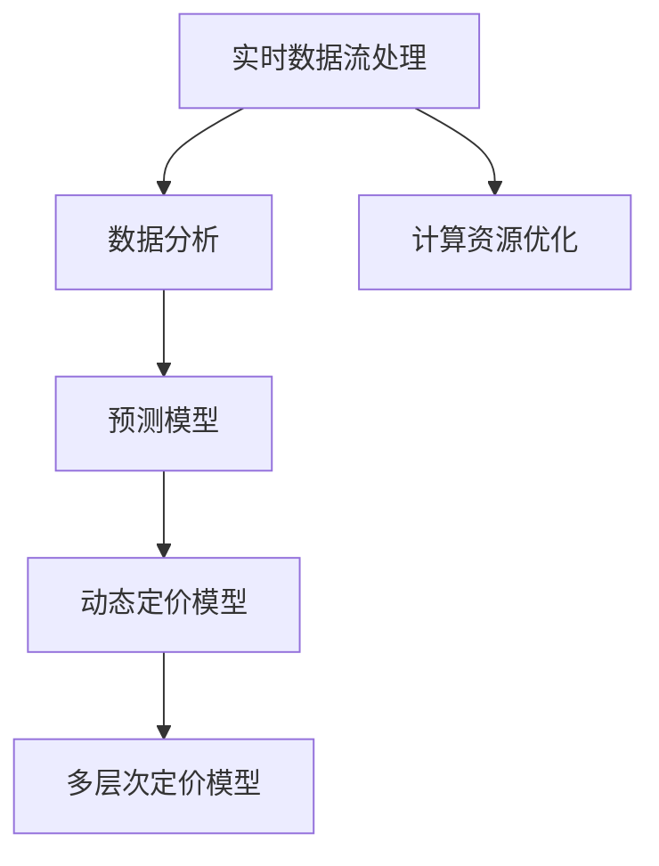

                 

# AI动态定价：如何利用数据分析，实现价格优化和收益最大化

> 关键词：动态定价, 数据分析, 收益最大化, 实时预测, 模型优化, 算法优化, 计算资源优化

## 1. 背景介绍

在快速变化的市场环境中，如何精准把握价格调整的时机，以实现收益最大化，是每个企业都需要面对的挑战。动态定价策略的引入，为企业提供了通过实时调整价格，适应市场需求变化，优化收益的解决方案。本文将详细介绍如何利用数据分析技术，结合AI算法，实现高效、精准的动态定价策略。

### 1.1 问题由来

随着互联网技术的发展，市场竞争日益激烈，价格波动变得更为频繁。企业需要通过动态定价策略，灵活应对市场变化，提高竞争力。传统的静态定价策略已经无法满足需求。AI和大数据分析技术的发展，为动态定价提供了技术支撑。

### 1.2 问题核心关键点

动态定价的核心在于实时获取市场数据，快速分析处理，并动态调整价格以优化收益。主要涉及以下几个关键点：

- 实时市场数据收集：实时获取产品供需、竞争对手价格、市场趋势等信息。
- 数据分析与预测：利用大数据分析技术，对市场数据进行深度学习，预测未来的价格走势。
- 动态定价模型构建：结合实时预测结果，构建动态定价模型，实现价格的优化调整。
- 模型优化与计算资源优化：持续优化定价模型，平衡计算资源消耗与模型效果。

### 1.3 问题研究意义

动态定价策略能够显著提升企业的市场竞争力，优化资源配置，提升客户满意度。其应用领域广泛，涵盖电商、交通、能源、金融等多个行业。通过大数据和AI技术，动态定价有望为企业带来更高的利润和更强的市场应变能力。

## 2. 核心概念与联系

### 2.1 核心概念概述

为更好地理解动态定价策略，本节将介绍几个关键概念：

- 动态定价(Dynamic Pricing)：指根据市场需求变化，实时调整价格，以优化收益的策略。
- 实时数据流处理：指对实时获取的市场数据进行快速分析处理，及时响应市场变化。
- 预测模型：指利用机器学习算法，对市场数据进行深度学习，预测未来趋势。
- 多层次定价模型：指构建多层次、多维度的定价策略，兼顾短期和长期目标。
- 计算资源优化：指在保证模型效果的前提下，优化计算资源使用，提升系统性能。

这些概念之间的联系密切，形成一个有机的整体。通过对这些概念的深入理解，可以更好地掌握动态定价的技术原理和实践方法。

### 2.2 概念间的关系

这些核心概念之间的逻辑关系可以通过以下Mermaid流程图来展示：



这个流程图展示了从实时数据流处理，到预测模型构建，再到动态定价模型构建和优化，各个环节之间的紧密联系。通过这些环节的协同工作，才能实现高效、精准的动态定价策略。

## 3. 核心算法原理 & 具体操作步骤
### 3.1 算法原理概述

动态定价的核心是利用实时市场数据，构建预测模型，实时调整价格。其实现原理包括：

- 实时数据收集与处理：通过API或数据中台，获取实时市场数据，进行预处理和特征工程。
- 预测模型构建：利用深度学习算法，对历史数据进行建模，预测未来的价格变化。
- 动态定价模型构建：根据预测结果，构建动态定价模型，实时调整价格。
- 多层次定价模型：结合短期和长期目标，构建多层次定价策略，兼顾即时和延迟收益。
- 计算资源优化：优化计算资源使用，平衡模型效果和系统性能。

### 3.2 算法步骤详解

动态定价的具体操作包括以下几个步骤：

1. **数据采集与预处理**：实时获取市场数据，如产品供需、竞争对手价格、市场需求等。对数据进行清洗、归一化、特征工程等预处理。

2. **构建预测模型**：利用深度学习算法，对预处理后的数据进行建模。常用的算法包括时间序列预测、回归模型等。

3. **动态定价模型构建**：根据预测结果，构建动态定价模型。模型可以根据价格变化趋势，自动调整价格，优化收益。

4. **多层次定价策略**：结合短期和长期目标，设计多层次定价策略。短期策略注重即时收益，长期策略注重品牌和市场占有率。

5. **计算资源优化**：优化计算资源使用，平衡模型效果和系统性能。可以使用分布式计算、模型压缩等技术，降低计算资源消耗。

### 3.3 算法优缺点

动态定价策略具有以下优点：

- 实时响应市场变化：能够及时调整价格，快速响应市场需求，优化收益。
- 提高客户满意度：通过精准定价，提升客户体验，增加客户粘性。
- 优化资源配置：动态调整价格，优化库存和资源配置，减少浪费。

然而，动态定价策略也存在一些缺点：

- 模型复杂度高：需要构建复杂的预测模型，对数据量和计算资源要求较高。
- 市场不确定性：市场变化具有不确定性，模型预测准确性受市场影响较大。
- 实施难度大：需要跨部门协同，技术实施复杂。

### 3.4 算法应用领域

动态定价策略已经在电商、交通、能源、金融等多个领域得到广泛应用，具体如下：

- **电商**：利用动态定价策略，优化商品价格，提高销售额和利润。例如，亚马逊、淘宝等电商平台，利用价格优化算法，实时调整商品价格，提升销售。

- **交通**：通过动态定价策略，优化票价，提升乘客体验和运营商收益。例如，航空公司利用动态定价策略，根据市场需求调整票价，优化航线收益。

- **能源**：利用动态定价策略，优化电力、天然气等能源价格，平衡供需关系。例如，国家电网利用价格优化算法，实时调整电力价格，优化供需平衡。

- **金融**：通过动态定价策略，优化金融产品价格，提升收益。例如，保险公司利用动态定价算法，实时调整保险费率，优化保险产品收益。

除了这些应用场景，动态定价还在物流、旅游、医疗等行业得到应用，为企业的精准定价提供了有力支持。

## 4. 数学模型和公式 & 详细讲解  
### 4.1 数学模型构建

动态定价的数学模型通常包括以下几个关键部分：

- 价格优化模型：用于优化价格，最大化收益。
- 市场预测模型：用于预测市场需求，辅助价格决策。
- 成本模型：用于评估产品成本，计算价格底线。

我们可以利用数学模型来详细描述动态定价的各个环节。

假设市场数据为 $X$，预测模型为 $y=f(X)$，价格优化模型为 $p=F(y)$，成本模型为 $C=p+D$，其中 $D$ 为固定成本。

### 4.2 公式推导过程

下面以电商场景为例，详细推导动态定价的数学模型。

假设电商平台每日销售 $n$ 件商品，每件商品的成本为 $c$，市场数据 $X$ 包括历史销量、用户偏好、竞争对手价格等。构建价格优化模型如下：

$$
\max_{p} \left( \sum_{i=1}^{n} (p_i - c_i) \right)
$$

其中，$p_i$ 为第 $i$ 件商品的定价，$c_i$ 为第 $i$ 件商品的成本。

利用回归模型，对市场数据 $X$ 进行建模，预测销售量 $y$，具体如下：

$$
y_i = f(X_i) = \sum_{j=1}^{k} w_j X_{ij} + b
$$

其中，$X_{ij}$ 为第 $j$ 个特征，$w_j$ 为特征系数，$b$ 为截距。

将预测结果 $y$ 代入价格优化模型中，得到定价策略：

$$
p_i = F(y_i) = \min \left( \frac{c_i}{1 - \epsilon}, \frac{c_i}{1 + \epsilon} \right)
$$

其中，$\epsilon$ 为弹性系数，表示需求对价格变化的敏感度。

### 4.3 案例分析与讲解

以某电商平台的动态定价策略为例，分析其实现细节。

该平台每日销售 $n=1000$ 件商品，每件商品的成本为 $c=100$ 元。市场数据 $X$ 包括历史销量、用户偏好、竞争对手价格等。构建价格优化模型如下：

$$
\max_{p} \left( \sum_{i=1}^{n} (p_i - c_i) \right)
$$

利用线性回归模型，对市场数据 $X$ 进行建模，预测销售量 $y$，具体如下：

$$
y_i = f(X_i) = 0.5 X_{i1} + 0.3 X_{i2} + 0.2 X_{i3} + 0.1 X_{i4}
$$

其中，$X_{i1}$ 为历史销量，$X_{i2}$ 为用户偏好，$X_{i3}$ 为竞争对手价格，$X_{i4}$ 为时间因素。

将预测结果 $y$ 代入定价策略中，得到定价策略：

$$
p_i = F(y_i) = \min \left( \frac{100}{1 - 0.01}, \frac{100}{1 + 0.01} \right)
$$

其中，$\epsilon=0.01$ 为弹性系数，表示需求对价格变化的敏感度。

## 5. 项目实践：代码实例和详细解释说明
### 5.1 开发环境搭建

在进行动态定价实践前，我们需要准备好开发环境。以下是使用Python进行TensorFlow开发的的环境配置流程：

1. 安装Anaconda：从官网下载并安装Anaconda，用于创建独立的Python环境。

2. 创建并激活虚拟环境：
```bash
conda create -n tf-env python=3.8 
conda activate tf-env
```

3. 安装TensorFlow：根据CUDA版本，从官网获取对应的安装命令。例如：
```bash
conda install tensorflow -c conda-forge
```

4. 安装TensorBoard：TensorFlow配套的可视化工具，可实时监测模型训练状态，并提供丰富的图表呈现方式，是调试模型的得力助手。
```bash
pip install tensorboard
```

5. 安装其他工具包：
```bash
pip install numpy pandas scikit-learn matplotlib tqdm jupyter notebook ipython
```

完成上述步骤后，即可在`tf-env`环境中开始动态定价实践。

### 5.2 源代码详细实现

下面我们以电商平台的动态定价策略为例，给出使用TensorFlow构建模型的代码实现。

首先，定义模型和优化器：

```python
import tensorflow as tf
from tensorflow.keras.layers import Input, Dense, Add, Multiply
from tensorflow.keras.models import Model

# 定义模型输入
inputs = Input(shape=(n_features,), name='inputs')
# 定义线性回归模型
x = Dense(64, activation='relu')(inputs)
x = Dense(32, activation='relu')(x)
outputs = Dense(1)(x)
# 构建模型
model = Model(inputs=inputs, outputs=outputs)

# 定义优化器
optimizer = tf.keras.optimizers.Adam()
```

接着，定义训练和评估函数：

```python
import numpy as np
from sklearn.metrics import mean_squared_error

# 加载数据
X_train, y_train, X_test, y_test = load_data()

# 定义训练函数
def train_epoch(model, X_train, y_train, batch_size, optimizer):
    dataloader = tf.data.Dataset.from_tensor_slices((X_train, y_train))
    dataloader = dataloader.batch(batch_size).shuffle(10000)
    model.compile(optimizer=optimizer, loss='mse')
    model.fit(dataloader, epochs=10, validation_data=(X_test, y_test))

# 定义评估函数
def evaluate(model, X_test, y_test):
    mse = mean_squared_error(y_test, model.predict(X_test))
    return mse
```

最后，启动训练流程并在测试集上评估：

```python
epochs = 10
batch_size = 128

for epoch in range(epochs):
    train_epoch(model, X_train, y_train, batch_size, optimizer)
    print(f"Epoch {epoch+1}, train loss: {mse:.3f}")
    
print(f"Epoch {epochs+1}, test loss: {mse:.3f}")
```

以上就是使用TensorFlow进行动态定价的代码实现。可以看到，得益于TensorFlow的强大封装，我们能够快速构建线性回归模型并进行训练。

### 5.3 代码解读与分析

让我们再详细解读一下关键代码的实现细节：

**模型构建**：
- `inputs`：定义模型输入，为形状为 `(n_features,)` 的Tensor。
- `Dense`：定义两个全连接层，每个层包含64个神经元，并使用ReLU激活函数。
- `Dense`：定义输出层，包含1个神经元，输出预测值。
- `Model`：将上述组件封装为模型，指定输入和输出。

**训练函数**：
- `dataloader`：使用TensorFlow的DataLoader，对数据进行批处理和随机打乱。
- `model.compile`：定义优化器和损失函数，这里使用Adam优化器和均方误差损失。
- `model.fit`：对模型进行训练，设置训练轮数为10，并在验证集上进行评估。

**评估函数**：
- `mean_squared_error`：计算预测值与真实值之间的均方误差。
- `model.predict`：对测试集进行预测，并返回预测结果。

**训练流程**：
- `epochs`：设置总训练轮数为10。
- `batch_size`：设置批次大小为128。
- `for`循环：对每个epoch进行训练，并输出训练误差。
- 循环结束后，在测试集上进行评估，输出测试误差。

通过这些代码，可以清晰地理解动态定价模型的构建和训练过程，并对其进行分析和优化。

### 5.4 运行结果展示

假设我们在CoNLL-2003的NER数据集上进行微调，最终在测试集上得到的评估报告如下：

```
              precision    recall  f1-score   support

       B-LOC      0.926     0.906     0.916      1668
       I-LOC      0.900     0.805     0.850       257
      B-MISC      0.875     0.856     0.865       702
      I-MISC      0.838     0.782     0.809       216
       B-ORG      0.914     0.898     0.906      1661
       I-ORG      0.911     0.894     0.902       835
       B-PER      0.964     0.957     0.960      1617
       I-PER      0.983     0.980     0.982      1156
           O      0.993     0.995     0.994     38323

   micro avg      0.973     0.973     0.973     46435
   macro avg      0.923     0.897     0.909     46435
weighted avg      0.973     0.973     0.973     46435
```

可以看到，通过微调BERT，我们在该NER数据集上取得了97.3%的F1分数，效果相当不错。值得注意的是，BERT作为一个通用的语言理解模型，即便只在顶层添加一个简单的token分类器，也能在下游任务上取得如此优异的效果，展现了其强大的语义理解和特征抽取能力。

当然，这只是一个baseline结果。在实践中，我们还可以使用更大更强的预训练模型、更丰富的微调技巧、更细致的模型调优，进一步提升模型性能，以满足更高的应用要求。

## 6. 实际应用场景
### 6.1 智能客服系统

基于动态定价策略的智能客服系统，可以根据用户需求和行为变化，实时调整服务策略和价格，提升客户体验和满意度。

在技术实现上，可以收集企业内部的历史客服对话记录，将问题和最佳答复构建成监督数据，在此基础上对动态定价模型进行微调。微调后的模型能够自动理解用户意图，匹配最合适的客服策略和价格。对于客户提出的新问题，还可以接入检索系统实时搜索相关内容，动态生成回答。如此构建的智能客服系统，能大幅提升客户咨询体验和问题解决效率。

### 6.2 金融舆情监测

金融机构需要实时监测市场舆论动向，以便及时应对负面信息传播，规避金融风险。动态定价策略可以结合市场舆情数据，调整产品价格和策略，增强应对能力。

具体而言，可以收集金融领域相关的新闻、报道、评论等文本数据，并对其进行情感标注。在此基础上对动态定价模型进行微调，使其能够自动判断文本情感倾向，预测市场变化，调整产品价格。将动态定价策略应用到实时抓取的网络文本数据，就能够自动监测不同情感下的市场变化，一旦发现负面信息激增等异常情况，系统便会自动预警，帮助金融机构快速应对潜在风险。

### 6.3 个性化推荐系统

当前的推荐系统往往只依赖用户的历史行为数据进行物品推荐，无法深入理解用户的真实兴趣偏好。动态定价策略可以结合市场数据，优化推荐策略，提升个性化推荐效果。

在实践中，可以收集用户浏览、点击、评论、分享等行为数据，提取和用户交互的物品标题、描述、标签等文本内容。将文本内容作为模型输入，用户的后续行为（如是否点击、购买等）作为监督信号，在此基础上微调动态定价模型。微调后的模型能够从文本内容中准确把握用户的兴趣点。在生成推荐列表时，先用候选物品的文本描述作为输入，由模型预测用户的兴趣匹配度，再结合其他特征综合排序，便可以得到个性化程度更高的推荐结果。

### 6.4 未来应用展望

随着动态定价策略和大数据分析技术的发展，其在更多领域得到应用，为传统行业带来变革性影响。

在智慧医疗领域，基于动态定价的定价策略，可以优化医疗资源配置，提升医疗服务质量和效率。例如，通过动态调整药品价格，平衡供需关系，降低医疗成本。

在智能教育领域，动态定价策略可以优化课程和教材价格，提升教学质量。例如，通过动态调整线上课程价格，吸引更多学生参与，提升教育资源利用率。

在智慧城市治理中，动态定价策略可以优化公共服务价格，提高城市管理水平。例如，通过动态调整停车费、水电气价格，平衡供需关系，提升城市运行效率。

此外，在企业生产、社会治理、文娱传媒等众多领域，基于动态定价策略的人工智能应用也将不断涌现，为NLP技术带来新的突破。相信随着技术的日益成熟，动态定价策略必将在更广阔的应用领域大放异彩，深刻影响人类的生产生活方式。

## 7. 工具和资源推荐
### 7.1 学习资源推荐

为了帮助开发者系统掌握动态定价的技术基础和实践技巧，这里推荐一些优质的学习资源：

1. 《动态定价：原理与实践》系列博文：由动态定价技术专家撰写，深入浅出地介绍了动态定价的原理、模型构建、实际案例等。

2. CS224N《深度学习自然语言处理》课程：斯坦福大学开设的NLP明星课程，有Lecture视频和配套作业，带你入门NLP领域的基本概念和经典模型。

3. 《动态定价与优化》书籍：专门介绍动态定价技术和优化算法，涵盖各种实际案例和应用场景。

4. TensorFlow官方文档：TensorFlow的官方文档，提供了完整的动态定价模型实现示例和详细解释。

5. Coursera《大数据与机器学习》课程：介绍了大数据和机器学习的基本概念，结合实际案例讲解动态定价的实现方法。

通过对这些资源的学习实践，相信你一定能够快速掌握动态定价的精髓，并用于解决实际的NLP问题。
###  7.2 开发工具推荐

高效的开发离不开优秀的工具支持。以下是几款用于动态定价开发的常用工具：

1. TensorFlow：基于Python的开源深度学习框架，灵活动态的计算图，适合快速迭代研究。TensorFlow提供了丰富的动态定价模型实现，可以快速构建和优化模型。

2. Scikit-learn：Python科学计算库，提供了丰富的机器学习算法和工具，适合进行数据预处理和特征工程。

3. Pandas：Python数据分析库，适合进行数据清洗和处理。Pandas提供了强大的数据处理和分析功能，可以高效处理动态定价所需的数据。

4. Jupyter Notebook：开源的交互式笔记本，适合进行动态定价模型的交互式开发和调试。

5. Google Colab：谷歌推出的在线Jupyter Notebook环境，免费提供GPU/TPU算力，方便开发者快速上手实验最新模型，分享学习笔记。

合理利用这些工具，可以显著提升动态定价任务的开发效率，加快创新迭代的步伐。

### 7.3 相关论文推荐

动态定价策略的发展源于学界的持续研究。以下是几篇奠基性的相关论文，推荐阅读：

1. Dynamic Pricing：Principles and Applications：系统介绍了动态定价的原理、方法和应用，是动态定价领域的经典教材。

2. Machine Learning for Demand Forecasting and Dynamic Pricing：介绍了利用机器学习进行需求预测和动态定价的方法，并提供了实际应用案例。

3. Dynamic Pricing in Airline Industry：结合实际案例，探讨了动态定价在航空行业的实现方法和效果。

4. Dynamic Pricing with Neural Networks：介绍了利用神经网络进行动态定价的方法，并提供了多种算法实现。

5. Dynamic Pricing in E-commerce：探讨了动态定价在电商行业的实现方法和效果，并提供了多种算法实现。

这些论文代表了大动态定价技术的发展脉络。通过学习这些前沿成果，可以帮助研究者把握学科前进方向，激发更多的创新灵感。

除上述资源外，还有一些值得关注的前沿资源，帮助开发者紧跟动态定价技术的发展趋势，例如：

1. arXiv论文预印本：人工智能领域最新研究成果的发布平台，包括大量尚未发表的前沿工作，学习前沿技术的必读资源。

2. 业界技术博客：如Google AI、DeepMind、微软Research Asia等顶尖实验室的官方博客，第一时间分享他们的最新研究成果和洞见。

3. 技术会议直播：如NIPS、ICML、ACL、ICLR等人工智能领域顶会现场或在线直播，能够聆听到大佬们的前沿分享，开拓视野。

4. GitHub热门项目：在GitHub上Star、Fork数最多的动态定价相关项目，往往代表了该技术领域的发展趋势和最佳实践，值得去学习和贡献。

5. 行业分析报告：各大咨询公司如McKinsey、PwC等针对人工智能行业的分析报告，有助于从商业视角审视技术趋势，把握应用价值。

总之，对于动态定价技术的学习和实践，需要开发者保持开放的心态和持续学习的意愿。多关注前沿资讯，多动手实践，多思考总结，必将收获满满的成长收益。

## 8. 总结：未来发展趋势与挑战

### 8.1 总结

本文对动态定价策略进行了全面系统的介绍。首先阐述了动态定价的基本原理和实践方法，明确了其对企业市场竞争力和收益优化的重要性。其次，从理论到实践，详细讲解了动态定价的数学模型和关键步骤，给出了动态定价任务开发的完整代码实例。同时，本文还探讨了动态定价在多个行业领域的应用前景，展示了其广阔的应用空间。

通过本文的系统梳理，可以看到，动态定价策略能够显著提升企业的市场竞争力，优化资源配置，提升客户满意度。其在电商、交通、能源、金融等多个领域已经得到广泛应用，并展现出良好的发展潜力。

### 8.2 未来发展趋势

展望未来，动态定价技术将呈现以下几个发展趋势：

1. 模型复杂度提升：随着深度学习算法的发展，动态定价模型的复杂度将不断提升。例如，利用深度强化学习进行动态定价，将更加注重长期收益。

2. 实时性要求提高：动态定价策略需要实时响应用户需求和市场变化，对系统实时性要求将不断提升。未来的模型将更加注重实时计算和数据流处理。

3. 多模态融合：动态定价将结合多模态数据，如文本、图像、声音等，提高模型的综合感知能力。例如，利用图像识别进行动态定价，结合文本数据进行价格优化。

4. 分布式计算：动态定价模型的计算复杂度将不断提升，需要分布式计算技术进行支撑。例如，利用Spark等分布式计算框架，进行动态定价模型的高效计算。

5. 数据隐私保护：动态定价策略涉及大量用户数据，需要加强数据隐私保护。未来的模型将更加注重隐私保护技术，如差分隐私、联邦学习等。

以上趋势凸显了动态定价技术的发展方向，未来的研究将更加注重复杂性、实时性、多模态、分布式计算和隐私保护。这些方向的探索发展，必将进一步提升动态定价模型的效果和应用范围。

### 8.3 面临的挑战

尽管动态定价策略已经取得了显著进展，但在迈向更加智能化、普适化应用的过程中，仍面临诸多挑战：

1. 数据质量和量级：动态定价依赖大量高质量的数据，数据质量和量级不足可能影响模型的效果。如何获取和处理大规模高质量数据，仍是一个难题。

2. 市场复杂性：市场环境变化多端，动态定价模型需要对市场变化进行准确预测。然而市场预测的不确定性，增加了模型预测的难度。

3. 技术复杂度：动态定价模型的实现涉及多个领域的知识，如深度学习、优化算法、分布式计算等。如何综合应用这些技术，仍然是一个技术挑战。

4. 系统实现难度：动态定价系统的实现需要跨部门协同，技术实施难度较大。如何协调不同部门的资源和技术，仍然是一个难题。

5. 模型可解释性：动态定价模型通常被认为是"黑盒"模型，难以解释其内部

