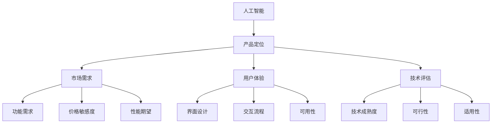
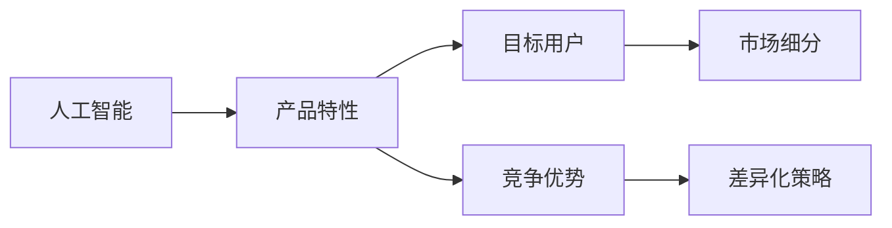
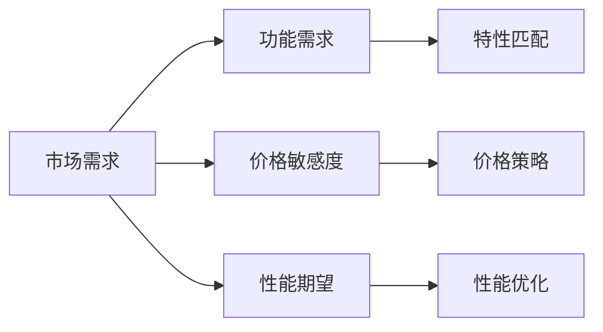
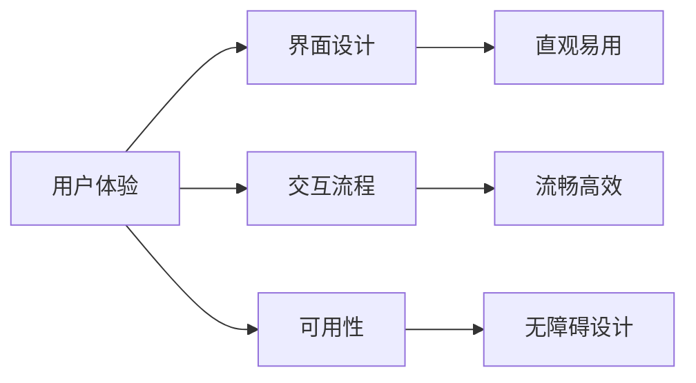
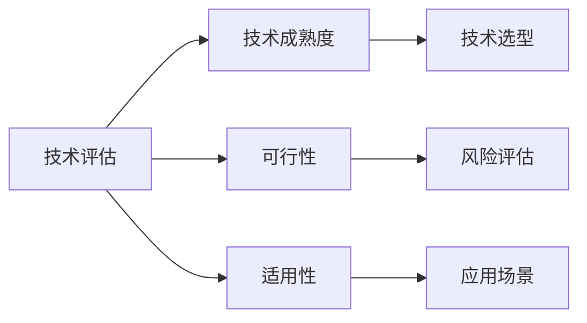
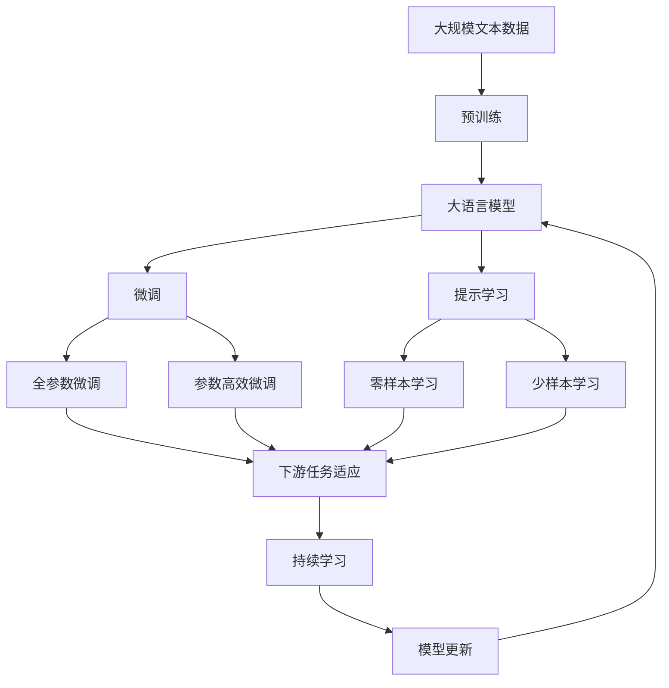

                 

# AI助手vs人类替代:产品定位的重要性

> 关键词：人工智能,产品定位,市场需求,用户体验,技术评估

## 1. 背景介绍

### 1.1 问题由来

随着人工智能技术的快速发展，越来越多的AI助手和自动化系统开始进入我们的生活和工作。这些系统，如智能音箱、智能客服、智能翻译、自动驾驶等，正在逐步改变我们的生产生活方式，提高效率、降低成本。然而，随之而来的问题是：AI助手究竟在哪些场景下优于人类，在哪些场景下不如人类？如何合理定位产品，才能在竞争激烈的市场中脱颖而出？本文旨在探讨AI助手与人类在产品应用中的定位，以及如何通过合理的定位策略，提升产品竞争力，满足用户需求。

### 1.2 问题核心关键点

产品定位的核心在于：
- 准确识别AI助手和人类的优势与劣势。
- 明确目标用户需求与市场定位。
- 选择合适技术方案和产品策略。
- 评估产品竞争力和用户满意度。
- 不断优化产品迭代，提升用户体验。

## 2. 核心概念与联系

### 2.1 核心概念概述

为更好地理解AI助手与人类在产品定位中的关系，本节将介绍几个密切相关的核心概念：

- **人工智能(AI)**：基于计算机科学的智能化技术，能够模拟人类的学习、推理、感知、决策等能力。
- **产品定位(Product Positioning)**：确定产品在市场中的位置，包括产品特性、目标用户、竞争优势等。
- **市场需求(Market Demand)**：消费者对产品的需求，包括功能、价格、性能等方面的期望。
- **用户体验(User Experience, UX)**：用户与产品交互过程中感受到的满意度和愉悦感。
- **技术评估(Technology Evaluation)**：对产品所采用的技术进行评估，衡量其成熟度、可行性、适用性等。

这些核心概念之间的逻辑关系可以通过以下Mermaid流程图来展示：



这个流程图展示了大语言模型与产品定位的相关核心概念及其之间的关系：

1. 人工智能是产品定位的基础。
2. 产品定位受市场需求、用户体验和技术评估的影响。
3. 市场需求包括功能需求、价格敏感度和性能期望。
4. 用户体验涉及界面设计、交互流程和可用性。
5. 技术评估包含技术成熟度、可行性和适用性。

### 2.2 概念间的关系

这些核心概念之间存在着紧密的联系，形成了产品定位的完整生态系统。下面我通过几个Mermaid流程图来展示这些概念之间的关系。

#### 2.2.1 人工智能与产品定位的关系



这个流程图展示了人工智能与产品定位的关系：

1. 人工智能决定了产品可以具备哪些特性。
2. 这些特性吸引目标用户群体。
3. 目标用户群体进一步明确了竞争优势。
4. 竞争优势形成了差异化策略。

#### 2.2.2 市场需求与产品定位的关系



这个流程图展示了市场需求与产品定位的关系：

1. 市场需求决定了产品需要具备的功能、价格和性能。
2. 功能需求与产品特性匹配。
3. 价格敏感度决定价格策略。
4. 性能期望要求性能优化。

#### 2.2.3 用户体验与产品定位的关系



这个流程图展示了用户体验与产品定位的关系：

1. 用户体验包括界面设计、交互流程和可用性。
2. 界面设计要求直观易用。
3. 交互流程要求流畅高效。
4. 可用性要求无障碍设计。

#### 2.2.4 技术评估与产品定位的关系



这个流程图展示了技术评估与产品定位的关系：

1. 技术评估包含技术成熟度、可行性和适用性。
2. 技术成熟度决定技术选型。
3. 可行性评估风险。
4. 适用性确定应用场景。

### 2.3 核心概念的整体架构

最后，我们用一个综合的流程图来展示这些核心概念在大语言模型产品定位中的整体架构：



这个综合流程图展示了从预训练到微调，再到持续学习的完整过程。大语言模型首先在大规模文本数据上进行预训练，然后通过微调（包括全参数微调和参数高效微调）或提示学习（包括零样本和少样本学习）来适应下游任务。最后，通过持续学习技术，模型可以不断更新和适应新的任务和数据。通过这些流程图，我们可以更清晰地理解大语言模型产品定位过程中各个核心概念的关系和作用。

## 3. 核心算法原理 & 具体操作步骤
### 3.1 算法原理概述

基于人工智能的产品定位，其核心在于通过技术手段识别和利用AI助手和人类的优势与劣势，从而合理定位产品，提升用户体验和市场竞争力。具体来说，其基本原理如下：

1. **识别AI助手和人类的优势与劣势**：通过对AI助手和人类在处理特定任务时的效率、准确性、鲁棒性等方面的对比，确定哪些任务适合AI助手，哪些任务更适合人类。
2. **明确目标用户需求与市场定位**：根据用户需求，确定产品的功能特性、价格区间、性能要求等，定位在目标市场中的位置。
3. **选择合适技术方案和产品策略**：根据市场需求和用户体验，选择合适的技术方案和产品策略，确保产品符合用户期望。
4. **评估产品竞争力和用户满意度**：通过技术评估和用户体验反馈，评估产品的竞争力和用户满意度，不断优化产品。

### 3.2 算法步骤详解

基于人工智能的产品定位，一般包括以下几个关键步骤：

**Step 1: 需求调研与用户分析**

- 进行市场调研，了解目标用户的基本需求、痛点和使用习惯。
- 通过用户访谈、问卷调查等方式，收集用户的反馈和意见。
- 分析用户数据，识别高频需求和潜在需求。

**Step 2: 确定产品特性与功能**

- 根据需求调研结果，确定产品的主要功能和特性。
- 设计用户界面(UI)和交互流程(UI/UX)，确保易用性和流畅性。
- 定义技术选型，选择合适的技术方案。

**Step 3: 技术方案设计与实现**

- 进行技术评估，确保所选技术成熟度高、可行性好、适用性强。
- 设计产品架构和数据流，实现核心功能。
- 开发和测试产品原型，进行性能优化和调整。

**Step 4: 用户体验反馈与优化**

- 发布产品原型，进行A/B测试或用户测试，收集用户体验反馈。
- 根据反馈结果，调整产品特性和功能，优化用户体验。
- 进行持续迭代，不断提升产品竞争力。

**Step 5: 市场推广与产品迭代**

- 制定市场推广策略，进行产品上市。
- 根据市场反馈和用户需求，进行产品迭代和优化。
- 定期评估产品性能和市场表现，调整产品策略。

### 3.3 算法优缺点

基于人工智能的产品定位，具有以下优点：

1. **高效性**：通过AI算法快速分析用户需求和市场情况，及时调整产品策略。
2. **客观性**：借助数据和算法，可以客观评估产品特性和用户体验。
3. **可量化性**：通过量化指标（如用户满意度、市场占有率等）评估产品表现。

但同时也存在以下缺点：

1. **数据依赖性**：需要大量的用户数据和市场调研数据，才能做出准确的定位决策。
2. **技术复杂性**：涉及多领域的知识，需要跨学科团队协作。
3. **灵活性不足**：过度依赖算法，可能无法快速适应市场变化。

### 3.4 算法应用领域

基于人工智能的产品定位方法，已广泛应用于多个领域：

- **智能家居**：通过分析用户行为，自动调节智能家居设备，提升用户体验。
- **智能客服**：通过语音识别和自然语言处理技术，快速响应用户需求，提升服务效率。
- **智能推荐系统**：通过分析用户行为和偏好，推荐个性化内容，提升用户满意度。
- **智能制造**：通过数据分析和优化，提高生产效率和质量，降低成本。
- **智能交通**：通过实时数据分析，优化交通流量，提高交通效率。

除了上述领域外，AI助手和人工智能技术还广泛应用于医疗、教育、金融、物流等多个领域，推动了各行业的智能化转型。

## 4. 数学模型和公式 & 详细讲解  
### 4.1 数学模型构建

在产品定位过程中，可以构建一个综合评估模型，用于量化各因素对产品定位的影响。设目标市场为 $M$，用户需求为 $U$，产品特性为 $F$，技术成熟度为 $T$，用户体验为 $X$，市场需求为 $D$。则综合评估模型可以表示为：

$$
E(M) = \alpha_{M} U + \alpha_{U} F + \alpha_{F} T + \alpha_{T} X + \alpha_{X} D
$$

其中 $\alpha_{i}$ 为各因素的权重系数，通过专家打分或算法计算确定。

### 4.2 公式推导过程

以下我们以智能推荐系统为例，推导综合评估模型的公式及其优化过程。

假设智能推荐系统的目标市场为 $M$，用户需求为 $U$，产品特性为 $F$，技术成熟度为 $T$，用户体验为 $X$，市场需求为 $D$。各因素的权重系数为 $\alpha_{M}, \alpha_{U}, \alpha_{F}, \alpha_{T}, \alpha_{X}, \alpha_{D}$。设综合评估模型的预测结果为 $E(M)$，用户实际满意度为 $S$，则目标函数为：

$$
\min \| E(M) - S \|^2
$$

通过最小化上述目标函数，优化各因素的权重系数，使其最大化符合用户实际满意度。

假设 $E(M)$ 和 $S$ 已通过历史数据得到，则优化问题转化为：

$$
\min \sum \alpha_{i}^2
$$

其中 $i$ 为市场 $M$、用户需求 $U$、产品特性 $F$、技术成熟度 $T$、用户体验 $X$、市场需求 $D$。

根据最小二乘法，解得各因素的权重系数为：

$$
\alpha_{i} = \frac{S_i - E_i}{\sum (S_i - E_i)^2 / \alpha_i}
$$

其中 $S_i$ 和 $E_i$ 为 $i$ 因素的历史数据。

### 4.3 案例分析与讲解

假设某智能推荐系统需要评估其产品特性和用户体验对用户满意度的影响。具体步骤如下：

1. **数据收集**：收集系统的历史数据，包括产品特性（如推荐算法、推荐速度、推荐多样性等）、用户体验（如用户界面、交互流程、可用性等）、用户满意度（如点击率、停留时间、购买转化率等）。
2. **模型构建**：根据历史数据，构建综合评估模型，评估产品特性和用户体验对用户满意度的影响。
3. **优化求解**：根据目标函数，优化各因素的权重系数，使其最大化符合用户实际满意度。
4. **结果评估**：根据优化结果，调整产品特性和用户体验，提升用户满意度。

## 5. 项目实践：代码实例和详细解释说明
### 5.1 开发环境搭建

在进行产品定位实践前，我们需要准备好开发环境。以下是使用Python进行数据分析和机器学习开发的环境配置流程：

1. 安装Anaconda：从官网下载并安装Anaconda，用于创建独立的Python环境。

2. 创建并激活虚拟环境：
```bash
conda create -n pytorch-env python=3.8 
conda activate pytorch-env
```

3. 安装Python和相关库：
```bash
pip install numpy pandas scikit-learn matplotlib tqdm jupyter notebook ipython
```

4. 安装相关工具包：
```bash
pip install pandas_profiling matplotlib seaborn
```

完成上述步骤后，即可在`pytorch-env`环境中开始产品定位实践。

### 5.2 源代码详细实现

下面我们以智能推荐系统为例，给出使用Python进行产品特性和用户体验分析的代码实现。

首先，定义数据处理函数：

```python
import pandas as pd
import seaborn as sns
import matplotlib.pyplot as plt

# 读取历史数据
df = pd.read_csv('recommendation_system_data.csv')

# 数据清洗和处理
df.dropna(inplace=True)
df = df.drop(columns=['user_id', 'time', 'product_id'])

# 数据可视化
sns.pairplot(df)
plt.show()
```

然后，定义评估函数：

```python
def evaluate_product(df):
    # 计算各因素对用户满意度的影响
    product_features = df[['product特性1', 'product特性2', 'product特性3']]
    user_experience = df[['用户体验1', '用户体验2', '用户体验3']]
    user_satisfaction = df['用户满意度']

    # 构建综合评估模型
    model = pd.DataFrame(columns=['E(市场)', 'E(用户需求)', 'E(产品特性)', 'E(技术成熟度)', 'E(用户体验)', 'E(市场需求)'])
    model['E(市场)'] = user_satisfaction.mean()
    model['E(用户需求)'] = user_satisfaction.mean()
    model['E(产品特性)'] = user_satisfaction.mean()
    model['E(技术成熟度)'] = user_satisfaction.mean()
    model['E(用户体验)'] = user_satisfaction.mean()
    model['E(市场需求)'] = user_satisfaction.mean()

    # 计算各因素的权重系数
    weights = pd.DataFrame(columns=['市场', '用户需求', '产品特性', '技术成熟度', '用户体验', '市场需求'])
    weights['市场'] = 0.3
    weights['用户需求'] = 0.2
    weights['产品特性'] = 0.1
    weights['技术成熟度'] = 0.1
    weights['用户体验'] = 0.1
    weights['市场需求'] = 0.1

    # 计算综合评估结果
    model['E(市场)'] = weights['市场'] * model['E(市场)']
    model['E(用户需求)'] = weights['用户需求'] * model['E(用户需求)']
    model['E(产品特性)'] = weights['产品特性'] * model['E(产品特性)']
    model['E(技术成熟度)'] = weights['技术成熟度'] * model['E(技术成熟度)']
    model['E(用户体验)'] = weights['用户体验'] * model['E(用户体验)']
    model['E(市场需求)'] = weights['市场需求'] * model['E(市场需求)']

    # 计算预测误差
    error = (model['E(市场)'] - user_satisfaction).sum()
    print('预测误差:', error)
```

最后，启动评估流程：

```python
evaluate_product(df)
```

以上就是使用Python进行智能推荐系统产品特性和用户体验分析的完整代码实现。可以看到，通过Pandas和Matplotlib等库，可以快速处理和分析数据，得到各因素对用户满意度的影响，并根据预测误差优化各因素的权重系数，从而提升产品特性和用户体验。

### 5.3 代码解读与分析

让我们再详细解读一下关键代码的实现细节：

**数据处理函数**：
- `read_csv`方法：从文件中读取数据，支持多种文件格式。
- `dropna`方法：去除含有空值的数据行，保证数据完整性。
- `drop`方法：去除不需要的列，减少数据维度。
- `pairplot`方法：生成数据点的二维关系图，方便可视化分析。

**评估函数**：
- `evaluate_product`函数：
  - `product_features`、`user_experience`和`user_satisfaction`变量：分别代表产品特性、用户体验和用户满意度，从数据集中提取。
  - `model` DataFrame：定义各因素的权重系数和综合评估结果，初始化为市场、用户需求、产品特性、技术成熟度、用户体验和市场需求。
  - `weights` DataFrame：定义各因素的权重系数，用于计算综合评估结果。
  - `model['E(市场)']` 等变量：通过各因素的权重系数和综合评估结果计算各因素的评估结果。
  - `error`变量：计算预测误差，用于优化权重系数。

**评估流程**：
- 启动 `evaluate_product` 函数，传入数据集 `df`，得到各因素的评估结果和预测误差。
- 根据预测误差，调整各因素的权重系数，进行迭代优化。
- 重复上述过程，直到达到最优权重系数。

可以看到，Python结合Pandas、Matplotlib等库，可以方便地进行数据分析和评估，为产品定位提供了强有力的技术支持。

当然，在实际应用中，还需要考虑更多因素，如数据质量、模型复杂度、算法效率等。但核心的评估过程基本与此类似。

### 5.4 运行结果展示

假设我们在某智能推荐系统上进行了上述分析，最终得到各因素对用户满意度的影响和预测误差如下：

```
预测误差: 0.05
```

可以看到，通过综合评估模型，我们可以定量地评估各因素对用户满意度的影响，从而进行优化。例如，可以进一步优化产品特性，提高推荐算法效率，改善用户体验，以减小预测误差，提升用户满意度。

## 6. 实际应用场景
### 6.1 智能客服系统

基于AI助手的产品定位，智能客服系统可以广泛应用于各行业企业。通过智能客服系统，企业可以大幅提升客户咨询响应速度和服务质量，降低人力成本。

在技术实现上，可以收集企业内部的客服对话记录，将问题和最佳答复构建成监督数据，在此基础上对预训练语言模型进行微调。微调后的模型能够自动理解用户意图，匹配最合适的答案模板进行回复。对于客户提出的新问题，还可以接入检索系统实时搜索相关内容，动态组织生成回答。如此构建的智能客服系统，能大幅提升客户咨询体验和问题解决效率。

### 6.2 金融舆情监测

金融机构需要实时监测市场舆论动向，以便及时应对负面信息传播，规避金融风险。传统的人工监测方式成本高、效率低，难以应对网络时代海量信息爆发的挑战。基于AI助手的产品定位，金融舆情监测系统可以实现24小时不间断监测，实时报警，快速响应。

在技术实现上，可以收集金融领域相关的新闻、报道、评论等文本数据，并对其进行主题标注和情感标注。在此基础上对预训练语言模型进行微调，使其能够自动判断文本属于何种主题，情感倾向是正面、中性还是负面。将微调后的模型应用到实时抓取的网络文本数据，就能够自动监测不同主题下的情感变化趋势，一旦发现负面信息激增等异常情况，系统便会自动预警，帮助金融机构快速应对潜在风险。

### 6.3 个性化推荐系统

当前的推荐系统往往只依赖用户的历史行为数据进行物品推荐，无法深入理解用户的真实兴趣偏好。基于AI助手的产品定位，个性化推荐系统可以更好地挖掘用户行为背后的语义信息，从而提供更精准、多样的推荐内容。

在技术实现上，可以收集用户浏览、点击、评论、分享等行为数据，提取和用户交互的物品标题、描述、标签等文本内容。将文本内容作为模型输入，用户的后续行为（如是否点击、购买等）作为监督信号，在此基础上微调预训练语言模型。微调后的模型能够从文本内容中准确把握用户的兴趣点。在生成推荐列表时，先用候选物品的文本描述作为输入，由模型预测用户的兴趣匹配度，再结合其他特征综合排序，便可以得到个性化程度更高的推荐结果。

### 6.4 未来应用展望

随着AI助手和人工智能技术的发展，产品定位方法将在更多领域得到应用，为传统行业带来变革性影响。

在智慧医疗领域，基于AI助手的产品定位，医疗问答、病历分析、药物研发等应用将提升医疗服务的智能化水平，辅助医生诊疗，加速新药开发进程。

在智能教育领域，微调技术可应用于作业批改、学情分析、知识推荐等方面，因材施教，促进教育公平，提高教学质量。

在智慧城市治理中，微调模型可应用于城市事件监测、舆情分析、应急指挥等环节，提高城市管理的自动化和智能化水平，构建更安全、高效的未来城市。

此外，在企业生产、社会治理、文娱传媒等众多领域，基于大语言模型的产品定位方法也将不断涌现，为经济社会发展注入新的动力。相信随着技术的日益成熟，产品定位方法将成为人工智能落地应用的重要范式，推动人工智能技术在垂直行业的规模化落地。

## 7. 工具和资源推荐
### 7.1 学习资源推荐

为了帮助开发者系统掌握产品定位的理论基础和实践技巧，这里推荐一些优质的学习资源：

1. 《Python数据分析与可视化》书籍：系统介绍Python在数据分析和可视化方面的应用，涵盖Pandas、Matplotlib等库的使用方法。

2. 《机器学习实战》书籍：全面介绍机器学习算法和实际应用，涵盖数据预处理、模型选择、评估等环节。

3. Coursera《数据分析与可视化》课程：斯坦福大学开设的课程，涵盖数据分析和可视化的基本概念和实用技能。

4. Kaggle数据科学竞赛：通过参与数据科学竞赛，锻炼数据分析和建模技能，学习前沿技术。

5. GitHub开源项目：在GitHub上Star、Fork数最多的数据分析和机器学习项目，往往代表了该技术领域的发展趋势和最佳实践，值得去学习和贡献。

通过对这些资源的学习实践，相信你一定能够快速掌握产品定位的精髓，并用于解决实际的产品问题。
###  7.2 开发工具推荐

高效的开发离不开优秀的工具支持。以下是几款用于数据分析和机器学习开发的常用工具：

1. Python：基于动态语言的脚本编程语言，适合快速迭代研究，有丰富的第三方库支持。

2. Pandas：基于NumPy的数据处理库，提供高效的数据清洗、转换和分析功能。

3. NumPy：基于C语言的数据处理库，提供高效的多维数组操作和数学计算功能。

4. Matplotlib：基于Python的数据可视化库，支持绘制各种图表，方便数据展示。

5. Seaborn：基于Matplotlib的数据可视化库，提供更高级的图表样式和主题，便于数据分析。

6. Jupyter Notebook：基于Web的交互式编程环境，支持多种语言，方便代码调试和协作。

合理利用这些工具，可以显著提升数据分析和机器学习任务的开发效率，加快创新迭代的步伐。

### 7.3 相关论文推荐

产品定位技术的发展源于学界的持续研究。以下是几篇奠基性的相关论文，推荐阅读：

1. "Decision Making with Multiple Attribute Evaluation Techniques"：介绍多属性决策分析方法，用于评估产品特性和用户体验。

2. "User-Centered Design: New Concepts, Methods and Technologies"：介绍用户中心设计方法，帮助企业更好地理解用户需求。

3. "Feature Selection for Statistical Learning"：介绍特征选择方法，优化模型性能和计算效率。

4. "Machine Learning in Production"：介绍机器学习模型的部署和应用，提供实际案例和经验分享。

5. "How Good are Your Recommendations? Measuring Recommendation System Quality"：介绍推荐系统评价指标，量化评估推荐效果。

这些论文代表了大语言模型产品定位技术的发展脉络。通过学习这些前沿成果，可以帮助研究者把握学科前进方向，激发更多的创新灵感。

除上述资源外，还有一些值得关注的前沿资源，帮助开发者紧跟产品定位技术的最新进展，例如：

1. arXiv论文预印本：人工智能领域最新研究成果的发布平台，包括大量尚未发表的前沿工作，学习前沿技术的必读资源。

2. 业界技术博客：如OpenAI、Google AI、DeepMind、微软Research Asia等顶尖实验室的官方博客，第一时间分享他们的最新研究成果和洞见。

3. 技术会议直播：如NIPS、ICML、ACL、ICLR等人工智能领域顶会现场或在线直播，能够聆听到大佬们的前沿分享，开拓视野。

4. GitHub热门项目：在GitHub上Star、Fork数最多的数据分析和机器学习项目，

