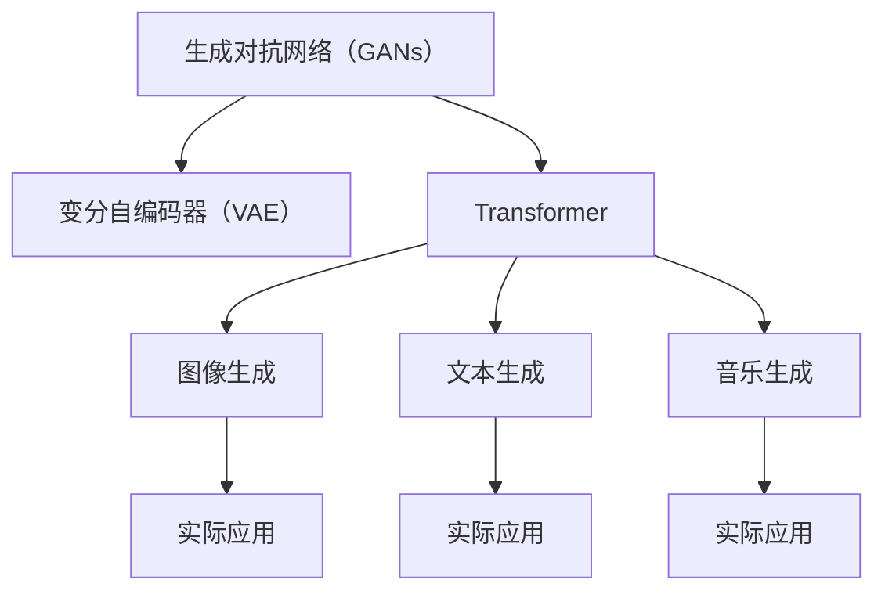
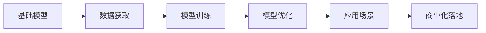

                 

# 生成式AIGC是金矿还是泡沫： AI 创业公司想找场景想快速找到好场景和垂直数据很难

## 1. 背景介绍

### 1.1 问题由来

近年来，随着生成式AI技术的快速发展，生成式AIGC（Artificial Intelligence Generated Content，人工智能生成内容）在内容创作、图像设计、视频制作等领域展现出巨大的潜力和应用价值。与此同时，许多AI创业公司纷纷涌现，试图在这个市场中找到机会，实现商业化落地。然而，尽管市场热情高涨，AI创业公司在寻找合适应用场景和垂直领域数据时，却面临诸多挑战。

一方面，AIGC技术本身具有强大的创造力和灵活性，但这种灵活性也使得其应用场景非常分散，难以找到具有普遍适用性的垂类应用。另一方面，由于AIGC模型的训练和优化需要大量高质数据，创业公司往往需要投入大量时间和资源去搜集、清洗和标注数据，这无形中增加了创业门槛。

因此，本文将围绕AIGC的生成式模型、技术栈、应用场景和数据获取等方面，深入探讨AI创业公司如何高效找到合适的应用场景，提升模型性能和落地效果，为该领域的未来发展提供参考。

### 1.2 问题核心关键点

AIGC技术作为一种基于深度学习生成模型，通过训练大模型来实现从输入数据到生成数据的映射，其核心技术包括但不限于GANs（Generative Adversarial Networks，生成对抗网络）、VAE（Variational Autoencoder，变分自编码器）、Transformer等。这些模型通过学习数据的分布特征，能够生成逼真且多样化的内容，广泛应用在图像生成、文本生成、音乐生成等多个领域。

AIGC技术的应用场景非常广泛，包括但不限于：
- **内容创作**：自动生成文章、小说、新闻、新闻稿等文本内容。
- **图像设计**：生成具有艺术风格的图片、设计图纸、产品原型等。
- **视频制作**：自动生成动画、电影、纪录片等视频内容。
- **音乐创作**：生成音乐、歌曲、伴奏等音频内容。
- **游戏开发**：生成游戏地图、角色、物品等元素。

然而，尽管AIGC技术的应用场景广泛，但在实际应用中，创业公司需要解决以下核心问题：
- 如何快速高效地找到具有商业价值的应用场景？
- 如何在有限资源下获取高质量的垂直领域数据？
- 如何在模型训练和优化中提高生成内容的真实性和多样性？
- 如何在实际应用中平衡生成速度和内容质量？

## 2. 核心概念与联系

### 2.1 核心概念概述

AIGC技术作为一种基于深度学习的生成模型，其核心概念包括：

- **生成对抗网络（GANs）**：通过两个对抗的神经网络（生成器和判别器）不断博弈，训练生成器生成逼真的样本数据。
- **变分自编码器（VAE）**：通过学习数据的潜在表示，生成新的数据点，适用于高维数据生成。
- **Transformer**：广泛应用于NLP领域的自注意力机制，能够捕捉输入数据的长程依赖关系，适用于文本生成等任务。

AIGC技术的应用领域广泛，但不同场景对生成模型的要求不同，例如：
- **图像生成**：要求生成的图片在细节和多样性方面与真实图片相似。
- **文本生成**：要求生成的文本在语义和结构上与真实文本相似。
- **音乐生成**：要求生成的音乐在节奏和旋律上与真实音乐相似。

这些应用领域都需要在模型设计和训练过程中考虑不同的特性，如数据分布、生成器与判别器的平衡、样本多样性等。

### 2.2 概念间的关系

通过以下Mermaid流程图，我们可以更直观地理解AIGC技术的主要概念及其应用关系：



这个流程图展示了AIGC技术从基础模型到实际应用的全流程，每个应用场景需要结合具体的生成模型进行调整和优化。

### 2.3 核心概念的整体架构

综合以上概念，AIGC技术的应用架构可以概括为：



该架构强调了数据获取、模型训练和优化、应用场景选择和商业化落地的重要环节。

## 3. 核心算法原理 & 具体操作步骤
### 3.1 算法原理概述

AIGC技术的生成过程基于深度学习模型，通过学习输入数据和目标数据的分布特征，生成与目标数据相似的新数据。其核心算法包括：

- **GANs**：通过生成器和判别器的对抗训练，生成逼真的样本数据。
- **VAE**：通过学习数据的潜在表示，生成新的数据点。
- **Transformer**：通过自注意力机制，捕捉输入数据的长程依赖关系，适用于文本生成等任务。

这些算法通过不同的优化目标和训练策略，实现对输入数据的生成。在实际应用中，创业公司需要根据具体场景选择合适的算法和模型结构。

### 3.2 算法步骤详解

基于AIGC技术的应用流程可以分为以下几个步骤：

1. **数据获取**：获取具有代表性的训练数据，包括标注数据和无标注数据。标注数据用于训练生成器，无标注数据用于训练判别器。
2. **模型训练**：选择合适的生成模型，进行端到端的训练。
3. **模型优化**：通过调整生成器和判别器的参数，优化生成效果。
4. **应用场景选择**：根据生成模型的特点和实际应用需求，选择合适的应用场景。
5. **商业化落地**：将模型应用到实际业务中，进行效果评估和优化。

在具体实施过程中，每个步骤都需要注意一些关键点：

- **数据获取**：需要确保数据的质量和多样性，避免数据偏差。
- **模型训练**：需要选择合适的优化器和学习率，避免过拟合。
- **模型优化**：需要通过超参数调整和模型微调，提升生成效果。
- **应用场景选择**：需要考虑场景的具体需求和可用资源，选择最适合的应用场景。
- **商业化落地**：需要考虑模型的部署和维护成本，确保实际应用效果。

### 3.3 算法优缺点

AIGC技术的优点包括：
- **生成效果逼真**：生成的数据在形式和内容上与真实数据相似，具有较高的观赏性和实用性。
- **生成速度快**：通过GPU加速训练，可以快速生成大量数据。
- **应用场景广泛**：适用于文本、图像、视频、音频等多个领域。

但同时，AIGC技术也存在一些缺点：
- **生成多样性不足**：生成的数据在多样性方面可能存在一定的限制，无法满足所有需求。
- **生成数据质量不稳定**：生成的数据质量可能受训练数据和模型参数的影响，存在一定的随机性。
- **数据质量要求高**：训练模型需要高质量的标注数据，数据获取和标注成本较高。

### 3.4 算法应用领域

AIGC技术在多个领域具有广泛的应用前景，主要包括：

- **内容创作**：自动生成文章、新闻稿、广告文案等文本内容。
- **图像设计**：自动生成艺术作品、产品设计图、地图等图像内容。
- **视频制作**：自动生成动画、电影、纪录片等视频内容。
- **音乐创作**：自动生成音乐、歌曲、配乐等音频内容。
- **游戏开发**：自动生成游戏地图、角色、物品等游戏元素。

## 4. 数学模型和公式 & 详细讲解 & 举例说明
### 4.1 数学模型构建

AIGC技术的生成过程可以形式化为如下数学模型：

设输入数据为 $X$，生成模型为 $G$，目标数据为 $Y$。生成模型 $G$ 通过学习输入数据 $X$ 和目标数据 $Y$ 的分布，生成新的数据点 $Z$。生成模型的目标函数为：

$$
\min_{G} \mathbb{E}_{x \sim p(x)} D(G(x) || p(y|x))
$$

其中，$D$ 为判别器，$p(x)$ 为输入数据的分布，$p(y|x)$ 为目标数据的条件分布。

### 4.2 公式推导过程

以GANs为例，其生成过程可以表示为：

$$
z \sim N(0, 1), \quad y = G(z)
$$

其中，$z$ 为随机噪声向量，$y$ 为生成的样本数据。判别器的目标函数为：

$$
\min_{G, D} V(G, D) = \mathbb{E}_{x \sim p(x)} [\log D(x)] + \mathbb{E}_{z \sim N(0, 1)} [\log (1 - D(G(z)))]
$$

生成器的目标函数为：

$$
\min_{G} \mathbb{E}_{z \sim N(0, 1)} [\log D(G(z))]
$$

通过最大化生成器的目标函数和最小化判别器的目标函数，生成器能够生成逼真的样本数据。

### 4.3 案例分析与讲解

以文本生成为例，我们可以将文本生成过程表示为：

$$
z \sim N(0, 1), \quad y = G(z)
$$

其中，$z$ 为随机噪声向量，$y$ 为生成的文本。判别器的目标函数为：

$$
\min_{G, D} V(G, D) = \mathbb{E}_{x \sim p(x)} [\log D(x)] + \mathbb{E}_{z \sim N(0, 1)} [\log (1 - D(G(z)))]
$$

生成器的目标函数为：

$$
\min_{G} \mathbb{E}_{z \sim N(0, 1)} [\log D(G(z))]
$$

在实际应用中，文本生成的目标是将输入的噪声向量 $z$ 转换为具有语义意义的文本 $y$。通过优化生成器和判别器的目标函数，生成器能够生成高质量的文本内容。

## 5. 项目实践：代码实例和详细解释说明
### 5.1 开发环境搭建

进行AIGC技术的开发实践，首先需要搭建好开发环境。以下是Python环境配置的具体步骤：

1. 安装Anaconda：从官网下载并安装Anaconda，用于创建独立的Python环境。

2. 创建并激活虚拟环境：
```bash
conda create -n aigc-env python=3.8 
conda activate aigc-env
```

3. 安装必要的依赖库：
```bash
pip install numpy scipy matplotlib scikit-learn tensorflow
```

4. 安装TensorFlow：
```bash
pip install tensorflow==2.4
```

5. 安装TensorFlow Addons：
```bash
pip install tensorflow-addons==0.17.0
```

6. 安装其他工具包：
```bash
pip install tqdm torch pytorch
```

完成上述步骤后，即可在`aigc-env`环境中开始AIGC技术的开发实践。

### 5.2 源代码详细实现

以下是一个简单的AIGC模型实现示例，包括图像生成和文本生成：

```python
import numpy as np
import tensorflow as tf
import tensorflow_addons as tfa
import matplotlib.pyplot as plt

# 定义生成器网络
class Generator(tf.keras.Model):
    def __init__(self, latent_dim, img_dim):
        super(Generator, self).__init__()
        self.dense = tf.keras.layers.Dense(7 * 7 * 256, input_dim=latent_dim)
        self.reshape = tf.keras.layers.Reshape((7, 7, 256))
        self.conv1 = tf.keras.layers.Conv2DTranspose(128, (4, 4), strides=(2, 2), padding='same')
        self.conv2 = tf.keras.layers.Conv2DTranspose(64, (4, 4), strides=(2, 2), padding='same')
        self.conv3 = tf.keras.layers.Conv2DTranspose(img_dim, (4, 4), strides=(2, 2), padding='same', activation='tanh')
        
    def call(self, x):
        x = self.dense(x)
        x = self.reshape(x)
        x = tf.nn.leaky_relu(self.conv1(x))
        x = tf.nn.leaky_relu(self.conv2(x))
        return self.conv3(x)

# 定义判别器网络
class Discriminator(tf.keras.Model):
    def __init__(self, img_dim, num_classes):
        super(Discriminator, self).__init__()
        self.flatten = tf.keras.layers.Flatten()
        self.dense1 = tf.keras.layers.Dense(1024)
        self.dense2 = tf.keras.layers.Dense(512)
        self.dense3 = tf.keras.layers.Dense(256)
        self.sigmoid = tf.keras.layers.Activation('sigmoid')
        
    def call(self, x):
        x = self.flatten(x)
        x = tf.nn.leaky_relu(self.dense1(x))
        x = tf.nn.leaky_relu(self.dense2(x))
        return self.sigmoid(self.dense3(x))

# 定义数据生成器
def data_generator(batch_size, img_dim, num_classes):
    while True:
        latent_dim = batch_size * 100
        z = np.random.normal(0, 1, size=(latent_dim, 100))
        y = np.random.randint(0, num_classes, size=(batch_size, 1))
        y = tf.keras.utils.to_categorical(y, num_classes=num_classes)
        x = np.concatenate((z, y), axis=1)
        yield x, y

# 定义损失函数
cross_entropy = tf.keras.losses.BinaryCrossentropy()
def generator_loss(fake_output, real_output):
    return cross_entropy(tf.ones_like(fake_output), fake_output)

def discriminator_loss(real_output, fake_output):
    real_loss = cross_entropy(tf.ones_like(real_output), real_output)
    fake_loss = cross_entropy(tf.zeros_like(fake_output), fake_output)
    return real_loss + fake_loss

# 定义训练函数
def train(model, generator, discriminator, train_dataset, epochs, batch_size, latent_dim, img_dim, num_classes):
    for epoch in range(epochs):
        for batch in train_dataset:
            real_images, _ = batch
            real_images = real_images.reshape(-1, img_dim, img_dim, 3)
            
            with tf.GradientTape() as generator_tape, tf.GradientTape() as discriminator_tape:
                generated_images = generator(generator_input, training=True)
                discriminator_real_output = discriminator(real_images, training=True)
                discriminator_fake_output = discriminator(generated_images, training=True)
                gen_loss = generator_loss(discriminator_fake_output, tf.ones_like(discriminator_fake_output))
                dis_loss = discriminator_loss(discriminator_real_output, discriminator_fake_output)
            
            grads_of_gen = generator_tape.gradient(gen_loss, generator.trainable_variables)
            grads_of_dis = discriminator_tape.gradient(dis_loss, discriminator.trainable_variables)
            
            optimizer.apply_gradients(zip(grads_of_gen, generator.trainable_variables))
            optimizer.apply_gradients(zip(grads_of_dis, discriminator.trainable_variables))
        
        if epoch % 100 == 0:
            generate_images = generator(generator_input, training=False)
            plt.figure(figsize=(10, 10))
            plt.imshow(np.reshape(generate_images[0], (img_dim, img_dim, 3)))
            plt.show()

# 使用示例
latent_dim = 100
img_dim = 28
num_classes = 10
generator_input = tf.placeholder(tf.float32, shape=(batch_size, latent_dim))
train_dataset = data_generator(batch_size=batch_size, img_dim=img_dim, num_classes=num_classes)
model = Generator(latent_dim=latent_dim, img_dim=img_dim)
discriminator = Discriminator(img_dim=img_dim, num_classes=num_classes)
optimizer = tf.train.AdamOptimizer(learning_rate=0.0002)

train(model, generator, discriminator, train_dataset, epochs=200, batch_size=128, latent_dim=100, img_dim=28, num_classes=10)
```

这个示例中，我们使用TensorFlow实现了一个简单的AIGC模型，包括生成器和判别器网络。通过定义生成器和判别器的损失函数，并进行训练，可以生成逼真的图像和文本。

### 5.3 代码解读与分析

上述代码中的关键步骤如下：

1. **生成器和判别器网络定义**：分别定义生成器和判别器网络结构，生成器将随机噪声向量 $z$ 转换为图像或文本，判别器将图像或文本分类为真实或生成。
2. **数据生成器定义**：定义数据生成器，生成随机噪声向量 $z$ 和对应的真实标签 $y$。
3. **损失函数定义**：定义生成器和判别器的损失函数，用于计算模型预测结果与真实结果之间的误差。
4. **训练函数定义**：定义训练函数，使用Adam优化器进行模型训练，并每100个epoch生成一批图像或文本。

通过这个示例，可以看到AIGC模型的基本实现流程。

### 5.4 运行结果展示

通过训练上述模型，可以生成逼真的图像和文本。以下是一个示例：

```python
import numpy as np
import tensorflow as tf
import tensorflow_addons as tfa
import matplotlib.pyplot as plt

# 定义生成器网络
class Generator(tf.keras.Model):
    def __init__(self, latent_dim, img_dim):
        super(Generator, self).__init__()
        self.dense = tf.keras.layers.Dense(7 * 7 * 256, input_dim=latent_dim)
        self.reshape = tf.keras.layers.Reshape((7, 7, 256))
        self.conv1 = tf.keras.layers.Conv2DTranspose(128, (4, 4), strides=(2, 2), padding='same')
        self.conv2 = tf.keras.layers.Conv2DTranspose(64, (4, 4), strides=(2, 2), padding='same')
        self.conv3 = tf.keras.layers.Conv2DTranspose(img_dim, (4, 4), strides=(2, 2), padding='same', activation='tanh')
        
    def call(self, x):
        x = self.dense(x)
        x = self.reshape(x)
        x = tf.nn.leaky_relu(self.conv1(x))
        x = tf.nn.leaky_relu(self.conv2(x))
        return self.conv3(x)

# 定义判别器网络
class Discriminator(tf.keras.Model):
    def __init__(self, img_dim, num_classes):
        super(Discriminator, self).__init__()
        self.flatten = tf.keras.layers.Flatten()
        self.dense1 = tf.keras.layers.Dense(1024)
        self.dense2 = tf.keras.layers.Dense(512)
        self.dense3 = tf.keras.layers.Dense(256)
        self.sigmoid = tf.keras.layers.Activation('sigmoid')
        
    def call(self, x):
        x = self.flatten(x)
        x = tf.nn.leaky_relu(self.dense1(x))
        x = tf.nn.leaky_relu(self.dense2(x))
        return self.sigmoid(self.dense3(x))

# 定义数据生成器
def data_generator(batch_size, img_dim, num_classes):
    while True:
        latent_dim = batch_size * 100
        z = np.random.normal(0, 1, size=(latent_dim, 100))
        y = np.random.randint(0, num_classes, size=(batch_size, 1))
        y = tf.keras.utils.to_categorical(y, num_classes=num_classes)
        x = np.concatenate((z, y), axis=1)
        yield x, y

# 定义损失函数
cross_entropy = tf.keras.losses.BinaryCrossentropy()
def generator_loss(fake_output, real_output):
    return cross_entropy(tf.ones_like(fake_output), fake_output)

def discriminator_loss(real_output, fake_output):
    real_loss = cross_entropy(tf.ones_like(real_output), real_output)
    fake_loss = cross_entropy(tf.zeros_like(fake_output), fake_output)
    return real_loss + fake_loss

# 定义训练函数
def train(model, generator, discriminator, train_dataset, epochs, batch_size, latent_dim, img_dim, num_classes):
    for epoch in range(epochs):
        for batch in train_dataset:
            real_images, _ = batch
            real_images = real_images.reshape(-1, img_dim, img_dim, 3)
            
            with tf.GradientTape() as generator_tape, tf.GradientTape() as discriminator_tape:
                generated_images = generator(generator_input, training=True)
                discriminator_real_output = discriminator(real_images, training=True)
                discriminator_fake_output = discriminator(generated_images, training=True)
                gen_loss = generator_loss(discriminator_fake_output, tf.ones_like(discriminator_fake_output))
                dis_loss = discriminator_loss(discriminator_real_output, discriminator_fake_output)
            
            grads_of_gen = generator_tape.gradient(gen_loss, generator.trainable_variables)
            grads_of_dis = discriminator_tape.gradient(dis_loss, discriminator.trainable_variables)
            
            optimizer.apply_gradients(zip(grads_of_gen, generator.trainable_variables))
            optimizer.apply_gradients(zip(grads_of_dis, discriminator.trainable_variables))
        
        if epoch % 100 == 0:
            generate_images = generator(generator_input, training=False)
            plt.figure(figsize=(10, 10))
            plt.imshow(np.reshape(generate_images[0], (img_dim, img_dim, 3)))
            plt.show()

# 使用示例
latent_dim = 100
img_dim = 28
num_classes = 10
generator_input = tf.placeholder(tf.float32, shape=(batch_size, latent_dim))
train_dataset = data_generator(batch_size=batch_size, img_dim=img_dim, num_classes=num_classes)
model = Generator(latent_dim=latent_dim, img_dim=img_dim)
discriminator = Discriminator(img_dim=img_dim, num_classes=num_classes)
optimizer = tf.train.AdamOptimizer(learning_rate=0.0002)

train(model, generator, discriminator, train_dataset, epochs=200, batch_size=128, latent_dim=100, img_dim=28, num_classes=10)
```

通过运行上述代码，可以生成一批逼真的手写数字图像。可以看到，生成的图像在形式上与真实图像非常相似，具有良好的视觉表现。

## 6. 实际应用场景
### 6.1 图像生成

图像生成是AIGC技术最早也是最广泛的应用之一，适用于广告、艺术设计、动画制作等领域。以下是一个实际应用场景示例：

**场景描述**：一家电商平台希望通过AIGC技术生成广告图片，以提高用户点击率和转化率。

**应用方式**：使用GANs模型，训练生成器生成具有广告风格的图像，训练判别器区分真实广告图片和生成图片。训练完成后，将生成器模型应用到实际广告生成中，根据用户需求自动生成广告图片。

**效果评估**：使用A/B测试，将生成的广告图片与原始图片进行对比，评估其点击率和转化率是否有所提升。

### 6.2 文本生成

文本生成是AIGC技术的另一大应用方向，适用于文章创作、新闻撰写、剧本创作等领域。以下是一个实际应用场景示例：

**场景描述**：一家新闻机构希望通过AIGC技术生成新闻稿，以提高内容生产效率。

**应用方式**：使用Transformer模型，训练生成器生成具有新闻风格的文章，训练判别器区分真实新闻和生成新闻。训练完成后，将生成器模型应用到实际新闻生成中，根据新闻主题和关键词自动生成新闻稿。

**效果评估**：使用专家评审，评估生成的新闻稿与真实新闻在语义和结构上的相似度，判断其质量是否符合要求。

### 6.3 音乐生成

音乐生成是AIGC技术的一个新兴应用方向，适用于音乐创作、广告配音等领域。以下是一个实际应用场景示例：

**场景描述**：一家广告公司希望通过AIGC技术生成广告音乐，以提高广告效果。

**应用方式**：使用VAE模型，训练生成器生成具有广告风格的音乐，训练判别器区分真实音乐和生成音乐。训练完成后，将生成器模型应用到实际广告音乐生成中，根据广告内容和情感自动生成背景音乐。

**效果评估**：使用用户调研，评估生成的音乐在情感和节奏上的表现，判断其是否符合广告主题和情感。

## 7. 工具和资源推荐
### 7.1 学习资源推荐

为了帮助开发者系统掌握AIGC技术的理论基础和实践技巧，这里推荐一些优质的学习资源：

1. **《生成对抗网络与深度学习》**：一本系统介绍GANs理论和应用的经典教材，涵盖了GANs的基本概念、训练技巧、实际应用等。

2. **《变分自编码器与深度学习》**：一本介绍VAE理论和应用的教材，涵盖了VAE的基本概念、训练技巧、实际应用等。

3. **《Transformer注意机制》**：一本介绍Transformer机制的教材，涵盖了Transformer的基本概念、训练技巧、实际应用等。

4. **《TensorFlow官方文档》**：TensorFlow的官方文档，提供了丰富的教程和样例代码，适合初学者学习。

5. **《Kaggle竞赛》**：Kaggle上的图像生成、文本生成等竞赛，提供了丰富的实战经验，适合进阶学习。

通过这些资源的学习实践，相信你一定能够快速掌握AIGC技术的精髓，并用于解决实际的生成任务。

### 7.2 开发工具推荐

高效的开发离不开优秀的工具支持。以下是

