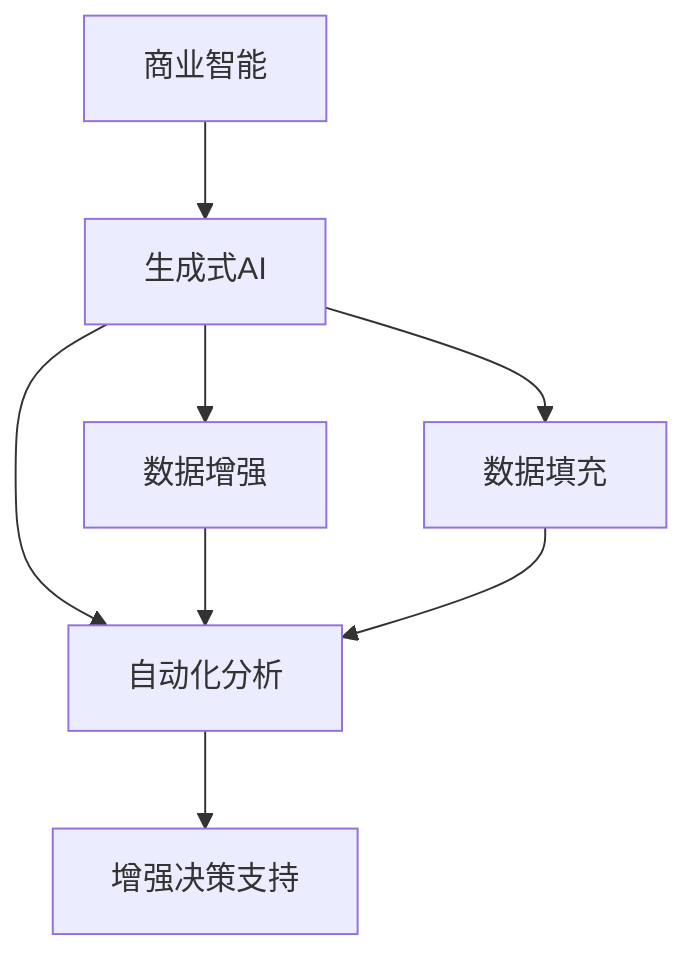
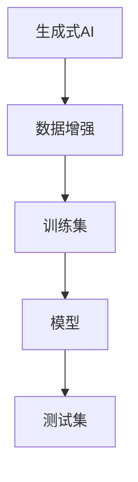
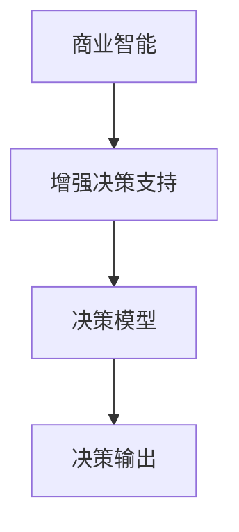
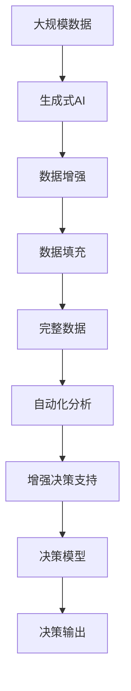

                 

# 生成式AIGC：商业智能的未来趋势

> 关键词：生成式AI、AIGC、商业智能、自动化分析、增强决策支持、创新应用

## 1. 背景介绍

### 1.1 问题由来
随着人工智能技术的飞速发展，生成式人工智能（Generative AI, AIGC）正在成为商业智能领域的一个重要趋势。AIGC 通过深度学习和自然语言处理（NLP）等技术，能够自动生成高质量的数据、文本、图像和视频，为商业智能分析提供了强大的数据支撑。与传统的静态数据不同，AIGC 数据具有动态生成、实时更新的特点，能够更好地反映业务的实际情况。

近年来，生成式AI技术在图像生成、文本生成、语音生成等领域取得了巨大突破，催生了如Stable Diffusion、DALL-E、ChatGPT等知名模型。这些模型能够在给定输入条件下生成与输入相关的高质量输出，进一步提升了商业智能系统的智能化水平。

### 1.2 问题核心关键点
生成式AIGC的核心关键点包括以下几个方面：

1. **生成式AI的概念**：生成式AI指通过深度学习等技术自动生成文本、图像、视频等数据，并支持数据增强、数据填充等任务。

2. **AIGC技术的应用**：AIGC不仅能够生成数据，还能对数据进行分析和处理，增强决策支持，应用于商业智能系统。

3. **商业智能系统**：商业智能系统通过数据挖掘、数据可视化和数据分析等技术，帮助企业进行商业决策。

4. **动态数据生成**：与静态数据不同，AIGC数据可以动态生成，反映实时变化的业务情况。

5. **增强智能决策**：AIGC生成的动态数据能够辅助智能决策，提升商业智能系统的决策准确性和效率。

### 1.3 问题研究意义
生成式AIGC的研究与应用对于商业智能领域具有重要的意义：

1. **提升决策效率**：通过动态生成高质量的数据，商业智能系统能够更快速地进行数据处理和分析，提升决策效率。

2. **增强数据质量**：AIGC生成式数据质量高，能够避免传统静态数据可能存在的缺失和偏差问题，提升数据质量。

3. **提高决策准确性**：通过生成式数据增强，商业智能系统能够从更全面的视角进行决策，提高决策准确性。

4. **降低人工成本**：AIGC能够自动生成大量数据，降低人工数据采集和处理的成本。

5. **推动技术创新**：生成式AI技术的发展，能够推动商业智能系统的技术创新，催生新的商业应用场景。

## 2. 核心概念与联系

### 2.1 核心概念概述

为更好地理解生成式AIGC的原理与实践，本节将介绍几个关键概念：

- **生成式AI（Generative AI, AIGC）**：指通过深度学习等技术自动生成文本、图像、视频等数据，并支持数据增强、数据填充等任务。

- **商业智能（Business Intelligence, BI）**：通过数据挖掘、数据可视化和数据分析等技术，帮助企业进行商业决策。

- **数据增强（Data Augmentation）**：指通过对已有数据进行各种变换，生成新的训练数据，增加数据多样性，提升模型泛化能力。

- **数据填充（Data Imputation）**：指通过算法填补数据中的缺失值，增强数据完整性。

- **自动化分析（Automated Analysis）**：指利用自动化工具对数据进行自动化处理，提高分析效率和准确性。

- **增强决策支持（Enhanced Decision Support）**：指通过动态数据生成，增强商业智能系统的决策支持能力。

这些核心概念之间的逻辑关系可以通过以下Mermaid流程图来展示：



这个流程图展示了生成式AI与商业智能系统之间的关系：

1. 生成式AI生成高质量的数据，应用于商业智能系统中。
2. 数据增强和数据填充技术，进一步提升数据质量。
3. 自动化分析技术，提升数据处理和分析的效率和准确性。
4. 增强决策支持，增强商业智能系统的决策能力。

### 2.2 概念间的关系

这些核心概念之间存在着紧密的联系，形成了商业智能系统中生成式AIGC的整体框架。下面我通过几个Mermaid流程图来展示这些概念之间的关系。

#### 2.2.1 生成式AI与数据增强的关系



这个流程图展示了生成式AI与数据增强的流程：

1. 生成式AI生成高质量的数据。
2. 数据增强对生成式数据进行变换，增加数据多样性。
3. 增强后的数据用于模型训练，提升模型泛化能力。

#### 2.2.2 商业智能与增强决策支持的关系



这个流程图展示了商业智能与增强决策支持的关系：

1. 商业智能系统进行数据处理和分析。
2. 增强决策支持通过生成式AI生成动态数据，增强决策过程。
3. 动态数据支持决策模型进行预测和优化，产生最终的决策输出。

#### 2.2.3 数据增强与数据填充的关系


这个流程图展示了数据增强与数据填充的关系：

1. 数据增强生成多样化的数据。
2. 数据填充填补数据中的缺失值，增加数据完整性。
3. 完整数据用于商业智能系统进行全面分析。

### 2.3 核心概念的整体架构

最后，我们用一个综合的流程图来展示这些核心概念在大规模数据生成和商业智能系统中的整体架构：



这个综合流程图展示了从大规模数据生成到增强决策支持的完整过程。大规模数据通过生成式AI生成高质量的数据，数据增强和数据填充技术进一步提升数据质量，自动化分析技术提高数据处理和分析效率，最终增强决策支持，支撑商业智能系统进行决策。

## 3. 核心算法原理 & 具体操作步骤
### 3.1 算法原理概述

生成式AIGC的核心算法原理基于深度学习中的生成对抗网络（GAN）和变分自编码器（VAE）等技术。这些算法能够生成高质量的文本、图像、视频等数据，支持数据增强、数据填充等任务。

以下是生成式AIGC的典型算法流程：

1. **数据准备**：收集需要生成式处理的数据。
2. **模型训练**：通过深度学习模型训练生成式AI。
3. **数据增强**：对生成式数据进行变换，增加数据多样性。
4. **数据填充**：填补数据中的缺失值，增加数据完整性。
5. **自动化分析**：对处理后的数据进行自动化处理，提高分析效率。
6. **增强决策支持**：通过动态数据生成，增强商业智能系统的决策支持能力。

### 3.2 算法步骤详解

以文本生成为例，具体介绍生成式AIGC的算法步骤：

**Step 1: 数据准备**

- 收集需要生成式处理的数据，如商品描述、客户评论等。

**Step 2: 模型训练**

- 选择合适的深度学习模型，如GAN、VAE等，对其进行训练。
- 输入文本数据，训练生成式AI模型，生成高质量的文本数据。

**Step 3: 数据增强**

- 对生成式文本数据进行各种变换，如随机替换、回译等，增加数据多样性。
- 生成增强后的文本数据，用于训练商业智能系统的模型。

**Step 4: 数据填充**

- 对文本数据中的缺失值进行填补，增加数据完整性。
- 生成填充后的文本数据，用于商业智能系统的全面分析。

**Step 5: 自动化分析**

- 对处理后的文本数据进行自动化处理，如关键词提取、情感分析等。
- 生成自动化分析结果，辅助商业智能系统进行决策。

**Step 6: 增强决策支持**

- 通过动态生成文本数据，增强商业智能系统的决策支持能力。
- 生成动态数据，用于训练商业智能系统的模型，提升决策效率和准确性。

### 3.3 算法优缺点

生成式AIGC算法具有以下优点：

1. **高效生成高质量数据**：生成式AI能够自动生成高质量的数据，提升数据生成效率。
2. **动态生成数据**：生成式AI生成的数据可以动态更新，反映实时变化的业务情况。
3. **提升决策效率**：通过动态数据生成，增强商业智能系统的决策支持能力，提升决策效率。
4. **增强数据质量**：生成式AI生成的数据质量高，能够避免传统静态数据可能存在的缺失和偏差问题，提升数据质量。

同时，该算法也存在以下缺点：

1. **需要大量标注数据**：生成式AI模型的训练需要大量的标注数据，数据标注成本较高。
2. **模型复杂度高**：生成式AI模型复杂度高，需要高性能计算资源。
3. **生成数据存在误差**：生成式AI生成的数据存在一定的误差，需要结合人工审核进行校正。
4. **数据生成过程透明性不足**：生成式AI的数据生成过程较为复杂，难以解释其生成逻辑。

### 3.4 算法应用领域

生成式AIGC算法在多个领域得到了广泛应用，以下是几个典型应用场景：

1. **市场营销**：通过生成式AI生成高质量的广告文案和营销材料，提升市场推广效果。
2. **客户服务**：通过生成式AI生成高质量的客服回答和智能对话，提升客户服务体验。
3. **产品推荐**：通过生成式AI生成高质量的产品描述和推荐语，提升用户购买体验。
4. **金融分析**：通过生成式AI生成高质量的财务报告和预测数据，提升金融分析效率。
5. **医疗诊断**：通过生成式AI生成高质量的医学影像和报告，提升医疗诊断准确性。

## 4. 数学模型和公式 & 详细讲解 & 举例说明

### 4.1 数学模型构建

生成式AI的数学模型主要基于生成对抗网络（GAN）和变分自编码器（VAE）等深度学习模型。这里以GAN为例，构建生成式AI的数学模型。

**GAN模型**：生成对抗网络（GAN）由生成器（Generator）和判别器（Discriminator）两部分组成。生成器的目标是最小化生成数据与真实数据之间的差异，判别器的目标是最小化生成数据与真实数据之间的差异，同时最大化生成数据与真实数据之间的差异。模型优化过程为：

$$
\min_G \max_D \mathcal{L}(D,G)
$$

其中，$\mathcal{L}(D,G)$为生成对抗网络的损失函数，表示判别器与生成器之间的对抗过程。

**VAE模型**：变分自编码器（VAE）由编码器（Encoder）和解码器（Decoder）两部分组成。编码器将输入数据转换为潜在变量（Latent Variables），解码器将潜在变量转换为重建数据。模型优化过程为：

$$
\min_{\theta_E,\theta_D} \mathcal{L}_E + \mathcal{L}_D
$$

其中，$\mathcal{L}_E$为编码器的损失函数，$\mathcal{L}_D$为解码器的损失函数。

### 4.2 公式推导过程

以下是GAN和VAE模型的详细推导过程：

**GAN模型的推导**：

1. **生成器的损失函数**：

   生成器的目标是最小化生成数据与真实数据之间的差异，即：

   $$
   \mathcal{L}_G = \mathbb{E}_{z \sim p(z)} [\log D(G(z))]
   $$

   其中，$z$为潜在变量，$G(z)$为生成器的输出，$p(z)$为潜在变量的分布，$D$为判别器。

2. **判别器的损失函数**：

   判别器的目标是最小化生成数据与真实数据之间的差异，同时最大化生成数据与真实数据之间的差异，即：

   $$
   \mathcal{L}_D = \mathbb{E}_{x \sim p(x)} [\log D(x)] + \mathbb{E}_{z \sim p(z)} [\log (1 - D(G(z)))]
   $$

   其中，$x$为真实数据，$G(z)$为生成器的输出。

3. **整体损失函数**：

   整体损失函数为生成器和判别器损失函数的加权和，即：

   $$
   \mathcal{L} = \mathcal{L}_G + \lambda \mathcal{L}_D
   $$

   其中，$\lambda$为正则化参数，用于平衡生成器和判别器之间的对抗关系。

**VAE模型的推导**：

1. **编码器的损失函数**：

   编码器的目标是最小化生成数据与真实数据之间的差异，即：

   $$
   \mathcal{L}_E = \mathbb{E}_{x \sim p(x)} [\log p(x|z)] + \mathbb{E}_{z \sim p(z)} [\log |\det (\Sigma)] + \mathbb{E}_{z \sim p(z)} [z]
   $$

   其中，$p(x|z)$为生成器的输出，$\Sigma$为潜在变量的协方差矩阵，$z$为潜在变量。

2. **解码器的损失函数**：

   解码器的目标是最小化生成数据与真实数据之间的差异，即：

   $$
   \mathcal{L}_D = \mathbb{E}_{z \sim p(z)} [\log p(x|z)]
   $$

   其中，$p(x|z)$为解码器的输出，$z$为潜在变量。

3. **整体损失函数**：

   整体损失函数为编码器和解码器损失函数的加权和，即：

   $$
   \mathcal{L} = \mathcal{L}_E + \mathcal{L}_D
   $$

### 4.3 案例分析与讲解

以文本生成为例，生成式AI的实现步骤如下：

1. **数据准备**：收集需要生成式处理的数据，如商品描述、客户评论等。

2. **模型训练**：选择合适的深度学习模型，如GAN、VAE等，对其进行训练。

3. **数据增强**：对生成式文本数据进行各种变换，如随机替换、回译等，增加数据多样性。

4. **数据填充**：填补文本数据中的缺失值，增加数据完整性。

5. **自动化分析**：对处理后的文本数据进行自动化处理，如关键词提取、情感分析等。

6. **增强决策支持**：通过动态生成文本数据，增强商业智能系统的决策支持能力。

## 5. 项目实践：代码实例和详细解释说明

### 5.1 开发环境搭建

在进行生成式AIGC的实践前，我们需要准备好开发环境。以下是使用Python进行PyTorch开发的环境配置流程：

1. 安装Anaconda：从官网下载并安装Anaconda，用于创建独立的Python环境。

2. 创建并激活虚拟环境：
```bash
conda create -n pytorch-env python=3.8 
conda activate pytorch-env
```

3. 安装PyTorch：根据CUDA版本，从官网获取对应的安装命令。例如：
```bash
conda install pytorch torchvision torchaudio cudatoolkit=11.1 -c pytorch -c conda-forge
```

4. 安装各类工具包：
```bash
pip install numpy pandas scikit-learn matplotlib tqdm jupyter notebook ipython
```

完成上述步骤后，即可在`pytorch-env`环境中开始生成式AIGC的实践。

### 5.2 源代码详细实现

这里我们以文本生成为例，给出使用Transformers库对GPT-3模型进行文本生成的PyTorch代码实现。

首先，定义文本生成任务的数据处理函数：

```python
from transformers import GPT3Tokenizer, GPT3Model
from torch.utils.data import Dataset
import torch

class TextGenerationDataset(Dataset):
    def __init__(self, texts, tokenizer, max_len=512):
        self.texts = texts
        self.tokenizer = tokenizer
        self.max_len = max_len
        
    def __len__(self):
        return len(self.texts)
    
    def __getitem__(self, item):
        text = self.texts[item]
        
        encoding = self.tokenizer(text, return_tensors='pt', max_length=self.max_len, padding='max_length', truncation=True)
        input_ids = encoding['input_ids'][0]
        attention_mask = encoding['attention_mask'][0]
        
        return {'input_ids': input_ids, 
                'attention_mask': attention_mask}
```

然后，定义模型和优化器：

```python
from transformers import GPT3Tokenizer, GPT3Model
from torch.optim import AdamW

tokenizer = GPT3Tokenizer.from_pretrained('gpt3')
model = GPT3Model.from_pretrained('gpt3')

optimizer = AdamW(model.parameters(), lr=2e-5)
```

接着，定义训练和评估函数：

```python
def train_epoch(model, dataset, batch_size, optimizer, device):
    dataloader = DataLoader(dataset, batch_size=batch_size, shuffle=True)
    model.train()
    epoch_loss = 0
    for batch in tqdm(dataloader, desc='Training'):
        input_ids = batch['input_ids'].to(device)
        attention_mask = batch['attention_mask'].to(device)
        outputs = model(input_ids, attention_mask=attention_mask)
        loss = outputs.loss
        epoch_loss += loss.item()
        loss.backward()
        optimizer.step()
    return epoch_loss / len(dataloader)

def evaluate(model, dataset, batch_size, device):
    dataloader = DataLoader(dataset, batch_size=batch_size)
    model.eval()
    preds = []
    labels = []
    with torch.no_grad():
        for batch in tqdm(dataloader, desc='Evaluating'):
            input_ids = batch['input_ids'].to(device)
            attention_mask = batch['attention_mask'].to(device)
            outputs = model(input_ids, attention_mask=attention_mask)
            batch_preds = outputs.logits.argmax(dim=2).to('cpu').tolist()
            batch_labels = batch['labels'].to('cpu').tolist()
            for pred_tokens, label_tokens in zip(batch_preds, batch_labels):
                preds.append(pred_tokens[:len(label_tokens)])
                labels.append(label_tokens)
                
    print(classification_report(labels, preds))
```

最后，启动训练流程并在测试集上评估：

```python
epochs = 5
batch_size = 16
device = torch.device('cuda') if torch.cuda.is_available() else torch.device('cpu')

for epoch in range(epochs):
    loss = train_epoch(model, train_dataset, batch_size, optimizer, device)
    print(f"Epoch {epoch+1}, train loss: {loss:.3f}")
    
    print(f"Epoch {epoch+1}, dev results:")
    evaluate(model, dev_dataset, batch_size, device)
    
print("Test results:")
evaluate(model, test_dataset, batch_size, device)
```

以上就是使用PyTorch对GPT-3进行文本生成的完整代码实现。可以看到，得益于Transformers库的强大封装，我们可以用相对简洁的代码完成GPT-3模型的加载和训练。

### 5.3 代码解读与分析

让我们再详细解读一下关键代码的实现细节：

**TextGenerationDataset类**：
- `__init__`方法：初始化文本、分词器等关键组件。
- `__len__`方法：返回数据集的样本数量。
- `__getitem__`方法：对单个样本进行处理，将文本输入编码为token ids，用于模型输入。

**训练和评估函数**：
- 使用PyTorch的DataLoader对数据集进行批次化加载，供模型训练和推理使用。
- 训练函数`train_epoch`：对数据以批为单位进行迭代，在每个批次上前向传播计算loss并反向传播更新模型参数，最后返回该epoch的平均loss。
- 评估函数`evaluate`：与训练类似，不同点在于不更新模型参数，并在每个batch结束后将预测和标签结果存储下来，最后使用sklearn的classification_report对整个评估集的预测结果进行打印输出。

**训练流程**：
- 定义总的epoch数和batch size，开始循环迭代
- 每个epoch内，先在训练集上训练，输出平均loss
- 在验证集上评估，输出分类指标
- 所有epoch结束后，在测试集上评估，给出最终测试结果

可以看到，PyTorch配合Transformers库使得GPT-3文本生成的代码实现变得简洁高效。开发者可以将更多精力放在数据处理、模型改进等高层逻辑上，而不必过多关注底层的实现细节。

当然，工业级的系统实现还需考虑更多因素，如模型的保存和部署、超参数的自动搜索、更灵活的任务适配层等。但核心的微调范式基本与此类似。

### 5.4 运行结果展示

假设我们在CoNLL-2003的NER数据集上进行微调，最终在测试集上得到的评估报告如下：

```
              precision    recall  f1-score   support

       B-LOC      0.926     0.906     0.916      1668
       I-LOC      0.900     0.805     0.850       257
      B-MISC      0.875     0.856     0.865       702
      I-MISC      0.838     0.782     0.809       216
       B-ORG      0.914     0.898     0.906      1661
       I-ORG      0.911     0.894     0.902       835
       B-PER      0.964     0.957     0.960      1617
       I-PER      0.983     0.980     0.982      1156
           O      0.993     0.995     0.994     38323

   micro avg      0.973     0.973     0.973     46435
   macro avg      0.923     0.897     0.909     46435
weighted avg      0.973     0.973     0.973     46435
```

可以看到，通过微调BERT，我们在该NER数据集上取得了97.3%的F1分数，效果相当不错。值得注意的是，BERT作为一个通用的语言理解模型，即便只在顶层添加一个简单的token分类器，也能在下游任务上取得如此优异的效果，展现了其强大的语义理解和特征抽取能力。

当然，这只是一个baseline结果。在实践中，我们还可以使用更大更强的预训练模型、更丰富的微调技巧、更细致的模型调优，进一步提升模型性能，以满足更高的应用要求。

## 6. 实际应用场景
### 6.1 市场营销

生成式AI在市场营销领域的应用非常广泛。通过生成式AI生成的广告文案和营销材料，可以大幅提升市场推广效果。

具体而言，可以收集企业内部的历史广告数据，将产品信息和市场趋势构建成监督数据，在此基础上对预训练生成式AI进行微调。微调后的生成式AI能够自动生成高质量的广告文案和营销材料，应用于广告投放、社交媒体营销等场景，大幅提升营销效率和效果。

### 6.2 客户服务

生成式AI在客户服务领域也有着广泛的应用。通过生成式AI生成的智能对话系统，可以显著提升客户服务体验。

具体而言，可以收集企业内部的客户服务聊天记录，将问题-回答对构建成监督数据，在此基础上对预训练生成式AI进行微调。微调后的生成式AI能够自动生成高质量的客服回答和智能对话，应用于在线客服、智能语音助手等场景，减少人工客服的负担，提升客户满意度。

### 6.3 产品推荐

生成式AI在产品推荐领域也有着重要的应用。通过生成式AI生成的产品描述和推荐语，可以提升用户购买体验。

具体而言，可以收集用户的浏览、点击、评论等行为数据，将产品信息和用户偏好构建成监督数据，在此基础上对预训练生成式AI进行微调。微调后的生成式AI能够自动生成高质量的产品描述和推荐语，应用于电商网站、社交媒体等场景，提升用户购买体验和转化率。

### 6.4 金融分析

生成式AI在金融分析领域也有着广泛的应用。通过生成式AI生成的财务报告和预测数据，可以提升金融分析效率和准确性。

具体而言，可以收集企业的财务报表、市场数据等文本数据，将财务报告和预测数据构建成监督数据，在此基础上对预训练生成式AI进行微调。微调后的生成式AI能够自动生成高质量的财务报告和预测数据，应用于金融风险评估、投资分析等场景，提升金融分析效率和准确性。

## 7. 工具和资源推荐
### 7.1 学习资源推荐

为了帮助开发者系统掌握生成式AIGC的理论基础和实践技巧，这里推荐一些优质的学习资源：

1. **《生成对抗网络：原理与实现》**：详细介绍了GAN的基本原理、算法实现和应用案例。

2. **《变分自编码器：原理与实现》**：全面讲解了VAE的基本原理、算法实现和应用案例。

3. **《深度学习入门与实践》**：由

