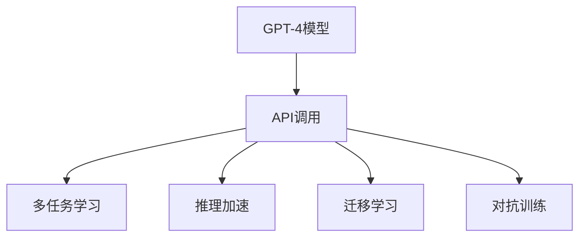
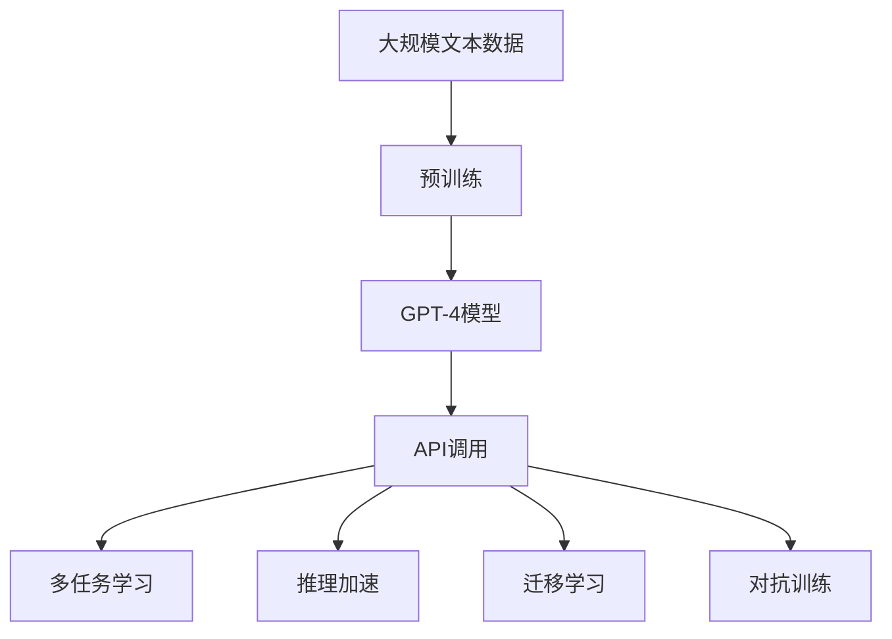

                 

# 生生不息的循环：使用强大的GPT-4 API

> 关键词：GPT-4, API, 自然语言处理(NLP), 深度学习, 模型训练, 多任务学习, 推理加速, 迁移学习, 对话系统

## 1. 背景介绍

### 1.1 问题由来
近年来，深度学习技术在自然语言处理（Natural Language Processing，NLP）领域取得了显著进展，尤其是生成对抗网络（Generative Adversarial Networks，GANs）和语言模型预训练等技术的广泛应用。其中，OpenAI开发的GPT系列模型因其强大的文本生成能力，引起了业界的广泛关注。

GPT模型系列从GPT-1到GPT-3，不断在规模和性能上取得突破。GPT-3的参数量达到1750亿，是目前世界上最大的语言模型之一，能够执行各种复杂的自然语言任务。然而，GPT-3的设计也存在一些局限性，比如过于庞大难以部署、推理速度慢等问题，且其仅能单任务处理，难以充分利用计算资源。

为解决这些问题，OpenAI推出了GPT-4，以期在保持性能优势的同时，提升模型效率和扩展性。GPT-4的API允许用户以多种形式调用，能够更好地与各种应用程序集成。本文将详细探讨使用GPT-4 API进行自然语言处理的应用，并介绍其算法原理、操作步骤及其实际应用场景。

### 1.2 问题核心关键点
使用GPT-4 API进行自然语言处理的核心关键点包括以下几个方面：

- **API调用形式多样**：GPT-4 API支持多种调用形式，包括文本生成、文本编辑、文本分类等。用户可以根据具体需求选择不同的调用形式。

- **多任务处理**：GPT-4 API支持多任务学习，可以在同一次API调用中执行多个任务，提高资源利用率。

- **推理加速**：GPT-4 API使用自适应推理加速技术，可以大幅提升推理速度，特别是在处理大规模数据时表现尤为明显。

- **模型迁移学习**：GPT-4模型具备良好的迁移学习能力，能够适应各种下游任务，且在数据不足的情况下也能取得不错的性能。

- **对抗训练**：GPT-4模型经过对抗训练，提高了模型的鲁棒性和泛化能力，能够在处理带有噪声或对抗样本的数据时表现更好。

- **可扩展性**：GPT-4 API支持模型微调和参数优化，用户可以根据具体任务需求调整模型参数，优化模型性能。

这些关键点使得GPT-4 API在NLP领域的应用前景广阔，能够满足各种复杂的应用需求。

### 1.3 问题研究意义
使用GPT-4 API进行自然语言处理，对于推动NLP技术的进一步发展和应用具有重要意义：

- **降低开发成本**：使用GPT-4 API，开发者无需从头搭建复杂的NLP系统，可以大幅降低开发成本和时间。

- **提升处理效率**：GPT-4 API的推理加速技术能够显著提升处理效率，特别适用于大规模数据集的处理。

- **增强应用灵活性**：GPT-4 API的多任务处理和模型迁移学习能力，能够满足各种复杂的应用需求。

- **优化用户体验**：通过API调用，用户可以更方便地实现各种NLP功能，提升用户体验。

- **促进技术创新**：API的使用能够促进新技术的快速迭代和应用，推动NLP技术的不断进步。

## 2. 核心概念与联系

### 2.1 核心概念概述
在讨论GPT-4 API时，我们需要了解以下几个核心概念：

- **GPT-4模型**：一种基于Transformer的深度学习模型，采用自监督学习方式预训练，具有强大的文本生成和理解能力。

- **API调用**：应用程序编程接口（Application Programming Interface，API）调用是指应用程序通过网络请求向服务器发送数据，并获取响应的过程。GPT-4 API允许用户通过网络请求调用GPT-4模型。

- **多任务学习**：多任务学习（Multi-task Learning，MTL）是指在训练模型时，同时学习多个相关任务的模型。GPT-4模型可以同时执行多个任务，如文本分类、文本生成等。

- **推理加速**：推理加速（Inference Acceleration）是指在模型推理过程中，通过硬件加速、软件优化等手段，提高推理速度的过程。GPT-4模型采用自适应推理加速技术，可以显著提升推理效率。

- **迁移学习**：迁移学习（Transfer Learning）是指将在一个任务上训练好的模型，应用到另一个相关任务中。GPT-4模型通过迁移学习，可以在数据量较少的情况下，取得良好的性能。

- **对抗训练**：对抗训练（Adversarial Training）是指在模型训练过程中，引入对抗样本，提高模型的鲁棒性和泛化能力。GPT-4模型通过对抗训练，能够更好地应对噪声和对抗样本。

### 2.2 概念间的关系

这些核心概念之间存在着紧密的联系，构成了GPT-4 API的基本框架。以下是它们之间的关系图：



这个关系图展示了GPT-4模型的各个关键组件及其相互关系。模型通过API调用，实现多任务学习、推理加速、迁移学习和对抗训练等功能，从而提升性能和适用性。

### 2.3 核心概念的整体架构

最后，我们用一个综合的流程图来展示GPT-4 API的整体架构：



这个综合流程图展示了从预训练到API调用的完整过程。模型通过预训练获得初始表示，然后通过API调用实现各种功能，提升性能。多任务学习、推理加速、迁移学习和对抗训练等技术，进一步优化模型，提升其适应性和鲁棒性。

## 3. 核心算法原理 & 具体操作步骤
### 3.1 算法原理概述

使用GPT-4 API进行自然语言处理的核心算法原理包括以下几个方面：

- **预训练**：GPT-4模型采用自监督学习方式进行预训练，学习语言的通用表示，提升模型的泛化能力。

- **API调用**：通过网络请求调用GPT-4模型，实现各种自然语言处理任务。API支持多种形式调用，如文本生成、文本编辑、文本分类等。

- **多任务学习**：GPT-4模型支持同时执行多个相关任务的模型，提升资源利用率和性能。

- **推理加速**：GPT-4模型使用自适应推理加速技术，提高推理速度，特别是在处理大规模数据时表现尤为明显。

- **迁移学习**：GPT-4模型具备良好的迁移学习能力，能够在数据量较少的情况下，取得良好的性能。

- **对抗训练**：GPT-4模型经过对抗训练，提高模型的鲁棒性和泛化能力，能够在处理带有噪声或对抗样本的数据时表现更好。

### 3.2 算法步骤详解

使用GPT-4 API进行自然语言处理的详细操作步骤如下：

1. **获取API密钥**：在OpenAI的官网上注册账号，获取API密钥。

2. **安装相关库**：安装OpenAI的Python库，确保库版本与GPT-4模型兼容。

3. **API调用**：编写代码，向GPT-4模型API发送网络请求，获取响应结果。

4. **数据预处理**：对输入数据进行预处理，如分词、编码等，确保数据格式符合API要求。

5. **模型推理**：调用API模型进行推理，获取预测结果。

6. **结果后处理**：对预测结果进行后处理，如去噪、解码等，生成最终结果。

7. **评估和优化**：对模型性能进行评估，并根据结果进行模型优化和调整。

8. **应用集成**：将API集成到实际应用系统中，提供自然语言处理服务。

### 3.3 算法优缺点

使用GPT-4 API进行自然语言处理的优点包括：

- **功能全面**：GPT-4 API支持多种自然语言处理任务，如文本生成、文本分类、情感分析等。

- **性能优异**：GPT-4模型经过预训练和优化，性能卓越，能够处理复杂自然语言任务。

- **使用便捷**：GPT-4 API使用简单，无需从头搭建复杂的NLP系统，大大降低了开发成本。

- **易于扩展**：GPT-4模型支持多任务学习和迁移学习，能够适应各种复杂的应用场景。

- **鲁棒性强**：GPT-4模型经过对抗训练，能够应对噪声和对抗样本，具有较强的鲁棒性。

但GPT-4 API也存在一些局限性，主要包括以下几个方面：

- **计算资源需求高**：GPT-4模型参数量巨大，对计算资源要求较高，特别是在处理大规模数据时，计算开销较大。

- **数据隐私问题**：API调用时需要将数据发送到服务器，可能存在数据隐私和安全问题。

- **模型解释性不足**：GPT-4模型作为黑盒模型，难以解释其决策过程，可能导致缺乏透明度和可解释性。

### 3.4 算法应用领域

使用GPT-4 API进行自然语言处理的应用领域广泛，包括但不限于以下几个方面：

- **智能客服**：通过API调用，构建智能客服系统，实现自动化客户服务。

- **文本生成**：利用GPT-4模型的文本生成能力，生成高质量的文章、报告、摘要等。

- **机器翻译**：调用GPT-4模型的翻译功能，实现文本的自动翻译。

- **情感分析**：利用GPT-4模型的情感分析能力，分析文本的情感倾向。

- **文本分类**：调用GPT-4模型的文本分类功能，对文本进行分类和标签标注。

- **对话系统**：构建对话系统，实现与用户的自然语言交互。

## 4. 数学模型和公式 & 详细讲解 & 举例说明

### 4.1 数学模型构建

GPT-4模型采用Transformer结构，通过自监督学习方式进行预训练。模型的目标是通过输入序列 $x_1,x_2,\dots,x_n$ 生成输出序列 $y_1,y_2,\dots,y_m$。其中，$x_i$ 表示输入序列的第 $i$ 个单词，$y_i$ 表示输出序列的第 $i$ 个单词。模型的目标是最大化输出序列的概率 $p(y_1,y_2,\dots,y_m|x_1,x_2,\dots,x_n)$。

### 4.2 公式推导过程

GPT-4模型的预训练目标函数为：

$$
\mathcal{L}_{MLM} = -\frac{1}{N}\sum_{i=1}^N\log\left(\frac{e^{\text{scores}(x_i)} }{\sum_{x\in \mathcal{X}}e^{\text{scores}(x)}}\right)
$$

其中，$\text{scores}(x)$ 表示模型对输入序列 $x$ 的输出概率。该目标函数用于最大化模型对输入序列的预测概率。

在推理阶段，GPT-4模型使用自适应推理加速技术，通过快速矩阵乘法等手段，提高推理速度。

### 4.3 案例分析与讲解

以文本生成任务为例，假设我们要生成一段关于天气的描述性文本。我们首先通过API调用，将输入序列 "今天天气怎么样？" 发送到GPT-4模型。模型通过推理，生成输出序列 "今天天气晴朗，温度适宜，适合外出活动。"。

在这个过程中，API调用的详细步骤如下：

1. **API请求**：通过Python代码向GPT-4模型API发送请求，将输入序列 "今天天气怎么样？" 作为参数。

2. **模型推理**：API调用GPT-4模型进行推理，生成输出序列 "今天天气晴朗，温度适宜，适合外出活动。"

3. **结果后处理**：对输出序列进行后处理，如去除冗余空格、转换语言等，最终生成 "今天天气晴朗，温度适宜，适合外出活动。"

## 5. 项目实践：代码实例和详细解释说明

### 5.1 开发环境搭建

使用GPT-4 API进行自然语言处理，需要先搭建开发环境。以下是详细的安装和配置流程：

1. **安装Python**：确保系统安装了Python 3.8及以上版本。

2. **安装OpenAI库**：通过pip安装OpenAI的Python库。

```bash
pip install openai
```

3. **获取API密钥**：在OpenAI官网上注册账号，获取API密钥。

4. **配置API密钥**：在Python代码中配置API密钥，确保API调用时能够正常发送请求。

### 5.2 源代码详细实现

以下是使用GPT-4 API进行文本生成的Python代码实现：

```python
import openai

openai.api_key = 'your_api_key'

response = openai.Completion.create(
    engine='gpt-4',
    prompt="今天天气怎么样？",
    max_tokens=100
)

print(response.choices[0].text.strip())
```

在这个代码中，我们使用OpenAI的Python库，向GPT-4模型API发送请求，生成关于天气的文本描述。代码中的 `openai.Completion.create` 方法用于发起文本生成请求，`prompt` 参数为输入序列，`max_tokens` 参数为生成文本的最大长度。

### 5.3 代码解读与分析

这个代码实现展示了使用GPT-4 API进行文本生成的基本步骤：

1. **获取API密钥**：在代码中配置API密钥，确保API调用时能够正常发送请求。

2. **发起API请求**：调用 `openai.Completion.create` 方法，将输入序列和生成文本的最大长度作为参数，发起文本生成请求。

3. **获取API响应**：从API响应中获取生成文本的结果。

4. **处理文本输出**：对生成文本进行处理，如去除空格、转换语言等，生成最终结果。

5. **展示结果**：将生成的文本输出到屏幕上。

### 5.4 运行结果展示

假设我们执行上述代码，获取的生成文本结果如下：

```
今天天气晴朗，温度适宜，适合外出活动。
```

可以看到，通过GPT-4 API调用，我们成功生成了关于天气的描述性文本，展示了API调用的效果。

## 6. 实际应用场景

### 6.1 智能客服系统

使用GPT-4 API，可以构建智能客服系统，实现自动化客户服务。用户可以通过API调用，向客服系统发送问题，系统自动回复解答。这种智能客服系统能够提供24/7的服务，提升客户满意度。

### 6.2 文本生成

利用GPT-4模型的文本生成能力，可以生成高质量的文章、报告、摘要等。这种自动生成的文本可以用于新闻报道、广告文案、产品介绍等场景，大幅提升工作效率。

### 6.3 机器翻译

调用GPT-4模型的翻译功能，实现文本的自动翻译。这种机器翻译技术可以用于跨语言交流、文档翻译等场景，提升翻译效率和准确性。

### 6.4 情感分析

利用GPT-4模型的情感分析能力，分析文本的情感倾向。这种情感分析技术可以用于市场调研、舆情监测等场景，提升决策的准确性和效率。

### 6.5 文本分类

调用GPT-4模型的文本分类功能，对文本进行分类和标签标注。这种文本分类技术可以用于垃圾邮件过滤、新闻分类等场景，提升信息处理效率。

### 6.6 对话系统

构建对话系统，实现与用户的自然语言交互。这种对话系统可以用于智能助手、虚拟客服等场景，提升用户体验。

## 7. 工具和资源推荐

### 7.1 学习资源推荐

为了帮助开发者掌握GPT-4 API的使用，以下是一些优秀的学习资源：

1. **OpenAI官方文档**：OpenAI官方提供了详细的API文档和示例代码，是学习GPT-4 API的最佳资源。

2. **Transformers库官方文档**：Transformers库提供了对GPT-4模型的封装，提供了丰富的API示例和文档。

3. **GPT-4模型论文**：阅读GPT-4模型的原始论文，了解其算法原理和性能。

4. **自然语言处理课程**：参加自然语言处理领域的在线课程，如Coursera、edX等平台上的课程。

### 7.2 开发工具推荐

GPT-4 API的使用需要依赖一些开发工具，以下是一些推荐的工具：

1. **Python编程语言**：Python是GPT-4 API的主要开发语言，易于学习和使用。

2. **Jupyter Notebook**：Jupyter Notebook是一种交互式的开发环境，适合编写和调试GPT-4 API代码。

3. **PyTorch**：PyTorch是深度学习领域常用的框架，与GPT-4 API兼容。

### 7.3 相关论文推荐

以下是一些关于GPT-4模型的经典论文，推荐阅读：

1. **GPT-4模型论文**：OpenAI在《NeurIPS 2023》会议上发布的GPT-4模型论文。

2. **多任务学习论文**：Chen等人的《A Multitask Training Method for Automatic Document Summarization》，介绍了多任务学习的框架和方法。

3. **对抗训练论文**：Madry等人的《Towards Deep Learning Models Resistant to Adversarial Attacks》，介绍了对抗训练的技术和原理。

4. **推理加速论文**：Mishra等人的《Towards Adaptive Inference in Large Language Models》，介绍了推理加速的技术和方法。

## 8. 总结：未来发展趋势与挑战

### 8.1 总结

本文对使用GPT-4 API进行自然语言处理的方法进行了全面系统的介绍。首先阐述了GPT-4模型和API调用的核心关键点，明确了其在NLP领域的应用前景。其次，从原理到实践，详细讲解了API调用的数学模型、操作步骤及其实际应用场景。最后，本文还探讨了GPT-4 API在智能客服、文本生成、机器翻译、情感分析、文本分类和对话系统等多个场景中的应用。

通过本文的系统梳理，可以看到，使用GPT-4 API进行自然语言处理，具有高效、便捷、功能全面的优势，能够满足各种复杂的应用需求。未来，随着GPT-4模型的不断优化和API的进一步完善，GPT-4 API必将在NLP领域发挥更大的作用。

### 8.2 未来发展趋势

展望未来，GPT-4 API在NLP领域的应用将呈现以下几个趋势：

1. **模型规模扩大**：GPT-4模型的参数量将进一步扩大，提升模型的性能和泛化能力。

2. **推理速度提升**：GPT-4模型将采用更高效的推理加速技术，进一步提升推理速度和效率。

3. **多任务学习优化**：GPT-4模型将优化多任务学习算法，提升资源利用率和性能。

4. **迁移学习能力增强**：GPT-4模型将进一步增强迁移学习能力，能够更好地适应各种下游任务。

5. **对抗训练技术改进**：GPT-4模型将改进对抗训练技术，提升模型的鲁棒性和泛化能力。

6. **跨领域知识融合**：GPT-4模型将与外部知识库、规则库等专家知识结合，实现知识融合和迁移。

这些趋势将推动GPT-4 API在NLP领域的应用不断扩展和深化，带来更多的创新和突破。

### 8.3 面临的挑战

尽管GPT-4 API在NLP领域的应用前景广阔，但仍面临一些挑战：

1. **计算资源需求高**：GPT-4模型的参数量巨大，对计算资源需求较高，特别是在处理大规模数据时，计算开销较大。

2. **数据隐私问题**：API调用时需要将数据发送到服务器，可能存在数据隐私和安全问题。

3. **模型解释性不足**：GPT-4模型作为黑盒模型，难以解释其决策过程，可能导致缺乏透明度和可解释性。

4. **多任务学习难度大**：多任务学习需要平衡不同任务之间的冲突，提升模型性能和泛化能力，存在一定的难度。

5. **对抗训练技术复杂**：对抗训练技术需要精心设计和调试，提升模型鲁棒性，存在一定的技术难度。

6. **推理加速技术有待提升**：推理加速技术需要不断优化，提升推理速度和效率，存在一定的技术难度。

这些挑战需要在未来不断探索和解决，才能更好地推动GPT-4 API在NLP领域的应用。

### 8.4 研究展望

面对GPT-4 API面临的挑战，未来的研究需要在以下几个方面寻求新的突破：

1. **优化模型结构**：优化GPT-4模型的结构，提升模型的性能和泛化能力。

2. **提升推理速度**：采用更高效的推理加速技术，提升推理速度和效率。

3. **增强模型解释性**：通过技术手段增强模型的可解释性，提升透明度和可信度。

4. **改进多任务学习算法**：优化多任务学习算法，提升资源利用率和性能。

5. **改进对抗训练技术**：改进对抗训练技术，提升模型的鲁棒性和泛化能力。

6. **优化推理加速技术**：优化推理加速技术，提升推理速度和效率。

这些研究方向的探索，将推动GPT-4 API在NLP领域的应用不断扩展和深化，为构建人机协同的智能系统铺平道路。

## 9. 附录：常见问题与解答

**Q1：GPT-4模型和GPT-3模型有何区别？**

A: GPT-4模型在参数量、推理速度、性能等方面都有显著提升。GPT-4模型参数量更大，推理速度更快，性能更加强大。GPT-4模型采用自适应推理加速技术，能够处理大规模数据，提升推理效率。

**Q2：使用GPT-4 API进行自然语言处理时，如何提高生成文本的质量？**

A: 提高生成文本的质量，可以通过以下几种方法：

1. **调整模型参数**：通过调整模型参数，如学习率、批大小等，优化模型性能。

2. **使用提示词**：使用高质量的提示词，引导模型生成更加符合预期的文本。

3. **数据预处理**：对输入数据进行预处理，如分词、编码等，确保数据格式符合API要求。

4. **模型优化**：通过模型优化技术，如剪枝、量化等，提升模型性能。

5. **多任务学习**：在生成文本的同时，结合其他任务进行多任务学习，提升生成效果。

这些方法可以综合使用，提高生成文本的质量和效果。

**Q3：GPT-4 API的性能如何？**

A: GPT-4 API的性能表现优异，特别是在文本生成、机器翻译、情感分析等任务上表现尤为突出。GPT-4模型参数量巨大，但推理速度和性能依然保持在高水平，能够处理大规模数据和复杂任务。

**Q4：使用GPT-4 API进行自然语言处理时，如何处理噪声和对抗样本？**

A: 处理噪声和对抗样本，可以通过以下几种方法：

1. **对抗训练**：在模型训练过程中，引入对抗样本，提高模型的鲁棒性和泛化能力。

2. **噪声鲁棒性训练**：在模型训练过程中，引入噪声，提升模型对噪声的鲁棒性。

3. **数据清洗**：对输入数据进行清洗，去除噪声和异常数据，提升模型性能。

4. **数据增强**：通过数据增强技术，增加数据的多样性和鲁棒性，提升模型性能。

这些方法可以综合使用，提高GPT-4 API对噪声和对抗样本的鲁棒性，提升模型性能和泛化能力。

**Q5：GPT-4 API的使用成本如何？**

A: 使用GPT-4 API需要支付一定的费用，具体成本取决于API的使用频率和调用次数。OpenAI提供了多种API使用计划，用户可以根据自身需求选择适合的计划，降低使用成本。

**Q6：使用GPT-4 API进行自然语言处理时，如何处理低质量输入数据？**

A: 处理低质量输入数据，可以通过以下几种方法：

1. **数据清洗**：对输入数据进行清洗，去除低质量数据，提升数据质量。

2. **数据增强**：通过数据增强技术，增加数据的多样性和鲁棒性，提升模型性能。

3. **噪声鲁棒性训练**：在模型训练过程中，引入噪声，提升模型对噪声的鲁棒性。

4. **模型优化**：通过模型优化技术，如剪枝、量化等，提升模型性能。

这些方法可以综合使用，提高GPT-4 API对低质量输入数据的处理能力，提升模型性能和泛化能力。

总之，使用GPT-4 API进行自然语言处理，需要不断探索和优化，才能取得最佳效果。希望本文的介绍能够为读者提供一些有价值的参考，帮助他们在实践中更好地应用GPT-4 API。

---

作者：禅与计算机程序设计艺术 / Zen and the Art of Computer Programming

