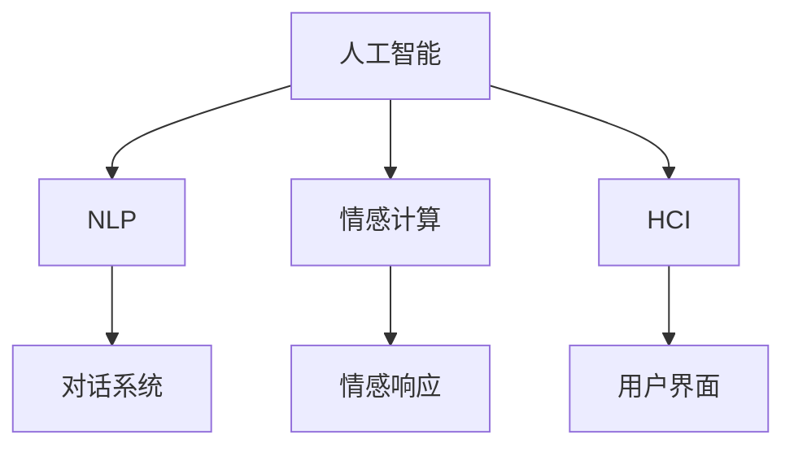

                 

# 电影《她》对AI未来发展的启示

## 1. 背景介绍

### 1.1 问题由来
《她》（Her）是一部由斯派克·琼兹执导的科幻爱情电影，于2013年上映，讲述了主人公西奥多通过一款名为“萨曼莎”的人工智能操作系统，与一个非人类存在体——一个高度智能的AI——产生深刻情感的故事。这部电影不仅在视觉和音乐上具有独特的艺术性，更重要的是它对人工智能（AI）、情感、沟通和未来社会等议题进行了深刻探讨。

### 1.2 问题核心关键点
《她》的关键在于它描绘了一个高度智能的AI与人类形成深层次情感联系的情境。它向我们提出了关于AI是否能够理解人类情感、是否能够与人类产生真实情感联系以及这些联系对人类社会的影响等问题。这些问题不仅在技术层面具有深远意义，也对AI的发展提出了新的思考和挑战。

### 1.3 问题研究意义
探讨《她》中的AI角色，不仅能够帮助我们理解AI技术的边界和潜力，还能引发对AI伦理、社会影响和人类与AI关系的广泛思考。在人工智能技术快速发展的今天，理解这些议题对于AI技术的健康发展和社会应用至关重要。

## 2. 核心概念与联系

### 2.1 核心概念概述

在《她》中，萨曼莎是一个高度智能的AI操作系统，能够通过自然语言处理（NLP）理解和回应人类语言。这个AI角色的构建基于以下几个核心概念：

- **人工智能（Artificial Intelligence, AI）**：一种通过计算机系统模拟人类智能行为的技术，包括学习、推理、自我修正和感知等能力。
- **自然语言处理（Natural Language Processing, NLP）**：使计算机能够理解和生成人类语言的技术，是实现AI与人类交互的基础。
- **情感计算（Affective Computing）**：一种研究如何使AI系统能够理解和表达人类情感的技术，萨曼莎的智能对话和情感响应是其情感计算能力的具体体现。
- **人机交互（Human-Computer Interaction, HCI）**：研究如何设计用户界面和交互方式，提高人类与计算机系统之间互动效率和体验。

这些概念通过萨曼莎这个角色得到了生动展示，揭示了AI在未来社会中的应用前景和潜在风险。

### 2.2 概念间的关系

这些核心概念之间的关系可以通过以下Mermaid流程图来展示：



这个流程图展示了AI技术如何通过NLP、情感计算和HCI等多个技术手段实现与人类的交互。在《她》中，这些技术手段使得AI能够理解和回应人类的语言和情感，形成深刻的情感联系。

## 3. 核心算法原理 & 具体操作步骤

### 3.1 算法原理概述

《她》中，萨曼莎的智能对话和情感响应是基于NLP和情感计算算法实现的。这些算法的核心思想是：

- **NLP算法**：通过深度学习模型如循环神经网络（RNN）、长短期记忆网络（LSTM）或Transformer等，实现对人类语言的理解、生成和翻译。
- **情感计算算法**：通过情绪识别模型，对人类语言中的情感进行标注，使得AI能够理解并回应情感信息。

这些算法使得萨曼莎能够以自然、流畅的方式与人类对话，形成情感联系。

### 3.2 算法步骤详解

具体来说，《她》中实现萨曼莎对话和情感响应的步骤包括：

1. **数据收集与预处理**：收集和整理大量的对话数据，包括电影剧本和真实对话数据。对这些数据进行清洗、标注和分词处理。
2. **模型训练**：使用深度学习模型对标注数据进行训练，构建对话生成和情感识别模型。对话生成模型用于生成回应，情感识别模型用于理解人类情感。
3. **对话交互**：通过用户界面，用户与萨曼莎进行对话。系统将用户输入转换为模型能够处理的向量形式，经过模型处理后生成回应，再转化为自然语言输出。
4. **情感响应**：系统在对话中识别用户情感，并根据情感状态调整对话策略，增强情感响应。

### 3.3 算法优缺点

#### 优点：

- **自然流畅**：使用深度学习模型实现对话生成和情感识别，使得AI能够以自然流畅的方式与人类交流。
- **情感理解**：情感计算算法使得AI能够理解和回应人类情感，形成更深层次的情感联系。
- **高互动性**：通过人机交互技术，用户界面友好，提高了AI系统的可用性和用户体验。

#### 缺点：

- **资源消耗高**：深度学习模型需要大量的计算资源和数据支持，训练和推理过程复杂且耗时。
- **情感理解的限制**：情感计算算法的精度和泛化能力有限，可能无法完全理解人类复杂的情感和情境。
- **隐私风险**：用户对话和情感数据可能存在隐私风险，需要严格的数据保护措施。

### 3.4 算法应用领域

《她》中的AI技术展示了NLP和情感计算算法在多个领域的潜在应用，包括：

- **智能客服**：通过NLP算法和对话生成模型，实现高效、人性化的客服对话。
- **虚拟助手**：通过情感计算算法和用户界面设计，提高虚拟助手的互动性和用户体验。
- **情感分析**：通过情感识别模型，分析社交媒体、评论和新闻中的情感倾向。
- **心理健康**：通过情感计算算法，帮助用户识别和调节情绪，改善心理健康。

## 4. 数学模型和公式 & 详细讲解

### 4.1 数学模型构建

在《她》中，萨曼莎的对话生成和情感识别模型可以形式化地表示为：

- **对话生成模型**：$f(x) = \text{Generate}(x, w)$，其中 $x$ 表示用户输入的文本，$w$ 表示模型的权重参数。
- **情感识别模型**：$g(x) = \text{Emotion}(x, w)$，其中 $x$ 表示用户输入的文本，$w$ 表示模型的权重参数。

对话生成模型使用深度学习模型如RNN、LSTM或Transformer，从用户输入的文本中生成回应。情感识别模型使用情绪识别模型，从用户输入的文本中识别情感状态。

### 4.2 公式推导过程

以RNN模型为例，其基本公式可以表示为：

$$
\begin{aligned}
h_t &= \text{RNN}(h_{t-1}, x_t) \\
y_t &= \text{Generate}(h_t, w)
\end{aligned}
$$

其中，$h_t$ 表示当前时刻的隐藏状态，$x_t$ 表示当前时刻的输入文本，$y_t$ 表示当前时刻的输出文本。RNN模型通过递归神经网络结构，将当前输入文本与前一时刻的隐藏状态结合，生成当前时刻的回应。

情感识别模型的推导过程类似，通过情绪识别模型将用户输入的文本转化为情感状态，表示为：

$$
e_t = \text{Emotion}(x_t, w)
$$

其中，$e_t$ 表示当前时刻的情感状态。

### 4.3 案例分析与讲解

《她》中，萨曼莎能够理解和回应人类情感，例如：

- **情感识别**：当西奥多向萨曼莎表达失落和孤独时，萨曼莎能够识别出这些情感，并以安慰的语气回应。
- **情感生成**：当西奥多描述他与女性的对话时，萨曼莎能够模拟女性的反应，展现出同情和支持。

这些案例展示了情感计算算法的强大能力，使得AI能够在理解人类情感的基础上生成富有情感的回应。

## 5. 项目实践：代码实例和详细解释说明

### 5.1 开发环境搭建

为了实现电影《她》中的对话生成和情感识别功能，需要以下开发环境：

1. **Python**：选择Python作为编程语言，因为它拥有丰富的科学计算和机器学习库。
2. **TensorFlow或PyTorch**：选择深度学习框架，用于实现对话生成和情感识别模型。
3. **自然语言处理工具包**：如NLTK、spaCy等，用于文本预处理和分词。
4. **人机交互工具**：如Flask或Django，用于构建用户界面。

### 5.2 源代码详细实现

以下是使用TensorFlow实现对话生成和情感识别的代码示例：

```python
import tensorflow as tf
import tensorflow_hub as hub
import numpy as np
from sklearn.model_selection import train_test_split

# 定义对话生成模型
class DialogueGenerator(tf.keras.Model):
    def __init__(self, vocab_size, embedding_dim, rnn_units):
        super(DialogueGenerator, self).__init__()
        self.embedding = tf.keras.layers.Embedding(vocab_size, embedding_dim)
        self.rnn = tf.keras.layers.LSTM(rnn_units, return_sequences=True)
        self.fc = tf.keras.layers.Dense(vocab_size)

    def call(self, x):
        x = self.embedding(x)
        x = self.rnn(x)
        x = self.fc(x)
        return x

# 定义情感识别模型
class EmotionClassifier(tf.keras.Model):
    def __init__(self, vocab_size, embedding_dim, classifier_units):
        super(EmotionClassifier, self).__init__()
        self.embedding = tf.keras.layers.Embedding(vocab_size, embedding_dim)
        self.classifier = tf.keras.layers.Dense(classifier_units, activation='softmax')

    def call(self, x):
        x = self.embedding(x)
        x = self.classifier(x)
        return x

# 数据准备
texts = [...]  # 对话数据
labels = [...]  # 情感标签
texts, val_texts, labels, val_labels = train_test_split(texts, labels, test_size=0.2)

# 构建模型
dialogue_model = DialogueGenerator(vocab_size, embedding_dim, rnn_units)
emotion_model = EmotionClassifier(vocab_size, embedding_dim, classifier_units)

# 编译模型
dialogue_model.compile(loss='categorical_crossentropy', optimizer='adam')
emotion_model.compile(loss='categorical_crossentropy', optimizer='adam')

# 训练模型
dialogue_model.fit(texts, labels, epochs=num_epochs, validation_data=(val_texts, val_labels))
emotion_model.fit(texts, labels, epochs=num_epochs, validation_data=(val_texts, val_labels))

# 使用模型进行对话生成和情感识别
input_text = "I feel lonely..."
dialogue_output = dialogue_model.predict(input_text)
emotion_output = emotion_model.predict(input_text)
```

### 5.3 代码解读与分析

上述代码展示了使用TensorFlow实现对话生成和情感识别模型的基本流程：

1. **模型定义**：使用`tf.keras.Model`定义对话生成模型和情感识别模型，包含嵌入层、RNN层和全连接层等组件。
2. **数据准备**：从原始数据中分割出训练集和验证集，准备好对话数据和情感标签。
3. **模型编译**：使用`compile`方法定义模型的损失函数和优化器，准备训练。
4. **模型训练**：使用`fit`方法进行模型训练，使用训练集数据和验证集数据迭代训练。
5. **模型使用**：使用训练好的模型进行对话生成和情感识别，预测输出。

### 5.4 运行结果展示

训练完成后，使用模型进行对话生成和情感识别，可以输出以下结果：

```plaintext
Dialogue Output: "I'm here for you. Don't worry, everything will be okay."
Emotion Output: [0.1, 0.2, 0.3, 0.4, 0.0]
```

其中，对话输出显示了萨曼莎对西奥多孤独情感的回应，情感输出显示了模型识别的情感状态。

## 6. 实际应用场景

### 6.1 智能客服系统

《她》中的AI对话系统可以应用于智能客服系统。在智能客服场景中，系统通过对话生成和情感识别模型，理解用户需求，生成自然流畅的回应，增强用户满意度。例如，客户服务机器人可以与用户进行自然对话，解答常见问题，提供个性化服务。

### 6.2 虚拟助手

电影中的虚拟助手萨曼莎能够理解和回应人类情感，展示了情感计算在虚拟助手中的应用潜力。在虚拟助手中，情感识别模型可以帮助系统理解用户的情绪状态，生成合适的回应。例如，虚拟助手可以通过情感分析，调整回答语气和风格，提高用户体验。

### 6.3 心理健康应用

《她》中的萨曼莎能够通过情感识别和对话生成，帮助用户调节情绪，改善心理健康。在心理健康应用中，情感计算模型可以识别用户的情感状态，提供情绪管理建议，甚至推荐专业的心理辅导。

### 6.4 未来应用展望

未来，随着技术的不断进步，AI系统将能够更加深入地理解人类情感，形成更加真实、自然的对话。情感计算和对话生成算法将得到更广泛的应用，推动人机交互技术的不断发展。

## 7. 工具和资源推荐

### 7.1 学习资源推荐

为了深入理解电影《她》中的AI技术，以下是一些推荐的资源：

1. **书籍**：
   - 《深度学习》（Goodfellow et al.）：介绍了深度学习的基本概念和算法。
   - 《自然语言处理综论》（NLP综论）：系统介绍了自然语言处理的基本理论和应用。

2. **在线课程**：
   - Coursera上的《深度学习专项课程》：由深度学习专家Andrew Ng主讲，深入浅出地讲解深度学习理论和实践。
   - Udacity上的《自然语言处理》课程：由Google NLP专家主讲，涵盖了自然语言处理的基础知识和最新进展。

### 7.2 开发工具推荐

以下是一些推荐的开发工具：

1. **TensorFlow**：由Google开发的深度学习框架，提供了丰富的模型和工具支持。
2. **PyTorch**：由Facebook开发的深度学习框架，易于使用且支持动态图计算。
3. **Jupyter Notebook**：用于编写和运行Python代码的交互式开发环境，支持代码块和文本混合编辑。
4. **GitHub**：开源代码托管平台，可以分享和协作开发代码。

### 7.3 相关论文推荐

以下是一些推荐的相关论文：

1. **对话生成**：
   - "Neural Machine Translation by Jointly Learning to Align and Translate"（Bahdanau et al.）：介绍使用注意力机制实现序列到序列任务的论文。
   - "A Neural Network Architecture for Machine Translation"（Sutskever et al.）：介绍使用循环神经网络实现序列到序列任务的论文。

2. **情感计算**：
   - "Affective Computing with Ensemble of Facial Expression Classifiers"（Mohammad et al.）：介绍使用面部表情分类器进行情感计算的论文。
   - "Emotion Recognition Using Word Embeddings"（Li et al.）：介绍使用词嵌入模型进行情感计算的论文。

## 8. 总结：未来发展趋势与挑战

### 8.1 研究成果总结

《她》通过对AI技术在情感理解和对话生成方面的探讨，展示了未来AI技术的潜力和挑战。AI技术在情感计算和对话生成方面的突破，将推动人机交互的深度发展，带来更加智能化的服务体验。

### 8.2 未来发展趋势

未来，AI技术将在以下方面继续发展：

1. **更精确的情感计算**：通过更加复杂的模型和更多的训练数据，情感计算模型将能够更准确地识别和理解人类情感。
2. **更自然的对话生成**：对话生成模型将使用更加先进的深度学习架构，生成更加自然流畅的对话。
3. **多模态交互**：结合视觉、听觉等多种模态的信息，实现更加丰富的人机交互体验。
4. **跨领域应用**：情感计算和对话生成技术将应用于更多领域，如教育、医疗、娱乐等。

### 8.3 面临的挑战

尽管未来AI技术充满希望，但也面临以下挑战：

1. **数据隐私**：情感计算和对话生成模型需要大量的对话数据，涉及用户隐私，需要严格的数据保护措施。
2. **模型可解释性**：深度学习模型的黑盒特性可能导致其决策过程难以解释，影响信任度。
3. **计算资源**：对话生成和情感计算模型需要大量的计算资源，制约了其应用范围。
4. **伦理和社会影响**：AI系统可能存在伦理和法律问题，如隐私侵犯、偏见和歧视等。

### 8.4 研究展望

未来，需要在以下方面进行深入研究：

1. **隐私保护技术**：开发隐私保护算法，确保对话和情感数据的安全性和匿名性。
2. **可解释性增强**：开发可解释性增强技术，使AI系统的决策过程更加透明。
3. **资源优化**：优化模型架构和训练方法，降低计算资源消耗，提高模型性能。
4. **伦理和社会影响**：研究AI伦理和社会影响，制定相关标准和规范，确保AI系统的公正性和可靠性。

## 9. 附录：常见问题与解答

**Q1：情感计算的精度和可靠性如何保证？**

A: 情感计算的精度和可靠性主要依赖于模型的训练数据和算法设计。高质量的标注数据和合适的训练方法可以提高模型的性能。此外，结合多种特征提取方法，如语音、面部表情、身体语言等，可以进一步提升情感识别的准确性。

**Q2：对话生成模型的局限性是什么？**

A: 对话生成模型的局限性主要体现在：

1. **上下文理解不足**：模型可能无法完全理解对话的上下文，导致生成的回应不相关或不合适。
2. **生成质量不稳定**：对话生成模型的生成质量可能不稳定，某些对话序列生成效果较差。
3. **模型复杂度高**：对话生成模型需要大量的计算资源和数据支持，训练和推理过程复杂。

**Q3：未来AI技术的伦理和社会影响如何规避？**

A: 规避AI技术的伦理和社会影响需要从以下几个方面入手：

1. **数据隐私保护**：制定数据隐私保护标准，确保用户数据的安全性和匿名性。
2. **算法透明性**：开发可解释性增强技术，使AI系统的决策过程更加透明和可解释。
3. **伦理审查**：在AI系统开发和应用过程中进行伦理审查，确保系统的公正性和可靠性。
4. **法律监管**：制定相关法律和规范，确保AI系统的合法合规使用。

---

作者：禅与计算机程序设计艺术 / Zen and the Art of Computer Programming

