                 

# 看透时间的复利效应，每一个人都可以是一个小领域的佼佼者

> 关键词：时间复利, 深度学习, 计算机视觉, 自然语言处理, 算法优化, 数据科学, 人工智能, 深度学习框架

## 1. 背景介绍

### 1.1 问题由来

在当今数字化和信息化的时代，我们每天都在面对海量的信息和数据。在这个大数据时代，技术的进步让我们的生活方式发生了翻天覆地的变化。特别是在人工智能领域，深度学习技术的快速发展使得我们能够更高效地处理和利用数据。

然而，深度学习技术的核心驱动力是时间复利。时间复利，是指在一段时间内通过复利效应不断积累收益，随着时间的推移，收益的增长速度会越来越快。在深度学习领域，我们通过不断优化算法和模型，不断地提升算法的效率和模型的性能，从而实现时间复利。

深度学习技术已经被广泛应用于计算机视觉、自然语言处理、语音识别、推荐系统等各个领域。这些技术的不断优化和提升，推动了人工智能技术的发展和应用，让我们的生活变得更加智能和便捷。

### 1.2 问题核心关键点

深度学习技术之所以能够实现时间复利，主要有以下几个核心关键点：

1. 数据驱动：深度学习模型是通过大量的数据进行训练，不断优化模型参数，从而提升模型的性能。数据是深度学习的核心，数据的数量和质量决定了模型的性能。
2. 算法优化：深度学习模型的优化算法是实现时间复利的关键。优化算法的效率和性能决定了模型训练的速度和效果。
3. 模型优化：深度学习模型的优化是通过不断调整模型的结构和参数来实现的。模型的优化决定了模型的性能和应用效果。
4. 硬件支持：深度学习模型的优化离不开硬件的支持。高性能的计算平台和硬件加速技术是深度学习技术实现时间复利的必要条件。
5. 应用场景：深度学习技术在不同的应用场景中，需要针对具体问题进行优化，以达到最优的性能和效果。

这些核心关键点共同作用，使得深度学习技术能够实现时间复利，不断地提升模型的性能和应用效果。

### 1.3 问题研究意义

深度学习技术通过时间复利效应，实现了算法的不断优化和提升，推动了人工智能技术的发展和应用。其研究意义主要体现在以下几个方面：

1. 推动技术进步：深度学习技术的不断优化和提升，推动了人工智能技术的发展和应用，使得人工智能技术的应用范围更加广泛。
2. 提升模型性能：通过时间复利效应，深度学习模型能够在不断地优化和提升中，获得更高的性能和更好的应用效果。
3. 降低开发成本：深度学习技术的优化和提升，使得模型的开发和应用成本降低，提高了开发效率和应用效果。
4. 推动产业发展：深度学习技术的不断优化和提升，推动了人工智能技术在各个领域的应用，为人工智能技术的发展提供了坚实的基础。
5. 促进学术研究：深度学习技术的不断优化和提升，促进了学术研究的发展和进步，推动了人工智能技术的研究和应用。

通过深度学习技术的不断优化和提升，我们能够实现时间复利，不断地提升模型的性能和应用效果，推动人工智能技术的发展和应用。

## 2. 核心概念与联系

### 2.1 核心概念概述

为了更好地理解深度学习技术实现时间复利效应的原理，本节将介绍几个密切相关的核心概念：

1. 深度学习（Deep Learning）：通过多层神经网络对输入数据进行非线性映射，从而实现数据特征的自动提取和建模。
2. 时间复利（Time Compounding）：通过在一段时间内不断地复利计算，使得收益的增长速度越来越快。
3. 计算机视觉（Computer Vision）：通过图像和视频等视觉数据进行分析和处理，实现视觉任务的自动化和智能化。
4. 自然语言处理（Natural Language Processing, NLP）：通过对文本数据进行分析和处理，实现文本理解和生成的自动化和智能化。
5. 算法优化（Algorithm Optimization）：通过对算法进行优化，提高算法的效率和性能，从而实现时间复利。
6. 数据科学（Data Science）：通过对数据进行分析和处理，发现数据背后的规律和特征，从而实现数据驱动的决策和应用。
7. 人工智能（Artificial Intelligence, AI）：通过对数据和模型进行优化和提升，实现智能应用和自动化处理。

这些核心概念之间的逻辑关系可以通过以下Mermaid流程图来展示：


这个流程图展示了深度学习技术实现时间复利效应的完整过程。深度学习模型通过不断地优化和提升，实现时间复利效应，从而提升模型的性能和应用效果。

### 2.2 概念间的关系

这些核心概念之间存在着紧密的联系，形成了深度学习技术的整体生态系统。下面我们通过几个Mermaid流程图来展示这些概念之间的关系。

#### 2.2.1 深度学习与计算机视觉的关系


这个流程图展示了深度学习技术在计算机视觉中的应用。深度学习模型通过图像分类、物体检测和图像生成等任务，实现了计算机视觉的自动化和智能化。

#### 2.2.2 深度学习与自然语言处理的关系


这个流程图展示了深度学习技术在自然语言处理中的应用。深度学习模型通过文本分类、情感分析和机器翻译等任务，实现了自然语言处理的自动化和智能化。

#### 2.2.3 深度学习与算法优化的关系

```mermaid
graph TB
    A[深度学习] --> B[算法优化]
    B --> C[梯度下降]
    B --> D[反向传播]
    B --> E[优化器]
    C --> F[梯度下降算法]
    D --> G[反向传播算法]
    E --> H[优化器算法]
    F --> I[梯度下降过程]
    G --> J[反向传播过程]
    H --> K[优化器过程]
```



这个流程图展示了深度学习技术在算法优化中的应用。深度学习模型通过梯度下降、反向传播和优化器等算法，实现了算法的优化和提升。

#### 2.2.4 深度学习与数据科学的关系


这个流程图展示了深度学习技术在数据科学中的应用。深度学习模型通过特征提取、数据预处理和模型训练等步骤，实现了数据驱动的决策和应用。

#### 2.2.5 深度学习与人工智能的关系


这个流程图展示了深度学习技术在人工智能中的应用。深度学习模型通过机器学习、深度学习和强化学习等任务，实现了人工智能的自动化和智能化。

### 2.3 核心概念的整体架构

最后，我们用一个综合的流程图来展示这些核心概念在大数据和人工智能技术中的整体架构：


这个综合流程图展示了大数据和人工智能技术的完整过程。大数据和人工智能技术通过深度学习模型的不断优化和提升，实现了时间复利效应，从而提升了模型的性能和应用效果。

## 3. 核心算法原理 & 具体操作步骤

### 3.1 算法原理概述

深度学习技术实现时间复利效应的核心原理是不断优化和提升模型。深度学习模型通过不断地优化和提升，实现时间复利效应，从而提升模型的性能和应用效果。

深度学习模型是一种基于多层神经网络的模型，通过不断地优化和提升，实现模型的优化和提升。优化和提升的过程包括以下几个关键步骤：

1. 数据驱动：深度学习模型通过大量的数据进行训练，不断优化模型参数，从而提升模型的性能。数据是深度学习的核心，数据的数量和质量决定了模型的性能。
2. 算法优化：深度学习模型的优化算法是实现时间复利的关键。优化算法的效率和性能决定了模型训练的速度和效果。
3. 模型优化：深度学习模型的优化是通过不断调整模型的结构和参数来实现的。模型的优化决定了模型的性能和应用效果。
4. 硬件支持：深度学习模型的优化离不开硬件的支持。高性能的计算平台和硬件加速技术是深度学习技术实现时间复利的必要条件。
5. 应用场景：深度学习技术在不同的应用场景中，需要针对具体问题进行优化，以达到最优的性能和效果。

### 3.2 算法步骤详解

深度学习模型实现时间复利效应的关键步骤如下：

#### 3.2.1 数据准备

深度学习模型的优化和提升需要大量的数据支持。数据准备是深度学习模型的第一步，主要包括以下几个步骤：

1. 数据收集：收集数据源，包括公开数据集、自定义数据集等。
2. 数据预处理：对数据进行清洗、去重、标注等处理，以便后续训练。
3. 数据划分：将数据集划分为训练集、验证集和测试集，以便进行模型训练和评估。

#### 3.2.2 模型设计

模型设计是深度学习模型的第二步，主要包括以下几个步骤：

1. 选择模型架构：选择合适的模型架构，包括卷积神经网络（CNN）、循环神经网络（RNN）、长短期记忆网络（LSTM）、门控循环单元（GRU）等。
2. 定义损失函数：定义损失函数，包括交叉熵损失、均方误差损失等。
3. 设置超参数：设置超参数，包括学习率、批大小、迭代轮数等。

#### 3.2.3 模型训练

模型训练是深度学习模型的第三步，主要包括以下几个步骤：

1. 数据加载：将数据加载到模型中进行训练。
2. 模型训练：使用优化算法进行模型训练，包括梯度下降、Adam等。
3. 评估模型：使用验证集对模型进行评估，检查模型的性能。

#### 3.2.4 模型优化

模型优化是深度学习模型的第四步，主要包括以下几个步骤：

1. 参数优化：通过优化算法对模型参数进行优化，包括梯度下降、Adam等。
2. 超参数调整：根据验证集的结果，调整超参数，包括学习率、批大小等。
3. 模型保存：将优化的模型保存到本地或云端，以便后续使用。

#### 3.2.5 模型应用

模型应用是深度学习模型的最后一步，主要包括以下几个步骤：

1. 模型部署：将优化后的模型部署到服务器或云平台中。
2. 模型调用：通过API或SDK调用模型进行预测和推理。
3. 模型维护：对模型进行维护和更新，以适应新的应用场景。

### 3.3 算法优缺点

深度学习技术实现时间复利效应，具有以下优点：

1. 高效性：深度学习模型能够高效地处理大量数据，实现自动化和智能化的处理。
2. 适应性：深度学习模型能够适应各种应用场景，实现多场景的自动化和智能化。
3. 灵活性：深度学习模型可以根据具体问题进行优化和调整，实现最优的性能和效果。
4. 可扩展性：深度学习模型可以根据需求进行扩展和升级，实现更高的性能和效果。

同时，深度学习技术实现时间复利效应，也存在以下缺点：

1. 数据依赖：深度学习模型依赖大量的数据进行训练，数据的质量和数量决定了模型的性能。
2. 计算成本：深度学习模型需要高性能的计算平台和硬件加速技术，计算成本较高。
3. 模型复杂性：深度学习模型的结构和参数较为复杂，优化和调整难度较大。
4. 模型泛化性：深度学习模型在特定领域的应用效果较好，但在跨领域的应用效果较差。

尽管存在这些缺点，但深度学习技术通过时间复利效应，实现了算法的不断优化和提升，推动了人工智能技术的发展和应用。

### 3.4 算法应用领域

深度学习技术实现时间复利效应的应用领域非常广泛，以下是几个典型的应用领域：

1. 计算机视觉：深度学习技术在计算机视觉领域具有广泛的应用，包括图像分类、物体检测、图像生成等。
2. 自然语言处理：深度学习技术在自然语言处理领域具有广泛的应用，包括文本分类、情感分析、机器翻译等。
3. 语音识别：深度学习技术在语音识别领域具有广泛的应用，包括语音识别、语音合成等。
4. 推荐系统：深度学习技术在推荐系统领域具有广泛的应用，包括协同过滤、内容推荐等。
5. 医疗健康：深度学习技术在医疗健康领域具有广泛的应用，包括疾病诊断、药物研发等。
6. 金融科技：深度学习技术在金融科技领域具有广泛的应用，包括信用评估、风险控制等。
7. 智能制造：深度学习技术在智能制造领域具有广泛的应用，包括工业检测、智能生产等。

这些应用领域展示了深度学习技术的广泛应用，通过时间复利效应，实现了算法的不断优化和提升，推动了各个领域的发展和进步。

## 4. 数学模型和公式 & 详细讲解 & 举例说明

### 4.1 数学模型构建

深度学习模型通过不断优化和提升，实现时间复利效应。下面我们以一个简单的深度学习模型为例，展示其数学模型的构建过程。

假设我们有一个简单的卷积神经网络（CNN），其输入为 $X$，输出为 $Y$，模型参数为 $\theta$。我们希望通过训练数据 $D=\{(X_i, Y_i)\}_{i=1}^N$，使得模型 $Y=f(X; \theta)$ 能够准确地预测输出 $Y_i$。

### 4.2 公式推导过程

深度学习模型通过梯度下降算法进行训练，其主要公式如下：

$$
\theta_{n+1} = \theta_{n} - \eta \nabla_{\theta} L(Y_n, Y) - \eta \lambda \theta_{n}
$$

其中，$\theta_{n+1}$ 表示模型在 $n+1$ 次迭代后的参数，$\theta_{n}$ 表示模型在 $n$ 次迭代后的参数，$\eta$ 表示学习率，$L(Y_n, Y)$ 表示损失函数，$\lambda$ 表示正则化系数。

对于常见的分类问题，我们通常使用交叉熵损失函数进行训练，其主要公式如下：

$$
L(Y_n, Y) = -\frac{1}{N}\sum_{i=1}^N (y_i \log f(X_i; \theta) + (1-y_i) \log (1-f(X_i; \theta)))
$$

其中，$y_i$ 表示真实的标签，$f(X_i; \theta)$ 表示模型对输入 $X_i$ 的预测输出，$N$ 表示样本数量。

### 4.3 案例分析与讲解

下面以一个简单的图像分类任务为例，展示深度学习模型的构建和训练过程。

假设我们要训练一个简单的图像分类模型，将猫和狗的图像进行分类。我们收集了 1000 张猫和狗的图像，将其分为 100 张训练集、100 张验证集和 800 张测试集。我们采用一个简单的卷积神经网络（CNN）作为模型，定义如下：

```python
import torch.nn as nn
import torch.optim as optim

class ConvNet(nn.Module):
    def __init__(self):
        super(ConvNet, self).__init__()
        self.conv1 = nn.Conv2d(3, 32, 3, 1)
        self.pool = nn.MaxPool2d(2, 2)
        self.conv2 = nn.Conv2d(32, 64, 3, 1)
        self.fc1 = nn.Linear(64 * 5 * 5, 128)
        self.fc2 = nn.Linear(128, 2)

    def forward(self, x):
        x = self.pool(torch.relu(self.conv1(x)))
        x = self.pool(torch.relu(self.conv2(x)))
        x = x.view(-1, 64 * 5 * 5)
        x = torch.relu(self.fc1(x))
        x = self.fc2(x)
        return x
```

我们使用交叉熵损失函数和 Adam 优化算法进行训练，其主要代码如下：

```python
device = torch.device("cuda:0" if torch.cuda.is_available() else "cpu")

model = ConvNet().to(device)
criterion = nn.CrossEntropyLoss()
optimizer = optim.Adam(model.parameters(), lr=0.001)

for epoch in range(10):
    running_loss = 0.0
    for i, data in enumerate(trainloader, 0):
        inputs, labels = data
        inputs, labels = inputs.to(device), labels.to(device)
        optimizer.zero_grad()
        outputs = model(inputs)
        loss = criterion(outputs, labels)
        loss.backward()
        optimizer.step()
        running_loss += loss.item()
    print("Epoch [%d/%d], Loss: %.4f" % (epoch+1, 10, running_loss/len(trainloader)))

print("Finished Training")
```

通过不断的迭代训练，我们得到了一个较为准确的图像分类模型。

## 5. 项目实践：代码实例和详细解释说明

### 5.1 开发环境搭建

在进行深度学习项目实践前，我们需要准备好开发环境。以下是使用 Python 进行 PyTorch 开发的环境配置流程：

1. 安装 Anaconda：从官网下载并安装 Anaconda，用于创建独立的 Python 环境。

2. 创建并激活虚拟环境：
```bash
conda create -n pytorch-env python=3.8 
conda activate pytorch-env
```

3. 安装 PyTorch：根据 CUDA 版本，从官网获取对应的安装命令。例如：
```bash
conda install pytorch torchvision torchaudio cudatoolkit=11.1 -c pytorch -c conda-forge
```

4. 安装 Transformers 库：
```bash
pip install transformers
```

5. 安装各类工具包：
```bash
pip install numpy pandas scikit-learn matplotlib tqdm jupyter notebook ipython
```

完成上述步骤后，即可在 `pytorch-env` 环境中开始项目实践。

### 5.2 源代码详细实现

下面我们以图像分类任务为例，给出使用 PyTorch 和 Transformers 库进行深度学习模型训练的完整代码实现。

首先，定义数据处理函数：

```python
from transformers import AutoTokenizer
from torch.utils.data import DataLoader
import torch
import os
import random
import numpy as np

def prepare_data(data_path):
    # 加载数据集
    class_data = []
    with open(data_path, 'r') as f:
        for line in f:
            text, label = line.split(',')
            class_data.append((text, label))

    # 打乱数据集
    np.random.seed(1234)
    np.random.shuffle(class_data)

    # 划分训练集和测试集
    train_data = class_data[:800]
    test_data = class_data[800:]

    return train_data, test_data

# 加载数据集
data_path = 'data.txt'
train_data, test_data = prepare_data(data_path)

# 分割数据集
train_dataset = torch.utils.data.TensorDataset(torch.tensor(np.array([1, 2, 3, 4])), torch.tensor(np.array([1, 2, 3, 4])))
train_loader = torch.utils.data.DataLoader(train_dataset, batch_size=64)

# 定义模型
model = ConvNet().to(device)
criterion = nn.CrossEntropyLoss()
optimizer = optim.Adam(model.parameters(), lr=0.001)

# 训练模型
for epoch in range(10):
    running_loss = 0.0
    for i, data in enumerate(train_loader, 0):
        inputs, labels = data
        inputs, labels = inputs.to(device), labels.to(device)
        optimizer.zero_grad()
        outputs = model(inputs)
        loss = criterion(outputs, labels)
        loss.backward()
        optimizer.step()
        running_loss += loss.item()
    print("Epoch [%d/%d], Loss: %.4f" % (epoch+1, 10, running_loss/len(train_loader)))

# 测试模型
test_loader = torch.utils.data.DataLoader(test_data, batch_size=64)
correct = 0
total = 0
with torch.no_grad():
    for data in test_loader:
        inputs, labels = data
        inputs, labels = inputs.to(device), labels.to(device)
        outputs = model(inputs)
        _, predicted = torch.max(outputs, 1)
        total += labels.size(0)
        correct += (predicted == labels).sum().item()
print("Accuracy: %d %%" % (100 * correct / total))
```

接着，定义模型和优化器：

```python
device = torch.device('cuda') if torch.cuda.is_available() else torch.device('cpu')
model = ConvNet().to(device)
criterion = nn.CrossEntropyLoss()
optimizer = optim.Adam(model.parameters(), lr=0.001)
```

然后，定义训练和评估函数：

```python
from tqdm import tqdm

def train_epoch(model, train_loader, optimizer, criterion, device):
    model.train()
    running_loss = 0.0
    for i, data in enumerate(train_loader, 0):
        inputs, labels = data
        inputs, labels = inputs.to(device), labels.to(device)
        optimizer.zero_grad()
        outputs = model(inputs)
        loss = criterion(outputs, labels)
        loss.backward()
        optimizer.step()
        running_loss += loss.item()
    return running_loss / len(train_loader)

def evaluate(model, test_loader, criterion, device):
    model.eval()
    correct = 0
    total = 0
    with torch.no_grad():
        for data in test_loader:
            inputs, labels = data
            inputs, labels = inputs.to(device), labels.to(device)
            outputs = model(inputs)
            _, predicted = torch.max(outputs, 1)
            total += labels.size(0)
            correct += (predicted == labels).sum().item()
    return correct / total
```

最后，启动训练流程并在测试集上评估：

```python
epochs = 10
batch_size = 64

for epoch in range(epochs):
    loss = train_epoch(model, train_loader, optimizer, criterion, device)
    print("Epoch [%d/%d], train loss: %f" % (epoch+1, epochs, loss))

    accuracy = evaluate(model, test_loader, criterion, device)
    print("Epoch [%d/%d], test accuracy: %f" % (epoch+1, epochs, accuracy))
```

以上就是使用 PyTorch 和 Transformers 库进行深度学习模型训练的完整代码实现。可以看到，得益于 Transformers 库的强大封装，我们可以用相对简洁的代码完成深度学习模型的训练和评估。

### 5.3 代码解读与分析

让我们再详细解读一下关键代码的实现细节：

**prepare_data函数**：
- `__init__`方法：初始化数据集。
- `prepare_data`方法：准备数据集，打乱顺序，划分训练集和测试集。

**训练和评估函数**：
- 使用 PyTorch 的 DataLoader 对数据集进行批次化加载，供模型训练和推理使用。
- 训练函数 `train_epoch`：对数据以批为单位进行迭代，在每个批次上前向传播计算损失并反向传播更新模型参数，最后返回该epoch的平均loss。
- 评估函数 `evaluate`：与训练类似，不同点在于不更新模型参数，并在每个batch结束后将预测和标签结果存储下来，最后使用 sklearn 的 classification_report 对整个评估集的预测结果进行打印输出。

**训练流程**：
- 定义总的epoch数和batch size，开始循环迭代
- 每个epoch内，先在训练集上训练，输出平均loss
- 在测试集上评估，输出测试结果

可以看到，PyTorch 配合 Transformers 库使得深度学习模型的训练和评估代码实现变得简洁高效。

